Microresp pipeline
================
David Rodrigo Cajas
2025-04-23

- [Important](#important)
- [0) Data import](#0-data-import)
  - [0.1) Working directory and
    packages](#01-working-directory-and-packages)
  - [0.2) Importing working data](#02-importing-working-data)
  - [0.3) Import samples metadata](#03-import-samples-metadata)
  - [0.4) Import %CO2 calibration
    values](#04-import-co2-calibration-values)
- [1) Data processing: Operations on created
  dataframes](#1-data-processing-operations-on-created-dataframes)
  - [1.1) Calculate normalised absorbance values and add calibration
    %CO2 values from “calvalues”
    object](#11-calculate-normalised-absorbance-values-and-add-calibration-co2-values-from-calvalues-object)
  - [1.2) Fitting a model](#12-fitting-a-model)
  - [1.3) Estimate %CO2 values for
    samples](#13-estimate-co2-values-for-samples)
  - [1.4) Estimate microbial respiration
    rates](#14-estimate-microbial-respiration-rates)
  - [1.5) Merge data and export.](#15-merge-data-and-export)
- [2) Plotting data and model](#2-plotting-data-and-model)
  - [2.1) Plot Model(s)](#21-plot-models)
  - [2.2) Plot active model with
    samples](#22-plot-active-model-with-samples)
  - [2.3) All samples](#23-all-samples)
  - [2.4) Sanity check](#24-sanity-check)
- [3) Data analysis](#3-data-analysis)
  - [3.0) Import dataset](#30-import-dataset)
  - [3.1) Sub-setting like crazy: Relevant filters based on analyses
    performed in
    2)](#31-sub-setting-like-crazy-relevant-filters-based-on-analyses-performed-in-2)
  - [3.2) Further analysis](#32-further-analysis)
  - [3.2.2) Respiration rate of a
    subset](#322-respiration-rate-of-a-subset)
- [4) Statistics](#4-statistics)

## Important

``` r
# R version 4.2.2 (2022-10-31) -- "Innocent and Trusting"
# Copyright (C) 2022 The R Foundation for Statistical Computing
# Platform: x86_64-apple-darwin17.0 (64-bit)

# Author: David Rodrigo Cajas
```

This R script expects the following files to be in the same folder as
the script file to properly run:

- “Results_microresp_Calc.xlsx” as an excel spreadsheet containing the
  microresp spectrometer data in a single page per plate. The
  spreadsheet is assumed to follow this strict column order:
  - A: Well position in the agar plate of your Microresp system.
  - B: Comments (will be omitted from analyses).
  - C: Sample labels. Calibration points are expected to be labelled
    “CX”, samples “SX” and “H2O” is assumed for the blank.
  - D: Spectrometer reading at 570 nm before exposing the agar plate.
  - E: Spectrometer reading at 570 nm after exposing the agar plate.
  - I: List of sample names to be considered in analysis in “SX” format.
  - J: Sample identifier in the structure “var1_var2_var3_R”, where var
    are the variable short names and R is the replicate/block number.
- “experiment_metadata.xlsx” as an excel spreadsheet containing metadata
  for each experimental variable separated by pages, so each page has
  the metadata concerning 1 variable.
  - Column “A” values on each page are expected to match at lease 1 of
    the variables within the Column “J” in “Results_microresp_Calc.xlsx”
    file.
  - The number of pages of this file should correspond to the number of
    variables in the identifiers contained in the column “J” in
    “Results_microresp_Calc.xlsx” file.
- “co2cal.xlsx” as a spreadsheet of 2 columns, where:
  - Column “A” is expected to match the sample labels in column “C” of
    “Results_microresp_Calc.xlsx” file for the calibration points.
  - Column “B” is expected to contain the %CO2 values for those points.
- “required_packages.rds” is an R object file containing the list of
  packages required to run this script.

Now let’s get to it…

## 0) Data import

### 0.1) Working directory and packages

First we need to install the Rstudioapi package

``` r
# (Install and) load Rstudio api package
if ("rstudioapi" %in% installed.packages()) {
  library(rstudioapi)
} else {
  install.packages("rstudioapi")
  library(rstudioapi)
} 
```

Now we will set the working directory to where the R markdown folder is

``` r
wd <- dirname(rstudioapi::getSourceEditorContext()$path)
# wd <- "/Users/davidcajasmunoz/Library/CloudStorage/GoogleDrive-dadavid.cajas@gmail.com/Mi unidad/Academia/Postgrado/UvA/Results and experiments track/Experiment 1 - Inoculants and amendments on crops and grasses/9-Analysis/2-Microresp/Samples"

setwd(wd)
```

Import the list of packages in “required_packages.rds” and install them

``` r
# Load list of required packages
required_packages <- readRDS("required_packages.rds")
# Install script's required packages
need_install <- required_packages[!(required_packages) %in% installed.packages()]
if (length(need_install) > 0) {
  install.packages(need_install)
}
```

\[Later on\] If you modified this code, don’t forget to update the list
of script’s required packages

``` r
# required_packages <- names(sessionInfo()$otherPkgs)
# saveRDS(required_packages, "required_packages.rds")
```

### 0.2) Importing working data

This chunk imports all pages inside the “Results_microresp_Calc.xlsx”
excel file as dataframes of 4 columns and 97 rows, replacing the names
of the rows for standardised ones

IMPORTANT: NOTE THAT THIS CODE ASSUMES THE COLUMNS ARE IN A PARTICULAR
ORDER:

- A = Well

- B = non relevant \[ignored\]

- C = Sample_ID

- D = Absorbance before

- E = Absorbance after

``` r
library(readxl)
library(dplyr)
```

    ## 
    ## Attaching package: 'dplyr'

    ## The following objects are masked from 'package:stats':
    ## 
    ##     filter, lag

    ## The following objects are masked from 'package:base':
    ## 
    ##     intersect, setdiff, setequal, union

``` r
library(stringr)
library(gtools)

# set the file containing the data
sourcefile <- "Results_microresp_Calc.xlsx"

for (i in 1:length(excel_sheets(sourcefile))) {
  # Import data
  
  df <- read_excel(sourcefile, sheet = i, range = "A1:E97", col_types = c("text", "skip", "text", "numeric", "numeric")) # import columns A to E and rows 1 to 97 from sheet i, skipping the second column and the other 4 in format chr, chr, int, int
  
  # Small adjustments
  
  colnames(df) <- c("well", "sample", "A570_0h", "A570_6h") # rename columns
  df <- mutate(df, 
               row = str_extract(well, "^[A-Z]"),
               col = factor(as.factor(str_extract(well, "\\d+")), levels = c(seq(1,12,1)))
  ) # add separate columns for the coordinates of the sample in the plate (contained in "well" column)
  
  # Wrap up
  
  assign(paste("mr",i, sep=""), df) # name output dataframe
  rm(df,i) # remove auxiliary "df" and "i" objects
}

# list all created dataframes so they can be easily called back
dfs <- mixedsort(ls(pattern = "^mr\\d+$"))
```

### 0.3) Import samples metadata

#### 0.3.1) Import metadata from samples processed in Microresp

``` r
library(readxl)
library(stringr)
library(tidyr)

#Import sample labels from Microresp spreadsheet

for (i in 1:length(excel_sheets(sourcefile))) {
  # Import data
  
  df <- read_excel(sourcefile, sheet = i, range = "I1:J97", col_names = FALSE, col_types = c("text", "text")) # import columns A to E and rows 1 to 97 from sheet i, skipping the second column and the other 4 in format chr, chr, int, int
  
  # Delete NA rows
  df <- df[complete.cases(df), ]
  
  # Small adjustments
  
  colnames(df) <- c("sample", "condition") # rename columns
  
  # add separate columns for each of the conditions encoded in the "J" column, now named "condition
  df <- separate(df, 
                 col = condition, 
                 into = c("plant", "soil", "treatment", "replicate"), 
                 sep = "_")
  
  # Wrap up
  
  assign(paste("mr",i,"_meta", sep=""), df) # name output dataframe
  rm(df,i) # remove auxiliary "df" and "i" objects
}
```

    ## New names:
    ## New names:
    ## New names:
    ## New names:
    ## New names:
    ## New names:
    ## New names:
    ## New names:
    ## New names:
    ## New names:
    ## New names:
    ## New names:
    ## • `` -> `...1`
    ## • `` -> `...2`

    ## Warning: Expected 4 pieces. Missing pieces filled with `NA` in 1 rows [1].

    ## New names:
    ## New names:
    ## New names:
    ## New names:
    ## New names:
    ## New names:
    ## • `` -> `...1`
    ## • `` -> `...2`

``` r
# list all created metadata dataframes so they can be easily called back
mdfs <- mixedsort(ls(pattern = "^mr\\d+_meta$"))
```

#### 0.3.2) Import experiment metadata

Note that this script imports the metadata from
“experiment_metadata.xlsx” assuming that it’s separated by sheets called
“treatment_data”, “soil_data” and “plant_data”. The order is not
relevant.

``` r
# Define source of experiment metadata

sourcemeta <- "experiment_metadata.xlsx"

for (i in excel_sheets(sourcemeta)) {
  # Import data
  
  df <- read_excel(sourcemeta, sheet = i) # import all experiment metadata in separated dataframes per sheet
  
  # Wrap up
  
  assign(i, df) # name output dataframe
  rm(df,i) # remove auxiliary "df" and "i" objects
}

# Add order to treatments
treatment_data$label <- factor(as.factor(treatment_data$label), levels = c("Control", "Disease suppression", "AMF", "Nitrogen fixation", "Phosphate solubilisation"))
treatment_data$applied_product <- factor(as.factor(treatment_data$applied_product), levels = c("No product", "Compete Plus", "MycorGran 2.0", "Vixeran", "NuelloPhos"))

# Small processing of soil data

numeric_cols <- names(soil_data)[sapply(soil_data, function(x) any(grepl("[0-9]", x)))] # Auxiliary object listing the columns that contain numbers
soil_data[numeric_cols] <- lapply(soil_data[numeric_cols], function(x) {
  x <- ifelse(grepl("^<", x), 0, x) # Identify values beginning with "<", which are below detection limitm and replace them with 0
  x <- as.numeric(x)  # Convert to numeric AFTER cleaning
  x
}) # This function replaces values that start with "<" with 0
rm(numeric_cols) # Remove auxiliary object

## On develop: Check soil texture and include in metadata if not there already.

# library(soiltexture)
# library(ggplot2)
# 
# TT.text(data.frame(
#   soil = soil_data$soil,
#   SAND = soil_data$sand_perc,
#   SILT = soil_data$silt_perc,
#   CLAY = soil_data$clay_perc
# ), geo = "USDA"
# )
```

#### 0.3.3) Extract relevant experiment metadata and add to Microresp metadata dataframes

``` r
# Define relevant metadata to extract. This can be modified for further customisation
pick_metadata <- c(colnames(soil_data[,c(3,6,10:14)]), # chosen metadata columns in soil_data
                   colnames(treatment_data[,c(3,5:14)]), # chosen metadata columns in treatment_data
                   colnames(plant_data[,c()])) # chosen metadata columns in plant_data

# Create a function to replace values in a common column. It will be used to replace labels
replace_values <- function(df1, df2, col_name, new_col_name) {
  df1 %>%
    left_join(df2, by = col_name) %>%  # Join with lookup table
    mutate(!!col_name := !!sym(new_col_name)) %>% # Replace original values with labels
    select(-!!sym(new_col_name))
} # replaces the values of the col_name column in the df1 for the values of the new_col_name in the df2, assuming col_name exist in both dataframes

# Add selected metadata and change labels to metadata dataframe

for (i in mdfs) {
  df <- get(i) # get the object
  
  # Apply formulas
  df <- df %>%
    
    # Add defined metadata
    
    left_join(select(plant_data, "plant",any_of(pick_metadata)), by = "plant") %>%
    left_join(select(soil_data, "soil",any_of(pick_metadata)), by = "soil") %>%
    left_join(select(treatment_data, "treatment",any_of(pick_metadata)), by = "treatment") %>%
    
    # Replace compressed labels for full size variables
    
    replace_values(plant_data[,1:2], "plant", "label") %>%
    replace_values(soil_data[,1:2], "soil", "label") %>%
    replace_values(treatment_data[,1:2], "treatment", "label")
  
  # Wrap up
  
  assign(i,df) # write back on the original dataframe
  rm(df,i) # remove auxiliary objects
  
}
```

#### 0.3.4) Paste Microresp metadata dataframes from 0.3.3) into Microresp dataframes imported in 0.2)

``` r
for (i in dfs) {
  df <- get(i) # get the object
  df_meta <- get(paste(i,"_meta",sep = ""))
  
  # Add metadata
  
  df <- left_join(df,df_meta,by = "sample")
  
  # Wrap up
  
  assign(i,df) # write back on the original dataframe
  rm(df,df_meta,i) # remove auxiliary objects
  
}

# Delete auxiliary objects if desired

# rm(pick_metadata,mdfs)
```

### 0.4) Import %CO2 calibration values

This is just stored separately in another file called “co2cal.xlsx”

``` r
calvalues <- read_excel("co2cal.xlsx", col_names = c("sample","CO2_per"), col_types =c("text","numeric"))
```

## 1) Data processing: Operations on created dataframes

### 1.1) Calculate normalised absorbance values and add calibration %CO2 values from “calvalues” object

The following formula is used to calculate normalised absorbance:

$$\
A_i = \frac{A_{t6}}{A_{t0}}*µ_{{A_{t0}}}$$

``` r
for (i in dfs) {
  df <- get(i) # get the object
  
  # Apply formulas
  
  df$AAdjusted <- (df$A570_6h / df$A570_0h)*mean(df$A570_0h) # Normalisation formula
  df$AAdjusted[is.infinite(df$AAdjusted) | is.nan(df$AAdjusted)] <- NA  # Replace NAs and infinite values for NA
  
  # Add calibration values
  
  df <- merge(df, calvalues, by = "sample", all.x = T, sort = F)
  
  # Error check and report
  
  missing_cal <- df$sample %in% c(paste0("C", 1:20),"H2O") & is.na(df$CO2_per)
  if (any(missing_cal)) {
    print(paste("[ Calibration error in:",i,"]","Missing calibration values for:", paste(df$sample[missing_cal], collapse = ", ")))
  }
  
  # Wrap up
  
  assign(i,df) # write back on the original dataframe
  rm(df,i, missing_cal) # remove auxiliary objects
}
```

### 1.2) Fitting a model

For easier management, each Microresp dataset will be split into a
calibration (to fit the model) and a sample subsets (to analyse later).

``` r
## Split dataframes into "calibration" and "sample" subsets

for (i in dfs) {
  df <- get(i) # get the object

  is_sample <- grepl("^S[0-9]+$", df$sample) # logical vector where SX values are TRUE and the rest, FALSE
  cal <- df$sample %in% c(paste0("C", 1:20)
                          ,"H2O" # Include/Exclude H2O from calibration set
                          ) # logical vector where CX and H2O values are TRUE and the rest, FALSE
  
  # Create new dataframes based on the boolean vector just created
  
  df.c <- df[cal, ]
  df.s <- df[is_sample, ]
  
  # Add a column for sample number in the sample dataframes
  
  df.s <- mutate(df.s, sample_number = as.numeric(gsub("S", "", sample)))
  
  # Store new dataframes
  
  assign(paste0(i, "_c"), df.c)
  assign(paste0(i, "_s"), df.s)
  
  # Wrap up

  rm(df,i, is_sample, cal, df.c, df.s) # remove auxiliary "df" and "i" objects
}
```

#### 1.2.1) Create auxiliary objects

``` r
dfs_c <- mixedsort(ls(pattern = "^mr\\d+_c$"))
dfs_s <- mixedsort(ls(pattern = "^mr\\d+_s$"))
```

#### 1.2.2) Fit model

This approach seems a bit complex because it contains 3 nested loops.
Nonetheless, essentially it fits the data on each calibration dataset to
the calibration values imported assuming the following formula:

$$
\%CO2 = A+\frac{B}{1+D*A_i}
$$

The reason for the loops are as follows:

1.  The first loop (for{}) runs iteratively over all calibration
    datasets, so it gets a model for each one.
2.  The second loop (for{}) runs all different optimisation algorithms
    for the fitting function in an effort to ensure that a solution is
    found following the procedure in the third loop. After the third
    loop is finished, it will check if a “model” was stored. If yes, it
    will save it into a new object. If not, it will create a warning
    message.
3.  The third loop (tryCatch{}) gives a more robust approach to errors.
    tryCatch will “try” the code with the first algorithm defined in the
    previous loop. If it succeeds, it will jump directly to report the
    found model. If not, it will create a warning message.

``` r
expected_models <- data_frame(paste0("mod_", dfs_c),excel_sheets(sourcefile),rep(FALSE,length(dfs_c))) # Create a dataframe containing the names of the expected models, the excel sheet for the data they fir to and if they were successfully obtained (for new, this column is set to FALSE)
```

    ## Warning: `data_frame()` was deprecated in tibble 1.1.0.
    ## ℹ Please use `tibble()` instead.
    ## This warning is displayed once every 8 hours.
    ## Call `lifecycle::last_lifecycle_warnings()` to see where this warning was
    ## generated.

``` r
colnames(expected_models) <- c("model","datasheet","obtained")

for (i in dfs_c) { 
  # this approach has 3 nested loops. This is the [1]
  
  df <- get(i) # get the object
  
  # Fit model: Nested for() [2] loop was implemented so different optimisation algorithms can by tried
  
  algorithms <- c("default", "port", "plinear") # List of algorithms to try
  
  for (algorithm in algorithms) { 
    
    # The modeling function is further nested [3] in the TryCatch function
    
    tryCatch({ # tryCatch prevents the loop from stopping if the modeling is unsuccessful
    
    # Model itself: It will get stored in an auxiliary "m" object
    m <- nls(CO2_per ~ a + b / (1 + d * AAdjusted), 
             data = df, 
             start = list(a = -2, b = -10, d = -6.8), # the values for a, b and d used as start are taken from the manual
             control = nls.control(minFactor = 1e-10, maxiter = 1e7),
             algorithm = algorithm) # Here is the list of algorithms created in the first for() loop
    
    break # If the previous code lines did not halt, this line will break out of the [2] algorithm loop, effectively stopping it.
    
  } # If the code was halted before (ie: nls() function halted and no model was produced), then the following code will be run.
    
    , error = function(e) {
      cat("[ Error fitting model for", i,"using",algorithm, "algorithm ]", ":\n", conditionMessage(e), "\n")
    }
    , warning = function(w) {
      cat("[ Warning fitting model for", i,"]", ":\n", conditionMessage(w), "\n")
    })
  }
  
  # Wrap up
  
  if (exists("m")) { # If a model exists, a success message and store the model (if fit was successful)
    print(paste("Model for", i, "successful using",algorithm,"algorithm:"))
    print(summary(m))
    
    assign(paste0("mod_", i), m) # Save the model with a given name based on the calibration dataframe name
    expected_models$obtained[str_which(dfs_c, i)] <- TRUE # Flag the model as obtained
  } else { # If a model does not exist, print an error message.
    cat("[ Error: Failed to fit model for", i, "using all algorithms. Skipping. ]\n")
  }
  
  rm(df,i, m, algorithm, algorithms) # remove auxiliary objects
}
```

    ## [1] "Model for mr1_c successful using default algorithm:"
    ## 
    ## Formula: CO2_per ~ a + b/(1 + d * AAdjusted)
    ## 
    ## Parameters:
    ##   Estimate Std. Error t value Pr(>|t|)    
    ## a  -0.6769     0.1595  -4.243 0.000136 ***
    ## b  -2.1912     0.5518  -3.971 0.000308 ***
    ## d  -3.6818     0.2508 -14.678  < 2e-16 ***
    ## ---
    ## Signif. codes:  0 '***' 0.001 '**' 0.01 '*' 0.05 '.' 0.1 ' ' 1
    ## 
    ## Residual standard error: 0.392 on 38 degrees of freedom
    ## 
    ## Number of iterations to convergence: 8 
    ## Achieved convergence tolerance: 2.499e-06
    ## 
    ## [ Error fitting model for mr2_c using default algorithm ] :
    ##  singular gradient 
    ## [1] "Model for mr2_c successful using port algorithm:"
    ## 
    ## Formula: CO2_per ~ a + b/(1 + d * AAdjusted)
    ## 
    ## Parameters:
    ##   Estimate Std. Error t value Pr(>|t|)    
    ## a  -2.2571     2.4432  -0.924    0.372    
    ## b  -1.0164     1.4207  -0.715    0.487    
    ## d  -1.1571     0.1499  -7.721 3.29e-06 ***
    ## ---
    ## Signif. codes:  0 '***' 0.001 '**' 0.01 '*' 0.05 '.' 0.1 ' ' 1
    ## 
    ## Residual standard error: 0.6946 on 13 degrees of freedom
    ## 
    ## Algorithm "port", convergence message: relative convergence (4)
    ## 
    ## [1] "Model for mr3_c successful using default algorithm:"
    ## 
    ## Formula: CO2_per ~ a + b/(1 + d * AAdjusted)
    ## 
    ## Parameters:
    ##   Estimate Std. Error t value Pr(>|t|)    
    ## a -0.61938    0.08704  -7.116 7.86e-06 ***
    ## b -2.23224    0.32930  -6.779 1.30e-05 ***
    ## d -4.05531    0.15860 -25.570 1.68e-12 ***
    ## ---
    ## Signif. codes:  0 '***' 0.001 '**' 0.01 '*' 0.05 '.' 0.1 ' ' 1
    ## 
    ## Residual standard error: 0.1324 on 13 degrees of freedom
    ## 
    ## Number of iterations to convergence: 6 
    ## Achieved convergence tolerance: 7.167e-08
    ## 
    ## [1] "Model for mr4_c successful using default algorithm:"
    ## 
    ## Formula: CO2_per ~ a + b/(1 + d * AAdjusted)
    ## 
    ## Parameters:
    ##   Estimate Std. Error t value Pr(>|t|)    
    ## a -0.19868    0.06878  -2.888   0.0127 *  
    ## b -0.60458    0.08670  -6.973 9.72e-06 ***
    ## d -4.33246    0.06252 -69.296  < 2e-16 ***
    ## ---
    ## Signif. codes:  0 '***' 0.001 '**' 0.01 '*' 0.05 '.' 0.1 ' ' 1
    ## 
    ## Residual standard error: 0.1757 on 13 degrees of freedom
    ## 
    ## Number of iterations to convergence: 6 
    ## Achieved convergence tolerance: 1.744e-07
    ## 
    ## [1] "Model for mr5_c successful using default algorithm:"
    ## 
    ## Formula: CO2_per ~ a + b/(1 + d * AAdjusted)
    ## 
    ## Parameters:
    ##   Estimate Std. Error t value Pr(>|t|)    
    ## a -0.62129    0.06614  -9.394 3.70e-07 ***
    ## b -2.03125    0.22314  -9.103 5.29e-07 ***
    ## d -3.50641    0.09532 -36.785 1.58e-14 ***
    ## ---
    ## Signif. codes:  0 '***' 0.001 '**' 0.01 '*' 0.05 '.' 0.1 ' ' 1
    ## 
    ## Residual standard error: 0.1 on 13 degrees of freedom
    ## 
    ## Number of iterations to convergence: 7 
    ## Achieved convergence tolerance: 2.403e-06
    ## 
    ## [1] "Model for mr6_c successful using default algorithm:"
    ## 
    ## Formula: CO2_per ~ a + b/(1 + d * AAdjusted)
    ## 
    ## Parameters:
    ##   Estimate Std. Error t value Pr(>|t|)    
    ## a -0.26260    0.06691  -3.925  0.00174 ** 
    ## b -0.84022    0.10972  -7.658  3.6e-06 ***
    ## d -4.35786    0.07489 -58.192  < 2e-16 ***
    ## ---
    ## Signif. codes:  0 '***' 0.001 '**' 0.01 '*' 0.05 '.' 0.1 ' ' 1
    ## 
    ## Residual standard error: 0.1626 on 13 degrees of freedom
    ## 
    ## Number of iterations to convergence: 5 
    ## Achieved convergence tolerance: 7.77e-06
    ## 
    ## [1] "Model for mr7_c successful using default algorithm:"
    ## 
    ## Formula: CO2_per ~ a + b/(1 + d * AAdjusted)
    ## 
    ## Parameters:
    ##   Estimate Std. Error t value Pr(>|t|)    
    ## a  -1.2984     0.2534  -5.123 0.000196 ***
    ## b  -7.6044     3.0289  -2.511 0.026062 *  
    ## d  -6.0472     1.2108  -4.994 0.000245 ***
    ## ---
    ## Signif. codes:  0 '***' 0.001 '**' 0.01 '*' 0.05 '.' 0.1 ' ' 1
    ## 
    ## Residual standard error: 0.2247 on 13 degrees of freedom
    ## 
    ## Number of iterations to convergence: 5 
    ## Achieved convergence tolerance: 3.911e-06
    ## 
    ## [1] "Model for mr8_c successful using default algorithm:"
    ## 
    ## Formula: CO2_per ~ a + b/(1 + d * AAdjusted)
    ## 
    ## Parameters:
    ##   Estimate Std. Error t value Pr(>|t|)    
    ## a  -1.3801     0.2098  -6.579 1.77e-05 ***
    ## b  -5.4077     1.4840  -3.644  0.00297 ** 
    ## d  -3.9462     0.4478  -8.812 7.64e-07 ***
    ## ---
    ## Signif. codes:  0 '***' 0.001 '**' 0.01 '*' 0.05 '.' 0.1 ' ' 1
    ## 
    ## Residual standard error: 0.1515 on 13 degrees of freedom
    ## 
    ## Number of iterations to convergence: 6 
    ## Achieved convergence tolerance: 1.306e-06
    ## 
    ## [1] "Model for mr9_c successful using default algorithm:"
    ## 
    ## Formula: CO2_per ~ a + b/(1 + d * AAdjusted)
    ## 
    ## Parameters:
    ##   Estimate Std. Error t value Pr(>|t|)    
    ## a  -0.9041     0.2068  -4.372 0.000756 ***
    ## b  -4.0341     1.3017  -3.099 0.008462 ** 
    ## d  -5.2759     0.6334  -8.329 1.43e-06 ***
    ## ---
    ## Signif. codes:  0 '***' 0.001 '**' 0.01 '*' 0.05 '.' 0.1 ' ' 1
    ## 
    ## Residual standard error: 0.249 on 13 degrees of freedom
    ## 
    ## Number of iterations to convergence: 7 
    ## Achieved convergence tolerance: 1.971e-06
    ## 
    ## [1] "Model for mr10_c successful using default algorithm:"
    ## 
    ## Formula: CO2_per ~ a + b/(1 + d * AAdjusted)
    ## 
    ## Parameters:
    ##   Estimate Std. Error t value Pr(>|t|)    
    ## a  -1.0449     0.2030  -5.148 6.74e-05 ***
    ## b  -2.6504     0.7011  -3.781  0.00137 ** 
    ## d  -3.4769     0.2514 -13.832 4.96e-11 ***
    ## ---
    ## Signif. codes:  0 '***' 0.001 '**' 0.01 '*' 0.05 '.' 0.1 ' ' 1
    ## 
    ## Residual standard error: 0.225 on 18 degrees of freedom
    ## 
    ## Number of iterations to convergence: 8 
    ## Achieved convergence tolerance: 3.401e-06
    ## 
    ## [1] "Model for mr11_c successful using default algorithm:"
    ## 
    ## Formula: CO2_per ~ a + b/(1 + d * AAdjusted)
    ## 
    ## Parameters:
    ##   Estimate Std. Error t value Pr(>|t|)    
    ## a -0.63193    0.07548  -8.372 1.27e-07 ***
    ## b -1.98046    0.26051  -7.602 5.03e-07 ***
    ## d -4.13415    0.13230 -31.249  < 2e-16 ***
    ## ---
    ## Signif. codes:  0 '***' 0.001 '**' 0.01 '*' 0.05 '.' 0.1 ' ' 1
    ## 
    ## Residual standard error: 0.1267 on 18 degrees of freedom
    ## 
    ## Number of iterations to convergence: 6 
    ## Achieved convergence tolerance: 1.208e-06
    ## 
    ## [1] "Model for mr12_c successful using default algorithm:"
    ## 
    ## Formula: CO2_per ~ a + b/(1 + d * AAdjusted)
    ## 
    ## Parameters:
    ##   Estimate Std. Error t value Pr(>|t|)    
    ## a  -2.1963     0.2567  -8.557 9.27e-08 ***
    ## b -34.7090    23.7459  -1.462    0.161    
    ## d -14.2646     7.7155  -1.849    0.081 .  
    ## ---
    ## Signif. codes:  0 '***' 0.001 '**' 0.01 '*' 0.05 '.' 0.1 ' ' 1
    ## 
    ## Residual standard error: 0.1221 on 18 degrees of freedom
    ## 
    ## Number of iterations to convergence: 5 
    ## Achieved convergence tolerance: 3.636e-07
    ## 
    ## [ Error fitting model for mr13_c using default algorithm ] :
    ##  singular gradient 
    ## [ Error fitting model for mr13_c using port algorithm ] :
    ##  Convergence failure: singular convergence (7) 
    ## [ Error fitting model for mr13_c using plinear algorithm ] :
    ##  singular matrix 'a' in solve 
    ## [ Error: Failed to fit model for mr13_c using all algorithms. Skipping. ]

    ## Warning in rm(df, i, m, algorithm, algorithms): object 'm' not found

    ## [1] "Model for mr14_c successful using default algorithm:"
    ## 
    ## Formula: CO2_per ~ a + b/(1 + d * AAdjusted)
    ## 
    ## Parameters:
    ##   Estimate Std. Error t value Pr(>|t|)    
    ## a -0.49432    0.08442  -5.856 1.52e-05 ***
    ## b -1.62958    0.26731  -6.096 9.26e-06 ***
    ## d -3.34950    0.11887 -28.177 2.42e-16 ***
    ## ---
    ## Signif. codes:  0 '***' 0.001 '**' 0.01 '*' 0.05 '.' 0.1 ' ' 1
    ## 
    ## Residual standard error: 0.1616 on 18 degrees of freedom
    ## 
    ## Number of iterations to convergence: 7 
    ## Achieved convergence tolerance: 4.621e-07
    ## 
    ## [1] "Model for mr15_c successful using default algorithm:"
    ## 
    ## Formula: CO2_per ~ a + b/(1 + d * AAdjusted)
    ## 
    ## Parameters:
    ##   Estimate Std. Error t value Pr(>|t|)    
    ## a  -0.9096     0.1408  -6.462 4.43e-06 ***
    ## b  -3.9693     0.9425  -4.212 0.000524 ***
    ## d  -4.2857     0.3787 -11.316 1.29e-09 ***
    ## ---
    ## Signif. codes:  0 '***' 0.001 '**' 0.01 '*' 0.05 '.' 0.1 ' ' 1
    ## 
    ## Residual standard error: 0.1618 on 18 degrees of freedom
    ## 
    ## Number of iterations to convergence: 4 
    ## Achieved convergence tolerance: 3.87e-06
    ## 
    ## [1] "Model for mr16_c successful using default algorithm:"
    ## 
    ## Formula: CO2_per ~ a + b/(1 + d * AAdjusted)
    ## 
    ## Parameters:
    ##   Estimate Std. Error t value Pr(>|t|)    
    ## a -0.78746    0.08451  -9.318 2.62e-08 ***
    ## b -3.25024    0.47983  -6.774 2.40e-06 ***
    ## d -4.13666    0.20487 -20.191 8.17e-14 ***
    ## ---
    ## Signif. codes:  0 '***' 0.001 '**' 0.01 '*' 0.05 '.' 0.1 ' ' 1
    ## 
    ## Residual standard error: 0.1156 on 18 degrees of freedom
    ## 
    ## Number of iterations to convergence: 6 
    ## Achieved convergence tolerance: 7.769e-07
    ## 
    ## [ Error fitting model for mr17_c using default algorithm ] :
    ##  singular gradient 
    ## [ Error fitting model for mr17_c using port algorithm ] :
    ##  Convergence failure: singular convergence (7) 
    ## [ Error fitting model for mr17_c using plinear algorithm ] :
    ##  singular matrix 'a' in solve 
    ## [ Error: Failed to fit model for mr17_c using all algorithms. Skipping. ]

    ## Warning in rm(df, i, m, algorithm, algorithms): object 'm' not found

    ## [1] "Model for mr18_c successful using default algorithm:"
    ## 
    ## Formula: CO2_per ~ a + b/(1 + d * AAdjusted)
    ## 
    ## Parameters:
    ##   Estimate Std. Error t value Pr(>|t|)    
    ## a  -1.1520     0.2293  -5.024 0.000233 ***
    ## b  -5.4426     1.8422  -2.954 0.011178 *  
    ## d  -5.6347     0.8169  -6.898 1.09e-05 ***
    ## ---
    ## Signif. codes:  0 '***' 0.001 '**' 0.01 '*' 0.05 '.' 0.1 ' ' 1
    ## 
    ## Residual standard error: 0.2275 on 13 degrees of freedom
    ## 
    ## Number of iterations to convergence: 6 
    ## Achieved convergence tolerance: 7.63e-06

It is possible to export a model for later use (ie: a calibration plate)

``` r
saveRDS(mod_mr1_c,"microresp_ref_model.rds")
```

### 1.3) Estimate %CO2 values for samples

#### 1.3.0) Import previews models if wanted

If desired, a specific model can be imported here:

``` r
# mod_import <- readRDS("model3.rds")
```

#### 1.3.1) Calculate based on a reference model

The constant values (A, B and D) from a given active model are used to
calculate %CO2 on the samples based on the same formula stated before.

``` r
# Define the active model
active_model <- mod_mr1_c

# Calculate %CO2 based on active model

for (i in dfs_s) {
  df <- get(i) # get the object
  
  # Apply formula and add data
  
  df$CO2_per <- coef(active_model)["a"] + coef(active_model)["b"] / (1 + coef(active_model)["d"] * df$AAdjusted) 
  
  # Add a stamp to recognise which model was used
  
  df$microresp_model <- rep(as.character(quote(active_model)), nrow(df))
  
  # Wrap up
  
  assign(i,df) # write back on the original dataframe
  rm(df,i) # remove auxiliary objects
}
```

#### 1.3.2) Calculate based on internal models from each plate

``` r
# For which plate numbers do you want to use the internal model?
plates_in_model <- c(3,5)

# Define some auxiliary variables
id_in_models <- which(expected_models$datasheet %in% paste0("Plate ", plates_in_model)) # Find the row position for the selected plate numbers. This position will be the same in the expected_models list and in the dfs_s list

# Perform recalculation only for selected plates

for (i in id_in_models) {
  # Get the objects
  df <- get(dfs_s[i])
  in_model <- get(expected_models$model[i])
  
  # Apply formula
  
  df$CO2_per <- coef(in_model)["a"] + coef(in_model)["b"] / (1 + coef(in_model)["d"] * df$AAdjusted)

  # Add a stamp to recognise which model was used
  
  df$microresp_model <- rep(as.character(expected_models$datasheet[i]), nrow(df))
  
  # Wrap up
  
  assign(dfs_s[i],df) # write back on the original dataframe
  rm(df,i, in_model) # remove auxiliary objects
}
rm(plates_in_model, id_in_models)
```

### 1.4) Estimate microbial respiration rates

The following formula is used to calculate microbial respiration rate
based on the %CO2 detected on each well:

$$
Respiration_{µgCO_2-Cg^{-1}_{dry~soil}h^{-1}} = \frac{ \frac{\%CO_2}{100} \times V_{µL} \times \frac{44}{22.4} \times \frac{12}{44} \times \frac{273}{273+T_{°C}}} { SoilDwt_{g} \times t_{h} }
$$

Considering the following values:

- $\%CO_2$ is the estimated value calculated before (in % (v/v) ).

- $V_{µL}$ is the estimated headspace volume in the (calibration) system
  (in µL). In this case:

  - $V_{µL} = V_{Deep~well} + V_{Agar~well} - V_{Agar} - V_{Calibration~solution} = 1200 µL + 400 µL - 150 µL - 250 µL = 1200 µL_{Headspace}$

- $T_{°C}$ is the incubation temperature (in °C). In this case: 26 °C

- $SoilDwt_{g}$ is the soil dry weight (in g) added to each well. In
  this case: 0.5 g

- $t_h$ is the incubation time of the system (in h). In this case: 6 h.

Also Note that there are some constant values included:

- $µCO_2 = 44 g/mol$

- $µC = 12 g/mol$

- $V_{ideal~gas} = 22.4 L/mol$

``` r
for (i in dfs_s) {
  df <- get(i) # get the object
  
  # Set Microresp system values
  
  tem <- 26 # Temperature, in °C
  v <- 1200 # Headspace volume in µL
  w <- 0.5 # Dry soil weight per well in g
  tim <- 6 # Incubation time in h
  
  # Apply formula and add data
  
  df$Respiration_rate <-  ( (df$CO2_per/100)*v*(44/22.4)*(12/44)*(273/(273+tem)) ) / (w*tim)
  
  # Wrap up
  
  assign(i,df) # write back on the original dataframe
  rm(df,i,tem,v,w,tim) # remove auxiliary objects
} # Fixed system values are declared inside the for loop
```

### 1.5) Merge data and export.

All samples dataframes can be now merged into one, preserving a label
for their origin (the plate)

``` r
# Create an empty list to store the data frames. Don't worry, this is only needed for the following for loop and it will be removed after.
samples_list <- list()

# Loop through the sample data frames, add them to the (temporary) list and merge all samples data in a new dataframe called 'merged_reads'.
for (i in dfs_s) {
  df <- get(i) # get the object
  samples_list[[i]] <- df # Add the data frame to the list
  
  # Merge all data frames in the list into a single data frame
  
  merged_reads <- do.call(rbind, samples_list)
  
  # Wrap up
  
  rm(df,i) # remove auxiliary objects
  
}

merged_reads$plate <- rep(excel_sheets(sourcefile), times = sapply(samples_list, nrow)) # For this line to work, all sheets in the input excel file have to have at least 1 sample and a corresponding "mrx_s" dataframe

rm(samples_list) # remove the list object
head(merged_reads)
```

    ##          sample well A570_0h A570_6h row col     plant              soil
    ## mr1_s.50     S4   A9   1.539   1.046   A   9 Faba bean   Sandy high Phos
    ## mr1_s.51     S3  A10   1.504   1.100   A  10 Faba bean    Sandy low Phos
    ## mr1_s.52     S2  A11   1.501   1.105   A  11 Faba bean Sandy not managed
    ## mr1_s.53     S1  A12   1.448   1.116   A  12 Faba bean Sandy not managed
    ## mr1_s.62     S4   B9   1.534   0.653   B   9 Faba bean   Sandy high Phos
    ## mr1_s.63     S3  B10   1.516   1.078   B  10 Faba bean    Sandy low Phos
    ##                         treatment replicate origin_location    soil_texture
    ## mr1_s.50      Disease suppression         1        Hoge eng            Sand
    ## mr1_s.51                  Control         1           Joppe Sandy clay loam
    ## mr1_s.52      Disease suppression         1     Droevendaal      Loamy sand
    ## mr1_s.53 Phosphate solubilisation         1     Droevendaal      Loamy sand
    ## mr1_s.62      Disease suppression         1        Hoge eng            Sand
    ## mr1_s.63                  Control         1           Joppe Sandy clay loam
    ##          CaCO3_perc NOM_perc  pH P-CaCl2_mgP/kg P-AL_mgP/kg applied_product
    ## mr1_s.50        0.0      1.1 5.5            5.4       402.0    Compete Plus
    ## mr1_s.51        0.5      7.9 5.4            0.3        13.1      No product
    ## mr1_s.52        0.4      4.7 4.6            0.7       100.0    Compete Plus
    ## mr1_s.53        0.4      4.7 4.6            0.7       100.0      NuelloPhos
    ## mr1_s.62        0.0      1.1 5.5            5.4       402.0    Compete Plus
    ## mr1_s.63        0.5      7.9 5.4            0.3        13.1      No product
    ##              target_function         active_principle_1 active_principle_2
    ## mr1_s.50 Disease suppression Bacillus amyloliquefaciens   Bacillus pumilus
    ## mr1_s.51                <NA>                       <NA>               <NA>
    ## mr1_s.52 Disease suppression Bacillus amyloliquefaciens   Bacillus pumilus
    ## mr1_s.53     Nutrient supply    Pseudomonas fluorescens               <NA>
    ## mr1_s.62 Disease suppression Bacillus amyloliquefaciens   Bacillus pumilus
    ## mr1_s.63                <NA>                       <NA>               <NA>
    ##          active_principle_3     active_principle_4      active_principle_5
    ## mr1_s.50  Bacillus subtilis Bacillus licheniformis Azotobacter chroococcum
    ## mr1_s.51               <NA>                   <NA>                    <NA>
    ## mr1_s.52  Bacillus subtilis Bacillus licheniformis Azotobacter chroococcum
    ## mr1_s.53               <NA>                   <NA>                    <NA>
    ## mr1_s.62  Bacillus subtilis Bacillus licheniformis Azotobacter chroococcum
    ## mr1_s.63               <NA>                   <NA>                    <NA>
    ##              active_principle_6    active_principle_7 active_principle_8
    ## mr1_s.50 Trichoderma atroviride Trichoderma harzianum               <NA>
    ## mr1_s.51                   <NA>                  <NA>               <NA>
    ## mr1_s.52 Trichoderma atroviride Trichoderma harzianum               <NA>
    ## mr1_s.53                   <NA>                  <NA>               <NA>
    ## mr1_s.62 Trichoderma atroviride Trichoderma harzianum               <NA>
    ## mr1_s.63                   <NA>                  <NA>               <NA>
    ##          active_principle_9 AAdjusted    CO2_per sample_number microresp_model
    ## mr1_s.50               <NA> 0.9535518 0.19579892             4    active_model
    ## mr1_s.51               <NA> 1.0261151 0.11186519             3    active_model
    ## mr1_s.52               <NA> 1.0328394 0.10489730             2    active_model
    ## mr1_s.53               <NA> 1.0813016 0.05810255             1    active_model
    ## mr1_s.62               <NA> 0.5972265 1.15083614             4    active_model
    ## mr1_s.63               <NA> 0.9976329 0.14281010             3    active_model
    ##          Respiration_rate  plate
    ## mr1_s.50        0.3830848 Test_3
    ## mr1_s.51        0.2188667 Test_3
    ## mr1_s.52        0.2052339 Test_3
    ## mr1_s.53        0.1136789 Test_3
    ## mr1_s.62        2.2516359 Test_3
    ## mr1_s.63        0.2794111 Test_3

Export the fully processed, unfiltered dataset:

``` r
write.csv(merged_reads, "microresp_processed.csv", row.names = F) # Export as CSV file. The simplest but looses some structure, like factor columns.
saveRDS(merged_reads,"microresp_processed.rds") # Export RDS file, which is an exact copy of the R object but is only readable by specialised software.
```

The exported dataset contains:

- **Measurements** made for all samples (calibration points are
  excluded) in all plates included in the imported xlsx file.

- **Metadata** for all reads (provided sample IDs in results xlsx file
  match variables from metadata xlsx file).

- Estimation of $\%CO_2$ and **microbial respiration rate** for each
  measurement based on a specific model selected in step 1.3.1).

## 2) Plotting data and model

### 2.1) Plot Model(s)

``` r
library(ggplot2)
library(ggpubr)
library(tidyr)
library(ggprism)
library(plotly)
```

    ## 
    ## Attaching package: 'plotly'

    ## The following object is masked from 'package:ggplot2':
    ## 
    ##     last_plot

    ## The following object is masked from 'package:stats':
    ## 
    ##     filter

    ## The following object is masked from 'package:graphics':
    ## 
    ##     layout

``` r
# Color palette for this curve set

## Starting palette

cal_palette <- c("#9E0142", "#D53E4F", "#F46D43", "#FDAE61", "#FEE08B", "#E6F598", "#ABDDA4", "#66C2A5", "#3288BD", "#5E4FA2")

## Create color function from that palette

col_fn <- colorRampPalette(cal_palette)

## Create a given number of colors from the color function

cal_palette <- col_fn(length(excel_sheets(sourcefile)[-1]))

## Add names to the colors

names(cal_palette) <- paste0(excel_sheets(sourcefile)[-1])

## Add samples and main calibration curve
## Add "soil" and "cal"

cal_palette["soil"] <- "#FF0000"  # Red
cal_palette["active model"] <- "#0000FF"   # Blue

# All curves plot.

## First, create the main plot, with the active model
p <- ggplot(mr1, aes(y = CO2_per, x = AAdjusted)) +
  geom_point(aes(color = "active model"), data = get(dfs_c[1])) +
  geom_line(aes(y = fitted(get(expected_models$model[1])), color = "active model"), data = get(dfs_c[1])) +
  geom_hline(yintercept = 0, color = "red") + 
  scale_color_manual(values = cal_palette) +
  theme_prism() + 
  labs(x = "Normalised A570", y = "Theoretical CO2 concentration (%)", title = "Calibration curves")

## Then, iteratively add layers for the other models
for (i in 2:length(dfs_c)) {

# Add calibration data points from each sheet
  p <- p + geom_point(aes_string(color = shQuote(excel_sheets(sourcefile)[i])), data = get(dfs_c[i]))

# Add line for only EXISTING models
  if(expected_models$obtained[i]) {
   p <- p + geom_line(aes_string(y = fitted(get(expected_models$model[i])), color = shQuote(excel_sheets(sourcefile)[i])), data = get(dfs_c[i])) 
  }

# Note: aes() had to be replaced with aes_string() so the color function gets evaluated during each iteration instead of at the end of the loop. shQuote() was added to ensure the names with spaces are handled properly.
rm(i)
}
```

    ## Warning: `aes_string()` was deprecated in ggplot2 3.0.0.
    ## ℹ Please use tidy evaluation idioms with `aes()`.
    ## ℹ See also `vignette("ggplot2-in-packages")` for more information.
    ## This warning is displayed once every 8 hours.
    ## Call `lifecycle::last_lifecycle_warnings()` to see where this warning was
    ## generated.

``` r
## Change the name to something meaningful
plot_models <- p 
rm(p)

## Plot as interactive, so you can choose which models to see
ggplotly(plot_models)
```

<div class="plotly html-widget html-fill-item" id="htmlwidget-eda9bb0ffedec2f00030" style="width:672px;height:480px;"></div>
<script type="application/json" data-for="htmlwidget-eda9bb0ffedec2f00030">{"x":{"data":[{"x":[1.0871633169087138,1.1865719226579521,1.1995854605092233,1.2221007570696949,1.2024196865954129,1.1832993727937466,1.2082342387354652,1.141575029481132,1.1773324801439562,1.1624992633871383,1.1787865449505905,1.1632689688116369,1.1841562966417909,1.1533387455516015,1.1379378798930222,1.1469458766073195,1.1245631032250472,1.1328653615900386,1.102925958029197,1.0880906834486292,1.020244622014115,1.0337192224287486,1.0577270227442206,0.98177570824135396,0.957252048663641,0.96039211020461024,0.87405397865114021,0.84510570645479177,0.86763185307017554,0.6945896857923497,0.6636719975955454,0.70201269264230681,0.56731913591867467,0.5197400094696969,0.59598554999999998,0.42172885664682536,0.40317991544022724,0.44509070081751057,0.41294841343765526,0.3832211612654321,0.36522372577927548],"y":[0,0,0,0,0,0,0,0,0.0052078993417968749,0.0052078993417968749,0.0052078993417968749,0.01041579868359375,0.01041579868359375,0.01041579868359375,0.020831597367187499,0.020831597367187499,0.020831597367187499,0.041663194734374999,0.041663194734374999,0.041663194734374999,0.083326389468749998,0.083326389468749998,0.083326389468749998,0.1666527789375,0.1666527789375,0.1666527789375,0.33330555787499999,0.33330555787499999,0.33330555787499999,0.66661111574999998,0.66661111574999998,0.66661111574999998,1.3332222315,1.3332222315,1.3332222315,2.6664444629999999,2.6664444629999999,2.6664444629999999,5.3328889259999999,5.3328889259999999,5.3328889259999999],"text":["AAdjusted: 1.0871633<br />CO2_per: 0.000000000<br />colour: active model","AAdjusted: 1.1865719<br />CO2_per: 0.000000000<br />colour: active model","AAdjusted: 1.1995855<br />CO2_per: 0.000000000<br />colour: active model","AAdjusted: 1.2221008<br />CO2_per: 0.000000000<br />colour: active model","AAdjusted: 1.2024197<br />CO2_per: 0.000000000<br />colour: active model","AAdjusted: 1.1832994<br />CO2_per: 0.000000000<br />colour: active model","AAdjusted: 1.2082342<br />CO2_per: 0.000000000<br />colour: active model","AAdjusted: 1.1415750<br />CO2_per: 0.000000000<br />colour: active model","AAdjusted: 1.1773325<br />CO2_per: 0.005207899<br />colour: active model","AAdjusted: 1.1624993<br />CO2_per: 0.005207899<br />colour: active model","AAdjusted: 1.1787865<br />CO2_per: 0.005207899<br />colour: active model","AAdjusted: 1.1632690<br />CO2_per: 0.010415799<br />colour: active model","AAdjusted: 1.1841563<br />CO2_per: 0.010415799<br />colour: active model","AAdjusted: 1.1533387<br />CO2_per: 0.010415799<br />colour: active model","AAdjusted: 1.1379379<br />CO2_per: 0.020831597<br />colour: active model","AAdjusted: 1.1469459<br />CO2_per: 0.020831597<br />colour: active model","AAdjusted: 1.1245631<br />CO2_per: 0.020831597<br />colour: active model","AAdjusted: 1.1328654<br />CO2_per: 0.041663195<br />colour: active model","AAdjusted: 1.1029260<br />CO2_per: 0.041663195<br />colour: active model","AAdjusted: 1.0880907<br />CO2_per: 0.041663195<br />colour: active model","AAdjusted: 1.0202446<br />CO2_per: 0.083326389<br />colour: active model","AAdjusted: 1.0337192<br />CO2_per: 0.083326389<br />colour: active model","AAdjusted: 1.0577270<br />CO2_per: 0.083326389<br />colour: active model","AAdjusted: 0.9817757<br />CO2_per: 0.166652779<br />colour: active model","AAdjusted: 0.9572520<br />CO2_per: 0.166652779<br />colour: active model","AAdjusted: 0.9603921<br />CO2_per: 0.166652779<br />colour: active model","AAdjusted: 0.8740540<br />CO2_per: 0.333305558<br />colour: active model","AAdjusted: 0.8451057<br />CO2_per: 0.333305558<br />colour: active model","AAdjusted: 0.8676319<br />CO2_per: 0.333305558<br />colour: active model","AAdjusted: 0.6945897<br />CO2_per: 0.666611116<br />colour: active model","AAdjusted: 0.6636720<br />CO2_per: 0.666611116<br />colour: active model","AAdjusted: 0.7020127<br />CO2_per: 0.666611116<br />colour: active model","AAdjusted: 0.5673191<br />CO2_per: 1.333222231<br />colour: active model","AAdjusted: 0.5197400<br />CO2_per: 1.333222231<br />colour: active model","AAdjusted: 0.5959855<br />CO2_per: 1.333222231<br />colour: active model","AAdjusted: 0.4217289<br />CO2_per: 2.666444463<br />colour: active model","AAdjusted: 0.4031799<br />CO2_per: 2.666444463<br />colour: active model","AAdjusted: 0.4450907<br />CO2_per: 2.666444463<br />colour: active model","AAdjusted: 0.4129484<br />CO2_per: 5.332888926<br />colour: active model","AAdjusted: 0.3832212<br />CO2_per: 5.332888926<br />colour: active model","AAdjusted: 0.3652237<br />CO2_per: 5.332888926<br />colour: active model"],"type":"scatter","mode":"markers","marker":{"autocolorscale":false,"color":"rgba(0,0,255,1)","opacity":1,"size":5.6692913385826778,"symbol":"circle","line":{"width":1.8897637795275593,"color":"rgba(0,0,255,1)"}},"hoveron":"points","name":"active model","legendgroup":"active model","showlegend":true,"xaxis":"x","yaxis":"y","hoverinfo":"text","frame":null},{"x":[0.36522372577927548,0.3832211612654321,0.40317991544022724,0.41294841343765526,0.42172885664682536,0.44509070081751057,0.5197400094696969,0.56731913591867467,0.59598554999999998,0.6636719975955454,0.6945896857923497,0.70201269264230681,0.84510570645479177,0.86763185307017554,0.87405397865114021,0.957252048663641,0.96039211020461024,0.98177570824135396,1.020244622014115,1.0337192224287486,1.0577270227442206,1.0871633169087138,1.0880906834486292,1.102925958029197,1.1245631032250472,1.1328653615900386,1.1379378798930222,1.141575029481132,1.1469458766073195,1.1533387455516015,1.1624992633871383,1.1632689688116369,1.1773324801439562,1.1787865449505905,1.1832993727937466,1.1841562966417909,1.1865719226579521,1.1995854605092233,1.2024196865954129,1.2082342387354652,1.2221007570696949],"y":[5.6804924345975021,4.6553703556381105,3.8464897615425322,3.5338616092865776,3.2875760094559219,2.7537004213960548,1.7216110045532882,1.335691423950697,1.1578283267889029,0.84107219591443638,0.73011393454326068,0.70584713582247038,0.36082971907669681,0.32160833290678381,0.31096375579107605,0.1910889738407292,0.18713177606627918,0.16111411959005151,0.11805061370757675,0.10399473722381125,0.080145352558162131,0.052819552426478289,0.051990689893021025,0.038982617655017648,0.020821686002760909,0.01409550376643165,0.010049382556222008,0.0071772360847436323,0.0029796869754272759,-0.0019499575931716251,-0.0088904591267994215,-0.0094671347679224915,-0.019831182958484517,-0.020884420687323324,-0.024131849749017165,-0.024744863262833094,-0.026466737361528492,-0.035588641583079395,-0.037541482043090713,-0.041510834393442275,-0.050780921849847727],"text":["AAdjusted: 0.3652237<br />fitted(get(expected_models$model[1])):  5.680492435<br />colour: active model","AAdjusted: 0.3832212<br />fitted(get(expected_models$model[1])):  4.655370356<br />colour: active model","AAdjusted: 0.4031799<br />fitted(get(expected_models$model[1])):  3.846489762<br />colour: active model","AAdjusted: 0.4129484<br />fitted(get(expected_models$model[1])):  3.533861609<br />colour: active model","AAdjusted: 0.4217289<br />fitted(get(expected_models$model[1])):  3.287576009<br />colour: active model","AAdjusted: 0.4450907<br />fitted(get(expected_models$model[1])):  2.753700421<br />colour: active model","AAdjusted: 0.5197400<br />fitted(get(expected_models$model[1])):  1.721611005<br />colour: active model","AAdjusted: 0.5673191<br />fitted(get(expected_models$model[1])):  1.335691424<br />colour: active model","AAdjusted: 0.5959855<br />fitted(get(expected_models$model[1])):  1.157828327<br />colour: active model","AAdjusted: 0.6636720<br />fitted(get(expected_models$model[1])):  0.841072196<br />colour: active model","AAdjusted: 0.6945897<br />fitted(get(expected_models$model[1])):  0.730113935<br />colour: active model","AAdjusted: 0.7020127<br />fitted(get(expected_models$model[1])):  0.705847136<br />colour: active model","AAdjusted: 0.8451057<br />fitted(get(expected_models$model[1])):  0.360829719<br />colour: active model","AAdjusted: 0.8676319<br />fitted(get(expected_models$model[1])):  0.321608333<br />colour: active model","AAdjusted: 0.8740540<br />fitted(get(expected_models$model[1])):  0.310963756<br />colour: active model","AAdjusted: 0.9572520<br />fitted(get(expected_models$model[1])):  0.191088974<br />colour: active model","AAdjusted: 0.9603921<br />fitted(get(expected_models$model[1])):  0.187131776<br />colour: active model","AAdjusted: 0.9817757<br />fitted(get(expected_models$model[1])):  0.161114120<br />colour: active model","AAdjusted: 1.0202446<br />fitted(get(expected_models$model[1])):  0.118050614<br />colour: active model","AAdjusted: 1.0337192<br />fitted(get(expected_models$model[1])):  0.103994737<br />colour: active model","AAdjusted: 1.0577270<br />fitted(get(expected_models$model[1])):  0.080145353<br />colour: active model","AAdjusted: 1.0871633<br />fitted(get(expected_models$model[1])):  0.052819552<br />colour: active model","AAdjusted: 1.0880907<br />fitted(get(expected_models$model[1])):  0.051990690<br />colour: active model","AAdjusted: 1.1029260<br />fitted(get(expected_models$model[1])):  0.038982618<br />colour: active model","AAdjusted: 1.1245631<br />fitted(get(expected_models$model[1])):  0.020821686<br />colour: active model","AAdjusted: 1.1328654<br />fitted(get(expected_models$model[1])):  0.014095504<br />colour: active model","AAdjusted: 1.1379379<br />fitted(get(expected_models$model[1])):  0.010049383<br />colour: active model","AAdjusted: 1.1415750<br />fitted(get(expected_models$model[1])):  0.007177236<br />colour: active model","AAdjusted: 1.1469459<br />fitted(get(expected_models$model[1])):  0.002979687<br />colour: active model","AAdjusted: 1.1533387<br />fitted(get(expected_models$model[1])): -0.001949958<br />colour: active model","AAdjusted: 1.1624993<br />fitted(get(expected_models$model[1])): -0.008890459<br />colour: active model","AAdjusted: 1.1632690<br />fitted(get(expected_models$model[1])): -0.009467135<br />colour: active model","AAdjusted: 1.1773325<br />fitted(get(expected_models$model[1])): -0.019831183<br />colour: active model","AAdjusted: 1.1787865<br />fitted(get(expected_models$model[1])): -0.020884421<br />colour: active model","AAdjusted: 1.1832994<br />fitted(get(expected_models$model[1])): -0.024131850<br />colour: active model","AAdjusted: 1.1841563<br />fitted(get(expected_models$model[1])): -0.024744863<br />colour: active model","AAdjusted: 1.1865719<br />fitted(get(expected_models$model[1])): -0.026466737<br />colour: active model","AAdjusted: 1.1995855<br />fitted(get(expected_models$model[1])): -0.035588642<br />colour: active model","AAdjusted: 1.2024197<br />fitted(get(expected_models$model[1])): -0.037541482<br />colour: active model","AAdjusted: 1.2082342<br />fitted(get(expected_models$model[1])): -0.041510834<br />colour: active model","AAdjusted: 1.2221008<br />fitted(get(expected_models$model[1])): -0.050780922<br />colour: active model"],"type":"scatter","mode":"lines","line":{"width":1.8897637795275593,"color":"rgba(0,0,255,1)","dash":"solid"},"hoveron":"points","name":"active model","legendgroup":"active model","showlegend":false,"xaxis":"x","yaxis":"y","hoverinfo":"text","frame":null},{"x":[0.20321381183670392,1.3667404320412244],"y":[0,0],"text":"yintercept: 0","type":"scatter","mode":"lines","line":{"width":1.8897637795275593,"color":"rgba(255,0,0,1)","dash":"solid"},"hoveron":"points","showlegend":false,"xaxis":"x","yaxis":"y","hoverinfo":"text","frame":null},{"x":[1.1312151698036006,0.9801211085167888,1.1607696341886269,1.1625357869742197,1.2391373206401763,1.1730367282884127,1.2361821598529095,1.237455917874396,1.2346396388888889,1.2284130794701986,1.1504547067901232,1.2084779228855722,1.2190435275352587,1.2100396434435843,1.2410474560231572,1.2393458688757655],"y":[0.020831597367187499,5.3328889259999999,0.01041579868359375,2.6664444629999999,0,0,0,0,0,0,1.3332222315,0.66661111574999998,0.33330555787499999,0.1666527789375,0.083326389468749998,0.041663194734374999],"text":["AAdjusted: 1.1312152<br />CO2_per: 0.02083160<br />colour: Plate 1","AAdjusted: 0.9801211<br />CO2_per: 5.33288893<br />colour: Plate 1","AAdjusted: 1.1607696<br />CO2_per: 0.01041580<br />colour: Plate 1","AAdjusted: 1.1625358<br />CO2_per: 2.66644446<br />colour: Plate 1","AAdjusted: 1.2391373<br />CO2_per: 0.00000000<br />colour: Plate 1","AAdjusted: 1.1730367<br />CO2_per: 0.00000000<br />colour: Plate 1","AAdjusted: 1.2361822<br />CO2_per: 0.00000000<br />colour: Plate 1","AAdjusted: 1.2374559<br />CO2_per: 0.00000000<br />colour: Plate 1","AAdjusted: 1.2346396<br />CO2_per: 0.00000000<br />colour: Plate 1","AAdjusted: 1.2284131<br />CO2_per: 0.00000000<br />colour: Plate 1","AAdjusted: 1.1504547<br />CO2_per: 1.33322223<br />colour: Plate 1","AAdjusted: 1.2084779<br />CO2_per: 0.66661112<br />colour: Plate 1","AAdjusted: 1.2190435<br />CO2_per: 0.33330556<br />colour: Plate 1","AAdjusted: 1.2100396<br />CO2_per: 0.16665278<br />colour: Plate 1","AAdjusted: 1.2410475<br />CO2_per: 0.08332639<br />colour: Plate 1","AAdjusted: 1.2393459<br />CO2_per: 0.04166319<br />colour: Plate 1"],"type":"scatter","mode":"markers","marker":{"autocolorscale":false,"color":"rgba(158,1,66,1)","opacity":1,"size":5.6692913385826778,"symbol":"circle","line":{"width":1.8897637795275593,"color":"rgba(158,1,66,1)"}},"hoveron":"points","name":"Plate 1","legendgroup":"Plate 1","showlegend":true,"xaxis":"x","yaxis":"y","hoverinfo":"text","frame":null},{"x":[0.9801211085167888,1.1312151698036006,1.1504547067901232,1.1607696341886269,1.1625357869742197,1.1730367282884127,1.2084779228855722,1.2100396434435843,1.2190435275352587,1.2284130794701986,1.2346396388888889,1.2361821598529095,1.237455917874396,1.2391373206401763,1.2393458688757655,1.2410474560231572],"y":[5.3213022246805153,1.0327982968635934,0.81167277051935072,0.70493504482000802,0.6873992013038861,0.5872785345288305,0.29446042182018095,0.2829379552165836,0.21848484081610664,0.15479775333745094,0.11425627488097101,0.10442260378897883,0.096363584600049901,0.085809262200249758,0.084506780622894517,0.073933438467483903],"text":["AAdjusted: 0.9801211<br />y: 5.32130222<br />colour: Plate 1","AAdjusted: 1.1312152<br />y: 1.03279830<br />colour: Plate 1","AAdjusted: 1.1504547<br />y: 0.81167277<br />colour: Plate 1","AAdjusted: 1.1607696<br />y: 0.70493504<br />colour: Plate 1","AAdjusted: 1.1625358<br />y: 0.68739920<br />colour: Plate 1","AAdjusted: 1.1730367<br />y: 0.58727853<br />colour: Plate 1","AAdjusted: 1.2084779<br />y: 0.29446042<br />colour: Plate 1","AAdjusted: 1.2100396<br />y: 0.28293796<br />colour: Plate 1","AAdjusted: 1.2190435<br />y: 0.21848484<br />colour: Plate 1","AAdjusted: 1.2284131<br />y: 0.15479775<br />colour: Plate 1","AAdjusted: 1.2346396<br />y: 0.11425627<br />colour: Plate 1","AAdjusted: 1.2361822<br />y: 0.10442260<br />colour: Plate 1","AAdjusted: 1.2374559<br />y: 0.09636358<br />colour: Plate 1","AAdjusted: 1.2391373<br />y: 0.08580926<br />colour: Plate 1","AAdjusted: 1.2393459<br />y: 0.08450678<br />colour: Plate 1","AAdjusted: 1.2410475<br />y: 0.07393344<br />colour: Plate 1"],"type":"scatter","mode":"lines","line":{"width":1.8897637795275593,"color":"rgba(158,1,66,1)","dash":"solid"},"hoveron":"points","name":"Plate 1","legendgroup":"Plate 1","showlegend":false,"xaxis":"x","yaxis":"y","hoverinfo":"text","frame":null},{"x":[0.81004963497150995,0.33914503884180791,0.93053011404134001,0.41197478617248756,1.1769799475262368,1.0087959623504572,1.1650510110294117,1.1307685935198821,1.1998146829916476,1.0916918181818183,0.54638898662913438,0.73490488155061007,0.90984210756832518,1.0281677538787024,1.1040345982142858,1.1575697727272727],"y":[0.020831597367187499,5.3328889259999999,0.01041579868359375,2.6664444629999999,0,0,0,0,0,0,1.3332222315,0.66661111574999998,0.33330555787499999,0.1666527789375,0.083326389468749998,0.041663194734374999],"text":["AAdjusted: 0.8100496<br />CO2_per: 0.02083160<br />colour: Plate 2","AAdjusted: 0.3391450<br />CO2_per: 5.33288893<br />colour: Plate 2","AAdjusted: 0.9305301<br />CO2_per: 0.01041580<br />colour: Plate 2","AAdjusted: 0.4119748<br />CO2_per: 2.66644446<br />colour: Plate 2","AAdjusted: 1.1769799<br />CO2_per: 0.00000000<br />colour: Plate 2","AAdjusted: 1.0087960<br />CO2_per: 0.00000000<br />colour: Plate 2","AAdjusted: 1.1650510<br />CO2_per: 0.00000000<br />colour: Plate 2","AAdjusted: 1.1307686<br />CO2_per: 0.00000000<br />colour: Plate 2","AAdjusted: 1.1998147<br />CO2_per: 0.00000000<br />colour: Plate 2","AAdjusted: 1.0916918<br />CO2_per: 0.00000000<br />colour: Plate 2","AAdjusted: 0.5463890<br />CO2_per: 1.33322223<br />colour: Plate 2","AAdjusted: 0.7349049<br />CO2_per: 0.66661112<br />colour: Plate 2","AAdjusted: 0.9098421<br />CO2_per: 0.33330556<br />colour: Plate 2","AAdjusted: 1.0281678<br />CO2_per: 0.16665278<br />colour: Plate 2","AAdjusted: 1.1040346<br />CO2_per: 0.08332639<br />colour: Plate 2","AAdjusted: 1.1575698<br />CO2_per: 0.04166319<br />colour: Plate 2"],"type":"scatter","mode":"markers","marker":{"autocolorscale":false,"color":"rgba(188,35,73,1)","opacity":1,"size":5.6692913385826778,"symbol":"circle","line":{"width":1.8897637795275593,"color":"rgba(188,35,73,1)"}},"hoveron":"points","name":"Plate 2","legendgroup":"Plate 2","showlegend":true,"xaxis":"x","yaxis":"y","hoverinfo":"text","frame":null},{"x":[0.33914503884180791,0.41197478617248756,0.54638898662913438,0.73490488155061007,0.81004963497150995,0.90984210756832518,0.93053011404134001,1.0087959623504572,1.0281677538787024,1.0916918181818183,1.1040345982142858,1.1307685935198821,1.1575697727272727,1.1650510110294117,1.1769799475262368,1.1998146829916476],"y":[5.3278807773162198,2.7089114832860099,1.2166783784177733,0.5078598005152386,0.35752721257456155,0.21054202358281837,0.18543824079254945,0.1027965642439802,0.084896998448181216,0.031958174162352582,0.022582227558730406,0.0031718026066513971,-0.015143850664639635,-0.020065620163498221,-0.027749724146745924,-0.041922435328397012],"text":["AAdjusted: 0.3391450<br />y:  5.327880777<br />colour: Plate 2","AAdjusted: 0.4119748<br />y:  2.708911483<br />colour: Plate 2","AAdjusted: 0.5463890<br />y:  1.216678378<br />colour: Plate 2","AAdjusted: 0.7349049<br />y:  0.507859801<br />colour: Plate 2","AAdjusted: 0.8100496<br />y:  0.357527213<br />colour: Plate 2","AAdjusted: 0.9098421<br />y:  0.210542024<br />colour: Plate 2","AAdjusted: 0.9305301<br />y:  0.185438241<br />colour: Plate 2","AAdjusted: 1.0087960<br />y:  0.102796564<br />colour: Plate 2","AAdjusted: 1.0281678<br />y:  0.084896998<br />colour: Plate 2","AAdjusted: 1.0916918<br />y:  0.031958174<br />colour: Plate 2","AAdjusted: 1.1040346<br />y:  0.022582228<br />colour: Plate 2","AAdjusted: 1.1307686<br />y:  0.003171803<br />colour: Plate 2","AAdjusted: 1.1575698<br />y: -0.015143851<br />colour: Plate 2","AAdjusted: 1.1650510<br />y: -0.020065620<br />colour: Plate 2","AAdjusted: 1.1769799<br />y: -0.027749724<br />colour: Plate 2","AAdjusted: 1.1998147<br />y: -0.041922435<br />colour: Plate 2"],"type":"scatter","mode":"lines","line":{"width":1.8897637795275593,"color":"rgba(188,35,73,1)","dash":"solid"},"hoveron":"points","name":"Plate 2","legendgroup":"Plate 2","showlegend":false,"xaxis":"x","yaxis":"y","hoverinfo":"text","frame":null},{"x":[0.45508316555788986,0.25610138548236394,0.52379375291783381,0.27813148263394982,1.1105614493275699,0.68256500000000009,1.0575498635109191,0.95412311827956997,1.1304212770758122,0.83700613132911394,0.34460976671309196,0.4292861635220126,0.55178009829812213,0.71452254858657238,0.91364919804128553,0.94309499136442154],"y":[0.020831597367187499,5.3328889259999999,0.01041579868359375,2.6664444629999999,0,0,0,0,0,0,1.3332222315,0.66661111574999998,0.33330555787499999,0.1666527789375,0.083326389468749998,0.041663194734374999],"text":["AAdjusted: 0.4550832<br />CO2_per: 0.02083160<br />colour: Plate 3","AAdjusted: 0.2561014<br />CO2_per: 5.33288893<br />colour: Plate 3","AAdjusted: 0.5237938<br />CO2_per: 0.01041580<br />colour: Plate 3","AAdjusted: 0.2781315<br />CO2_per: 2.66644446<br />colour: Plate 3","AAdjusted: 1.1105614<br />CO2_per: 0.00000000<br />colour: Plate 3","AAdjusted: 0.6825650<br />CO2_per: 0.00000000<br />colour: Plate 3","AAdjusted: 1.0575499<br />CO2_per: 0.00000000<br />colour: Plate 3","AAdjusted: 0.9541231<br />CO2_per: 0.00000000<br />colour: Plate 3","AAdjusted: 1.1304213<br />CO2_per: 0.00000000<br />colour: Plate 3","AAdjusted: 0.8370061<br />CO2_per: 0.00000000<br />colour: Plate 3","AAdjusted: 0.3446098<br />CO2_per: 1.33322223<br />colour: Plate 3","AAdjusted: 0.4292862<br />CO2_per: 0.66661112<br />colour: Plate 3","AAdjusted: 0.5517801<br />CO2_per: 0.33330556<br />colour: Plate 3","AAdjusted: 0.7145225<br />CO2_per: 0.16665278<br />colour: Plate 3","AAdjusted: 0.9136492<br />CO2_per: 0.08332639<br />colour: Plate 3","AAdjusted: 0.9430950<br />CO2_per: 0.04166319<br />colour: Plate 3"],"type":"scatter","mode":"markers","marker":{"autocolorscale":false,"color":"rgba(216,67,77,1)","opacity":1,"size":5.6692913385826778,"symbol":"circle","line":{"width":1.8897637795275593,"color":"rgba(216,67,77,1)"}},"hoveron":"points","name":"Plate 3","legendgroup":"Plate 3","showlegend":true,"xaxis":"x","yaxis":"y","hoverinfo":"text","frame":null},{"x":[0.25610138548236394,0.27813148263394982,0.34460976671309196,0.4292861635220126,0.45508316555788986,0.52379375291783381,0.55178009829812213,0.68256500000000009,0.71452254858657238,0.83700613132911394,0.91364919804128553,0.94309499136442154,0.95412311827956997,1.0575498635109191,1.1105614493275699,1.1304212770758122],"y":[5.3201446792607925,2.7505978668086155,1.0276373133051173,0.50443674969394037,0.42355911216728853,0.27762941163475174,0.23609810019112532,0.11022739139967019,0.089818699858005058,0.031526827908446631,0.0056881422457568387,-0.002760356919690149,-0.0057474582917391992,-0.029883469515041339,-0.040054598967942084,-0.043556368900510178],"text":["AAdjusted: 0.2561014<br />y:  5.320144679<br />colour: Plate 3","AAdjusted: 0.2781315<br />y:  2.750597867<br />colour: Plate 3","AAdjusted: 0.3446098<br />y:  1.027637313<br />colour: Plate 3","AAdjusted: 0.4292862<br />y:  0.504436750<br />colour: Plate 3","AAdjusted: 0.4550832<br />y:  0.423559112<br />colour: Plate 3","AAdjusted: 0.5237938<br />y:  0.277629412<br />colour: Plate 3","AAdjusted: 0.5517801<br />y:  0.236098100<br />colour: Plate 3","AAdjusted: 0.6825650<br />y:  0.110227391<br />colour: Plate 3","AAdjusted: 0.7145225<br />y:  0.089818700<br />colour: Plate 3","AAdjusted: 0.8370061<br />y:  0.031526828<br />colour: Plate 3","AAdjusted: 0.9136492<br />y:  0.005688142<br />colour: Plate 3","AAdjusted: 0.9430950<br />y: -0.002760357<br />colour: Plate 3","AAdjusted: 0.9541231<br />y: -0.005747458<br />colour: Plate 3","AAdjusted: 1.0575499<br />y: -0.029883470<br />colour: Plate 3","AAdjusted: 1.1105614<br />y: -0.040054599<br />colour: Plate 3","AAdjusted: 1.1304213<br />y: -0.043556369<br />colour: Plate 3"],"type":"scatter","mode":"lines","line":{"width":1.8897637795275593,"color":"rgba(216,67,77,1)","dash":"solid"},"hoveron":"points","name":"Plate 3","legendgroup":"Plate 3","showlegend":false,"xaxis":"x","yaxis":"y","hoverinfo":"text","frame":null},{"x":[0.38272170629024271,1.1534587017931714,1.0255868996671422,1.0540288868159204,1.2297429398986242,1.2137488107519487,1.0411597834067547,0.45757211791831365,0.59139064489432147,0.79141834967320268,1.007102913208852,1.0752812884947032,1.1954730848861284,1.2064577718676124,1.2279341531021468,1.1936629642689234],"y":[5.3328889259999999,0,0,0,0,0,0,2.6664444629999999,1.3332222315,0.66661111574999998,0.33330555787499999,0.1666527789375,0.083326389468749998,0.020831597367187499,0.041663194734374999,0.01041579868359375],"text":["AAdjusted: 0.3827217<br />CO2_per: 5.33288893<br />colour: Plate 4","AAdjusted: 1.1534587<br />CO2_per: 0.00000000<br />colour: Plate 4","AAdjusted: 1.0255869<br />CO2_per: 0.00000000<br />colour: Plate 4","AAdjusted: 1.0540289<br />CO2_per: 0.00000000<br />colour: Plate 4","AAdjusted: 1.2297429<br />CO2_per: 0.00000000<br />colour: Plate 4","AAdjusted: 1.2137488<br />CO2_per: 0.00000000<br />colour: Plate 4","AAdjusted: 1.0411598<br />CO2_per: 0.00000000<br />colour: Plate 4","AAdjusted: 0.4575721<br />CO2_per: 2.66644446<br />colour: Plate 4","AAdjusted: 0.5913906<br />CO2_per: 1.33322223<br />colour: Plate 4","AAdjusted: 0.7914183<br />CO2_per: 0.66661112<br />colour: Plate 4","AAdjusted: 1.0071029<br />CO2_per: 0.33330556<br />colour: Plate 4","AAdjusted: 1.0752813<br />CO2_per: 0.16665278<br />colour: Plate 4","AAdjusted: 1.1954731<br />CO2_per: 0.08332639<br />colour: Plate 4","AAdjusted: 1.2064578<br />CO2_per: 0.02083160<br />colour: Plate 4","AAdjusted: 1.2279342<br />CO2_per: 0.04166319<br />colour: Plate 4","AAdjusted: 1.1936630<br />CO2_per: 0.01041580<br />colour: Plate 4"],"type":"scatter","mode":"markers","marker":{"autocolorscale":false,"color":"rgba(234,94,70,1)","opacity":1,"size":5.6692913385826778,"symbol":"circle","line":{"width":1.8897637795275593,"color":"rgba(234,94,70,1)"}},"hoveron":"points","name":"Plate 4","legendgroup":"Plate 4","showlegend":true,"xaxis":"x","yaxis":"y","hoverinfo":"text","frame":null},{"x":[0.38272170629024271,0.45757211791831365,0.59139064489432147,0.79141834967320268,1.007102913208852,1.0255868996671422,1.0411597834067547,1.0540288868159204,1.0752812884947032,1.1534587017931714,1.1936629642689234,1.1954730848861284,1.2064577718676124,1.2137488107519487,1.2279341531021468,1.2297429398986242],"y":[5.3183901594132603,2.7392801786804508,1.2706044953330833,0.52305074818149722,0.18115705994303966,0.16112392022995714,0.14500623233259802,0.13217964269754934,0.11191224254677024,0.045895757735259779,0.016369505238723603,0.01510149904503344,0.0075134931111184855,0.0025761145138677444,-0.0068111455170878354,-0.007987855673431965],"text":["AAdjusted: 0.3827217<br />y:  5.318390159<br />colour: Plate 4","AAdjusted: 0.4575721<br />y:  2.739280179<br />colour: Plate 4","AAdjusted: 0.5913906<br />y:  1.270604495<br />colour: Plate 4","AAdjusted: 0.7914183<br />y:  0.523050748<br />colour: Plate 4","AAdjusted: 1.0071029<br />y:  0.181157060<br />colour: Plate 4","AAdjusted: 1.0255869<br />y:  0.161123920<br />colour: Plate 4","AAdjusted: 1.0411598<br />y:  0.145006232<br />colour: Plate 4","AAdjusted: 1.0540289<br />y:  0.132179643<br />colour: Plate 4","AAdjusted: 1.0752813<br />y:  0.111912243<br />colour: Plate 4","AAdjusted: 1.1534587<br />y:  0.045895758<br />colour: Plate 4","AAdjusted: 1.1936630<br />y:  0.016369505<br />colour: Plate 4","AAdjusted: 1.1954731<br />y:  0.015101499<br />colour: Plate 4","AAdjusted: 1.2064578<br />y:  0.007513493<br />colour: Plate 4","AAdjusted: 1.2137488<br />y:  0.002576115<br />colour: Plate 4","AAdjusted: 1.2279342<br />y: -0.006811146<br />colour: Plate 4","AAdjusted: 1.2297429<br />y: -0.007987856<br />colour: Plate 4"],"type":"scatter","mode":"lines","line":{"width":1.8897637795275593,"color":"rgba(234,94,70,1)","dash":"solid"},"hoveron":"points","name":"Plate 4","legendgroup":"Plate 4","showlegend":false,"xaxis":"x","yaxis":"y","hoverinfo":"text","frame":null},{"x":[0.26377661109086492,0.93808203904690624,0.51142749792703157,0.7704725392848305,1.1388375996188496,1.031536917784051,0.57662423670977014,0.29769529439035697,0.35488792407108244,0.45927915273650322,0.61277160111032358,0.82711875000000001,0.99355777928539124,1.1474035493827159,1.1127155836695808,1.1562931721214085],"y":[5.3328889259999999,0,0,0,0,0,0,2.6664444629999999,1.3332222315,0.66661111574999998,0.33330555787499999,0.1666527789375,0.083326389468749998,0.020831597367187499,0.041663194734374999,0.01041579868359375],"text":["AAdjusted: 0.2637766<br />CO2_per: 5.33288893<br />colour: Plate 5","AAdjusted: 0.9380820<br />CO2_per: 0.00000000<br />colour: Plate 5","AAdjusted: 0.5114275<br />CO2_per: 0.00000000<br />colour: Plate 5","AAdjusted: 0.7704725<br />CO2_per: 0.00000000<br />colour: Plate 5","AAdjusted: 1.1388376<br />CO2_per: 0.00000000<br />colour: Plate 5","AAdjusted: 1.0315369<br />CO2_per: 0.00000000<br />colour: Plate 5","AAdjusted: 0.5766242<br />CO2_per: 0.00000000<br />colour: Plate 5","AAdjusted: 0.2976953<br />CO2_per: 2.66644446<br />colour: Plate 5","AAdjusted: 0.3548879<br />CO2_per: 1.33322223<br />colour: Plate 5","AAdjusted: 0.4592792<br />CO2_per: 0.66661112<br />colour: Plate 5","AAdjusted: 0.6127716<br />CO2_per: 0.33330556<br />colour: Plate 5","AAdjusted: 0.8271188<br />CO2_per: 0.16665278<br />colour: Plate 5","AAdjusted: 0.9935578<br />CO2_per: 0.08332639<br />colour: Plate 5","AAdjusted: 1.1474035<br />CO2_per: 0.02083160<br />colour: Plate 5","AAdjusted: 1.1127156<br />CO2_per: 0.04166319<br />colour: Plate 5","AAdjusted: 1.1562932<br />CO2_per: 0.01041580<br />colour: Plate 5"],"type":"scatter","mode":"markers","marker":{"autocolorscale":false,"color":"rgba(246,125,74,1)","opacity":1,"size":5.6692913385826778,"symbol":"circle","line":{"width":1.8897637795275593,"color":"rgba(246,125,74,1)"}},"hoveron":"points","name":"Plate 5","legendgroup":"Plate 5","showlegend":true,"xaxis":"x","yaxis":"y","hoverinfo":"text","frame":null},{"x":[0.26377661109086492,0.29769529439035697,0.35488792407108244,0.45927915273650322,0.51142749792703157,0.57662423670977014,0.61277160111032358,0.7704725392848305,0.82711875000000001,0.93808203904690624,0.99355777928539124,1.031536917784051,1.1127155836695808,1.1388375996188496,1.1474035493827159,1.1562931721214085],"y":[5.3575433266377166,2.5634414786767037,1.2747194306755263,0.57639024000829508,0.42121865187201601,0.29279582065945342,0.24041938753263992,0.093791487453572242,0.060012415064218783,0.0094943268437512329,-0.01026050851907645,-0.022209006736160247,-0.044302881292255181,-0.05057346220238787,-0.052552011318066888,-0.054566650304943759],"text":["AAdjusted: 0.2637766<br />y:  5.357543327<br />colour: Plate 5","AAdjusted: 0.2976953<br />y:  2.563441479<br />colour: Plate 5","AAdjusted: 0.3548879<br />y:  1.274719431<br />colour: Plate 5","AAdjusted: 0.4592792<br />y:  0.576390240<br />colour: Plate 5","AAdjusted: 0.5114275<br />y:  0.421218652<br />colour: Plate 5","AAdjusted: 0.5766242<br />y:  0.292795821<br />colour: Plate 5","AAdjusted: 0.6127716<br />y:  0.240419388<br />colour: Plate 5","AAdjusted: 0.7704725<br />y:  0.093791487<br />colour: Plate 5","AAdjusted: 0.8271188<br />y:  0.060012415<br />colour: Plate 5","AAdjusted: 0.9380820<br />y:  0.009494327<br />colour: Plate 5","AAdjusted: 0.9935578<br />y: -0.010260509<br />colour: Plate 5","AAdjusted: 1.0315369<br />y: -0.022209007<br />colour: Plate 5","AAdjusted: 1.1127156<br />y: -0.044302881<br />colour: Plate 5","AAdjusted: 1.1388376<br />y: -0.050573462<br />colour: Plate 5","AAdjusted: 1.1474035<br />y: -0.052552011<br />colour: Plate 5","AAdjusted: 1.1562932<br />y: -0.054566650<br />colour: Plate 5"],"type":"scatter","mode":"lines","line":{"width":1.8897637795275593,"color":"rgba(246,125,74,1)","dash":"solid"},"hoveron":"points","name":"Plate 5","legendgroup":"Plate 5","showlegend":false,"xaxis":"x","yaxis":"y","hoverinfo":"text","frame":null},{"x":[0.35366141732283463,1.1136447909220872,0.90884416608269092,1.0758561036195884,1.2166436759065553,1.1370886075949367,0.96196774854333567,0.52698472676107477,0.59265042223786069,0.78680325704225351,0.98120196634269252,1.0845033723021584,1.1418559830960853,1.2149798559004092,1.2147396889790398,1.1751467672413793],"y":[5.3328889259999999,0,0,0,0,0,0,2.6664444629999999,1.3332222315,0.66661111574999998,0.33330555787499999,0.1666527789375,0.083326389468749998,0.020831597367187499,0.041663194734374999,0.01041579868359375],"text":["AAdjusted: 0.3536614<br />CO2_per: 5.33288893<br />colour: Plate 6","AAdjusted: 1.1136448<br />CO2_per: 0.00000000<br />colour: Plate 6","AAdjusted: 0.9088442<br />CO2_per: 0.00000000<br />colour: Plate 6","AAdjusted: 1.0758561<br />CO2_per: 0.00000000<br />colour: Plate 6","AAdjusted: 1.2166437<br />CO2_per: 0.00000000<br />colour: Plate 6","AAdjusted: 1.1370886<br />CO2_per: 0.00000000<br />colour: Plate 6","AAdjusted: 0.9619677<br />CO2_per: 0.00000000<br />colour: Plate 6","AAdjusted: 0.5269847<br />CO2_per: 2.66644446<br />colour: Plate 6","AAdjusted: 0.5926504<br />CO2_per: 1.33322223<br />colour: Plate 6","AAdjusted: 0.7868033<br />CO2_per: 0.66661112<br />colour: Plate 6","AAdjusted: 0.9812020<br />CO2_per: 0.33330556<br />colour: Plate 6","AAdjusted: 1.0845034<br />CO2_per: 0.16665278<br />colour: Plate 6","AAdjusted: 1.1418560<br />CO2_per: 0.08332639<br />colour: Plate 6","AAdjusted: 1.2149799<br />CO2_per: 0.02083160<br />colour: Plate 6","AAdjusted: 1.2147397<br />CO2_per: 0.04166319<br />colour: Plate 6","AAdjusted: 1.1751468<br />CO2_per: 0.01041580<br />colour: Plate 6"],"type":"scatter","mode":"markers","marker":{"autocolorscale":false,"color":"rgba(251,161,91,1)","opacity":1,"size":5.6692913385826778,"symbol":"circle","line":{"width":1.8897637795275593,"color":"rgba(251,161,91,1)"}},"hoveron":"points","name":"Plate 6","legendgroup":"Plate 6","showlegend":true,"xaxis":"x","yaxis":"y","hoverinfo":"text","frame":null},{"x":[0.35366141732283463,0.52698472676107477,0.59265042223786069,0.78680325704225351,0.90884416608269092,0.96196774854333567,0.98120196634269252,1.0758561036195884,1.0845033723021584,1.1136447909220872,1.1370886075949367,1.1418559830960853,1.1751467672413793,1.2147396889790398,1.2149798559004092,1.2166436759065553],"y":[5.3801209274308519,2.1791194298621086,1.6446917492642201,0.72520115517373474,0.39303343339835384,0.28023703383308618,0.24301948767594905,0.082776597304496491,0.069782668329514408,0.027737954621206429,-0.0042559407979383401,-0.010574039365870425,-0.053030741614412902,-0.10001770486990247,-0.1002919068215411,-0.10218807310803024],"text":["AAdjusted: 0.3536614<br />y:  5.380120927<br />colour: Plate 6","AAdjusted: 0.5269847<br />y:  2.179119430<br />colour: Plate 6","AAdjusted: 0.5926504<br />y:  1.644691749<br />colour: Plate 6","AAdjusted: 0.7868033<br />y:  0.725201155<br />colour: Plate 6","AAdjusted: 0.9088442<br />y:  0.393033433<br />colour: Plate 6","AAdjusted: 0.9619677<br />y:  0.280237034<br />colour: Plate 6","AAdjusted: 0.9812020<br />y:  0.243019488<br />colour: Plate 6","AAdjusted: 1.0758561<br />y:  0.082776597<br />colour: Plate 6","AAdjusted: 1.0845034<br />y:  0.069782668<br />colour: Plate 6","AAdjusted: 1.1136448<br />y:  0.027737955<br />colour: Plate 6","AAdjusted: 1.1370886<br />y: -0.004255941<br />colour: Plate 6","AAdjusted: 1.1418560<br />y: -0.010574039<br />colour: Plate 6","AAdjusted: 1.1751468<br />y: -0.053030742<br />colour: Plate 6","AAdjusted: 1.2147397<br />y: -0.100017705<br />colour: Plate 6","AAdjusted: 1.2149799<br />y: -0.100291907<br />colour: Plate 6","AAdjusted: 1.2166437<br />y: -0.102188073<br />colour: Plate 6"],"type":"scatter","mode":"lines","line":{"width":1.8897637795275593,"color":"rgba(251,161,91,1)","dash":"solid"},"hoveron":"points","name":"Plate 6","legendgroup":"Plate 6","showlegend":false,"xaxis":"x","yaxis":"y","hoverinfo":"text","frame":null},{"x":[0.45826807228915667,1.2051629032258062,1.07690625,1.1927971467391305,1.2589986178299932,1.2458627568493152,1.1029240384615386,0.58231373500352857,0.79601612031700297,1.0237390548992356,1.1211913650737877,1.1813237768910478,1.2089703322784811,1.2367720131215469,1.2727765341264872,1.2116944996387284],"y":[5.3328889259999999,0,0,0,0,0,0,2.6664444629999999,1.3332222315,0.66661111574999998,0.33330555787499999,0.1666527789375,0.083326389468749998,0.020831597367187499,0.041663194734374999,0.01041579868359375],"text":["AAdjusted: 0.4582681<br />CO2_per: 5.33288893<br />colour: Plate 7","AAdjusted: 1.2051629<br />CO2_per: 0.00000000<br />colour: Plate 7","AAdjusted: 1.0769062<br />CO2_per: 0.00000000<br />colour: Plate 7","AAdjusted: 1.1927971<br />CO2_per: 0.00000000<br />colour: Plate 7","AAdjusted: 1.2589986<br />CO2_per: 0.00000000<br />colour: Plate 7","AAdjusted: 1.2458628<br />CO2_per: 0.00000000<br />colour: Plate 7","AAdjusted: 1.1029240<br />CO2_per: 0.00000000<br />colour: Plate 7","AAdjusted: 0.5823137<br />CO2_per: 2.66644446<br />colour: Plate 7","AAdjusted: 0.7960161<br />CO2_per: 1.33322223<br />colour: Plate 7","AAdjusted: 1.0237391<br />CO2_per: 0.66661112<br />colour: Plate 7","AAdjusted: 1.1211914<br />CO2_per: 0.33330556<br />colour: Plate 7","AAdjusted: 1.1813238<br />CO2_per: 0.16665278<br />colour: Plate 7","AAdjusted: 1.2089703<br />CO2_per: 0.08332639<br />colour: Plate 7","AAdjusted: 1.2367720<br />CO2_per: 0.02083160<br />colour: Plate 7","AAdjusted: 1.2727765<br />CO2_per: 0.04166319<br />colour: Plate 7","AAdjusted: 1.2116945<br />CO2_per: 0.01041580<br />colour: Plate 7"],"type":"scatter","mode":"markers","marker":{"autocolorscale":false,"color":"rgba(253,192,112,1)","opacity":1,"size":5.6692913385826778,"symbol":"circle","line":{"width":1.8897637795275593,"color":"rgba(253,192,112,1)"}},"hoveron":"points","name":"Plate 7","legendgroup":"Plate 7","showlegend":true,"xaxis":"x","yaxis":"y","hoverinfo":"text","frame":null},{"x":[0.45826807228915667,0.58231373500352857,0.79601612031700297,1.0237390548992356,1.07690625,1.1029240384615386,1.1211913650737877,1.1813237768910478,1.1927971467391305,1.2051629032258062,1.2089703322784811,1.2116944996387284,1.2367720131215469,1.2458627568493152,1.2589986178299932,1.2727765341264872],"y":[5.3090668459829402,2.7862775262497022,1.1453801710590694,0.39880458891246118,0.28395361008875009,0.2329891746251318,0.19903265067108644,0.096698654950775564,0.07866149604871997,0.059708351358679801,0.053971429510681235,0.049894711649208112,0.013427205054423963,0.00066264991170128518,-0.017374085004907336,-0.035792931527994343],"text":["AAdjusted: 0.4582681<br />y:  5.3090668460<br />colour: Plate 7","AAdjusted: 0.5823137<br />y:  2.7862775262<br />colour: Plate 7","AAdjusted: 0.7960161<br />y:  1.1453801711<br />colour: Plate 7","AAdjusted: 1.0237391<br />y:  0.3988045889<br />colour: Plate 7","AAdjusted: 1.0769062<br />y:  0.2839536101<br />colour: Plate 7","AAdjusted: 1.1029240<br />y:  0.2329891746<br />colour: Plate 7","AAdjusted: 1.1211914<br />y:  0.1990326507<br />colour: Plate 7","AAdjusted: 1.1813238<br />y:  0.0966986550<br />colour: Plate 7","AAdjusted: 1.1927971<br />y:  0.0786614960<br />colour: Plate 7","AAdjusted: 1.2051629<br />y:  0.0597083514<br />colour: Plate 7","AAdjusted: 1.2089703<br />y:  0.0539714295<br />colour: Plate 7","AAdjusted: 1.2116945<br />y:  0.0498947116<br />colour: Plate 7","AAdjusted: 1.2367720<br />y:  0.0134272051<br />colour: Plate 7","AAdjusted: 1.2458628<br />y:  0.0006626499<br />colour: Plate 7","AAdjusted: 1.2589986<br />y: -0.0173740850<br />colour: Plate 7","AAdjusted: 1.2727765<br />y: -0.0357929315<br />colour: Plate 7"],"type":"scatter","mode":"lines","line":{"width":1.8897637795275593,"color":"rgba(253,192,112,1)","dash":"solid"},"hoveron":"points","name":"Plate 7","legendgroup":"Plate 7","showlegend":false,"xaxis":"x","yaxis":"y","hoverinfo":"text","frame":null},{"x":[0.31107397993088781,1.0099569498697916,0.65527587890624994,0.9833628499476712,1.1295402326630575,1.0892897727272728,0.8519829337002095,0.42649898979862216,0.54483429512258741,0.67518675595238087,0.86590436351706035,0.99877790911478848,1.0077100598526705,1.1262148497688751,1.0744261695906432,1.1082568043703129],"y":[5.3328889259999999,0,0,0,0,0,0,2.6664444629999999,1.3332222315,0.66661111574999998,0.33330555787499999,0.1666527789375,0.083326389468749998,0.020831597367187499,0.041663194734374999,0.01041579868359375],"text":["AAdjusted: 0.3110740<br />CO2_per: 5.33288893<br />colour: Plate 8","AAdjusted: 1.0099569<br />CO2_per: 0.00000000<br />colour: Plate 8","AAdjusted: 0.6552759<br />CO2_per: 0.00000000<br />colour: Plate 8","AAdjusted: 0.9833628<br />CO2_per: 0.00000000<br />colour: Plate 8","AAdjusted: 1.1295402<br />CO2_per: 0.00000000<br />colour: Plate 8","AAdjusted: 1.0892898<br />CO2_per: 0.00000000<br />colour: Plate 8","AAdjusted: 0.8519829<br />CO2_per: 0.00000000<br />colour: Plate 8","AAdjusted: 0.4264990<br />CO2_per: 2.66644446<br />colour: Plate 8","AAdjusted: 0.5448343<br />CO2_per: 1.33322223<br />colour: Plate 8","AAdjusted: 0.6751868<br />CO2_per: 0.66661112<br />colour: Plate 8","AAdjusted: 0.8659044<br />CO2_per: 0.33330556<br />colour: Plate 8","AAdjusted: 0.9987779<br />CO2_per: 0.16665278<br />colour: Plate 8","AAdjusted: 1.0077101<br />CO2_per: 0.08332639<br />colour: Plate 8","AAdjusted: 1.1262148<br />CO2_per: 0.02083160<br />colour: Plate 8","AAdjusted: 1.0744262<br />CO2_per: 0.04166319<br />colour: Plate 8","AAdjusted: 1.1082568<br />CO2_per: 0.01041580<br />colour: Plate 8"],"type":"scatter","mode":"markers","marker":{"autocolorscale":false,"color":"rgba(253,220,136,1)","opacity":1,"size":5.6692913385826778,"symbol":"circle","line":{"width":1.8897637795275593,"color":"rgba(253,220,136,1)"}},"hoveron":"points","name":"Plate 8","legendgroup":"Plate 8","showlegend":true,"xaxis":"x","yaxis":"y","hoverinfo":"text","frame":null},{"x":[0.31107397993088781,0.42649898979862216,0.54483429512258741,0.65527587890624994,0.67518675595238087,0.8519829337002095,0.86590436351706035,0.9833628499476712,0.99877790911478848,1.0077100598526705,1.0099569498697916,1.0744261695906432,1.0892897727272728,1.1082568043703129,1.1262148497688751,1.1295402326630575],"y":[5.3872180685008413,2.3226416920008752,1.247923066104355,0.73759820923378105,0.67028934096947068,0.25009902066553857,0.22634173418729098,0.059070104460274386,0.040722152216123297,0.030406932938374931,0.027847487758704048,-0.040052956208767032,-0.054327334045020437,-0.071871721356172036,-0.087827969896022262,-0.090715769727612083],"text":["AAdjusted: 0.3110740<br />y:  5.38721807<br />colour: Plate 8","AAdjusted: 0.4264990<br />y:  2.32264169<br />colour: Plate 8","AAdjusted: 0.5448343<br />y:  1.24792307<br />colour: Plate 8","AAdjusted: 0.6552759<br />y:  0.73759821<br />colour: Plate 8","AAdjusted: 0.6751868<br />y:  0.67028934<br />colour: Plate 8","AAdjusted: 0.8519829<br />y:  0.25009902<br />colour: Plate 8","AAdjusted: 0.8659044<br />y:  0.22634173<br />colour: Plate 8","AAdjusted: 0.9833628<br />y:  0.05907010<br />colour: Plate 8","AAdjusted: 0.9987779<br />y:  0.04072215<br />colour: Plate 8","AAdjusted: 1.0077101<br />y:  0.03040693<br />colour: Plate 8","AAdjusted: 1.0099569<br />y:  0.02784749<br />colour: Plate 8","AAdjusted: 1.0744262<br />y: -0.04005296<br />colour: Plate 8","AAdjusted: 1.0892898<br />y: -0.05432733<br />colour: Plate 8","AAdjusted: 1.1082568<br />y: -0.07187172<br />colour: Plate 8","AAdjusted: 1.1262148<br />y: -0.08782797<br />colour: Plate 8","AAdjusted: 1.1295402<br />y: -0.09071577<br />colour: Plate 8"],"type":"scatter","mode":"lines","line":{"width":1.8897637795275593,"color":"rgba(253,220,136,1)","dash":"solid"},"hoveron":"points","name":"Plate 8","legendgroup":"Plate 8","showlegend":false,"xaxis":"x","yaxis":"y","hoverinfo":"text","frame":null},{"x":[0.40622535211267602,0.94074693877551008,0.86680422264875234,1.0189473684210526,1.0289999999999999,0.74714062499999989,1.0738488924050631,0.98168754894283483,0.97149651972157769,0.83056573705179282,1.0719316375198726,1.0914116719242903,0.50689320388349512,0.6586645683453235,0.72599999999999998,0.96602165725047073,1.0306564748201437,1.0411838681699912,1.0453959999999998,1.0516395547945205,1.0356429712460062],"y":[5.3328889259999999,0,0,0,0,0,0,0,0,0,0,0,2.6664444629999999,1.3332222315,0.66661111574999998,0.33330555787499999,0.1666527789375,0.083326389468749998,0.020831597367187499,0.041663194734374999,0.01041579868359375],"text":["AAdjusted: 0.4062254<br />CO2_per: 5.33288893<br />colour: Plate 9","AAdjusted: 0.9407469<br />CO2_per: 0.00000000<br />colour: Plate 9","AAdjusted: 0.8668042<br />CO2_per: 0.00000000<br />colour: Plate 9","AAdjusted: 1.0189474<br />CO2_per: 0.00000000<br />colour: Plate 9","AAdjusted: 1.0290000<br />CO2_per: 0.00000000<br />colour: Plate 9","AAdjusted: 0.7471406<br />CO2_per: 0.00000000<br />colour: Plate 9","AAdjusted: 1.0738489<br />CO2_per: 0.00000000<br />colour: Plate 9","AAdjusted: 0.9816875<br />CO2_per: 0.00000000<br />colour: Plate 9","AAdjusted: 0.9714965<br />CO2_per: 0.00000000<br />colour: Plate 9","AAdjusted: 0.8305657<br />CO2_per: 0.00000000<br />colour: Plate 9","AAdjusted: 1.0719316<br />CO2_per: 0.00000000<br />colour: Plate 9","AAdjusted: 1.0914117<br />CO2_per: 0.00000000<br />colour: Plate 9","AAdjusted: 0.5068932<br />CO2_per: 2.66644446<br />colour: Plate 9","AAdjusted: 0.6586646<br />CO2_per: 1.33322223<br />colour: Plate 9","AAdjusted: 0.7260000<br />CO2_per: 0.66661112<br />colour: Plate 9","AAdjusted: 0.9660217<br />CO2_per: 0.33330556<br />colour: Plate 9","AAdjusted: 1.0306565<br />CO2_per: 0.16665278<br />colour: Plate 9","AAdjusted: 1.0411839<br />CO2_per: 0.08332639<br />colour: Plate 9","AAdjusted: 1.0453960<br />CO2_per: 0.02083160<br />colour: Plate 9","AAdjusted: 1.0516396<br />CO2_per: 0.04166319<br />colour: Plate 9","AAdjusted: 1.0356430<br />CO2_per: 0.01041580<br />colour: Plate 9"],"type":"scatter","mode":"markers","marker":{"autocolorscale":false,"color":"rgba(242,234,145,1)","opacity":1,"size":5.6692913385826778,"symbol":"circle","line":{"width":1.8897637795275593,"color":"rgba(242,234,145,1)"}},"hoveron":"points","name":"Plate 9","legendgroup":"Plate 9","showlegend":true,"xaxis":"x","yaxis":"y","hoverinfo":"text","frame":null},{"x":[0.40622535211267602,0.50689320388349512,0.6586645683453235,0.72599999999999998,0.74714062499999989,0.83056573705179282,0.86680422264875234,0.94074693877551008,0.96602165725047073,0.97149651972157769,0.98168754894283483,1.0189473684210526,1.0289999999999999,1.0306564748201437,1.0356429712460062,1.0411838681699912,1.0453959999999998,1.0516395547945205,1.0719316375198726,1.0738488924050631,1.0914116719242903],"y":[5.38159445344992,2.4313276513720208,1.0094420595496225,0.69389533911828116,0.61390062754582653,0.35902015846729318,0.27117857977080195,0.12217876218607104,0.078696949930466831,0.069701668791950278,0.053335580634060742,-0.0026187731336653197,-0.016751767839187304,-0.019043907414904471,-0.025882673019685054,-0.03337561603889827,-0.038998362241038587,-0.0472187845348645,-0.073031947045270496,-0.075401956550671501,-0.09658599625230635],"text":["AAdjusted: 0.4062254<br />y:  5.381594453<br />colour: Plate 9","AAdjusted: 0.5068932<br />y:  2.431327651<br />colour: Plate 9","AAdjusted: 0.6586646<br />y:  1.009442060<br />colour: Plate 9","AAdjusted: 0.7260000<br />y:  0.693895339<br />colour: Plate 9","AAdjusted: 0.7471406<br />y:  0.613900628<br />colour: Plate 9","AAdjusted: 0.8305657<br />y:  0.359020158<br />colour: Plate 9","AAdjusted: 0.8668042<br />y:  0.271178580<br />colour: Plate 9","AAdjusted: 0.9407469<br />y:  0.122178762<br />colour: Plate 9","AAdjusted: 0.9660217<br />y:  0.078696950<br />colour: Plate 9","AAdjusted: 0.9714965<br />y:  0.069701669<br />colour: Plate 9","AAdjusted: 0.9816875<br />y:  0.053335581<br />colour: Plate 9","AAdjusted: 1.0189474<br />y: -0.002618773<br />colour: Plate 9","AAdjusted: 1.0290000<br />y: -0.016751768<br />colour: Plate 9","AAdjusted: 1.0306565<br />y: -0.019043907<br />colour: Plate 9","AAdjusted: 1.0356430<br />y: -0.025882673<br />colour: Plate 9","AAdjusted: 1.0411839<br />y: -0.033375616<br />colour: Plate 9","AAdjusted: 1.0453960<br />y: -0.038998362<br />colour: Plate 9","AAdjusted: 1.0516396<br />y: -0.047218785<br />colour: Plate 9","AAdjusted: 1.0719316<br />y: -0.073031947<br />colour: Plate 9","AAdjusted: 1.0738489<br />y: -0.075401957<br />colour: Plate 9","AAdjusted: 1.0914117<br />y: -0.096585996<br />colour: Plate 9"],"type":"scatter","mode":"lines","line":{"width":1.8897637795275593,"color":"rgba(242,234,145,1)","dash":"solid"},"hoveron":"points","name":"Plate 9","legendgroup":"Plate 9","showlegend":false,"xaxis":"x","yaxis":"y","hoverinfo":"text","frame":null},{"x":[0.32213828740157485,0.90914583333333332,1.0392544167258524,1.0091518750000001,0.99188681374355214,0.71245230513308,1.0327466750695411,1.0029862392072213,0.96855603528752798,0.78632537735849062,1.0426134018305815,0.97908012820512824,0.38690444395796852,0.50398301630434794,0.65216268146883016,0.79569820352839948,0.91384426141257546,0.97342104982964228,1.0209260587431694,1.0129489866298813,1.0875856405336257],"y":[5.3328889259999999,0,0,0,0,0,0,0,0,0,0,0,2.6664444629999999,1.3332222315,0.66661111574999998,0.33330555787499999,0.1666527789375,0.083326389468749998,0.020831597367187499,0.041663194734374999,0.01041579868359375],"text":["AAdjusted: 0.3221383<br />CO2_per: 5.33288893<br />colour: Plate 10","AAdjusted: 0.9091458<br />CO2_per: 0.00000000<br />colour: Plate 10","AAdjusted: 1.0392544<br />CO2_per: 0.00000000<br />colour: Plate 10","AAdjusted: 1.0091519<br />CO2_per: 0.00000000<br />colour: Plate 10","AAdjusted: 0.9918868<br />CO2_per: 0.00000000<br />colour: Plate 10","AAdjusted: 0.7124523<br />CO2_per: 0.00000000<br />colour: Plate 10","AAdjusted: 1.0327467<br />CO2_per: 0.00000000<br />colour: Plate 10","AAdjusted: 1.0029862<br />CO2_per: 0.00000000<br />colour: Plate 10","AAdjusted: 0.9685560<br />CO2_per: 0.00000000<br />colour: Plate 10","AAdjusted: 0.7863254<br />CO2_per: 0.00000000<br />colour: Plate 10","AAdjusted: 1.0426134<br />CO2_per: 0.00000000<br />colour: Plate 10","AAdjusted: 0.9790801<br />CO2_per: 0.00000000<br />colour: Plate 10","AAdjusted: 0.3869044<br />CO2_per: 2.66644446<br />colour: Plate 10","AAdjusted: 0.5039830<br />CO2_per: 1.33322223<br />colour: Plate 10","AAdjusted: 0.6521627<br />CO2_per: 0.66661112<br />colour: Plate 10","AAdjusted: 0.7956982<br />CO2_per: 0.33330556<br />colour: Plate 10","AAdjusted: 0.9138443<br />CO2_per: 0.16665278<br />colour: Plate 10","AAdjusted: 0.9734210<br />CO2_per: 0.08332639<br />colour: Plate 10","AAdjusted: 1.0209261<br />CO2_per: 0.02083160<br />colour: Plate 10","AAdjusted: 1.0129490<br />CO2_per: 0.04166319<br />colour: Plate 10","AAdjusted: 1.0875856<br />CO2_per: 0.01041580<br />colour: Plate 10"],"type":"scatter","mode":"markers","marker":{"autocolorscale":false,"color":"rgba(226,243,152,1)","opacity":1,"size":5.6692913385826778,"symbol":"circle","line":{"width":1.8897637795275593,"color":"rgba(226,243,152,1)"}},"hoveron":"points","name":"Plate 10","legendgroup":"Plate 10","showlegend":true,"xaxis":"x","yaxis":"y","hoverinfo":"text","frame":null},{"x":[0.32213828740157485,0.38690444395796852,0.50398301630434794,0.65216268146883016,0.71245230513308,0.78632537735849062,0.79569820352839948,0.90914583333333332,0.91384426141257546,0.96855603528752798,0.97342104982964228,0.97908012820512824,0.99188681374355214,1.0029862392072213,1.0091518750000001,1.0129489866298813,1.0209260587431694,1.0327466750695411,1.0392544167258524,1.0426134018305815,1.0875856405336257],"y":[5.3374914691704687,2.6714772160457878,1.1958369904364536,0.53569908465845628,0.38610011860766302,0.24796661559898192,0.23307501129538777,0.086006180692824952,0.080986249362056895,0.027309819093436771,0.022925581937774275,0.017898557759673528,0.0068023292983304673,-0.0025125904912389752,-0.0075705146886547725,-0.010645193843023759,-0.017006935580862415,-0.026197929690127908,-0.031141644487622799,-0.033661910952812679,-0.065476456103540914],"text":["AAdjusted: 0.3221383<br />y:  5.337491469<br />colour: Plate 10","AAdjusted: 0.3869044<br />y:  2.671477216<br />colour: Plate 10","AAdjusted: 0.5039830<br />y:  1.195836990<br />colour: Plate 10","AAdjusted: 0.6521627<br />y:  0.535699085<br />colour: Plate 10","AAdjusted: 0.7124523<br />y:  0.386100119<br />colour: Plate 10","AAdjusted: 0.7863254<br />y:  0.247966616<br />colour: Plate 10","AAdjusted: 0.7956982<br />y:  0.233075011<br />colour: Plate 10","AAdjusted: 0.9091458<br />y:  0.086006181<br />colour: Plate 10","AAdjusted: 0.9138443<br />y:  0.080986249<br />colour: Plate 10","AAdjusted: 0.9685560<br />y:  0.027309819<br />colour: Plate 10","AAdjusted: 0.9734210<br />y:  0.022925582<br />colour: Plate 10","AAdjusted: 0.9790801<br />y:  0.017898558<br />colour: Plate 10","AAdjusted: 0.9918868<br />y:  0.006802329<br />colour: Plate 10","AAdjusted: 1.0029862<br />y: -0.002512590<br />colour: Plate 10","AAdjusted: 1.0091519<br />y: -0.007570515<br />colour: Plate 10","AAdjusted: 1.0129490<br />y: -0.010645194<br />colour: Plate 10","AAdjusted: 1.0209261<br />y: -0.017006936<br />colour: Plate 10","AAdjusted: 1.0327467<br />y: -0.026197930<br />colour: Plate 10","AAdjusted: 1.0392544<br />y: -0.031141644<br />colour: Plate 10","AAdjusted: 1.0426134<br />y: -0.033661911<br />colour: Plate 10","AAdjusted: 1.0875856<br />y: -0.065476456<br />colour: Plate 10"],"type":"scatter","mode":"lines","line":{"width":1.8897637795275593,"color":"rgba(226,243,152,1)","dash":"solid"},"hoveron":"points","name":"Plate 10","legendgroup":"Plate 10","showlegend":false,"xaxis":"x","yaxis":"y","hoverinfo":"text","frame":null},{"x":[0.39305875774260146,1.1075430602957907,1.1575042537061995,1.2293088768115941,1.1843201275045538,1.077348433242507,1.1543926831317204,1.1553674410029497,1.1438366342367385,1.0593940300258033,1.1419150909192326,1.159643186936937,0.56982344754361791,0.78377539422191533,0.95851363636363618,1.0683455741491998,1.1566178603302097,1.1944837326854334,1.218637309292649,1.2390297638705414,1.1819706150450968],"y":[5.3328889259999999,0,0,0,0,0,0,0,0,0,0,0,2.6664444629999999,1.3332222315,0.66661111574999998,0.33330555787499999,0.1666527789375,0.083326389468749998,0.020831597367187499,0.041663194734374999,0.01041579868359375],"text":["AAdjusted: 0.3930588<br />CO2_per: 5.33288893<br />colour: Plate 11","AAdjusted: 1.1075431<br />CO2_per: 0.00000000<br />colour: Plate 11","AAdjusted: 1.1575043<br />CO2_per: 0.00000000<br />colour: Plate 11","AAdjusted: 1.2293089<br />CO2_per: 0.00000000<br />colour: Plate 11","AAdjusted: 1.1843201<br />CO2_per: 0.00000000<br />colour: Plate 11","AAdjusted: 1.0773484<br />CO2_per: 0.00000000<br />colour: Plate 11","AAdjusted: 1.1543927<br />CO2_per: 0.00000000<br />colour: Plate 11","AAdjusted: 1.1553674<br />CO2_per: 0.00000000<br />colour: Plate 11","AAdjusted: 1.1438366<br />CO2_per: 0.00000000<br />colour: Plate 11","AAdjusted: 1.0593940<br />CO2_per: 0.00000000<br />colour: Plate 11","AAdjusted: 1.1419151<br />CO2_per: 0.00000000<br />colour: Plate 11","AAdjusted: 1.1596432<br />CO2_per: 0.00000000<br />colour: Plate 11","AAdjusted: 0.5698234<br />CO2_per: 2.66644446<br />colour: Plate 11","AAdjusted: 0.7837754<br />CO2_per: 1.33322223<br />colour: Plate 11","AAdjusted: 0.9585136<br />CO2_per: 0.66661112<br />colour: Plate 11","AAdjusted: 1.0683456<br />CO2_per: 0.33330556<br />colour: Plate 11","AAdjusted: 1.1566179<br />CO2_per: 0.16665278<br />colour: Plate 11","AAdjusted: 1.1944837<br />CO2_per: 0.08332639<br />colour: Plate 11","AAdjusted: 1.2186373<br />CO2_per: 0.02083160<br />colour: Plate 11","AAdjusted: 1.2390298<br />CO2_per: 0.04166319<br />colour: Plate 11","AAdjusted: 1.1819706<br />CO2_per: 0.01041580<br />colour: Plate 11"],"type":"scatter","mode":"markers","marker":{"autocolorscale":false,"color":"rgba(193,230,159,1)","opacity":1,"size":5.6692913385826778,"symbol":"circle","line":{"width":1.8897637795275593,"color":"rgba(193,230,159,1)"}},"hoveron":"points","name":"Plate 11","legendgroup":"Plate 11","showlegend":true,"xaxis":"x","yaxis":"y","hoverinfo":"text","frame":null},{"x":[0.39305875774260146,0.56982344754361791,0.78377539422191533,0.95851363636363618,1.0593940300258033,1.0683455741491998,1.077348433242507,1.1075430602957907,1.1419150909192326,1.1438366342367385,1.1543926831317204,1.1553674410029497,1.1566178603302097,1.1575042537061995,1.159643186936937,1.1819706150450968,1.1843201275045538,1.1944837326854334,1.218637309292649,1.2293088768115941,1.2390297638705414],"y":[5.3379286883040251,2.6728525810390433,1.2131178586175455,0.54252526614430963,0.26323727610509451,0.24118156467826779,0.21939482091240992,0.1490852245501646,0.07386982600406089,0.069807093800607678,0.047745202854464708,0.045729627348711333,0.043149342493751686,0.041323832474400746,0.036930972469804146,-0.0079152200508691983,-0.012529862394078606,-0.032269890334259532,-0.07777993636469871,-0.097283180374124534,-0.11473903840228861],"text":["AAdjusted: 0.3930588<br />y:  5.33792869<br />colour: Plate 11","AAdjusted: 0.5698234<br />y:  2.67285258<br />colour: Plate 11","AAdjusted: 0.7837754<br />y:  1.21311786<br />colour: Plate 11","AAdjusted: 0.9585136<br />y:  0.54252527<br />colour: Plate 11","AAdjusted: 1.0593940<br />y:  0.26323728<br />colour: Plate 11","AAdjusted: 1.0683456<br />y:  0.24118156<br />colour: Plate 11","AAdjusted: 1.0773484<br />y:  0.21939482<br />colour: Plate 11","AAdjusted: 1.1075431<br />y:  0.14908522<br />colour: Plate 11","AAdjusted: 1.1419151<br />y:  0.07386983<br />colour: Plate 11","AAdjusted: 1.1438366<br />y:  0.06980709<br />colour: Plate 11","AAdjusted: 1.1543927<br />y:  0.04774520<br />colour: Plate 11","AAdjusted: 1.1553674<br />y:  0.04572963<br />colour: Plate 11","AAdjusted: 1.1566179<br />y:  0.04314934<br />colour: Plate 11","AAdjusted: 1.1575043<br />y:  0.04132383<br />colour: Plate 11","AAdjusted: 1.1596432<br />y:  0.03693097<br />colour: Plate 11","AAdjusted: 1.1819706<br />y: -0.00791522<br />colour: Plate 11","AAdjusted: 1.1843201<br />y: -0.01252986<br />colour: Plate 11","AAdjusted: 1.1944837<br />y: -0.03226989<br />colour: Plate 11","AAdjusted: 1.2186373<br />y: -0.07777994<br />colour: Plate 11","AAdjusted: 1.2293089<br />y: -0.09728318<br />colour: Plate 11","AAdjusted: 1.2390298<br />y: -0.11473904<br />colour: Plate 11"],"type":"scatter","mode":"lines","line":{"width":1.8897637795275593,"color":"rgba(193,230,159,1)","dash":"solid"},"hoveron":"points","name":"Plate 11","legendgroup":"Plate 11","showlegend":false,"xaxis":"x","yaxis":"y","hoverinfo":"text","frame":null},{"x":[0.43158123224431821,1.1042743055555555,1.1883060216092762,1.1906579310344827,1.1257197953736655,1.1050369259323205,1.1877507649388048,1.1753023332745236,1.1135342335572844,1.0633255319148938,1.1882843771868439,1.1902714748075578,0.88723838845883174,1.0294668286219082,1.0665968284904324,1.0746466158752657,1.1374441375623665,1.1611922827216066,1.1626244795281053,1.1739568208929789,1.1579488250536096],"y":[5.3328889259999999,0,0,0,0,0,0,0,0,0,0,0,2.6664444629999999,1.3332222315,0.66661111574999998,0.33330555787499999,0.1666527789375,0.083326389468749998,0.020831597367187499,0.041663194734374999,0.01041579868359375],"text":["AAdjusted: 0.4315812<br />CO2_per: 5.33288893<br />colour: Plate 12","AAdjusted: 1.1042743<br />CO2_per: 0.00000000<br />colour: Plate 12","AAdjusted: 1.1883060<br />CO2_per: 0.00000000<br />colour: Plate 12","AAdjusted: 1.1906579<br />CO2_per: 0.00000000<br />colour: Plate 12","AAdjusted: 1.1257198<br />CO2_per: 0.00000000<br />colour: Plate 12","AAdjusted: 1.1050369<br />CO2_per: 0.00000000<br />colour: Plate 12","AAdjusted: 1.1877508<br />CO2_per: 0.00000000<br />colour: Plate 12","AAdjusted: 1.1753023<br />CO2_per: 0.00000000<br />colour: Plate 12","AAdjusted: 1.1135342<br />CO2_per: 0.00000000<br />colour: Plate 12","AAdjusted: 1.0633255<br />CO2_per: 0.00000000<br />colour: Plate 12","AAdjusted: 1.1882844<br />CO2_per: 0.00000000<br />colour: Plate 12","AAdjusted: 1.1902715<br />CO2_per: 0.00000000<br />colour: Plate 12","AAdjusted: 0.8872384<br />CO2_per: 2.66644446<br />colour: Plate 12","AAdjusted: 1.0294668<br />CO2_per: 1.33322223<br />colour: Plate 12","AAdjusted: 1.0665968<br />CO2_per: 0.66661112<br />colour: Plate 12","AAdjusted: 1.0746466<br />CO2_per: 0.33330556<br />colour: Plate 12","AAdjusted: 1.1374441<br />CO2_per: 0.16665278<br />colour: Plate 12","AAdjusted: 1.1611923<br />CO2_per: 0.08332639<br />colour: Plate 12","AAdjusted: 1.1626245<br />CO2_per: 0.02083160<br />colour: Plate 12","AAdjusted: 1.1739568<br />CO2_per: 0.04166319<br />colour: Plate 12","AAdjusted: 1.1579488<br />CO2_per: 0.01041580<br />colour: Plate 12"],"type":"scatter","mode":"markers","marker":{"autocolorscale":false,"color":"rgba(158,215,164,1)","opacity":1,"size":5.6692913385826778,"symbol":"circle","line":{"width":1.8897637795275593,"color":"rgba(158,215,164,1)"}},"hoveron":"points","name":"Plate 12","legendgroup":"Plate 12","showlegend":true,"xaxis":"x","yaxis":"y","hoverinfo":"text","frame":null},{"x":[0.38221739130434784,1.0959983638743456,1.2755106192711827,1.2862970869468535,1.2379279688513953,0.86898171970209881,1.2944290876242097,1.2844243219597551,1.2147840589127141,0.90299710338680939,1.2850793809841905,1.2746466446644666,0.44874108241082417,0.60359352598566318,0.86513639502762441,1.1519016332590943,1.1712996680891419,1.11979753285063,1.2777953197099539,1.2162861881070834,1.2709879518072289],"y":[5.3328889259999999,0,0,0,0,0,0,0,0,0,0,0,2.6664444629999999,1.3332222315,0.66661111574999998,0.33330555787499999,0.1666527789375,0.083326389468749998,0.020831597367187499,0.041663194734374999,0.01041579868359375],"text":["AAdjusted: 0.3822174<br />CO2_per: 5.33288893<br />colour: Plate 13","AAdjusted: 1.0959984<br />CO2_per: 0.00000000<br />colour: Plate 13","AAdjusted: 1.2755106<br />CO2_per: 0.00000000<br />colour: Plate 13","AAdjusted: 1.2862971<br />CO2_per: 0.00000000<br />colour: Plate 13","AAdjusted: 1.2379280<br />CO2_per: 0.00000000<br />colour: Plate 13","AAdjusted: 0.8689817<br />CO2_per: 0.00000000<br />colour: Plate 13","AAdjusted: 1.2944291<br />CO2_per: 0.00000000<br />colour: Plate 13","AAdjusted: 1.2844243<br />CO2_per: 0.00000000<br />colour: Plate 13","AAdjusted: 1.2147841<br />CO2_per: 0.00000000<br />colour: Plate 13","AAdjusted: 0.9029971<br />CO2_per: 0.00000000<br />colour: Plate 13","AAdjusted: 1.2850794<br />CO2_per: 0.00000000<br />colour: Plate 13","AAdjusted: 1.2746466<br />CO2_per: 0.00000000<br />colour: Plate 13","AAdjusted: 0.4487411<br />CO2_per: 2.66644446<br />colour: Plate 13","AAdjusted: 0.6035935<br />CO2_per: 1.33322223<br />colour: Plate 13","AAdjusted: 0.8651364<br />CO2_per: 0.66661112<br />colour: Plate 13","AAdjusted: 1.1519016<br />CO2_per: 0.33330556<br />colour: Plate 13","AAdjusted: 1.1712997<br />CO2_per: 0.16665278<br />colour: Plate 13","AAdjusted: 1.1197975<br />CO2_per: 0.08332639<br />colour: Plate 13","AAdjusted: 1.2777953<br />CO2_per: 0.02083160<br />colour: Plate 13","AAdjusted: 1.2162862<br />CO2_per: 0.04166319<br />colour: Plate 13","AAdjusted: 1.2709880<br />CO2_per: 0.01041580<br />colour: Plate 13"],"type":"scatter","mode":"markers","marker":{"autocolorscale":false,"color":"rgba(119,200,164,1)","opacity":1,"size":5.6692913385826778,"symbol":"circle","line":{"width":1.8897637795275593,"color":"rgba(119,200,164,1)"}},"hoveron":"points","name":"Plate 13","legendgroup":"Plate 13","showlegend":true,"xaxis":"x","yaxis":"y","hoverinfo":"text","frame":null},{"x":[0.38221739130434784,0.44874108241082417,0.60359352598566318,0.86513639502762441,0.86898171970209881,0.90299710338680939,1.0959983638743456,1.11979753285063,1.1519016332590943,1.1712996680891419,1.2147840589127141,1.2162861881070834,1.2379279688513953,1.2709879518072289,1.2746466446644666,1.2755106192711827,1.2777953197099539,1.2844243219597551,1.2850793809841905,1.2862970869468535,1.2944290876242097],"y":[5.3206642386124257,2.7450196616055345,1.1005902858734582,0.36435913420209953,0.35857069785397033,0.31057399821936127,0.11577045652993845,0.098090451929798705,0.075803248939611323,0.063131483444714531,0.036674866358054503,0.035805745847483417,0.023592481844220137,0.0059849984992007554,0.0041097098174514013,0.0036689236102415701,0.0025070534554006985,-0.00083360435862223081,-0.001161281189759833,-0.0017692531215423024,-0.005791251646064699],"text":["AAdjusted: 0.3822174<br />y:  5.3206642386<br />colour: Plate 13","AAdjusted: 0.4487411<br />y:  2.7450196616<br />colour: Plate 13","AAdjusted: 0.6035935<br />y:  1.1005902859<br />colour: Plate 13","AAdjusted: 0.8651364<br />y:  0.3643591342<br />colour: Plate 13","AAdjusted: 0.8689817<br />y:  0.3585706979<br />colour: Plate 13","AAdjusted: 0.9029971<br />y:  0.3105739982<br />colour: Plate 13","AAdjusted: 1.0959984<br />y:  0.1157704565<br />colour: Plate 13","AAdjusted: 1.1197975<br />y:  0.0980904519<br />colour: Plate 13","AAdjusted: 1.1519016<br />y:  0.0758032489<br />colour: Plate 13","AAdjusted: 1.1712997<br />y:  0.0631314834<br />colour: Plate 13","AAdjusted: 1.2147841<br />y:  0.0366748664<br />colour: Plate 13","AAdjusted: 1.2162862<br />y:  0.0358057458<br />colour: Plate 13","AAdjusted: 1.2379280<br />y:  0.0235924818<br />colour: Plate 13","AAdjusted: 1.2709880<br />y:  0.0059849985<br />colour: Plate 13","AAdjusted: 1.2746466<br />y:  0.0041097098<br />colour: Plate 13","AAdjusted: 1.2755106<br />y:  0.0036689236<br />colour: Plate 13","AAdjusted: 1.2777953<br />y:  0.0025070535<br />colour: Plate 13","AAdjusted: 1.2844243<br />y: -0.0008336044<br />colour: Plate 13","AAdjusted: 1.2850794<br />y: -0.0011612812<br />colour: Plate 13","AAdjusted: 1.2862971<br />y: -0.0017692531<br />colour: Plate 13","AAdjusted: 1.2944291<br />y: -0.0057912516<br />colour: Plate 13"],"type":"scatter","mode":"lines","line":{"width":1.8897637795275593,"color":"rgba(119,200,164,1)","dash":"solid"},"hoveron":"points","name":"Plate 13","legendgroup":"Plate 13","showlegend":false,"xaxis":"x","yaxis":"y","hoverinfo":"text","frame":null},{"x":[0.382201391721044,1.1710314164004261,1.2228837256493506,1.2166402800772629,1.0802692443502826,1.0248456113500992,1.2256728225894413,1.2399429674213434,1.0822956965214565,1.0721712453460359,1.2249262991339109,1.2441344696969698,0.48446818208990922,0.69288880730246494,1.0255546491521643,1.0727187627968879,1.2385135369895233,1.2492736367812363,1.232431013632366,1.3138528583955644,1.2458248697916665],"y":[5.3328889259999999,0,0,0,0,0,0,0,0,0,0,0,2.6664444629999999,1.3332222315,0.66661111574999998,0.33330555787499999,0.1666527789375,0.083326389468749998,0.020831597367187499,0.041663194734374999,0.01041579868359375],"text":["AAdjusted: 0.3822014<br />CO2_per: 5.33288893<br />colour: Plate 14","AAdjusted: 1.1710314<br />CO2_per: 0.00000000<br />colour: Plate 14","AAdjusted: 1.2228837<br />CO2_per: 0.00000000<br />colour: Plate 14","AAdjusted: 1.2166403<br />CO2_per: 0.00000000<br />colour: Plate 14","AAdjusted: 1.0802692<br />CO2_per: 0.00000000<br />colour: Plate 14","AAdjusted: 1.0248456<br />CO2_per: 0.00000000<br />colour: Plate 14","AAdjusted: 1.2256728<br />CO2_per: 0.00000000<br />colour: Plate 14","AAdjusted: 1.2399430<br />CO2_per: 0.00000000<br />colour: Plate 14","AAdjusted: 1.0822957<br />CO2_per: 0.00000000<br />colour: Plate 14","AAdjusted: 1.0721712<br />CO2_per: 0.00000000<br />colour: Plate 14","AAdjusted: 1.2249263<br />CO2_per: 0.00000000<br />colour: Plate 14","AAdjusted: 1.2441345<br />CO2_per: 0.00000000<br />colour: Plate 14","AAdjusted: 0.4844682<br />CO2_per: 2.66644446<br />colour: Plate 14","AAdjusted: 0.6928888<br />CO2_per: 1.33322223<br />colour: Plate 14","AAdjusted: 1.0255546<br />CO2_per: 0.66661112<br />colour: Plate 14","AAdjusted: 1.0727188<br />CO2_per: 0.33330556<br />colour: Plate 14","AAdjusted: 1.2385135<br />CO2_per: 0.16665278<br />colour: Plate 14","AAdjusted: 1.2492736<br />CO2_per: 0.08332639<br />colour: Plate 14","AAdjusted: 1.2324310<br />CO2_per: 0.02083160<br />colour: Plate 14","AAdjusted: 1.3138529<br />CO2_per: 0.04166319<br />colour: Plate 14","AAdjusted: 1.2458249<br />CO2_per: 0.01041580<br />colour: Plate 14"],"type":"scatter","mode":"markers","marker":{"autocolorscale":false,"color":"rgba(85,175,172,1)","opacity":1,"size":5.6692913385826778,"symbol":"circle","line":{"width":1.8897637795275593,"color":"rgba(85,175,172,1)"}},"hoveron":"points","name":"Plate 14","legendgroup":"Plate 14","showlegend":true,"xaxis":"x","yaxis":"y","hoverinfo":"text","frame":null},{"x":[0.382201391721044,0.48446818208990922,0.69288880730246494,1.0248456113500992,1.0255546491521643,1.0721712453460359,1.0727187627968879,1.0802692443502826,1.0822956965214565,1.1710314164004261,1.2166402800772629,1.2228837256493506,1.2249262991339109,1.2256728225894413,1.232431013632366,1.2385135369895233,1.2399429674213434,1.2441344696969698,1.2458248697916665,1.2492736367812363,1.3138528583955644],"y":[5.3119514407424386,2.7783805463150011,1.1057601357257583,0.26051162419331464,0.25946434474770397,0.19449428421435033,0.19377407994407736,0.18393714347652412,0.18132681869322853,0.078087756320808555,0.032274203942548763,0.026331363179724732,0.024403380564727462,0.023700718481076133,0.017387381022425319,0.011777822841744445,0.010469380003446327,0.0066539838646241245,0.0051242033943741383,0.0020189218450490376,-0.052467544822470513],"text":["AAdjusted: 0.3822014<br />y:  5.311951441<br />colour: Plate 14","AAdjusted: 0.4844682<br />y:  2.778380546<br />colour: Plate 14","AAdjusted: 0.6928888<br />y:  1.105760136<br />colour: Plate 14","AAdjusted: 1.0248456<br />y:  0.260511624<br />colour: Plate 14","AAdjusted: 1.0255546<br />y:  0.259464345<br />colour: Plate 14","AAdjusted: 1.0721712<br />y:  0.194494284<br />colour: Plate 14","AAdjusted: 1.0727188<br />y:  0.193774080<br />colour: Plate 14","AAdjusted: 1.0802692<br />y:  0.183937143<br />colour: Plate 14","AAdjusted: 1.0822957<br />y:  0.181326819<br />colour: Plate 14","AAdjusted: 1.1710314<br />y:  0.078087756<br />colour: Plate 14","AAdjusted: 1.2166403<br />y:  0.032274204<br />colour: Plate 14","AAdjusted: 1.2228837<br />y:  0.026331363<br />colour: Plate 14","AAdjusted: 1.2249263<br />y:  0.024403381<br />colour: Plate 14","AAdjusted: 1.2256728<br />y:  0.023700718<br />colour: Plate 14","AAdjusted: 1.2324310<br />y:  0.017387381<br />colour: Plate 14","AAdjusted: 1.2385135<br />y:  0.011777823<br />colour: Plate 14","AAdjusted: 1.2399430<br />y:  0.010469380<br />colour: Plate 14","AAdjusted: 1.2441345<br />y:  0.006653984<br />colour: Plate 14","AAdjusted: 1.2458249<br />y:  0.005124203<br />colour: Plate 14","AAdjusted: 1.2492736<br />y:  0.002018922<br />colour: Plate 14","AAdjusted: 1.3138529<br />y: -0.052467545<br />colour: Plate 14"],"type":"scatter","mode":"lines","line":{"width":1.8897637795275593,"color":"rgba(85,175,172,1)","dash":"solid"},"hoveron":"points","name":"Plate 14","legendgroup":"Plate 14","showlegend":false,"xaxis":"x","yaxis":"y","hoverinfo":"text","frame":null},{"x":[0.3703942660951714,1.148122268800813,1.2392585970116459,1.2708124999999999,1.203648944627193,0.9690997309602648,1.2375129821749888,1.2246829625940683,1.16686321814562,1.0508043239256288,1.2065279710625139,1.2287699309345157,0.4642843162839248,0.63761252170138871,0.84327528226730852,1.1006528601694914,1.1813186619718308,1.2035947554976851,1.2348514510918003,1.2500274994240956,1.2358438338926174],"y":[5.3328889259999999,0,0,0,0,0,0,0,0,0,0,0,2.6664444629999999,1.3332222315,0.66661111574999998,0.33330555787499999,0.1666527789375,0.083326389468749998,0.020831597367187499,0.041663194734374999,0.01041579868359375],"text":["AAdjusted: 0.3703943<br />CO2_per: 5.33288893<br />colour: Plate 16","AAdjusted: 1.1481223<br />CO2_per: 0.00000000<br />colour: Plate 16","AAdjusted: 1.2392586<br />CO2_per: 0.00000000<br />colour: Plate 16","AAdjusted: 1.2708125<br />CO2_per: 0.00000000<br />colour: Plate 16","AAdjusted: 1.2036489<br />CO2_per: 0.00000000<br />colour: Plate 16","AAdjusted: 0.9690997<br />CO2_per: 0.00000000<br />colour: Plate 16","AAdjusted: 1.2375130<br />CO2_per: 0.00000000<br />colour: Plate 16","AAdjusted: 1.2246830<br />CO2_per: 0.00000000<br />colour: Plate 16","AAdjusted: 1.1668632<br />CO2_per: 0.00000000<br />colour: Plate 16","AAdjusted: 1.0508043<br />CO2_per: 0.00000000<br />colour: Plate 16","AAdjusted: 1.2065280<br />CO2_per: 0.00000000<br />colour: Plate 16","AAdjusted: 1.2287699<br />CO2_per: 0.00000000<br />colour: Plate 16","AAdjusted: 0.4642843<br />CO2_per: 2.66644446<br />colour: Plate 16","AAdjusted: 0.6376125<br />CO2_per: 1.33322223<br />colour: Plate 16","AAdjusted: 0.8432753<br />CO2_per: 0.66661112<br />colour: Plate 16","AAdjusted: 1.1006529<br />CO2_per: 0.33330556<br />colour: Plate 16","AAdjusted: 1.1813187<br />CO2_per: 0.16665278<br />colour: Plate 16","AAdjusted: 1.2035948<br />CO2_per: 0.08332639<br />colour: Plate 16","AAdjusted: 1.2348515<br />CO2_per: 0.02083160<br />colour: Plate 16","AAdjusted: 1.2500275<br />CO2_per: 0.04166319<br />colour: Plate 16","AAdjusted: 1.2358438<br />CO2_per: 0.01041580<br />colour: Plate 16"],"type":"scatter","mode":"markers","marker":{"autocolorscale":false,"color":"rgba(56,143,186,1)","opacity":1,"size":5.6692913385826778,"symbol":"circle","line":{"width":1.8897637795275593,"color":"rgba(56,143,186,1)"}},"hoveron":"points","name":"Plate 16","legendgroup":"Plate 16","showlegend":true,"xaxis":"x","yaxis":"y","hoverinfo":"text","frame":null},{"x":[0.3703942660951714,0.4642843162839248,0.63761252170138871,0.84327528226730852,0.9690997309602648,1.0508043239256288,1.1006528601694914,1.148122268800813,1.16686321814562,1.1813186619718308,1.2035947554976851,1.203648944627193,1.2065279710625139,1.2246829625940683,1.2287699309345157,1.2348514510918003,1.2358438338926174,1.2375129821749888,1.2392585970116459,1.2500274994240956,1.2708124999999999],"y":[5.319776589158856,2.7431634652152699,1.1973192323247723,0.51873075723567474,0.29277598267528893,0.18368701049538083,0.12732495053478865,0.079415645764418286,0.061854731315965084,0.04878805263377628,0.029421029003146915,0.029375010212948083,0.026937500861843433,0.011895613728981957,0.0085857577478070102,0.0037110307533718689,0.002921232902375559,0.0015963750360428186,0.00021556625684060471,-0.0081970776725168726,-0.023936403418605257],"text":["AAdjusted: 0.3703943<br />y:  5.3197765892<br />colour: Plate 16","AAdjusted: 0.4642843<br />y:  2.7431634652<br />colour: Plate 16","AAdjusted: 0.6376125<br />y:  1.1973192323<br />colour: Plate 16","AAdjusted: 0.8432753<br />y:  0.5187307572<br />colour: Plate 16","AAdjusted: 0.9690997<br />y:  0.2927759827<br />colour: Plate 16","AAdjusted: 1.0508043<br />y:  0.1836870105<br />colour: Plate 16","AAdjusted: 1.1006529<br />y:  0.1273249505<br />colour: Plate 16","AAdjusted: 1.1481223<br />y:  0.0794156458<br />colour: Plate 16","AAdjusted: 1.1668632<br />y:  0.0618547313<br />colour: Plate 16","AAdjusted: 1.1813187<br />y:  0.0487880526<br />colour: Plate 16","AAdjusted: 1.2035948<br />y:  0.0294210290<br />colour: Plate 16","AAdjusted: 1.2036489<br />y:  0.0293750102<br />colour: Plate 16","AAdjusted: 1.2065280<br />y:  0.0269375009<br />colour: Plate 16","AAdjusted: 1.2246830<br />y:  0.0118956137<br />colour: Plate 16","AAdjusted: 1.2287699<br />y:  0.0085857577<br />colour: Plate 16","AAdjusted: 1.2348515<br />y:  0.0037110308<br />colour: Plate 16","AAdjusted: 1.2358438<br />y:  0.0029212329<br />colour: Plate 16","AAdjusted: 1.2375130<br />y:  0.0015963750<br />colour: Plate 16","AAdjusted: 1.2392586<br />y:  0.0002155663<br />colour: Plate 16","AAdjusted: 1.2500275<br />y: -0.0081970777<br />colour: Plate 16","AAdjusted: 1.2708125<br />y: -0.0239364034<br />colour: Plate 16"],"type":"scatter","mode":"lines","line":{"width":1.8897637795275593,"color":"rgba(56,143,186,1)","dash":"solid"},"hoveron":"points","name":"Plate 16","legendgroup":"Plate 16","showlegend":false,"xaxis":"x","yaxis":"y","hoverinfo":"text","frame":null},{"x":[1.0591672561155321,1.0689675564236112,1.0617137203166229,1.0567164616285882,1.1824608829281922,1.0746597799003323,1.0598511751218114,1.0533756544502619,1.0489651196730883,1.0540615879828326,1.0565253451251078,1.1270712996389891,1.0629265010351969,1.0700461477305581,1.070173667877687,1.0629802759290072],"y":[5.3328889259999999,0.020831597367187499,2.6664444629999999,0.01041579868359375,1.3332222315,0,0,0,0,0,0,0.66661111574999998,0.33330555787499999,0.1666527789375,0.083326389468749998,0.041663194734374999],"text":["AAdjusted: 1.059167<br />CO2_per: 5.33288893<br />colour: Plate 17","AAdjusted: 1.068968<br />CO2_per: 0.02083160<br />colour: Plate 17","AAdjusted: 1.061714<br />CO2_per: 2.66644446<br />colour: Plate 17","AAdjusted: 1.056716<br />CO2_per: 0.01041580<br />colour: Plate 17","AAdjusted: 1.182461<br />CO2_per: 1.33322223<br />colour: Plate 17","AAdjusted: 1.074660<br />CO2_per: 0.00000000<br />colour: Plate 17","AAdjusted: 1.059851<br />CO2_per: 0.00000000<br />colour: Plate 17","AAdjusted: 1.053376<br />CO2_per: 0.00000000<br />colour: Plate 17","AAdjusted: 1.048965<br />CO2_per: 0.00000000<br />colour: Plate 17","AAdjusted: 1.054062<br />CO2_per: 0.00000000<br />colour: Plate 17","AAdjusted: 1.056525<br />CO2_per: 0.00000000<br />colour: Plate 17","AAdjusted: 1.127071<br />CO2_per: 0.66661112<br />colour: Plate 17","AAdjusted: 1.062927<br />CO2_per: 0.33330556<br />colour: Plate 17","AAdjusted: 1.070046<br />CO2_per: 0.16665278<br />colour: Plate 17","AAdjusted: 1.070174<br />CO2_per: 0.08332639<br />colour: Plate 17","AAdjusted: 1.062980<br />CO2_per: 0.04166319<br />colour: Plate 17"],"type":"scatter","mode":"markers","marker":{"autocolorscale":false,"color":"rgba(69,111,177,1)","opacity":1,"size":5.6692913385826778,"symbol":"circle","line":{"width":1.8897637795275593,"color":"rgba(69,111,177,1)"}},"hoveron":"points","name":"Plate 17","legendgroup":"Plate 17","showlegend":true,"xaxis":"x","yaxis":"y","hoverinfo":"text","frame":null},{"x":[0.32514967105263159,0.98408432235834609,0.77332894736842117,0.92919515696784072,1.0751622012518969,1.0360819307866869,0.82710790758827957,0.46305482668474057,0.5395517101753049,0.70742023026315781,0.85500966811649015,0.95307658251695559,1.0439033314350799,1.0837664359024013,1.1180146963824291,1.1396416375184093],"y":[5.3328889259999999,0,0,0,0,0,0,2.6664444629999999,1.3332222315,0.66661111574999998,0.33330555787499999,0.1666527789375,0.083326389468749998,0.020831597367187499,0.041663194734374999,0.01041579868359375],"text":["AAdjusted: 0.3251497<br />CO2_per: 5.33288893<br />colour: Plate 18","AAdjusted: 0.9840843<br />CO2_per: 0.00000000<br />colour: Plate 18","AAdjusted: 0.7733289<br />CO2_per: 0.00000000<br />colour: Plate 18","AAdjusted: 0.9291952<br />CO2_per: 0.00000000<br />colour: Plate 18","AAdjusted: 1.0751622<br />CO2_per: 0.00000000<br />colour: Plate 18","AAdjusted: 1.0360819<br />CO2_per: 0.00000000<br />colour: Plate 18","AAdjusted: 0.8271079<br />CO2_per: 0.00000000<br />colour: Plate 18","AAdjusted: 0.4630548<br />CO2_per: 2.66644446<br />colour: Plate 18","AAdjusted: 0.5395517<br />CO2_per: 1.33322223<br />colour: Plate 18","AAdjusted: 0.7074202<br />CO2_per: 0.66661112<br />colour: Plate 18","AAdjusted: 0.8550097<br />CO2_per: 0.33330556<br />colour: Plate 18","AAdjusted: 0.9530766<br />CO2_per: 0.16665278<br />colour: Plate 18","AAdjusted: 1.0439033<br />CO2_per: 0.08332639<br />colour: Plate 18","AAdjusted: 1.0837664<br />CO2_per: 0.02083160<br />colour: Plate 18","AAdjusted: 1.1180147<br />CO2_per: 0.04166319<br />colour: Plate 18","AAdjusted: 1.1396416<br />CO2_per: 0.01041580<br />colour: Plate 18"],"type":"scatter","mode":"markers","marker":{"autocolorscale":false,"color":"rgba(94,79,162,1)","opacity":1,"size":5.6692913385826778,"symbol":"circle","line":{"width":1.8897637795275593,"color":"rgba(94,79,162,1)"}},"hoveron":"points","name":"Plate 18","legendgroup":"Plate 18","showlegend":true,"xaxis":"x","yaxis":"y","hoverinfo":"text","frame":null},{"x":[0.32514967105263159,0.46305482668474057,0.5395517101753049,0.70742023026315781,0.77332894736842117,0.82710790758827957,0.85500966811649015,0.92919515696784072,0.95307658251695559,0.98408432235834609,1.0360819307866869,1.0439033314350799,1.0751622012518969,1.0837664359024013,1.1180146963824291,1.1396416375184093],"y":[5.3886132773655184,2.2302479341315165,1.5156894553266127,0.67067808524323724,0.46907427156689852,0.33488065952009438,0.27365130404523108,0.13296260419797923,0.093399200222781031,0.045525540804763676,-0.026993890539595444,-0.037149039308389309,-0.075968050675619736,-0.08618328419229071,-0.12499140018982224,-0.14807464353723376],"text":["AAdjusted: 0.3251497<br />y:  5.38861328<br />colour: Plate 18","AAdjusted: 0.4630548<br />y:  2.23024793<br />colour: Plate 18","AAdjusted: 0.5395517<br />y:  1.51568946<br />colour: Plate 18","AAdjusted: 0.7074202<br />y:  0.67067809<br />colour: Plate 18","AAdjusted: 0.7733289<br />y:  0.46907427<br />colour: Plate 18","AAdjusted: 0.8271079<br />y:  0.33488066<br />colour: Plate 18","AAdjusted: 0.8550097<br />y:  0.27365130<br />colour: Plate 18","AAdjusted: 0.9291952<br />y:  0.13296260<br />colour: Plate 18","AAdjusted: 0.9530766<br />y:  0.09339920<br />colour: Plate 18","AAdjusted: 0.9840843<br />y:  0.04552554<br />colour: Plate 18","AAdjusted: 1.0360819<br />y: -0.02699389<br />colour: Plate 18","AAdjusted: 1.0439033<br />y: -0.03714904<br />colour: Plate 18","AAdjusted: 1.0751622<br />y: -0.07596805<br />colour: Plate 18","AAdjusted: 1.0837664<br />y: -0.08618328<br />colour: Plate 18","AAdjusted: 1.1180147<br />y: -0.12499140<br />colour: Plate 18","AAdjusted: 1.1396416<br />y: -0.14807464<br />colour: Plate 18"],"type":"scatter","mode":"lines","line":{"width":1.8897637795275593,"color":"rgba(94,79,162,1)","dash":"solid"},"hoveron":"points","name":"Plate 18","legendgroup":"Plate 18","showlegend":false,"xaxis":"x","yaxis":"y","hoverinfo":"text","frame":null}],"layout":{"margin":{"t":51.334163553341639,"r":9.2984640929846432,"b":56.720630967206304,"l":44.167704441677046},"plot_bgcolor":"transparent","paper_bgcolor":"rgba(255,255,255,1)","font":{"color":"rgba(0,0,0,1)","family":"sans","size":18.596928185969279},"title":{"text":"<b> Calibration curves <\/b>","font":{"color":"rgba(0,0,0,1)","family":"sans","size":22.316313823163139},"x":0.5,"xref":"paper"},"xaxis":{"domain":[0,1],"automargin":true,"type":"linear","autorange":false,"range":[0.20321381183670392,1.3667404320412244],"tickmode":"array","ticktext":["0.25","0.50","0.75","1.00","1.25"],"tickvals":[0.25,0.5,0.75,1,1.25],"categoryorder":"array","categoryarray":["0.25","0.50","0.75","1.00","1.25"],"nticks":null,"ticks":"outside","tickcolor":"rgba(0,0,0,1)","ticklen":7.4387712743877135,"tickwidth":1.32835201328352,"showticklabels":true,"tickfont":{"color":"rgba(0,0,0,1)","family":"sans","size":17.667081776670816},"tickangle":-0,"showline":true,"linecolor":"rgba(0,0,0,1)","linewidth":1.32835201328352,"showgrid":false,"gridcolor":null,"gridwidth":0,"zeroline":false,"anchor":"y","title":{"text":"<b> Normalised A570 <\/b>","font":{"color":"rgba(0,0,0,1)","family":"sans","size":18.596928185969279}},"hoverformat":".2f"},"yaxis":{"domain":[0,1],"automargin":true,"type":"linear","autorange":false,"range":[-0.43950299744397053,5.9719207885042387],"tickmode":"array","ticktext":["0","2","4"],"tickvals":[0,2,3.9999999999999996],"categoryorder":"array","categoryarray":["0","2","4"],"nticks":null,"ticks":"outside","tickcolor":"rgba(0,0,0,1)","ticklen":7.4387712743877135,"tickwidth":1.32835201328352,"showticklabels":true,"tickfont":{"color":"rgba(0,0,0,1)","family":"sans","size":17.667081776670816},"tickangle":-0,"showline":true,"linecolor":"rgba(0,0,0,1)","linewidth":1.32835201328352,"showgrid":false,"gridcolor":null,"gridwidth":0,"zeroline":false,"anchor":"x","title":{"text":"<b> Theoretical CO2 concentration (%) <\/b>","font":{"color":"rgba(0,0,0,1)","family":"sans","size":18.596928185969279}},"hoverformat":".2f"},"shapes":[{"type":"rect","fillcolor":null,"line":{"color":null,"width":0,"linetype":[]},"yref":"paper","xref":"paper","x0":0,"x1":1,"y0":0,"y1":1}],"showlegend":true,"legend":{"bgcolor":null,"bordercolor":null,"borderwidth":0,"font":{"color":"rgba(0,0,0,1)","family":"sans","size":14.877542548775427},"title":{"text":"colour","font":{"color":null,"family":null,"size":0}}},"hovermode":"closest","barmode":"relative"},"config":{"doubleClick":"reset","modeBarButtonsToAdd":["hoverclosest","hovercompare"],"showSendToCloud":false},"source":"A","attrs":{"11750aa8f36c":{"x":{},"y":{},"colour":{},"type":"scatter"},"117505a053ceb":{"x":{},"y":{},"colour":{}},"11750de29679":{"yintercept":{}},"117501704e90e":{"x":{},"y":{},"colour":{}},"117504360a1f0":{"x":{},"y":{},"colour":{}},"117507d27b61e":{"x":{},"y":{},"colour":{}},"117503a25abc3":{"x":{},"y":{},"colour":{}},"117507f2fad07":{"x":{},"y":{},"colour":{}},"117501308e7cd":{"x":{},"y":{},"colour":{}},"117502daa4d7e":{"x":{},"y":{},"colour":{}},"117507c5a29e":{"x":{},"y":{},"colour":{}},"117504037370e":{"x":{},"y":{},"colour":{}},"1175068ff9911":{"x":{},"y":{},"colour":{}},"11750649a60f1":{"x":{},"y":{},"colour":{}},"117505352a1d0":{"x":{},"y":{},"colour":{}},"1175055fd896c":{"x":{},"y":{},"colour":{}},"1175078493d8e":{"x":{},"y":{},"colour":{}},"1175010687354":{"x":{},"y":{},"colour":{}},"11750396b9836":{"x":{},"y":{},"colour":{}},"1175046d61ead":{"x":{},"y":{},"colour":{}},"1175013781430":{"x":{},"y":{},"colour":{}},"117503075654c":{"x":{},"y":{},"colour":{}},"117506b4d796e":{"x":{},"y":{},"colour":{}},"117502b5f5bcb":{"x":{},"y":{},"colour":{}},"1175018382ac":{"x":{},"y":{},"colour":{}},"1175060f7eafa":{"x":{},"y":{},"colour":{}},"117503463f4d2":{"x":{},"y":{},"colour":{}},"11750e5e21dd":{"x":{},"y":{},"colour":{}},"1175046013b89":{"x":{},"y":{},"colour":{}},"117507aebc346":{"x":{},"y":{},"colour":{}},"11750c6167b6":{"x":{},"y":{},"colour":{}},"117504edfe413":{"x":{},"y":{},"colour":{}},"117504cf6c3d9":{"x":{},"y":{},"colour":{}},"117505cb40308":{"x":{},"y":{},"colour":{}},"117502e3331c4":{"x":{},"y":{},"colour":{}}},"cur_data":"11750aa8f36c","visdat":{"11750aa8f36c":["function (y) ","x"],"117505a053ceb":["function (y) ","x"],"11750de29679":["function (y) ","x"],"117501704e90e":["function (y) ","x"],"117504360a1f0":["function (y) ","x"],"117507d27b61e":["function (y) ","x"],"117503a25abc3":["function (y) ","x"],"117507f2fad07":["function (y) ","x"],"117501308e7cd":["function (y) ","x"],"117502daa4d7e":["function (y) ","x"],"117507c5a29e":["function (y) ","x"],"117504037370e":["function (y) ","x"],"1175068ff9911":["function (y) ","x"],"11750649a60f1":["function (y) ","x"],"117505352a1d0":["function (y) ","x"],"1175055fd896c":["function (y) ","x"],"1175078493d8e":["function (y) ","x"],"1175010687354":["function (y) ","x"],"11750396b9836":["function (y) ","x"],"1175046d61ead":["function (y) ","x"],"1175013781430":["function (y) ","x"],"117503075654c":["function (y) ","x"],"117506b4d796e":["function (y) ","x"],"117502b5f5bcb":["function (y) ","x"],"1175018382ac":["function (y) ","x"],"1175060f7eafa":["function (y) ","x"],"117503463f4d2":["function (y) ","x"],"11750e5e21dd":["function (y) ","x"],"1175046013b89":["function (y) ","x"],"117507aebc346":["function (y) ","x"],"11750c6167b6":["function (y) ","x"],"117504edfe413":["function (y) ","x"],"117504cf6c3d9":["function (y) ","x"],"117505cb40308":["function (y) ","x"],"117502e3331c4":["function (y) ","x"]},"highlight":{"on":"plotly_click","persistent":false,"dynamic":false,"selectize":false,"opacityDim":0.20000000000000001,"selected":{"opacity":1},"debounce":0},"shinyEvents":["plotly_hover","plotly_click","plotly_selected","plotly_relayout","plotly_brushed","plotly_brushing","plotly_clickannotation","plotly_doubleclick","plotly_deselect","plotly_afterplot","plotly_sunburstclick"],"base_url":"https://plot.ly"},"evals":[],"jsHooks":[]}</script>

Based on this plot, it is advisable to:

- Filter out Plate 1 and 12.

- Use the internal calibration model for samples in Plate 3 and 5

### 2.2) Plot active model with samples

``` r
# define some auxiliary variables

## Extract the name used for the X variable in the model (the absorbance)
active_model_x <- active_model[["call"]][["formula"]][[3]][[3]][[3]][[2]][[3]][[3]] 

## Extract the name used for the Y variable in the model (the %CO2)
active_model_y <- active_model[["call"]][["formula"]][[2]] 

# Plot for curve from active model and all samples

plot_samples_in_model <- ggplot(mr1, aes(y = CO2_per, x = AAdjusted)) +
  # Add calibration points layer
  geom_point(aes(color = "active model"), data = mr1_c) + # gets the dataframe that was used to train the model
  # Add calibration model line layer
  geom_line(aes(y = fitted(get(expected_models$model[1])), 
    color = "active model"), data = mr1_c) + # gets the dataframe that was used to train the model
  # Add sample points
  geom_point(aes(color = "soil", 
                 shape = plate
                 ), data = merged_reads) +
  # Add a line at %CO2 = 0
  geom_hline(yintercept = 0, color = "red", aes(alpha = 0.5)) + 
  scale_color_manual(values = cal_palette) +
  theme_prism() + 
  labs(x = "Normalised A570", y = "Theoretical CO2 concentration (%)", title = "calibration curve")
```

    ## Warning: `geom_hline()`: Ignoring `mapping` because `yintercept` was provided.

``` r
ggplotly(plot_samples_in_model)
```

    ## Warning: The shape palette can deal with a maximum of 6 discrete values because more
    ## than 6 becomes difficult to discriminate
    ## ℹ you have requested 18 values. Consider specifying shapes manually if you need
    ##   that many have them.

<div class="plotly html-widget html-fill-item" id="htmlwidget-2f10ea974ee7afedb2df" style="width:672px;height:480px;"></div>
<script type="application/json" data-for="htmlwidget-2f10ea974ee7afedb2df">{"x":{"data":[{"x":[1.0871633169087138,1.1865719226579521,1.1995854605092233,1.2221007570696949,1.2024196865954129,1.1832993727937466,1.2082342387354652,1.141575029481132,1.1773324801439562,1.1624992633871383,1.1787865449505905,1.1632689688116369,1.1841562966417909,1.1533387455516015,1.1379378798930222,1.1469458766073195,1.1245631032250472,1.1328653615900386,1.102925958029197,1.0880906834486292,1.020244622014115,1.0337192224287486,1.0577270227442206,0.98177570824135396,0.957252048663641,0.96039211020461024,0.87405397865114021,0.84510570645479177,0.86763185307017554,0.6945896857923497,0.6636719975955454,0.70201269264230681,0.56731913591867467,0.5197400094696969,0.59598554999999998,0.42172885664682536,0.40317991544022724,0.44509070081751057,0.41294841343765526,0.3832211612654321,0.36522372577927548],"y":[0,0,0,0,0,0,0,0,0.0052078993417968749,0.0052078993417968749,0.0052078993417968749,0.01041579868359375,0.01041579868359375,0.01041579868359375,0.020831597367187499,0.020831597367187499,0.020831597367187499,0.041663194734374999,0.041663194734374999,0.041663194734374999,0.083326389468749998,0.083326389468749998,0.083326389468749998,0.1666527789375,0.1666527789375,0.1666527789375,0.33330555787499999,0.33330555787499999,0.33330555787499999,0.66661111574999998,0.66661111574999998,0.66661111574999998,1.3332222315,1.3332222315,1.3332222315,2.6664444629999999,2.6664444629999999,2.6664444629999999,5.3328889259999999,5.3328889259999999,5.3328889259999999],"text":["AAdjusted: 1.0871633<br />CO2_per: 0.000000000<br />colour: active model","AAdjusted: 1.1865719<br />CO2_per: 0.000000000<br />colour: active model","AAdjusted: 1.1995855<br />CO2_per: 0.000000000<br />colour: active model","AAdjusted: 1.2221008<br />CO2_per: 0.000000000<br />colour: active model","AAdjusted: 1.2024197<br />CO2_per: 0.000000000<br />colour: active model","AAdjusted: 1.1832994<br />CO2_per: 0.000000000<br />colour: active model","AAdjusted: 1.2082342<br />CO2_per: 0.000000000<br />colour: active model","AAdjusted: 1.1415750<br />CO2_per: 0.000000000<br />colour: active model","AAdjusted: 1.1773325<br />CO2_per: 0.005207899<br />colour: active model","AAdjusted: 1.1624993<br />CO2_per: 0.005207899<br />colour: active model","AAdjusted: 1.1787865<br />CO2_per: 0.005207899<br />colour: active model","AAdjusted: 1.1632690<br />CO2_per: 0.010415799<br />colour: active model","AAdjusted: 1.1841563<br />CO2_per: 0.010415799<br />colour: active model","AAdjusted: 1.1533387<br />CO2_per: 0.010415799<br />colour: active model","AAdjusted: 1.1379379<br />CO2_per: 0.020831597<br />colour: active model","AAdjusted: 1.1469459<br />CO2_per: 0.020831597<br />colour: active model","AAdjusted: 1.1245631<br />CO2_per: 0.020831597<br />colour: active model","AAdjusted: 1.1328654<br />CO2_per: 0.041663195<br />colour: active model","AAdjusted: 1.1029260<br />CO2_per: 0.041663195<br />colour: active model","AAdjusted: 1.0880907<br />CO2_per: 0.041663195<br />colour: active model","AAdjusted: 1.0202446<br />CO2_per: 0.083326389<br />colour: active model","AAdjusted: 1.0337192<br />CO2_per: 0.083326389<br />colour: active model","AAdjusted: 1.0577270<br />CO2_per: 0.083326389<br />colour: active model","AAdjusted: 0.9817757<br />CO2_per: 0.166652779<br />colour: active model","AAdjusted: 0.9572520<br />CO2_per: 0.166652779<br />colour: active model","AAdjusted: 0.9603921<br />CO2_per: 0.166652779<br />colour: active model","AAdjusted: 0.8740540<br />CO2_per: 0.333305558<br />colour: active model","AAdjusted: 0.8451057<br />CO2_per: 0.333305558<br />colour: active model","AAdjusted: 0.8676319<br />CO2_per: 0.333305558<br />colour: active model","AAdjusted: 0.6945897<br />CO2_per: 0.666611116<br />colour: active model","AAdjusted: 0.6636720<br />CO2_per: 0.666611116<br />colour: active model","AAdjusted: 0.7020127<br />CO2_per: 0.666611116<br />colour: active model","AAdjusted: 0.5673191<br />CO2_per: 1.333222231<br />colour: active model","AAdjusted: 0.5197400<br />CO2_per: 1.333222231<br />colour: active model","AAdjusted: 0.5959855<br />CO2_per: 1.333222231<br />colour: active model","AAdjusted: 0.4217289<br />CO2_per: 2.666444463<br />colour: active model","AAdjusted: 0.4031799<br />CO2_per: 2.666444463<br />colour: active model","AAdjusted: 0.4450907<br />CO2_per: 2.666444463<br />colour: active model","AAdjusted: 0.4129484<br />CO2_per: 5.332888926<br />colour: active model","AAdjusted: 0.3832212<br />CO2_per: 5.332888926<br />colour: active model","AAdjusted: 0.3652237<br />CO2_per: 5.332888926<br />colour: active model"],"type":"scatter","mode":"markers","marker":{"autocolorscale":false,"color":"rgba(0,0,255,1)","opacity":1,"size":5.6692913385826778,"symbol":"circle","line":{"width":1.8897637795275593,"color":"rgba(0,0,255,1)"}},"hoveron":"points","name":"(active model,1)","legendgroup":"(active model,1)","showlegend":true,"xaxis":"x","yaxis":"y","hoverinfo":"text","frame":null},{"x":[0.36522372577927548,0.3832211612654321,0.40317991544022724,0.41294841343765526,0.42172885664682536,0.44509070081751057,0.5197400094696969,0.56731913591867467,0.59598554999999998,0.6636719975955454,0.6945896857923497,0.70201269264230681,0.84510570645479177,0.86763185307017554,0.87405397865114021,0.957252048663641,0.96039211020461024,0.98177570824135396,1.020244622014115,1.0337192224287486,1.0577270227442206,1.0871633169087138,1.0880906834486292,1.102925958029197,1.1245631032250472,1.1328653615900386,1.1379378798930222,1.141575029481132,1.1469458766073195,1.1533387455516015,1.1624992633871383,1.1632689688116369,1.1773324801439562,1.1787865449505905,1.1832993727937466,1.1841562966417909,1.1865719226579521,1.1995854605092233,1.2024196865954129,1.2082342387354652,1.2221007570696949],"y":[5.6804924345975021,4.6553703556381105,3.8464897615425322,3.5338616092865776,3.2875760094559219,2.7537004213960548,1.7216110045532882,1.335691423950697,1.1578283267889029,0.84107219591443638,0.73011393454326068,0.70584713582247038,0.36082971907669681,0.32160833290678381,0.31096375579107605,0.1910889738407292,0.18713177606627918,0.16111411959005151,0.11805061370757675,0.10399473722381125,0.080145352558162131,0.052819552426478289,0.051990689893021025,0.038982617655017648,0.020821686002760909,0.01409550376643165,0.010049382556222008,0.0071772360847436323,0.0029796869754272759,-0.0019499575931716251,-0.0088904591267994215,-0.0094671347679224915,-0.019831182958484517,-0.020884420687323324,-0.024131849749017165,-0.024744863262833094,-0.026466737361528492,-0.035588641583079395,-0.037541482043090713,-0.041510834393442275,-0.050780921849847727],"text":["AAdjusted: 0.3652237<br />fitted(get(expected_models$model[1])):  5.680492435<br />colour: active model","AAdjusted: 0.3832212<br />fitted(get(expected_models$model[1])):  4.655370356<br />colour: active model","AAdjusted: 0.4031799<br />fitted(get(expected_models$model[1])):  3.846489762<br />colour: active model","AAdjusted: 0.4129484<br />fitted(get(expected_models$model[1])):  3.533861609<br />colour: active model","AAdjusted: 0.4217289<br />fitted(get(expected_models$model[1])):  3.287576009<br />colour: active model","AAdjusted: 0.4450907<br />fitted(get(expected_models$model[1])):  2.753700421<br />colour: active model","AAdjusted: 0.5197400<br />fitted(get(expected_models$model[1])):  1.721611005<br />colour: active model","AAdjusted: 0.5673191<br />fitted(get(expected_models$model[1])):  1.335691424<br />colour: active model","AAdjusted: 0.5959855<br />fitted(get(expected_models$model[1])):  1.157828327<br />colour: active model","AAdjusted: 0.6636720<br />fitted(get(expected_models$model[1])):  0.841072196<br />colour: active model","AAdjusted: 0.6945897<br />fitted(get(expected_models$model[1])):  0.730113935<br />colour: active model","AAdjusted: 0.7020127<br />fitted(get(expected_models$model[1])):  0.705847136<br />colour: active model","AAdjusted: 0.8451057<br />fitted(get(expected_models$model[1])):  0.360829719<br />colour: active model","AAdjusted: 0.8676319<br />fitted(get(expected_models$model[1])):  0.321608333<br />colour: active model","AAdjusted: 0.8740540<br />fitted(get(expected_models$model[1])):  0.310963756<br />colour: active model","AAdjusted: 0.9572520<br />fitted(get(expected_models$model[1])):  0.191088974<br />colour: active model","AAdjusted: 0.9603921<br />fitted(get(expected_models$model[1])):  0.187131776<br />colour: active model","AAdjusted: 0.9817757<br />fitted(get(expected_models$model[1])):  0.161114120<br />colour: active model","AAdjusted: 1.0202446<br />fitted(get(expected_models$model[1])):  0.118050614<br />colour: active model","AAdjusted: 1.0337192<br />fitted(get(expected_models$model[1])):  0.103994737<br />colour: active model","AAdjusted: 1.0577270<br />fitted(get(expected_models$model[1])):  0.080145353<br />colour: active model","AAdjusted: 1.0871633<br />fitted(get(expected_models$model[1])):  0.052819552<br />colour: active model","AAdjusted: 1.0880907<br />fitted(get(expected_models$model[1])):  0.051990690<br />colour: active model","AAdjusted: 1.1029260<br />fitted(get(expected_models$model[1])):  0.038982618<br />colour: active model","AAdjusted: 1.1245631<br />fitted(get(expected_models$model[1])):  0.020821686<br />colour: active model","AAdjusted: 1.1328654<br />fitted(get(expected_models$model[1])):  0.014095504<br />colour: active model","AAdjusted: 1.1379379<br />fitted(get(expected_models$model[1])):  0.010049383<br />colour: active model","AAdjusted: 1.1415750<br />fitted(get(expected_models$model[1])):  0.007177236<br />colour: active model","AAdjusted: 1.1469459<br />fitted(get(expected_models$model[1])):  0.002979687<br />colour: active model","AAdjusted: 1.1533387<br />fitted(get(expected_models$model[1])): -0.001949958<br />colour: active model","AAdjusted: 1.1624993<br />fitted(get(expected_models$model[1])): -0.008890459<br />colour: active model","AAdjusted: 1.1632690<br />fitted(get(expected_models$model[1])): -0.009467135<br />colour: active model","AAdjusted: 1.1773325<br />fitted(get(expected_models$model[1])): -0.019831183<br />colour: active model","AAdjusted: 1.1787865<br />fitted(get(expected_models$model[1])): -0.020884421<br />colour: active model","AAdjusted: 1.1832994<br />fitted(get(expected_models$model[1])): -0.024131850<br />colour: active model","AAdjusted: 1.1841563<br />fitted(get(expected_models$model[1])): -0.024744863<br />colour: active model","AAdjusted: 1.1865719<br />fitted(get(expected_models$model[1])): -0.026466737<br />colour: active model","AAdjusted: 1.1995855<br />fitted(get(expected_models$model[1])): -0.035588642<br />colour: active model","AAdjusted: 1.2024197<br />fitted(get(expected_models$model[1])): -0.037541482<br />colour: active model","AAdjusted: 1.2082342<br />fitted(get(expected_models$model[1])): -0.041510834<br />colour: active model","AAdjusted: 1.2221008<br />fitted(get(expected_models$model[1])): -0.050780922<br />colour: active model"],"type":"scatter","mode":"lines","line":{"width":1.8897637795275593,"color":"rgba(0,0,255,1)","dash":"solid"},"hoveron":"points","name":"(active model,1)","legendgroup":"(active model,1)","showlegend":false,"xaxis":"x","yaxis":"y","hoverinfo":"text","frame":null},{"x":[1.1916423704954953,1.1507550044238,1.1401049567531603,1.1472308128973658,1.1369246970736167,1.110192622245179,1.1147404143741402,1.1128424435028248,1.1229069360439068,1.131968708499336,1.1537377892745881,1.1414391451100521,1.2170129897078352,1.2110068974272172,1.2084779228855722,1.1276228153935186,1.1489181914044686,1.093709998851367,1.1051260502992633,1.110774019114688,1.1075861026765632,1.1006042658730157,1.1058512649312597,1.1355394857667587,1.223387197469747,1.2205641688918556,1.2232759174051351,1.2232115524781337,1.2011439368397392,1.2200660673515982,1.2567340694538096,1.2871539627425044,1.3104254188859297,1.276263603109282,1.290251371916723,1.2530824943117178,1.2379628987898792,1.240473481075697,1.2321220561594204,1.2318575671487604,1.1745113724727838,1.172076261174968,1.2407516373080398,1.2937039141414139,1.2855496303090947,1.3144837634408602,1.2822919309372798,1.2928587900315742,1.2365246086860671,1.2371138666221331,1.2333398002892744,1.2350216722595078,1.2361304692718769,1.2383285332878891,1.1548210834470214,1.3002163929440389,1.3152215606262492,1.2771227289931868,1.2963227479757082,1.2881276041666667,1.2363307789496816,1.2206083219877466,1.1913125630835224,1.2351807092555329,1.2360469732704402,1.2385653611111112,1.2526586775240651,1.2392362455496215,1.2509271535265047,1.2595900178253119,1.2471667358803986,1.2704956280926676,1.2143235015597147,1.242991057389937,1.2641036899955138,1.2245899523317252,1.3012629947742937,1.278998762510879,1.2455857554883512,1.295134310287241],"y":[-0.030051577735958457,3.3774527889884887e-05,0.0083352112217947028,0.0027584353412005713,0.010853761969070064,0.03277889274105239,0.028950738536217546,0.030543344029424824,0.022179147168913782,0.01481568606044481,-0.0022552974683797133,0.0072841079206072967,-0.047411215336467305,-0.043386310680284423,-0.041676111688556894,0.018327639057870271,0.0014511397940247805,0.047008248300293709,0.037092929160638222,0.03228718233091521,0.034991736192436118,0.040987626956640599,0.036472216883947972,0.011956552806010823,-0.051627244931465088,-0.049767024338228549,-0.051554126432456271,-0.051511826533187199,-0.036663937821816761,-0.049437653510673751,-0.072794211415738275,-0.090890846932197733,-0.10401938318484216,-0.084538166941226622,-0.092672849749399377,-0.070546497902919891,-0.061058904938587788,-0.062654805636470079,-0.057313776927257365,-0.05714310923136301,-0.017778065475246518,-0.01599551986758585,-0.062831112290627988,-0.094646438846599179,-0.089963561626607014,-0.10624888935118026,-0.088071591647307379,-0.094164570955273308,-0.060140886091503254,-0.060517323071757168,-0.058098343646484807,-0.059178676764052529,-0.059888840401769339,-0.06129184334990001,-0.0030828202107008318,-0.098333124956031526,-0.10665234543263979,-0.08504432098030934,-0.096134582510175148,-0.091452173054813013,-0.060016960891230764,-0.049796203995189359,-0.029819603611578094,-0.059280637369654832,-0.059835419635192011,-0.061442627605412192,-0.070284535334832698,-0.061869367649044271,-0.069211919095187646,-0.074540600650229827,-0.066869363244340896,-0.081117418991557444,-0.04561523064978279,-0.064246868372782262,-0.077280180036595203,-0.052416446195860167,-0.098921252138467808,-0.086146585284270105,-0.065879088814146614,-0.095460200504361103],"text":["AAdjusted: 1.1916424<br />CO2_per: -3.005158e-02<br />colour: soil<br />plate: Plate 1","AAdjusted: 1.1507550<br />CO2_per:  3.377453e-05<br />colour: soil<br />plate: Plate 1","AAdjusted: 1.1401050<br />CO2_per:  8.335211e-03<br />colour: soil<br />plate: Plate 1","AAdjusted: 1.1472308<br />CO2_per:  2.758435e-03<br />colour: soil<br />plate: Plate 1","AAdjusted: 1.1369247<br />CO2_per:  1.085376e-02<br />colour: soil<br />plate: Plate 1","AAdjusted: 1.1101926<br />CO2_per:  3.277889e-02<br />colour: soil<br />plate: Plate 1","AAdjusted: 1.1147404<br />CO2_per:  2.895074e-02<br />colour: soil<br />plate: Plate 1","AAdjusted: 1.1128424<br />CO2_per:  3.054334e-02<br />colour: soil<br />plate: Plate 1","AAdjusted: 1.1229069<br />CO2_per:  2.217915e-02<br />colour: soil<br />plate: Plate 1","AAdjusted: 1.1319687<br />CO2_per:  1.481569e-02<br />colour: soil<br />plate: Plate 1","AAdjusted: 1.1537378<br />CO2_per: -2.255297e-03<br />colour: soil<br />plate: Plate 1","AAdjusted: 1.1414391<br />CO2_per:  7.284108e-03<br />colour: soil<br />plate: Plate 1","AAdjusted: 1.2170130<br />CO2_per: -4.741122e-02<br />colour: soil<br />plate: Plate 1","AAdjusted: 1.2110069<br />CO2_per: -4.338631e-02<br />colour: soil<br />plate: Plate 1","AAdjusted: 1.2084779<br />CO2_per: -4.167611e-02<br />colour: soil<br />plate: Plate 1","AAdjusted: 1.1276228<br />CO2_per:  1.832764e-02<br />colour: soil<br />plate: Plate 1","AAdjusted: 1.1489182<br />CO2_per:  1.451140e-03<br />colour: soil<br />plate: Plate 1","AAdjusted: 1.0937100<br />CO2_per:  4.700825e-02<br />colour: soil<br />plate: Plate 1","AAdjusted: 1.1051261<br />CO2_per:  3.709293e-02<br />colour: soil<br />plate: Plate 1","AAdjusted: 1.1107740<br />CO2_per:  3.228718e-02<br />colour: soil<br />plate: Plate 1","AAdjusted: 1.1075861<br />CO2_per:  3.499174e-02<br />colour: soil<br />plate: Plate 1","AAdjusted: 1.1006043<br />CO2_per:  4.098763e-02<br />colour: soil<br />plate: Plate 1","AAdjusted: 1.1058513<br />CO2_per:  3.647222e-02<br />colour: soil<br />plate: Plate 1","AAdjusted: 1.1355395<br />CO2_per:  1.195655e-02<br />colour: soil<br />plate: Plate 1","AAdjusted: 1.2233872<br />CO2_per: -5.162724e-02<br />colour: soil<br />plate: Plate 1","AAdjusted: 1.2205642<br />CO2_per: -4.976702e-02<br />colour: soil<br />plate: Plate 1","AAdjusted: 1.2232759<br />CO2_per: -5.155413e-02<br />colour: soil<br />plate: Plate 1","AAdjusted: 1.2232116<br />CO2_per: -5.151183e-02<br />colour: soil<br />plate: Plate 1","AAdjusted: 1.2011439<br />CO2_per: -3.666394e-02<br />colour: soil<br />plate: Plate 1","AAdjusted: 1.2200661<br />CO2_per: -4.943765e-02<br />colour: soil<br />plate: Plate 1","AAdjusted: 1.2567341<br />CO2_per: -7.279421e-02<br />colour: soil<br />plate: Plate 1","AAdjusted: 1.2871540<br />CO2_per: -9.089085e-02<br />colour: soil<br />plate: Plate 1","AAdjusted: 1.3104254<br />CO2_per: -1.040194e-01<br />colour: soil<br />plate: Plate 1","AAdjusted: 1.2762636<br />CO2_per: -8.453817e-02<br />colour: soil<br />plate: Plate 1","AAdjusted: 1.2902514<br />CO2_per: -9.267285e-02<br />colour: soil<br />plate: Plate 1","AAdjusted: 1.2530825<br />CO2_per: -7.054650e-02<br />colour: soil<br />plate: Plate 1","AAdjusted: 1.2379629<br />CO2_per: -6.105890e-02<br />colour: soil<br />plate: Plate 1","AAdjusted: 1.2404735<br />CO2_per: -6.265481e-02<br />colour: soil<br />plate: Plate 1","AAdjusted: 1.2321221<br />CO2_per: -5.731378e-02<br />colour: soil<br />plate: Plate 1","AAdjusted: 1.2318576<br />CO2_per: -5.714311e-02<br />colour: soil<br />plate: Plate 1","AAdjusted: 1.1745114<br />CO2_per: -1.777807e-02<br />colour: soil<br />plate: Plate 1","AAdjusted: 1.1720763<br />CO2_per: -1.599552e-02<br />colour: soil<br />plate: Plate 1","AAdjusted: 1.2407516<br />CO2_per: -6.283111e-02<br />colour: soil<br />plate: Plate 1","AAdjusted: 1.2937039<br />CO2_per: -9.464644e-02<br />colour: soil<br />plate: Plate 1","AAdjusted: 1.2855496<br />CO2_per: -8.996356e-02<br />colour: soil<br />plate: Plate 1","AAdjusted: 1.3144838<br />CO2_per: -1.062489e-01<br />colour: soil<br />plate: Plate 1","AAdjusted: 1.2822919<br />CO2_per: -8.807159e-02<br />colour: soil<br />plate: Plate 1","AAdjusted: 1.2928588<br />CO2_per: -9.416457e-02<br />colour: soil<br />plate: Plate 1","AAdjusted: 1.2365246<br />CO2_per: -6.014089e-02<br />colour: soil<br />plate: Plate 1","AAdjusted: 1.2371139<br />CO2_per: -6.051732e-02<br />colour: soil<br />plate: Plate 1","AAdjusted: 1.2333398<br />CO2_per: -5.809834e-02<br />colour: soil<br />plate: Plate 1","AAdjusted: 1.2350217<br />CO2_per: -5.917868e-02<br />colour: soil<br />plate: Plate 1","AAdjusted: 1.2361305<br />CO2_per: -5.988884e-02<br />colour: soil<br />plate: Plate 1","AAdjusted: 1.2383285<br />CO2_per: -6.129184e-02<br />colour: soil<br />plate: Plate 1","AAdjusted: 1.1548211<br />CO2_per: -3.082820e-03<br />colour: soil<br />plate: Plate 1","AAdjusted: 1.3002164<br />CO2_per: -9.833312e-02<br />colour: soil<br />plate: Plate 1","AAdjusted: 1.3152216<br />CO2_per: -1.066523e-01<br />colour: soil<br />plate: Plate 1","AAdjusted: 1.2771227<br />CO2_per: -8.504432e-02<br />colour: soil<br />plate: Plate 1","AAdjusted: 1.2963227<br />CO2_per: -9.613458e-02<br />colour: soil<br />plate: Plate 1","AAdjusted: 1.2881276<br />CO2_per: -9.145217e-02<br />colour: soil<br />plate: Plate 1","AAdjusted: 1.2363308<br />CO2_per: -6.001696e-02<br />colour: soil<br />plate: Plate 1","AAdjusted: 1.2206083<br />CO2_per: -4.979620e-02<br />colour: soil<br />plate: Plate 1","AAdjusted: 1.1913126<br />CO2_per: -2.981960e-02<br />colour: soil<br />plate: Plate 1","AAdjusted: 1.2351807<br />CO2_per: -5.928064e-02<br />colour: soil<br />plate: Plate 1","AAdjusted: 1.2360470<br />CO2_per: -5.983542e-02<br />colour: soil<br />plate: Plate 1","AAdjusted: 1.2385654<br />CO2_per: -6.144263e-02<br />colour: soil<br />plate: Plate 1","AAdjusted: 1.2526587<br />CO2_per: -7.028454e-02<br />colour: soil<br />plate: Plate 1","AAdjusted: 1.2392362<br />CO2_per: -6.186937e-02<br />colour: soil<br />plate: Plate 1","AAdjusted: 1.2509272<br />CO2_per: -6.921192e-02<br />colour: soil<br />plate: Plate 1","AAdjusted: 1.2595900<br />CO2_per: -7.454060e-02<br />colour: soil<br />plate: Plate 1","AAdjusted: 1.2471667<br />CO2_per: -6.686936e-02<br />colour: soil<br />plate: Plate 1","AAdjusted: 1.2704956<br />CO2_per: -8.111742e-02<br />colour: soil<br />plate: Plate 1","AAdjusted: 1.2143235<br />CO2_per: -4.561523e-02<br />colour: soil<br />plate: Plate 1","AAdjusted: 1.2429911<br />CO2_per: -6.424687e-02<br />colour: soil<br />plate: Plate 1","AAdjusted: 1.2641037<br />CO2_per: -7.728018e-02<br />colour: soil<br />plate: Plate 1","AAdjusted: 1.2245900<br />CO2_per: -5.241645e-02<br />colour: soil<br />plate: Plate 1","AAdjusted: 1.3012630<br />CO2_per: -9.892125e-02<br />colour: soil<br />plate: Plate 1","AAdjusted: 1.2789988<br />CO2_per: -8.614659e-02<br />colour: soil<br />plate: Plate 1","AAdjusted: 1.2455858<br />CO2_per: -6.587909e-02<br />colour: soil<br />plate: Plate 1","AAdjusted: 1.2951343<br />CO2_per: -9.546020e-02<br />colour: soil<br />plate: Plate 1"],"type":"scatter","mode":"markers","marker":{"autocolorscale":false,"color":"rgba(255,0,0,1)","opacity":1,"size":5.6692913385826778,"symbol":"circle","line":{"width":1.8897637795275593,"color":"rgba(255,0,0,1)"}},"hoveron":"points","name":"(soil,Plate 1)","legendgroup":"(soil,Plate 1)","showlegend":true,"xaxis":"x","yaxis":"y","hoverinfo":"text","frame":null},{"x":[0.86241403816199391,0.84561516064257036,0.66949789249456138,0.74430070970695972,0.68185937500000005,0.74257969890510944,0.72336385869565234,0.75828756868131875,0.80040101921695417,0.75097668044572263,0.79887651611151356,0.7974035454545455,0.79065526263823072,0.56740091463414644,0.88246367215461718,0.89997577449567734,0.9032550395968324,0.90880886304670139,0.90580584129316688,0.80970800781250007,0.81353214734386214,0.81764301761322788,0.80614891975308645,0.815234065934066,0.66237767857142871,0.64215368889288293,0.66240546986447946,0.78946989329268302,0.9243413717994311,0.91417429480088497,0.92396886322463789,0.92697222222222231,0.92783132530120493,0.94218818366266766,0.93628451492537312,0.95718743166909614,0.6554716282894737,0.66714298561151097,0.6799167556980058,0.70039074477351915,0.65075355267921808,0.78642720848056535,0.82152900515647231,0.90622566470378318,0.88423329626334524,0.88200715174129363,0.90561703863796761,0.90914583333333354,1.0179046830229228,1.0258477829537613,1.0611969966968011,1.0329203524533519,0.99294254893238432,0.64952775566171272,0.64750024396735273,0.66061163243626075,0.67707103669241575,0.69395766057487573,0.6712505304101839,0.68673676680972817,0.86514398734177211,0.67082294598874037,0.79366319933145679,0.65229759683724242,0.65774836456859986,0.75127610559566804,0.57989457831325297,0.67744763209920922,0.76532247673586262,0.96148471926083867,0.65578260003541089,1.0339750579529243,0.97227192197566226,0.64685430224150409,0.9268088572214076],"y":[0.3304271730099323,0.35990865999204791,0.81884555095387668,0.58214060140050627,0.77377542632529372,0.58674148376636748,0.64049315967864395,0.54595552992245089,0.44856352945806732,0.56460595075489228,0.45181771318715425,0.45497982090818068,0.46969619338188096,1.3351349872745035,0.29736325744023695,0.27021029896983839,0.26529307999234142,0.25708063178285179,0.26150334478918136,0.42909685419187504,0.4212920223775608,0.41302391520762194,0.43646106302043985,0.4178538208437067,0.84610018868430459,0.92922589030296832,0.84599187900172079,0.47232079946885241,0.23485465605679445,0.24928158049331051,0.235375303769085,0.23119442064640727,0.23000552895554505,0.21058824642160623,0.21847126130415795,0.19117078672237375,0.8735009757990958,0.8277510255510091,0.78067750845373063,0.71107776324138527,0.89279456733789198,0.47911314181181563,0.40532176599711944,0.26088253132011707,0.2945489025022785,0.29809194112747051,0.26178280454993541,0.25658695729298653,0.12054321842713522,0.11214474139639785,0.076818233834774596,0.1048141945283334,0.14814041190630844,0.89788604809928974,0.90638042472511915,0.85301465490020123,0.79090768692396651,0.73221951516805761,0.81228577903025168,0.75673086074316165,0.3257938354157569,0.81388082985729582,0.46308961392098891,0.88642787516968669,0.86435938701164583,0.56383093766959325,1.2535935514447081,0.78954561371743959,0.52853061288686554,0.18576328610845982,0.87224596796035148,0.1037326717337681,0.172481422188561,0.90910591512077177,0.23142085026836445],"text":["AAdjusted: 0.8624140<br />CO2_per:  3.304272e-01<br />colour: soil<br />plate: Plate 10","AAdjusted: 0.8456152<br />CO2_per:  3.599087e-01<br />colour: soil<br />plate: Plate 10","AAdjusted: 0.6694979<br />CO2_per:  8.188456e-01<br />colour: soil<br />plate: Plate 10","AAdjusted: 0.7443007<br />CO2_per:  5.821406e-01<br />colour: soil<br />plate: Plate 10","AAdjusted: 0.6818594<br />CO2_per:  7.737754e-01<br />colour: soil<br />plate: Plate 10","AAdjusted: 0.7425797<br />CO2_per:  5.867415e-01<br />colour: soil<br />plate: Plate 10","AAdjusted: 0.7233639<br />CO2_per:  6.404932e-01<br />colour: soil<br />plate: Plate 10","AAdjusted: 0.7582876<br />CO2_per:  5.459555e-01<br />colour: soil<br />plate: Plate 10","AAdjusted: 0.8004010<br />CO2_per:  4.485635e-01<br />colour: soil<br />plate: Plate 10","AAdjusted: 0.7509767<br />CO2_per:  5.646060e-01<br />colour: soil<br />plate: Plate 10","AAdjusted: 0.7988765<br />CO2_per:  4.518177e-01<br />colour: soil<br />plate: Plate 10","AAdjusted: 0.7974035<br />CO2_per:  4.549798e-01<br />colour: soil<br />plate: Plate 10","AAdjusted: 0.7906553<br />CO2_per:  4.696962e-01<br />colour: soil<br />plate: Plate 10","AAdjusted: 0.5674009<br />CO2_per:  1.335135e+00<br />colour: soil<br />plate: Plate 10","AAdjusted: 0.8824637<br />CO2_per:  2.973633e-01<br />colour: soil<br />plate: Plate 10","AAdjusted: 0.8999758<br />CO2_per:  2.702103e-01<br />colour: soil<br />plate: Plate 10","AAdjusted: 0.9032550<br />CO2_per:  2.652931e-01<br />colour: soil<br />plate: Plate 10","AAdjusted: 0.9088089<br />CO2_per:  2.570806e-01<br />colour: soil<br />plate: Plate 10","AAdjusted: 0.9058058<br />CO2_per:  2.615033e-01<br />colour: soil<br />plate: Plate 10","AAdjusted: 0.8097080<br />CO2_per:  4.290969e-01<br />colour: soil<br />plate: Plate 10","AAdjusted: 0.8135321<br />CO2_per:  4.212920e-01<br />colour: soil<br />plate: Plate 10","AAdjusted: 0.8176430<br />CO2_per:  4.130239e-01<br />colour: soil<br />plate: Plate 10","AAdjusted: 0.8061489<br />CO2_per:  4.364611e-01<br />colour: soil<br />plate: Plate 10","AAdjusted: 0.8152341<br />CO2_per:  4.178538e-01<br />colour: soil<br />plate: Plate 10","AAdjusted: 0.6623777<br />CO2_per:  8.461002e-01<br />colour: soil<br />plate: Plate 10","AAdjusted: 0.6421537<br />CO2_per:  9.292259e-01<br />colour: soil<br />plate: Plate 10","AAdjusted: 0.6624055<br />CO2_per:  8.459919e-01<br />colour: soil<br />plate: Plate 10","AAdjusted: 0.7894699<br />CO2_per:  4.723208e-01<br />colour: soil<br />plate: Plate 10","AAdjusted: 0.9243414<br />CO2_per:  2.348547e-01<br />colour: soil<br />plate: Plate 10","AAdjusted: 0.9141743<br />CO2_per:  2.492816e-01<br />colour: soil<br />plate: Plate 10","AAdjusted: 0.9239689<br />CO2_per:  2.353753e-01<br />colour: soil<br />plate: Plate 10","AAdjusted: 0.9269722<br />CO2_per:  2.311944e-01<br />colour: soil<br />plate: Plate 10","AAdjusted: 0.9278313<br />CO2_per:  2.300055e-01<br />colour: soil<br />plate: Plate 10","AAdjusted: 0.9421882<br />CO2_per:  2.105882e-01<br />colour: soil<br />plate: Plate 10","AAdjusted: 0.9362845<br />CO2_per:  2.184713e-01<br />colour: soil<br />plate: Plate 10","AAdjusted: 0.9571874<br />CO2_per:  1.911708e-01<br />colour: soil<br />plate: Plate 10","AAdjusted: 0.6554716<br />CO2_per:  8.735010e-01<br />colour: soil<br />plate: Plate 10","AAdjusted: 0.6671430<br />CO2_per:  8.277510e-01<br />colour: soil<br />plate: Plate 10","AAdjusted: 0.6799168<br />CO2_per:  7.806775e-01<br />colour: soil<br />plate: Plate 10","AAdjusted: 0.7003907<br />CO2_per:  7.110778e-01<br />colour: soil<br />plate: Plate 10","AAdjusted: 0.6507536<br />CO2_per:  8.927946e-01<br />colour: soil<br />plate: Plate 10","AAdjusted: 0.7864272<br />CO2_per:  4.791131e-01<br />colour: soil<br />plate: Plate 10","AAdjusted: 0.8215290<br />CO2_per:  4.053218e-01<br />colour: soil<br />plate: Plate 10","AAdjusted: 0.9062257<br />CO2_per:  2.608825e-01<br />colour: soil<br />plate: Plate 10","AAdjusted: 0.8842333<br />CO2_per:  2.945489e-01<br />colour: soil<br />plate: Plate 10","AAdjusted: 0.8820072<br />CO2_per:  2.980919e-01<br />colour: soil<br />plate: Plate 10","AAdjusted: 0.9056170<br />CO2_per:  2.617828e-01<br />colour: soil<br />plate: Plate 10","AAdjusted: 0.9091458<br />CO2_per:  2.565870e-01<br />colour: soil<br />plate: Plate 10","AAdjusted: 1.0179047<br />CO2_per:  1.205432e-01<br />colour: soil<br />plate: Plate 10","AAdjusted: 1.0258478<br />CO2_per:  1.121447e-01<br />colour: soil<br />plate: Plate 10","AAdjusted: 1.0611970<br />CO2_per:  7.681823e-02<br />colour: soil<br />plate: Plate 10","AAdjusted: 1.0329204<br />CO2_per:  1.048142e-01<br />colour: soil<br />plate: Plate 10","AAdjusted: 0.9929425<br />CO2_per:  1.481404e-01<br />colour: soil<br />plate: Plate 10","AAdjusted: 0.6495278<br />CO2_per:  8.978860e-01<br />colour: soil<br />plate: Plate 10","AAdjusted: 0.6475002<br />CO2_per:  9.063804e-01<br />colour: soil<br />plate: Plate 10","AAdjusted: 0.6606116<br />CO2_per:  8.530147e-01<br />colour: soil<br />plate: Plate 10","AAdjusted: 0.6770710<br />CO2_per:  7.909077e-01<br />colour: soil<br />plate: Plate 10","AAdjusted: 0.6939577<br />CO2_per:  7.322195e-01<br />colour: soil<br />plate: Plate 10","AAdjusted: 0.6712505<br />CO2_per:  8.122858e-01<br />colour: soil<br />plate: Plate 10","AAdjusted: 0.6867368<br />CO2_per:  7.567309e-01<br />colour: soil<br />plate: Plate 10","AAdjusted: 0.8651440<br />CO2_per:  3.257938e-01<br />colour: soil<br />plate: Plate 10","AAdjusted: 0.6708229<br />CO2_per:  8.138808e-01<br />colour: soil<br />plate: Plate 10","AAdjusted: 0.7936632<br />CO2_per:  4.630896e-01<br />colour: soil<br />plate: Plate 10","AAdjusted: 0.6522976<br />CO2_per:  8.864279e-01<br />colour: soil<br />plate: Plate 10","AAdjusted: 0.6577484<br />CO2_per:  8.643594e-01<br />colour: soil<br />plate: Plate 10","AAdjusted: 0.7512761<br />CO2_per:  5.638309e-01<br />colour: soil<br />plate: Plate 10","AAdjusted: 0.5798946<br />CO2_per:  1.253594e+00<br />colour: soil<br />plate: Plate 10","AAdjusted: 0.6774476<br />CO2_per:  7.895456e-01<br />colour: soil<br />plate: Plate 10","AAdjusted: 0.7653225<br />CO2_per:  5.285306e-01<br />colour: soil<br />plate: Plate 10","AAdjusted: 0.9614847<br />CO2_per:  1.857633e-01<br />colour: soil<br />plate: Plate 10","AAdjusted: 0.6557826<br />CO2_per:  8.722460e-01<br />colour: soil<br />plate: Plate 10","AAdjusted: 1.0339751<br />CO2_per:  1.037327e-01<br />colour: soil<br />plate: Plate 10","AAdjusted: 0.9722719<br />CO2_per:  1.724814e-01<br />colour: soil<br />plate: Plate 10","AAdjusted: 0.6468543<br />CO2_per:  9.091059e-01<br />colour: soil<br />plate: Plate 10","AAdjusted: 0.9268089<br />CO2_per:  2.314209e-01<br />colour: soil<br />plate: Plate 10"],"type":"scatter","mode":"markers","marker":{"autocolorscale":false,"color":"rgba(255,0,0,1)","opacity":1,"size":5.6692913385826778,"symbol":"triangle-up","line":{"width":1.8897637795275593,"color":"rgba(255,0,0,1)"}},"hoveron":"points","name":"(soil,Plate 10)","legendgroup":"(soil,Plate 10)","showlegend":true,"xaxis":"x","yaxis":"y","hoverinfo":"text","frame":null},{"x":[1.0739571909984007,1.1088834622281998,1.1112649579927341,1.1684337280701753,1.1639545388462433,1.1419600535168195,1.1588006244164333,1.176233908146592,1.1702738979255067,1.1633811342592593,1.1365614553907724,0.94454532888736886,0.99676543055555555,1.0916761972538513,1.1233586828859059,1.1311740940805759,1.0628992273730686,1.1466495676100628,1.145038287899701,1.1539479095660075,1.1497405212596634,1.1456924714252392,1.155885475187266,1.0595628555176337,1.0958723785871964,1.0870247517849174,0.97203904516200623,1.0823795289855074,1.0713046110713433,1.1099624011299436,1.0833337023160765,1.1107154285391228,1.1311195402298853,1.1332357797372061,1.1436333959675493,1.0988146953088165,1.1344726613965743,1.0200961451247166,1.1156371191905712,1.1314898472222223,0.96829438775510213,0.97198780042677457,0.99789854570637126,1.0501325266984776,1.1277762818306951,1.1378335086489015,1.1424145084566595,1.1088550609210821,1.128127160493827,1.1457947438456422,1.1518723323170732,1.1578251609078591,1.1220438344594594,1.1308609332884096,1.0970283408408408,1.1340439113355778,1.1424293521689497,1.1511835407900888,1.1611308806146574,1.0596034891598918,1.1647241075488857,1.1683800758589915,1.1282232203678475,1.1542999888666221,1.1629900558564656,1.1569649376020528,1.1742208066998105,1.1809327416834112,1.1636446559843787,1.1729433571097192,1.1733233236234863,1.1800471278317153,1.1696485500826836,1.1656882255389718],"y":[0.0648308541559105,0.033888601393755047,0.031872506099629661,-0.013311049850584733,-0.0099799371613337184,0.0068745993805612304,-0.006105422993348153,-0.019033197609377828,-0.014669936119025451,-0.0095510878161217949,0.011142603317872868,0.20747944900163662,0.14379077243194394,0.04880366144524495,0.021808353725203733,0.01545516773256439,0.075196750639621501,0.0032099222930790372,0.0044646385265186828,-0.0024159661003608779,0.00081586103634001539,0.0039546628525769512,-0.0038939287115671295,0.078381448524469488,0.045109046040841205,0.052943561187862032,0.1727638337953209,0.057125329018488102,0.067291285701581049,0.032973788374010549,0.056262447885701117,0.032336703832706926,0.015499114398008995,0.013798425335623032,0.0055624229075705856,0.042540778046440075,0.012808283796965081,0.11820831466314441,0.028200796348351043,0.015200917634795585,0.17733093685522183,0.1728260039128755,0.14251032190937585,0.087530681268165877,0.018203014250847027,0.010132157349666993,0.0065177329368752979,0.033912714204064054,0.01791824555496746,0.0038750042977415688,-0.0008255110990926795,-0.0053670352759360718,0.022888675552903082,0.015707514989642735,0.044097854457070262,0.013151182771491854,0.0065060830072555254,-0.00029605121577880311,-0.0078627805807934825,0.078342499896633444,-0.010554632200775349,-0.013271346330907208,0.017840325249308564,-0.0026850123221685562,-0.0092582837674878293,-0.0047145297879047643,-0.017565871421676205,-0.022432842472730141,-0.0097482442053972163,-0.016631354021098499,-0.016909594931812766,-0.021794783113785687,-0.014208768329827537,-0.011273215785706947],"text":["AAdjusted: 1.0739572<br />CO2_per:  6.483085e-02<br />colour: soil<br />plate: Plate 11","AAdjusted: 1.1088835<br />CO2_per:  3.388860e-02<br />colour: soil<br />plate: Plate 11","AAdjusted: 1.1112650<br />CO2_per:  3.187251e-02<br />colour: soil<br />plate: Plate 11","AAdjusted: 1.1684337<br />CO2_per: -1.331105e-02<br />colour: soil<br />plate: Plate 11","AAdjusted: 1.1639545<br />CO2_per: -9.979937e-03<br />colour: soil<br />plate: Plate 11","AAdjusted: 1.1419601<br />CO2_per:  6.874599e-03<br />colour: soil<br />plate: Plate 11","AAdjusted: 1.1588006<br />CO2_per: -6.105423e-03<br />colour: soil<br />plate: Plate 11","AAdjusted: 1.1762339<br />CO2_per: -1.903320e-02<br />colour: soil<br />plate: Plate 11","AAdjusted: 1.1702739<br />CO2_per: -1.466994e-02<br />colour: soil<br />plate: Plate 11","AAdjusted: 1.1633811<br />CO2_per: -9.551088e-03<br />colour: soil<br />plate: Plate 11","AAdjusted: 1.1365615<br />CO2_per:  1.114260e-02<br />colour: soil<br />plate: Plate 11","AAdjusted: 0.9445453<br />CO2_per:  2.074794e-01<br />colour: soil<br />plate: Plate 11","AAdjusted: 0.9967654<br />CO2_per:  1.437908e-01<br />colour: soil<br />plate: Plate 11","AAdjusted: 1.0916762<br />CO2_per:  4.880366e-02<br />colour: soil<br />plate: Plate 11","AAdjusted: 1.1233587<br />CO2_per:  2.180835e-02<br />colour: soil<br />plate: Plate 11","AAdjusted: 1.1311741<br />CO2_per:  1.545517e-02<br />colour: soil<br />plate: Plate 11","AAdjusted: 1.0628992<br />CO2_per:  7.519675e-02<br />colour: soil<br />plate: Plate 11","AAdjusted: 1.1466496<br />CO2_per:  3.209922e-03<br />colour: soil<br />plate: Plate 11","AAdjusted: 1.1450383<br />CO2_per:  4.464639e-03<br />colour: soil<br />plate: Plate 11","AAdjusted: 1.1539479<br />CO2_per: -2.415966e-03<br />colour: soil<br />plate: Plate 11","AAdjusted: 1.1497405<br />CO2_per:  8.158610e-04<br />colour: soil<br />plate: Plate 11","AAdjusted: 1.1456925<br />CO2_per:  3.954663e-03<br />colour: soil<br />plate: Plate 11","AAdjusted: 1.1558855<br />CO2_per: -3.893929e-03<br />colour: soil<br />plate: Plate 11","AAdjusted: 1.0595629<br />CO2_per:  7.838145e-02<br />colour: soil<br />plate: Plate 11","AAdjusted: 1.0958724<br />CO2_per:  4.510905e-02<br />colour: soil<br />plate: Plate 11","AAdjusted: 1.0870248<br />CO2_per:  5.294356e-02<br />colour: soil<br />plate: Plate 11","AAdjusted: 0.9720390<br />CO2_per:  1.727638e-01<br />colour: soil<br />plate: Plate 11","AAdjusted: 1.0823795<br />CO2_per:  5.712533e-02<br />colour: soil<br />plate: Plate 11","AAdjusted: 1.0713046<br />CO2_per:  6.729129e-02<br />colour: soil<br />plate: Plate 11","AAdjusted: 1.1099624<br />CO2_per:  3.297379e-02<br />colour: soil<br />plate: Plate 11","AAdjusted: 1.0833337<br />CO2_per:  5.626245e-02<br />colour: soil<br />plate: Plate 11","AAdjusted: 1.1107154<br />CO2_per:  3.233670e-02<br />colour: soil<br />plate: Plate 11","AAdjusted: 1.1311195<br />CO2_per:  1.549911e-02<br />colour: soil<br />plate: Plate 11","AAdjusted: 1.1332358<br />CO2_per:  1.379843e-02<br />colour: soil<br />plate: Plate 11","AAdjusted: 1.1436334<br />CO2_per:  5.562423e-03<br />colour: soil<br />plate: Plate 11","AAdjusted: 1.0988147<br />CO2_per:  4.254078e-02<br />colour: soil<br />plate: Plate 11","AAdjusted: 1.1344727<br />CO2_per:  1.280828e-02<br />colour: soil<br />plate: Plate 11","AAdjusted: 1.0200961<br />CO2_per:  1.182083e-01<br />colour: soil<br />plate: Plate 11","AAdjusted: 1.1156371<br />CO2_per:  2.820080e-02<br />colour: soil<br />plate: Plate 11","AAdjusted: 1.1314898<br />CO2_per:  1.520092e-02<br />colour: soil<br />plate: Plate 11","AAdjusted: 0.9682944<br />CO2_per:  1.773309e-01<br />colour: soil<br />plate: Plate 11","AAdjusted: 0.9719878<br />CO2_per:  1.728260e-01<br />colour: soil<br />plate: Plate 11","AAdjusted: 0.9978985<br />CO2_per:  1.425103e-01<br />colour: soil<br />plate: Plate 11","AAdjusted: 1.0501325<br />CO2_per:  8.753068e-02<br />colour: soil<br />plate: Plate 11","AAdjusted: 1.1277763<br />CO2_per:  1.820301e-02<br />colour: soil<br />plate: Plate 11","AAdjusted: 1.1378335<br />CO2_per:  1.013216e-02<br />colour: soil<br />plate: Plate 11","AAdjusted: 1.1424145<br />CO2_per:  6.517733e-03<br />colour: soil<br />plate: Plate 11","AAdjusted: 1.1088551<br />CO2_per:  3.391271e-02<br />colour: soil<br />plate: Plate 11","AAdjusted: 1.1281272<br />CO2_per:  1.791825e-02<br />colour: soil<br />plate: Plate 11","AAdjusted: 1.1457947<br />CO2_per:  3.875004e-03<br />colour: soil<br />plate: Plate 11","AAdjusted: 1.1518723<br />CO2_per: -8.255111e-04<br />colour: soil<br />plate: Plate 11","AAdjusted: 1.1578252<br />CO2_per: -5.367035e-03<br />colour: soil<br />plate: Plate 11","AAdjusted: 1.1220438<br />CO2_per:  2.288868e-02<br />colour: soil<br />plate: Plate 11","AAdjusted: 1.1308609<br />CO2_per:  1.570751e-02<br />colour: soil<br />plate: Plate 11","AAdjusted: 1.0970283<br />CO2_per:  4.409785e-02<br />colour: soil<br />plate: Plate 11","AAdjusted: 1.1340439<br />CO2_per:  1.315118e-02<br />colour: soil<br />plate: Plate 11","AAdjusted: 1.1424294<br />CO2_per:  6.506083e-03<br />colour: soil<br />plate: Plate 11","AAdjusted: 1.1511835<br />CO2_per: -2.960512e-04<br />colour: soil<br />plate: Plate 11","AAdjusted: 1.1611309<br />CO2_per: -7.862781e-03<br />colour: soil<br />plate: Plate 11","AAdjusted: 1.0596035<br />CO2_per:  7.834250e-02<br />colour: soil<br />plate: Plate 11","AAdjusted: 1.1647241<br />CO2_per: -1.055463e-02<br />colour: soil<br />plate: Plate 11","AAdjusted: 1.1683801<br />CO2_per: -1.327135e-02<br />colour: soil<br />plate: Plate 11","AAdjusted: 1.1282232<br />CO2_per:  1.784033e-02<br />colour: soil<br />plate: Plate 11","AAdjusted: 1.1543000<br />CO2_per: -2.685012e-03<br />colour: soil<br />plate: Plate 11","AAdjusted: 1.1629901<br />CO2_per: -9.258284e-03<br />colour: soil<br />plate: Plate 11","AAdjusted: 1.1569649<br />CO2_per: -4.714530e-03<br />colour: soil<br />plate: Plate 11","AAdjusted: 1.1742208<br />CO2_per: -1.756587e-02<br />colour: soil<br />plate: Plate 11","AAdjusted: 1.1809327<br />CO2_per: -2.243284e-02<br />colour: soil<br />plate: Plate 11","AAdjusted: 1.1636447<br />CO2_per: -9.748244e-03<br />colour: soil<br />plate: Plate 11","AAdjusted: 1.1729434<br />CO2_per: -1.663135e-02<br />colour: soil<br />plate: Plate 11","AAdjusted: 1.1733233<br />CO2_per: -1.690959e-02<br />colour: soil<br />plate: Plate 11","AAdjusted: 1.1800471<br />CO2_per: -2.179478e-02<br />colour: soil<br />plate: Plate 11","AAdjusted: 1.1696486<br />CO2_per: -1.420877e-02<br />colour: soil<br />plate: Plate 11","AAdjusted: 1.1656882<br />CO2_per: -1.127322e-02<br />colour: soil<br />plate: Plate 11"],"type":"scatter","mode":"markers","marker":{"autocolorscale":false,"color":"rgba(255,0,0,1)","opacity":1,"size":5.6692913385826778,"symbol":"square","line":{"width":1.8897637795275593,"color":"rgba(255,0,0,1)"}},"hoveron":"points","name":"(soil,Plate 11)","legendgroup":"(soil,Plate 11)","showlegend":true,"xaxis":"x","yaxis":"y","hoverinfo":"text","frame":null},{"x":[1.0618194050991503,1.0700520687543735,1.143110978675451,1.1358250000000003,1.1421532845075486,1.1450178282374102,1.1541257146569646,1.1053402073948946,1.1266651209677421,1.1386167047050562,1.1186155303030305,1.1240389604150656,0.99183300088652493,1.0069725873323923,1.05309601513019,1.0767004047701949,1.0693037805944057,1.0747591397849461,1.0299032604955265,1.0759511351774529,1.1047119018723996,1.1136501166205943,1.1276240974729244,1.132815622634368,0.99584656690140849,0.97734241509103637,0.99659610563623779,0.99512773247744613,0.89304143975493533,1.0520609121383204,1.0418745156671159,1.0653422788873039,1.0593599228611501,1.0718050736289775,1.1051763983202287,1.1432417677238806,1.0812022919668587,1.0768340889084507,1.0821142211404731,1.0758400099134822,0.98901488957277339,0.9766779055032585,1.0194276624246483,0.97040564167267473,1.0232920302874742,1.0345090994531783,1.0843221638290479,1.1349811478454681,1.1623537846020762,1.1571569365698084,1.1650762745269796,1.1519751394888409,1.1561768131399317,1.0584360913661581,0.99561423755186729,0.96987918007868379,0.98523334185412403,1.0469191891200544,1.0991531624911786,1.1424138052020958,1.148575708303635,1.0621488084996558,1.1000751124100718,1.0205286351165983,1.0382150390625,1.1348689183501683,1.1073311202422145,1.1473935879629629,1.1194057610544219,1.1578325831618657,1.1404959732693625,1.1530873676571038,1.1573338472897847,1.1481263537906139,1.1573180494905386],"y":[0.076224539994060203,0.068458778295403477,0.0059715432219593634,0.011728960716563375,0.0067228167889431534,0.0044806003920786486,-0.0025518651281299931,0.036909519428795501,0.019106360357894814,0.0095115061872499407,0.025721254502775737,0.021250723991880105,0.1494114911635066,0.13239873975963323,0.084631735517172624,0.062303407563352398,0.069158005892480778,0.064090196666738097,0.10792461279277354,0.062992032115508523,0.037447884189702796,0.029864740261995704,0.018326597740255246,0.014135414283653169,0.14483205493482942,0.16637860190433373,0.14398245787880093,0.14564850247555783,0.28077914732846632,0.085641792813220374,0.095726523907163963,0.072881742001456251,0.07857602602005076,0.066825827316296493,0.037049801326455523,0.005869072459680269,0.058192734599426199,0.062180678393097155,0.057365614060342685,0.06309427228832365,0.15265754599555192,0.1671734043851274,0.1189191022341789,0.17474996573295898,0.11482764781180854,0.10318619193817125,0.055370695818194093,0.012402055969842229,-0.0087813521038724307,-0.0048602767286257675,-0.010817291686491148,-0.00090446580055281167,-0.0041155994621417946,0.079463089932931608,0.14509575580776501,0.17539209516931797,0.15705362228115038,0.09069907739732519,0.042246510536792736,0.0065182848885895206,0.0017160714669538502,0.075910711791875363,0.041446175469098234,0.11774913060930725,0.099414912086025709,0.012491674517009943,0.035208948505562998,0.0026321059137005554,0.025066307905764362,-0.0053726597689153222,0.0080268253143661594,-0.0017574665787732924,-0.0049945142053308134,0.00206398874957614,-0.0049825292280731848],"text":["AAdjusted: 1.0618194<br />CO2_per:  7.622454e-02<br />colour: soil<br />plate: Plate 12","AAdjusted: 1.0700521<br />CO2_per:  6.845878e-02<br />colour: soil<br />plate: Plate 12","AAdjusted: 1.1431110<br />CO2_per:  5.971543e-03<br />colour: soil<br />plate: Plate 12","AAdjusted: 1.1358250<br />CO2_per:  1.172896e-02<br />colour: soil<br />plate: Plate 12","AAdjusted: 1.1421533<br />CO2_per:  6.722817e-03<br />colour: soil<br />plate: Plate 12","AAdjusted: 1.1450178<br />CO2_per:  4.480600e-03<br />colour: soil<br />plate: Plate 12","AAdjusted: 1.1541257<br />CO2_per: -2.551865e-03<br />colour: soil<br />plate: Plate 12","AAdjusted: 1.1053402<br />CO2_per:  3.690952e-02<br />colour: soil<br />plate: Plate 12","AAdjusted: 1.1266651<br />CO2_per:  1.910636e-02<br />colour: soil<br />plate: Plate 12","AAdjusted: 1.1386167<br />CO2_per:  9.511506e-03<br />colour: soil<br />plate: Plate 12","AAdjusted: 1.1186155<br />CO2_per:  2.572125e-02<br />colour: soil<br />plate: Plate 12","AAdjusted: 1.1240390<br />CO2_per:  2.125072e-02<br />colour: soil<br />plate: Plate 12","AAdjusted: 0.9918330<br />CO2_per:  1.494115e-01<br />colour: soil<br />plate: Plate 12","AAdjusted: 1.0069726<br />CO2_per:  1.323987e-01<br />colour: soil<br />plate: Plate 12","AAdjusted: 1.0530960<br />CO2_per:  8.463174e-02<br />colour: soil<br />plate: Plate 12","AAdjusted: 1.0767004<br />CO2_per:  6.230341e-02<br />colour: soil<br />plate: Plate 12","AAdjusted: 1.0693038<br />CO2_per:  6.915801e-02<br />colour: soil<br />plate: Plate 12","AAdjusted: 1.0747591<br />CO2_per:  6.409020e-02<br />colour: soil<br />plate: Plate 12","AAdjusted: 1.0299033<br />CO2_per:  1.079246e-01<br />colour: soil<br />plate: Plate 12","AAdjusted: 1.0759511<br />CO2_per:  6.299203e-02<br />colour: soil<br />plate: Plate 12","AAdjusted: 1.1047119<br />CO2_per:  3.744788e-02<br />colour: soil<br />plate: Plate 12","AAdjusted: 1.1136501<br />CO2_per:  2.986474e-02<br />colour: soil<br />plate: Plate 12","AAdjusted: 1.1276241<br />CO2_per:  1.832660e-02<br />colour: soil<br />plate: Plate 12","AAdjusted: 1.1328156<br />CO2_per:  1.413541e-02<br />colour: soil<br />plate: Plate 12","AAdjusted: 0.9958466<br />CO2_per:  1.448321e-01<br />colour: soil<br />plate: Plate 12","AAdjusted: 0.9773424<br />CO2_per:  1.663786e-01<br />colour: soil<br />plate: Plate 12","AAdjusted: 0.9965961<br />CO2_per:  1.439825e-01<br />colour: soil<br />plate: Plate 12","AAdjusted: 0.9951277<br />CO2_per:  1.456485e-01<br />colour: soil<br />plate: Plate 12","AAdjusted: 0.8930414<br />CO2_per:  2.807791e-01<br />colour: soil<br />plate: Plate 12","AAdjusted: 1.0520609<br />CO2_per:  8.564179e-02<br />colour: soil<br />plate: Plate 12","AAdjusted: 1.0418745<br />CO2_per:  9.572652e-02<br />colour: soil<br />plate: Plate 12","AAdjusted: 1.0653423<br />CO2_per:  7.288174e-02<br />colour: soil<br />plate: Plate 12","AAdjusted: 1.0593599<br />CO2_per:  7.857603e-02<br />colour: soil<br />plate: Plate 12","AAdjusted: 1.0718051<br />CO2_per:  6.682583e-02<br />colour: soil<br />plate: Plate 12","AAdjusted: 1.1051764<br />CO2_per:  3.704980e-02<br />colour: soil<br />plate: Plate 12","AAdjusted: 1.1432418<br />CO2_per:  5.869072e-03<br />colour: soil<br />plate: Plate 12","AAdjusted: 1.0812023<br />CO2_per:  5.819273e-02<br />colour: soil<br />plate: Plate 12","AAdjusted: 1.0768341<br />CO2_per:  6.218068e-02<br />colour: soil<br />plate: Plate 12","AAdjusted: 1.0821142<br />CO2_per:  5.736561e-02<br />colour: soil<br />plate: Plate 12","AAdjusted: 1.0758400<br />CO2_per:  6.309427e-02<br />colour: soil<br />plate: Plate 12","AAdjusted: 0.9890149<br />CO2_per:  1.526575e-01<br />colour: soil<br />plate: Plate 12","AAdjusted: 0.9766779<br />CO2_per:  1.671734e-01<br />colour: soil<br />plate: Plate 12","AAdjusted: 1.0194277<br />CO2_per:  1.189191e-01<br />colour: soil<br />plate: Plate 12","AAdjusted: 0.9704056<br />CO2_per:  1.747500e-01<br />colour: soil<br />plate: Plate 12","AAdjusted: 1.0232920<br />CO2_per:  1.148276e-01<br />colour: soil<br />plate: Plate 12","AAdjusted: 1.0345091<br />CO2_per:  1.031862e-01<br />colour: soil<br />plate: Plate 12","AAdjusted: 1.0843222<br />CO2_per:  5.537070e-02<br />colour: soil<br />plate: Plate 12","AAdjusted: 1.1349811<br />CO2_per:  1.240206e-02<br />colour: soil<br />plate: Plate 12","AAdjusted: 1.1623538<br />CO2_per: -8.781352e-03<br />colour: soil<br />plate: Plate 12","AAdjusted: 1.1571569<br />CO2_per: -4.860277e-03<br />colour: soil<br />plate: Plate 12","AAdjusted: 1.1650763<br />CO2_per: -1.081729e-02<br />colour: soil<br />plate: Plate 12","AAdjusted: 1.1519751<br />CO2_per: -9.044658e-04<br />colour: soil<br />plate: Plate 12","AAdjusted: 1.1561768<br />CO2_per: -4.115599e-03<br />colour: soil<br />plate: Plate 12","AAdjusted: 1.0584361<br />CO2_per:  7.946309e-02<br />colour: soil<br />plate: Plate 12","AAdjusted: 0.9956142<br />CO2_per:  1.450958e-01<br />colour: soil<br />plate: Plate 12","AAdjusted: 0.9698792<br />CO2_per:  1.753921e-01<br />colour: soil<br />plate: Plate 12","AAdjusted: 0.9852333<br />CO2_per:  1.570536e-01<br />colour: soil<br />plate: Plate 12","AAdjusted: 1.0469192<br />CO2_per:  9.069908e-02<br />colour: soil<br />plate: Plate 12","AAdjusted: 1.0991532<br />CO2_per:  4.224651e-02<br />colour: soil<br />plate: Plate 12","AAdjusted: 1.1424138<br />CO2_per:  6.518285e-03<br />colour: soil<br />plate: Plate 12","AAdjusted: 1.1485757<br />CO2_per:  1.716071e-03<br />colour: soil<br />plate: Plate 12","AAdjusted: 1.0621488<br />CO2_per:  7.591071e-02<br />colour: soil<br />plate: Plate 12","AAdjusted: 1.1000751<br />CO2_per:  4.144618e-02<br />colour: soil<br />plate: Plate 12","AAdjusted: 1.0205286<br />CO2_per:  1.177491e-01<br />colour: soil<br />plate: Plate 12","AAdjusted: 1.0382150<br />CO2_per:  9.941491e-02<br />colour: soil<br />plate: Plate 12","AAdjusted: 1.1348689<br />CO2_per:  1.249167e-02<br />colour: soil<br />plate: Plate 12","AAdjusted: 1.1073311<br />CO2_per:  3.520895e-02<br />colour: soil<br />plate: Plate 12","AAdjusted: 1.1473936<br />CO2_per:  2.632106e-03<br />colour: soil<br />plate: Plate 12","AAdjusted: 1.1194058<br />CO2_per:  2.506631e-02<br />colour: soil<br />plate: Plate 12","AAdjusted: 1.1578326<br />CO2_per: -5.372660e-03<br />colour: soil<br />plate: Plate 12","AAdjusted: 1.1404960<br />CO2_per:  8.026825e-03<br />colour: soil<br />plate: Plate 12","AAdjusted: 1.1530874<br />CO2_per: -1.757467e-03<br />colour: soil<br />plate: Plate 12","AAdjusted: 1.1573338<br />CO2_per: -4.994514e-03<br />colour: soil<br />plate: Plate 12","AAdjusted: 1.1481264<br />CO2_per:  2.063989e-03<br />colour: soil<br />plate: Plate 12","AAdjusted: 1.1573180<br />CO2_per: -4.982529e-03<br />colour: soil<br />plate: Plate 12"],"type":"scatter","mode":"markers","marker":{"autocolorscale":false,"color":"rgba(255,0,0,1)","opacity":1,"size":5.6692913385826778,"symbol":"cross-thin-open","line":{"width":1.8897637795275593,"color":"rgba(255,0,0,1)"}},"hoveron":"points","name":"(soil,Plate 12)","legendgroup":"(soil,Plate 12)","showlegend":true,"xaxis":"x","yaxis":"y","hoverinfo":"text","frame":null},{"x":[0.79122845581802281,0.84030184076291869,0.80147527593818979,0.88508421168203788,0.89477341457910176,0.86559708849151773,0.90850133779264208,1.044342813670412,1.0888501754385964,1.0998924768518519,1.0418252062105775,1.0920431611669059,1.1012504323389538,1.0333791390728477,0.80024385382059804,0.85356039755351676,0.85540302432610138,0.81894478319783204,0.84810238720981168,0.80000515109890125,0.76478479853479864,0.79159699074074086,0.78433903860160237,0.80825677655677663,0.96352691645133515,1.1201960976673209,1.1527131452318462,1.0667270611702129,0.78380617854001766,1.0060679469901168,0.77573415885765296,0.78908976109215012,0.81081083501231255,0.78197681570854027,0.81387066031313815,0.78602406281661585,1.0549963107638889,1.0330929975701351,1.0380657952069718,1.0499055258467025,1.1318218694885362,1.1071226269315673,1.0672561974324923,1.0986266666666669,1.0773582123934577,1.0787830520393813,1.0818614526411658,1.1004292786421501,1.0547640275005548,1.0476945205479453,1.0442985912129896,1.0617574444444444,1.0226467342342342,0.92192794871794859,1.1378317725752507,1.0638975464190983,1.1031254835039819,0.9895574021687884,1.0676032428855065,1.0848163526401489,1.0732739695340503,1.0964166666666666,1.0098440532611148,1.0364333333333335,1.0907801565377535,0.97004137931034484,1.058006699006699,1.0411768828700405,0.96835169210351701,0.99174505884965591,0.98072435465768792,1.03158695168114,0.93974190881171749,0.97113574007220216,1.0258210134821015],"y":[0.46843134295936217,0.36959593157516324,0.4462816821606771,0.29320141383885845,0.27811734991020354,0.32502894185278997,0.25753162407622565,0.093258453392631058,0.051313271573383501,0.041604577970217771,0.09577598998193837,0.048479052402591427,0.040428471742459338,0.10434337462142551,0.44889814484945301,0.34575289211724625,0.34252498608931836,0.41043159299370335,0.35543529530403906,0.44940673927739916,0.52984485446837548,0.46761957938273457,0.48382131869485046,0.43208784307768633,0.18321702808859397,0.02441249362689446,-0.0014707046893956965,0.071575854766367519,0.48502890123689191,0.1333956052790527,0.50363418243008284,0.4731650220341429,0.42683469260977158,0.48919384347812456,0.42060644191758423,0.48001913310732436,0.082784368285990007,0.1046369546121404,0.099566082526676203,0.087753648483731572,0.014933768671171355,0.035386656574403874,0.071078065237146548,0.042704356519418951,0.061699897900321043,0.060396042841467379,0.05759468879556473,0.041139200842814194,0.0830097008776437,0.089932188116206846,0.093302533053010062,0.076283600198121637,0.11550793581052654,0.23823843492499763,0.0101335343643979,0.074249029521022747,0.038810830257584028,0.15203066964189571,0.07075193859168305,0.054925670482696032,0.06546302740915988,0.04463257054862757,0.12925072211627431,0.10122346981540309,0.049597503462734061,0.17519415628358481,0.079876102384979331,0.096426962134600669,0.17726067677519075,0.14951240358127005,0.16235663509242138,0.10618579531717509,0.21383779054307284,0.17386105846330902,0.11217274847458414],"text":["AAdjusted: 0.7912285<br />CO2_per:  4.684313e-01<br />colour: soil<br />plate: Plate 13","AAdjusted: 0.8403018<br />CO2_per:  3.695959e-01<br />colour: soil<br />plate: Plate 13","AAdjusted: 0.8014753<br />CO2_per:  4.462817e-01<br />colour: soil<br />plate: Plate 13","AAdjusted: 0.8850842<br />CO2_per:  2.932014e-01<br />colour: soil<br />plate: Plate 13","AAdjusted: 0.8947734<br />CO2_per:  2.781173e-01<br />colour: soil<br />plate: Plate 13","AAdjusted: 0.8655971<br />CO2_per:  3.250289e-01<br />colour: soil<br />plate: Plate 13","AAdjusted: 0.9085013<br />CO2_per:  2.575316e-01<br />colour: soil<br />plate: Plate 13","AAdjusted: 1.0443428<br />CO2_per:  9.325845e-02<br />colour: soil<br />plate: Plate 13","AAdjusted: 1.0888502<br />CO2_per:  5.131327e-02<br />colour: soil<br />plate: Plate 13","AAdjusted: 1.0998925<br />CO2_per:  4.160458e-02<br />colour: soil<br />plate: Plate 13","AAdjusted: 1.0418252<br />CO2_per:  9.577599e-02<br />colour: soil<br />plate: Plate 13","AAdjusted: 1.0920432<br />CO2_per:  4.847905e-02<br />colour: soil<br />plate: Plate 13","AAdjusted: 1.1012504<br />CO2_per:  4.042847e-02<br />colour: soil<br />plate: Plate 13","AAdjusted: 1.0333791<br />CO2_per:  1.043434e-01<br />colour: soil<br />plate: Plate 13","AAdjusted: 0.8002439<br />CO2_per:  4.488981e-01<br />colour: soil<br />plate: Plate 13","AAdjusted: 0.8535604<br />CO2_per:  3.457529e-01<br />colour: soil<br />plate: Plate 13","AAdjusted: 0.8554030<br />CO2_per:  3.425250e-01<br />colour: soil<br />plate: Plate 13","AAdjusted: 0.8189448<br />CO2_per:  4.104316e-01<br />colour: soil<br />plate: Plate 13","AAdjusted: 0.8481024<br />CO2_per:  3.554353e-01<br />colour: soil<br />plate: Plate 13","AAdjusted: 0.8000052<br />CO2_per:  4.494067e-01<br />colour: soil<br />plate: Plate 13","AAdjusted: 0.7647848<br />CO2_per:  5.298449e-01<br />colour: soil<br />plate: Plate 13","AAdjusted: 0.7915970<br />CO2_per:  4.676196e-01<br />colour: soil<br />plate: Plate 13","AAdjusted: 0.7843390<br />CO2_per:  4.838213e-01<br />colour: soil<br />plate: Plate 13","AAdjusted: 0.8082568<br />CO2_per:  4.320878e-01<br />colour: soil<br />plate: Plate 13","AAdjusted: 0.9635269<br />CO2_per:  1.832170e-01<br />colour: soil<br />plate: Plate 13","AAdjusted: 1.1201961<br />CO2_per:  2.441249e-02<br />colour: soil<br />plate: Plate 13","AAdjusted: 1.1527131<br />CO2_per: -1.470705e-03<br />colour: soil<br />plate: Plate 13","AAdjusted: 1.0667271<br />CO2_per:  7.157585e-02<br />colour: soil<br />plate: Plate 13","AAdjusted: 0.7838062<br />CO2_per:  4.850289e-01<br />colour: soil<br />plate: Plate 13","AAdjusted: 1.0060679<br />CO2_per:  1.333956e-01<br />colour: soil<br />plate: Plate 13","AAdjusted: 0.7757342<br />CO2_per:  5.036342e-01<br />colour: soil<br />plate: Plate 13","AAdjusted: 0.7890898<br />CO2_per:  4.731650e-01<br />colour: soil<br />plate: Plate 13","AAdjusted: 0.8108108<br />CO2_per:  4.268347e-01<br />colour: soil<br />plate: Plate 13","AAdjusted: 0.7819768<br />CO2_per:  4.891938e-01<br />colour: soil<br />plate: Plate 13","AAdjusted: 0.8138707<br />CO2_per:  4.206064e-01<br />colour: soil<br />plate: Plate 13","AAdjusted: 0.7860241<br />CO2_per:  4.800191e-01<br />colour: soil<br />plate: Plate 13","AAdjusted: 1.0549963<br />CO2_per:  8.278437e-02<br />colour: soil<br />plate: Plate 13","AAdjusted: 1.0330930<br />CO2_per:  1.046370e-01<br />colour: soil<br />plate: Plate 13","AAdjusted: 1.0380658<br />CO2_per:  9.956608e-02<br />colour: soil<br />plate: Plate 13","AAdjusted: 1.0499055<br />CO2_per:  8.775365e-02<br />colour: soil<br />plate: Plate 13","AAdjusted: 1.1318219<br />CO2_per:  1.493377e-02<br />colour: soil<br />plate: Plate 13","AAdjusted: 1.1071226<br />CO2_per:  3.538666e-02<br />colour: soil<br />plate: Plate 13","AAdjusted: 1.0672562<br />CO2_per:  7.107807e-02<br />colour: soil<br />plate: Plate 13","AAdjusted: 1.0986267<br />CO2_per:  4.270436e-02<br />colour: soil<br />plate: Plate 13","AAdjusted: 1.0773582<br />CO2_per:  6.169990e-02<br />colour: soil<br />plate: Plate 13","AAdjusted: 1.0787831<br />CO2_per:  6.039604e-02<br />colour: soil<br />plate: Plate 13","AAdjusted: 1.0818615<br />CO2_per:  5.759469e-02<br />colour: soil<br />plate: Plate 13","AAdjusted: 1.1004293<br />CO2_per:  4.113920e-02<br />colour: soil<br />plate: Plate 13","AAdjusted: 1.0547640<br />CO2_per:  8.300970e-02<br />colour: soil<br />plate: Plate 13","AAdjusted: 1.0476945<br />CO2_per:  8.993219e-02<br />colour: soil<br />plate: Plate 13","AAdjusted: 1.0442986<br />CO2_per:  9.330253e-02<br />colour: soil<br />plate: Plate 13","AAdjusted: 1.0617574<br />CO2_per:  7.628360e-02<br />colour: soil<br />plate: Plate 13","AAdjusted: 1.0226467<br />CO2_per:  1.155079e-01<br />colour: soil<br />plate: Plate 13","AAdjusted: 0.9219279<br />CO2_per:  2.382384e-01<br />colour: soil<br />plate: Plate 13","AAdjusted: 1.1378318<br />CO2_per:  1.013353e-02<br />colour: soil<br />plate: Plate 13","AAdjusted: 1.0638975<br />CO2_per:  7.424903e-02<br />colour: soil<br />plate: Plate 13","AAdjusted: 1.1031255<br />CO2_per:  3.881083e-02<br />colour: soil<br />plate: Plate 13","AAdjusted: 0.9895574<br />CO2_per:  1.520307e-01<br />colour: soil<br />plate: Plate 13","AAdjusted: 1.0676032<br />CO2_per:  7.075194e-02<br />colour: soil<br />plate: Plate 13","AAdjusted: 1.0848164<br />CO2_per:  5.492567e-02<br />colour: soil<br />plate: Plate 13","AAdjusted: 1.0732740<br />CO2_per:  6.546303e-02<br />colour: soil<br />plate: Plate 13","AAdjusted: 1.0964167<br />CO2_per:  4.463257e-02<br />colour: soil<br />plate: Plate 13","AAdjusted: 1.0098441<br />CO2_per:  1.292507e-01<br />colour: soil<br />plate: Plate 13","AAdjusted: 1.0364333<br />CO2_per:  1.012235e-01<br />colour: soil<br />plate: Plate 13","AAdjusted: 1.0907802<br />CO2_per:  4.959750e-02<br />colour: soil<br />plate: Plate 13","AAdjusted: 0.9700414<br />CO2_per:  1.751942e-01<br />colour: soil<br />plate: Plate 13","AAdjusted: 1.0580067<br />CO2_per:  7.987610e-02<br />colour: soil<br />plate: Plate 13","AAdjusted: 1.0411769<br />CO2_per:  9.642696e-02<br />colour: soil<br />plate: Plate 13","AAdjusted: 0.9683517<br />CO2_per:  1.772607e-01<br />colour: soil<br />plate: Plate 13","AAdjusted: 0.9917451<br />CO2_per:  1.495124e-01<br />colour: soil<br />plate: Plate 13","AAdjusted: 0.9807244<br />CO2_per:  1.623566e-01<br />colour: soil<br />plate: Plate 13","AAdjusted: 1.0315870<br />CO2_per:  1.061858e-01<br />colour: soil<br />plate: Plate 13","AAdjusted: 0.9397419<br />CO2_per:  2.138378e-01<br />colour: soil<br />plate: Plate 13","AAdjusted: 0.9711357<br />CO2_per:  1.738611e-01<br />colour: soil<br />plate: Plate 13","AAdjusted: 1.0258210<br />CO2_per:  1.121727e-01<br />colour: soil<br />plate: Plate 13"],"type":"scatter","mode":"markers","marker":{"autocolorscale":false,"color":"rgba(255,0,0,1)","opacity":1,"size":5.6692913385826778,"symbol":"square-x-open","line":{"width":1.8897637795275593,"color":"rgba(255,0,0,1)"}},"hoveron":"points","name":"(soil,Plate 13)","legendgroup":"(soil,Plate 13)","showlegend":true,"xaxis":"x","yaxis":"y","hoverinfo":"text","frame":null},{"x":[1.0225702066950633,1.0072574891067538,0.86554019582764885,1.0758189174107142,1.1450643637309295,1.1501267144997698,1.1566369883040937,1.0966928357209409,1.0543161116180046,1.0432831725391498,1.0466460953433037,1.0234358333333333,1.0085758889616054,0.95418636924342104,1.0234279834542654,1.0144196477976981,1.0735728750554816,1.1367143278301886,1.1324857196706102,1.1311066556047196,1.1109691306755263,1.1072904249448126,1.1002721684468182,1.0303029277019797,1.0311881935378591,0.98383074294532635,0.87451218592275626,0.86022332333999552,1.0604331683168318,1.0810468265181739,1.0915849820143886,1.1055997662266226,1.0843653357631988,1.0852141708612975,1.08300810261031,1.0430644090305445,1.1159144921436588,1.0990269668311403,1.0849873371924748,1.1314735597885328,0.83023877834654325,0.8890785178916828,0.85296765278692133,0.82967143755468065,0.84695601851851854,0.8124088274663932,0.82963475251677843,0.71461874851508678,1.2341459416991765,1.220906174764719,1.2256178137319316,1.1721287358202441,1.1314624072825352,1.1035108592047931,0.81869944546364226,0.81620554203044537,0.83486059948701163,0.85629226015062221,0.81696676917109923,0.78734451272663886,1.2447254579048843,0.81067653218694868,1.1390001599354695,0.80637349514026957,0.77889879918981486,1.1053746706192358,0.78276430191532265,0.7956673934108528,1.1035425494350282,1.1353406773589063,1.0279650963930347,1.1356262425447317,1.10118788450783,1.0678795682029796,1.053297748447205],"y":[0.11558869069335453,0.13208530081459935,0.32512491998615756,0.063113681517102171,0.0044442962192284829,0.0005179235833532303,-0.0044654363256112495,0.04439104966780183,0.083444591264106527,0.094316062716706783,0.090969563012246457,0.11467620599123229,0.13063799903389905,0.19498755815706625,0.11468447135861137,0.1242847413687882,0.065186322652675655,0.011021013144905667,0.014400245021002456,0.015509494613753838,0.032122321396335973,0.035243627942466604,0.04127534418549661,0.10751116140277461,0.10659691269366878,0.1586960219013438,0.31021295116464398,0.33417639123702891,0.077548103680704639,0.058333927838217225,0.04888439373336162,0.036687352728627998,0.055331797191718879,0.05456782124700621,0.056556667169911146,0.094534768582194784,0.027969143283232523,0.04235619844042271,0.054771821936471898,0.015214028001238278,0.38844796160662309,0.28692576284451532,0.3467956097904733,0.38953105752007422,0.35749227479999102,0.4235731990143573,0.38960116780279963,0.66649945235840125,-0.058616631385357554,-0.049992976395143551,-0.053089312181783477,-0.016034033892187605,0.015223005358210306,0.038479262860345087,0.41091921255272157,0.41590088716963025,0.37970584874692792,0.34097450484603431,0.4143754735796058,0.47705695732475706,-0.065338874680329062,0.42710968477510647,0.0092080421552718228,0.4359934903288406,0.49626940839648459,0.036880013024187197,0.48739730552069982,0.45872973785937388,0.038452011065442049,0.012115117904461736,0.10993581983513923,0.011887380427832661,0.04048255895249242,0.070492472579740562,0.084435194877575004],"text":["AAdjusted: 1.0225702<br />CO2_per:  1.155887e-01<br />colour: soil<br />plate: Plate 14","AAdjusted: 1.0072575<br />CO2_per:  1.320853e-01<br />colour: soil<br />plate: Plate 14","AAdjusted: 0.8655402<br />CO2_per:  3.251249e-01<br />colour: soil<br />plate: Plate 14","AAdjusted: 1.0758189<br />CO2_per:  6.311368e-02<br />colour: soil<br />plate: Plate 14","AAdjusted: 1.1450644<br />CO2_per:  4.444296e-03<br />colour: soil<br />plate: Plate 14","AAdjusted: 1.1501267<br />CO2_per:  5.179236e-04<br />colour: soil<br />plate: Plate 14","AAdjusted: 1.1566370<br />CO2_per: -4.465436e-03<br />colour: soil<br />plate: Plate 14","AAdjusted: 1.0966928<br />CO2_per:  4.439105e-02<br />colour: soil<br />plate: Plate 14","AAdjusted: 1.0543161<br />CO2_per:  8.344459e-02<br />colour: soil<br />plate: Plate 14","AAdjusted: 1.0432832<br />CO2_per:  9.431606e-02<br />colour: soil<br />plate: Plate 14","AAdjusted: 1.0466461<br />CO2_per:  9.096956e-02<br />colour: soil<br />plate: Plate 14","AAdjusted: 1.0234358<br />CO2_per:  1.146762e-01<br />colour: soil<br />plate: Plate 14","AAdjusted: 1.0085759<br />CO2_per:  1.306380e-01<br />colour: soil<br />plate: Plate 14","AAdjusted: 0.9541864<br />CO2_per:  1.949876e-01<br />colour: soil<br />plate: Plate 14","AAdjusted: 1.0234280<br />CO2_per:  1.146845e-01<br />colour: soil<br />plate: Plate 14","AAdjusted: 1.0144196<br />CO2_per:  1.242847e-01<br />colour: soil<br />plate: Plate 14","AAdjusted: 1.0735729<br />CO2_per:  6.518632e-02<br />colour: soil<br />plate: Plate 14","AAdjusted: 1.1367143<br />CO2_per:  1.102101e-02<br />colour: soil<br />plate: Plate 14","AAdjusted: 1.1324857<br />CO2_per:  1.440025e-02<br />colour: soil<br />plate: Plate 14","AAdjusted: 1.1311067<br />CO2_per:  1.550949e-02<br />colour: soil<br />plate: Plate 14","AAdjusted: 1.1109691<br />CO2_per:  3.212232e-02<br />colour: soil<br />plate: Plate 14","AAdjusted: 1.1072904<br />CO2_per:  3.524363e-02<br />colour: soil<br />plate: Plate 14","AAdjusted: 1.1002722<br />CO2_per:  4.127534e-02<br />colour: soil<br />plate: Plate 14","AAdjusted: 1.0303029<br />CO2_per:  1.075112e-01<br />colour: soil<br />plate: Plate 14","AAdjusted: 1.0311882<br />CO2_per:  1.065969e-01<br />colour: soil<br />plate: Plate 14","AAdjusted: 0.9838307<br />CO2_per:  1.586960e-01<br />colour: soil<br />plate: Plate 14","AAdjusted: 0.8745122<br />CO2_per:  3.102130e-01<br />colour: soil<br />plate: Plate 14","AAdjusted: 0.8602233<br />CO2_per:  3.341764e-01<br />colour: soil<br />plate: Plate 14","AAdjusted: 1.0604332<br />CO2_per:  7.754810e-02<br />colour: soil<br />plate: Plate 14","AAdjusted: 1.0810468<br />CO2_per:  5.833393e-02<br />colour: soil<br />plate: Plate 14","AAdjusted: 1.0915850<br />CO2_per:  4.888439e-02<br />colour: soil<br />plate: Plate 14","AAdjusted: 1.1055998<br />CO2_per:  3.668735e-02<br />colour: soil<br />plate: Plate 14","AAdjusted: 1.0843653<br />CO2_per:  5.533180e-02<br />colour: soil<br />plate: Plate 14","AAdjusted: 1.0852142<br />CO2_per:  5.456782e-02<br />colour: soil<br />plate: Plate 14","AAdjusted: 1.0830081<br />CO2_per:  5.655667e-02<br />colour: soil<br />plate: Plate 14","AAdjusted: 1.0430644<br />CO2_per:  9.453477e-02<br />colour: soil<br />plate: Plate 14","AAdjusted: 1.1159145<br />CO2_per:  2.796914e-02<br />colour: soil<br />plate: Plate 14","AAdjusted: 1.0990270<br />CO2_per:  4.235620e-02<br />colour: soil<br />plate: Plate 14","AAdjusted: 1.0849873<br />CO2_per:  5.477182e-02<br />colour: soil<br />plate: Plate 14","AAdjusted: 1.1314736<br />CO2_per:  1.521403e-02<br />colour: soil<br />plate: Plate 14","AAdjusted: 0.8302388<br />CO2_per:  3.884480e-01<br />colour: soil<br />plate: Plate 14","AAdjusted: 0.8890785<br />CO2_per:  2.869258e-01<br />colour: soil<br />plate: Plate 14","AAdjusted: 0.8529677<br />CO2_per:  3.467956e-01<br />colour: soil<br />plate: Plate 14","AAdjusted: 0.8296714<br />CO2_per:  3.895311e-01<br />colour: soil<br />plate: Plate 14","AAdjusted: 0.8469560<br />CO2_per:  3.574923e-01<br />colour: soil<br />plate: Plate 14","AAdjusted: 0.8124088<br />CO2_per:  4.235732e-01<br />colour: soil<br />plate: Plate 14","AAdjusted: 0.8296348<br />CO2_per:  3.896012e-01<br />colour: soil<br />plate: Plate 14","AAdjusted: 0.7146187<br />CO2_per:  6.664995e-01<br />colour: soil<br />plate: Plate 14","AAdjusted: 1.2341459<br />CO2_per: -5.861663e-02<br />colour: soil<br />plate: Plate 14","AAdjusted: 1.2209062<br />CO2_per: -4.999298e-02<br />colour: soil<br />plate: Plate 14","AAdjusted: 1.2256178<br />CO2_per: -5.308931e-02<br />colour: soil<br />plate: Plate 14","AAdjusted: 1.1721287<br />CO2_per: -1.603403e-02<br />colour: soil<br />plate: Plate 14","AAdjusted: 1.1314624<br />CO2_per:  1.522301e-02<br />colour: soil<br />plate: Plate 14","AAdjusted: 1.1035109<br />CO2_per:  3.847926e-02<br />colour: soil<br />plate: Plate 14","AAdjusted: 0.8186994<br />CO2_per:  4.109192e-01<br />colour: soil<br />plate: Plate 14","AAdjusted: 0.8162055<br />CO2_per:  4.159009e-01<br />colour: soil<br />plate: Plate 14","AAdjusted: 0.8348606<br />CO2_per:  3.797058e-01<br />colour: soil<br />plate: Plate 14","AAdjusted: 0.8562923<br />CO2_per:  3.409745e-01<br />colour: soil<br />plate: Plate 14","AAdjusted: 0.8169668<br />CO2_per:  4.143755e-01<br />colour: soil<br />plate: Plate 14","AAdjusted: 0.7873445<br />CO2_per:  4.770570e-01<br />colour: soil<br />plate: Plate 14","AAdjusted: 1.2447255<br />CO2_per: -6.533887e-02<br />colour: soil<br />plate: Plate 14","AAdjusted: 0.8106765<br />CO2_per:  4.271097e-01<br />colour: soil<br />plate: Plate 14","AAdjusted: 1.1390002<br />CO2_per:  9.208042e-03<br />colour: soil<br />plate: Plate 14","AAdjusted: 0.8063735<br />CO2_per:  4.359935e-01<br />colour: soil<br />plate: Plate 14","AAdjusted: 0.7788988<br />CO2_per:  4.962694e-01<br />colour: soil<br />plate: Plate 14","AAdjusted: 1.1053747<br />CO2_per:  3.688001e-02<br />colour: soil<br />plate: Plate 14","AAdjusted: 0.7827643<br />CO2_per:  4.873973e-01<br />colour: soil<br />plate: Plate 14","AAdjusted: 0.7956674<br />CO2_per:  4.587297e-01<br />colour: soil<br />plate: Plate 14","AAdjusted: 1.1035425<br />CO2_per:  3.845201e-02<br />colour: soil<br />plate: Plate 14","AAdjusted: 1.1353407<br />CO2_per:  1.211512e-02<br />colour: soil<br />plate: Plate 14","AAdjusted: 1.0279651<br />CO2_per:  1.099358e-01<br />colour: soil<br />plate: Plate 14","AAdjusted: 1.1356262<br />CO2_per:  1.188738e-02<br />colour: soil<br />plate: Plate 14","AAdjusted: 1.1011879<br />CO2_per:  4.048256e-02<br />colour: soil<br />plate: Plate 14","AAdjusted: 1.0678796<br />CO2_per:  7.049247e-02<br />colour: soil<br />plate: Plate 14","AAdjusted: 1.0532977<br />CO2_per:  8.443519e-02<br />colour: soil<br />plate: Plate 14"],"type":"scatter","mode":"markers","marker":{"autocolorscale":false,"color":"rgba(255,0,0,1)","opacity":1,"size":5.6692913385826778,"symbol":"asterisk-open","line":{"width":1.8897637795275593,"color":"rgba(255,0,0,1)"}},"hoveron":"points","name":"(soil,Plate 14)","legendgroup":"(soil,Plate 14)","showlegend":true,"xaxis":"x","yaxis":"y","hoverinfo":"text","frame":null},{"x":[1.1124624985904374,1.0773532222598108,1.0630835336538462,1.0948237147732278,1.0762229826675851,1.0834865602429415,1.074387828196347,1.1064437655051871,1.1039468046171172,1.1048525114155252,1.0966575329484487,1.0884483398669518,1.084889306029579,1.082590216382886,1.1095383646514161,1.0749449275965379,1.0766368987695749,1.062540451388889,1.0708885064752252,1.1146736388334442,1.1032697485632184,1.1025353808705614,1.1124638596788783,1.1037696967081032,1.0459677180946005,1.0324477791529152,0.99983453737340355,1.0703367312834224,1.0768784936556925,1.0693456787544562,1.0875167535890535,1.1096362804878048,1.1420672922214823,1.122493720399188,1.144614352163192,1.1366027311288089,1.0900979652491998,1.0825753386631136,0.96636463187971589,0.98939419405710483,1.0326716266645188,1.0541075906635802,1.0609715470679013,1.1500655179127726,1.1679132676884203,1.1578326990955217,1.1345401123659593,1.146434494512333,1.2328799031846429,1.2253754693454382,1.2207996941249437,1.2011181658220722,1.1238704644808744,1.0166500000000001,1.0335157214506172,1.1335307483277592,1.1425026024500109,1.1411579536604362,1.1423097595078298,1.1150932218309861,1.2319072101569406,1.0252857678214524,0.99394794413315757,0.96797141949152532,1.0259732113350959,0.97738283891142641,0.97392623451274718,1.0098082832187856,1.0007405066754214,0.97123147838680912,0.99497722868217064,1.05815233935404,0.94004508385021823,0.98874775564295481,0.96792976534193831],"y":[0.030863023121921129,0.061704472419932488,0.075021605629706056,0.046028833724033213,0.062742039410037087,0.056124403394147149,0.064432945713498113,0.035965895213540433,0.038104556687859947,0.037327332122422896,0.044421914340648905,0.05167152629220384,0.054860020541564247,0.056934624833268943,0.033333040328243135,0.063918819210828759,0.062361723740550046,0.07553792712965679,0.067678730217288208,0.029006648825235515,0.038686672305383252,0.039319135503692815,0.030861877409986915,0.038256738091773324,0.091642287043953496,0.10529975637970701,0.140331819522722,0.068193123304870262,0.06213992148192149,0.069118820064074216,0.052503435251697206,0.033250051844117667,0.0067903552515633514,0.022518659014968634,0.0047955302362353569,0.011109769593014573,0.050203052220124555,0.056948088184207823,0.1797037512985713,0.15221915787549001,0.10506968131201899,0.083647218222261288,0.077033513419935473,0.00056511759901367586,-0.012925700007548335,-0.0053727476212696024,0.012754369941697097,0.0033771341191140003,-0.057802275292905492,-0.052930797624286319,-0.049922645586398695,-0.036646186006592418,0.021388758716065381,0.12188620976620101,0.10420331941930439,0.013562040700943023,0.0064485991189954239,0.0075053685427818317,0.0065999553264529665,0.028655484399764508,-0.057175149705669503,0.11273315720232524,0.14699202062000782,0.17772714008018931,0.11201354068455938,0.16633030032571794,0.1704806147387693,0.12928978654246071,0.13931633813097122,0.17374463302144472,0.14581964915900625,0.079735967201664759,0.21343377245617823,0.1529665692445874,0.17777826631197924],"text":["AAdjusted: 1.1124625<br />CO2_per:  3.086302e-02<br />colour: soil<br />plate: Plate 16","AAdjusted: 1.0773532<br />CO2_per:  6.170447e-02<br />colour: soil<br />plate: Plate 16","AAdjusted: 1.0630835<br />CO2_per:  7.502161e-02<br />colour: soil<br />plate: Plate 16","AAdjusted: 1.0948237<br />CO2_per:  4.602883e-02<br />colour: soil<br />plate: Plate 16","AAdjusted: 1.0762230<br />CO2_per:  6.274204e-02<br />colour: soil<br />plate: Plate 16","AAdjusted: 1.0834866<br />CO2_per:  5.612440e-02<br />colour: soil<br />plate: Plate 16","AAdjusted: 1.0743878<br />CO2_per:  6.443295e-02<br />colour: soil<br />plate: Plate 16","AAdjusted: 1.1064438<br />CO2_per:  3.596590e-02<br />colour: soil<br />plate: Plate 16","AAdjusted: 1.1039468<br />CO2_per:  3.810456e-02<br />colour: soil<br />plate: Plate 16","AAdjusted: 1.1048525<br />CO2_per:  3.732733e-02<br />colour: soil<br />plate: Plate 16","AAdjusted: 1.0966575<br />CO2_per:  4.442191e-02<br />colour: soil<br />plate: Plate 16","AAdjusted: 1.0884483<br />CO2_per:  5.167153e-02<br />colour: soil<br />plate: Plate 16","AAdjusted: 1.0848893<br />CO2_per:  5.486002e-02<br />colour: soil<br />plate: Plate 16","AAdjusted: 1.0825902<br />CO2_per:  5.693462e-02<br />colour: soil<br />plate: Plate 16","AAdjusted: 1.1095384<br />CO2_per:  3.333304e-02<br />colour: soil<br />plate: Plate 16","AAdjusted: 1.0749449<br />CO2_per:  6.391882e-02<br />colour: soil<br />plate: Plate 16","AAdjusted: 1.0766369<br />CO2_per:  6.236172e-02<br />colour: soil<br />plate: Plate 16","AAdjusted: 1.0625405<br />CO2_per:  7.553793e-02<br />colour: soil<br />plate: Plate 16","AAdjusted: 1.0708885<br />CO2_per:  6.767873e-02<br />colour: soil<br />plate: Plate 16","AAdjusted: 1.1146736<br />CO2_per:  2.900665e-02<br />colour: soil<br />plate: Plate 16","AAdjusted: 1.1032697<br />CO2_per:  3.868667e-02<br />colour: soil<br />plate: Plate 16","AAdjusted: 1.1025354<br />CO2_per:  3.931914e-02<br />colour: soil<br />plate: Plate 16","AAdjusted: 1.1124639<br />CO2_per:  3.086188e-02<br />colour: soil<br />plate: Plate 16","AAdjusted: 1.1037697<br />CO2_per:  3.825674e-02<br />colour: soil<br />plate: Plate 16","AAdjusted: 1.0459677<br />CO2_per:  9.164229e-02<br />colour: soil<br />plate: Plate 16","AAdjusted: 1.0324478<br />CO2_per:  1.052998e-01<br />colour: soil<br />plate: Plate 16","AAdjusted: 0.9998345<br />CO2_per:  1.403318e-01<br />colour: soil<br />plate: Plate 16","AAdjusted: 1.0703367<br />CO2_per:  6.819312e-02<br />colour: soil<br />plate: Plate 16","AAdjusted: 1.0768785<br />CO2_per:  6.213992e-02<br />colour: soil<br />plate: Plate 16","AAdjusted: 1.0693457<br />CO2_per:  6.911882e-02<br />colour: soil<br />plate: Plate 16","AAdjusted: 1.0875168<br />CO2_per:  5.250344e-02<br />colour: soil<br />plate: Plate 16","AAdjusted: 1.1096363<br />CO2_per:  3.325005e-02<br />colour: soil<br />plate: Plate 16","AAdjusted: 1.1420673<br />CO2_per:  6.790355e-03<br />colour: soil<br />plate: Plate 16","AAdjusted: 1.1224937<br />CO2_per:  2.251866e-02<br />colour: soil<br />plate: Plate 16","AAdjusted: 1.1446144<br />CO2_per:  4.795530e-03<br />colour: soil<br />plate: Plate 16","AAdjusted: 1.1366027<br />CO2_per:  1.110977e-02<br />colour: soil<br />plate: Plate 16","AAdjusted: 1.0900980<br />CO2_per:  5.020305e-02<br />colour: soil<br />plate: Plate 16","AAdjusted: 1.0825753<br />CO2_per:  5.694809e-02<br />colour: soil<br />plate: Plate 16","AAdjusted: 0.9663646<br />CO2_per:  1.797038e-01<br />colour: soil<br />plate: Plate 16","AAdjusted: 0.9893942<br />CO2_per:  1.522192e-01<br />colour: soil<br />plate: Plate 16","AAdjusted: 1.0326716<br />CO2_per:  1.050697e-01<br />colour: soil<br />plate: Plate 16","AAdjusted: 1.0541076<br />CO2_per:  8.364722e-02<br />colour: soil<br />plate: Plate 16","AAdjusted: 1.0609715<br />CO2_per:  7.703351e-02<br />colour: soil<br />plate: Plate 16","AAdjusted: 1.1500655<br />CO2_per:  5.651176e-04<br />colour: soil<br />plate: Plate 16","AAdjusted: 1.1679133<br />CO2_per: -1.292570e-02<br />colour: soil<br />plate: Plate 16","AAdjusted: 1.1578327<br />CO2_per: -5.372748e-03<br />colour: soil<br />plate: Plate 16","AAdjusted: 1.1345401<br />CO2_per:  1.275437e-02<br />colour: soil<br />plate: Plate 16","AAdjusted: 1.1464345<br />CO2_per:  3.377134e-03<br />colour: soil<br />plate: Plate 16","AAdjusted: 1.2328799<br />CO2_per: -5.780228e-02<br />colour: soil<br />plate: Plate 16","AAdjusted: 1.2253755<br />CO2_per: -5.293080e-02<br />colour: soil<br />plate: Plate 16","AAdjusted: 1.2207997<br />CO2_per: -4.992265e-02<br />colour: soil<br />plate: Plate 16","AAdjusted: 1.2011182<br />CO2_per: -3.664619e-02<br />colour: soil<br />plate: Plate 16","AAdjusted: 1.1238705<br />CO2_per:  2.138876e-02<br />colour: soil<br />plate: Plate 16","AAdjusted: 1.0166500<br />CO2_per:  1.218862e-01<br />colour: soil<br />plate: Plate 16","AAdjusted: 1.0335157<br />CO2_per:  1.042033e-01<br />colour: soil<br />plate: Plate 16","AAdjusted: 1.1335307<br />CO2_per:  1.356204e-02<br />colour: soil<br />plate: Plate 16","AAdjusted: 1.1425026<br />CO2_per:  6.448599e-03<br />colour: soil<br />plate: Plate 16","AAdjusted: 1.1411580<br />CO2_per:  7.505369e-03<br />colour: soil<br />plate: Plate 16","AAdjusted: 1.1423098<br />CO2_per:  6.599955e-03<br />colour: soil<br />plate: Plate 16","AAdjusted: 1.1150932<br />CO2_per:  2.865548e-02<br />colour: soil<br />plate: Plate 16","AAdjusted: 1.2319072<br />CO2_per: -5.717515e-02<br />colour: soil<br />plate: Plate 16","AAdjusted: 1.0252858<br />CO2_per:  1.127332e-01<br />colour: soil<br />plate: Plate 16","AAdjusted: 0.9939479<br />CO2_per:  1.469920e-01<br />colour: soil<br />plate: Plate 16","AAdjusted: 0.9679714<br />CO2_per:  1.777271e-01<br />colour: soil<br />plate: Plate 16","AAdjusted: 1.0259732<br />CO2_per:  1.120135e-01<br />colour: soil<br />plate: Plate 16","AAdjusted: 0.9773828<br />CO2_per:  1.663303e-01<br />colour: soil<br />plate: Plate 16","AAdjusted: 0.9739262<br />CO2_per:  1.704806e-01<br />colour: soil<br />plate: Plate 16","AAdjusted: 1.0098083<br />CO2_per:  1.292898e-01<br />colour: soil<br />plate: Plate 16","AAdjusted: 1.0007405<br />CO2_per:  1.393163e-01<br />colour: soil<br />plate: Plate 16","AAdjusted: 0.9712315<br />CO2_per:  1.737446e-01<br />colour: soil<br />plate: Plate 16","AAdjusted: 0.9949772<br />CO2_per:  1.458196e-01<br />colour: soil<br />plate: Plate 16","AAdjusted: 1.0581523<br />CO2_per:  7.973597e-02<br />colour: soil<br />plate: Plate 16","AAdjusted: 0.9400451<br />CO2_per:  2.134338e-01<br />colour: soil<br />plate: Plate 16","AAdjusted: 0.9887478<br />CO2_per:  1.529666e-01<br />colour: soil<br />plate: Plate 16","AAdjusted: 0.9679298<br />CO2_per:  1.777783e-01<br />colour: soil<br />plate: Plate 16"],"type":"scatter","mode":"markers","marker":{"autocolorscale":false,"color":"rgba(255,0,0,1)","opacity":1,"size":5.6692913385826778,"symbol":[null,null,null,null,null,null,null,null,null,null,null,null,null,null,null,null,null,null,null,null,null,null,null,null,null,null,null,null,null,null,null,null,null,null,null,null,null,null,null,null,null,null,null,null,null,null,null,null,null,null,null,null,null,null,null,null,null,null,null,null,null,null,null,null,null,null,null,null,null,null,null,null,null,null,null],"line":{"width":1.8897637795275593,"color":"rgba(255,0,0,1)"}},"hoveron":"points","name":"(soil,Plate 16)","legendgroup":"(soil,Plate 16)","showlegend":true,"xaxis":"x","yaxis":"y","hoverinfo":"text","frame":null},{"x":[1.0437767520996235,1.0496189802727007,1.0798173500881836,1.0614474985456663,1.0433324452338664,1.0228342143906022,1.012825848765432,0.94803483422939061,0.86318985917537749,0.83820784796893666,0.84248390233362147,0.8558462564806345,1.0533969897209985,1.0588979241338112,1.035652925139994,1.0423762714327232,1.027814814814815,0.99387967461719684,0.90374420878459683,0.82231911721931361,0.74920390693590866,0.78649650157232698,0.79143700349539248,0.74812070833333344,1.0257915573053369,1.0303183495718926,1.0443584094368341,0.966452736318408,0.90352093023255819,0.89822077294686009,0.89364079939668184,0.8319779766979255,0.88621643724097121,0.92482758748517202,1.0548800157638292,1.0452241995425959,1.0337578146902158,0.98438451688815054,0.85893082102519547,0.87689811463046763,0.84421294694348337,0.90269244995648401,0.919594330720093,0.90902787636793858,0.95826925559380383,0.97595259938837919,1.0575477156276687,1.0526438116776315,1.0721437285958906,1.0535754018612522,1.0484766181921872,0.98928267487963739,0.83724632247929154,0.93595110872675247,0.9705812552831784,0.97192627094165229,0.97801324767711961,1.0624303396660912,1.0653372598650053,1.0634241469816272,1.064324066924067,1.0638235592790048,1.0710815834653988,1.063508987633017,1.0509986076301867,1.054094170875421,1.0557869901547117,1.0678751416029453,1.0676938689080011,1.0574977840743969,1.0781504847447962,1.0702699682814303,1.0998638682106423,1.0730624464438732,1.0371529885516508,1.0921064623032311],"y":[0.09382306843014121,0.088035288137011669,0.059452447931098495,0.076579176277640104,0.094266820114036531,0.11531016886921641,0.12600756349426478,0.20291698092094634,0.32910608080932302,0.37346362060799365,0.36559576468025934,0.34175157172111514,0.084338545327229841,0.079019377426547632,0.10201829592775113,0.09522353432167685,0.11009219570444706,0.14706989884684651,0.26456394934432004,0.40376903626310823,0.56921439415175235,0.47895756197936079,0.46797183830823108,0.57204711815096532,0.11220356876718918,0.10749521637389481,0.093242909189262591,0.17959513156161389,0.264896616933048,0.27286304544386952,0.27985634012251881,0.3851413686680224,0.29141423468642769,0.23417597558102976,0.08289716665508462,0.092380964715648273,0.10395519391662278,0.15804679764625817,0.33640151540307828,0.306321810280613,0.36244772107479062,0.26613304497033397,0.24153429107739677,0.25675970942806114,0.18980309668030149,0.16804263578921419,0.080318076070842404,0.085072667984173123,0.066511189258019243,0.084164854182036231,0.089160157131499163,0.15234800011911553,0.37524919054651262,0.21892062948240687,0.17453598354897126,0.1729006635106588,0.1655777533892,0.075642699486136,0.072886483363051258,0.074698137671192377,0.073844854185996733,0.074319184811217243,0.067498901659033828,0.074617610909563092,0.086681183029421405,0.083660262389094742,0.082018349175351002,0.070496627682413271,0.070666822041605126,0.080366188321512655,0.060974329588646681,0.068255411396731414,0.041629396993175694,0.065658964643683371,0.10049195527509447,0.04842308682884211],"text":["AAdjusted: 1.0437768<br />CO2_per:  9.382307e-02<br />colour: soil<br />plate: Plate 17","AAdjusted: 1.0496190<br />CO2_per:  8.803529e-02<br />colour: soil<br />plate: Plate 17","AAdjusted: 1.0798174<br />CO2_per:  5.945245e-02<br />colour: soil<br />plate: Plate 17","AAdjusted: 1.0614475<br />CO2_per:  7.657918e-02<br />colour: soil<br />plate: Plate 17","AAdjusted: 1.0433324<br />CO2_per:  9.426682e-02<br />colour: soil<br />plate: Plate 17","AAdjusted: 1.0228342<br />CO2_per:  1.153102e-01<br />colour: soil<br />plate: Plate 17","AAdjusted: 1.0128258<br />CO2_per:  1.260076e-01<br />colour: soil<br />plate: Plate 17","AAdjusted: 0.9480348<br />CO2_per:  2.029170e-01<br />colour: soil<br />plate: Plate 17","AAdjusted: 0.8631899<br />CO2_per:  3.291061e-01<br />colour: soil<br />plate: Plate 17","AAdjusted: 0.8382078<br />CO2_per:  3.734636e-01<br />colour: soil<br />plate: Plate 17","AAdjusted: 0.8424839<br />CO2_per:  3.655958e-01<br />colour: soil<br />plate: Plate 17","AAdjusted: 0.8558463<br />CO2_per:  3.417516e-01<br />colour: soil<br />plate: Plate 17","AAdjusted: 1.0533970<br />CO2_per:  8.433855e-02<br />colour: soil<br />plate: Plate 17","AAdjusted: 1.0588979<br />CO2_per:  7.901938e-02<br />colour: soil<br />plate: Plate 17","AAdjusted: 1.0356529<br />CO2_per:  1.020183e-01<br />colour: soil<br />plate: Plate 17","AAdjusted: 1.0423763<br />CO2_per:  9.522353e-02<br />colour: soil<br />plate: Plate 17","AAdjusted: 1.0278148<br />CO2_per:  1.100922e-01<br />colour: soil<br />plate: Plate 17","AAdjusted: 0.9938797<br />CO2_per:  1.470699e-01<br />colour: soil<br />plate: Plate 17","AAdjusted: 0.9037442<br />CO2_per:  2.645639e-01<br />colour: soil<br />plate: Plate 17","AAdjusted: 0.8223191<br />CO2_per:  4.037690e-01<br />colour: soil<br />plate: Plate 17","AAdjusted: 0.7492039<br />CO2_per:  5.692144e-01<br />colour: soil<br />plate: Plate 17","AAdjusted: 0.7864965<br />CO2_per:  4.789576e-01<br />colour: soil<br />plate: Plate 17","AAdjusted: 0.7914370<br />CO2_per:  4.679718e-01<br />colour: soil<br />plate: Plate 17","AAdjusted: 0.7481207<br />CO2_per:  5.720471e-01<br />colour: soil<br />plate: Plate 17","AAdjusted: 1.0257916<br />CO2_per:  1.122036e-01<br />colour: soil<br />plate: Plate 17","AAdjusted: 1.0303183<br />CO2_per:  1.074952e-01<br />colour: soil<br />plate: Plate 17","AAdjusted: 1.0443584<br />CO2_per:  9.324291e-02<br />colour: soil<br />plate: Plate 17","AAdjusted: 0.9664527<br />CO2_per:  1.795951e-01<br />colour: soil<br />plate: Plate 17","AAdjusted: 0.9035209<br />CO2_per:  2.648966e-01<br />colour: soil<br />plate: Plate 17","AAdjusted: 0.8982208<br />CO2_per:  2.728630e-01<br />colour: soil<br />plate: Plate 17","AAdjusted: 0.8936408<br />CO2_per:  2.798563e-01<br />colour: soil<br />plate: Plate 17","AAdjusted: 0.8319780<br />CO2_per:  3.851414e-01<br />colour: soil<br />plate: Plate 17","AAdjusted: 0.8862164<br />CO2_per:  2.914142e-01<br />colour: soil<br />plate: Plate 17","AAdjusted: 0.9248276<br />CO2_per:  2.341760e-01<br />colour: soil<br />plate: Plate 17","AAdjusted: 1.0548800<br />CO2_per:  8.289717e-02<br />colour: soil<br />plate: Plate 17","AAdjusted: 1.0452242<br />CO2_per:  9.238096e-02<br />colour: soil<br />plate: Plate 17","AAdjusted: 1.0337578<br />CO2_per:  1.039552e-01<br />colour: soil<br />plate: Plate 17","AAdjusted: 0.9843845<br />CO2_per:  1.580468e-01<br />colour: soil<br />plate: Plate 17","AAdjusted: 0.8589308<br />CO2_per:  3.364015e-01<br />colour: soil<br />plate: Plate 17","AAdjusted: 0.8768981<br />CO2_per:  3.063218e-01<br />colour: soil<br />plate: Plate 17","AAdjusted: 0.8442129<br />CO2_per:  3.624477e-01<br />colour: soil<br />plate: Plate 17","AAdjusted: 0.9026924<br />CO2_per:  2.661330e-01<br />colour: soil<br />plate: Plate 17","AAdjusted: 0.9195943<br />CO2_per:  2.415343e-01<br />colour: soil<br />plate: Plate 17","AAdjusted: 0.9090279<br />CO2_per:  2.567597e-01<br />colour: soil<br />plate: Plate 17","AAdjusted: 0.9582693<br />CO2_per:  1.898031e-01<br />colour: soil<br />plate: Plate 17","AAdjusted: 0.9759526<br />CO2_per:  1.680426e-01<br />colour: soil<br />plate: Plate 17","AAdjusted: 1.0575477<br />CO2_per:  8.031808e-02<br />colour: soil<br />plate: Plate 17","AAdjusted: 1.0526438<br />CO2_per:  8.507267e-02<br />colour: soil<br />plate: Plate 17","AAdjusted: 1.0721437<br />CO2_per:  6.651119e-02<br />colour: soil<br />plate: Plate 17","AAdjusted: 1.0535754<br />CO2_per:  8.416485e-02<br />colour: soil<br />plate: Plate 17","AAdjusted: 1.0484766<br />CO2_per:  8.916016e-02<br />colour: soil<br />plate: Plate 17","AAdjusted: 0.9892827<br />CO2_per:  1.523480e-01<br />colour: soil<br />plate: Plate 17","AAdjusted: 0.8372463<br />CO2_per:  3.752492e-01<br />colour: soil<br />plate: Plate 17","AAdjusted: 0.9359511<br />CO2_per:  2.189206e-01<br />colour: soil<br />plate: Plate 17","AAdjusted: 0.9705813<br />CO2_per:  1.745360e-01<br />colour: soil<br />plate: Plate 17","AAdjusted: 0.9719263<br />CO2_per:  1.729007e-01<br />colour: soil<br />plate: Plate 17","AAdjusted: 0.9780132<br />CO2_per:  1.655778e-01<br />colour: soil<br />plate: Plate 17","AAdjusted: 1.0624303<br />CO2_per:  7.564270e-02<br />colour: soil<br />plate: Plate 17","AAdjusted: 1.0653373<br />CO2_per:  7.288648e-02<br />colour: soil<br />plate: Plate 17","AAdjusted: 1.0634241<br />CO2_per:  7.469814e-02<br />colour: soil<br />plate: Plate 17","AAdjusted: 1.0643241<br />CO2_per:  7.384485e-02<br />colour: soil<br />plate: Plate 17","AAdjusted: 1.0638236<br />CO2_per:  7.431918e-02<br />colour: soil<br />plate: Plate 17","AAdjusted: 1.0710816<br />CO2_per:  6.749890e-02<br />colour: soil<br />plate: Plate 17","AAdjusted: 1.0635090<br />CO2_per:  7.461761e-02<br />colour: soil<br />plate: Plate 17","AAdjusted: 1.0509986<br />CO2_per:  8.668118e-02<br />colour: soil<br />plate: Plate 17","AAdjusted: 1.0540942<br />CO2_per:  8.366026e-02<br />colour: soil<br />plate: Plate 17","AAdjusted: 1.0557870<br />CO2_per:  8.201835e-02<br />colour: soil<br />plate: Plate 17","AAdjusted: 1.0678751<br />CO2_per:  7.049663e-02<br />colour: soil<br />plate: Plate 17","AAdjusted: 1.0676939<br />CO2_per:  7.066682e-02<br />colour: soil<br />plate: Plate 17","AAdjusted: 1.0574978<br />CO2_per:  8.036619e-02<br />colour: soil<br />plate: Plate 17","AAdjusted: 1.0781505<br />CO2_per:  6.097433e-02<br />colour: soil<br />plate: Plate 17","AAdjusted: 1.0702700<br />CO2_per:  6.825541e-02<br />colour: soil<br />plate: Plate 17","AAdjusted: 1.0998639<br />CO2_per:  4.162940e-02<br />colour: soil<br />plate: Plate 17","AAdjusted: 1.0730624<br />CO2_per:  6.565896e-02<br />colour: soil<br />plate: Plate 17","AAdjusted: 1.0371530<br />CO2_per:  1.004920e-01<br />colour: soil<br />plate: Plate 17","AAdjusted: 1.0921065<br />CO2_per:  4.842309e-02<br />colour: soil<br />plate: Plate 17"],"type":"scatter","mode":"markers","marker":{"autocolorscale":false,"color":"rgba(255,0,0,1)","opacity":1,"size":5.6692913385826778,"symbol":[null,null,null,null,null,null,null,null,null,null,null,null,null,null,null,null,null,null,null,null,null,null,null,null,null,null,null,null,null,null,null,null,null,null,null,null,null,null,null,null,null,null,null,null,null,null,null,null,null,null,null,null,null,null,null,null,null,null,null,null,null,null,null,null,null,null,null,null,null,null,null,null,null,null,null,null],"line":{"width":1.8897637795275593,"color":"rgba(255,0,0,1)"}},"hoveron":"points","name":"(soil,Plate 17)","legendgroup":"(soil,Plate 17)","showlegend":true,"xaxis":"x","yaxis":"y","hoverinfo":"text","frame":null},{"x":[0.96294146825396831,0.87103786352487733,0.98051625434027789,0.9603020456191167,0.92356393518518509,0.87759478194544149,0.95662920026881704,0.93321519886363646,0.96774663978494635,0.94316864177489179,0.93697583762886605,0.95608661825726149,0.94068186475409821,0.95279705255681824,0.97297996284501076,0.9710112847222222,1.051271130952381,0.98945785882140269,0.98193199588477365,0.92497772606382977,0.91724849069675396,0.9388901575249321,0.95404296524663679,1.0078469557964969,0.92086516203703705,0.9148823542722665,0.90137311138439913,0.92713025920360637,0.96603644668158095,0.97755917317246277,0.90513887702818097,0.96708600337268136,0.99855414359177208,0.9897114158163266,0.96221812080536917,1.0308908069883527,1.0005432144091224,0.98977241800418714,0.98634789681085033,0.99153329090589892,0.90821783547466095,0.93396117424242431,0.91557080037468774,0.93335221474953611,0.89447214730290459,0.90188423295454556,0.96058234999999992,1.0206694297730829,0.99171104784604525,0.99302053949224278,0.98336530477031792,0.99603311699857766,0.95155466738197425,0.96312874674196358,0.9026832340468498,0.874853848928277,0.87635557222682114,0.91543796364985153,0.88621874999999994,0.92325821263643992,0.95984286158493248,0.9568746433666192,0.95755044291338576,0.99200471072186835,0.94729209183673468,1.0334701834862385,1.0247108081539735,0.98165390820149878,0.91435267857142843,0.90831377011007619,0.91467099107919925,0.96831696799667499,0.98140520833333345,0.99274781118143463,0.96255969101123595,1.0352670765027323,1.0089893520495303,1.0160676510989011,1.0580691908713693,1.0266963523890786],"y":[0.18394544012969283,0.31593451584897358,0.16260301009762113,0.18724477543947227,0.23594193840101285,0.30519141567271413,0.1918782174103677,0.22262522281808905,0.17800310688311105,0.20929248659612698,0.21754092472903075,0.19256692190633995,0.21258637560605065,0.19676588872801948,0.17162392717284747,0.17401245376409591,0.086414268028554453,0.15214562156118894,0.16092972903342351,0.23396660989714335,0.24487142158031128,0.21497481861728374,0.19517078069225557,0.13143756040667642,0.23973651035780041,0.24826208113312287,0.26810874758548531,0.23097548324370787,0.18010859763761067,0.16611966689402624,0.26249130945787325,0.17881521677355516,0.14177130161595142,0.15185287862280561,0.18484713139401265,0.10690379764196278,0.13953726376951237,0.15178247970572722,0.15575310945409904,0.14975550588427333,0.25794777221817178,0.22161209075121002,0.24727297173572793,0.22243896609431968,0.27857929108249935,0.26734236421487112,0.18689318914971187,0.11759976025902363,0.14955143740372434,0.14805121432815715,0.15924246591278624,0.14462043733766528,0.19836230142809441,0.18371229490354613,0.26614681709621013,0.30965385477482921,0.30720392962504905,0.24746365720271324,0.29141059081457221,0.2363702167230427,0.18782134964759145,0.19156703241749728,0.19071137079450051,0.14921452723285134,0.20388415602891385,0.10425000967864362,0.11333603441697504,0.1612578774238379,0.24902452297635314,0.2578069099440613,0.24856617734313702,0.1773032501491546,0.16155156547567417,0.14836321714081901,0.18442111060961452,0.10241187321081391,0.13018517707253152,0.12251108425875856,0.079815966337957622,0.11125797007456728],"text":["AAdjusted: 0.9629415<br />CO2_per:  1.839454e-01<br />colour: soil<br />plate: Plate 18","AAdjusted: 0.8710379<br />CO2_per:  3.159345e-01<br />colour: soil<br />plate: Plate 18","AAdjusted: 0.9805163<br />CO2_per:  1.626030e-01<br />colour: soil<br />plate: Plate 18","AAdjusted: 0.9603020<br />CO2_per:  1.872448e-01<br />colour: soil<br />plate: Plate 18","AAdjusted: 0.9235639<br />CO2_per:  2.359419e-01<br />colour: soil<br />plate: Plate 18","AAdjusted: 0.8775948<br />CO2_per:  3.051914e-01<br />colour: soil<br />plate: Plate 18","AAdjusted: 0.9566292<br />CO2_per:  1.918782e-01<br />colour: soil<br />plate: Plate 18","AAdjusted: 0.9332152<br />CO2_per:  2.226252e-01<br />colour: soil<br />plate: Plate 18","AAdjusted: 0.9677466<br />CO2_per:  1.780031e-01<br />colour: soil<br />plate: Plate 18","AAdjusted: 0.9431686<br />CO2_per:  2.092925e-01<br />colour: soil<br />plate: Plate 18","AAdjusted: 0.9369758<br />CO2_per:  2.175409e-01<br />colour: soil<br />plate: Plate 18","AAdjusted: 0.9560866<br />CO2_per:  1.925669e-01<br />colour: soil<br />plate: Plate 18","AAdjusted: 0.9406819<br />CO2_per:  2.125864e-01<br />colour: soil<br />plate: Plate 18","AAdjusted: 0.9527971<br />CO2_per:  1.967659e-01<br />colour: soil<br />plate: Plate 18","AAdjusted: 0.9729800<br />CO2_per:  1.716239e-01<br />colour: soil<br />plate: Plate 18","AAdjusted: 0.9710113<br />CO2_per:  1.740125e-01<br />colour: soil<br />plate: Plate 18","AAdjusted: 1.0512711<br />CO2_per:  8.641427e-02<br />colour: soil<br />plate: Plate 18","AAdjusted: 0.9894579<br />CO2_per:  1.521456e-01<br />colour: soil<br />plate: Plate 18","AAdjusted: 0.9819320<br />CO2_per:  1.609297e-01<br />colour: soil<br />plate: Plate 18","AAdjusted: 0.9249777<br />CO2_per:  2.339666e-01<br />colour: soil<br />plate: Plate 18","AAdjusted: 0.9172485<br />CO2_per:  2.448714e-01<br />colour: soil<br />plate: Plate 18","AAdjusted: 0.9388902<br />CO2_per:  2.149748e-01<br />colour: soil<br />plate: Plate 18","AAdjusted: 0.9540430<br />CO2_per:  1.951708e-01<br />colour: soil<br />plate: Plate 18","AAdjusted: 1.0078470<br />CO2_per:  1.314376e-01<br />colour: soil<br />plate: Plate 18","AAdjusted: 0.9208652<br />CO2_per:  2.397365e-01<br />colour: soil<br />plate: Plate 18","AAdjusted: 0.9148824<br />CO2_per:  2.482621e-01<br />colour: soil<br />plate: Plate 18","AAdjusted: 0.9013731<br />CO2_per:  2.681087e-01<br />colour: soil<br />plate: Plate 18","AAdjusted: 0.9271303<br />CO2_per:  2.309755e-01<br />colour: soil<br />plate: Plate 18","AAdjusted: 0.9660364<br />CO2_per:  1.801086e-01<br />colour: soil<br />plate: Plate 18","AAdjusted: 0.9775592<br />CO2_per:  1.661197e-01<br />colour: soil<br />plate: Plate 18","AAdjusted: 0.9051389<br />CO2_per:  2.624913e-01<br />colour: soil<br />plate: Plate 18","AAdjusted: 0.9670860<br />CO2_per:  1.788152e-01<br />colour: soil<br />plate: Plate 18","AAdjusted: 0.9985541<br />CO2_per:  1.417713e-01<br />colour: soil<br />plate: Plate 18","AAdjusted: 0.9897114<br />CO2_per:  1.518529e-01<br />colour: soil<br />plate: Plate 18","AAdjusted: 0.9622181<br />CO2_per:  1.848471e-01<br />colour: soil<br />plate: Plate 18","AAdjusted: 1.0308908<br />CO2_per:  1.069038e-01<br />colour: soil<br />plate: Plate 18","AAdjusted: 1.0005432<br />CO2_per:  1.395373e-01<br />colour: soil<br />plate: Plate 18","AAdjusted: 0.9897724<br />CO2_per:  1.517825e-01<br />colour: soil<br />plate: Plate 18","AAdjusted: 0.9863479<br />CO2_per:  1.557531e-01<br />colour: soil<br />plate: Plate 18","AAdjusted: 0.9915333<br />CO2_per:  1.497555e-01<br />colour: soil<br />plate: Plate 18","AAdjusted: 0.9082178<br />CO2_per:  2.579478e-01<br />colour: soil<br />plate: Plate 18","AAdjusted: 0.9339612<br />CO2_per:  2.216121e-01<br />colour: soil<br />plate: Plate 18","AAdjusted: 0.9155708<br />CO2_per:  2.472730e-01<br />colour: soil<br />plate: Plate 18","AAdjusted: 0.9333522<br />CO2_per:  2.224390e-01<br />colour: soil<br />plate: Plate 18","AAdjusted: 0.8944721<br />CO2_per:  2.785793e-01<br />colour: soil<br />plate: Plate 18","AAdjusted: 0.9018842<br />CO2_per:  2.673424e-01<br />colour: soil<br />plate: Plate 18","AAdjusted: 0.9605823<br />CO2_per:  1.868932e-01<br />colour: soil<br />plate: Plate 18","AAdjusted: 1.0206694<br />CO2_per:  1.175998e-01<br />colour: soil<br />plate: Plate 18","AAdjusted: 0.9917110<br />CO2_per:  1.495514e-01<br />colour: soil<br />plate: Plate 18","AAdjusted: 0.9930205<br />CO2_per:  1.480512e-01<br />colour: soil<br />plate: Plate 18","AAdjusted: 0.9833653<br />CO2_per:  1.592425e-01<br />colour: soil<br />plate: Plate 18","AAdjusted: 0.9960331<br />CO2_per:  1.446204e-01<br />colour: soil<br />plate: Plate 18","AAdjusted: 0.9515547<br />CO2_per:  1.983623e-01<br />colour: soil<br />plate: Plate 18","AAdjusted: 0.9631287<br />CO2_per:  1.837123e-01<br />colour: soil<br />plate: Plate 18","AAdjusted: 0.9026832<br />CO2_per:  2.661468e-01<br />colour: soil<br />plate: Plate 18","AAdjusted: 0.8748538<br />CO2_per:  3.096539e-01<br />colour: soil<br />plate: Plate 18","AAdjusted: 0.8763556<br />CO2_per:  3.072039e-01<br />colour: soil<br />plate: Plate 18","AAdjusted: 0.9154380<br />CO2_per:  2.474637e-01<br />colour: soil<br />plate: Plate 18","AAdjusted: 0.8862187<br />CO2_per:  2.914106e-01<br />colour: soil<br />plate: Plate 18","AAdjusted: 0.9232582<br />CO2_per:  2.363702e-01<br />colour: soil<br />plate: Plate 18","AAdjusted: 0.9598429<br />CO2_per:  1.878213e-01<br />colour: soil<br />plate: Plate 18","AAdjusted: 0.9568746<br />CO2_per:  1.915670e-01<br />colour: soil<br />plate: Plate 18","AAdjusted: 0.9575504<br />CO2_per:  1.907114e-01<br />colour: soil<br />plate: Plate 18","AAdjusted: 0.9920047<br />CO2_per:  1.492145e-01<br />colour: soil<br />plate: Plate 18","AAdjusted: 0.9472921<br />CO2_per:  2.038842e-01<br />colour: soil<br />plate: Plate 18","AAdjusted: 1.0334702<br />CO2_per:  1.042500e-01<br />colour: soil<br />plate: Plate 18","AAdjusted: 1.0247108<br />CO2_per:  1.133360e-01<br />colour: soil<br />plate: Plate 18","AAdjusted: 0.9816539<br />CO2_per:  1.612579e-01<br />colour: soil<br />plate: Plate 18","AAdjusted: 0.9143527<br />CO2_per:  2.490245e-01<br />colour: soil<br />plate: Plate 18","AAdjusted: 0.9083138<br />CO2_per:  2.578069e-01<br />colour: soil<br />plate: Plate 18","AAdjusted: 0.9146710<br />CO2_per:  2.485662e-01<br />colour: soil<br />plate: Plate 18","AAdjusted: 0.9683170<br />CO2_per:  1.773033e-01<br />colour: soil<br />plate: Plate 18","AAdjusted: 0.9814052<br />CO2_per:  1.615516e-01<br />colour: soil<br />plate: Plate 18","AAdjusted: 0.9927478<br />CO2_per:  1.483632e-01<br />colour: soil<br />plate: Plate 18","AAdjusted: 0.9625597<br />CO2_per:  1.844211e-01<br />colour: soil<br />plate: Plate 18","AAdjusted: 1.0352671<br />CO2_per:  1.024119e-01<br />colour: soil<br />plate: Plate 18","AAdjusted: 1.0089894<br />CO2_per:  1.301852e-01<br />colour: soil<br />plate: Plate 18","AAdjusted: 1.0160677<br />CO2_per:  1.225111e-01<br />colour: soil<br />plate: Plate 18","AAdjusted: 1.0580692<br />CO2_per:  7.981597e-02<br />colour: soil<br />plate: Plate 18","AAdjusted: 1.0266964<br />CO2_per:  1.112580e-01<br />colour: soil<br />plate: Plate 18"],"type":"scatter","mode":"markers","marker":{"autocolorscale":false,"color":"rgba(255,0,0,1)","opacity":1,"size":5.6692913385826778,"symbol":[null,null,null,null,null,null,null,null,null,null,null,null,null,null,null,null,null,null,null,null,null,null,null,null,null,null,null,null,null,null,null,null,null,null,null,null,null,null,null,null,null,null,null,null,null,null,null,null,null,null,null,null,null,null,null,null,null,null,null,null,null,null,null,null,null,null,null,null,null,null,null,null,null,null,null,null,null,null,null,null],"line":{"width":1.8897637795275593,"color":"rgba(255,0,0,1)"}},"hoveron":"points","name":"(soil,Plate 18)","legendgroup":"(soil,Plate 18)","showlegend":true,"xaxis":"x","yaxis":"y","hoverinfo":"text","frame":null},{"x":[0.96120613273106303,0.87820933948863633,0.77839498597475454,1.0433773360366714,1.0644193646121882,1.0983289930555555,1.1003768066070199,1.1134340397923874,1.1158544853963839,1.1216907106164382,1.1539693243703197,1.1187417649098474,1.0411745689655172,1.1209229551676931,1.0934916321601105,0.9982328329882677,1.0213968579234973,1.0223567261496225,1.015684226395589,1.0101150188485262,0.98980569049271327,1.0196632506747638,0.99193348702185791,1.0066638398914518,1.0458708423716558,1.096703879310345,1.0908898667122351,1.1490714651639342,1.1030733066712046,1.1115697180706521,0.95754732883817417,1.0428518267929634,1.0309780452035884,1.0393358057990558,1.0469042251169005,1.015222402029391,1.0826475877192983,1.109873073630137,1.1002978286384975,1.1120505310182063,1.1122332627118643,1.1388027625257375,1.1073835403726708,1.1586445604209097,1.159997881355932,1.1594642857142856,1.1656621014246946,1.152430005168849,1.0523265581476322,1.0803182476158038,1.0634649084944749,1.0629016638225255,1.0327810143934202,1.1113526570048309,1.1209556912681913,1.1821573483804271,1.1159141791044773,1.1708602815699658,1.162590897479564,1.1211823104693142,1.1244827508960573,1.1284863349684653,1.1413669630028735,1.1307954545454546,1.1413256465517241,1.1310791666666666,1.0637635495526494,1.1063140915347556,1.0966032235939644,1.0935335207612455,1.1157818921232876,1.1181893382352941,0.96009900487408584,1.0703715277777777,1.0453177228412256,1.1528317075276242,1.1423715753424657,1.1474754479669191,1.0766034979064898,1.1333590917331398],"y":[0.18611180311532671,0.3041964057492933,0.49743573022379139,0.094221962200923715,0.073754608527910048,0.042963474500246512,0.041184664577985863,0.03004615957798018,0.02801924610611839,0.023179382766880363,-0.0024323366490602849,0.025616548719807231,0.096429287457196033,0.023812267258970343,0.047200593719935569,0.14213333117623905,0.11682891865710643,0.11581405082033802,0.12292304227076634,0.12895492378838669,0.15174408698944375,0.1186684598405513,0.14929621470807786,0.13273868719939896,0.091738451649974517,0.044381394969212118,0.049500213089254008,0.0013326401340801874,0.038855745493989957,0.031615331430729587,0.19071530980504703,0.094747413668251679,0.10681374816214484,0.09828155535686145,0.090713893553295954,0.1234197982213695,0.056882712198812913,0.03304943815162753,0.041253104900462412,0.031209972134902619,0.031056038006058828,0.0093642276936092284,0.035164282458456486,-0.005987397780202075,-0.0070094831966687199,-0.0066068611873948413,-0.011253765194667698,-0.0012535761334916407,0.085382318983869054,0.058996344271654122,0.07465944660398538,0.075194434766055362,0.10495729958000433,0.031798481331020145,0.023785258528887243,-0.02331309170874285,0.027969404637804951,-0.015101786748759505,-0.0089591651056264432,0.023598344747594147,0.020887424313899339,0.017626985636055248,0.0073408920796104171,0.015760301492175777,0.0073733991120713549,0.015531641514247907,0.074376096213695786,0.03607664672833244,0.04446940133432753,0.047163688775887502,0.028079867609158926,0.026074991838623052,0.18749962860200331,0.06816066323573966,0.092287972268407015,-0.0015615838282745376,0.0065514307704099828,0.0025685922606554223,0.062392398717909692,0.013699584752617899],"text":["AAdjusted: 0.9612061<br />CO2_per:  1.861118e-01<br />colour: soil<br />plate: Plate 2","AAdjusted: 0.8782093<br />CO2_per:  3.041964e-01<br />colour: soil<br />plate: Plate 2","AAdjusted: 0.7783950<br />CO2_per:  4.974357e-01<br />colour: soil<br />plate: Plate 2","AAdjusted: 1.0433773<br />CO2_per:  9.422196e-02<br />colour: soil<br />plate: Plate 2","AAdjusted: 1.0644194<br />CO2_per:  7.375461e-02<br />colour: soil<br />plate: Plate 2","AAdjusted: 1.0983290<br />CO2_per:  4.296347e-02<br />colour: soil<br />plate: Plate 2","AAdjusted: 1.1003768<br />CO2_per:  4.118466e-02<br />colour: soil<br />plate: Plate 2","AAdjusted: 1.1134340<br />CO2_per:  3.004616e-02<br />colour: soil<br />plate: Plate 2","AAdjusted: 1.1158545<br />CO2_per:  2.801925e-02<br />colour: soil<br />plate: Plate 2","AAdjusted: 1.1216907<br />CO2_per:  2.317938e-02<br />colour: soil<br />plate: Plate 2","AAdjusted: 1.1539693<br />CO2_per: -2.432337e-03<br />colour: soil<br />plate: Plate 2","AAdjusted: 1.1187418<br />CO2_per:  2.561655e-02<br />colour: soil<br />plate: Plate 2","AAdjusted: 1.0411746<br />CO2_per:  9.642929e-02<br />colour: soil<br />plate: Plate 2","AAdjusted: 1.1209230<br />CO2_per:  2.381227e-02<br />colour: soil<br />plate: Plate 2","AAdjusted: 1.0934916<br />CO2_per:  4.720059e-02<br />colour: soil<br />plate: Plate 2","AAdjusted: 0.9982328<br />CO2_per:  1.421333e-01<br />colour: soil<br />plate: Plate 2","AAdjusted: 1.0213969<br />CO2_per:  1.168289e-01<br />colour: soil<br />plate: Plate 2","AAdjusted: 1.0223567<br />CO2_per:  1.158141e-01<br />colour: soil<br />plate: Plate 2","AAdjusted: 1.0156842<br />CO2_per:  1.229230e-01<br />colour: soil<br />plate: Plate 2","AAdjusted: 1.0101150<br />CO2_per:  1.289549e-01<br />colour: soil<br />plate: Plate 2","AAdjusted: 0.9898057<br />CO2_per:  1.517441e-01<br />colour: soil<br />plate: Plate 2","AAdjusted: 1.0196633<br />CO2_per:  1.186685e-01<br />colour: soil<br />plate: Plate 2","AAdjusted: 0.9919335<br />CO2_per:  1.492962e-01<br />colour: soil<br />plate: Plate 2","AAdjusted: 1.0066638<br />CO2_per:  1.327387e-01<br />colour: soil<br />plate: Plate 2","AAdjusted: 1.0458708<br />CO2_per:  9.173845e-02<br />colour: soil<br />plate: Plate 2","AAdjusted: 1.0967039<br />CO2_per:  4.438139e-02<br />colour: soil<br />plate: Plate 2","AAdjusted: 1.0908899<br />CO2_per:  4.950021e-02<br />colour: soil<br />plate: Plate 2","AAdjusted: 1.1490715<br />CO2_per:  1.332640e-03<br />colour: soil<br />plate: Plate 2","AAdjusted: 1.1030733<br />CO2_per:  3.885575e-02<br />colour: soil<br />plate: Plate 2","AAdjusted: 1.1115697<br />CO2_per:  3.161533e-02<br />colour: soil<br />plate: Plate 2","AAdjusted: 0.9575473<br />CO2_per:  1.907153e-01<br />colour: soil<br />plate: Plate 2","AAdjusted: 1.0428518<br />CO2_per:  9.474741e-02<br />colour: soil<br />plate: Plate 2","AAdjusted: 1.0309780<br />CO2_per:  1.068137e-01<br />colour: soil<br />plate: Plate 2","AAdjusted: 1.0393358<br />CO2_per:  9.828156e-02<br />colour: soil<br />plate: Plate 2","AAdjusted: 1.0469042<br />CO2_per:  9.071389e-02<br />colour: soil<br />plate: Plate 2","AAdjusted: 1.0152224<br />CO2_per:  1.234198e-01<br />colour: soil<br />plate: Plate 2","AAdjusted: 1.0826476<br />CO2_per:  5.688271e-02<br />colour: soil<br />plate: Plate 2","AAdjusted: 1.1098731<br />CO2_per:  3.304944e-02<br />colour: soil<br />plate: Plate 2","AAdjusted: 1.1002978<br />CO2_per:  4.125310e-02<br />colour: soil<br />plate: Plate 2","AAdjusted: 1.1120505<br />CO2_per:  3.120997e-02<br />colour: soil<br />plate: Plate 2","AAdjusted: 1.1122333<br />CO2_per:  3.105604e-02<br />colour: soil<br />plate: Plate 2","AAdjusted: 1.1388028<br />CO2_per:  9.364228e-03<br />colour: soil<br />plate: Plate 2","AAdjusted: 1.1073835<br />CO2_per:  3.516428e-02<br />colour: soil<br />plate: Plate 2","AAdjusted: 1.1586446<br />CO2_per: -5.987398e-03<br />colour: soil<br />plate: Plate 2","AAdjusted: 1.1599979<br />CO2_per: -7.009483e-03<br />colour: soil<br />plate: Plate 2","AAdjusted: 1.1594643<br />CO2_per: -6.606861e-03<br />colour: soil<br />plate: Plate 2","AAdjusted: 1.1656621<br />CO2_per: -1.125377e-02<br />colour: soil<br />plate: Plate 2","AAdjusted: 1.1524300<br />CO2_per: -1.253576e-03<br />colour: soil<br />plate: Plate 2","AAdjusted: 1.0523266<br />CO2_per:  8.538232e-02<br />colour: soil<br />plate: Plate 2","AAdjusted: 1.0803182<br />CO2_per:  5.899634e-02<br />colour: soil<br />plate: Plate 2","AAdjusted: 1.0634649<br />CO2_per:  7.465945e-02<br />colour: soil<br />plate: Plate 2","AAdjusted: 1.0629017<br />CO2_per:  7.519443e-02<br />colour: soil<br />plate: Plate 2","AAdjusted: 1.0327810<br />CO2_per:  1.049573e-01<br />colour: soil<br />plate: Plate 2","AAdjusted: 1.1113527<br />CO2_per:  3.179848e-02<br />colour: soil<br />plate: Plate 2","AAdjusted: 1.1209557<br />CO2_per:  2.378526e-02<br />colour: soil<br />plate: Plate 2","AAdjusted: 1.1821573<br />CO2_per: -2.331309e-02<br />colour: soil<br />plate: Plate 2","AAdjusted: 1.1159142<br />CO2_per:  2.796940e-02<br />colour: soil<br />plate: Plate 2","AAdjusted: 1.1708603<br />CO2_per: -1.510179e-02<br />colour: soil<br />plate: Plate 2","AAdjusted: 1.1625909<br />CO2_per: -8.959165e-03<br />colour: soil<br />plate: Plate 2","AAdjusted: 1.1211823<br />CO2_per:  2.359834e-02<br />colour: soil<br />plate: Plate 2","AAdjusted: 1.1244828<br />CO2_per:  2.088742e-02<br />colour: soil<br />plate: Plate 2","AAdjusted: 1.1284863<br />CO2_per:  1.762699e-02<br />colour: soil<br />plate: Plate 2","AAdjusted: 1.1413670<br />CO2_per:  7.340892e-03<br />colour: soil<br />plate: Plate 2","AAdjusted: 1.1307955<br />CO2_per:  1.576030e-02<br />colour: soil<br />plate: Plate 2","AAdjusted: 1.1413256<br />CO2_per:  7.373399e-03<br />colour: soil<br />plate: Plate 2","AAdjusted: 1.1310792<br />CO2_per:  1.553164e-02<br />colour: soil<br />plate: Plate 2","AAdjusted: 1.0637635<br />CO2_per:  7.437610e-02<br />colour: soil<br />plate: Plate 2","AAdjusted: 1.1063141<br />CO2_per:  3.607665e-02<br />colour: soil<br />plate: Plate 2","AAdjusted: 1.0966032<br />CO2_per:  4.446940e-02<br />colour: soil<br />plate: Plate 2","AAdjusted: 1.0935335<br />CO2_per:  4.716369e-02<br />colour: soil<br />plate: Plate 2","AAdjusted: 1.1157819<br />CO2_per:  2.807987e-02<br />colour: soil<br />plate: Plate 2","AAdjusted: 1.1181893<br />CO2_per:  2.607499e-02<br />colour: soil<br />plate: Plate 2","AAdjusted: 0.9600990<br />CO2_per:  1.874996e-01<br />colour: soil<br />plate: Plate 2","AAdjusted: 1.0703715<br />CO2_per:  6.816066e-02<br />colour: soil<br />plate: Plate 2","AAdjusted: 1.0453177<br />CO2_per:  9.228797e-02<br />colour: soil<br />plate: Plate 2","AAdjusted: 1.1528317<br />CO2_per: -1.561584e-03<br />colour: soil<br />plate: Plate 2","AAdjusted: 1.1423716<br />CO2_per:  6.551431e-03<br />colour: soil<br />plate: Plate 2","AAdjusted: 1.1474754<br />CO2_per:  2.568592e-03<br />colour: soil<br />plate: Plate 2","AAdjusted: 1.0766035<br />CO2_per:  6.239240e-02<br />colour: soil<br />plate: Plate 2","AAdjusted: 1.1333591<br />CO2_per:  1.369958e-02<br />colour: soil<br />plate: Plate 2"],"type":"scatter","mode":"markers","marker":{"autocolorscale":false,"color":"rgba(255,0,0,1)","opacity":1,"size":5.6692913385826778,"symbol":[null,null,null,null,null,null,null,null,null,null,null,null,null,null,null,null,null,null,null,null,null,null,null,null,null,null,null,null,null,null,null,null,null,null,null,null,null,null,null,null,null,null,null,null,null,null,null,null,null,null,null,null,null,null,null,null,null,null,null,null,null,null,null,null,null,null,null,null,null,null,null,null,null,null,null,null,null,null,null,null],"line":{"width":1.8897637795275593,"color":"rgba(255,0,0,1)"}},"hoveron":"points","name":"(soil,Plate 2)","legendgroup":"(soil,Plate 2)","showlegend":true,"xaxis":"x","yaxis":"y","hoverinfo":"text","frame":null},{"x":[0.70360404377746932,0.58529988498718843,0.43429821472695823,0.82200602144866397,0.91877617671104883,0.97868357834609143,0.99550624855022041,1.0907353891400093,1.0794675214438885,1.1000648361722263,1.0753511608623547,1.154183294835347,0.82054108637093071,0.9745803696566222,0.88613701754385976,0.84263590608929417,0.9228151515151517,0.95459490097289779,0.95494841788702944,1.0490076843061416,1.061658889686528,1.0737629676870748,1.1017109992445375,1.0901733113874665,0.89873423423423426,0.99400728141115813,1.0514796358858858,1.009003796728972,0.91859064997649287,0.9017866888543109,0.93534908643710479,0.93394751942090404,0.95230105255516839,0.914982112363388,0.94285473278985499,0.81257738095238097,1.0357008468019258,1.0448219099840075,1.0831566947887972,1.0890327708907255,1.0782276785714286,1.0731596283783784,0.90690454545454557,0.91922816220238102,0.90536646472570903,0.94434282765284605,0.94289914840756717,0.9975147171253822,1.0311307266295524,1.0418097368421053,1.0513958551103368,1.0605827690972225,1.1015853962561231,1.0976234780611074,1.0927862476754999,1.0893473652816574,1.0882329716435186,1.1086691739766081,1.1017749064687425,1.0108984665968344,1.0221009973249593,1.0416702981651378,1.036430615753583,1.0018709753787878,1.0726904664855073,1.0763828848379631,1.094928076788219,1.0867153289473683,1.1302134794448349,1.0913103197674419,1.1185388353160299,1.0737022127238893,1.1184351591760302,1.1071083884633244,1.0891782658841391,1.101458911224251,1.0839170954577715,1.0783750982704403,1.0833347577009769],"y":[0.70075335275181205,1.2203281023142121,2.9812804294328576,0.40438379940739588,0.24269542808665245,0.16477902196134064,0.14521838422959532,0.049637210429289591,0.059771327822831677,0.041455086346777525,0.063544370839309749,-0.0025958627619793173,0.40726951439454206,0.16969206931039527,0.29153938118248568,0.3653182495781705,0.23699160255240648,0.19446601251488971,0.19401520397060024,0.088636812076722804,0.076377560578801518,0.065010456144341311,0.040030455053029268,0.050136121454648186,0.27208539417953315,0.14692434377113084,0.086210179927031616,0.13016936653797695,0.24295913900751931,0.26748852731827899,0.2197331846339442,0.22163061527914207,0.19740252902346445,0.24811862480490088,0.20970693239723859,0.42323030569168762,0.10196944213251802,0.092781227320506199,0.05642236661885891,0.051150595800023457,0.060903711169220665,0.065568930615957588,0.25988037322491597,0.24205360049604152,0.26215395331968216,0.20774566892977431,0.20964826808027448,0.142943610798138,0.10665619633781653,0.095791509789905249,0.086292172828939639,0.0774050426128432,0.040138955922562558,0.043578354815502318,0.047822621277052724,0.050870491506960658,0.05186368199629654,0.034070573279805338,0.039975262046914484,0.12810089648034251,0.11608417900136347,0.095931431262622602,0.10122623478766046,0.13805275374665527,0.066003786634506345,0.062595071231229094,0.045937192350680944,0.053220631137230523,0.016229821740555761,0.049127598808388129,0.025784884698951682,0.065066655273327889,0.025870918200063486,0.035398795885846823,0.051021025144552201,0.040248251927710865,0.055735870513970553,0.060768886298215752,0.056261494599726847],"text":["AAdjusted: 0.7036040<br />CO2_per:  7.007534e-01<br />colour: soil<br />plate: Plate 3","AAdjusted: 0.5852999<br />CO2_per:  1.220328e+00<br />colour: soil<br />plate: Plate 3","AAdjusted: 0.4342982<br />CO2_per:  2.981280e+00<br />colour: soil<br />plate: Plate 3","AAdjusted: 0.8220060<br />CO2_per:  4.043838e-01<br />colour: soil<br />plate: Plate 3","AAdjusted: 0.9187762<br />CO2_per:  2.426954e-01<br />colour: soil<br />plate: Plate 3","AAdjusted: 0.9786836<br />CO2_per:  1.647790e-01<br />colour: soil<br />plate: Plate 3","AAdjusted: 0.9955062<br />CO2_per:  1.452184e-01<br />colour: soil<br />plate: Plate 3","AAdjusted: 1.0907354<br />CO2_per:  4.963721e-02<br />colour: soil<br />plate: Plate 3","AAdjusted: 1.0794675<br />CO2_per:  5.977133e-02<br />colour: soil<br />plate: Plate 3","AAdjusted: 1.1000648<br />CO2_per:  4.145509e-02<br />colour: soil<br />plate: Plate 3","AAdjusted: 1.0753512<br />CO2_per:  6.354437e-02<br />colour: soil<br />plate: Plate 3","AAdjusted: 1.1541833<br />CO2_per: -2.595863e-03<br />colour: soil<br />plate: Plate 3","AAdjusted: 0.8205411<br />CO2_per:  4.072695e-01<br />colour: soil<br />plate: Plate 3","AAdjusted: 0.9745804<br />CO2_per:  1.696921e-01<br />colour: soil<br />plate: Plate 3","AAdjusted: 0.8861370<br />CO2_per:  2.915394e-01<br />colour: soil<br />plate: Plate 3","AAdjusted: 0.8426359<br />CO2_per:  3.653182e-01<br />colour: soil<br />plate: Plate 3","AAdjusted: 0.9228152<br />CO2_per:  2.369916e-01<br />colour: soil<br />plate: Plate 3","AAdjusted: 0.9545949<br />CO2_per:  1.944660e-01<br />colour: soil<br />plate: Plate 3","AAdjusted: 0.9549484<br />CO2_per:  1.940152e-01<br />colour: soil<br />plate: Plate 3","AAdjusted: 1.0490077<br />CO2_per:  8.863681e-02<br />colour: soil<br />plate: Plate 3","AAdjusted: 1.0616589<br />CO2_per:  7.637756e-02<br />colour: soil<br />plate: Plate 3","AAdjusted: 1.0737630<br />CO2_per:  6.501046e-02<br />colour: soil<br />plate: Plate 3","AAdjusted: 1.1017110<br />CO2_per:  4.003046e-02<br />colour: soil<br />plate: Plate 3","AAdjusted: 1.0901733<br />CO2_per:  5.013612e-02<br />colour: soil<br />plate: Plate 3","AAdjusted: 0.8987342<br />CO2_per:  2.720854e-01<br />colour: soil<br />plate: Plate 3","AAdjusted: 0.9940073<br />CO2_per:  1.469243e-01<br />colour: soil<br />plate: Plate 3","AAdjusted: 1.0514796<br />CO2_per:  8.621018e-02<br />colour: soil<br />plate: Plate 3","AAdjusted: 1.0090038<br />CO2_per:  1.301694e-01<br />colour: soil<br />plate: Plate 3","AAdjusted: 0.9185906<br />CO2_per:  2.429591e-01<br />colour: soil<br />plate: Plate 3","AAdjusted: 0.9017867<br />CO2_per:  2.674885e-01<br />colour: soil<br />plate: Plate 3","AAdjusted: 0.9353491<br />CO2_per:  2.197332e-01<br />colour: soil<br />plate: Plate 3","AAdjusted: 0.9339475<br />CO2_per:  2.216306e-01<br />colour: soil<br />plate: Plate 3","AAdjusted: 0.9523011<br />CO2_per:  1.974025e-01<br />colour: soil<br />plate: Plate 3","AAdjusted: 0.9149821<br />CO2_per:  2.481186e-01<br />colour: soil<br />plate: Plate 3","AAdjusted: 0.9428547<br />CO2_per:  2.097069e-01<br />colour: soil<br />plate: Plate 3","AAdjusted: 0.8125774<br />CO2_per:  4.232303e-01<br />colour: soil<br />plate: Plate 3","AAdjusted: 1.0357008<br />CO2_per:  1.019694e-01<br />colour: soil<br />plate: Plate 3","AAdjusted: 1.0448219<br />CO2_per:  9.278123e-02<br />colour: soil<br />plate: Plate 3","AAdjusted: 1.0831567<br />CO2_per:  5.642237e-02<br />colour: soil<br />plate: Plate 3","AAdjusted: 1.0890328<br />CO2_per:  5.115060e-02<br />colour: soil<br />plate: Plate 3","AAdjusted: 1.0782277<br />CO2_per:  6.090371e-02<br />colour: soil<br />plate: Plate 3","AAdjusted: 1.0731596<br />CO2_per:  6.556893e-02<br />colour: soil<br />plate: Plate 3","AAdjusted: 0.9069045<br />CO2_per:  2.598804e-01<br />colour: soil<br />plate: Plate 3","AAdjusted: 0.9192282<br />CO2_per:  2.420536e-01<br />colour: soil<br />plate: Plate 3","AAdjusted: 0.9053665<br />CO2_per:  2.621540e-01<br />colour: soil<br />plate: Plate 3","AAdjusted: 0.9443428<br />CO2_per:  2.077457e-01<br />colour: soil<br />plate: Plate 3","AAdjusted: 0.9428991<br />CO2_per:  2.096483e-01<br />colour: soil<br />plate: Plate 3","AAdjusted: 0.9975147<br />CO2_per:  1.429436e-01<br />colour: soil<br />plate: Plate 3","AAdjusted: 1.0311307<br />CO2_per:  1.066562e-01<br />colour: soil<br />plate: Plate 3","AAdjusted: 1.0418097<br />CO2_per:  9.579151e-02<br />colour: soil<br />plate: Plate 3","AAdjusted: 1.0513959<br />CO2_per:  8.629217e-02<br />colour: soil<br />plate: Plate 3","AAdjusted: 1.0605828<br />CO2_per:  7.740504e-02<br />colour: soil<br />plate: Plate 3","AAdjusted: 1.1015854<br />CO2_per:  4.013896e-02<br />colour: soil<br />plate: Plate 3","AAdjusted: 1.0976235<br />CO2_per:  4.357835e-02<br />colour: soil<br />plate: Plate 3","AAdjusted: 1.0927862<br />CO2_per:  4.782262e-02<br />colour: soil<br />plate: Plate 3","AAdjusted: 1.0893474<br />CO2_per:  5.087049e-02<br />colour: soil<br />plate: Plate 3","AAdjusted: 1.0882330<br />CO2_per:  5.186368e-02<br />colour: soil<br />plate: Plate 3","AAdjusted: 1.1086692<br />CO2_per:  3.407057e-02<br />colour: soil<br />plate: Plate 3","AAdjusted: 1.1017749<br />CO2_per:  3.997526e-02<br />colour: soil<br />plate: Plate 3","AAdjusted: 1.0108985<br />CO2_per:  1.281009e-01<br />colour: soil<br />plate: Plate 3","AAdjusted: 1.0221010<br />CO2_per:  1.160842e-01<br />colour: soil<br />plate: Plate 3","AAdjusted: 1.0416703<br />CO2_per:  9.593143e-02<br />colour: soil<br />plate: Plate 3","AAdjusted: 1.0364306<br />CO2_per:  1.012262e-01<br />colour: soil<br />plate: Plate 3","AAdjusted: 1.0018710<br />CO2_per:  1.380528e-01<br />colour: soil<br />plate: Plate 3","AAdjusted: 1.0726905<br />CO2_per:  6.600379e-02<br />colour: soil<br />plate: Plate 3","AAdjusted: 1.0763829<br />CO2_per:  6.259507e-02<br />colour: soil<br />plate: Plate 3","AAdjusted: 1.0949281<br />CO2_per:  4.593719e-02<br />colour: soil<br />plate: Plate 3","AAdjusted: 1.0867153<br />CO2_per:  5.322063e-02<br />colour: soil<br />plate: Plate 3","AAdjusted: 1.1302135<br />CO2_per:  1.622982e-02<br />colour: soil<br />plate: Plate 3","AAdjusted: 1.0913103<br />CO2_per:  4.912760e-02<br />colour: soil<br />plate: Plate 3","AAdjusted: 1.1185388<br />CO2_per:  2.578488e-02<br />colour: soil<br />plate: Plate 3","AAdjusted: 1.0737022<br />CO2_per:  6.506666e-02<br />colour: soil<br />plate: Plate 3","AAdjusted: 1.1184352<br />CO2_per:  2.587092e-02<br />colour: soil<br />plate: Plate 3","AAdjusted: 1.1071084<br />CO2_per:  3.539880e-02<br />colour: soil<br />plate: Plate 3","AAdjusted: 1.0891783<br />CO2_per:  5.102103e-02<br />colour: soil<br />plate: Plate 3","AAdjusted: 1.1014589<br />CO2_per:  4.024825e-02<br />colour: soil<br />plate: Plate 3","AAdjusted: 1.0839171<br />CO2_per:  5.573587e-02<br />colour: soil<br />plate: Plate 3","AAdjusted: 1.0783751<br />CO2_per:  6.076889e-02<br />colour: soil<br />plate: Plate 3","AAdjusted: 1.0833348<br />CO2_per:  5.626149e-02<br />colour: soil<br />plate: Plate 3"],"type":"scatter","mode":"markers","marker":{"autocolorscale":false,"color":"rgba(255,0,0,1)","opacity":1,"size":5.6692913385826778,"symbol":[null,null,null,null,null,null,null,null,null,null,null,null,null,null,null,null,null,null,null,null,null,null,null,null,null,null,null,null,null,null,null,null,null,null,null,null,null,null,null,null,null,null,null,null,null,null,null,null,null,null,null,null,null,null,null,null,null,null,null,null,null,null,null,null,null,null,null,null,null,null,null,null,null,null,null,null,null,null,null],"line":{"width":1.8897637795275593,"color":"rgba(255,0,0,1)"}},"hoveron":"points","name":"(soil,Plate 3)","legendgroup":"(soil,Plate 3)","showlegend":true,"xaxis":"x","yaxis":"y","hoverinfo":"text","frame":null},{"x":[1.1232984865470852,1.1257739682249819,1.145709065354884,1.1434970854151796,1.1774706666666668,1.1697001648161001,1.1702481178160922,1.1599250414299243,1.1133795891608393,1.138899675141243,1.1588607815285208,1.1347691350433358,0.99152732580398173,0.96596653531280552,1.1107123146122053,1.1479536149300533,1.1665106057855241,1.1590327208544533,1.1557532566350135,1.1663754318560877,1.1563573890383323,1.1801670813315031,1.1801637616769196,1.1761042385057474,1.0453175431034483,1.0011836634236739,0.97813024765499867,0.93456587878787889,1.1235249757222627,1.1484896722380276,1.1250600481125095,1.125605806471764,1.1337579972183589,1.1465886921137094,1.1504076123407108,1.136114525462963,1.1634580293027565,1.1654249913134123,1.1551489106564958,1.1456153570609813,0.95973025005856172,0.95754240855135675,0.96393639786921381,0.96239495507947481,0.93889334144645342,0.95667947078217375,0.98240254024144857,0.96211630230371425,1.2028455469845722,1.2293010860703473,1.2038046521324757,1.2222433712121215,1.1853889080856945,1.1362939574688797,0.96188277623026941,0.95113779677950161,0.93307522988505753,0.96070999549244984,0.98425796196263793,0.93712477821149764,1.1776728422619049,1.1747923835125449,1.1748505396319888,1.1745506998126025,1.1804986898180143,1.126427862503026,1.1954730848861284,0.99242211272475811,0.96425467330538095,0.97775942426319395,1.0121149444822117,0.99747484880204695,1.1798419746748803,1.177608086086761,1.1755223294941284,1.1710487209441649,1.214153098799003,1.2019754566210048,1.1640728859842906,1.1458268824891069],"y":[0.021857740116572155,0.019832543660948776,0.0039417368064785796,0.0056691244293027854,-0.019931422423946965,-0.014246856345963566,-0.01465093705481324,-0.0069545506903614385,0.030091891325883968,0.0092875392368135801,-0.0061509064226857868,0.012571373988516044,0.14976235568678087,0.18019488912493398,0.032339335956998005,0.0021978285034960354,-0.011884934722690033,-0.0062808718510686257,-0.0037932791870652904,-0.011784464233818626,-0.0042529212355282286,-0.021881278997521902,-0.021878885573429097,-0.01893887972688757,0.092288150964406235,0.13882053185823573,0.16543823307090022,0.22079249615328422,0.021671959720663936,0.0017826581617995663,0.020415397593360196,0.019969745429754826,0.013380036210255963,0.0032572425258449167,0.00030138313134353556,0.011498324666901816,-0.0096086296432492668,-0.011077173942740326,-0.0033328457387801214,0.0040147384778538298,0.18796286775250526,0.19072153357530286,0.18270828528594496,0.18462652362305121,0.21497056290094552,0.19181446379010314,0.1603750631684322,0.18497420527300568,-0.0378338814384932,-0.055488621130346027,-0.038491432880275456,-0.05087485769531308,-0.025624614285407299,0.011355466610431075,0.18526579746937888,0.19889927058148738,0.22281557359314808,0.18673317796168576,0.15819507705445535,0.21734074336263387,-0.020078023990539595,-0.017983152038342887,-0.018025579410854253,-0.017806774908860734,-0.022120275931827416,0.019299549843572517,-0.03273382427255167,0.14873612745274478,0.18231327295482824,0.16588059208152806,0.12677840942046614,0.14298864284028789,-0.021646798640608256,-0.020031075115292785,-0.018515283027804808,-0.015240446072628422,-0.045501093934127157,-0.037236184682173268,-0.010068380391432208,0.0038499758075096757],"text":["AAdjusted: 1.1232985<br />CO2_per:  2.185774e-02<br />colour: soil<br />plate: Plate 4","AAdjusted: 1.1257740<br />CO2_per:  1.983254e-02<br />colour: soil<br />plate: Plate 4","AAdjusted: 1.1457091<br />CO2_per:  3.941737e-03<br />colour: soil<br />plate: Plate 4","AAdjusted: 1.1434971<br />CO2_per:  5.669124e-03<br />colour: soil<br />plate: Plate 4","AAdjusted: 1.1774707<br />CO2_per: -1.993142e-02<br />colour: soil<br />plate: Plate 4","AAdjusted: 1.1697002<br />CO2_per: -1.424686e-02<br />colour: soil<br />plate: Plate 4","AAdjusted: 1.1702481<br />CO2_per: -1.465094e-02<br />colour: soil<br />plate: Plate 4","AAdjusted: 1.1599250<br />CO2_per: -6.954551e-03<br />colour: soil<br />plate: Plate 4","AAdjusted: 1.1133796<br />CO2_per:  3.009189e-02<br />colour: soil<br />plate: Plate 4","AAdjusted: 1.1388997<br />CO2_per:  9.287539e-03<br />colour: soil<br />plate: Plate 4","AAdjusted: 1.1588608<br />CO2_per: -6.150906e-03<br />colour: soil<br />plate: Plate 4","AAdjusted: 1.1347691<br />CO2_per:  1.257137e-02<br />colour: soil<br />plate: Plate 4","AAdjusted: 0.9915273<br />CO2_per:  1.497624e-01<br />colour: soil<br />plate: Plate 4","AAdjusted: 0.9659665<br />CO2_per:  1.801949e-01<br />colour: soil<br />plate: Plate 4","AAdjusted: 1.1107123<br />CO2_per:  3.233934e-02<br />colour: soil<br />plate: Plate 4","AAdjusted: 1.1479536<br />CO2_per:  2.197829e-03<br />colour: soil<br />plate: Plate 4","AAdjusted: 1.1665106<br />CO2_per: -1.188493e-02<br />colour: soil<br />plate: Plate 4","AAdjusted: 1.1590327<br />CO2_per: -6.280872e-03<br />colour: soil<br />plate: Plate 4","AAdjusted: 1.1557533<br />CO2_per: -3.793279e-03<br />colour: soil<br />plate: Plate 4","AAdjusted: 1.1663754<br />CO2_per: -1.178446e-02<br />colour: soil<br />plate: Plate 4","AAdjusted: 1.1563574<br />CO2_per: -4.252921e-03<br />colour: soil<br />plate: Plate 4","AAdjusted: 1.1801671<br />CO2_per: -2.188128e-02<br />colour: soil<br />plate: Plate 4","AAdjusted: 1.1801638<br />CO2_per: -2.187889e-02<br />colour: soil<br />plate: Plate 4","AAdjusted: 1.1761042<br />CO2_per: -1.893888e-02<br />colour: soil<br />plate: Plate 4","AAdjusted: 1.0453175<br />CO2_per:  9.228815e-02<br />colour: soil<br />plate: Plate 4","AAdjusted: 1.0011837<br />CO2_per:  1.388205e-01<br />colour: soil<br />plate: Plate 4","AAdjusted: 0.9781302<br />CO2_per:  1.654382e-01<br />colour: soil<br />plate: Plate 4","AAdjusted: 0.9345659<br />CO2_per:  2.207925e-01<br />colour: soil<br />plate: Plate 4","AAdjusted: 1.1235250<br />CO2_per:  2.167196e-02<br />colour: soil<br />plate: Plate 4","AAdjusted: 1.1484897<br />CO2_per:  1.782658e-03<br />colour: soil<br />plate: Plate 4","AAdjusted: 1.1250600<br />CO2_per:  2.041540e-02<br />colour: soil<br />plate: Plate 4","AAdjusted: 1.1256058<br />CO2_per:  1.996975e-02<br />colour: soil<br />plate: Plate 4","AAdjusted: 1.1337580<br />CO2_per:  1.338004e-02<br />colour: soil<br />plate: Plate 4","AAdjusted: 1.1465887<br />CO2_per:  3.257243e-03<br />colour: soil<br />plate: Plate 4","AAdjusted: 1.1504076<br />CO2_per:  3.013831e-04<br />colour: soil<br />plate: Plate 4","AAdjusted: 1.1361145<br />CO2_per:  1.149832e-02<br />colour: soil<br />plate: Plate 4","AAdjusted: 1.1634580<br />CO2_per: -9.608630e-03<br />colour: soil<br />plate: Plate 4","AAdjusted: 1.1654250<br />CO2_per: -1.107717e-02<br />colour: soil<br />plate: Plate 4","AAdjusted: 1.1551489<br />CO2_per: -3.332846e-03<br />colour: soil<br />plate: Plate 4","AAdjusted: 1.1456154<br />CO2_per:  4.014738e-03<br />colour: soil<br />plate: Plate 4","AAdjusted: 0.9597303<br />CO2_per:  1.879629e-01<br />colour: soil<br />plate: Plate 4","AAdjusted: 0.9575424<br />CO2_per:  1.907215e-01<br />colour: soil<br />plate: Plate 4","AAdjusted: 0.9639364<br />CO2_per:  1.827083e-01<br />colour: soil<br />plate: Plate 4","AAdjusted: 0.9623950<br />CO2_per:  1.846265e-01<br />colour: soil<br />plate: Plate 4","AAdjusted: 0.9388933<br />CO2_per:  2.149706e-01<br />colour: soil<br />plate: Plate 4","AAdjusted: 0.9566795<br />CO2_per:  1.918145e-01<br />colour: soil<br />plate: Plate 4","AAdjusted: 0.9824025<br />CO2_per:  1.603751e-01<br />colour: soil<br />plate: Plate 4","AAdjusted: 0.9621163<br />CO2_per:  1.849742e-01<br />colour: soil<br />plate: Plate 4","AAdjusted: 1.2028455<br />CO2_per: -3.783388e-02<br />colour: soil<br />plate: Plate 4","AAdjusted: 1.2293011<br />CO2_per: -5.548862e-02<br />colour: soil<br />plate: Plate 4","AAdjusted: 1.2038047<br />CO2_per: -3.849143e-02<br />colour: soil<br />plate: Plate 4","AAdjusted: 1.2222434<br />CO2_per: -5.087486e-02<br />colour: soil<br />plate: Plate 4","AAdjusted: 1.1853889<br />CO2_per: -2.562461e-02<br />colour: soil<br />plate: Plate 4","AAdjusted: 1.1362940<br />CO2_per:  1.135547e-02<br />colour: soil<br />plate: Plate 4","AAdjusted: 0.9618828<br />CO2_per:  1.852658e-01<br />colour: soil<br />plate: Plate 4","AAdjusted: 0.9511378<br />CO2_per:  1.988993e-01<br />colour: soil<br />plate: Plate 4","AAdjusted: 0.9330752<br />CO2_per:  2.228156e-01<br />colour: soil<br />plate: Plate 4","AAdjusted: 0.9607100<br />CO2_per:  1.867332e-01<br />colour: soil<br />plate: Plate 4","AAdjusted: 0.9842580<br />CO2_per:  1.581951e-01<br />colour: soil<br />plate: Plate 4","AAdjusted: 0.9371248<br />CO2_per:  2.173407e-01<br />colour: soil<br />plate: Plate 4","AAdjusted: 1.1776728<br />CO2_per: -2.007802e-02<br />colour: soil<br />plate: Plate 4","AAdjusted: 1.1747924<br />CO2_per: -1.798315e-02<br />colour: soil<br />plate: Plate 4","AAdjusted: 1.1748505<br />CO2_per: -1.802558e-02<br />colour: soil<br />plate: Plate 4","AAdjusted: 1.1745507<br />CO2_per: -1.780677e-02<br />colour: soil<br />plate: Plate 4","AAdjusted: 1.1804987<br />CO2_per: -2.212028e-02<br />colour: soil<br />plate: Plate 4","AAdjusted: 1.1264279<br />CO2_per:  1.929955e-02<br />colour: soil<br />plate: Plate 4","AAdjusted: 1.1954731<br />CO2_per: -3.273382e-02<br />colour: soil<br />plate: Plate 4","AAdjusted: 0.9924221<br />CO2_per:  1.487361e-01<br />colour: soil<br />plate: Plate 4","AAdjusted: 0.9642547<br />CO2_per:  1.823133e-01<br />colour: soil<br />plate: Plate 4","AAdjusted: 0.9777594<br />CO2_per:  1.658806e-01<br />colour: soil<br />plate: Plate 4","AAdjusted: 1.0121149<br />CO2_per:  1.267784e-01<br />colour: soil<br />plate: Plate 4","AAdjusted: 0.9974748<br />CO2_per:  1.429886e-01<br />colour: soil<br />plate: Plate 4","AAdjusted: 1.1798420<br />CO2_per: -2.164680e-02<br />colour: soil<br />plate: Plate 4","AAdjusted: 1.1776081<br />CO2_per: -2.003108e-02<br />colour: soil<br />plate: Plate 4","AAdjusted: 1.1755223<br />CO2_per: -1.851528e-02<br />colour: soil<br />plate: Plate 4","AAdjusted: 1.1710487<br />CO2_per: -1.524045e-02<br />colour: soil<br />plate: Plate 4","AAdjusted: 1.2141531<br />CO2_per: -4.550109e-02<br />colour: soil<br />plate: Plate 4","AAdjusted: 1.2019755<br />CO2_per: -3.723618e-02<br />colour: soil<br />plate: Plate 4","AAdjusted: 1.1640729<br />CO2_per: -1.006838e-02<br />colour: soil<br />plate: Plate 4","AAdjusted: 1.1458269<br />CO2_per:  3.849976e-03<br />colour: soil<br />plate: Plate 4"],"type":"scatter","mode":"markers","marker":{"autocolorscale":false,"color":"rgba(255,0,0,1)","opacity":1,"size":5.6692913385826778,"symbol":[null,null,null,null,null,null,null,null,null,null,null,null,null,null,null,null,null,null,null,null,null,null,null,null,null,null,null,null,null,null,null,null,null,null,null,null,null,null,null,null,null,null,null,null,null,null,null,null,null,null,null,null,null,null,null,null,null,null,null,null,null,null,null,null,null,null,null,null,null,null,null,null,null,null,null,null,null,null,null,null],"line":{"width":1.8897637795275593,"color":"rgba(255,0,0,1)"}},"hoveron":"points","name":"(soil,Plate 4)","legendgroup":"(soil,Plate 4)","showlegend":true,"xaxis":"x","yaxis":"y","hoverinfo":"text","frame":null},{"x":[0.99543552442528738,0.96881773454349385,0.93379118646572123,1.0338641983534707,1.0849068644870885,1.074033368644068,1.0734379967595988,1.0866248359580053,1.1028376872325252,1.1145613595420736,1.1251464452111348,1.0948052873257736,1.0043766678796699,1.0402472631610866,1.0744711420885302,1.0533999353093391,1.0778392983699503,1.0742181269059348,1.1285469821334388,1.149714200949367,1.1206435427574173,1.1255569274475525,1.1269448669768551,1.1483165420617556,1.048601154531861,1.0524166520056299,1.0687058221726191,1.0523850026614621,1.0184228223100886,1.102629225628931,1.105763597212077,1.1750215779236566,1.189331843076737,1.1921614960202604,1.1859411363636363,1.1651050012138868,1.0363381524317912,1.0670720412547081,1.0355700577644851,1.0635599068213786,1.0702535370562472,1.0649209954723446,1.0594182220626944,1.0917212878787881,1.1223141157374315,1.1167950913242011,1.0934201896152909,1.1269582871055228,1.0670658643892339,1.0863903692019099,1.0675046892898052,1.0728034325673168,1.0921537133356072,1.0690245745305167,1.0718382878631891,1.1564739331723026,1.1457901303956837,1.1155947070082448,1.0109989316239316,1.1293701428742231,1.1232690746753247,1.1191963366506519,1.1371103341440814,1.1365931708991077,1.1510065763223896,1.182438772264631,1.0864731532147742,0.97028240930169118,1.0834342049319727,1.0737229779831166,1.0634568958044384,1.0826041666666668,1.0935329920607721,1.082766147982577,1.0838107758620692,1.1747938884032636,1.1491445090553978,1.1709788113006396,1.093280740449569,1.1365702274975271],"y":[0.14529871582823328,0.17668969741198526,0.22184275555614663,0.10384620932699407,0.054844221640020452,0.064760434976536829,0.06531115752068084,0.053301702046680166,0.039058643338470422,0.029100678780015654,0.020344809988017576,0.046045017471384897,0.13526590723518794,0.097362296146670357,0.06435601302049565,0.08433567703900291,0.061259146095272832,0.064589698598037759,0.017577830042280307,0.0008361759701368543,0.024042879603093814,0.020009635552981075,0.018878712754024529,0.0019166900239790952,0.08903736718844979,0.085294358514457658,0.069717703628747518,0.085325256101100089,0.11998992751003279,0.039238250813161346,0.036547194465189059,-0.018150327491900931,-0.028422932156265013,-0.030416374372389976,-0.026017986450679431,-0.010838708005275088,0.10132032230786614,0.07125123662480215,0.10210278963494002,0.074569289092420443,0.068270742886433422,0.073279928138814454,0.078520116855848809,0.048763759513076543,0.022666331069273515,0.027234702487299978,0.047263545134947016,0.018867795661618003,0.071257046434280991,0.053511840029952462,0.070844522771542406,0.065899034264662371,0.048381317043867167,0.069419242342765419,0.066794956807881833,-0.0043415192902174216,0.0038785972478236896,0.028236231074650231,0.12799151164070921,0.016911331230436977,0.021881872797543722,0.025239760800156996,0.010706241295676988,0.011117374216388032,-0.00015988834973201804,-0.023515045166295434,0.053437632052742434,0.1749001864983929,0.056171679107595573,0.065047446181573432,0.074667051981839538,0.056922001199212535,0.04716415455127787,0.056775455838958822,0.055831779437804818,-0.017984249989247081,0.0012761826946477983,-0.015189011246949047,0.047386451946761832,0.011135625083767642],"text":["AAdjusted: 0.9954355<br />CO2_per:  1.452987e-01<br />colour: soil<br />plate: Plate 5","AAdjusted: 0.9688177<br />CO2_per:  1.766897e-01<br />colour: soil<br />plate: Plate 5","AAdjusted: 0.9337912<br />CO2_per:  2.218428e-01<br />colour: soil<br />plate: Plate 5","AAdjusted: 1.0338642<br />CO2_per:  1.038462e-01<br />colour: soil<br />plate: Plate 5","AAdjusted: 1.0849069<br />CO2_per:  5.484422e-02<br />colour: soil<br />plate: Plate 5","AAdjusted: 1.0740334<br />CO2_per:  6.476043e-02<br />colour: soil<br />plate: Plate 5","AAdjusted: 1.0734380<br />CO2_per:  6.531116e-02<br />colour: soil<br />plate: Plate 5","AAdjusted: 1.0866248<br />CO2_per:  5.330170e-02<br />colour: soil<br />plate: Plate 5","AAdjusted: 1.1028377<br />CO2_per:  3.905864e-02<br />colour: soil<br />plate: Plate 5","AAdjusted: 1.1145614<br />CO2_per:  2.910068e-02<br />colour: soil<br />plate: Plate 5","AAdjusted: 1.1251464<br />CO2_per:  2.034481e-02<br />colour: soil<br />plate: Plate 5","AAdjusted: 1.0948053<br />CO2_per:  4.604502e-02<br />colour: soil<br />plate: Plate 5","AAdjusted: 1.0043767<br />CO2_per:  1.352659e-01<br />colour: soil<br />plate: Plate 5","AAdjusted: 1.0402473<br />CO2_per:  9.736230e-02<br />colour: soil<br />plate: Plate 5","AAdjusted: 1.0744711<br />CO2_per:  6.435601e-02<br />colour: soil<br />plate: Plate 5","AAdjusted: 1.0533999<br />CO2_per:  8.433568e-02<br />colour: soil<br />plate: Plate 5","AAdjusted: 1.0778393<br />CO2_per:  6.125915e-02<br />colour: soil<br />plate: Plate 5","AAdjusted: 1.0742181<br />CO2_per:  6.458970e-02<br />colour: soil<br />plate: Plate 5","AAdjusted: 1.1285470<br />CO2_per:  1.757783e-02<br />colour: soil<br />plate: Plate 5","AAdjusted: 1.1497142<br />CO2_per:  8.361760e-04<br />colour: soil<br />plate: Plate 5","AAdjusted: 1.1206435<br />CO2_per:  2.404288e-02<br />colour: soil<br />plate: Plate 5","AAdjusted: 1.1255569<br />CO2_per:  2.000964e-02<br />colour: soil<br />plate: Plate 5","AAdjusted: 1.1269449<br />CO2_per:  1.887871e-02<br />colour: soil<br />plate: Plate 5","AAdjusted: 1.1483165<br />CO2_per:  1.916690e-03<br />colour: soil<br />plate: Plate 5","AAdjusted: 1.0486012<br />CO2_per:  8.903737e-02<br />colour: soil<br />plate: Plate 5","AAdjusted: 1.0524167<br />CO2_per:  8.529436e-02<br />colour: soil<br />plate: Plate 5","AAdjusted: 1.0687058<br />CO2_per:  6.971770e-02<br />colour: soil<br />plate: Plate 5","AAdjusted: 1.0523850<br />CO2_per:  8.532526e-02<br />colour: soil<br />plate: Plate 5","AAdjusted: 1.0184228<br />CO2_per:  1.199899e-01<br />colour: soil<br />plate: Plate 5","AAdjusted: 1.1026292<br />CO2_per:  3.923825e-02<br />colour: soil<br />plate: Plate 5","AAdjusted: 1.1057636<br />CO2_per:  3.654719e-02<br />colour: soil<br />plate: Plate 5","AAdjusted: 1.1750216<br />CO2_per: -1.815033e-02<br />colour: soil<br />plate: Plate 5","AAdjusted: 1.1893318<br />CO2_per: -2.842293e-02<br />colour: soil<br />plate: Plate 5","AAdjusted: 1.1921615<br />CO2_per: -3.041637e-02<br />colour: soil<br />plate: Plate 5","AAdjusted: 1.1859411<br />CO2_per: -2.601799e-02<br />colour: soil<br />plate: Plate 5","AAdjusted: 1.1651050<br />CO2_per: -1.083871e-02<br />colour: soil<br />plate: Plate 5","AAdjusted: 1.0363382<br />CO2_per:  1.013203e-01<br />colour: soil<br />plate: Plate 5","AAdjusted: 1.0670720<br />CO2_per:  7.125124e-02<br />colour: soil<br />plate: Plate 5","AAdjusted: 1.0355701<br />CO2_per:  1.021028e-01<br />colour: soil<br />plate: Plate 5","AAdjusted: 1.0635599<br />CO2_per:  7.456929e-02<br />colour: soil<br />plate: Plate 5","AAdjusted: 1.0702535<br />CO2_per:  6.827074e-02<br />colour: soil<br />plate: Plate 5","AAdjusted: 1.0649210<br />CO2_per:  7.327993e-02<br />colour: soil<br />plate: Plate 5","AAdjusted: 1.0594182<br />CO2_per:  7.852012e-02<br />colour: soil<br />plate: Plate 5","AAdjusted: 1.0917213<br />CO2_per:  4.876376e-02<br />colour: soil<br />plate: Plate 5","AAdjusted: 1.1223141<br />CO2_per:  2.266633e-02<br />colour: soil<br />plate: Plate 5","AAdjusted: 1.1167951<br />CO2_per:  2.723470e-02<br />colour: soil<br />plate: Plate 5","AAdjusted: 1.0934202<br />CO2_per:  4.726355e-02<br />colour: soil<br />plate: Plate 5","AAdjusted: 1.1269583<br />CO2_per:  1.886780e-02<br />colour: soil<br />plate: Plate 5","AAdjusted: 1.0670659<br />CO2_per:  7.125705e-02<br />colour: soil<br />plate: Plate 5","AAdjusted: 1.0863904<br />CO2_per:  5.351184e-02<br />colour: soil<br />plate: Plate 5","AAdjusted: 1.0675047<br />CO2_per:  7.084452e-02<br />colour: soil<br />plate: Plate 5","AAdjusted: 1.0728034<br />CO2_per:  6.589903e-02<br />colour: soil<br />plate: Plate 5","AAdjusted: 1.0921537<br />CO2_per:  4.838132e-02<br />colour: soil<br />plate: Plate 5","AAdjusted: 1.0690246<br />CO2_per:  6.941924e-02<br />colour: soil<br />plate: Plate 5","AAdjusted: 1.0718383<br />CO2_per:  6.679496e-02<br />colour: soil<br />plate: Plate 5","AAdjusted: 1.1564739<br />CO2_per: -4.341519e-03<br />colour: soil<br />plate: Plate 5","AAdjusted: 1.1457901<br />CO2_per:  3.878597e-03<br />colour: soil<br />plate: Plate 5","AAdjusted: 1.1155947<br />CO2_per:  2.823623e-02<br />colour: soil<br />plate: Plate 5","AAdjusted: 1.0109989<br />CO2_per:  1.279915e-01<br />colour: soil<br />plate: Plate 5","AAdjusted: 1.1293701<br />CO2_per:  1.691133e-02<br />colour: soil<br />plate: Plate 5","AAdjusted: 1.1232691<br />CO2_per:  2.188187e-02<br />colour: soil<br />plate: Plate 5","AAdjusted: 1.1191963<br />CO2_per:  2.523976e-02<br />colour: soil<br />plate: Plate 5","AAdjusted: 1.1371103<br />CO2_per:  1.070624e-02<br />colour: soil<br />plate: Plate 5","AAdjusted: 1.1365932<br />CO2_per:  1.111737e-02<br />colour: soil<br />plate: Plate 5","AAdjusted: 1.1510066<br />CO2_per: -1.598883e-04<br />colour: soil<br />plate: Plate 5","AAdjusted: 1.1824388<br />CO2_per: -2.351505e-02<br />colour: soil<br />plate: Plate 5","AAdjusted: 1.0864732<br />CO2_per:  5.343763e-02<br />colour: soil<br />plate: Plate 5","AAdjusted: 0.9702824<br />CO2_per:  1.749002e-01<br />colour: soil<br />plate: Plate 5","AAdjusted: 1.0834342<br />CO2_per:  5.617168e-02<br />colour: soil<br />plate: Plate 5","AAdjusted: 1.0737230<br />CO2_per:  6.504745e-02<br />colour: soil<br />plate: Plate 5","AAdjusted: 1.0634569<br />CO2_per:  7.466705e-02<br />colour: soil<br />plate: Plate 5","AAdjusted: 1.0826042<br />CO2_per:  5.692200e-02<br />colour: soil<br />plate: Plate 5","AAdjusted: 1.0935330<br />CO2_per:  4.716415e-02<br />colour: soil<br />plate: Plate 5","AAdjusted: 1.0827661<br />CO2_per:  5.677546e-02<br />colour: soil<br />plate: Plate 5","AAdjusted: 1.0838108<br />CO2_per:  5.583178e-02<br />colour: soil<br />plate: Plate 5","AAdjusted: 1.1747939<br />CO2_per: -1.798425e-02<br />colour: soil<br />plate: Plate 5","AAdjusted: 1.1491445<br />CO2_per:  1.276183e-03<br />colour: soil<br />plate: Plate 5","AAdjusted: 1.1709788<br />CO2_per: -1.518901e-02<br />colour: soil<br />plate: Plate 5","AAdjusted: 1.0932807<br />CO2_per:  4.738645e-02<br />colour: soil<br />plate: Plate 5","AAdjusted: 1.1365702<br />CO2_per:  1.113563e-02<br />colour: soil<br />plate: Plate 5"],"type":"scatter","mode":"markers","marker":{"autocolorscale":false,"color":"rgba(255,0,0,1)","opacity":1,"size":5.6692913385826778,"symbol":[null,null,null,null,null,null,null,null,null,null,null,null,null,null,null,null,null,null,null,null,null,null,null,null,null,null,null,null,null,null,null,null,null,null,null,null,null,null,null,null,null,null,null,null,null,null,null,null,null,null,null,null,null,null,null,null,null,null,null,null,null,null,null,null,null,null,null,null,null,null,null,null,null,null,null,null,null,null,null,null],"line":{"width":1.8897637795275593,"color":"rgba(255,0,0,1)"}},"hoveron":"points","name":"(soil,Plate 5)","legendgroup":"(soil,Plate 5)","showlegend":true,"xaxis":"x","yaxis":"y","hoverinfo":"text","frame":null},{"x":[1.0448758487116991,1.0084071601941749,1.0874690315315316,1.098507052951389,1.1077950671487602,1.1157511359739369,1.1200291908037654,1.1724600853272344,1.1548814224763979,1.1534063444108762,1.1614092455904907,1.16005773140976,1.1214940925860857,1.1518883684120464,1.0664560355392156,1.0693580874650839,1.1276818279109591,1.0832510753160112,1.1256942700860832,1.1389330640889832,1.1206111391129032,1.1035729633781763,1.1136297717065868,1.1101444802075326,1.0913577623779638,1.1069779437154696,1.1131608624646894,1.1630903265449437,1.1016292922214437,1.0937474973885795,1.0962980769230768,1.158780886627907,1.1359032813633068,1.1321294642857143,1.1085570421174653,1.126017374067164,0.98311630706134101,0.99716266413268839,0.98833516338721006,0.99572016550522646,1.1427576043127632,1.162412852112676,1.1613851534296027,1.1923505434782609,1.1742937809405942,1.1652476415094339,1.1442910901271506,1.1327440185546873,1.0244848598377996,1.0234742389783065,1.0257031250000002,1.0114695397882514,0.96952303208274893,0.97883504606661931,1.1185042905166311,1.0832469093406594,1.1606828986392184,1.1549867389298891,1.1643564831748352,1.1487875000000001,1.1185183662280702,1.1195792688190609,1.1331145689951825,1.0575419760013811,1.1103638579387185,1.0562930408407383,0.99053616071428574,1.0038175675675676,0.95816555007052195,1.0123308486238531,1.0172560677453768,1.0288121727748691,0.96775659403669723,0.96291902905740601,0.943270081464611,0.97507608215547692,0.96056274327671609,0.9720178324099723,0.98982913990007138,0.98017954663661566],"y":[0.092727536188965343,0.13082293564697167,0.052546102326146427,0.042808455066070339,0.034813824044624297,0.028105554731294391,0.024550467626534789,-0.016277125878600529,-0.0031288531998495683,-0.002001702262573124,-0.0080720934706401959,-0.0070546126005505139,0.0233413521532716,-0.00083782784581354353,0.071831081154172582,0.069107215437435809,0.018279711737898219,0.056337089167104559,0.019897561971198185,0.0092611220136039618,0.024069633693672765,0.038425858757167641,0.029881817995100479,0.032819638940829843,0.049085578174028588,0.035510028614789024,0.030275654137198127,-0.0093333818569202309,0.040101033104723349,0.046975228487992293,0.044736331665417572,-0.0060904983547599434,0.011666586523477074,0.014686458292348603,0.034165831903987143,0.019634046530701221,0.15953509324191628,0.14334143255833687,0.15344431281622439,0.14497550337356979,0.00624855926929202,-0.0088256561952728685,-0.0080539828634567101,-0.030549118441364209,-0.017619175815962618,-0.010945028801951362,0.005048059812154948,0.014192877463249598,0.11357320583715458,0.11463577005159686,0.11229611083840207,0.12747951590958506,0.17582704109563663,0.16459875056226358,0.025813548646463902,0.0563408529124938,-0.007525651214995821,-0.003209184655041053,-0.010280222934926364,0.001552213197169694,0.025801868879543388,0.024922667371233165,0.013895609237087103,0.080323606257534097,0.032634001099099419,0.081528891754471422,0.15090210178445529,0.13588608886074316,0.18993401903959428,0.1265441443432942,0.12123692086913973,0.10905555338227235,0.17799088206626079,0.18397338342782543,0.20915864125361794,0.16909547562504113,0.18691777259224651,0.17278956800459233,0.15171703114291657,0.16300195300608444],"text":["AAdjusted: 1.0448758<br />CO2_per:  9.272754e-02<br />colour: soil<br />plate: Plate 6","AAdjusted: 1.0084072<br />CO2_per:  1.308229e-01<br />colour: soil<br />plate: Plate 6","AAdjusted: 1.0874690<br />CO2_per:  5.254610e-02<br />colour: soil<br />plate: Plate 6","AAdjusted: 1.0985071<br />CO2_per:  4.280846e-02<br />colour: soil<br />plate: Plate 6","AAdjusted: 1.1077951<br />CO2_per:  3.481382e-02<br />colour: soil<br />plate: Plate 6","AAdjusted: 1.1157511<br />CO2_per:  2.810555e-02<br />colour: soil<br />plate: Plate 6","AAdjusted: 1.1200292<br />CO2_per:  2.455047e-02<br />colour: soil<br />plate: Plate 6","AAdjusted: 1.1724601<br />CO2_per: -1.627713e-02<br />colour: soil<br />plate: Plate 6","AAdjusted: 1.1548814<br />CO2_per: -3.128853e-03<br />colour: soil<br />plate: Plate 6","AAdjusted: 1.1534063<br />CO2_per: -2.001702e-03<br />colour: soil<br />plate: Plate 6","AAdjusted: 1.1614092<br />CO2_per: -8.072093e-03<br />colour: soil<br />plate: Plate 6","AAdjusted: 1.1600577<br />CO2_per: -7.054613e-03<br />colour: soil<br />plate: Plate 6","AAdjusted: 1.1214941<br />CO2_per:  2.334135e-02<br />colour: soil<br />plate: Plate 6","AAdjusted: 1.1518884<br />CO2_per: -8.378278e-04<br />colour: soil<br />plate: Plate 6","AAdjusted: 1.0664560<br />CO2_per:  7.183108e-02<br />colour: soil<br />plate: Plate 6","AAdjusted: 1.0693581<br />CO2_per:  6.910722e-02<br />colour: soil<br />plate: Plate 6","AAdjusted: 1.1276818<br />CO2_per:  1.827971e-02<br />colour: soil<br />plate: Plate 6","AAdjusted: 1.0832511<br />CO2_per:  5.633709e-02<br />colour: soil<br />plate: Plate 6","AAdjusted: 1.1256943<br />CO2_per:  1.989756e-02<br />colour: soil<br />plate: Plate 6","AAdjusted: 1.1389331<br />CO2_per:  9.261122e-03<br />colour: soil<br />plate: Plate 6","AAdjusted: 1.1206111<br />CO2_per:  2.406963e-02<br />colour: soil<br />plate: Plate 6","AAdjusted: 1.1035730<br />CO2_per:  3.842586e-02<br />colour: soil<br />plate: Plate 6","AAdjusted: 1.1136298<br />CO2_per:  2.988182e-02<br />colour: soil<br />plate: Plate 6","AAdjusted: 1.1101445<br />CO2_per:  3.281964e-02<br />colour: soil<br />plate: Plate 6","AAdjusted: 1.0913578<br />CO2_per:  4.908558e-02<br />colour: soil<br />plate: Plate 6","AAdjusted: 1.1069779<br />CO2_per:  3.551003e-02<br />colour: soil<br />plate: Plate 6","AAdjusted: 1.1131609<br />CO2_per:  3.027565e-02<br />colour: soil<br />plate: Plate 6","AAdjusted: 1.1630903<br />CO2_per: -9.333382e-03<br />colour: soil<br />plate: Plate 6","AAdjusted: 1.1016293<br />CO2_per:  4.010103e-02<br />colour: soil<br />plate: Plate 6","AAdjusted: 1.0937475<br />CO2_per:  4.697523e-02<br />colour: soil<br />plate: Plate 6","AAdjusted: 1.0962981<br />CO2_per:  4.473633e-02<br />colour: soil<br />plate: Plate 6","AAdjusted: 1.1587809<br />CO2_per: -6.090498e-03<br />colour: soil<br />plate: Plate 6","AAdjusted: 1.1359033<br />CO2_per:  1.166659e-02<br />colour: soil<br />plate: Plate 6","AAdjusted: 1.1321295<br />CO2_per:  1.468646e-02<br />colour: soil<br />plate: Plate 6","AAdjusted: 1.1085570<br />CO2_per:  3.416583e-02<br />colour: soil<br />plate: Plate 6","AAdjusted: 1.1260174<br />CO2_per:  1.963405e-02<br />colour: soil<br />plate: Plate 6","AAdjusted: 0.9831163<br />CO2_per:  1.595351e-01<br />colour: soil<br />plate: Plate 6","AAdjusted: 0.9971627<br />CO2_per:  1.433414e-01<br />colour: soil<br />plate: Plate 6","AAdjusted: 0.9883352<br />CO2_per:  1.534443e-01<br />colour: soil<br />plate: Plate 6","AAdjusted: 0.9957202<br />CO2_per:  1.449755e-01<br />colour: soil<br />plate: Plate 6","AAdjusted: 1.1427576<br />CO2_per:  6.248559e-03<br />colour: soil<br />plate: Plate 6","AAdjusted: 1.1624129<br />CO2_per: -8.825656e-03<br />colour: soil<br />plate: Plate 6","AAdjusted: 1.1613852<br />CO2_per: -8.053983e-03<br />colour: soil<br />plate: Plate 6","AAdjusted: 1.1923505<br />CO2_per: -3.054912e-02<br />colour: soil<br />plate: Plate 6","AAdjusted: 1.1742938<br />CO2_per: -1.761918e-02<br />colour: soil<br />plate: Plate 6","AAdjusted: 1.1652476<br />CO2_per: -1.094503e-02<br />colour: soil<br />plate: Plate 6","AAdjusted: 1.1442911<br />CO2_per:  5.048060e-03<br />colour: soil<br />plate: Plate 6","AAdjusted: 1.1327440<br />CO2_per:  1.419288e-02<br />colour: soil<br />plate: Plate 6","AAdjusted: 1.0244849<br />CO2_per:  1.135732e-01<br />colour: soil<br />plate: Plate 6","AAdjusted: 1.0234742<br />CO2_per:  1.146358e-01<br />colour: soil<br />plate: Plate 6","AAdjusted: 1.0257031<br />CO2_per:  1.122961e-01<br />colour: soil<br />plate: Plate 6","AAdjusted: 1.0114695<br />CO2_per:  1.274795e-01<br />colour: soil<br />plate: Plate 6","AAdjusted: 0.9695230<br />CO2_per:  1.758270e-01<br />colour: soil<br />plate: Plate 6","AAdjusted: 0.9788350<br />CO2_per:  1.645988e-01<br />colour: soil<br />plate: Plate 6","AAdjusted: 1.1185043<br />CO2_per:  2.581355e-02<br />colour: soil<br />plate: Plate 6","AAdjusted: 1.0832469<br />CO2_per:  5.634085e-02<br />colour: soil<br />plate: Plate 6","AAdjusted: 1.1606829<br />CO2_per: -7.525651e-03<br />colour: soil<br />plate: Plate 6","AAdjusted: 1.1549867<br />CO2_per: -3.209185e-03<br />colour: soil<br />plate: Plate 6","AAdjusted: 1.1643565<br />CO2_per: -1.028022e-02<br />colour: soil<br />plate: Plate 6","AAdjusted: 1.1487875<br />CO2_per:  1.552213e-03<br />colour: soil<br />plate: Plate 6","AAdjusted: 1.1185184<br />CO2_per:  2.580187e-02<br />colour: soil<br />plate: Plate 6","AAdjusted: 1.1195793<br />CO2_per:  2.492267e-02<br />colour: soil<br />plate: Plate 6","AAdjusted: 1.1331146<br />CO2_per:  1.389561e-02<br />colour: soil<br />plate: Plate 6","AAdjusted: 1.0575420<br />CO2_per:  8.032361e-02<br />colour: soil<br />plate: Plate 6","AAdjusted: 1.1103639<br />CO2_per:  3.263400e-02<br />colour: soil<br />plate: Plate 6","AAdjusted: 1.0562930<br />CO2_per:  8.152889e-02<br />colour: soil<br />plate: Plate 6","AAdjusted: 0.9905362<br />CO2_per:  1.509021e-01<br />colour: soil<br />plate: Plate 6","AAdjusted: 1.0038176<br />CO2_per:  1.358861e-01<br />colour: soil<br />plate: Plate 6","AAdjusted: 0.9581656<br />CO2_per:  1.899340e-01<br />colour: soil<br />plate: Plate 6","AAdjusted: 1.0123308<br />CO2_per:  1.265441e-01<br />colour: soil<br />plate: Plate 6","AAdjusted: 1.0172561<br />CO2_per:  1.212369e-01<br />colour: soil<br />plate: Plate 6","AAdjusted: 1.0288122<br />CO2_per:  1.090556e-01<br />colour: soil<br />plate: Plate 6","AAdjusted: 0.9677566<br />CO2_per:  1.779909e-01<br />colour: soil<br />plate: Plate 6","AAdjusted: 0.9629190<br />CO2_per:  1.839734e-01<br />colour: soil<br />plate: Plate 6","AAdjusted: 0.9432701<br />CO2_per:  2.091586e-01<br />colour: soil<br />plate: Plate 6","AAdjusted: 0.9750761<br />CO2_per:  1.690955e-01<br />colour: soil<br />plate: Plate 6","AAdjusted: 0.9605627<br />CO2_per:  1.869178e-01<br />colour: soil<br />plate: Plate 6","AAdjusted: 0.9720178<br />CO2_per:  1.727896e-01<br />colour: soil<br />plate: Plate 6","AAdjusted: 0.9898291<br />CO2_per:  1.517170e-01<br />colour: soil<br />plate: Plate 6","AAdjusted: 0.9801795<br />CO2_per:  1.630020e-01<br />colour: soil<br />plate: Plate 6"],"type":"scatter","mode":"markers","marker":{"autocolorscale":false,"color":"rgba(255,0,0,1)","opacity":1,"size":5.6692913385826778,"symbol":[null,null,null,null,null,null,null,null,null,null,null,null,null,null,null,null,null,null,null,null,null,null,null,null,null,null,null,null,null,null,null,null,null,null,null,null,null,null,null,null,null,null,null,null,null,null,null,null,null,null,null,null,null,null,null,null,null,null,null,null,null,null,null,null,null,null,null,null,null,null,null,null,null,null,null,null,null,null,null,null],"line":{"width":1.8897637795275593,"color":"rgba(255,0,0,1)"}},"hoveron":"points","name":"(soil,Plate 6)","legendgroup":"(soil,Plate 6)","showlegend":true,"xaxis":"x","yaxis":"y","hoverinfo":"text","frame":null},{"x":[1.0739166666666666,1.1253342050209205,1.1354755378209576,1.0949791349085365,1.10307421875,1.0532757042253522,1.1008277981171548,1.1294996038732394,1.1158448275862067,1.1166958721346705,1.1506389369806094,1.0530132305773343,1.0313135431785196,1.0239971715328466,1.0802129032258065,1.1102614182692307,1.0894320652173912,1.114034624206069,1.075112685381356,1.1399356343283582,1.1380333303507517,1.1319591874084918,1.1318387499999998,1.0919949674079754,1.16096877141878,1.1658090870307167,1.1539934543918919,1.0016700949367088,1.0576521960711638,1.044796173278443,1.0440453020134228,1.042480135289634,1.0427917141230068,1.0756028712509145,1.0506212499999998,1.0408606020942408,1.1726795176630433,1.1841910385402457,1.1683760636487406,1.1551981132075471,1.1686307926829269,1.0133055400890869,1.0014995777027025,1.0494446750902529,1.0142167924528303,1.0405464527027026,1.0471900167785235,1.052017723880597,1.1374338662790699,1.1247430889423078,1.1052940068493151,1.0992946117688023,1.1134061630737135,1.1542558270027625,1.1466943921232877,0.89987526150627617,1.0809252155172413,1.0811476877607789,1.0692668386983903,1.0397967550593161,0.93386202994428957,0.93814140455531447,0.9548451818181819,0.94403013157894733,0.91157926829268299,0.91842405764966739,1.0916184924078092,1.1576826621338914,1.1582004175365344,1.1637965618521078,1.145591476091476,1.1593196554770318,1.0825862386124736,1.0717851906158358,1.0930940559440561,0.92845409252669042,0.94532238453463946,0.91461763100436677,1.0066278832505322,0.87142250922509235],"y":[0.064868320597035622,0.020191456930262253,0.012007548281832925,0.045892366145963592,0.03885496030335378,0.08445666673733454,0.04079409644934695,0.01680662532750099,0.028027310590592824,0.027317377153567635,0.00012316192044647956,0.084712418537094325,0.10646763141752635,0.11408560370785303,0.059092221082879925,0.032720673649906051,0.050795114345422387,0.029542135694093141,0.063764141398295004,0.0084688381743033281,0.0099737001225665978,0.01482334135460539,0.014920191924855386,0.04852166708676009,-0.0077408243273320299,-0.011363187870610414,-0.0024507818936788661,0.13827700249239894,0.080217422246021797,0.09280684852623311,0.093555101607840974,0.095119496862126396,0.094807565372560076,0.063312544885787303,0.087051083255254569,0.09674493333841605,-0.016438012301319582,-0.024769692125052978,-0.013268377038338497,-0.0033703552688372218,-0.013456840149158933,0.12548826075752295,0.13846745275522754,0.088206710560033263,0.12450360778110503,0.097061020704740764,0.090431024377721658,0.085683994302786948,0.0104492904025828,0.020674479983266991,0.036949078811742364,0.042123604110123058,0.030069571810125484,-0.0026512772016070718,0.0031750831488884801,0.27036182779146845,0.058444412384795807,0.058242319791569686,0.069192559721960367,0.0978163878458711,0.22174661015167552,0.21597675129357152,0.19414680348342905,0.20815707238599002,0.25303731409219521,0.24319606514214021,0.048854732449439386,-0.005259033183656836,-0.0056512821641050426,-0.0098618411667236172,0.0040333449978605662,-0.0064976477646888631,0.056938224403636051,0.066844308532823526,0.047551056062201669,0.229145640985006,0.20645937166292472,0.24864298010466723,0.13277829595018409,0.31529781282994163],"text":["AAdjusted: 1.0739167<br />CO2_per:  6.486832e-02<br />colour: soil<br />plate: Plate 7","AAdjusted: 1.1253342<br />CO2_per:  2.019146e-02<br />colour: soil<br />plate: Plate 7","AAdjusted: 1.1354755<br />CO2_per:  1.200755e-02<br />colour: soil<br />plate: Plate 7","AAdjusted: 1.0949791<br />CO2_per:  4.589237e-02<br />colour: soil<br />plate: Plate 7","AAdjusted: 1.1030742<br />CO2_per:  3.885496e-02<br />colour: soil<br />plate: Plate 7","AAdjusted: 1.0532757<br />CO2_per:  8.445667e-02<br />colour: soil<br />plate: Plate 7","AAdjusted: 1.1008278<br />CO2_per:  4.079410e-02<br />colour: soil<br />plate: Plate 7","AAdjusted: 1.1294996<br />CO2_per:  1.680663e-02<br />colour: soil<br />plate: Plate 7","AAdjusted: 1.1158448<br />CO2_per:  2.802731e-02<br />colour: soil<br />plate: Plate 7","AAdjusted: 1.1166959<br />CO2_per:  2.731738e-02<br />colour: soil<br />plate: Plate 7","AAdjusted: 1.1506389<br />CO2_per:  1.231619e-04<br />colour: soil<br />plate: Plate 7","AAdjusted: 1.0530132<br />CO2_per:  8.471242e-02<br />colour: soil<br />plate: Plate 7","AAdjusted: 1.0313135<br />CO2_per:  1.064676e-01<br />colour: soil<br />plate: Plate 7","AAdjusted: 1.0239972<br />CO2_per:  1.140856e-01<br />colour: soil<br />plate: Plate 7","AAdjusted: 1.0802129<br />CO2_per:  5.909222e-02<br />colour: soil<br />plate: Plate 7","AAdjusted: 1.1102614<br />CO2_per:  3.272067e-02<br />colour: soil<br />plate: Plate 7","AAdjusted: 1.0894321<br />CO2_per:  5.079511e-02<br />colour: soil<br />plate: Plate 7","AAdjusted: 1.1140346<br />CO2_per:  2.954214e-02<br />colour: soil<br />plate: Plate 7","AAdjusted: 1.0751127<br />CO2_per:  6.376414e-02<br />colour: soil<br />plate: Plate 7","AAdjusted: 1.1399356<br />CO2_per:  8.468838e-03<br />colour: soil<br />plate: Plate 7","AAdjusted: 1.1380333<br />CO2_per:  9.973700e-03<br />colour: soil<br />plate: Plate 7","AAdjusted: 1.1319592<br />CO2_per:  1.482334e-02<br />colour: soil<br />plate: Plate 7","AAdjusted: 1.1318387<br />CO2_per:  1.492019e-02<br />colour: soil<br />plate: Plate 7","AAdjusted: 1.0919950<br />CO2_per:  4.852167e-02<br />colour: soil<br />plate: Plate 7","AAdjusted: 1.1609688<br />CO2_per: -7.740824e-03<br />colour: soil<br />plate: Plate 7","AAdjusted: 1.1658091<br />CO2_per: -1.136319e-02<br />colour: soil<br />plate: Plate 7","AAdjusted: 1.1539935<br />CO2_per: -2.450782e-03<br />colour: soil<br />plate: Plate 7","AAdjusted: 1.0016701<br />CO2_per:  1.382770e-01<br />colour: soil<br />plate: Plate 7","AAdjusted: 1.0576522<br />CO2_per:  8.021742e-02<br />colour: soil<br />plate: Plate 7","AAdjusted: 1.0447962<br />CO2_per:  9.280685e-02<br />colour: soil<br />plate: Plate 7","AAdjusted: 1.0440453<br />CO2_per:  9.355510e-02<br />colour: soil<br />plate: Plate 7","AAdjusted: 1.0424801<br />CO2_per:  9.511950e-02<br />colour: soil<br />plate: Plate 7","AAdjusted: 1.0427917<br />CO2_per:  9.480757e-02<br />colour: soil<br />plate: Plate 7","AAdjusted: 1.0756029<br />CO2_per:  6.331254e-02<br />colour: soil<br />plate: Plate 7","AAdjusted: 1.0506212<br />CO2_per:  8.705108e-02<br />colour: soil<br />plate: Plate 7","AAdjusted: 1.0408606<br />CO2_per:  9.674493e-02<br />colour: soil<br />plate: Plate 7","AAdjusted: 1.1726795<br />CO2_per: -1.643801e-02<br />colour: soil<br />plate: Plate 7","AAdjusted: 1.1841910<br />CO2_per: -2.476969e-02<br />colour: soil<br />plate: Plate 7","AAdjusted: 1.1683761<br />CO2_per: -1.326838e-02<br />colour: soil<br />plate: Plate 7","AAdjusted: 1.1551981<br />CO2_per: -3.370355e-03<br />colour: soil<br />plate: Plate 7","AAdjusted: 1.1686308<br />CO2_per: -1.345684e-02<br />colour: soil<br />plate: Plate 7","AAdjusted: 1.0133055<br />CO2_per:  1.254883e-01<br />colour: soil<br />plate: Plate 7","AAdjusted: 1.0014996<br />CO2_per:  1.384675e-01<br />colour: soil<br />plate: Plate 7","AAdjusted: 1.0494447<br />CO2_per:  8.820671e-02<br />colour: soil<br />plate: Plate 7","AAdjusted: 1.0142168<br />CO2_per:  1.245036e-01<br />colour: soil<br />plate: Plate 7","AAdjusted: 1.0405465<br />CO2_per:  9.706102e-02<br />colour: soil<br />plate: Plate 7","AAdjusted: 1.0471900<br />CO2_per:  9.043102e-02<br />colour: soil<br />plate: Plate 7","AAdjusted: 1.0520177<br />CO2_per:  8.568399e-02<br />colour: soil<br />plate: Plate 7","AAdjusted: 1.1374339<br />CO2_per:  1.044929e-02<br />colour: soil<br />plate: Plate 7","AAdjusted: 1.1247431<br />CO2_per:  2.067448e-02<br />colour: soil<br />plate: Plate 7","AAdjusted: 1.1052940<br />CO2_per:  3.694908e-02<br />colour: soil<br />plate: Plate 7","AAdjusted: 1.0992946<br />CO2_per:  4.212360e-02<br />colour: soil<br />plate: Plate 7","AAdjusted: 1.1134062<br />CO2_per:  3.006957e-02<br />colour: soil<br />plate: Plate 7","AAdjusted: 1.1542558<br />CO2_per: -2.651277e-03<br />colour: soil<br />plate: Plate 7","AAdjusted: 1.1466944<br />CO2_per:  3.175083e-03<br />colour: soil<br />plate: Plate 7","AAdjusted: 0.8998753<br />CO2_per:  2.703618e-01<br />colour: soil<br />plate: Plate 7","AAdjusted: 1.0809252<br />CO2_per:  5.844441e-02<br />colour: soil<br />plate: Plate 7","AAdjusted: 1.0811477<br />CO2_per:  5.824232e-02<br />colour: soil<br />plate: Plate 7","AAdjusted: 1.0692668<br />CO2_per:  6.919256e-02<br />colour: soil<br />plate: Plate 7","AAdjusted: 1.0397968<br />CO2_per:  9.781639e-02<br />colour: soil<br />plate: Plate 7","AAdjusted: 0.9338620<br />CO2_per:  2.217466e-01<br />colour: soil<br />plate: Plate 7","AAdjusted: 0.9381414<br />CO2_per:  2.159768e-01<br />colour: soil<br />plate: Plate 7","AAdjusted: 0.9548452<br />CO2_per:  1.941468e-01<br />colour: soil<br />plate: Plate 7","AAdjusted: 0.9440301<br />CO2_per:  2.081571e-01<br />colour: soil<br />plate: Plate 7","AAdjusted: 0.9115793<br />CO2_per:  2.530373e-01<br />colour: soil<br />plate: Plate 7","AAdjusted: 0.9184241<br />CO2_per:  2.431961e-01<br />colour: soil<br />plate: Plate 7","AAdjusted: 1.0916185<br />CO2_per:  4.885473e-02<br />colour: soil<br />plate: Plate 7","AAdjusted: 1.1576827<br />CO2_per: -5.259033e-03<br />colour: soil<br />plate: Plate 7","AAdjusted: 1.1582004<br />CO2_per: -5.651282e-03<br />colour: soil<br />plate: Plate 7","AAdjusted: 1.1637966<br />CO2_per: -9.861841e-03<br />colour: soil<br />plate: Plate 7","AAdjusted: 1.1455915<br />CO2_per:  4.033345e-03<br />colour: soil<br />plate: Plate 7","AAdjusted: 1.1593197<br />CO2_per: -6.497648e-03<br />colour: soil<br />plate: Plate 7","AAdjusted: 1.0825862<br />CO2_per:  5.693822e-02<br />colour: soil<br />plate: Plate 7","AAdjusted: 1.0717852<br />CO2_per:  6.684431e-02<br />colour: soil<br />plate: Plate 7","AAdjusted: 1.0930941<br />CO2_per:  4.755106e-02<br />colour: soil<br />plate: Plate 7","AAdjusted: 0.9284541<br />CO2_per:  2.291456e-01<br />colour: soil<br />plate: Plate 7","AAdjusted: 0.9453224<br />CO2_per:  2.064594e-01<br />colour: soil<br />plate: Plate 7","AAdjusted: 0.9146176<br />CO2_per:  2.486430e-01<br />colour: soil<br />plate: Plate 7","AAdjusted: 1.0066279<br />CO2_per:  1.327783e-01<br />colour: soil<br />plate: Plate 7","AAdjusted: 0.8714225<br />CO2_per:  3.152978e-01<br />colour: soil<br />plate: Plate 7"],"type":"scatter","mode":"markers","marker":{"autocolorscale":false,"color":"rgba(255,0,0,1)","opacity":1,"size":5.6692913385826778,"symbol":[null,null,null,null,null,null,null,null,null,null,null,null,null,null,null,null,null,null,null,null,null,null,null,null,null,null,null,null,null,null,null,null,null,null,null,null,null,null,null,null,null,null,null,null,null,null,null,null,null,null,null,null,null,null,null,null,null,null,null,null,null,null,null,null,null,null,null,null,null,null,null,null,null,null,null,null,null,null,null,null],"line":{"width":1.8897637795275593,"color":"rgba(255,0,0,1)"}},"hoveron":"points","name":"(soil,Plate 7)","legendgroup":"(soil,Plate 7)","showlegend":true,"xaxis":"x","yaxis":"y","hoverinfo":"text","frame":null},{"x":[0.72684189956610512,0.70731402831402823,0.79901763931689784,0.87272037389100132,0.88587819169207316,0.8461582323046779,0.82444907913931431,0.80783198330878736,0.78934423379293661,0.87453885276845644,0.8327310577167556,0.76970514177572491,0.71873104636591478,0.95700514928193492,1.1675255590560909,0.83818637976101573,0.85493326699519834,0.84577805804683603,0.83073327748821035,0.81748093480934803,0.86484455010972927,0.88166216028840827,0.77465961467551614,0.80620891203703693,0.84950213192876856,1.0092042413492655,1.0348387620638455,0.91449570848938833,0.85874800123001227,0.86475357530774799,0.90637113464816166,0.87090749097472919,0.81068079019889761,0.94069080770296465,0.82273602994886774,0.85278902913840737,0.87917714636913769,1.0668730551406522,1.017750624847598,1.0550167562391894,0.98611623447772101,0.93253875431459543,0.91403515151515136,0.87097936137071641,0.68562105473902391,0.99270547589359925,0.87710436624907895,0.88227052238805959,0.8608068543256997,1.0285442728076823,1.036497200325325,1.017115425857843,0.98017404481998527,1.0341856830500122,0.95499619551984405,0.95976869426367795,0.94646483440937346,1.0908441245719178,0.95946189755235922,1.0141663401253918,0.92598048686244205,1.065285666793313,1.0519715119949493,1.0694647531787584,1.0364904921700224,0.89313722324723244,0.93920984848484845,1.0021571845368344,0.61812872023809518,1.1414836233729486,0.97639194054652867,1.0443375724911748,0.9909787405648891,1.0583395458877995,0.97217949321778441,0.97094320142998014,1.0648612559077006,1.0585624149659862,0.98912201245868292,0.93194791666666654],"y":[0.63042784126936169,0.68902248983878611,0.45151568335752723,0.31315547407420996,0.29194745355839513,0.35892862140220017,0.39960534019644001,0.43296640533856612,0.47259973517449205,0.31016929081461564,0.38371595779839807,0.51792392855188385,0.65414355027710502,0.19140166127123803,-0.01263834882325221,0.37350342130563485,0.34334596829852038,0.35961449725179884,0.38750571866569039,0.41334755074910567,0.32629996556433094,0.29864332923961479,0.5061559425986869,0.4363361188323015,0.35293473793934449,0.12995003226192714,0.102849232944764,0.24881851469585947,0.33671704204311237,0.32645383887150847,0.2606676093492365,0.31615050664530764,0.42710096416634158,0.21257448625289777,0.40295151295683251,0.34711024983437266,0.30263354240879181,0.071438443502110704,0.12070787643072989,0.082764541004261893,0.15602308946114851,0.22354590010663566,0.24948219014561923,0.31603142590927091,0.7605944098485683,0.14841167012330048,0.30598688061408819,0.29767142412571324,0.33317500452038551,0.10933373716435191,0.10115849468870586,0.12138749843532248,0.16300847489661296,0.1035170495846871,0.19395431319984791,0.18791454998620016,0.20496388996238391,0.049540773797939752,0.18830029121656544,0.12455806080403664,0.23257074072551698,0.07293522569625388,0.085729155509399302,0.06900747654559114,0.10116531872496504,0.28063155428764197,0.21454771354611879,0.13773346307283063,1.0405842753636381,0.0072491224909622121,0.16751590083583334,0.093263677384233357,0.15039278871927397,0.079555913230691999,0.1725934888240892,0.17409529735685403,0.073336426662582999,0.079341670965112576,0.15253368978812687,0.22435160510932528],"text":["AAdjusted: 0.7268419<br />CO2_per:  6.304278e-01<br />colour: soil<br />plate: Plate 8","AAdjusted: 0.7073140<br />CO2_per:  6.890225e-01<br />colour: soil<br />plate: Plate 8","AAdjusted: 0.7990176<br />CO2_per:  4.515157e-01<br />colour: soil<br />plate: Plate 8","AAdjusted: 0.8727204<br />CO2_per:  3.131555e-01<br />colour: soil<br />plate: Plate 8","AAdjusted: 0.8858782<br />CO2_per:  2.919475e-01<br />colour: soil<br />plate: Plate 8","AAdjusted: 0.8461582<br />CO2_per:  3.589286e-01<br />colour: soil<br />plate: Plate 8","AAdjusted: 0.8244491<br />CO2_per:  3.996053e-01<br />colour: soil<br />plate: Plate 8","AAdjusted: 0.8078320<br />CO2_per:  4.329664e-01<br />colour: soil<br />plate: Plate 8","AAdjusted: 0.7893442<br />CO2_per:  4.725997e-01<br />colour: soil<br />plate: Plate 8","AAdjusted: 0.8745389<br />CO2_per:  3.101693e-01<br />colour: soil<br />plate: Plate 8","AAdjusted: 0.8327311<br />CO2_per:  3.837160e-01<br />colour: soil<br />plate: Plate 8","AAdjusted: 0.7697051<br />CO2_per:  5.179239e-01<br />colour: soil<br />plate: Plate 8","AAdjusted: 0.7187310<br />CO2_per:  6.541436e-01<br />colour: soil<br />plate: Plate 8","AAdjusted: 0.9570051<br />CO2_per:  1.914017e-01<br />colour: soil<br />plate: Plate 8","AAdjusted: 1.1675256<br />CO2_per: -1.263835e-02<br />colour: soil<br />plate: Plate 8","AAdjusted: 0.8381864<br />CO2_per:  3.735034e-01<br />colour: soil<br />plate: Plate 8","AAdjusted: 0.8549333<br />CO2_per:  3.433460e-01<br />colour: soil<br />plate: Plate 8","AAdjusted: 0.8457781<br />CO2_per:  3.596145e-01<br />colour: soil<br />plate: Plate 8","AAdjusted: 0.8307333<br />CO2_per:  3.875057e-01<br />colour: soil<br />plate: Plate 8","AAdjusted: 0.8174809<br />CO2_per:  4.133476e-01<br />colour: soil<br />plate: Plate 8","AAdjusted: 0.8648446<br />CO2_per:  3.263000e-01<br />colour: soil<br />plate: Plate 8","AAdjusted: 0.8816622<br />CO2_per:  2.986433e-01<br />colour: soil<br />plate: Plate 8","AAdjusted: 0.7746596<br />CO2_per:  5.061559e-01<br />colour: soil<br />plate: Plate 8","AAdjusted: 0.8062089<br />CO2_per:  4.363361e-01<br />colour: soil<br />plate: Plate 8","AAdjusted: 0.8495021<br />CO2_per:  3.529347e-01<br />colour: soil<br />plate: Plate 8","AAdjusted: 1.0092042<br />CO2_per:  1.299500e-01<br />colour: soil<br />plate: Plate 8","AAdjusted: 1.0348388<br />CO2_per:  1.028492e-01<br />colour: soil<br />plate: Plate 8","AAdjusted: 0.9144957<br />CO2_per:  2.488185e-01<br />colour: soil<br />plate: Plate 8","AAdjusted: 0.8587480<br />CO2_per:  3.367170e-01<br />colour: soil<br />plate: Plate 8","AAdjusted: 0.8647536<br />CO2_per:  3.264538e-01<br />colour: soil<br />plate: Plate 8","AAdjusted: 0.9063711<br />CO2_per:  2.606676e-01<br />colour: soil<br />plate: Plate 8","AAdjusted: 0.8709075<br />CO2_per:  3.161505e-01<br />colour: soil<br />plate: Plate 8","AAdjusted: 0.8106808<br />CO2_per:  4.271010e-01<br />colour: soil<br />plate: Plate 8","AAdjusted: 0.9406908<br />CO2_per:  2.125745e-01<br />colour: soil<br />plate: Plate 8","AAdjusted: 0.8227360<br />CO2_per:  4.029515e-01<br />colour: soil<br />plate: Plate 8","AAdjusted: 0.8527890<br />CO2_per:  3.471102e-01<br />colour: soil<br />plate: Plate 8","AAdjusted: 0.8791771<br />CO2_per:  3.026335e-01<br />colour: soil<br />plate: Plate 8","AAdjusted: 1.0668731<br />CO2_per:  7.143844e-02<br />colour: soil<br />plate: Plate 8","AAdjusted: 1.0177506<br />CO2_per:  1.207079e-01<br />colour: soil<br />plate: Plate 8","AAdjusted: 1.0550168<br />CO2_per:  8.276454e-02<br />colour: soil<br />plate: Plate 8","AAdjusted: 0.9861162<br />CO2_per:  1.560231e-01<br />colour: soil<br />plate: Plate 8","AAdjusted: 0.9325388<br />CO2_per:  2.235459e-01<br />colour: soil<br />plate: Plate 8","AAdjusted: 0.9140352<br />CO2_per:  2.494822e-01<br />colour: soil<br />plate: Plate 8","AAdjusted: 0.8709794<br />CO2_per:  3.160314e-01<br />colour: soil<br />plate: Plate 8","AAdjusted: 0.6856211<br />CO2_per:  7.605944e-01<br />colour: soil<br />plate: Plate 8","AAdjusted: 0.9927055<br />CO2_per:  1.484117e-01<br />colour: soil<br />plate: Plate 8","AAdjusted: 0.8771044<br />CO2_per:  3.059869e-01<br />colour: soil<br />plate: Plate 8","AAdjusted: 0.8822705<br />CO2_per:  2.976714e-01<br />colour: soil<br />plate: Plate 8","AAdjusted: 0.8608069<br />CO2_per:  3.331750e-01<br />colour: soil<br />plate: Plate 8","AAdjusted: 1.0285443<br />CO2_per:  1.093337e-01<br />colour: soil<br />plate: Plate 8","AAdjusted: 1.0364972<br />CO2_per:  1.011585e-01<br />colour: soil<br />plate: Plate 8","AAdjusted: 1.0171154<br />CO2_per:  1.213875e-01<br />colour: soil<br />plate: Plate 8","AAdjusted: 0.9801740<br />CO2_per:  1.630085e-01<br />colour: soil<br />plate: Plate 8","AAdjusted: 1.0341857<br />CO2_per:  1.035170e-01<br />colour: soil<br />plate: Plate 8","AAdjusted: 0.9549962<br />CO2_per:  1.939543e-01<br />colour: soil<br />plate: Plate 8","AAdjusted: 0.9597687<br />CO2_per:  1.879145e-01<br />colour: soil<br />plate: Plate 8","AAdjusted: 0.9464648<br />CO2_per:  2.049639e-01<br />colour: soil<br />plate: Plate 8","AAdjusted: 1.0908441<br />CO2_per:  4.954077e-02<br />colour: soil<br />plate: Plate 8","AAdjusted: 0.9594619<br />CO2_per:  1.883003e-01<br />colour: soil<br />plate: Plate 8","AAdjusted: 1.0141663<br />CO2_per:  1.245581e-01<br />colour: soil<br />plate: Plate 8","AAdjusted: 0.9259805<br />CO2_per:  2.325707e-01<br />colour: soil<br />plate: Plate 8","AAdjusted: 1.0652857<br />CO2_per:  7.293523e-02<br />colour: soil<br />plate: Plate 8","AAdjusted: 1.0519715<br />CO2_per:  8.572916e-02<br />colour: soil<br />plate: Plate 8","AAdjusted: 1.0694648<br />CO2_per:  6.900748e-02<br />colour: soil<br />plate: Plate 8","AAdjusted: 1.0364905<br />CO2_per:  1.011653e-01<br />colour: soil<br />plate: Plate 8","AAdjusted: 0.8931372<br />CO2_per:  2.806316e-01<br />colour: soil<br />plate: Plate 8","AAdjusted: 0.9392098<br />CO2_per:  2.145477e-01<br />colour: soil<br />plate: Plate 8","AAdjusted: 1.0021572<br />CO2_per:  1.377335e-01<br />colour: soil<br />plate: Plate 8","AAdjusted: 0.6181287<br />CO2_per:  1.040584e+00<br />colour: soil<br />plate: Plate 8","AAdjusted: 1.1414836<br />CO2_per:  7.249122e-03<br />colour: soil<br />plate: Plate 8","AAdjusted: 0.9763919<br />CO2_per:  1.675159e-01<br />colour: soil<br />plate: Plate 8","AAdjusted: 1.0443376<br />CO2_per:  9.326368e-02<br />colour: soil<br />plate: Plate 8","AAdjusted: 0.9909787<br />CO2_per:  1.503928e-01<br />colour: soil<br />plate: Plate 8","AAdjusted: 1.0583395<br />CO2_per:  7.955591e-02<br />colour: soil<br />plate: Plate 8","AAdjusted: 0.9721795<br />CO2_per:  1.725935e-01<br />colour: soil<br />plate: Plate 8","AAdjusted: 0.9709432<br />CO2_per:  1.740953e-01<br />colour: soil<br />plate: Plate 8","AAdjusted: 1.0648613<br />CO2_per:  7.333643e-02<br />colour: soil<br />plate: Plate 8","AAdjusted: 1.0585624<br />CO2_per:  7.934167e-02<br />colour: soil<br />plate: Plate 8","AAdjusted: 0.9891220<br />CO2_per:  1.525337e-01<br />colour: soil<br />plate: Plate 8","AAdjusted: 0.9319479<br />CO2_per:  2.243516e-01<br />colour: soil<br />plate: Plate 8"],"type":"scatter","mode":"markers","marker":{"autocolorscale":false,"color":"rgba(255,0,0,1)","opacity":1,"size":5.6692913385826778,"symbol":[null,null,null,null,null,null,null,null,null,null,null,null,null,null,null,null,null,null,null,null,null,null,null,null,null,null,null,null,null,null,null,null,null,null,null,null,null,null,null,null,null,null,null,null,null,null,null,null,null,null,null,null,null,null,null,null,null,null,null,null,null,null,null,null,null,null,null,null,null,null,null,null,null,null,null,null,null,null,null,null],"line":{"width":1.8897637795275593,"color":"rgba(255,0,0,1)"}},"hoveron":"points","name":"(soil,Plate 8)","legendgroup":"(soil,Plate 8)","showlegend":true,"xaxis":"x","yaxis":"y","hoverinfo":"text","frame":null},{"x":[0.8347767857142856,0.82460745440126881,0.91737401574803146,0.96127971473851015,0.98510629921259829,0.87711580480699192,0.92890782339271882,0.8165089216446858,0.8812135539795114,0.92245843230403801,0.89229462875197474,0.84091393442622953,0.83268350434096283,0.81021457489878534,1.0065970287836583,0.81008849557522122,0.84365995352439971,0.78236563209689614,0.83977359938603213,0.83462920489296621,0.8011344537815126,0.88810288065843601,0.83541471048513294,0.79229488220958566,0.87354724409448814,3.5138888888888884,0.88315015479876147,1.0609313725490193,0.89837848932676512,0.83595817490494295,0.90663202463433412,0.81971233913701735,0.83772046589018301,0.84981552651806291,0.83559633027522917,0.71972419227738371,0.88372663551401864,0.87787951807228892,0.95674712643678161,0.88763776634827329,0.79665669409124895,0.90273672055427245,0.94635214827295699,0.82079435783221977,0.91439264328485881,0.86105042016806721,0.8517022900763358,0.6579150871872631,0.92080922595777959,0.97457154405820512,0.9619474497681606,0.94395833333333323,0.87474416854778025,0.9085796766743649,0.88240548554484788,0.71733606557377039,0.94055699481865285,0.88847760060744119,0.9067442748091602,0.84666140489344899,0.94975396825396818,0.92719326383319955,0.86927231807951999,0.80091149773071091,0.71470038910505829,0.83937402190923305,0.9039907192575406,0.77692913385826767,0.84666140489344899,0.89902515723270437,0.83592436974789908,0.84883052147239246,0.89653426791277258,0.74158623417721514,0.68138888888888893],"y":[0.37986310392349487,0.39929702589579008,0.24469223896786041,0.18601972327266891,0.15720211930517081,0.30596831234749777,0.22852017658357993,0.41529243772363234,0.29936125484960707,0.23749251006472005,0.28193147259405138,0.36847074382979883,0.38380585232879583,0.42805661397945094,0.13281228738954642,0.42831533609937222,0.36345247738544317,0.48830612173337073,0.37056892588775303,0.38014011551104365,0.44700462568321353,0.2884511287934578,0.37866737704667897,0.46608549797842536,0.31179540681237494,-0.49337607411997203,0.29626956318771291,0.077071888574022696,0.27262404406545837,0.37765083919795372,0.26028240875175124,0.4089088609458752,0.37436793975765636,0.35237653666705493,0.37832744340077207,0.65119351924795665,0.29535301740886954,0.30473015797133918,0.19172867690986495,0.28918001530129511,0.45658990663275223,0.26606689321765054,0.20511117245690247,0.40676950468735218,0.24896695193027796,0.33275761219089051,0.34902868272887455,0.86369419386345936,0.23981549221571363,0.169702698607331,0.18518502314170837,0.20825158888511042,0.30983326641060283,0.25741669711171422,0.29745607252814199,0.65830938856792154,0.21275241924093236,0.28786469990921315,0.26011677022953206,0.35802223758976515,0.20068650702537505,0.2308882288622357,0.31886753275211632,0.44747805827091625,0.66625192181676363,0.37130613044507343,0.26419694085796297,0.50084238817055626,0.35802223758976515,0.27164534817194286,0.37771401386868242,0.35413301501127903,0.2754262956851351,0.58941271290340114,0.77544104746625908],"text":["AAdjusted: 0.8347768<br />CO2_per:  3.798631e-01<br />colour: soil<br />plate: Plate 9","AAdjusted: 0.8246075<br />CO2_per:  3.992970e-01<br />colour: soil<br />plate: Plate 9","AAdjusted: 0.9173740<br />CO2_per:  2.446922e-01<br />colour: soil<br />plate: Plate 9","AAdjusted: 0.9612797<br />CO2_per:  1.860197e-01<br />colour: soil<br />plate: Plate 9","AAdjusted: 0.9851063<br />CO2_per:  1.572021e-01<br />colour: soil<br />plate: Plate 9","AAdjusted: 0.8771158<br />CO2_per:  3.059683e-01<br />colour: soil<br />plate: Plate 9","AAdjusted: 0.9289078<br />CO2_per:  2.285202e-01<br />colour: soil<br />plate: Plate 9","AAdjusted: 0.8165089<br />CO2_per:  4.152924e-01<br />colour: soil<br />plate: Plate 9","AAdjusted: 0.8812136<br />CO2_per:  2.993613e-01<br />colour: soil<br />plate: Plate 9","AAdjusted: 0.9224584<br />CO2_per:  2.374925e-01<br />colour: soil<br />plate: Plate 9","AAdjusted: 0.8922946<br />CO2_per:  2.819315e-01<br />colour: soil<br />plate: Plate 9","AAdjusted: 0.8409139<br />CO2_per:  3.684707e-01<br />colour: soil<br />plate: Plate 9","AAdjusted: 0.8326835<br />CO2_per:  3.838059e-01<br />colour: soil<br />plate: Plate 9","AAdjusted: 0.8102146<br />CO2_per:  4.280566e-01<br />colour: soil<br />plate: Plate 9","AAdjusted: 1.0065970<br />CO2_per:  1.328123e-01<br />colour: soil<br />plate: Plate 9","AAdjusted: 0.8100885<br />CO2_per:  4.283153e-01<br />colour: soil<br />plate: Plate 9","AAdjusted: 0.8436600<br />CO2_per:  3.634525e-01<br />colour: soil<br />plate: Plate 9","AAdjusted: 0.7823656<br />CO2_per:  4.883061e-01<br />colour: soil<br />plate: Plate 9","AAdjusted: 0.8397736<br />CO2_per:  3.705689e-01<br />colour: soil<br />plate: Plate 9","AAdjusted: 0.8346292<br />CO2_per:  3.801401e-01<br />colour: soil<br />plate: Plate 9","AAdjusted: 0.8011345<br />CO2_per:  4.470046e-01<br />colour: soil<br />plate: Plate 9","AAdjusted: 0.8881029<br />CO2_per:  2.884511e-01<br />colour: soil<br />plate: Plate 9","AAdjusted: 0.8354147<br />CO2_per:  3.786674e-01<br />colour: soil<br />plate: Plate 9","AAdjusted: 0.7922949<br />CO2_per:  4.660855e-01<br />colour: soil<br />plate: Plate 9","AAdjusted: 0.8735472<br />CO2_per:  3.117954e-01<br />colour: soil<br />plate: Plate 9","AAdjusted: 3.5138889<br />CO2_per: -4.933761e-01<br />colour: soil<br />plate: Plate 9","AAdjusted: 0.8831502<br />CO2_per:  2.962696e-01<br />colour: soil<br />plate: Plate 9","AAdjusted: 1.0609314<br />CO2_per:  7.707189e-02<br />colour: soil<br />plate: Plate 9","AAdjusted: 0.8983785<br />CO2_per:  2.726240e-01<br />colour: soil<br />plate: Plate 9","AAdjusted: 0.8359582<br />CO2_per:  3.776508e-01<br />colour: soil<br />plate: Plate 9","AAdjusted: 0.9066320<br />CO2_per:  2.602824e-01<br />colour: soil<br />plate: Plate 9","AAdjusted: 0.8197123<br />CO2_per:  4.089089e-01<br />colour: soil<br />plate: Plate 9","AAdjusted: 0.8377205<br />CO2_per:  3.743679e-01<br />colour: soil<br />plate: Plate 9","AAdjusted: 0.8498155<br />CO2_per:  3.523765e-01<br />colour: soil<br />plate: Plate 9","AAdjusted: 0.8355963<br />CO2_per:  3.783274e-01<br />colour: soil<br />plate: Plate 9","AAdjusted: 0.7197242<br />CO2_per:  6.511935e-01<br />colour: soil<br />plate: Plate 9","AAdjusted: 0.8837266<br />CO2_per:  2.953530e-01<br />colour: soil<br />plate: Plate 9","AAdjusted: 0.8778795<br />CO2_per:  3.047302e-01<br />colour: soil<br />plate: Plate 9","AAdjusted: 0.9567471<br />CO2_per:  1.917287e-01<br />colour: soil<br />plate: Plate 9","AAdjusted: 0.8876378<br />CO2_per:  2.891800e-01<br />colour: soil<br />plate: Plate 9","AAdjusted: 0.7966567<br />CO2_per:  4.565899e-01<br />colour: soil<br />plate: Plate 9","AAdjusted: 0.9027367<br />CO2_per:  2.660669e-01<br />colour: soil<br />plate: Plate 9","AAdjusted: 0.9463521<br />CO2_per:  2.051112e-01<br />colour: soil<br />plate: Plate 9","AAdjusted: 0.8207944<br />CO2_per:  4.067695e-01<br />colour: soil<br />plate: Plate 9","AAdjusted: 0.9143926<br />CO2_per:  2.489670e-01<br />colour: soil<br />plate: Plate 9","AAdjusted: 0.8610504<br />CO2_per:  3.327576e-01<br />colour: soil<br />plate: Plate 9","AAdjusted: 0.8517023<br />CO2_per:  3.490287e-01<br />colour: soil<br />plate: Plate 9","AAdjusted: 0.6579151<br />CO2_per:  8.636942e-01<br />colour: soil<br />plate: Plate 9","AAdjusted: 0.9208092<br />CO2_per:  2.398155e-01<br />colour: soil<br />plate: Plate 9","AAdjusted: 0.9745715<br />CO2_per:  1.697027e-01<br />colour: soil<br />plate: Plate 9","AAdjusted: 0.9619474<br />CO2_per:  1.851850e-01<br />colour: soil<br />plate: Plate 9","AAdjusted: 0.9439583<br />CO2_per:  2.082516e-01<br />colour: soil<br />plate: Plate 9","AAdjusted: 0.8747442<br />CO2_per:  3.098333e-01<br />colour: soil<br />plate: Plate 9","AAdjusted: 0.9085797<br />CO2_per:  2.574167e-01<br />colour: soil<br />plate: Plate 9","AAdjusted: 0.8824055<br />CO2_per:  2.974561e-01<br />colour: soil<br />plate: Plate 9","AAdjusted: 0.7173361<br />CO2_per:  6.583094e-01<br />colour: soil<br />plate: Plate 9","AAdjusted: 0.9405570<br />CO2_per:  2.127524e-01<br />colour: soil<br />plate: Plate 9","AAdjusted: 0.8884776<br />CO2_per:  2.878647e-01<br />colour: soil<br />plate: Plate 9","AAdjusted: 0.9067443<br />CO2_per:  2.601168e-01<br />colour: soil<br />plate: Plate 9","AAdjusted: 0.8466614<br />CO2_per:  3.580222e-01<br />colour: soil<br />plate: Plate 9","AAdjusted: 0.9497540<br />CO2_per:  2.006865e-01<br />colour: soil<br />plate: Plate 9","AAdjusted: 0.9271933<br />CO2_per:  2.308882e-01<br />colour: soil<br />plate: Plate 9","AAdjusted: 0.8692723<br />CO2_per:  3.188675e-01<br />colour: soil<br />plate: Plate 9","AAdjusted: 0.8009115<br />CO2_per:  4.474781e-01<br />colour: soil<br />plate: Plate 9","AAdjusted: 0.7147004<br />CO2_per:  6.662519e-01<br />colour: soil<br />plate: Plate 9","AAdjusted: 0.8393740<br />CO2_per:  3.713061e-01<br />colour: soil<br />plate: Plate 9","AAdjusted: 0.9039907<br />CO2_per:  2.641969e-01<br />colour: soil<br />plate: Plate 9","AAdjusted: 0.7769291<br />CO2_per:  5.008424e-01<br />colour: soil<br />plate: Plate 9","AAdjusted: 0.8466614<br />CO2_per:  3.580222e-01<br />colour: soil<br />plate: Plate 9","AAdjusted: 0.8990252<br />CO2_per:  2.716453e-01<br />colour: soil<br />plate: Plate 9","AAdjusted: 0.8359244<br />CO2_per:  3.777140e-01<br />colour: soil<br />plate: Plate 9","AAdjusted: 0.8488305<br />CO2_per:  3.541330e-01<br />colour: soil<br />plate: Plate 9","AAdjusted: 0.8965343<br />CO2_per:  2.754263e-01<br />colour: soil<br />plate: Plate 9","AAdjusted: 0.7415862<br />CO2_per:  5.894127e-01<br />colour: soil<br />plate: Plate 9","AAdjusted: 0.6813889<br />CO2_per:  7.754410e-01<br />colour: soil<br />plate: Plate 9"],"type":"scatter","mode":"markers","marker":{"autocolorscale":false,"color":"rgba(255,0,0,1)","opacity":1,"size":5.6692913385826778,"symbol":[null,null,null,null,null,null,null,null,null,null,null,null,null,null,null,null,null,null,null,null,null,null,null,null,null,null,null,null,null,null,null,null,null,null,null,null,null,null,null,null,null,null,null,null,null,null,null,null,null,null,null,null,null,null,null,null,null,null,null,null,null,null,null,null,null,null,null,null,null,null,null,null,null,null,null],"line":{"width":1.8897637795275593,"color":"rgba(255,0,0,1)"}},"hoveron":"points","name":"(soil,Plate 9)","legendgroup":"(soil,Plate 9)","showlegend":true,"xaxis":"x","yaxis":"y","hoverinfo":"text","frame":null},{"x":[0.95355179228936549,1.0261150820035461,1.0328394264934488,1.0813016229281769,0.597226464037375,0.9976329430518911,1.0268180857487923,1.0687566733961416,0.53776431056293483,0.97446540202342924,1.0169244966442954,1.0378987568119893,0.89029312545587158,0.81746783199805773,0.93531944444444437,0.93148616803278683,0.95117231638418076,0.81779055701425363,0.77519495469017874,0.73930716907112115],"y":[0.19579892007144373,0.11186519356979585,0.10489730193655467,0.058102550916279805,1.1508361423446614,0.14281010140640049,0.11113091982635925,0.069670073480051498,1.5591797326724741,0.16983055393178081,0.12159200682703131,0.099735347050176393,0.28503349999324779,0.41337372191755495,0.21977323078675348,0.22498228025960176,0.19885478101593668,0.41272948591179948,0.50489825154439882,0.59558354362619192],"text":["AAdjusted: 0.9535518<br />CO2_per:  1.957989e-01<br />colour: soil<br />plate: Test_3","AAdjusted: 1.0261151<br />CO2_per:  1.118652e-01<br />colour: soil<br />plate: Test_3","AAdjusted: 1.0328394<br />CO2_per:  1.048973e-01<br />colour: soil<br />plate: Test_3","AAdjusted: 1.0813016<br />CO2_per:  5.810255e-02<br />colour: soil<br />plate: Test_3","AAdjusted: 0.5972265<br />CO2_per:  1.150836e+00<br />colour: soil<br />plate: Test_3","AAdjusted: 0.9976329<br />CO2_per:  1.428101e-01<br />colour: soil<br />plate: Test_3","AAdjusted: 1.0268181<br />CO2_per:  1.111309e-01<br />colour: soil<br />plate: Test_3","AAdjusted: 1.0687567<br />CO2_per:  6.967007e-02<br />colour: soil<br />plate: Test_3","AAdjusted: 0.5377643<br />CO2_per:  1.559180e+00<br />colour: soil<br />plate: Test_3","AAdjusted: 0.9744654<br />CO2_per:  1.698306e-01<br />colour: soil<br />plate: Test_3","AAdjusted: 1.0169245<br />CO2_per:  1.215920e-01<br />colour: soil<br />plate: Test_3","AAdjusted: 1.0378988<br />CO2_per:  9.973535e-02<br />colour: soil<br />plate: Test_3","AAdjusted: 0.8902931<br />CO2_per:  2.850335e-01<br />colour: soil<br />plate: Test_3","AAdjusted: 0.8174678<br />CO2_per:  4.133737e-01<br />colour: soil<br />plate: Test_3","AAdjusted: 0.9353194<br />CO2_per:  2.197732e-01<br />colour: soil<br />plate: Test_3","AAdjusted: 0.9314862<br />CO2_per:  2.249823e-01<br />colour: soil<br />plate: Test_3","AAdjusted: 0.9511723<br />CO2_per:  1.988548e-01<br />colour: soil<br />plate: Test_3","AAdjusted: 0.8177906<br />CO2_per:  4.127295e-01<br />colour: soil<br />plate: Test_3","AAdjusted: 0.7751950<br />CO2_per:  5.048983e-01<br />colour: soil<br />plate: Test_3","AAdjusted: 0.7393072<br />CO2_per:  5.955835e-01<br />colour: soil<br />plate: Test_3"],"type":"scatter","mode":"markers","marker":{"autocolorscale":false,"color":"rgba(255,0,0,1)","opacity":1,"size":5.6692913385826778,"symbol":[null,null,null,null,null,null,null,null,null,null,null,null,null,null,null,null,null,null,null,null],"line":{"width":1.8897637795275593,"color":"rgba(255,0,0,1)"}},"hoveron":"points","name":"(soil,Test_3)","legendgroup":"(soil,Test_3)","showlegend":true,"xaxis":"x","yaxis":"y","hoverinfo":"text","frame":null},{"x":[0.20779046762379483,3.6713221470443691],"y":[0,0],"text":"yintercept: 0","type":"scatter","mode":"lines","line":{"width":1.8897637795275593,"color":"rgba(255,0,0,1)","dash":"solid"},"hoveron":"points","showlegend":false,"xaxis":"x","yaxis":"y","hoverinfo":"text","frame":null}],"layout":{"margin":{"t":51.334163553341639,"r":9.2984640929846432,"b":56.720630967206304,"l":44.167704441677046},"plot_bgcolor":"transparent","paper_bgcolor":"rgba(255,255,255,1)","font":{"color":"rgba(0,0,0,1)","family":"sans","size":18.596928185969279},"title":{"text":"<b> calibration curve <\/b>","font":{"color":"rgba(0,0,0,1)","family":"sans","size":22.316313823163139},"x":0.5,"xref":"paper"},"xaxis":{"domain":[0,1],"automargin":true,"type":"linear","autorange":false,"range":[0.20779046762379483,3.6713221470443691],"tickmode":"array","ticktext":["1","2","3"],"tickvals":[1,1.9999999999999996,3],"categoryorder":"array","categoryarray":["1","2","3"],"nticks":null,"ticks":"outside","tickcolor":"rgba(0,0,0,1)","ticklen":7.4387712743877135,"tickwidth":1.32835201328352,"showticklabels":true,"tickfont":{"color":"rgba(0,0,0,1)","family":"sans","size":17.667081776670816},"tickangle":-0,"showline":true,"linecolor":"rgba(0,0,0,1)","linewidth":1.32835201328352,"showgrid":false,"gridcolor":null,"gridwidth":0,"zeroline":false,"anchor":"y","title":{"text":"<b> Normalised A570 <\/b>","font":{"color":"rgba(0,0,0,1)","family":"sans","size":18.596928185969279}},"hoverformat":".2f"},"yaxis":{"domain":[0,1],"automargin":true,"type":"linear","autorange":false,"range":[-0.80206949955584572,5.9891858600333761],"tickmode":"array","ticktext":["0","2","4"],"tickvals":[0,2,4],"categoryorder":"array","categoryarray":["0","2","4"],"nticks":null,"ticks":"outside","tickcolor":"rgba(0,0,0,1)","ticklen":7.4387712743877135,"tickwidth":1.32835201328352,"showticklabels":true,"tickfont":{"color":"rgba(0,0,0,1)","family":"sans","size":17.667081776670816},"tickangle":-0,"showline":true,"linecolor":"rgba(0,0,0,1)","linewidth":1.32835201328352,"showgrid":false,"gridcolor":null,"gridwidth":0,"zeroline":false,"anchor":"x","title":{"text":"<b> Theoretical CO2 concentration (%) <\/b>","font":{"color":"rgba(0,0,0,1)","family":"sans","size":18.596928185969279}},"hoverformat":".2f"},"shapes":[{"type":"rect","fillcolor":null,"line":{"color":null,"width":0,"linetype":[]},"yref":"paper","xref":"paper","x0":0,"x1":1,"y0":0,"y1":1}],"showlegend":true,"legend":{"bgcolor":null,"bordercolor":null,"borderwidth":0,"font":{"color":"rgba(0,0,0,1)","family":"sans","size":14.877542548775427},"title":{"text":"plate<br />colour","font":{"color":null,"family":null,"size":0}}},"hovermode":"closest","barmode":"relative"},"config":{"doubleClick":"reset","modeBarButtonsToAdd":["hoverclosest","hovercompare"],"showSendToCloud":false},"source":"A","attrs":{"117501f3c551a":{"x":{},"y":{},"colour":{},"type":"scatter"},"1175031f72dfb":{"x":{},"y":{},"colour":{}},"117505aebd35d":{"x":{},"y":{},"colour":{},"shape":{}},"117503081ad4d":{"yintercept":{}}},"cur_data":"117501f3c551a","visdat":{"117501f3c551a":["function (y) ","x"],"1175031f72dfb":["function (y) ","x"],"117505aebd35d":["function (y) ","x"],"117503081ad4d":["function (y) ","x"]},"highlight":{"on":"plotly_click","persistent":false,"dynamic":false,"selectize":false,"opacityDim":0.20000000000000001,"selected":{"opacity":1},"debounce":0},"shinyEvents":["plotly_hover","plotly_click","plotly_selected","plotly_relayout","plotly_brushed","plotly_brushing","plotly_clickannotation","plotly_doubleclick","plotly_deselect","plotly_afterplot","plotly_sunburstclick"],"base_url":"https://plot.ly"},"evals":[],"jsHooks":[]}</script>

### 2.3) All samples

``` r
plot_all_samples <- ggplot(filter(merged_reads, plate != "Test_3" # Don't consider calibration plate
              )
       , aes(x = sample, y = CO2_per, color = plate)) +
  geom_point() +
  geom_text(aes(label = rownames(filter(merged_reads, plate != "Test_3"))),
            vjust = -0.5, hjust = 0.5) + 
  geom_boxplot() +
  geom_hline(yintercept = 0, color = "red") + 
  theme_prism() + 
  labs(x = "Sample", y = "CO2 concentration (%)") 
ggplotly(plot_all_samples)
```

<div class="plotly html-widget html-fill-item" id="htmlwidget-ac4bd0b5163a6d750d40" style="width:672px;height:480px;"></div>
<script type="application/json" data-for="htmlwidget-ac4bd0b5163a6d750d40">{"x":{"data":[{"x":[191,169,112,112,112,112,112,1,1,1,1,1,213,213,191,169,169,169,169,158,158,158,158,158,2,2,2,213,191,191,191,180,180,180,180,180,24,24,24,24,2,213,213,202,202,202,202,202,46,46,46,46,46,24,2,224,224,224,224,224,68,68,68,68,68,57,35,13,13,13,13,13,35,35,35,57,57,57,35,57],"y":[-0.030051577735958457,3.3774527889884887e-05,0.0083352112217947028,0.0027584353412005713,0.010853761969070064,0.03277889274105239,0.028950738536217546,0.030543344029424824,0.022179147168913782,0.01481568606044481,-0.0022552974683797133,0.0072841079206072967,-0.047411215336467305,-0.043386310680284423,-0.041676111688556894,0.018327639057870271,0.0014511397940247805,0.047008248300293709,0.037092929160638222,0.03228718233091521,0.034991736192436118,0.040987626956640599,0.036472216883947972,0.011956552806010823,-0.051627244931465088,-0.049767024338228549,-0.051554126432456271,-0.051511826533187199,-0.036663937821816761,-0.049437653510673751,-0.072794211415738275,-0.090890846932197733,-0.10401938318484216,-0.084538166941226622,-0.092672849749399377,-0.070546497902919891,-0.061058904938587788,-0.062654805636470079,-0.057313776927257365,-0.05714310923136301,-0.017778065475246518,-0.01599551986758585,-0.062831112290627988,-0.094646438846599179,-0.089963561626607014,-0.10624888935118026,-0.088071591647307379,-0.094164570955273308,-0.060140886091503254,-0.060517323071757168,-0.058098343646484807,-0.059178676764052529,-0.059888840401769339,-0.06129184334990001,-0.0030828202107008318,-0.098333124956031526,-0.10665234543263979,-0.08504432098030934,-0.096134582510175148,-0.091452173054813013,-0.060016960891230764,-0.049796203995189359,-0.029819603611578094,-0.059280637369654832,-0.059835419635192011,-0.061442627605412192,-0.070284535334832698,-0.061869367649044271,-0.069211919095187646,-0.074540600650229827,-0.066869363244340896,-0.081117418991557444,-0.04561523064978279,-0.064246868372782262,-0.077280180036595203,-0.052416446195860167,-0.098921252138467808,-0.086146585284270105,-0.065879088814146614,-0.095460200504361103],"text":["sample: S6<br />CO2_per: -3.005158e-02<br />plate: Plate 1","sample: S4<br />CO2_per:  3.377453e-05<br />plate: Plate 1","sample: S2<br />CO2_per:  8.335211e-03<br />plate: Plate 1","sample: S2<br />CO2_per:  2.758435e-03<br />plate: Plate 1","sample: S2<br />CO2_per:  1.085376e-02<br />plate: Plate 1","sample: S2<br />CO2_per:  3.277889e-02<br />plate: Plate 1","sample: S2<br />CO2_per:  2.895074e-02<br />plate: Plate 1","sample: S1<br />CO2_per:  3.054334e-02<br />plate: Plate 1","sample: S1<br />CO2_per:  2.217915e-02<br />plate: Plate 1","sample: S1<br />CO2_per:  1.481569e-02<br />plate: Plate 1","sample: S1<br />CO2_per: -2.255297e-03<br />plate: Plate 1","sample: S1<br />CO2_per:  7.284108e-03<br />plate: Plate 1","sample: S8<br />CO2_per: -4.741122e-02<br />plate: Plate 1","sample: S8<br />CO2_per: -4.338631e-02<br />plate: Plate 1","sample: S6<br />CO2_per: -4.167611e-02<br />plate: Plate 1","sample: S4<br />CO2_per:  1.832764e-02<br />plate: Plate 1","sample: S4<br />CO2_per:  1.451140e-03<br />plate: Plate 1","sample: S4<br />CO2_per:  4.700825e-02<br />plate: Plate 1","sample: S4<br />CO2_per:  3.709293e-02<br />plate: Plate 1","sample: S3<br />CO2_per:  3.228718e-02<br />plate: Plate 1","sample: S3<br />CO2_per:  3.499174e-02<br />plate: Plate 1","sample: S3<br />CO2_per:  4.098763e-02<br />plate: Plate 1","sample: S3<br />CO2_per:  3.647222e-02<br />plate: Plate 1","sample: S3<br />CO2_per:  1.195655e-02<br />plate: Plate 1","sample: S10<br />CO2_per: -5.162724e-02<br />plate: Plate 1","sample: S10<br />CO2_per: -4.976702e-02<br />plate: Plate 1","sample: S10<br />CO2_per: -5.155413e-02<br />plate: Plate 1","sample: S8<br />CO2_per: -5.151183e-02<br />plate: Plate 1","sample: S6<br />CO2_per: -3.666394e-02<br />plate: Plate 1","sample: S6<br />CO2_per: -4.943765e-02<br />plate: Plate 1","sample: S6<br />CO2_per: -7.279421e-02<br />plate: Plate 1","sample: S5<br />CO2_per: -9.089085e-02<br />plate: Plate 1","sample: S5<br />CO2_per: -1.040194e-01<br />plate: Plate 1","sample: S5<br />CO2_per: -8.453817e-02<br />plate: Plate 1","sample: S5<br />CO2_per: -9.267285e-02<br />plate: Plate 1","sample: S5<br />CO2_per: -7.054650e-02<br />plate: Plate 1","sample: S12<br />CO2_per: -6.105890e-02<br />plate: Plate 1","sample: S12<br />CO2_per: -6.265481e-02<br />plate: Plate 1","sample: S12<br />CO2_per: -5.731378e-02<br />plate: Plate 1","sample: S12<br />CO2_per: -5.714311e-02<br />plate: Plate 1","sample: S10<br />CO2_per: -1.777807e-02<br />plate: Plate 1","sample: S8<br />CO2_per: -1.599552e-02<br />plate: Plate 1","sample: S8<br />CO2_per: -6.283111e-02<br />plate: Plate 1","sample: S7<br />CO2_per: -9.464644e-02<br />plate: Plate 1","sample: S7<br />CO2_per: -8.996356e-02<br />plate: Plate 1","sample: S7<br />CO2_per: -1.062489e-01<br />plate: Plate 1","sample: S7<br />CO2_per: -8.807159e-02<br />plate: Plate 1","sample: S7<br />CO2_per: -9.416457e-02<br />plate: Plate 1","sample: S14<br />CO2_per: -6.014089e-02<br />plate: Plate 1","sample: S14<br />CO2_per: -6.051732e-02<br />plate: Plate 1","sample: S14<br />CO2_per: -5.809834e-02<br />plate: Plate 1","sample: S14<br />CO2_per: -5.917868e-02<br />plate: Plate 1","sample: S14<br />CO2_per: -5.988884e-02<br />plate: Plate 1","sample: S12<br />CO2_per: -6.129184e-02<br />plate: Plate 1","sample: S10<br />CO2_per: -3.082820e-03<br />plate: Plate 1","sample: S9<br />CO2_per: -9.833312e-02<br />plate: Plate 1","sample: S9<br />CO2_per: -1.066523e-01<br />plate: Plate 1","sample: S9<br />CO2_per: -8.504432e-02<br />plate: Plate 1","sample: S9<br />CO2_per: -9.613458e-02<br />plate: Plate 1","sample: S9<br />CO2_per: -9.145217e-02<br />plate: Plate 1","sample: S16<br />CO2_per: -6.001696e-02<br />plate: Plate 1","sample: S16<br />CO2_per: -4.979620e-02<br />plate: Plate 1","sample: S16<br />CO2_per: -2.981960e-02<br />plate: Plate 1","sample: S16<br />CO2_per: -5.928064e-02<br />plate: Plate 1","sample: S16<br />CO2_per: -5.983542e-02<br />plate: Plate 1","sample: S15<br />CO2_per: -6.144263e-02<br />plate: Plate 1","sample: S13<br />CO2_per: -7.028454e-02<br />plate: Plate 1","sample: S11<br />CO2_per: -6.186937e-02<br />plate: Plate 1","sample: S11<br />CO2_per: -6.921192e-02<br />plate: Plate 1","sample: S11<br />CO2_per: -7.454060e-02<br />plate: Plate 1","sample: S11<br />CO2_per: -6.686936e-02<br />plate: Plate 1","sample: S11<br />CO2_per: -8.111742e-02<br />plate: Plate 1","sample: S13<br />CO2_per: -4.561523e-02<br />plate: Plate 1","sample: S13<br />CO2_per: -6.424687e-02<br />plate: Plate 1","sample: S13<br />CO2_per: -7.728018e-02<br />plate: Plate 1","sample: S15<br />CO2_per: -5.241645e-02<br />plate: Plate 1","sample: S15<br />CO2_per: -9.892125e-02<br />plate: Plate 1","sample: S15<br />CO2_per: -8.614659e-02<br />plate: Plate 1","sample: S13<br />CO2_per: -6.587909e-02<br />plate: Plate 1","sample: S15<br />CO2_per: -9.546020e-02<br />plate: Plate 1"],"type":"scatter","mode":"markers","marker":{"autocolorscale":false,"color":"rgba(248,118,109,1)","opacity":1,"size":5.6692913385826778,"symbol":"circle","line":{"width":1.8897637795275593,"color":"rgba(248,118,109,1)"}},"hoveron":"points","name":"Plate 1","legendgroup":"Plate 1","showlegend":true,"xaxis":"x","yaxis":"y","hoverinfo":"text","frame":null},{"x":[56,54,52,52,52,52,52,51,51,51,51,51,59,59,56,54,54,54,54,53,53,53,53,53,61,61,61,59,56,56,55,55,55,55,55,55,63,63,63,63,61,59,59,58,58,58,58,58,66,66,66,66,65,63,61,60,60,60,60,60,66,62,64,62,62,64,62,62,64,65,64,65,65,64,65],"y":[0.3304271730099323,0.35990865999204791,0.81884555095387668,0.58214060140050627,0.77377542632529372,0.58674148376636748,0.64049315967864395,0.54595552992245089,0.44856352945806732,0.56460595075489228,0.45181771318715425,0.45497982090818068,0.46969619338188096,1.3351349872745035,0.29736325744023695,0.27021029896983839,0.26529307999234142,0.25708063178285179,0.26150334478918136,0.42909685419187504,0.4212920223775608,0.41302391520762194,0.43646106302043985,0.4178538208437067,0.84610018868430459,0.92922589030296832,0.84599187900172079,0.47232079946885241,0.23485465605679445,0.24928158049331051,0.235375303769085,0.23119442064640727,0.23000552895554505,0.21058824642160623,0.21847126130415795,0.19117078672237375,0.8735009757990958,0.8277510255510091,0.78067750845373063,0.71107776324138527,0.89279456733789198,0.47911314181181563,0.40532176599711944,0.26088253132011707,0.2945489025022785,0.29809194112747051,0.26178280454993541,0.25658695729298653,0.12054321842713522,0.11214474139639785,0.076818233834774596,0.1048141945283334,0.14814041190630844,0.89788604809928974,0.90638042472511915,0.85301465490020123,0.79090768692396651,0.73221951516805761,0.81228577903025168,0.75673086074316165,0.3257938354157569,0.81388082985729582,0.46308961392098891,0.88642787516968669,0.86435938701164583,0.56383093766959325,1.2535935514447081,0.78954561371743959,0.52853061288686554,0.18576328610845982,0.87224596796035148,0.1037326717337681,0.172481422188561,0.90910591512077177,0.23142085026836445],"text":["sample: S149<br />CO2_per:  3.304272e-01<br />plate: Plate 10","sample: S147<br />CO2_per:  3.599087e-01<br />plate: Plate 10","sample: S145<br />CO2_per:  8.188456e-01<br />plate: Plate 10","sample: S145<br />CO2_per:  5.821406e-01<br />plate: Plate 10","sample: S145<br />CO2_per:  7.737754e-01<br />plate: Plate 10","sample: S145<br />CO2_per:  5.867415e-01<br />plate: Plate 10","sample: S145<br />CO2_per:  6.404932e-01<br />plate: Plate 10","sample: S144<br />CO2_per:  5.459555e-01<br />plate: Plate 10","sample: S144<br />CO2_per:  4.485635e-01<br />plate: Plate 10","sample: S144<br />CO2_per:  5.646060e-01<br />plate: Plate 10","sample: S144<br />CO2_per:  4.518177e-01<br />plate: Plate 10","sample: S144<br />CO2_per:  4.549798e-01<br />plate: Plate 10","sample: S151<br />CO2_per:  4.696962e-01<br />plate: Plate 10","sample: S151<br />CO2_per:  1.335135e+00<br />plate: Plate 10","sample: S149<br />CO2_per:  2.973633e-01<br />plate: Plate 10","sample: S147<br />CO2_per:  2.702103e-01<br />plate: Plate 10","sample: S147<br />CO2_per:  2.652931e-01<br />plate: Plate 10","sample: S147<br />CO2_per:  2.570806e-01<br />plate: Plate 10","sample: S147<br />CO2_per:  2.615033e-01<br />plate: Plate 10","sample: S146<br />CO2_per:  4.290969e-01<br />plate: Plate 10","sample: S146<br />CO2_per:  4.212920e-01<br />plate: Plate 10","sample: S146<br />CO2_per:  4.130239e-01<br />plate: Plate 10","sample: S146<br />CO2_per:  4.364611e-01<br />plate: Plate 10","sample: S146<br />CO2_per:  4.178538e-01<br />plate: Plate 10","sample: S153<br />CO2_per:  8.461002e-01<br />plate: Plate 10","sample: S153<br />CO2_per:  9.292259e-01<br />plate: Plate 10","sample: S153<br />CO2_per:  8.459919e-01<br />plate: Plate 10","sample: S151<br />CO2_per:  4.723208e-01<br />plate: Plate 10","sample: S149<br />CO2_per:  2.348547e-01<br />plate: Plate 10","sample: S149<br />CO2_per:  2.492816e-01<br />plate: Plate 10","sample: S148<br />CO2_per:  2.353753e-01<br />plate: Plate 10","sample: S148<br />CO2_per:  2.311944e-01<br />plate: Plate 10","sample: S148<br />CO2_per:  2.300055e-01<br />plate: Plate 10","sample: S148<br />CO2_per:  2.105882e-01<br />plate: Plate 10","sample: S148<br />CO2_per:  2.184713e-01<br />plate: Plate 10","sample: S148<br />CO2_per:  1.911708e-01<br />plate: Plate 10","sample: S155<br />CO2_per:  8.735010e-01<br />plate: Plate 10","sample: S155<br />CO2_per:  8.277510e-01<br />plate: Plate 10","sample: S155<br />CO2_per:  7.806775e-01<br />plate: Plate 10","sample: S155<br />CO2_per:  7.110778e-01<br />plate: Plate 10","sample: S153<br />CO2_per:  8.927946e-01<br />plate: Plate 10","sample: S151<br />CO2_per:  4.791131e-01<br />plate: Plate 10","sample: S151<br />CO2_per:  4.053218e-01<br />plate: Plate 10","sample: S150<br />CO2_per:  2.608825e-01<br />plate: Plate 10","sample: S150<br />CO2_per:  2.945489e-01<br />plate: Plate 10","sample: S150<br />CO2_per:  2.980919e-01<br />plate: Plate 10","sample: S150<br />CO2_per:  2.617828e-01<br />plate: Plate 10","sample: S150<br />CO2_per:  2.565870e-01<br />plate: Plate 10","sample: S158<br />CO2_per:  1.205432e-01<br />plate: Plate 10","sample: S158<br />CO2_per:  1.121447e-01<br />plate: Plate 10","sample: S158<br />CO2_per:  7.681823e-02<br />plate: Plate 10","sample: S158<br />CO2_per:  1.048142e-01<br />plate: Plate 10","sample: S157<br />CO2_per:  1.481404e-01<br />plate: Plate 10","sample: S155<br />CO2_per:  8.978860e-01<br />plate: Plate 10","sample: S153<br />CO2_per:  9.063804e-01<br />plate: Plate 10","sample: S152<br />CO2_per:  8.530147e-01<br />plate: Plate 10","sample: S152<br />CO2_per:  7.909077e-01<br />plate: Plate 10","sample: S152<br />CO2_per:  7.322195e-01<br />plate: Plate 10","sample: S152<br />CO2_per:  8.122858e-01<br />plate: Plate 10","sample: S152<br />CO2_per:  7.567309e-01<br />plate: Plate 10","sample: S158<br />CO2_per:  3.257938e-01<br />plate: Plate 10","sample: S154<br />CO2_per:  8.138808e-01<br />plate: Plate 10","sample: S156<br />CO2_per:  4.630896e-01<br />plate: Plate 10","sample: S154<br />CO2_per:  8.864279e-01<br />plate: Plate 10","sample: S154<br />CO2_per:  8.643594e-01<br />plate: Plate 10","sample: S156<br />CO2_per:  5.638309e-01<br />plate: Plate 10","sample: S154<br />CO2_per:  1.253594e+00<br />plate: Plate 10","sample: S154<br />CO2_per:  7.895456e-01<br />plate: Plate 10","sample: S156<br />CO2_per:  5.285306e-01<br />plate: Plate 10","sample: S157<br />CO2_per:  1.857633e-01<br />plate: Plate 10","sample: S156<br />CO2_per:  8.722460e-01<br />plate: Plate 10","sample: S157<br />CO2_per:  1.037327e-01<br />plate: Plate 10","sample: S157<br />CO2_per:  1.724814e-01<br />plate: Plate 10","sample: S156<br />CO2_per:  9.091059e-01<br />plate: Plate 10","sample: S157<br />CO2_per:  2.314209e-01<br />plate: Plate 10"],"type":"scatter","mode":"markers","marker":{"autocolorscale":false,"color":"rgba(231,133,30,1)","opacity":1,"size":5.6692913385826778,"symbol":"circle","line":{"width":1.8897637795275593,"color":"rgba(231,133,30,1)"}},"hoveron":"points","name":"Plate 10","legendgroup":"Plate 10","showlegend":true,"xaxis":"x","yaxis":"y","hoverinfo":"text","frame":null},{"x":[73,71,69,69,69,69,69,67,67,67,67,75,75,73,71,71,71,71,70,70,70,70,70,77,77,77,75,73,73,72,72,72,72,72,72,80,80,80,80,77,75,75,74,74,74,74,74,83,83,83,83,82,80,77,76,76,76,76,76,83,78,81,78,78,81,78,78,81,82,81,82,82,81,82],"y":[0.0648308541559105,0.033888601393755047,0.031872506099629661,-0.013311049850584733,-0.0099799371613337184,0.0068745993805612304,-0.006105422993348153,-0.019033197609377828,-0.014669936119025451,-0.0095510878161217949,0.011142603317872868,0.20747944900163662,0.14379077243194394,0.04880366144524495,0.021808353725203733,0.01545516773256439,0.075196750639621501,0.0032099222930790372,0.0044646385265186828,-0.0024159661003608779,0.00081586103634001539,0.0039546628525769512,-0.0038939287115671295,0.078381448524469488,0.045109046040841205,0.052943561187862032,0.1727638337953209,0.057125329018488102,0.067291285701581049,0.032973788374010549,0.056262447885701117,0.032336703832706926,0.015499114398008995,0.013798425335623032,0.0055624229075705856,0.042540778046440075,0.012808283796965081,0.11820831466314441,0.028200796348351043,0.015200917634795585,0.17733093685522183,0.1728260039128755,0.14251032190937585,0.087530681268165877,0.018203014250847027,0.010132157349666993,0.0065177329368752979,0.033912714204064054,0.01791824555496746,0.0038750042977415688,-0.0008255110990926795,-0.0053670352759360718,0.022888675552903082,0.015707514989642735,0.044097854457070262,0.013151182771491854,0.0065060830072555254,-0.00029605121577880311,-0.0078627805807934825,0.078342499896633444,-0.010554632200775349,-0.013271346330907208,0.017840325249308564,-0.0026850123221685562,-0.0092582837674878293,-0.0047145297879047643,-0.017565871421676205,-0.022432842472730141,-0.0097482442053972163,-0.016631354021098499,-0.016909594931812766,-0.021794783113785687,-0.014208768329827537,-0.011273215785706947],"text":["sample: S164<br />CO2_per:  6.483085e-02<br />plate: Plate 11","sample: S162<br />CO2_per:  3.388860e-02<br />plate: Plate 11","sample: S160<br />CO2_per:  3.187251e-02<br />plate: Plate 11","sample: S160<br />CO2_per: -1.331105e-02<br />plate: Plate 11","sample: S160<br />CO2_per: -9.979937e-03<br />plate: Plate 11","sample: S160<br />CO2_per:  6.874599e-03<br />plate: Plate 11","sample: S160<br />CO2_per: -6.105423e-03<br />plate: Plate 11","sample: S159<br />CO2_per: -1.903320e-02<br />plate: Plate 11","sample: S159<br />CO2_per: -1.466994e-02<br />plate: Plate 11","sample: S159<br />CO2_per: -9.551088e-03<br />plate: Plate 11","sample: S159<br />CO2_per:  1.114260e-02<br />plate: Plate 11","sample: S166<br />CO2_per:  2.074794e-01<br />plate: Plate 11","sample: S166<br />CO2_per:  1.437908e-01<br />plate: Plate 11","sample: S164<br />CO2_per:  4.880366e-02<br />plate: Plate 11","sample: S162<br />CO2_per:  2.180835e-02<br />plate: Plate 11","sample: S162<br />CO2_per:  1.545517e-02<br />plate: Plate 11","sample: S162<br />CO2_per:  7.519675e-02<br />plate: Plate 11","sample: S162<br />CO2_per:  3.209922e-03<br />plate: Plate 11","sample: S161<br />CO2_per:  4.464639e-03<br />plate: Plate 11","sample: S161<br />CO2_per: -2.415966e-03<br />plate: Plate 11","sample: S161<br />CO2_per:  8.158610e-04<br />plate: Plate 11","sample: S161<br />CO2_per:  3.954663e-03<br />plate: Plate 11","sample: S161<br />CO2_per: -3.893929e-03<br />plate: Plate 11","sample: S168<br />CO2_per:  7.838145e-02<br />plate: Plate 11","sample: S168<br />CO2_per:  4.510905e-02<br />plate: Plate 11","sample: S168<br />CO2_per:  5.294356e-02<br />plate: Plate 11","sample: S166<br />CO2_per:  1.727638e-01<br />plate: Plate 11","sample: S164<br />CO2_per:  5.712533e-02<br />plate: Plate 11","sample: S164<br />CO2_per:  6.729129e-02<br />plate: Plate 11","sample: S163<br />CO2_per:  3.297379e-02<br />plate: Plate 11","sample: S163<br />CO2_per:  5.626245e-02<br />plate: Plate 11","sample: S163<br />CO2_per:  3.233670e-02<br />plate: Plate 11","sample: S163<br />CO2_per:  1.549911e-02<br />plate: Plate 11","sample: S163<br />CO2_per:  1.379843e-02<br />plate: Plate 11","sample: S163<br />CO2_per:  5.562423e-03<br />plate: Plate 11","sample: S170<br />CO2_per:  4.254078e-02<br />plate: Plate 11","sample: S170<br />CO2_per:  1.280828e-02<br />plate: Plate 11","sample: S170<br />CO2_per:  1.182083e-01<br />plate: Plate 11","sample: S170<br />CO2_per:  2.820080e-02<br />plate: Plate 11","sample: S168<br />CO2_per:  1.520092e-02<br />plate: Plate 11","sample: S166<br />CO2_per:  1.773309e-01<br />plate: Plate 11","sample: S166<br />CO2_per:  1.728260e-01<br />plate: Plate 11","sample: S165<br />CO2_per:  1.425103e-01<br />plate: Plate 11","sample: S165<br />CO2_per:  8.753068e-02<br />plate: Plate 11","sample: S165<br />CO2_per:  1.820301e-02<br />plate: Plate 11","sample: S165<br />CO2_per:  1.013216e-02<br />plate: Plate 11","sample: S165<br />CO2_per:  6.517733e-03<br />plate: Plate 11","sample: S173<br />CO2_per:  3.391271e-02<br />plate: Plate 11","sample: S173<br />CO2_per:  1.791825e-02<br />plate: Plate 11","sample: S173<br />CO2_per:  3.875004e-03<br />plate: Plate 11","sample: S173<br />CO2_per: -8.255111e-04<br />plate: Plate 11","sample: S172<br />CO2_per: -5.367035e-03<br />plate: Plate 11","sample: S170<br />CO2_per:  2.288868e-02<br />plate: Plate 11","sample: S168<br />CO2_per:  1.570751e-02<br />plate: Plate 11","sample: S167<br />CO2_per:  4.409785e-02<br />plate: Plate 11","sample: S167<br />CO2_per:  1.315118e-02<br />plate: Plate 11","sample: S167<br />CO2_per:  6.506083e-03<br />plate: Plate 11","sample: S167<br />CO2_per: -2.960512e-04<br />plate: Plate 11","sample: S167<br />CO2_per: -7.862781e-03<br />plate: Plate 11","sample: S173<br />CO2_per:  7.834250e-02<br />plate: Plate 11","sample: S169<br />CO2_per: -1.055463e-02<br />plate: Plate 11","sample: S171<br />CO2_per: -1.327135e-02<br />plate: Plate 11","sample: S169<br />CO2_per:  1.784033e-02<br />plate: Plate 11","sample: S169<br />CO2_per: -2.685012e-03<br />plate: Plate 11","sample: S171<br />CO2_per: -9.258284e-03<br />plate: Plate 11","sample: S169<br />CO2_per: -4.714530e-03<br />plate: Plate 11","sample: S169<br />CO2_per: -1.756587e-02<br />plate: Plate 11","sample: S171<br />CO2_per: -2.243284e-02<br />plate: Plate 11","sample: S172<br />CO2_per: -9.748244e-03<br />plate: Plate 11","sample: S171<br />CO2_per: -1.663135e-02<br />plate: Plate 11","sample: S172<br />CO2_per: -1.690959e-02<br />plate: Plate 11","sample: S172<br />CO2_per: -2.179478e-02<br />plate: Plate 11","sample: S171<br />CO2_per: -1.420877e-02<br />plate: Plate 11","sample: S172<br />CO2_per: -1.127322e-02<br />plate: Plate 11"],"type":"scatter","mode":"markers","marker":{"autocolorscale":false,"color":"rgba(208,148,0,1)","opacity":1,"size":5.6692913385826778,"symbol":"circle","line":{"width":1.8897637795275593,"color":"rgba(208,148,0,1)"}},"hoveron":"points","name":"Plate 11","legendgroup":"Plate 11","showlegend":true,"xaxis":"x","yaxis":"y","hoverinfo":"text","frame":null},{"x":[89,87,85,85,85,85,85,84,84,84,84,84,92,92,89,87,87,87,87,86,86,86,86,86,94,94,94,92,89,89,88,88,88,88,88,88,96,96,96,96,94,92,92,91,91,91,91,91,99,99,99,99,98,96,94,93,93,93,93,93,99,95,97,95,95,97,95,95,97,98,97,98,98,97,98],"y":[0.076224539994060203,0.068458778295403477,0.0059715432219593634,0.011728960716563375,0.0067228167889431534,0.0044806003920786486,-0.0025518651281299931,0.036909519428795501,0.019106360357894814,0.0095115061872499407,0.025721254502775737,0.021250723991880105,0.1494114911635066,0.13239873975963323,0.084631735517172624,0.062303407563352398,0.069158005892480778,0.064090196666738097,0.10792461279277354,0.062992032115508523,0.037447884189702796,0.029864740261995704,0.018326597740255246,0.014135414283653169,0.14483205493482942,0.16637860190433373,0.14398245787880093,0.14564850247555783,0.28077914732846632,0.085641792813220374,0.095726523907163963,0.072881742001456251,0.07857602602005076,0.066825827316296493,0.037049801326455523,0.005869072459680269,0.058192734599426199,0.062180678393097155,0.057365614060342685,0.06309427228832365,0.15265754599555192,0.1671734043851274,0.1189191022341789,0.17474996573295898,0.11482764781180854,0.10318619193817125,0.055370695818194093,0.012402055969842229,-0.0087813521038724307,-0.0048602767286257675,-0.010817291686491148,-0.00090446580055281167,-0.0041155994621417946,0.079463089932931608,0.14509575580776501,0.17539209516931797,0.15705362228115038,0.09069907739732519,0.042246510536792736,0.0065182848885895206,0.0017160714669538502,0.075910711791875363,0.041446175469098234,0.11774913060930725,0.099414912086025709,0.012491674517009943,0.035208948505562998,0.0026321059137005554,0.025066307905764362,-0.0053726597689153222,0.0080268253143661594,-0.0017574665787732924,-0.0049945142053308134,0.00206398874957614,-0.0049825292280731848],"text":["sample: S179<br />CO2_per:  7.622454e-02<br />plate: Plate 12","sample: S177<br />CO2_per:  6.845878e-02<br />plate: Plate 12","sample: S175<br />CO2_per:  5.971543e-03<br />plate: Plate 12","sample: S175<br />CO2_per:  1.172896e-02<br />plate: Plate 12","sample: S175<br />CO2_per:  6.722817e-03<br />plate: Plate 12","sample: S175<br />CO2_per:  4.480600e-03<br />plate: Plate 12","sample: S175<br />CO2_per: -2.551865e-03<br />plate: Plate 12","sample: S174<br />CO2_per:  3.690952e-02<br />plate: Plate 12","sample: S174<br />CO2_per:  1.910636e-02<br />plate: Plate 12","sample: S174<br />CO2_per:  9.511506e-03<br />plate: Plate 12","sample: S174<br />CO2_per:  2.572125e-02<br />plate: Plate 12","sample: S174<br />CO2_per:  2.125072e-02<br />plate: Plate 12","sample: S181<br />CO2_per:  1.494115e-01<br />plate: Plate 12","sample: S181<br />CO2_per:  1.323987e-01<br />plate: Plate 12","sample: S179<br />CO2_per:  8.463174e-02<br />plate: Plate 12","sample: S177<br />CO2_per:  6.230341e-02<br />plate: Plate 12","sample: S177<br />CO2_per:  6.915801e-02<br />plate: Plate 12","sample: S177<br />CO2_per:  6.409020e-02<br />plate: Plate 12","sample: S177<br />CO2_per:  1.079246e-01<br />plate: Plate 12","sample: S176<br />CO2_per:  6.299203e-02<br />plate: Plate 12","sample: S176<br />CO2_per:  3.744788e-02<br />plate: Plate 12","sample: S176<br />CO2_per:  2.986474e-02<br />plate: Plate 12","sample: S176<br />CO2_per:  1.832660e-02<br />plate: Plate 12","sample: S176<br />CO2_per:  1.413541e-02<br />plate: Plate 12","sample: S183<br />CO2_per:  1.448321e-01<br />plate: Plate 12","sample: S183<br />CO2_per:  1.663786e-01<br />plate: Plate 12","sample: S183<br />CO2_per:  1.439825e-01<br />plate: Plate 12","sample: S181<br />CO2_per:  1.456485e-01<br />plate: Plate 12","sample: S179<br />CO2_per:  2.807791e-01<br />plate: Plate 12","sample: S179<br />CO2_per:  8.564179e-02<br />plate: Plate 12","sample: S178<br />CO2_per:  9.572652e-02<br />plate: Plate 12","sample: S178<br />CO2_per:  7.288174e-02<br />plate: Plate 12","sample: S178<br />CO2_per:  7.857603e-02<br />plate: Plate 12","sample: S178<br />CO2_per:  6.682583e-02<br />plate: Plate 12","sample: S178<br />CO2_per:  3.704980e-02<br />plate: Plate 12","sample: S178<br />CO2_per:  5.869072e-03<br />plate: Plate 12","sample: S185<br />CO2_per:  5.819273e-02<br />plate: Plate 12","sample: S185<br />CO2_per:  6.218068e-02<br />plate: Plate 12","sample: S185<br />CO2_per:  5.736561e-02<br />plate: Plate 12","sample: S185<br />CO2_per:  6.309427e-02<br />plate: Plate 12","sample: S183<br />CO2_per:  1.526575e-01<br />plate: Plate 12","sample: S181<br />CO2_per:  1.671734e-01<br />plate: Plate 12","sample: S181<br />CO2_per:  1.189191e-01<br />plate: Plate 12","sample: S180<br />CO2_per:  1.747500e-01<br />plate: Plate 12","sample: S180<br />CO2_per:  1.148276e-01<br />plate: Plate 12","sample: S180<br />CO2_per:  1.031862e-01<br />plate: Plate 12","sample: S180<br />CO2_per:  5.537070e-02<br />plate: Plate 12","sample: S180<br />CO2_per:  1.240206e-02<br />plate: Plate 12","sample: S188<br />CO2_per: -8.781352e-03<br />plate: Plate 12","sample: S188<br />CO2_per: -4.860277e-03<br />plate: Plate 12","sample: S188<br />CO2_per: -1.081729e-02<br />plate: Plate 12","sample: S188<br />CO2_per: -9.044658e-04<br />plate: Plate 12","sample: S187<br />CO2_per: -4.115599e-03<br />plate: Plate 12","sample: S185<br />CO2_per:  7.946309e-02<br />plate: Plate 12","sample: S183<br />CO2_per:  1.450958e-01<br />plate: Plate 12","sample: S182<br />CO2_per:  1.753921e-01<br />plate: Plate 12","sample: S182<br />CO2_per:  1.570536e-01<br />plate: Plate 12","sample: S182<br />CO2_per:  9.069908e-02<br />plate: Plate 12","sample: S182<br />CO2_per:  4.224651e-02<br />plate: Plate 12","sample: S182<br />CO2_per:  6.518285e-03<br />plate: Plate 12","sample: S188<br />CO2_per:  1.716071e-03<br />plate: Plate 12","sample: S184<br />CO2_per:  7.591071e-02<br />plate: Plate 12","sample: S186<br />CO2_per:  4.144618e-02<br />plate: Plate 12","sample: S184<br />CO2_per:  1.177491e-01<br />plate: Plate 12","sample: S184<br />CO2_per:  9.941491e-02<br />plate: Plate 12","sample: S186<br />CO2_per:  1.249167e-02<br />plate: Plate 12","sample: S184<br />CO2_per:  3.520895e-02<br />plate: Plate 12","sample: S184<br />CO2_per:  2.632106e-03<br />plate: Plate 12","sample: S186<br />CO2_per:  2.506631e-02<br />plate: Plate 12","sample: S187<br />CO2_per: -5.372660e-03<br />plate: Plate 12","sample: S186<br />CO2_per:  8.026825e-03<br />plate: Plate 12","sample: S187<br />CO2_per: -1.757467e-03<br />plate: Plate 12","sample: S187<br />CO2_per: -4.994514e-03<br />plate: Plate 12","sample: S186<br />CO2_per:  2.063989e-03<br />plate: Plate 12","sample: S187<br />CO2_per: -4.982529e-03<br />plate: Plate 12"],"type":"scatter","mode":"markers","marker":{"autocolorscale":false,"color":"rgba(178,161,0,1)","opacity":1,"size":5.6692913385826778,"symbol":"circle","line":{"width":1.8897637795275593,"color":"rgba(178,161,0,1)"}},"hoveron":"points","name":"Plate 12","legendgroup":"Plate 12","showlegend":true,"xaxis":"x","yaxis":"y","hoverinfo":"text","frame":null},{"x":[106,104,102,102,102,102,102,100,100,100,100,100,108,108,106,104,104,104,104,103,103,103,103,103,110,110,110,108,106,106,105,105,105,105,105,105,114,114,114,114,110,108,108,107,107,107,107,107,117,117,117,117,116,114,110,109,109,109,109,109,117,111,115,111,111,115,111,111,115,116,115,116,116,115,116],"y":[0.46843134295936217,0.36959593157516324,0.4462816821606771,0.29320141383885845,0.27811734991020354,0.32502894185278997,0.25753162407622565,0.093258453392631058,0.051313271573383501,0.041604577970217771,0.09577598998193837,0.048479052402591427,0.040428471742459338,0.10434337462142551,0.44889814484945301,0.34575289211724625,0.34252498608931836,0.41043159299370335,0.35543529530403906,0.44940673927739916,0.52984485446837548,0.46761957938273457,0.48382131869485046,0.43208784307768633,0.18321702808859397,0.02441249362689446,-0.0014707046893956965,0.071575854766367519,0.48502890123689191,0.1333956052790527,0.50363418243008284,0.4731650220341429,0.42683469260977158,0.48919384347812456,0.42060644191758423,0.48001913310732436,0.082784368285990007,0.1046369546121404,0.099566082526676203,0.087753648483731572,0.014933768671171355,0.035386656574403874,0.071078065237146548,0.042704356519418951,0.061699897900321043,0.060396042841467379,0.05759468879556473,0.041139200842814194,0.0830097008776437,0.089932188116206846,0.093302533053010062,0.076283600198121637,0.11550793581052654,0.23823843492499763,0.0101335343643979,0.074249029521022747,0.038810830257584028,0.15203066964189571,0.07075193859168305,0.054925670482696032,0.06546302740915988,0.04463257054862757,0.12925072211627431,0.10122346981540309,0.049597503462734061,0.17519415628358481,0.079876102384979331,0.096426962134600669,0.17726067677519075,0.14951240358127005,0.16235663509242138,0.10618579531717509,0.21383779054307284,0.17386105846330902,0.11217274847458414],"text":["sample: S194<br />CO2_per:  4.684313e-01<br />plate: Plate 13","sample: S192<br />CO2_per:  3.695959e-01<br />plate: Plate 13","sample: S190<br />CO2_per:  4.462817e-01<br />plate: Plate 13","sample: S190<br />CO2_per:  2.932014e-01<br />plate: Plate 13","sample: S190<br />CO2_per:  2.781173e-01<br />plate: Plate 13","sample: S190<br />CO2_per:  3.250289e-01<br />plate: Plate 13","sample: S190<br />CO2_per:  2.575316e-01<br />plate: Plate 13","sample: S189<br />CO2_per:  9.325845e-02<br />plate: Plate 13","sample: S189<br />CO2_per:  5.131327e-02<br />plate: Plate 13","sample: S189<br />CO2_per:  4.160458e-02<br />plate: Plate 13","sample: S189<br />CO2_per:  9.577599e-02<br />plate: Plate 13","sample: S189<br />CO2_per:  4.847905e-02<br />plate: Plate 13","sample: S196<br />CO2_per:  4.042847e-02<br />plate: Plate 13","sample: S196<br />CO2_per:  1.043434e-01<br />plate: Plate 13","sample: S194<br />CO2_per:  4.488981e-01<br />plate: Plate 13","sample: S192<br />CO2_per:  3.457529e-01<br />plate: Plate 13","sample: S192<br />CO2_per:  3.425250e-01<br />plate: Plate 13","sample: S192<br />CO2_per:  4.104316e-01<br />plate: Plate 13","sample: S192<br />CO2_per:  3.554353e-01<br />plate: Plate 13","sample: S191<br />CO2_per:  4.494067e-01<br />plate: Plate 13","sample: S191<br />CO2_per:  5.298449e-01<br />plate: Plate 13","sample: S191<br />CO2_per:  4.676196e-01<br />plate: Plate 13","sample: S191<br />CO2_per:  4.838213e-01<br />plate: Plate 13","sample: S191<br />CO2_per:  4.320878e-01<br />plate: Plate 13","sample: S198<br />CO2_per:  1.832170e-01<br />plate: Plate 13","sample: S198<br />CO2_per:  2.441249e-02<br />plate: Plate 13","sample: S198<br />CO2_per: -1.470705e-03<br />plate: Plate 13","sample: S196<br />CO2_per:  7.157585e-02<br />plate: Plate 13","sample: S194<br />CO2_per:  4.850289e-01<br />plate: Plate 13","sample: S194<br />CO2_per:  1.333956e-01<br />plate: Plate 13","sample: S193<br />CO2_per:  5.036342e-01<br />plate: Plate 13","sample: S193<br />CO2_per:  4.731650e-01<br />plate: Plate 13","sample: S193<br />CO2_per:  4.268347e-01<br />plate: Plate 13","sample: S193<br />CO2_per:  4.891938e-01<br />plate: Plate 13","sample: S193<br />CO2_per:  4.206064e-01<br />plate: Plate 13","sample: S193<br />CO2_per:  4.800191e-01<br />plate: Plate 13","sample: S200<br />CO2_per:  8.278437e-02<br />plate: Plate 13","sample: S200<br />CO2_per:  1.046370e-01<br />plate: Plate 13","sample: S200<br />CO2_per:  9.956608e-02<br />plate: Plate 13","sample: S200<br />CO2_per:  8.775365e-02<br />plate: Plate 13","sample: S198<br />CO2_per:  1.493377e-02<br />plate: Plate 13","sample: S196<br />CO2_per:  3.538666e-02<br />plate: Plate 13","sample: S196<br />CO2_per:  7.107807e-02<br />plate: Plate 13","sample: S195<br />CO2_per:  4.270436e-02<br />plate: Plate 13","sample: S195<br />CO2_per:  6.169990e-02<br />plate: Plate 13","sample: S195<br />CO2_per:  6.039604e-02<br />plate: Plate 13","sample: S195<br />CO2_per:  5.759469e-02<br />plate: Plate 13","sample: S195<br />CO2_per:  4.113920e-02<br />plate: Plate 13","sample: S203<br />CO2_per:  8.300970e-02<br />plate: Plate 13","sample: S203<br />CO2_per:  8.993219e-02<br />plate: Plate 13","sample: S203<br />CO2_per:  9.330253e-02<br />plate: Plate 13","sample: S203<br />CO2_per:  7.628360e-02<br />plate: Plate 13","sample: S202<br />CO2_per:  1.155079e-01<br />plate: Plate 13","sample: S200<br />CO2_per:  2.382384e-01<br />plate: Plate 13","sample: S198<br />CO2_per:  1.013353e-02<br />plate: Plate 13","sample: S197<br />CO2_per:  7.424903e-02<br />plate: Plate 13","sample: S197<br />CO2_per:  3.881083e-02<br />plate: Plate 13","sample: S197<br />CO2_per:  1.520307e-01<br />plate: Plate 13","sample: S197<br />CO2_per:  7.075194e-02<br />plate: Plate 13","sample: S197<br />CO2_per:  5.492567e-02<br />plate: Plate 13","sample: S203<br />CO2_per:  6.546303e-02<br />plate: Plate 13","sample: S199<br />CO2_per:  4.463257e-02<br />plate: Plate 13","sample: S201<br />CO2_per:  1.292507e-01<br />plate: Plate 13","sample: S199<br />CO2_per:  1.012235e-01<br />plate: Plate 13","sample: S199<br />CO2_per:  4.959750e-02<br />plate: Plate 13","sample: S201<br />CO2_per:  1.751942e-01<br />plate: Plate 13","sample: S199<br />CO2_per:  7.987610e-02<br />plate: Plate 13","sample: S199<br />CO2_per:  9.642696e-02<br />plate: Plate 13","sample: S201<br />CO2_per:  1.772607e-01<br />plate: Plate 13","sample: S202<br />CO2_per:  1.495124e-01<br />plate: Plate 13","sample: S201<br />CO2_per:  1.623566e-01<br />plate: Plate 13","sample: S202<br />CO2_per:  1.061858e-01<br />plate: Plate 13","sample: S202<br />CO2_per:  2.138378e-01<br />plate: Plate 13","sample: S201<br />CO2_per:  1.738611e-01<br />plate: Plate 13","sample: S202<br />CO2_per:  1.121727e-01<br />plate: Plate 13"],"type":"scatter","mode":"markers","marker":{"autocolorscale":false,"color":"rgba(137,172,0,1)","opacity":1,"size":5.6692913385826778,"symbol":"circle","line":{"width":1.8897637795275593,"color":"rgba(137,172,0,1)"}},"hoveron":"points","name":"Plate 13","legendgroup":"Plate 13","showlegend":true,"xaxis":"x","yaxis":"y","hoverinfo":"text","frame":null},{"x":[123,121,119,119,119,119,119,118,118,118,118,118,126,126,123,121,121,121,121,120,120,120,120,120,128,128,128,126,123,123,122,122,122,122,122,122,130,130,130,130,128,126,126,125,125,125,125,125,133,133,133,133,132,130,128,127,127,127,127,127,133,129,131,129,129,131,129,129,131,132,131,132,132,131,132],"y":[0.11558869069335453,0.13208530081459935,0.32512491998615756,0.063113681517102171,0.0044442962192284829,0.0005179235833532303,-0.0044654363256112495,0.04439104966780183,0.083444591264106527,0.094316062716706783,0.090969563012246457,0.11467620599123229,0.13063799903389905,0.19498755815706625,0.11468447135861137,0.1242847413687882,0.065186322652675655,0.011021013144905667,0.014400245021002456,0.015509494613753838,0.032122321396335973,0.035243627942466604,0.04127534418549661,0.10751116140277461,0.10659691269366878,0.1586960219013438,0.31021295116464398,0.33417639123702891,0.077548103680704639,0.058333927838217225,0.04888439373336162,0.036687352728627998,0.055331797191718879,0.05456782124700621,0.056556667169911146,0.094534768582194784,0.027969143283232523,0.04235619844042271,0.054771821936471898,0.015214028001238278,0.38844796160662309,0.28692576284451532,0.3467956097904733,0.38953105752007422,0.35749227479999102,0.4235731990143573,0.38960116780279963,0.66649945235840125,-0.058616631385357554,-0.049992976395143551,-0.053089312181783477,-0.016034033892187605,0.015223005358210306,0.038479262860345087,0.41091921255272157,0.41590088716963025,0.37970584874692792,0.34097450484603431,0.4143754735796058,0.47705695732475706,-0.065338874680329062,0.42710968477510647,0.0092080421552718228,0.4359934903288406,0.49626940839648459,0.036880013024187197,0.48739730552069982,0.45872973785937388,0.038452011065442049,0.012115117904461736,0.10993581983513923,0.011887380427832661,0.04048255895249242,0.070492472579740562,0.084435194877575004],"text":["sample: S209<br />CO2_per:  1.155887e-01<br />plate: Plate 14","sample: S207<br />CO2_per:  1.320853e-01<br />plate: Plate 14","sample: S205<br />CO2_per:  3.251249e-01<br />plate: Plate 14","sample: S205<br />CO2_per:  6.311368e-02<br />plate: Plate 14","sample: S205<br />CO2_per:  4.444296e-03<br />plate: Plate 14","sample: S205<br />CO2_per:  5.179236e-04<br />plate: Plate 14","sample: S205<br />CO2_per: -4.465436e-03<br />plate: Plate 14","sample: S204<br />CO2_per:  4.439105e-02<br />plate: Plate 14","sample: S204<br />CO2_per:  8.344459e-02<br />plate: Plate 14","sample: S204<br />CO2_per:  9.431606e-02<br />plate: Plate 14","sample: S204<br />CO2_per:  9.096956e-02<br />plate: Plate 14","sample: S204<br />CO2_per:  1.146762e-01<br />plate: Plate 14","sample: S211<br />CO2_per:  1.306380e-01<br />plate: Plate 14","sample: S211<br />CO2_per:  1.949876e-01<br />plate: Plate 14","sample: S209<br />CO2_per:  1.146845e-01<br />plate: Plate 14","sample: S207<br />CO2_per:  1.242847e-01<br />plate: Plate 14","sample: S207<br />CO2_per:  6.518632e-02<br />plate: Plate 14","sample: S207<br />CO2_per:  1.102101e-02<br />plate: Plate 14","sample: S207<br />CO2_per:  1.440025e-02<br />plate: Plate 14","sample: S206<br />CO2_per:  1.550949e-02<br />plate: Plate 14","sample: S206<br />CO2_per:  3.212232e-02<br />plate: Plate 14","sample: S206<br />CO2_per:  3.524363e-02<br />plate: Plate 14","sample: S206<br />CO2_per:  4.127534e-02<br />plate: Plate 14","sample: S206<br />CO2_per:  1.075112e-01<br />plate: Plate 14","sample: S213<br />CO2_per:  1.065969e-01<br />plate: Plate 14","sample: S213<br />CO2_per:  1.586960e-01<br />plate: Plate 14","sample: S213<br />CO2_per:  3.102130e-01<br />plate: Plate 14","sample: S211<br />CO2_per:  3.341764e-01<br />plate: Plate 14","sample: S209<br />CO2_per:  7.754810e-02<br />plate: Plate 14","sample: S209<br />CO2_per:  5.833393e-02<br />plate: Plate 14","sample: S208<br />CO2_per:  4.888439e-02<br />plate: Plate 14","sample: S208<br />CO2_per:  3.668735e-02<br />plate: Plate 14","sample: S208<br />CO2_per:  5.533180e-02<br />plate: Plate 14","sample: S208<br />CO2_per:  5.456782e-02<br />plate: Plate 14","sample: S208<br />CO2_per:  5.655667e-02<br />plate: Plate 14","sample: S208<br />CO2_per:  9.453477e-02<br />plate: Plate 14","sample: S215<br />CO2_per:  2.796914e-02<br />plate: Plate 14","sample: S215<br />CO2_per:  4.235620e-02<br />plate: Plate 14","sample: S215<br />CO2_per:  5.477182e-02<br />plate: Plate 14","sample: S215<br />CO2_per:  1.521403e-02<br />plate: Plate 14","sample: S213<br />CO2_per:  3.884480e-01<br />plate: Plate 14","sample: S211<br />CO2_per:  2.869258e-01<br />plate: Plate 14","sample: S211<br />CO2_per:  3.467956e-01<br />plate: Plate 14","sample: S210<br />CO2_per:  3.895311e-01<br />plate: Plate 14","sample: S210<br />CO2_per:  3.574923e-01<br />plate: Plate 14","sample: S210<br />CO2_per:  4.235732e-01<br />plate: Plate 14","sample: S210<br />CO2_per:  3.896012e-01<br />plate: Plate 14","sample: S210<br />CO2_per:  6.664995e-01<br />plate: Plate 14","sample: S218<br />CO2_per: -5.861663e-02<br />plate: Plate 14","sample: S218<br />CO2_per: -4.999298e-02<br />plate: Plate 14","sample: S218<br />CO2_per: -5.308931e-02<br />plate: Plate 14","sample: S218<br />CO2_per: -1.603403e-02<br />plate: Plate 14","sample: S217<br />CO2_per:  1.522301e-02<br />plate: Plate 14","sample: S215<br />CO2_per:  3.847926e-02<br />plate: Plate 14","sample: S213<br />CO2_per:  4.109192e-01<br />plate: Plate 14","sample: S212<br />CO2_per:  4.159009e-01<br />plate: Plate 14","sample: S212<br />CO2_per:  3.797058e-01<br />plate: Plate 14","sample: S212<br />CO2_per:  3.409745e-01<br />plate: Plate 14","sample: S212<br />CO2_per:  4.143755e-01<br />plate: Plate 14","sample: S212<br />CO2_per:  4.770570e-01<br />plate: Plate 14","sample: S218<br />CO2_per: -6.533887e-02<br />plate: Plate 14","sample: S214<br />CO2_per:  4.271097e-01<br />plate: Plate 14","sample: S216<br />CO2_per:  9.208042e-03<br />plate: Plate 14","sample: S214<br />CO2_per:  4.359935e-01<br />plate: Plate 14","sample: S214<br />CO2_per:  4.962694e-01<br />plate: Plate 14","sample: S216<br />CO2_per:  3.688001e-02<br />plate: Plate 14","sample: S214<br />CO2_per:  4.873973e-01<br />plate: Plate 14","sample: S214<br />CO2_per:  4.587297e-01<br />plate: Plate 14","sample: S216<br />CO2_per:  3.845201e-02<br />plate: Plate 14","sample: S217<br />CO2_per:  1.211512e-02<br />plate: Plate 14","sample: S216<br />CO2_per:  1.099358e-01<br />plate: Plate 14","sample: S217<br />CO2_per:  1.188738e-02<br />plate: Plate 14","sample: S217<br />CO2_per:  4.048256e-02<br />plate: Plate 14","sample: S216<br />CO2_per:  7.049247e-02<br />plate: Plate 14","sample: S217<br />CO2_per:  8.443519e-02<br />plate: Plate 14"],"type":"scatter","mode":"markers","marker":{"autocolorscale":false,"color":"rgba(69,181,0,1)","opacity":1,"size":5.6692913385826778,"symbol":"circle","line":{"width":1.8897637795275593,"color":"rgba(69,181,0,1)"}},"hoveron":"points","name":"Plate 14","legendgroup":"Plate 14","showlegend":true,"xaxis":"x","yaxis":"y","hoverinfo":"text","frame":null},{"x":[141,139,137,137,137,137,137,136,136,136,136,136,144,144,141,139,139,139,139,138,138,138,138,138,146,146,146,144,141,141,140,140,140,140,140,140,148,148,148,148,146,144,144,143,143,143,143,143,151,151,151,151,150,148,146,145,145,145,145,145,151,147,149,147,147,149,147,147,149,150,149,150,150,149,150],"y":[0.030863023121921129,0.061704472419932488,0.075021605629706056,0.046028833724033213,0.062742039410037087,0.056124403394147149,0.064432945713498113,0.035965895213540433,0.038104556687859947,0.037327332122422896,0.044421914340648905,0.05167152629220384,0.054860020541564247,0.056934624833268943,0.033333040328243135,0.063918819210828759,0.062361723740550046,0.07553792712965679,0.067678730217288208,0.029006648825235515,0.038686672305383252,0.039319135503692815,0.030861877409986915,0.038256738091773324,0.091642287043953496,0.10529975637970701,0.140331819522722,0.068193123304870262,0.06213992148192149,0.069118820064074216,0.052503435251697206,0.033250051844117667,0.0067903552515633514,0.022518659014968634,0.0047955302362353569,0.011109769593014573,0.050203052220124555,0.056948088184207823,0.1797037512985713,0.15221915787549001,0.10506968131201899,0.083647218222261288,0.077033513419935473,0.00056511759901367586,-0.012925700007548335,-0.0053727476212696024,0.012754369941697097,0.0033771341191140003,-0.057802275292905492,-0.052930797624286319,-0.049922645586398695,-0.036646186006592418,0.021388758716065381,0.12188620976620101,0.10420331941930439,0.013562040700943023,0.0064485991189954239,0.0075053685427818317,0.0065999553264529665,0.028655484399764508,-0.057175149705669503,0.11273315720232524,0.14699202062000782,0.17772714008018931,0.11201354068455938,0.16633030032571794,0.1704806147387693,0.12928978654246071,0.13931633813097122,0.17374463302144472,0.14581964915900625,0.079735967201664759,0.21343377245617823,0.1529665692445874,0.17777826631197924],"text":["sample: S239<br />CO2_per:  3.086302e-02<br />plate: Plate 16","sample: S237<br />CO2_per:  6.170447e-02<br />plate: Plate 16","sample: S235<br />CO2_per:  7.502161e-02<br />plate: Plate 16","sample: S235<br />CO2_per:  4.602883e-02<br />plate: Plate 16","sample: S235<br />CO2_per:  6.274204e-02<br />plate: Plate 16","sample: S235<br />CO2_per:  5.612440e-02<br />plate: Plate 16","sample: S235<br />CO2_per:  6.443295e-02<br />plate: Plate 16","sample: S234<br />CO2_per:  3.596590e-02<br />plate: Plate 16","sample: S234<br />CO2_per:  3.810456e-02<br />plate: Plate 16","sample: S234<br />CO2_per:  3.732733e-02<br />plate: Plate 16","sample: S234<br />CO2_per:  4.442191e-02<br />plate: Plate 16","sample: S234<br />CO2_per:  5.167153e-02<br />plate: Plate 16","sample: S241<br />CO2_per:  5.486002e-02<br />plate: Plate 16","sample: S241<br />CO2_per:  5.693462e-02<br />plate: Plate 16","sample: S239<br />CO2_per:  3.333304e-02<br />plate: Plate 16","sample: S237<br />CO2_per:  6.391882e-02<br />plate: Plate 16","sample: S237<br />CO2_per:  6.236172e-02<br />plate: Plate 16","sample: S237<br />CO2_per:  7.553793e-02<br />plate: Plate 16","sample: S237<br />CO2_per:  6.767873e-02<br />plate: Plate 16","sample: S236<br />CO2_per:  2.900665e-02<br />plate: Plate 16","sample: S236<br />CO2_per:  3.868667e-02<br />plate: Plate 16","sample: S236<br />CO2_per:  3.931914e-02<br />plate: Plate 16","sample: S236<br />CO2_per:  3.086188e-02<br />plate: Plate 16","sample: S236<br />CO2_per:  3.825674e-02<br />plate: Plate 16","sample: S243<br />CO2_per:  9.164229e-02<br />plate: Plate 16","sample: S243<br />CO2_per:  1.052998e-01<br />plate: Plate 16","sample: S243<br />CO2_per:  1.403318e-01<br />plate: Plate 16","sample: S241<br />CO2_per:  6.819312e-02<br />plate: Plate 16","sample: S239<br />CO2_per:  6.213992e-02<br />plate: Plate 16","sample: S239<br />CO2_per:  6.911882e-02<br />plate: Plate 16","sample: S238<br />CO2_per:  5.250344e-02<br />plate: Plate 16","sample: S238<br />CO2_per:  3.325005e-02<br />plate: Plate 16","sample: S238<br />CO2_per:  6.790355e-03<br />plate: Plate 16","sample: S238<br />CO2_per:  2.251866e-02<br />plate: Plate 16","sample: S238<br />CO2_per:  4.795530e-03<br />plate: Plate 16","sample: S238<br />CO2_per:  1.110977e-02<br />plate: Plate 16","sample: S245<br />CO2_per:  5.020305e-02<br />plate: Plate 16","sample: S245<br />CO2_per:  5.694809e-02<br />plate: Plate 16","sample: S245<br />CO2_per:  1.797038e-01<br />plate: Plate 16","sample: S245<br />CO2_per:  1.522192e-01<br />plate: Plate 16","sample: S243<br />CO2_per:  1.050697e-01<br />plate: Plate 16","sample: S241<br />CO2_per:  8.364722e-02<br />plate: Plate 16","sample: S241<br />CO2_per:  7.703351e-02<br />plate: Plate 16","sample: S240<br />CO2_per:  5.651176e-04<br />plate: Plate 16","sample: S240<br />CO2_per: -1.292570e-02<br />plate: Plate 16","sample: S240<br />CO2_per: -5.372748e-03<br />plate: Plate 16","sample: S240<br />CO2_per:  1.275437e-02<br />plate: Plate 16","sample: S240<br />CO2_per:  3.377134e-03<br />plate: Plate 16","sample: S248<br />CO2_per: -5.780228e-02<br />plate: Plate 16","sample: S248<br />CO2_per: -5.293080e-02<br />plate: Plate 16","sample: S248<br />CO2_per: -4.992265e-02<br />plate: Plate 16","sample: S248<br />CO2_per: -3.664619e-02<br />plate: Plate 16","sample: S247<br />CO2_per:  2.138876e-02<br />plate: Plate 16","sample: S245<br />CO2_per:  1.218862e-01<br />plate: Plate 16","sample: S243<br />CO2_per:  1.042033e-01<br />plate: Plate 16","sample: S242<br />CO2_per:  1.356204e-02<br />plate: Plate 16","sample: S242<br />CO2_per:  6.448599e-03<br />plate: Plate 16","sample: S242<br />CO2_per:  7.505369e-03<br />plate: Plate 16","sample: S242<br />CO2_per:  6.599955e-03<br />plate: Plate 16","sample: S242<br />CO2_per:  2.865548e-02<br />plate: Plate 16","sample: S248<br />CO2_per: -5.717515e-02<br />plate: Plate 16","sample: S244<br />CO2_per:  1.127332e-01<br />plate: Plate 16","sample: S246<br />CO2_per:  1.469920e-01<br />plate: Plate 16","sample: S244<br />CO2_per:  1.777271e-01<br />plate: Plate 16","sample: S244<br />CO2_per:  1.120135e-01<br />plate: Plate 16","sample: S246<br />CO2_per:  1.663303e-01<br />plate: Plate 16","sample: S244<br />CO2_per:  1.704806e-01<br />plate: Plate 16","sample: S244<br />CO2_per:  1.292898e-01<br />plate: Plate 16","sample: S246<br />CO2_per:  1.393163e-01<br />plate: Plate 16","sample: S247<br />CO2_per:  1.737446e-01<br />plate: Plate 16","sample: S246<br />CO2_per:  1.458196e-01<br />plate: Plate 16","sample: S247<br />CO2_per:  7.973597e-02<br />plate: Plate 16","sample: S247<br />CO2_per:  2.134338e-01<br />plate: Plate 16","sample: S246<br />CO2_per:  1.529666e-01<br />plate: Plate 16","sample: S247<br />CO2_per:  1.777783e-01<br />plate: Plate 16"],"type":"scatter","mode":"markers","marker":{"autocolorscale":false,"color":"rgba(0,188,81,1)","opacity":1,"size":5.6692913385826778,"symbol":"circle","line":{"width":1.8897637795275593,"color":"rgba(0,188,81,1)"}},"hoveron":"points","name":"Plate 16","legendgroup":"Plate 16","showlegend":true,"xaxis":"x","yaxis":"y","hoverinfo":"text","frame":null},{"x":[191,169,112,112,112,112,1,1,1,1,1,1,213,213,191,169,169,169,169,158,158,158,158,158,2,213,191,191,191,180,180,180,180,180,24,24,24,24,2,213,213,202,202,202,202,202,46,46,46,46,46,24,2,224,224,224,224,224,68,68,68,68,68,35,13,13,13,13,13,35,35,35,57,57,35,57],"y":[0.09382306843014121,0.088035288137011669,0.059452447931098495,0.076579176277640104,0.094266820114036531,0.11531016886921641,0.12600756349426478,0.20291698092094634,0.32910608080932302,0.37346362060799365,0.36559576468025934,0.34175157172111514,0.084338545327229841,0.079019377426547632,0.10201829592775113,0.09522353432167685,0.11009219570444706,0.14706989884684651,0.26456394934432004,0.40376903626310823,0.56921439415175235,0.47895756197936079,0.46797183830823108,0.57204711815096532,0.11220356876718918,0.10749521637389481,0.093242909189262591,0.17959513156161389,0.264896616933048,0.27286304544386952,0.27985634012251881,0.3851413686680224,0.29141423468642769,0.23417597558102976,0.08289716665508462,0.092380964715648273,0.10395519391662278,0.15804679764625817,0.33640151540307828,0.306321810280613,0.36244772107479062,0.26613304497033397,0.24153429107739677,0.25675970942806114,0.18980309668030149,0.16804263578921419,0.080318076070842404,0.085072667984173123,0.066511189258019243,0.084164854182036231,0.089160157131499163,0.15234800011911553,0.37524919054651262,0.21892062948240687,0.17453598354897126,0.1729006635106588,0.1655777533892,0.075642699486136,0.072886483363051258,0.074698137671192377,0.073844854185996733,0.074319184811217243,0.067498901659033828,0.074617610909563092,0.086681183029421405,0.083660262389094742,0.082018349175351002,0.070496627682413271,0.070666822041605126,0.080366188321512655,0.060974329588646681,0.068255411396731414,0.041629396993175694,0.065658964643683371,0.10049195527509447,0.04842308682884211],"text":["sample: S6<br />CO2_per:  9.382307e-02<br />plate: Plate 17","sample: S4<br />CO2_per:  8.803529e-02<br />plate: Plate 17","sample: S2<br />CO2_per:  5.945245e-02<br />plate: Plate 17","sample: S2<br />CO2_per:  7.657918e-02<br />plate: Plate 17","sample: S2<br />CO2_per:  9.426682e-02<br />plate: Plate 17","sample: S2<br />CO2_per:  1.153102e-01<br />plate: Plate 17","sample: S1<br />CO2_per:  1.260076e-01<br />plate: Plate 17","sample: S1<br />CO2_per:  2.029170e-01<br />plate: Plate 17","sample: S1<br />CO2_per:  3.291061e-01<br />plate: Plate 17","sample: S1<br />CO2_per:  3.734636e-01<br />plate: Plate 17","sample: S1<br />CO2_per:  3.655958e-01<br />plate: Plate 17","sample: S1<br />CO2_per:  3.417516e-01<br />plate: Plate 17","sample: S8<br />CO2_per:  8.433855e-02<br />plate: Plate 17","sample: S8<br />CO2_per:  7.901938e-02<br />plate: Plate 17","sample: S6<br />CO2_per:  1.020183e-01<br />plate: Plate 17","sample: S4<br />CO2_per:  9.522353e-02<br />plate: Plate 17","sample: S4<br />CO2_per:  1.100922e-01<br />plate: Plate 17","sample: S4<br />CO2_per:  1.470699e-01<br />plate: Plate 17","sample: S4<br />CO2_per:  2.645639e-01<br />plate: Plate 17","sample: S3<br />CO2_per:  4.037690e-01<br />plate: Plate 17","sample: S3<br />CO2_per:  5.692144e-01<br />plate: Plate 17","sample: S3<br />CO2_per:  4.789576e-01<br />plate: Plate 17","sample: S3<br />CO2_per:  4.679718e-01<br />plate: Plate 17","sample: S3<br />CO2_per:  5.720471e-01<br />plate: Plate 17","sample: S10<br />CO2_per:  1.122036e-01<br />plate: Plate 17","sample: S8<br />CO2_per:  1.074952e-01<br />plate: Plate 17","sample: S6<br />CO2_per:  9.324291e-02<br />plate: Plate 17","sample: S6<br />CO2_per:  1.795951e-01<br />plate: Plate 17","sample: S6<br />CO2_per:  2.648966e-01<br />plate: Plate 17","sample: S5<br />CO2_per:  2.728630e-01<br />plate: Plate 17","sample: S5<br />CO2_per:  2.798563e-01<br />plate: Plate 17","sample: S5<br />CO2_per:  3.851414e-01<br />plate: Plate 17","sample: S5<br />CO2_per:  2.914142e-01<br />plate: Plate 17","sample: S5<br />CO2_per:  2.341760e-01<br />plate: Plate 17","sample: S12<br />CO2_per:  8.289717e-02<br />plate: Plate 17","sample: S12<br />CO2_per:  9.238096e-02<br />plate: Plate 17","sample: S12<br />CO2_per:  1.039552e-01<br />plate: Plate 17","sample: S12<br />CO2_per:  1.580468e-01<br />plate: Plate 17","sample: S10<br />CO2_per:  3.364015e-01<br />plate: Plate 17","sample: S8<br />CO2_per:  3.063218e-01<br />plate: Plate 17","sample: S8<br />CO2_per:  3.624477e-01<br />plate: Plate 17","sample: S7<br />CO2_per:  2.661330e-01<br />plate: Plate 17","sample: S7<br />CO2_per:  2.415343e-01<br />plate: Plate 17","sample: S7<br />CO2_per:  2.567597e-01<br />plate: Plate 17","sample: S7<br />CO2_per:  1.898031e-01<br />plate: Plate 17","sample: S7<br />CO2_per:  1.680426e-01<br />plate: Plate 17","sample: S14<br />CO2_per:  8.031808e-02<br />plate: Plate 17","sample: S14<br />CO2_per:  8.507267e-02<br />plate: Plate 17","sample: S14<br />CO2_per:  6.651119e-02<br />plate: Plate 17","sample: S14<br />CO2_per:  8.416485e-02<br />plate: Plate 17","sample: S14<br />CO2_per:  8.916016e-02<br />plate: Plate 17","sample: S12<br />CO2_per:  1.523480e-01<br />plate: Plate 17","sample: S10<br />CO2_per:  3.752492e-01<br />plate: Plate 17","sample: S9<br />CO2_per:  2.189206e-01<br />plate: Plate 17","sample: S9<br />CO2_per:  1.745360e-01<br />plate: Plate 17","sample: S9<br />CO2_per:  1.729007e-01<br />plate: Plate 17","sample: S9<br />CO2_per:  1.655778e-01<br />plate: Plate 17","sample: S9<br />CO2_per:  7.564270e-02<br />plate: Plate 17","sample: S16<br />CO2_per:  7.288648e-02<br />plate: Plate 17","sample: S16<br />CO2_per:  7.469814e-02<br />plate: Plate 17","sample: S16<br />CO2_per:  7.384485e-02<br />plate: Plate 17","sample: S16<br />CO2_per:  7.431918e-02<br />plate: Plate 17","sample: S16<br />CO2_per:  6.749890e-02<br />plate: Plate 17","sample: S13<br />CO2_per:  7.461761e-02<br />plate: Plate 17","sample: S11<br />CO2_per:  8.668118e-02<br />plate: Plate 17","sample: S11<br />CO2_per:  8.366026e-02<br />plate: Plate 17","sample: S11<br />CO2_per:  8.201835e-02<br />plate: Plate 17","sample: S11<br />CO2_per:  7.049663e-02<br />plate: Plate 17","sample: S11<br />CO2_per:  7.066682e-02<br />plate: Plate 17","sample: S13<br />CO2_per:  8.036619e-02<br />plate: Plate 17","sample: S13<br />CO2_per:  6.097433e-02<br />plate: Plate 17","sample: S13<br />CO2_per:  6.825541e-02<br />plate: Plate 17","sample: S15<br />CO2_per:  4.162940e-02<br />plate: Plate 17","sample: S15<br />CO2_per:  6.565896e-02<br />plate: Plate 17","sample: S13<br />CO2_per:  1.004920e-01<br />plate: Plate 17","sample: S15<br />CO2_per:  4.842309e-02<br />plate: Plate 17"],"type":"scatter","mode":"markers","marker":{"autocolorscale":false,"color":"rgba(0,192,135,1)","opacity":1,"size":5.6692913385826778,"symbol":"circle","line":{"width":1.8897637795275593,"color":"rgba(0,192,135,1)"}},"hoveron":"points","name":"Plate 17","legendgroup":"Plate 17","showlegend":true,"xaxis":"x","yaxis":"y","hoverinfo":"text","frame":null},{"x":[89,87,85,85,85,85,85,84,84,84,84,84,92,92,89,87,87,87,87,86,86,86,86,86,94,94,94,92,89,89,88,88,88,88,88,88,96,96,96,96,94,92,92,91,91,91,91,91,98,98,98,98,98,96,94,93,93,93,93,93,152,152,152,152,152,99,97,95,95,95,95,95,97,97,97,99,99,99,97,99],"y":[0.18394544012969283,0.31593451584897358,0.16260301009762113,0.18724477543947227,0.23594193840101285,0.30519141567271413,0.1918782174103677,0.22262522281808905,0.17800310688311105,0.20929248659612698,0.21754092472903075,0.19256692190633995,0.21258637560605065,0.19676588872801948,0.17162392717284747,0.17401245376409591,0.086414268028554453,0.15214562156118894,0.16092972903342351,0.23396660989714335,0.24487142158031128,0.21497481861728374,0.19517078069225557,0.13143756040667642,0.23973651035780041,0.24826208113312287,0.26810874758548531,0.23097548324370787,0.18010859763761067,0.16611966689402624,0.26249130945787325,0.17881521677355516,0.14177130161595142,0.15185287862280561,0.18484713139401265,0.10690379764196278,0.13953726376951237,0.15178247970572722,0.15575310945409904,0.14975550588427333,0.25794777221817178,0.22161209075121002,0.24727297173572793,0.22243896609431968,0.27857929108249935,0.26734236421487112,0.18689318914971187,0.11759976025902363,0.14955143740372434,0.14805121432815715,0.15924246591278624,0.14462043733766528,0.19836230142809441,0.18371229490354613,0.26614681709621013,0.30965385477482921,0.30720392962504905,0.24746365720271324,0.29141059081457221,0.2363702167230427,0.18782134964759145,0.19156703241749728,0.19071137079450051,0.14921452723285134,0.20388415602891385,0.10425000967864362,0.11333603441697504,0.1612578774238379,0.24902452297635314,0.2578069099440613,0.24856617734313702,0.1773032501491546,0.16155156547567417,0.14836321714081901,0.18442111060961452,0.10241187321081391,0.13018517707253152,0.12251108425875856,0.079815966337957622,0.11125797007456728],"text":["sample: S179<br />CO2_per:  1.839454e-01<br />plate: Plate 18","sample: S177<br />CO2_per:  3.159345e-01<br />plate: Plate 18","sample: S175<br />CO2_per:  1.626030e-01<br />plate: Plate 18","sample: S175<br />CO2_per:  1.872448e-01<br />plate: Plate 18","sample: S175<br />CO2_per:  2.359419e-01<br />plate: Plate 18","sample: S175<br />CO2_per:  3.051914e-01<br />plate: Plate 18","sample: S175<br />CO2_per:  1.918782e-01<br />plate: Plate 18","sample: S174<br />CO2_per:  2.226252e-01<br />plate: Plate 18","sample: S174<br />CO2_per:  1.780031e-01<br />plate: Plate 18","sample: S174<br />CO2_per:  2.092925e-01<br />plate: Plate 18","sample: S174<br />CO2_per:  2.175409e-01<br />plate: Plate 18","sample: S174<br />CO2_per:  1.925669e-01<br />plate: Plate 18","sample: S181<br />CO2_per:  2.125864e-01<br />plate: Plate 18","sample: S181<br />CO2_per:  1.967659e-01<br />plate: Plate 18","sample: S179<br />CO2_per:  1.716239e-01<br />plate: Plate 18","sample: S177<br />CO2_per:  1.740125e-01<br />plate: Plate 18","sample: S177<br />CO2_per:  8.641427e-02<br />plate: Plate 18","sample: S177<br />CO2_per:  1.521456e-01<br />plate: Plate 18","sample: S177<br />CO2_per:  1.609297e-01<br />plate: Plate 18","sample: S176<br />CO2_per:  2.339666e-01<br />plate: Plate 18","sample: S176<br />CO2_per:  2.448714e-01<br />plate: Plate 18","sample: S176<br />CO2_per:  2.149748e-01<br />plate: Plate 18","sample: S176<br />CO2_per:  1.951708e-01<br />plate: Plate 18","sample: S176<br />CO2_per:  1.314376e-01<br />plate: Plate 18","sample: S183<br />CO2_per:  2.397365e-01<br />plate: Plate 18","sample: S183<br />CO2_per:  2.482621e-01<br />plate: Plate 18","sample: S183<br />CO2_per:  2.681087e-01<br />plate: Plate 18","sample: S181<br />CO2_per:  2.309755e-01<br />plate: Plate 18","sample: S179<br />CO2_per:  1.801086e-01<br />plate: Plate 18","sample: S179<br />CO2_per:  1.661197e-01<br />plate: Plate 18","sample: S178<br />CO2_per:  2.624913e-01<br />plate: Plate 18","sample: S178<br />CO2_per:  1.788152e-01<br />plate: Plate 18","sample: S178<br />CO2_per:  1.417713e-01<br />plate: Plate 18","sample: S178<br />CO2_per:  1.518529e-01<br />plate: Plate 18","sample: S178<br />CO2_per:  1.848471e-01<br />plate: Plate 18","sample: S178<br />CO2_per:  1.069038e-01<br />plate: Plate 18","sample: S185<br />CO2_per:  1.395373e-01<br />plate: Plate 18","sample: S185<br />CO2_per:  1.517825e-01<br />plate: Plate 18","sample: S185<br />CO2_per:  1.557531e-01<br />plate: Plate 18","sample: S185<br />CO2_per:  1.497555e-01<br />plate: Plate 18","sample: S183<br />CO2_per:  2.579478e-01<br />plate: Plate 18","sample: S181<br />CO2_per:  2.216121e-01<br />plate: Plate 18","sample: S181<br />CO2_per:  2.472730e-01<br />plate: Plate 18","sample: S180<br />CO2_per:  2.224390e-01<br />plate: Plate 18","sample: S180<br />CO2_per:  2.785793e-01<br />plate: Plate 18","sample: S180<br />CO2_per:  2.673424e-01<br />plate: Plate 18","sample: S180<br />CO2_per:  1.868932e-01<br />plate: Plate 18","sample: S180<br />CO2_per:  1.175998e-01<br />plate: Plate 18","sample: S187<br />CO2_per:  1.495514e-01<br />plate: Plate 18","sample: S187<br />CO2_per:  1.480512e-01<br />plate: Plate 18","sample: S187<br />CO2_per:  1.592425e-01<br />plate: Plate 18","sample: S187<br />CO2_per:  1.446204e-01<br />plate: Plate 18","sample: S187<br />CO2_per:  1.983623e-01<br />plate: Plate 18","sample: S185<br />CO2_per:  1.837123e-01<br />plate: Plate 18","sample: S183<br />CO2_per:  2.661468e-01<br />plate: Plate 18","sample: S182<br />CO2_per:  3.096539e-01<br />plate: Plate 18","sample: S182<br />CO2_per:  3.072039e-01<br />plate: Plate 18","sample: S182<br />CO2_per:  2.474637e-01<br />plate: Plate 18","sample: S182<br />CO2_per:  2.914106e-01<br />plate: Plate 18","sample: S182<br />CO2_per:  2.363702e-01<br />plate: Plate 18","sample: S249<br />CO2_per:  1.878213e-01<br />plate: Plate 18","sample: S249<br />CO2_per:  1.915670e-01<br />plate: Plate 18","sample: S249<br />CO2_per:  1.907114e-01<br />plate: Plate 18","sample: S249<br />CO2_per:  1.492145e-01<br />plate: Plate 18","sample: S249<br />CO2_per:  2.038842e-01<br />plate: Plate 18","sample: S188<br />CO2_per:  1.042500e-01<br />plate: Plate 18","sample: S186<br />CO2_per:  1.133360e-01<br />plate: Plate 18","sample: S184<br />CO2_per:  1.612579e-01<br />plate: Plate 18","sample: S184<br />CO2_per:  2.490245e-01<br />plate: Plate 18","sample: S184<br />CO2_per:  2.578069e-01<br />plate: Plate 18","sample: S184<br />CO2_per:  2.485662e-01<br />plate: Plate 18","sample: S184<br />CO2_per:  1.773033e-01<br />plate: Plate 18","sample: S186<br />CO2_per:  1.615516e-01<br />plate: Plate 18","sample: S186<br />CO2_per:  1.483632e-01<br />plate: Plate 18","sample: S186<br />CO2_per:  1.844211e-01<br />plate: Plate 18","sample: S188<br />CO2_per:  1.024119e-01<br />plate: Plate 18","sample: S188<br />CO2_per:  1.301852e-01<br />plate: Plate 18","sample: S188<br />CO2_per:  1.225111e-01<br />plate: Plate 18","sample: S186<br />CO2_per:  7.981597e-02<br />plate: Plate 18","sample: S188<br />CO2_per:  1.112580e-01<br />plate: Plate 18"],"type":"scatter","mode":"markers","marker":{"autocolorscale":false,"color":"rgba(0,192,178,1)","opacity":1,"size":5.6692913385826778,"symbol":"circle","line":{"width":1.8897637795275593,"color":"rgba(0,192,178,1)"}},"hoveron":"points","name":"Plate 18","legendgroup":"Plate 18","showlegend":true,"xaxis":"x","yaxis":"y","hoverinfo":"text","frame":null},{"x":[134,113,90,90,90,90,90,79,79,79,79,79,142,142,134,113,113,113,113,101,101,101,101,101,154,154,154,142,134,134,134,124,124,124,124,124,156,156,156,156,154,142,142,135,135,135,135,135,159,159,159,159,159,156,154,153,153,153,153,153,161,161,161,161,161,160,157,155,155,155,155,155,157,157,157,160,160,160,157,160],"y":[0.18611180311532671,0.3041964057492933,0.49743573022379139,0.094221962200923715,0.073754608527910048,0.042963474500246512,0.041184664577985863,0.03004615957798018,0.02801924610611839,0.023179382766880363,-0.0024323366490602849,0.025616548719807231,0.096429287457196033,0.023812267258970343,0.047200593719935569,0.14213333117623905,0.11682891865710643,0.11581405082033802,0.12292304227076634,0.12895492378838669,0.15174408698944375,0.1186684598405513,0.14929621470807786,0.13273868719939896,0.091738451649974517,0.044381394969212118,0.049500213089254008,0.0013326401340801874,0.038855745493989957,0.031615331430729587,0.19071530980504703,0.094747413668251679,0.10681374816214484,0.09828155535686145,0.090713893553295954,0.1234197982213695,0.056882712198812913,0.03304943815162753,0.041253104900462412,0.031209972134902619,0.031056038006058828,0.0093642276936092284,0.035164282458456486,-0.005987397780202075,-0.0070094831966687199,-0.0066068611873948413,-0.011253765194667698,-0.0012535761334916407,0.085382318983869054,0.058996344271654122,0.07465944660398538,0.075194434766055362,0.10495729958000433,0.031798481331020145,0.023785258528887243,-0.02331309170874285,0.027969404637804951,-0.015101786748759505,-0.0089591651056264432,0.023598344747594147,0.020887424313899339,0.017626985636055248,0.0073408920796104171,0.015760301492175777,0.0073733991120713549,0.015531641514247907,0.074376096213695786,0.03607664672833244,0.04446940133432753,0.047163688775887502,0.028079867609158926,0.026074991838623052,0.18749962860200331,0.06816066323573966,0.092287972268407015,-0.0015615838282745376,0.0065514307704099828,0.0025685922606554223,0.062392398717909692,0.013699584752617899],"text":["sample: S22<br />CO2_per:  1.861118e-01<br />plate: Plate 2","sample: S20<br />CO2_per:  3.041964e-01<br />plate: Plate 2","sample: S18<br />CO2_per:  4.974357e-01<br />plate: Plate 2","sample: S18<br />CO2_per:  9.422196e-02<br />plate: Plate 2","sample: S18<br />CO2_per:  7.375461e-02<br />plate: Plate 2","sample: S18<br />CO2_per:  4.296347e-02<br />plate: Plate 2","sample: S18<br />CO2_per:  4.118466e-02<br />plate: Plate 2","sample: S17<br />CO2_per:  3.004616e-02<br />plate: Plate 2","sample: S17<br />CO2_per:  2.801925e-02<br />plate: Plate 2","sample: S17<br />CO2_per:  2.317938e-02<br />plate: Plate 2","sample: S17<br />CO2_per: -2.432337e-03<br />plate: Plate 2","sample: S17<br />CO2_per:  2.561655e-02<br />plate: Plate 2","sample: S24<br />CO2_per:  9.642929e-02<br />plate: Plate 2","sample: S24<br />CO2_per:  2.381227e-02<br />plate: Plate 2","sample: S22<br />CO2_per:  4.720059e-02<br />plate: Plate 2","sample: S20<br />CO2_per:  1.421333e-01<br />plate: Plate 2","sample: S20<br />CO2_per:  1.168289e-01<br />plate: Plate 2","sample: S20<br />CO2_per:  1.158141e-01<br />plate: Plate 2","sample: S20<br />CO2_per:  1.229230e-01<br />plate: Plate 2","sample: S19<br />CO2_per:  1.289549e-01<br />plate: Plate 2","sample: S19<br />CO2_per:  1.517441e-01<br />plate: Plate 2","sample: S19<br />CO2_per:  1.186685e-01<br />plate: Plate 2","sample: S19<br />CO2_per:  1.492962e-01<br />plate: Plate 2","sample: S19<br />CO2_per:  1.327387e-01<br />plate: Plate 2","sample: S26<br />CO2_per:  9.173845e-02<br />plate: Plate 2","sample: S26<br />CO2_per:  4.438139e-02<br />plate: Plate 2","sample: S26<br />CO2_per:  4.950021e-02<br />plate: Plate 2","sample: S24<br />CO2_per:  1.332640e-03<br />plate: Plate 2","sample: S22<br />CO2_per:  3.885575e-02<br />plate: Plate 2","sample: S22<br />CO2_per:  3.161533e-02<br />plate: Plate 2","sample: S22<br />CO2_per:  1.907153e-01<br />plate: Plate 2","sample: S21<br />CO2_per:  9.474741e-02<br />plate: Plate 2","sample: S21<br />CO2_per:  1.068137e-01<br />plate: Plate 2","sample: S21<br />CO2_per:  9.828156e-02<br />plate: Plate 2","sample: S21<br />CO2_per:  9.071389e-02<br />plate: Plate 2","sample: S21<br />CO2_per:  1.234198e-01<br />plate: Plate 2","sample: S28<br />CO2_per:  5.688271e-02<br />plate: Plate 2","sample: S28<br />CO2_per:  3.304944e-02<br />plate: Plate 2","sample: S28<br />CO2_per:  4.125310e-02<br />plate: Plate 2","sample: S28<br />CO2_per:  3.120997e-02<br />plate: Plate 2","sample: S26<br />CO2_per:  3.105604e-02<br />plate: Plate 2","sample: S24<br />CO2_per:  9.364228e-03<br />plate: Plate 2","sample: S24<br />CO2_per:  3.516428e-02<br />plate: Plate 2","sample: S23<br />CO2_per: -5.987398e-03<br />plate: Plate 2","sample: S23<br />CO2_per: -7.009483e-03<br />plate: Plate 2","sample: S23<br />CO2_per: -6.606861e-03<br />plate: Plate 2","sample: S23<br />CO2_per: -1.125377e-02<br />plate: Plate 2","sample: S23<br />CO2_per: -1.253576e-03<br />plate: Plate 2","sample: S30<br />CO2_per:  8.538232e-02<br />plate: Plate 2","sample: S30<br />CO2_per:  5.899634e-02<br />plate: Plate 2","sample: S30<br />CO2_per:  7.465945e-02<br />plate: Plate 2","sample: S30<br />CO2_per:  7.519443e-02<br />plate: Plate 2","sample: S30<br />CO2_per:  1.049573e-01<br />plate: Plate 2","sample: S28<br />CO2_per:  3.179848e-02<br />plate: Plate 2","sample: S26<br />CO2_per:  2.378526e-02<br />plate: Plate 2","sample: S25<br />CO2_per: -2.331309e-02<br />plate: Plate 2","sample: S25<br />CO2_per:  2.796940e-02<br />plate: Plate 2","sample: S25<br />CO2_per: -1.510179e-02<br />plate: Plate 2","sample: S25<br />CO2_per: -8.959165e-03<br />plate: Plate 2","sample: S25<br />CO2_per:  2.359834e-02<br />plate: Plate 2","sample: S32<br />CO2_per:  2.088742e-02<br />plate: Plate 2","sample: S32<br />CO2_per:  1.762699e-02<br />plate: Plate 2","sample: S32<br />CO2_per:  7.340892e-03<br />plate: Plate 2","sample: S32<br />CO2_per:  1.576030e-02<br />plate: Plate 2","sample: S32<br />CO2_per:  7.373399e-03<br />plate: Plate 2","sample: S31<br />CO2_per:  1.553164e-02<br />plate: Plate 2","sample: S29<br />CO2_per:  7.437610e-02<br />plate: Plate 2","sample: S27<br />CO2_per:  3.607665e-02<br />plate: Plate 2","sample: S27<br />CO2_per:  4.446940e-02<br />plate: Plate 2","sample: S27<br />CO2_per:  4.716369e-02<br />plate: Plate 2","sample: S27<br />CO2_per:  2.807987e-02<br />plate: Plate 2","sample: S27<br />CO2_per:  2.607499e-02<br />plate: Plate 2","sample: S29<br />CO2_per:  1.874996e-01<br />plate: Plate 2","sample: S29<br />CO2_per:  6.816066e-02<br />plate: Plate 2","sample: S29<br />CO2_per:  9.228797e-02<br />plate: Plate 2","sample: S31<br />CO2_per: -1.561584e-03<br />plate: Plate 2","sample: S31<br />CO2_per:  6.551431e-03<br />plate: Plate 2","sample: S31<br />CO2_per:  2.568592e-03<br />plate: Plate 2","sample: S29<br />CO2_per:  6.239240e-02<br />plate: Plate 2","sample: S31<br />CO2_per:  1.369958e-02<br />plate: Plate 2"],"type":"scatter","mode":"markers","marker":{"autocolorscale":false,"color":"rgba(0,188,214,1)","opacity":1,"size":5.6692913385826778,"symbol":"circle","line":{"width":1.8897637795275593,"color":"rgba(0,188,214,1)"}},"hoveron":"points","name":"Plate 2","legendgroup":"Plate 2","showlegend":true,"xaxis":"x","yaxis":"y","hoverinfo":"text","frame":null},{"x":[167,165,163,163,163,163,163,162,162,162,162,162,170,170,167,165,165,165,165,164,164,164,164,164,172,172,172,170,167,167,166,166,166,166,166,174,174,174,174,172,170,170,168,168,168,168,168,176,176,176,176,176,174,172,171,171,171,171,171,178,178,178,178,178,177,175,173,173,173,173,173,175,175,175,177,177,177,175,177],"y":[0.70075335275181205,1.2203281023142121,2.9812804294328576,0.40438379940739588,0.24269542808665245,0.16477902196134064,0.14521838422959532,0.049637210429289591,0.059771327822831677,0.041455086346777525,0.063544370839309749,-0.0025958627619793173,0.40726951439454206,0.16969206931039527,0.29153938118248568,0.3653182495781705,0.23699160255240648,0.19446601251488971,0.19401520397060024,0.088636812076722804,0.076377560578801518,0.065010456144341311,0.040030455053029268,0.050136121454648186,0.27208539417953315,0.14692434377113084,0.086210179927031616,0.13016936653797695,0.24295913900751931,0.26748852731827899,0.2197331846339442,0.22163061527914207,0.19740252902346445,0.24811862480490088,0.20970693239723859,0.42323030569168762,0.10196944213251802,0.092781227320506199,0.05642236661885891,0.051150595800023457,0.060903711169220665,0.065568930615957588,0.25988037322491597,0.24205360049604152,0.26215395331968216,0.20774566892977431,0.20964826808027448,0.142943610798138,0.10665619633781653,0.095791509789905249,0.086292172828939639,0.0774050426128432,0.040138955922562558,0.043578354815502318,0.047822621277052724,0.050870491506960658,0.05186368199629654,0.034070573279805338,0.039975262046914484,0.12810089648034251,0.11608417900136347,0.095931431262622602,0.10122623478766046,0.13805275374665527,0.066003786634506345,0.062595071231229094,0.045937192350680944,0.053220631137230523,0.016229821740555761,0.049127598808388129,0.025784884698951682,0.065066655273327889,0.025870918200063486,0.035398795885846823,0.051021025144552201,0.040248251927710865,0.055735870513970553,0.060768886298215752,0.056261494599726847],"text":["sample: S38<br />CO2_per:  7.007534e-01<br />plate: Plate 3","sample: S36<br />CO2_per:  1.220328e+00<br />plate: Plate 3","sample: S34<br />CO2_per:  2.981280e+00<br />plate: Plate 3","sample: S34<br />CO2_per:  4.043838e-01<br />plate: Plate 3","sample: S34<br />CO2_per:  2.426954e-01<br />plate: Plate 3","sample: S34<br />CO2_per:  1.647790e-01<br />plate: Plate 3","sample: S34<br />CO2_per:  1.452184e-01<br />plate: Plate 3","sample: S33<br />CO2_per:  4.963721e-02<br />plate: Plate 3","sample: S33<br />CO2_per:  5.977133e-02<br />plate: Plate 3","sample: S33<br />CO2_per:  4.145509e-02<br />plate: Plate 3","sample: S33<br />CO2_per:  6.354437e-02<br />plate: Plate 3","sample: S33<br />CO2_per: -2.595863e-03<br />plate: Plate 3","sample: S40<br />CO2_per:  4.072695e-01<br />plate: Plate 3","sample: S40<br />CO2_per:  1.696921e-01<br />plate: Plate 3","sample: S38<br />CO2_per:  2.915394e-01<br />plate: Plate 3","sample: S36<br />CO2_per:  3.653182e-01<br />plate: Plate 3","sample: S36<br />CO2_per:  2.369916e-01<br />plate: Plate 3","sample: S36<br />CO2_per:  1.944660e-01<br />plate: Plate 3","sample: S36<br />CO2_per:  1.940152e-01<br />plate: Plate 3","sample: S35<br />CO2_per:  8.863681e-02<br />plate: Plate 3","sample: S35<br />CO2_per:  7.637756e-02<br />plate: Plate 3","sample: S35<br />CO2_per:  6.501046e-02<br />plate: Plate 3","sample: S35<br />CO2_per:  4.003046e-02<br />plate: Plate 3","sample: S35<br />CO2_per:  5.013612e-02<br />plate: Plate 3","sample: S42<br />CO2_per:  2.720854e-01<br />plate: Plate 3","sample: S42<br />CO2_per:  1.469243e-01<br />plate: Plate 3","sample: S42<br />CO2_per:  8.621018e-02<br />plate: Plate 3","sample: S40<br />CO2_per:  1.301694e-01<br />plate: Plate 3","sample: S38<br />CO2_per:  2.429591e-01<br />plate: Plate 3","sample: S38<br />CO2_per:  2.674885e-01<br />plate: Plate 3","sample: S37<br />CO2_per:  2.197332e-01<br />plate: Plate 3","sample: S37<br />CO2_per:  2.216306e-01<br />plate: Plate 3","sample: S37<br />CO2_per:  1.974025e-01<br />plate: Plate 3","sample: S37<br />CO2_per:  2.481186e-01<br />plate: Plate 3","sample: S37<br />CO2_per:  2.097069e-01<br />plate: Plate 3","sample: S44<br />CO2_per:  4.232303e-01<br />plate: Plate 3","sample: S44<br />CO2_per:  1.019694e-01<br />plate: Plate 3","sample: S44<br />CO2_per:  9.278123e-02<br />plate: Plate 3","sample: S44<br />CO2_per:  5.642237e-02<br />plate: Plate 3","sample: S42<br />CO2_per:  5.115060e-02<br />plate: Plate 3","sample: S40<br />CO2_per:  6.090371e-02<br />plate: Plate 3","sample: S40<br />CO2_per:  6.556893e-02<br />plate: Plate 3","sample: S39<br />CO2_per:  2.598804e-01<br />plate: Plate 3","sample: S39<br />CO2_per:  2.420536e-01<br />plate: Plate 3","sample: S39<br />CO2_per:  2.621540e-01<br />plate: Plate 3","sample: S39<br />CO2_per:  2.077457e-01<br />plate: Plate 3","sample: S39<br />CO2_per:  2.096483e-01<br />plate: Plate 3","sample: S46<br />CO2_per:  1.429436e-01<br />plate: Plate 3","sample: S46<br />CO2_per:  1.066562e-01<br />plate: Plate 3","sample: S46<br />CO2_per:  9.579151e-02<br />plate: Plate 3","sample: S46<br />CO2_per:  8.629217e-02<br />plate: Plate 3","sample: S46<br />CO2_per:  7.740504e-02<br />plate: Plate 3","sample: S44<br />CO2_per:  4.013896e-02<br />plate: Plate 3","sample: S42<br />CO2_per:  4.357835e-02<br />plate: Plate 3","sample: S41<br />CO2_per:  4.782262e-02<br />plate: Plate 3","sample: S41<br />CO2_per:  5.087049e-02<br />plate: Plate 3","sample: S41<br />CO2_per:  5.186368e-02<br />plate: Plate 3","sample: S41<br />CO2_per:  3.407057e-02<br />plate: Plate 3","sample: S41<br />CO2_per:  3.997526e-02<br />plate: Plate 3","sample: S48<br />CO2_per:  1.281009e-01<br />plate: Plate 3","sample: S48<br />CO2_per:  1.160842e-01<br />plate: Plate 3","sample: S48<br />CO2_per:  9.593143e-02<br />plate: Plate 3","sample: S48<br />CO2_per:  1.012262e-01<br />plate: Plate 3","sample: S48<br />CO2_per:  1.380528e-01<br />plate: Plate 3","sample: S47<br />CO2_per:  6.600379e-02<br />plate: Plate 3","sample: S45<br />CO2_per:  6.259507e-02<br />plate: Plate 3","sample: S43<br />CO2_per:  4.593719e-02<br />plate: Plate 3","sample: S43<br />CO2_per:  5.322063e-02<br />plate: Plate 3","sample: S43<br />CO2_per:  1.622982e-02<br />plate: Plate 3","sample: S43<br />CO2_per:  4.912760e-02<br />plate: Plate 3","sample: S43<br />CO2_per:  2.578488e-02<br />plate: Plate 3","sample: S45<br />CO2_per:  6.506666e-02<br />plate: Plate 3","sample: S45<br />CO2_per:  2.587092e-02<br />plate: Plate 3","sample: S45<br />CO2_per:  3.539880e-02<br />plate: Plate 3","sample: S47<br />CO2_per:  5.102103e-02<br />plate: Plate 3","sample: S47<br />CO2_per:  4.024825e-02<br />plate: Plate 3","sample: S47<br />CO2_per:  5.573587e-02<br />plate: Plate 3","sample: S45<br />CO2_per:  6.076889e-02<br />plate: Plate 3","sample: S47<br />CO2_per:  5.626149e-02<br />plate: Plate 3"],"type":"scatter","mode":"markers","marker":{"autocolorscale":false,"color":"rgba(0,179,242,1)","opacity":1,"size":5.6692913385826778,"symbol":"circle","line":{"width":1.8897637795275593,"color":"rgba(0,179,242,1)"}},"hoveron":"points","name":"Plate 3","legendgroup":"Plate 3","showlegend":true,"xaxis":"x","yaxis":"y","hoverinfo":"text","frame":null},{"x":[185,183,181,181,181,181,181,179,179,179,179,179,187,187,185,183,183,183,183,182,182,182,182,182,189,189,189,187,185,185,184,184,184,184,184,184,192,192,192,192,189,187,187,186,186,186,186,186,194,194,194,194,194,192,189,188,188,188,188,188,196,196,196,196,196,195,193,190,190,190,190,190,193,193,193,195,195,195,193,195],"y":[0.021857740116572155,0.019832543660948776,0.0039417368064785796,0.0056691244293027854,-0.019931422423946965,-0.014246856345963566,-0.01465093705481324,-0.0069545506903614385,0.030091891325883968,0.0092875392368135801,-0.0061509064226857868,0.012571373988516044,0.14976235568678087,0.18019488912493398,0.032339335956998005,0.0021978285034960354,-0.011884934722690033,-0.0062808718510686257,-0.0037932791870652904,-0.011784464233818626,-0.0042529212355282286,-0.021881278997521902,-0.021878885573429097,-0.01893887972688757,0.092288150964406235,0.13882053185823573,0.16543823307090022,0.22079249615328422,0.021671959720663936,0.0017826581617995663,0.020415397593360196,0.019969745429754826,0.013380036210255963,0.0032572425258449167,0.00030138313134353556,0.011498324666901816,-0.0096086296432492668,-0.011077173942740326,-0.0033328457387801214,0.0040147384778538298,0.18796286775250526,0.19072153357530286,0.18270828528594496,0.18462652362305121,0.21497056290094552,0.19181446379010314,0.1603750631684322,0.18497420527300568,-0.0378338814384932,-0.055488621130346027,-0.038491432880275456,-0.05087485769531308,-0.025624614285407299,0.011355466610431075,0.18526579746937888,0.19889927058148738,0.22281557359314808,0.18673317796168576,0.15819507705445535,0.21734074336263387,-0.020078023990539595,-0.017983152038342887,-0.018025579410854253,-0.017806774908860734,-0.022120275931827416,0.019299549843572517,-0.03273382427255167,0.14873612745274478,0.18231327295482824,0.16588059208152806,0.12677840942046614,0.14298864284028789,-0.021646798640608256,-0.020031075115292785,-0.018515283027804808,-0.015240446072628422,-0.045501093934127157,-0.037236184682173268,-0.010068380391432208,0.0038499758075096757],"text":["sample: S54<br />CO2_per:  2.185774e-02<br />plate: Plate 4","sample: S52<br />CO2_per:  1.983254e-02<br />plate: Plate 4","sample: S50<br />CO2_per:  3.941737e-03<br />plate: Plate 4","sample: S50<br />CO2_per:  5.669124e-03<br />plate: Plate 4","sample: S50<br />CO2_per: -1.993142e-02<br />plate: Plate 4","sample: S50<br />CO2_per: -1.424686e-02<br />plate: Plate 4","sample: S50<br />CO2_per: -1.465094e-02<br />plate: Plate 4","sample: S49<br />CO2_per: -6.954551e-03<br />plate: Plate 4","sample: S49<br />CO2_per:  3.009189e-02<br />plate: Plate 4","sample: S49<br />CO2_per:  9.287539e-03<br />plate: Plate 4","sample: S49<br />CO2_per: -6.150906e-03<br />plate: Plate 4","sample: S49<br />CO2_per:  1.257137e-02<br />plate: Plate 4","sample: S56<br />CO2_per:  1.497624e-01<br />plate: Plate 4","sample: S56<br />CO2_per:  1.801949e-01<br />plate: Plate 4","sample: S54<br />CO2_per:  3.233934e-02<br />plate: Plate 4","sample: S52<br />CO2_per:  2.197829e-03<br />plate: Plate 4","sample: S52<br />CO2_per: -1.188493e-02<br />plate: Plate 4","sample: S52<br />CO2_per: -6.280872e-03<br />plate: Plate 4","sample: S52<br />CO2_per: -3.793279e-03<br />plate: Plate 4","sample: S51<br />CO2_per: -1.178446e-02<br />plate: Plate 4","sample: S51<br />CO2_per: -4.252921e-03<br />plate: Plate 4","sample: S51<br />CO2_per: -2.188128e-02<br />plate: Plate 4","sample: S51<br />CO2_per: -2.187889e-02<br />plate: Plate 4","sample: S51<br />CO2_per: -1.893888e-02<br />plate: Plate 4","sample: S58<br />CO2_per:  9.228815e-02<br />plate: Plate 4","sample: S58<br />CO2_per:  1.388205e-01<br />plate: Plate 4","sample: S58<br />CO2_per:  1.654382e-01<br />plate: Plate 4","sample: S56<br />CO2_per:  2.207925e-01<br />plate: Plate 4","sample: S54<br />CO2_per:  2.167196e-02<br />plate: Plate 4","sample: S54<br />CO2_per:  1.782658e-03<br />plate: Plate 4","sample: S53<br />CO2_per:  2.041540e-02<br />plate: Plate 4","sample: S53<br />CO2_per:  1.996975e-02<br />plate: Plate 4","sample: S53<br />CO2_per:  1.338004e-02<br />plate: Plate 4","sample: S53<br />CO2_per:  3.257243e-03<br />plate: Plate 4","sample: S53<br />CO2_per:  3.013831e-04<br />plate: Plate 4","sample: S53<br />CO2_per:  1.149832e-02<br />plate: Plate 4","sample: S60<br />CO2_per: -9.608630e-03<br />plate: Plate 4","sample: S60<br />CO2_per: -1.107717e-02<br />plate: Plate 4","sample: S60<br />CO2_per: -3.332846e-03<br />plate: Plate 4","sample: S60<br />CO2_per:  4.014738e-03<br />plate: Plate 4","sample: S58<br />CO2_per:  1.879629e-01<br />plate: Plate 4","sample: S56<br />CO2_per:  1.907215e-01<br />plate: Plate 4","sample: S56<br />CO2_per:  1.827083e-01<br />plate: Plate 4","sample: S55<br />CO2_per:  1.846265e-01<br />plate: Plate 4","sample: S55<br />CO2_per:  2.149706e-01<br />plate: Plate 4","sample: S55<br />CO2_per:  1.918145e-01<br />plate: Plate 4","sample: S55<br />CO2_per:  1.603751e-01<br />plate: Plate 4","sample: S55<br />CO2_per:  1.849742e-01<br />plate: Plate 4","sample: S62<br />CO2_per: -3.783388e-02<br />plate: Plate 4","sample: S62<br />CO2_per: -5.548862e-02<br />plate: Plate 4","sample: S62<br />CO2_per: -3.849143e-02<br />plate: Plate 4","sample: S62<br />CO2_per: -5.087486e-02<br />plate: Plate 4","sample: S62<br />CO2_per: -2.562461e-02<br />plate: Plate 4","sample: S60<br />CO2_per:  1.135547e-02<br />plate: Plate 4","sample: S58<br />CO2_per:  1.852658e-01<br />plate: Plate 4","sample: S57<br />CO2_per:  1.988993e-01<br />plate: Plate 4","sample: S57<br />CO2_per:  2.228156e-01<br />plate: Plate 4","sample: S57<br />CO2_per:  1.867332e-01<br />plate: Plate 4","sample: S57<br />CO2_per:  1.581951e-01<br />plate: Plate 4","sample: S57<br />CO2_per:  2.173407e-01<br />plate: Plate 4","sample: S64<br />CO2_per: -2.007802e-02<br />plate: Plate 4","sample: S64<br />CO2_per: -1.798315e-02<br />plate: Plate 4","sample: S64<br />CO2_per: -1.802558e-02<br />plate: Plate 4","sample: S64<br />CO2_per: -1.780677e-02<br />plate: Plate 4","sample: S64<br />CO2_per: -2.212028e-02<br />plate: Plate 4","sample: S63<br />CO2_per:  1.929955e-02<br />plate: Plate 4","sample: S61<br />CO2_per: -3.273382e-02<br />plate: Plate 4","sample: S59<br />CO2_per:  1.487361e-01<br />plate: Plate 4","sample: S59<br />CO2_per:  1.823133e-01<br />plate: Plate 4","sample: S59<br />CO2_per:  1.658806e-01<br />plate: Plate 4","sample: S59<br />CO2_per:  1.267784e-01<br />plate: Plate 4","sample: S59<br />CO2_per:  1.429886e-01<br />plate: Plate 4","sample: S61<br />CO2_per: -2.164680e-02<br />plate: Plate 4","sample: S61<br />CO2_per: -2.003108e-02<br />plate: Plate 4","sample: S61<br />CO2_per: -1.851528e-02<br />plate: Plate 4","sample: S63<br />CO2_per: -1.524045e-02<br />plate: Plate 4","sample: S63<br />CO2_per: -4.550109e-02<br />plate: Plate 4","sample: S63<br />CO2_per: -3.723618e-02<br />plate: Plate 4","sample: S61<br />CO2_per: -1.006838e-02<br />plate: Plate 4","sample: S63<br />CO2_per:  3.849976e-03<br />plate: Plate 4"],"type":"scatter","mode":"markers","marker":{"autocolorscale":false,"color":"rgba(40,163,255,1)","opacity":1,"size":5.6692913385826778,"symbol":"circle","line":{"width":1.8897637795275593,"color":"rgba(40,163,255,1)"}},"hoveron":"points","name":"Plate 4","legendgroup":"Plate 4","showlegend":true,"xaxis":"x","yaxis":"y","hoverinfo":"text","frame":null},{"x":[203,200,198,198,198,198,198,197,197,197,197,197,205,205,203,200,200,200,200,199,199,199,199,199,207,207,207,205,203,203,201,201,201,201,201,201,209,209,209,209,207,205,205,204,204,204,204,204,211,211,211,211,211,209,207,206,206,206,206,206,214,214,214,214,214,212,210,208,208,208,208,208,210,210,210,212,212,212,210,212],"y":[0.14529871582823328,0.17668969741198526,0.22184275555614663,0.10384620932699407,0.054844221640020452,0.064760434976536829,0.06531115752068084,0.053301702046680166,0.039058643338470422,0.029100678780015654,0.020344809988017576,0.046045017471384897,0.13526590723518794,0.097362296146670357,0.06435601302049565,0.08433567703900291,0.061259146095272832,0.064589698598037759,0.017577830042280307,0.0008361759701368543,0.024042879603093814,0.020009635552981075,0.018878712754024529,0.0019166900239790952,0.08903736718844979,0.085294358514457658,0.069717703628747518,0.085325256101100089,0.11998992751003279,0.039238250813161346,0.036547194465189059,-0.018150327491900931,-0.028422932156265013,-0.030416374372389976,-0.026017986450679431,-0.010838708005275088,0.10132032230786614,0.07125123662480215,0.10210278963494002,0.074569289092420443,0.068270742886433422,0.073279928138814454,0.078520116855848809,0.048763759513076543,0.022666331069273515,0.027234702487299978,0.047263545134947016,0.018867795661618003,0.071257046434280991,0.053511840029952462,0.070844522771542406,0.065899034264662371,0.048381317043867167,0.069419242342765419,0.066794956807881833,-0.0043415192902174216,0.0038785972478236896,0.028236231074650231,0.12799151164070921,0.016911331230436977,0.021881872797543722,0.025239760800156996,0.010706241295676988,0.011117374216388032,-0.00015988834973201804,-0.023515045166295434,0.053437632052742434,0.1749001864983929,0.056171679107595573,0.065047446181573432,0.074667051981839538,0.056922001199212535,0.04716415455127787,0.056775455838958822,0.055831779437804818,-0.017984249989247081,0.0012761826946477983,-0.015189011246949047,0.047386451946761832,0.011135625083767642],"text":["sample: S70<br />CO2_per:  1.452987e-01<br />plate: Plate 5","sample: S68<br />CO2_per:  1.766897e-01<br />plate: Plate 5","sample: S66<br />CO2_per:  2.218428e-01<br />plate: Plate 5","sample: S66<br />CO2_per:  1.038462e-01<br />plate: Plate 5","sample: S66<br />CO2_per:  5.484422e-02<br />plate: Plate 5","sample: S66<br />CO2_per:  6.476043e-02<br />plate: Plate 5","sample: S66<br />CO2_per:  6.531116e-02<br />plate: Plate 5","sample: S65<br />CO2_per:  5.330170e-02<br />plate: Plate 5","sample: S65<br />CO2_per:  3.905864e-02<br />plate: Plate 5","sample: S65<br />CO2_per:  2.910068e-02<br />plate: Plate 5","sample: S65<br />CO2_per:  2.034481e-02<br />plate: Plate 5","sample: S65<br />CO2_per:  4.604502e-02<br />plate: Plate 5","sample: S72<br />CO2_per:  1.352659e-01<br />plate: Plate 5","sample: S72<br />CO2_per:  9.736230e-02<br />plate: Plate 5","sample: S70<br />CO2_per:  6.435601e-02<br />plate: Plate 5","sample: S68<br />CO2_per:  8.433568e-02<br />plate: Plate 5","sample: S68<br />CO2_per:  6.125915e-02<br />plate: Plate 5","sample: S68<br />CO2_per:  6.458970e-02<br />plate: Plate 5","sample: S68<br />CO2_per:  1.757783e-02<br />plate: Plate 5","sample: S67<br />CO2_per:  8.361760e-04<br />plate: Plate 5","sample: S67<br />CO2_per:  2.404288e-02<br />plate: Plate 5","sample: S67<br />CO2_per:  2.000964e-02<br />plate: Plate 5","sample: S67<br />CO2_per:  1.887871e-02<br />plate: Plate 5","sample: S67<br />CO2_per:  1.916690e-03<br />plate: Plate 5","sample: S74<br />CO2_per:  8.903737e-02<br />plate: Plate 5","sample: S74<br />CO2_per:  8.529436e-02<br />plate: Plate 5","sample: S74<br />CO2_per:  6.971770e-02<br />plate: Plate 5","sample: S72<br />CO2_per:  8.532526e-02<br />plate: Plate 5","sample: S70<br />CO2_per:  1.199899e-01<br />plate: Plate 5","sample: S70<br />CO2_per:  3.923825e-02<br />plate: Plate 5","sample: S69<br />CO2_per:  3.654719e-02<br />plate: Plate 5","sample: S69<br />CO2_per: -1.815033e-02<br />plate: Plate 5","sample: S69<br />CO2_per: -2.842293e-02<br />plate: Plate 5","sample: S69<br />CO2_per: -3.041637e-02<br />plate: Plate 5","sample: S69<br />CO2_per: -2.601799e-02<br />plate: Plate 5","sample: S69<br />CO2_per: -1.083871e-02<br />plate: Plate 5","sample: S76<br />CO2_per:  1.013203e-01<br />plate: Plate 5","sample: S76<br />CO2_per:  7.125124e-02<br />plate: Plate 5","sample: S76<br />CO2_per:  1.021028e-01<br />plate: Plate 5","sample: S76<br />CO2_per:  7.456929e-02<br />plate: Plate 5","sample: S74<br />CO2_per:  6.827074e-02<br />plate: Plate 5","sample: S72<br />CO2_per:  7.327993e-02<br />plate: Plate 5","sample: S72<br />CO2_per:  7.852012e-02<br />plate: Plate 5","sample: S71<br />CO2_per:  4.876376e-02<br />plate: Plate 5","sample: S71<br />CO2_per:  2.266633e-02<br />plate: Plate 5","sample: S71<br />CO2_per:  2.723470e-02<br />plate: Plate 5","sample: S71<br />CO2_per:  4.726355e-02<br />plate: Plate 5","sample: S71<br />CO2_per:  1.886780e-02<br />plate: Plate 5","sample: S78<br />CO2_per:  7.125705e-02<br />plate: Plate 5","sample: S78<br />CO2_per:  5.351184e-02<br />plate: Plate 5","sample: S78<br />CO2_per:  7.084452e-02<br />plate: Plate 5","sample: S78<br />CO2_per:  6.589903e-02<br />plate: Plate 5","sample: S78<br />CO2_per:  4.838132e-02<br />plate: Plate 5","sample: S76<br />CO2_per:  6.941924e-02<br />plate: Plate 5","sample: S74<br />CO2_per:  6.679496e-02<br />plate: Plate 5","sample: S73<br />CO2_per: -4.341519e-03<br />plate: Plate 5","sample: S73<br />CO2_per:  3.878597e-03<br />plate: Plate 5","sample: S73<br />CO2_per:  2.823623e-02<br />plate: Plate 5","sample: S73<br />CO2_per:  1.279915e-01<br />plate: Plate 5","sample: S73<br />CO2_per:  1.691133e-02<br />plate: Plate 5","sample: S80<br />CO2_per:  2.188187e-02<br />plate: Plate 5","sample: S80<br />CO2_per:  2.523976e-02<br />plate: Plate 5","sample: S80<br />CO2_per:  1.070624e-02<br />plate: Plate 5","sample: S80<br />CO2_per:  1.111737e-02<br />plate: Plate 5","sample: S80<br />CO2_per: -1.598883e-04<br />plate: Plate 5","sample: S79<br />CO2_per: -2.351505e-02<br />plate: Plate 5","sample: S77<br />CO2_per:  5.343763e-02<br />plate: Plate 5","sample: S75<br />CO2_per:  1.749002e-01<br />plate: Plate 5","sample: S75<br />CO2_per:  5.617168e-02<br />plate: Plate 5","sample: S75<br />CO2_per:  6.504745e-02<br />plate: Plate 5","sample: S75<br />CO2_per:  7.466705e-02<br />plate: Plate 5","sample: S75<br />CO2_per:  5.692200e-02<br />plate: Plate 5","sample: S77<br />CO2_per:  4.716415e-02<br />plate: Plate 5","sample: S77<br />CO2_per:  5.677546e-02<br />plate: Plate 5","sample: S77<br />CO2_per:  5.583178e-02<br />plate: Plate 5","sample: S79<br />CO2_per: -1.798425e-02<br />plate: Plate 5","sample: S79<br />CO2_per:  1.276183e-03<br />plate: Plate 5","sample: S79<br />CO2_per: -1.518901e-02<br />plate: Plate 5","sample: S77<br />CO2_per:  4.738645e-02<br />plate: Plate 5","sample: S79<br />CO2_per:  1.113563e-02<br />plate: Plate 5"],"type":"scatter","mode":"markers","marker":{"autocolorscale":false,"color":"rgba(156,141,255,1)","opacity":1,"size":5.6692913385826778,"symbol":"circle","line":{"width":1.8897637795275593,"color":"rgba(156,141,255,1)"}},"hoveron":"points","name":"Plate 5","legendgroup":"Plate 5","showlegend":true,"xaxis":"x","yaxis":"y","hoverinfo":"text","frame":null},{"x":[220,218,216,216,216,216,216,215,215,215,215,215,222,222,220,218,218,218,218,217,217,217,217,217,225,225,225,222,220,220,219,219,219,219,219,219,227,227,227,227,225,222,222,221,221,221,221,221,229,229,229,229,229,227,225,223,223,223,223,223,231,231,231,231,231,230,228,226,226,226,226,226,228,228,228,230,230,230,228,230],"y":[0.092727536188965343,0.13082293564697167,0.052546102326146427,0.042808455066070339,0.034813824044624297,0.028105554731294391,0.024550467626534789,-0.016277125878600529,-0.0031288531998495683,-0.002001702262573124,-0.0080720934706401959,-0.0070546126005505139,0.0233413521532716,-0.00083782784581354353,0.071831081154172582,0.069107215437435809,0.018279711737898219,0.056337089167104559,0.019897561971198185,0.0092611220136039618,0.024069633693672765,0.038425858757167641,0.029881817995100479,0.032819638940829843,0.049085578174028588,0.035510028614789024,0.030275654137198127,-0.0093333818569202309,0.040101033104723349,0.046975228487992293,0.044736331665417572,-0.0060904983547599434,0.011666586523477074,0.014686458292348603,0.034165831903987143,0.019634046530701221,0.15953509324191628,0.14334143255833687,0.15344431281622439,0.14497550337356979,0.00624855926929202,-0.0088256561952728685,-0.0080539828634567101,-0.030549118441364209,-0.017619175815962618,-0.010945028801951362,0.005048059812154948,0.014192877463249598,0.11357320583715458,0.11463577005159686,0.11229611083840207,0.12747951590958506,0.17582704109563663,0.16459875056226358,0.025813548646463902,0.0563408529124938,-0.007525651214995821,-0.003209184655041053,-0.010280222934926364,0.001552213197169694,0.025801868879543388,0.024922667371233165,0.013895609237087103,0.080323606257534097,0.032634001099099419,0.081528891754471422,0.15090210178445529,0.13588608886074316,0.18993401903959428,0.1265441443432942,0.12123692086913973,0.10905555338227235,0.17799088206626079,0.18397338342782543,0.20915864125361794,0.16909547562504113,0.18691777259224651,0.17278956800459233,0.15171703114291657,0.16300195300608444],"text":["sample: S86<br />CO2_per:  9.272754e-02<br />plate: Plate 6","sample: S84<br />CO2_per:  1.308229e-01<br />plate: Plate 6","sample: S82<br />CO2_per:  5.254610e-02<br />plate: Plate 6","sample: S82<br />CO2_per:  4.280846e-02<br />plate: Plate 6","sample: S82<br />CO2_per:  3.481382e-02<br />plate: Plate 6","sample: S82<br />CO2_per:  2.810555e-02<br />plate: Plate 6","sample: S82<br />CO2_per:  2.455047e-02<br />plate: Plate 6","sample: S81<br />CO2_per: -1.627713e-02<br />plate: Plate 6","sample: S81<br />CO2_per: -3.128853e-03<br />plate: Plate 6","sample: S81<br />CO2_per: -2.001702e-03<br />plate: Plate 6","sample: S81<br />CO2_per: -8.072093e-03<br />plate: Plate 6","sample: S81<br />CO2_per: -7.054613e-03<br />plate: Plate 6","sample: S88<br />CO2_per:  2.334135e-02<br />plate: Plate 6","sample: S88<br />CO2_per: -8.378278e-04<br />plate: Plate 6","sample: S86<br />CO2_per:  7.183108e-02<br />plate: Plate 6","sample: S84<br />CO2_per:  6.910722e-02<br />plate: Plate 6","sample: S84<br />CO2_per:  1.827971e-02<br />plate: Plate 6","sample: S84<br />CO2_per:  5.633709e-02<br />plate: Plate 6","sample: S84<br />CO2_per:  1.989756e-02<br />plate: Plate 6","sample: S83<br />CO2_per:  9.261122e-03<br />plate: Plate 6","sample: S83<br />CO2_per:  2.406963e-02<br />plate: Plate 6","sample: S83<br />CO2_per:  3.842586e-02<br />plate: Plate 6","sample: S83<br />CO2_per:  2.988182e-02<br />plate: Plate 6","sample: S83<br />CO2_per:  3.281964e-02<br />plate: Plate 6","sample: S90<br />CO2_per:  4.908558e-02<br />plate: Plate 6","sample: S90<br />CO2_per:  3.551003e-02<br />plate: Plate 6","sample: S90<br />CO2_per:  3.027565e-02<br />plate: Plate 6","sample: S88<br />CO2_per: -9.333382e-03<br />plate: Plate 6","sample: S86<br />CO2_per:  4.010103e-02<br />plate: Plate 6","sample: S86<br />CO2_per:  4.697523e-02<br />plate: Plate 6","sample: S85<br />CO2_per:  4.473633e-02<br />plate: Plate 6","sample: S85<br />CO2_per: -6.090498e-03<br />plate: Plate 6","sample: S85<br />CO2_per:  1.166659e-02<br />plate: Plate 6","sample: S85<br />CO2_per:  1.468646e-02<br />plate: Plate 6","sample: S85<br />CO2_per:  3.416583e-02<br />plate: Plate 6","sample: S85<br />CO2_per:  1.963405e-02<br />plate: Plate 6","sample: S92<br />CO2_per:  1.595351e-01<br />plate: Plate 6","sample: S92<br />CO2_per:  1.433414e-01<br />plate: Plate 6","sample: S92<br />CO2_per:  1.534443e-01<br />plate: Plate 6","sample: S92<br />CO2_per:  1.449755e-01<br />plate: Plate 6","sample: S90<br />CO2_per:  6.248559e-03<br />plate: Plate 6","sample: S88<br />CO2_per: -8.825656e-03<br />plate: Plate 6","sample: S88<br />CO2_per: -8.053983e-03<br />plate: Plate 6","sample: S87<br />CO2_per: -3.054912e-02<br />plate: Plate 6","sample: S87<br />CO2_per: -1.761918e-02<br />plate: Plate 6","sample: S87<br />CO2_per: -1.094503e-02<br />plate: Plate 6","sample: S87<br />CO2_per:  5.048060e-03<br />plate: Plate 6","sample: S87<br />CO2_per:  1.419288e-02<br />plate: Plate 6","sample: S94<br />CO2_per:  1.135732e-01<br />plate: Plate 6","sample: S94<br />CO2_per:  1.146358e-01<br />plate: Plate 6","sample: S94<br />CO2_per:  1.122961e-01<br />plate: Plate 6","sample: S94<br />CO2_per:  1.274795e-01<br />plate: Plate 6","sample: S94<br />CO2_per:  1.758270e-01<br />plate: Plate 6","sample: S92<br />CO2_per:  1.645988e-01<br />plate: Plate 6","sample: S90<br />CO2_per:  2.581355e-02<br />plate: Plate 6","sample: S89<br />CO2_per:  5.634085e-02<br />plate: Plate 6","sample: S89<br />CO2_per: -7.525651e-03<br />plate: Plate 6","sample: S89<br />CO2_per: -3.209185e-03<br />plate: Plate 6","sample: S89<br />CO2_per: -1.028022e-02<br />plate: Plate 6","sample: S89<br />CO2_per:  1.552213e-03<br />plate: Plate 6","sample: S96<br />CO2_per:  2.580187e-02<br />plate: Plate 6","sample: S96<br />CO2_per:  2.492267e-02<br />plate: Plate 6","sample: S96<br />CO2_per:  1.389561e-02<br />plate: Plate 6","sample: S96<br />CO2_per:  8.032361e-02<br />plate: Plate 6","sample: S96<br />CO2_per:  3.263400e-02<br />plate: Plate 6","sample: S95<br />CO2_per:  8.152889e-02<br />plate: Plate 6","sample: S93<br />CO2_per:  1.509021e-01<br />plate: Plate 6","sample: S91<br />CO2_per:  1.358861e-01<br />plate: Plate 6","sample: S91<br />CO2_per:  1.899340e-01<br />plate: Plate 6","sample: S91<br />CO2_per:  1.265441e-01<br />plate: Plate 6","sample: S91<br />CO2_per:  1.212369e-01<br />plate: Plate 6","sample: S91<br />CO2_per:  1.090556e-01<br />plate: Plate 6","sample: S93<br />CO2_per:  1.779909e-01<br />plate: Plate 6","sample: S93<br />CO2_per:  1.839734e-01<br />plate: Plate 6","sample: S93<br />CO2_per:  2.091586e-01<br />plate: Plate 6","sample: S95<br />CO2_per:  1.690955e-01<br />plate: Plate 6","sample: S95<br />CO2_per:  1.869178e-01<br />plate: Plate 6","sample: S95<br />CO2_per:  1.727896e-01<br />plate: Plate 6","sample: S93<br />CO2_per:  1.517170e-01<br />plate: Plate 6","sample: S95<br />CO2_per:  1.630020e-01<br />plate: Plate 6"],"type":"scatter","mode":"markers","marker":{"autocolorscale":false,"color":"rgba(210,119,255,1)","opacity":1,"size":5.6692913385826778,"symbol":"circle","line":{"width":1.8897637795275593,"color":"rgba(210,119,255,1)"}},"hoveron":"points","name":"Plate 6","legendgroup":"Plate 6","showlegend":true,"xaxis":"x","yaxis":"y","hoverinfo":"text","frame":null},{"x":[5,3,233,233,233,233,233,232,232,232,232,232,7,7,5,3,3,3,3,234,234,234,234,234,9,9,9,7,5,5,4,4,4,4,4,4,11,11,11,11,9,7,7,6,6,6,6,6,14,14,14,14,14,11,9,8,8,8,8,8,16,16,16,16,16,15,12,10,10,10,10,10,12,12,12,15,15,15,12,15],"y":[0.064868320597035622,0.020191456930262253,0.012007548281832925,0.045892366145963592,0.03885496030335378,0.08445666673733454,0.04079409644934695,0.01680662532750099,0.028027310590592824,0.027317377153567635,0.00012316192044647956,0.084712418537094325,0.10646763141752635,0.11408560370785303,0.059092221082879925,0.032720673649906051,0.050795114345422387,0.029542135694093141,0.063764141398295004,0.0084688381743033281,0.0099737001225665978,0.01482334135460539,0.014920191924855386,0.04852166708676009,-0.0077408243273320299,-0.011363187870610414,-0.0024507818936788661,0.13827700249239894,0.080217422246021797,0.09280684852623311,0.093555101607840974,0.095119496862126396,0.094807565372560076,0.063312544885787303,0.087051083255254569,0.09674493333841605,-0.016438012301319582,-0.024769692125052978,-0.013268377038338497,-0.0033703552688372218,-0.013456840149158933,0.12548826075752295,0.13846745275522754,0.088206710560033263,0.12450360778110503,0.097061020704740764,0.090431024377721658,0.085683994302786948,0.0104492904025828,0.020674479983266991,0.036949078811742364,0.042123604110123058,0.030069571810125484,-0.0026512772016070718,0.0031750831488884801,0.27036182779146845,0.058444412384795807,0.058242319791569686,0.069192559721960367,0.0978163878458711,0.22174661015167552,0.21597675129357152,0.19414680348342905,0.20815707238599002,0.25303731409219521,0.24319606514214021,0.048854732449439386,-0.005259033183656836,-0.0056512821641050426,-0.0098618411667236172,0.0040333449978605662,-0.0064976477646888631,0.056938224403636051,0.066844308532823526,0.047551056062201669,0.229145640985006,0.20645937166292472,0.24864298010466723,0.13277829595018409,0.31529781282994163],"text":["sample: S102<br />CO2_per:  6.486832e-02<br />plate: Plate 7","sample: S100<br />CO2_per:  2.019146e-02<br />plate: Plate 7","sample: S98<br />CO2_per:  1.200755e-02<br />plate: Plate 7","sample: S98<br />CO2_per:  4.589237e-02<br />plate: Plate 7","sample: S98<br />CO2_per:  3.885496e-02<br />plate: Plate 7","sample: S98<br />CO2_per:  8.445667e-02<br />plate: Plate 7","sample: S98<br />CO2_per:  4.079410e-02<br />plate: Plate 7","sample: S97<br />CO2_per:  1.680663e-02<br />plate: Plate 7","sample: S97<br />CO2_per:  2.802731e-02<br />plate: Plate 7","sample: S97<br />CO2_per:  2.731738e-02<br />plate: Plate 7","sample: S97<br />CO2_per:  1.231619e-04<br />plate: Plate 7","sample: S97<br />CO2_per:  8.471242e-02<br />plate: Plate 7","sample: S104<br />CO2_per:  1.064676e-01<br />plate: Plate 7","sample: S104<br />CO2_per:  1.140856e-01<br />plate: Plate 7","sample: S102<br />CO2_per:  5.909222e-02<br />plate: Plate 7","sample: S100<br />CO2_per:  3.272067e-02<br />plate: Plate 7","sample: S100<br />CO2_per:  5.079511e-02<br />plate: Plate 7","sample: S100<br />CO2_per:  2.954214e-02<br />plate: Plate 7","sample: S100<br />CO2_per:  6.376414e-02<br />plate: Plate 7","sample: S99<br />CO2_per:  8.468838e-03<br />plate: Plate 7","sample: S99<br />CO2_per:  9.973700e-03<br />plate: Plate 7","sample: S99<br />CO2_per:  1.482334e-02<br />plate: Plate 7","sample: S99<br />CO2_per:  1.492019e-02<br />plate: Plate 7","sample: S99<br />CO2_per:  4.852167e-02<br />plate: Plate 7","sample: S106<br />CO2_per: -7.740824e-03<br />plate: Plate 7","sample: S106<br />CO2_per: -1.136319e-02<br />plate: Plate 7","sample: S106<br />CO2_per: -2.450782e-03<br />plate: Plate 7","sample: S104<br />CO2_per:  1.382770e-01<br />plate: Plate 7","sample: S102<br />CO2_per:  8.021742e-02<br />plate: Plate 7","sample: S102<br />CO2_per:  9.280685e-02<br />plate: Plate 7","sample: S101<br />CO2_per:  9.355510e-02<br />plate: Plate 7","sample: S101<br />CO2_per:  9.511950e-02<br />plate: Plate 7","sample: S101<br />CO2_per:  9.480757e-02<br />plate: Plate 7","sample: S101<br />CO2_per:  6.331254e-02<br />plate: Plate 7","sample: S101<br />CO2_per:  8.705108e-02<br />plate: Plate 7","sample: S101<br />CO2_per:  9.674493e-02<br />plate: Plate 7","sample: S108<br />CO2_per: -1.643801e-02<br />plate: Plate 7","sample: S108<br />CO2_per: -2.476969e-02<br />plate: Plate 7","sample: S108<br />CO2_per: -1.326838e-02<br />plate: Plate 7","sample: S108<br />CO2_per: -3.370355e-03<br />plate: Plate 7","sample: S106<br />CO2_per: -1.345684e-02<br />plate: Plate 7","sample: S104<br />CO2_per:  1.254883e-01<br />plate: Plate 7","sample: S104<br />CO2_per:  1.384675e-01<br />plate: Plate 7","sample: S103<br />CO2_per:  8.820671e-02<br />plate: Plate 7","sample: S103<br />CO2_per:  1.245036e-01<br />plate: Plate 7","sample: S103<br />CO2_per:  9.706102e-02<br />plate: Plate 7","sample: S103<br />CO2_per:  9.043102e-02<br />plate: Plate 7","sample: S103<br />CO2_per:  8.568399e-02<br />plate: Plate 7","sample: S110<br />CO2_per:  1.044929e-02<br />plate: Plate 7","sample: S110<br />CO2_per:  2.067448e-02<br />plate: Plate 7","sample: S110<br />CO2_per:  3.694908e-02<br />plate: Plate 7","sample: S110<br />CO2_per:  4.212360e-02<br />plate: Plate 7","sample: S110<br />CO2_per:  3.006957e-02<br />plate: Plate 7","sample: S108<br />CO2_per: -2.651277e-03<br />plate: Plate 7","sample: S106<br />CO2_per:  3.175083e-03<br />plate: Plate 7","sample: S105<br />CO2_per:  2.703618e-01<br />plate: Plate 7","sample: S105<br />CO2_per:  5.844441e-02<br />plate: Plate 7","sample: S105<br />CO2_per:  5.824232e-02<br />plate: Plate 7","sample: S105<br />CO2_per:  6.919256e-02<br />plate: Plate 7","sample: S105<br />CO2_per:  9.781639e-02<br />plate: Plate 7","sample: S112<br />CO2_per:  2.217466e-01<br />plate: Plate 7","sample: S112<br />CO2_per:  2.159768e-01<br />plate: Plate 7","sample: S112<br />CO2_per:  1.941468e-01<br />plate: Plate 7","sample: S112<br />CO2_per:  2.081571e-01<br />plate: Plate 7","sample: S112<br />CO2_per:  2.530373e-01<br />plate: Plate 7","sample: S111<br />CO2_per:  2.431961e-01<br />plate: Plate 7","sample: S109<br />CO2_per:  4.885473e-02<br />plate: Plate 7","sample: S107<br />CO2_per: -5.259033e-03<br />plate: Plate 7","sample: S107<br />CO2_per: -5.651282e-03<br />plate: Plate 7","sample: S107<br />CO2_per: -9.861841e-03<br />plate: Plate 7","sample: S107<br />CO2_per:  4.033345e-03<br />plate: Plate 7","sample: S107<br />CO2_per: -6.497648e-03<br />plate: Plate 7","sample: S109<br />CO2_per:  5.693822e-02<br />plate: Plate 7","sample: S109<br />CO2_per:  6.684431e-02<br />plate: Plate 7","sample: S109<br />CO2_per:  4.755106e-02<br />plate: Plate 7","sample: S111<br />CO2_per:  2.291456e-01<br />plate: Plate 7","sample: S111<br />CO2_per:  2.064594e-01<br />plate: Plate 7","sample: S111<br />CO2_per:  2.486430e-01<br />plate: Plate 7","sample: S109<br />CO2_per:  1.327783e-01<br />plate: Plate 7","sample: S111<br />CO2_per:  3.152978e-01<br />plate: Plate 7"],"type":"scatter","mode":"markers","marker":{"autocolorscale":false,"color":"rgba(241,102,232,1)","opacity":1,"size":5.6692913385826778,"symbol":"circle","line":{"width":1.8897637795275593,"color":"rgba(241,102,232,1)"}},"hoveron":"points","name":"Plate 7","legendgroup":"Plate 7","showlegend":true,"xaxis":"x","yaxis":"y","hoverinfo":"text","frame":null},{"x":[22,20,18,18,18,18,18,17,17,17,17,17,25,25,22,20,20,20,20,19,19,19,19,19,27,27,27,25,22,22,21,21,21,21,21,21,29,29,29,29,27,25,25,23,23,23,23,23,31,31,31,31,31,29,27,26,26,26,26,26,33,33,33,33,33,32,30,28,28,28,28,28,30,30,30,32,32,32,30,32],"y":[0.63042784126936169,0.68902248983878611,0.45151568335752723,0.31315547407420996,0.29194745355839513,0.35892862140220017,0.39960534019644001,0.43296640533856612,0.47259973517449205,0.31016929081461564,0.38371595779839807,0.51792392855188385,0.65414355027710502,0.19140166127123803,-0.01263834882325221,0.37350342130563485,0.34334596829852038,0.35961449725179884,0.38750571866569039,0.41334755074910567,0.32629996556433094,0.29864332923961479,0.5061559425986869,0.4363361188323015,0.35293473793934449,0.12995003226192714,0.102849232944764,0.24881851469585947,0.33671704204311237,0.32645383887150847,0.2606676093492365,0.31615050664530764,0.42710096416634158,0.21257448625289777,0.40295151295683251,0.34711024983437266,0.30263354240879181,0.071438443502110704,0.12070787643072989,0.082764541004261893,0.15602308946114851,0.22354590010663566,0.24948219014561923,0.31603142590927091,0.7605944098485683,0.14841167012330048,0.30598688061408819,0.29767142412571324,0.33317500452038551,0.10933373716435191,0.10115849468870586,0.12138749843532248,0.16300847489661296,0.1035170495846871,0.19395431319984791,0.18791454998620016,0.20496388996238391,0.049540773797939752,0.18830029121656544,0.12455806080403664,0.23257074072551698,0.07293522569625388,0.085729155509399302,0.06900747654559114,0.10116531872496504,0.28063155428764197,0.21454771354611879,0.13773346307283063,1.0405842753636381,0.0072491224909622121,0.16751590083583334,0.093263677384233357,0.15039278871927397,0.079555913230691999,0.1725934888240892,0.17409529735685403,0.073336426662582999,0.079341670965112576,0.15253368978812687,0.22435160510932528],"text":["sample: S118<br />CO2_per:  6.304278e-01<br />plate: Plate 8","sample: S116<br />CO2_per:  6.890225e-01<br />plate: Plate 8","sample: S114<br />CO2_per:  4.515157e-01<br />plate: Plate 8","sample: S114<br />CO2_per:  3.131555e-01<br />plate: Plate 8","sample: S114<br />CO2_per:  2.919475e-01<br />plate: Plate 8","sample: S114<br />CO2_per:  3.589286e-01<br />plate: Plate 8","sample: S114<br />CO2_per:  3.996053e-01<br />plate: Plate 8","sample: S113<br />CO2_per:  4.329664e-01<br />plate: Plate 8","sample: S113<br />CO2_per:  4.725997e-01<br />plate: Plate 8","sample: S113<br />CO2_per:  3.101693e-01<br />plate: Plate 8","sample: S113<br />CO2_per:  3.837160e-01<br />plate: Plate 8","sample: S113<br />CO2_per:  5.179239e-01<br />plate: Plate 8","sample: S120<br />CO2_per:  6.541436e-01<br />plate: Plate 8","sample: S120<br />CO2_per:  1.914017e-01<br />plate: Plate 8","sample: S118<br />CO2_per: -1.263835e-02<br />plate: Plate 8","sample: S116<br />CO2_per:  3.735034e-01<br />plate: Plate 8","sample: S116<br />CO2_per:  3.433460e-01<br />plate: Plate 8","sample: S116<br />CO2_per:  3.596145e-01<br />plate: Plate 8","sample: S116<br />CO2_per:  3.875057e-01<br />plate: Plate 8","sample: S115<br />CO2_per:  4.133476e-01<br />plate: Plate 8","sample: S115<br />CO2_per:  3.263000e-01<br />plate: Plate 8","sample: S115<br />CO2_per:  2.986433e-01<br />plate: Plate 8","sample: S115<br />CO2_per:  5.061559e-01<br />plate: Plate 8","sample: S115<br />CO2_per:  4.363361e-01<br />plate: Plate 8","sample: S122<br />CO2_per:  3.529347e-01<br />plate: Plate 8","sample: S122<br />CO2_per:  1.299500e-01<br />plate: Plate 8","sample: S122<br />CO2_per:  1.028492e-01<br />plate: Plate 8","sample: S120<br />CO2_per:  2.488185e-01<br />plate: Plate 8","sample: S118<br />CO2_per:  3.367170e-01<br />plate: Plate 8","sample: S118<br />CO2_per:  3.264538e-01<br />plate: Plate 8","sample: S117<br />CO2_per:  2.606676e-01<br />plate: Plate 8","sample: S117<br />CO2_per:  3.161505e-01<br />plate: Plate 8","sample: S117<br />CO2_per:  4.271010e-01<br />plate: Plate 8","sample: S117<br />CO2_per:  2.125745e-01<br />plate: Plate 8","sample: S117<br />CO2_per:  4.029515e-01<br />plate: Plate 8","sample: S117<br />CO2_per:  3.471102e-01<br />plate: Plate 8","sample: S124<br />CO2_per:  3.026335e-01<br />plate: Plate 8","sample: S124<br />CO2_per:  7.143844e-02<br />plate: Plate 8","sample: S124<br />CO2_per:  1.207079e-01<br />plate: Plate 8","sample: S124<br />CO2_per:  8.276454e-02<br />plate: Plate 8","sample: S122<br />CO2_per:  1.560231e-01<br />plate: Plate 8","sample: S120<br />CO2_per:  2.235459e-01<br />plate: Plate 8","sample: S120<br />CO2_per:  2.494822e-01<br />plate: Plate 8","sample: S119<br />CO2_per:  3.160314e-01<br />plate: Plate 8","sample: S119<br />CO2_per:  7.605944e-01<br />plate: Plate 8","sample: S119<br />CO2_per:  1.484117e-01<br />plate: Plate 8","sample: S119<br />CO2_per:  3.059869e-01<br />plate: Plate 8","sample: S119<br />CO2_per:  2.976714e-01<br />plate: Plate 8","sample: S126<br />CO2_per:  3.331750e-01<br />plate: Plate 8","sample: S126<br />CO2_per:  1.093337e-01<br />plate: Plate 8","sample: S126<br />CO2_per:  1.011585e-01<br />plate: Plate 8","sample: S126<br />CO2_per:  1.213875e-01<br />plate: Plate 8","sample: S126<br />CO2_per:  1.630085e-01<br />plate: Plate 8","sample: S124<br />CO2_per:  1.035170e-01<br />plate: Plate 8","sample: S122<br />CO2_per:  1.939543e-01<br />plate: Plate 8","sample: S121<br />CO2_per:  1.879145e-01<br />plate: Plate 8","sample: S121<br />CO2_per:  2.049639e-01<br />plate: Plate 8","sample: S121<br />CO2_per:  4.954077e-02<br />plate: Plate 8","sample: S121<br />CO2_per:  1.883003e-01<br />plate: Plate 8","sample: S121<br />CO2_per:  1.245581e-01<br />plate: Plate 8","sample: S128<br />CO2_per:  2.325707e-01<br />plate: Plate 8","sample: S128<br />CO2_per:  7.293523e-02<br />plate: Plate 8","sample: S128<br />CO2_per:  8.572916e-02<br />plate: Plate 8","sample: S128<br />CO2_per:  6.900748e-02<br />plate: Plate 8","sample: S128<br />CO2_per:  1.011653e-01<br />plate: Plate 8","sample: S127<br />CO2_per:  2.806316e-01<br />plate: Plate 8","sample: S125<br />CO2_per:  2.145477e-01<br />plate: Plate 8","sample: S123<br />CO2_per:  1.377335e-01<br />plate: Plate 8","sample: S123<br />CO2_per:  1.040584e+00<br />plate: Plate 8","sample: S123<br />CO2_per:  7.249122e-03<br />plate: Plate 8","sample: S123<br />CO2_per:  1.675159e-01<br />plate: Plate 8","sample: S123<br />CO2_per:  9.326368e-02<br />plate: Plate 8","sample: S125<br />CO2_per:  1.503928e-01<br />plate: Plate 8","sample: S125<br />CO2_per:  7.955591e-02<br />plate: Plate 8","sample: S125<br />CO2_per:  1.725935e-01<br />plate: Plate 8","sample: S127<br />CO2_per:  1.740953e-01<br />plate: Plate 8","sample: S127<br />CO2_per:  7.333643e-02<br />plate: Plate 8","sample: S127<br />CO2_per:  7.934167e-02<br />plate: Plate 8","sample: S125<br />CO2_per:  1.525337e-01<br />plate: Plate 8","sample: S127<br />CO2_per:  2.243516e-01<br />plate: Plate 8"],"type":"scatter","mode":"markers","marker":{"autocolorscale":false,"color":"rgba(255,97,199,1)","opacity":1,"size":5.6692913385826778,"symbol":"circle","line":{"width":1.8897637795275593,"color":"rgba(255,97,199,1)"}},"hoveron":"points","name":"Plate 8","legendgroup":"Plate 8","showlegend":true,"xaxis":"x","yaxis":"y","hoverinfo":"text","frame":null},{"x":[40,38,36,36,36,36,36,34,34,34,34,34,42,42,40,38,38,38,38,37,37,37,37,37,44,44,44,42,40,40,39,39,39,39,39,39,47,47,47,47,44,42,42,41,41,41,41,41,50,50,50,50,49,47,44,43,43,43,43,43,50,45,48,45,45,48,45,45,48,49,48,49,49,48,49],"y":[0.37986310392349487,0.39929702589579008,0.24469223896786041,0.18601972327266891,0.15720211930517081,0.30596831234749777,0.22852017658357993,0.41529243772363234,0.29936125484960707,0.23749251006472005,0.28193147259405138,0.36847074382979883,0.38380585232879583,0.42805661397945094,0.13281228738954642,0.42831533609937222,0.36345247738544317,0.48830612173337073,0.37056892588775303,0.38014011551104365,0.44700462568321353,0.2884511287934578,0.37866737704667897,0.46608549797842536,0.31179540681237494,-0.49337607411997203,0.29626956318771291,0.077071888574022696,0.27262404406545837,0.37765083919795372,0.26028240875175124,0.4089088609458752,0.37436793975765636,0.35237653666705493,0.37832744340077207,0.65119351924795665,0.29535301740886954,0.30473015797133918,0.19172867690986495,0.28918001530129511,0.45658990663275223,0.26606689321765054,0.20511117245690247,0.40676950468735218,0.24896695193027796,0.33275761219089051,0.34902868272887455,0.86369419386345936,0.23981549221571363,0.169702698607331,0.18518502314170837,0.20825158888511042,0.30983326641060283,0.25741669711171422,0.29745607252814199,0.65830938856792154,0.21275241924093236,0.28786469990921315,0.26011677022953206,0.35802223758976515,0.20068650702537505,0.2308882288622357,0.31886753275211632,0.44747805827091625,0.66625192181676363,0.37130613044507343,0.26419694085796297,0.50084238817055626,0.35802223758976515,0.27164534817194286,0.37771401386868242,0.35413301501127903,0.2754262956851351,0.58941271290340114,0.77544104746625908],"text":["sample: S134<br />CO2_per:  3.798631e-01<br />plate: Plate 9","sample: S132<br />CO2_per:  3.992970e-01<br />plate: Plate 9","sample: S130<br />CO2_per:  2.446922e-01<br />plate: Plate 9","sample: S130<br />CO2_per:  1.860197e-01<br />plate: Plate 9","sample: S130<br />CO2_per:  1.572021e-01<br />plate: Plate 9","sample: S130<br />CO2_per:  3.059683e-01<br />plate: Plate 9","sample: S130<br />CO2_per:  2.285202e-01<br />plate: Plate 9","sample: S129<br />CO2_per:  4.152924e-01<br />plate: Plate 9","sample: S129<br />CO2_per:  2.993613e-01<br />plate: Plate 9","sample: S129<br />CO2_per:  2.374925e-01<br />plate: Plate 9","sample: S129<br />CO2_per:  2.819315e-01<br />plate: Plate 9","sample: S129<br />CO2_per:  3.684707e-01<br />plate: Plate 9","sample: S136<br />CO2_per:  3.838059e-01<br />plate: Plate 9","sample: S136<br />CO2_per:  4.280566e-01<br />plate: Plate 9","sample: S134<br />CO2_per:  1.328123e-01<br />plate: Plate 9","sample: S132<br />CO2_per:  4.283153e-01<br />plate: Plate 9","sample: S132<br />CO2_per:  3.634525e-01<br />plate: Plate 9","sample: S132<br />CO2_per:  4.883061e-01<br />plate: Plate 9","sample: S132<br />CO2_per:  3.705689e-01<br />plate: Plate 9","sample: S131<br />CO2_per:  3.801401e-01<br />plate: Plate 9","sample: S131<br />CO2_per:  4.470046e-01<br />plate: Plate 9","sample: S131<br />CO2_per:  2.884511e-01<br />plate: Plate 9","sample: S131<br />CO2_per:  3.786674e-01<br />plate: Plate 9","sample: S131<br />CO2_per:  4.660855e-01<br />plate: Plate 9","sample: S138<br />CO2_per:  3.117954e-01<br />plate: Plate 9","sample: S138<br />CO2_per: -4.933761e-01<br />plate: Plate 9","sample: S138<br />CO2_per:  2.962696e-01<br />plate: Plate 9","sample: S136<br />CO2_per:  7.707189e-02<br />plate: Plate 9","sample: S134<br />CO2_per:  2.726240e-01<br />plate: Plate 9","sample: S134<br />CO2_per:  3.776508e-01<br />plate: Plate 9","sample: S133<br />CO2_per:  2.602824e-01<br />plate: Plate 9","sample: S133<br />CO2_per:  4.089089e-01<br />plate: Plate 9","sample: S133<br />CO2_per:  3.743679e-01<br />plate: Plate 9","sample: S133<br />CO2_per:  3.523765e-01<br />plate: Plate 9","sample: S133<br />CO2_per:  3.783274e-01<br />plate: Plate 9","sample: S133<br />CO2_per:  6.511935e-01<br />plate: Plate 9","sample: S140<br />CO2_per:  2.953530e-01<br />plate: Plate 9","sample: S140<br />CO2_per:  3.047302e-01<br />plate: Plate 9","sample: S140<br />CO2_per:  1.917287e-01<br />plate: Plate 9","sample: S140<br />CO2_per:  2.891800e-01<br />plate: Plate 9","sample: S138<br />CO2_per:  4.565899e-01<br />plate: Plate 9","sample: S136<br />CO2_per:  2.660669e-01<br />plate: Plate 9","sample: S136<br />CO2_per:  2.051112e-01<br />plate: Plate 9","sample: S135<br />CO2_per:  4.067695e-01<br />plate: Plate 9","sample: S135<br />CO2_per:  2.489670e-01<br />plate: Plate 9","sample: S135<br />CO2_per:  3.327576e-01<br />plate: Plate 9","sample: S135<br />CO2_per:  3.490287e-01<br />plate: Plate 9","sample: S135<br />CO2_per:  8.636942e-01<br />plate: Plate 9","sample: S143<br />CO2_per:  2.398155e-01<br />plate: Plate 9","sample: S143<br />CO2_per:  1.697027e-01<br />plate: Plate 9","sample: S143<br />CO2_per:  1.851850e-01<br />plate: Plate 9","sample: S143<br />CO2_per:  2.082516e-01<br />plate: Plate 9","sample: S142<br />CO2_per:  3.098333e-01<br />plate: Plate 9","sample: S140<br />CO2_per:  2.574167e-01<br />plate: Plate 9","sample: S138<br />CO2_per:  2.974561e-01<br />plate: Plate 9","sample: S137<br />CO2_per:  6.583094e-01<br />plate: Plate 9","sample: S137<br />CO2_per:  2.127524e-01<br />plate: Plate 9","sample: S137<br />CO2_per:  2.878647e-01<br />plate: Plate 9","sample: S137<br />CO2_per:  2.601168e-01<br />plate: Plate 9","sample: S137<br />CO2_per:  3.580222e-01<br />plate: Plate 9","sample: S143<br />CO2_per:  2.006865e-01<br />plate: Plate 9","sample: S139<br />CO2_per:  2.308882e-01<br />plate: Plate 9","sample: S141<br />CO2_per:  3.188675e-01<br />plate: Plate 9","sample: S139<br />CO2_per:  4.474781e-01<br />plate: Plate 9","sample: S139<br />CO2_per:  6.662519e-01<br />plate: Plate 9","sample: S141<br />CO2_per:  3.713061e-01<br />plate: Plate 9","sample: S139<br />CO2_per:  2.641969e-01<br />plate: Plate 9","sample: S139<br />CO2_per:  5.008424e-01<br />plate: Plate 9","sample: S141<br />CO2_per:  3.580222e-01<br />plate: Plate 9","sample: S142<br />CO2_per:  2.716453e-01<br />plate: Plate 9","sample: S141<br />CO2_per:  3.777140e-01<br />plate: Plate 9","sample: S142<br />CO2_per:  3.541330e-01<br />plate: Plate 9","sample: S142<br />CO2_per:  2.754263e-01<br />plate: Plate 9","sample: S141<br />CO2_per:  5.894127e-01<br />plate: Plate 9","sample: S142<br />CO2_per:  7.754410e-01<br />plate: Plate 9"],"type":"scatter","mode":"markers","marker":{"autocolorscale":false,"color":"rgba(255,104,158,1)","opacity":1,"size":5.6692913385826778,"symbol":"circle","line":{"width":1.8897637795275593,"color":"rgba(255,104,158,1)"}},"hoveron":"points","name":"Plate 9","legendgroup":"Plate 9","showlegend":true,"xaxis":"x","yaxis":"y","hoverinfo":"text","frame":null},{"x":[191,169,112,112,112,112,112,1,1,1,1,1,213,213,191,169,169,169,169,158,158,158,158,158,2,2,2,213,191,191,191,180,180,180,180,180,24,24,24,24,2,213,213,202,202,202,202,202,46,46,46,46,46,24,2,224,224,224,224,224,68,68,68,68,68,57,35,13,13,13,13,13,35,35,35,57,57,57,35,57],"y":[-0.030051577735958457,3.3774527889884887e-05,0.0083352112217947028,0.0027584353412005713,0.010853761969070064,0.03277889274105239,0.028950738536217546,0.030543344029424824,0.022179147168913782,0.01481568606044481,-0.0022552974683797133,0.0072841079206072967,-0.047411215336467305,-0.043386310680284423,-0.041676111688556894,0.018327639057870271,0.0014511397940247805,0.047008248300293709,0.037092929160638222,0.03228718233091521,0.034991736192436118,0.040987626956640599,0.036472216883947972,0.011956552806010823,-0.051627244931465088,-0.049767024338228549,-0.051554126432456271,-0.051511826533187199,-0.036663937821816761,-0.049437653510673751,-0.072794211415738275,-0.090890846932197733,-0.10401938318484216,-0.084538166941226622,-0.092672849749399377,-0.070546497902919891,-0.061058904938587788,-0.062654805636470079,-0.057313776927257365,-0.05714310923136301,-0.017778065475246518,-0.01599551986758585,-0.062831112290627988,-0.094646438846599179,-0.089963561626607014,-0.10624888935118026,-0.088071591647307379,-0.094164570955273308,-0.060140886091503254,-0.060517323071757168,-0.058098343646484807,-0.059178676764052529,-0.059888840401769339,-0.06129184334990001,-0.0030828202107008318,-0.098333124956031526,-0.10665234543263979,-0.08504432098030934,-0.096134582510175148,-0.091452173054813013,-0.060016960891230764,-0.049796203995189359,-0.029819603611578094,-0.059280637369654832,-0.059835419635192011,-0.061442627605412192,-0.070284535334832698,-0.061869367649044271,-0.069211919095187646,-0.074540600650229827,-0.066869363244340896,-0.081117418991557444,-0.04561523064978279,-0.064246868372782262,-0.077280180036595203,-0.052416446195860167,-0.098921252138467808,-0.086146585284270105,-0.065879088814146614,-0.095460200504361103],"text":["mr2_s.17","mr2_s.18","mr2_s.19","mr2_s.20","mr2_s.21","mr2_s.22","mr2_s.23","mr2_s.24","mr2_s.25","mr2_s.26","mr2_s.27","mr2_s.28","mr2_s.29","mr2_s.30","mr2_s.31","mr2_s.32","mr2_s.33","mr2_s.34","mr2_s.35","mr2_s.36","mr2_s.37","mr2_s.38","mr2_s.39","mr2_s.40","mr2_s.41","mr2_s.42","mr2_s.43","mr2_s.44","mr2_s.45","mr2_s.46","mr2_s.47","mr2_s.48","mr2_s.49","mr2_s.50","mr2_s.51","mr2_s.52","mr2_s.53","mr2_s.54","mr2_s.55","mr2_s.56","mr2_s.57","mr2_s.58","mr2_s.59","mr2_s.60","mr2_s.61","mr2_s.62","mr2_s.63","mr2_s.64","mr2_s.65","mr2_s.66","mr2_s.67","mr2_s.68","mr2_s.69","mr2_s.70","mr2_s.71","mr2_s.72","mr2_s.73","mr2_s.74","mr2_s.75","mr2_s.76","mr2_s.77","mr2_s.78","mr2_s.79","mr2_s.80","mr2_s.81","mr2_s.82","mr2_s.83","mr2_s.84","mr2_s.85","mr2_s.86","mr2_s.87","mr2_s.88","mr2_s.89","mr2_s.90","mr2_s.91","mr2_s.92","mr2_s.93","mr2_s.94","mr2_s.95","mr2_s.96"],"hovertext":["sample: S6<br />CO2_per: -3.005158e-02<br />plate: Plate 1<br />rownames(filter(merged_reads, plate != \"Test_3\")): mr2_s.17","sample: S4<br />CO2_per:  3.377453e-05<br />plate: Plate 1<br />rownames(filter(merged_reads, plate != \"Test_3\")): mr2_s.18","sample: S2<br />CO2_per:  8.335211e-03<br />plate: Plate 1<br />rownames(filter(merged_reads, plate != \"Test_3\")): mr2_s.19","sample: S2<br />CO2_per:  2.758435e-03<br />plate: Plate 1<br />rownames(filter(merged_reads, plate != \"Test_3\")): mr2_s.20","sample: S2<br />CO2_per:  1.085376e-02<br />plate: Plate 1<br />rownames(filter(merged_reads, plate != \"Test_3\")): mr2_s.21","sample: S2<br />CO2_per:  3.277889e-02<br />plate: Plate 1<br />rownames(filter(merged_reads, plate != \"Test_3\")): mr2_s.22","sample: S2<br />CO2_per:  2.895074e-02<br />plate: Plate 1<br />rownames(filter(merged_reads, plate != \"Test_3\")): mr2_s.23","sample: S1<br />CO2_per:  3.054334e-02<br />plate: Plate 1<br />rownames(filter(merged_reads, plate != \"Test_3\")): mr2_s.24","sample: S1<br />CO2_per:  2.217915e-02<br />plate: Plate 1<br />rownames(filter(merged_reads, plate != \"Test_3\")): mr2_s.25","sample: S1<br />CO2_per:  1.481569e-02<br />plate: Plate 1<br />rownames(filter(merged_reads, plate != \"Test_3\")): mr2_s.26","sample: S1<br />CO2_per: -2.255297e-03<br />plate: Plate 1<br />rownames(filter(merged_reads, plate != \"Test_3\")): mr2_s.27","sample: S1<br />CO2_per:  7.284108e-03<br />plate: Plate 1<br />rownames(filter(merged_reads, plate != \"Test_3\")): mr2_s.28","sample: S8<br />CO2_per: -4.741122e-02<br />plate: Plate 1<br />rownames(filter(merged_reads, plate != \"Test_3\")): mr2_s.29","sample: S8<br />CO2_per: -4.338631e-02<br />plate: Plate 1<br />rownames(filter(merged_reads, plate != \"Test_3\")): mr2_s.30","sample: S6<br />CO2_per: -4.167611e-02<br />plate: Plate 1<br />rownames(filter(merged_reads, plate != \"Test_3\")): mr2_s.31","sample: S4<br />CO2_per:  1.832764e-02<br />plate: Plate 1<br />rownames(filter(merged_reads, plate != \"Test_3\")): mr2_s.32","sample: S4<br />CO2_per:  1.451140e-03<br />plate: Plate 1<br />rownames(filter(merged_reads, plate != \"Test_3\")): mr2_s.33","sample: S4<br />CO2_per:  4.700825e-02<br />plate: Plate 1<br />rownames(filter(merged_reads, plate != \"Test_3\")): mr2_s.34","sample: S4<br />CO2_per:  3.709293e-02<br />plate: Plate 1<br />rownames(filter(merged_reads, plate != \"Test_3\")): mr2_s.35","sample: S3<br />CO2_per:  3.228718e-02<br />plate: Plate 1<br />rownames(filter(merged_reads, plate != \"Test_3\")): mr2_s.36","sample: S3<br />CO2_per:  3.499174e-02<br />plate: Plate 1<br />rownames(filter(merged_reads, plate != \"Test_3\")): mr2_s.37","sample: S3<br />CO2_per:  4.098763e-02<br />plate: Plate 1<br />rownames(filter(merged_reads, plate != \"Test_3\")): mr2_s.38","sample: S3<br />CO2_per:  3.647222e-02<br />plate: Plate 1<br />rownames(filter(merged_reads, plate != \"Test_3\")): mr2_s.39","sample: S3<br />CO2_per:  1.195655e-02<br />plate: Plate 1<br />rownames(filter(merged_reads, plate != \"Test_3\")): mr2_s.40","sample: S10<br />CO2_per: -5.162724e-02<br />plate: Plate 1<br />rownames(filter(merged_reads, plate != \"Test_3\")): mr2_s.41","sample: S10<br />CO2_per: -4.976702e-02<br />plate: Plate 1<br />rownames(filter(merged_reads, plate != \"Test_3\")): mr2_s.42","sample: S10<br />CO2_per: -5.155413e-02<br />plate: Plate 1<br />rownames(filter(merged_reads, plate != \"Test_3\")): mr2_s.43","sample: S8<br />CO2_per: -5.151183e-02<br />plate: Plate 1<br />rownames(filter(merged_reads, plate != \"Test_3\")): mr2_s.44","sample: S6<br />CO2_per: -3.666394e-02<br />plate: Plate 1<br />rownames(filter(merged_reads, plate != \"Test_3\")): mr2_s.45","sample: S6<br />CO2_per: -4.943765e-02<br />plate: Plate 1<br />rownames(filter(merged_reads, plate != \"Test_3\")): mr2_s.46","sample: S6<br />CO2_per: -7.279421e-02<br />plate: Plate 1<br />rownames(filter(merged_reads, plate != \"Test_3\")): mr2_s.47","sample: S5<br />CO2_per: -9.089085e-02<br />plate: Plate 1<br />rownames(filter(merged_reads, plate != \"Test_3\")): mr2_s.48","sample: S5<br />CO2_per: -1.040194e-01<br />plate: Plate 1<br />rownames(filter(merged_reads, plate != \"Test_3\")): mr2_s.49","sample: S5<br />CO2_per: -8.453817e-02<br />plate: Plate 1<br />rownames(filter(merged_reads, plate != \"Test_3\")): mr2_s.50","sample: S5<br />CO2_per: -9.267285e-02<br />plate: Plate 1<br />rownames(filter(merged_reads, plate != \"Test_3\")): mr2_s.51","sample: S5<br />CO2_per: -7.054650e-02<br />plate: Plate 1<br />rownames(filter(merged_reads, plate != \"Test_3\")): mr2_s.52","sample: S12<br />CO2_per: -6.105890e-02<br />plate: Plate 1<br />rownames(filter(merged_reads, plate != \"Test_3\")): mr2_s.53","sample: S12<br />CO2_per: -6.265481e-02<br />plate: Plate 1<br />rownames(filter(merged_reads, plate != \"Test_3\")): mr2_s.54","sample: S12<br />CO2_per: -5.731378e-02<br />plate: Plate 1<br />rownames(filter(merged_reads, plate != \"Test_3\")): mr2_s.55","sample: S12<br />CO2_per: -5.714311e-02<br />plate: Plate 1<br />rownames(filter(merged_reads, plate != \"Test_3\")): mr2_s.56","sample: S10<br />CO2_per: -1.777807e-02<br />plate: Plate 1<br />rownames(filter(merged_reads, plate != \"Test_3\")): mr2_s.57","sample: S8<br />CO2_per: -1.599552e-02<br />plate: Plate 1<br />rownames(filter(merged_reads, plate != \"Test_3\")): mr2_s.58","sample: S8<br />CO2_per: -6.283111e-02<br />plate: Plate 1<br />rownames(filter(merged_reads, plate != \"Test_3\")): mr2_s.59","sample: S7<br />CO2_per: -9.464644e-02<br />plate: Plate 1<br />rownames(filter(merged_reads, plate != \"Test_3\")): mr2_s.60","sample: S7<br />CO2_per: -8.996356e-02<br />plate: Plate 1<br />rownames(filter(merged_reads, plate != \"Test_3\")): mr2_s.61","sample: S7<br />CO2_per: -1.062489e-01<br />plate: Plate 1<br />rownames(filter(merged_reads, plate != \"Test_3\")): mr2_s.62","sample: S7<br />CO2_per: -8.807159e-02<br />plate: Plate 1<br />rownames(filter(merged_reads, plate != \"Test_3\")): mr2_s.63","sample: S7<br />CO2_per: -9.416457e-02<br />plate: Plate 1<br />rownames(filter(merged_reads, plate != \"Test_3\")): mr2_s.64","sample: S14<br />CO2_per: -6.014089e-02<br />plate: Plate 1<br />rownames(filter(merged_reads, plate != \"Test_3\")): mr2_s.65","sample: S14<br />CO2_per: -6.051732e-02<br />plate: Plate 1<br />rownames(filter(merged_reads, plate != \"Test_3\")): mr2_s.66","sample: S14<br />CO2_per: -5.809834e-02<br />plate: Plate 1<br />rownames(filter(merged_reads, plate != \"Test_3\")): mr2_s.67","sample: S14<br />CO2_per: -5.917868e-02<br />plate: Plate 1<br />rownames(filter(merged_reads, plate != \"Test_3\")): mr2_s.68","sample: S14<br />CO2_per: -5.988884e-02<br />plate: Plate 1<br />rownames(filter(merged_reads, plate != \"Test_3\")): mr2_s.69","sample: S12<br />CO2_per: -6.129184e-02<br />plate: Plate 1<br />rownames(filter(merged_reads, plate != \"Test_3\")): mr2_s.70","sample: S10<br />CO2_per: -3.082820e-03<br />plate: Plate 1<br />rownames(filter(merged_reads, plate != \"Test_3\")): mr2_s.71","sample: S9<br />CO2_per: -9.833312e-02<br />plate: Plate 1<br />rownames(filter(merged_reads, plate != \"Test_3\")): mr2_s.72","sample: S9<br />CO2_per: -1.066523e-01<br />plate: Plate 1<br />rownames(filter(merged_reads, plate != \"Test_3\")): mr2_s.73","sample: S9<br />CO2_per: -8.504432e-02<br />plate: Plate 1<br />rownames(filter(merged_reads, plate != \"Test_3\")): mr2_s.74","sample: S9<br />CO2_per: -9.613458e-02<br />plate: Plate 1<br />rownames(filter(merged_reads, plate != \"Test_3\")): mr2_s.75","sample: S9<br />CO2_per: -9.145217e-02<br />plate: Plate 1<br />rownames(filter(merged_reads, plate != \"Test_3\")): mr2_s.76","sample: S16<br />CO2_per: -6.001696e-02<br />plate: Plate 1<br />rownames(filter(merged_reads, plate != \"Test_3\")): mr2_s.77","sample: S16<br />CO2_per: -4.979620e-02<br />plate: Plate 1<br />rownames(filter(merged_reads, plate != \"Test_3\")): mr2_s.78","sample: S16<br />CO2_per: -2.981960e-02<br />plate: Plate 1<br />rownames(filter(merged_reads, plate != \"Test_3\")): mr2_s.79","sample: S16<br />CO2_per: -5.928064e-02<br />plate: Plate 1<br />rownames(filter(merged_reads, plate != \"Test_3\")): mr2_s.80","sample: S16<br />CO2_per: -5.983542e-02<br />plate: Plate 1<br />rownames(filter(merged_reads, plate != \"Test_3\")): mr2_s.81","sample: S15<br />CO2_per: -6.144263e-02<br />plate: Plate 1<br />rownames(filter(merged_reads, plate != \"Test_3\")): mr2_s.82","sample: S13<br />CO2_per: -7.028454e-02<br />plate: Plate 1<br />rownames(filter(merged_reads, plate != \"Test_3\")): mr2_s.83","sample: S11<br />CO2_per: -6.186937e-02<br />plate: Plate 1<br />rownames(filter(merged_reads, plate != \"Test_3\")): mr2_s.84","sample: S11<br />CO2_per: -6.921192e-02<br />plate: Plate 1<br />rownames(filter(merged_reads, plate != \"Test_3\")): mr2_s.85","sample: S11<br />CO2_per: -7.454060e-02<br />plate: Plate 1<br />rownames(filter(merged_reads, plate != \"Test_3\")): mr2_s.86","sample: S11<br />CO2_per: -6.686936e-02<br />plate: Plate 1<br />rownames(filter(merged_reads, plate != \"Test_3\")): mr2_s.87","sample: S11<br />CO2_per: -8.111742e-02<br />plate: Plate 1<br />rownames(filter(merged_reads, plate != \"Test_3\")): mr2_s.88","sample: S13<br />CO2_per: -4.561523e-02<br />plate: Plate 1<br />rownames(filter(merged_reads, plate != \"Test_3\")): mr2_s.89","sample: S13<br />CO2_per: -6.424687e-02<br />plate: Plate 1<br />rownames(filter(merged_reads, plate != \"Test_3\")): mr2_s.90","sample: S13<br />CO2_per: -7.728018e-02<br />plate: Plate 1<br />rownames(filter(merged_reads, plate != \"Test_3\")): mr2_s.91","sample: S15<br />CO2_per: -5.241645e-02<br />plate: Plate 1<br />rownames(filter(merged_reads, plate != \"Test_3\")): mr2_s.92","sample: S15<br />CO2_per: -9.892125e-02<br />plate: Plate 1<br />rownames(filter(merged_reads, plate != \"Test_3\")): mr2_s.93","sample: S15<br />CO2_per: -8.614659e-02<br />plate: Plate 1<br />rownames(filter(merged_reads, plate != \"Test_3\")): mr2_s.94","sample: S13<br />CO2_per: -6.587909e-02<br />plate: Plate 1<br />rownames(filter(merged_reads, plate != \"Test_3\")): mr2_s.95","sample: S15<br />CO2_per: -9.546020e-02<br />plate: Plate 1<br />rownames(filter(merged_reads, plate != \"Test_3\")): mr2_s.96"],"textfont":{"size":14.66456692913386,"color":"rgba(248,118,109,1)"},"type":"scatter","mode":"text","hoveron":"points","name":"Plate 1","legendgroup":"Plate 1","showlegend":false,"xaxis":"x","yaxis":"y","hoverinfo":"text","frame":null},{"x":[56,54,52,52,52,52,52,51,51,51,51,51,59,59,56,54,54,54,54,53,53,53,53,53,61,61,61,59,56,56,55,55,55,55,55,55,63,63,63,63,61,59,59,58,58,58,58,58,66,66,66,66,65,63,61,60,60,60,60,60,66,62,64,62,62,64,62,62,64,65,64,65,65,64,65],"y":[0.3304271730099323,0.35990865999204791,0.81884555095387668,0.58214060140050627,0.77377542632529372,0.58674148376636748,0.64049315967864395,0.54595552992245089,0.44856352945806732,0.56460595075489228,0.45181771318715425,0.45497982090818068,0.46969619338188096,1.3351349872745035,0.29736325744023695,0.27021029896983839,0.26529307999234142,0.25708063178285179,0.26150334478918136,0.42909685419187504,0.4212920223775608,0.41302391520762194,0.43646106302043985,0.4178538208437067,0.84610018868430459,0.92922589030296832,0.84599187900172079,0.47232079946885241,0.23485465605679445,0.24928158049331051,0.235375303769085,0.23119442064640727,0.23000552895554505,0.21058824642160623,0.21847126130415795,0.19117078672237375,0.8735009757990958,0.8277510255510091,0.78067750845373063,0.71107776324138527,0.89279456733789198,0.47911314181181563,0.40532176599711944,0.26088253132011707,0.2945489025022785,0.29809194112747051,0.26178280454993541,0.25658695729298653,0.12054321842713522,0.11214474139639785,0.076818233834774596,0.1048141945283334,0.14814041190630844,0.89788604809928974,0.90638042472511915,0.85301465490020123,0.79090768692396651,0.73221951516805761,0.81228577903025168,0.75673086074316165,0.3257938354157569,0.81388082985729582,0.46308961392098891,0.88642787516968669,0.86435938701164583,0.56383093766959325,1.2535935514447081,0.78954561371743959,0.52853061288686554,0.18576328610845982,0.87224596796035148,0.1037326717337681,0.172481422188561,0.90910591512077177,0.23142085026836445],"text":["mr11_s.22","mr11_s.23","mr11_s.24","mr11_s.25","mr11_s.26","mr11_s.27","mr11_s.28","mr11_s.29","mr11_s.30","mr11_s.31","mr11_s.32","mr11_s.33","mr11_s.34","mr11_s.35","mr11_s.36","mr11_s.37","mr11_s.38","mr11_s.39","mr11_s.40","mr11_s.41","mr11_s.42","mr11_s.43","mr11_s.44","mr11_s.45","mr11_s.46","mr11_s.47","mr11_s.48","mr11_s.49","mr11_s.50","mr11_s.51","mr11_s.52","mr11_s.53","mr11_s.54","mr11_s.55","mr11_s.56","mr11_s.57","mr11_s.58","mr11_s.59","mr11_s.60","mr11_s.61","mr11_s.62","mr11_s.63","mr11_s.64","mr11_s.65","mr11_s.66","mr11_s.67","mr11_s.68","mr11_s.69","mr11_s.70","mr11_s.71","mr11_s.72","mr11_s.73","mr11_s.74","mr11_s.75","mr11_s.76","mr11_s.77","mr11_s.78","mr11_s.79","mr11_s.80","mr11_s.81","mr11_s.82","mr11_s.83","mr11_s.84","mr11_s.85","mr11_s.86","mr11_s.87","mr11_s.88","mr11_s.89","mr11_s.90","mr11_s.91","mr11_s.92","mr11_s.93","mr11_s.94","mr11_s.95","mr11_s.96"],"hovertext":["sample: S149<br />CO2_per:  3.304272e-01<br />plate: Plate 10<br />rownames(filter(merged_reads, plate != \"Test_3\")): mr11_s.22","sample: S147<br />CO2_per:  3.599087e-01<br />plate: Plate 10<br />rownames(filter(merged_reads, plate != \"Test_3\")): mr11_s.23","sample: S145<br />CO2_per:  8.188456e-01<br />plate: Plate 10<br />rownames(filter(merged_reads, plate != \"Test_3\")): mr11_s.24","sample: S145<br />CO2_per:  5.821406e-01<br />plate: Plate 10<br />rownames(filter(merged_reads, plate != \"Test_3\")): mr11_s.25","sample: S145<br />CO2_per:  7.737754e-01<br />plate: Plate 10<br />rownames(filter(merged_reads, plate != \"Test_3\")): mr11_s.26","sample: S145<br />CO2_per:  5.867415e-01<br />plate: Plate 10<br />rownames(filter(merged_reads, plate != \"Test_3\")): mr11_s.27","sample: S145<br />CO2_per:  6.404932e-01<br />plate: Plate 10<br />rownames(filter(merged_reads, plate != \"Test_3\")): mr11_s.28","sample: S144<br />CO2_per:  5.459555e-01<br />plate: Plate 10<br />rownames(filter(merged_reads, plate != \"Test_3\")): mr11_s.29","sample: S144<br />CO2_per:  4.485635e-01<br />plate: Plate 10<br />rownames(filter(merged_reads, plate != \"Test_3\")): mr11_s.30","sample: S144<br />CO2_per:  5.646060e-01<br />plate: Plate 10<br />rownames(filter(merged_reads, plate != \"Test_3\")): mr11_s.31","sample: S144<br />CO2_per:  4.518177e-01<br />plate: Plate 10<br />rownames(filter(merged_reads, plate != \"Test_3\")): mr11_s.32","sample: S144<br />CO2_per:  4.549798e-01<br />plate: Plate 10<br />rownames(filter(merged_reads, plate != \"Test_3\")): mr11_s.33","sample: S151<br />CO2_per:  4.696962e-01<br />plate: Plate 10<br />rownames(filter(merged_reads, plate != \"Test_3\")): mr11_s.34","sample: S151<br />CO2_per:  1.335135e+00<br />plate: Plate 10<br />rownames(filter(merged_reads, plate != \"Test_3\")): mr11_s.35","sample: S149<br />CO2_per:  2.973633e-01<br />plate: Plate 10<br />rownames(filter(merged_reads, plate != \"Test_3\")): mr11_s.36","sample: S147<br />CO2_per:  2.702103e-01<br />plate: Plate 10<br />rownames(filter(merged_reads, plate != \"Test_3\")): mr11_s.37","sample: S147<br />CO2_per:  2.652931e-01<br />plate: Plate 10<br />rownames(filter(merged_reads, plate != \"Test_3\")): mr11_s.38","sample: S147<br />CO2_per:  2.570806e-01<br />plate: Plate 10<br />rownames(filter(merged_reads, plate != \"Test_3\")): mr11_s.39","sample: S147<br />CO2_per:  2.615033e-01<br />plate: Plate 10<br />rownames(filter(merged_reads, plate != \"Test_3\")): mr11_s.40","sample: S146<br />CO2_per:  4.290969e-01<br />plate: Plate 10<br />rownames(filter(merged_reads, plate != \"Test_3\")): mr11_s.41","sample: S146<br />CO2_per:  4.212920e-01<br />plate: Plate 10<br />rownames(filter(merged_reads, plate != \"Test_3\")): mr11_s.42","sample: S146<br />CO2_per:  4.130239e-01<br />plate: Plate 10<br />rownames(filter(merged_reads, plate != \"Test_3\")): mr11_s.43","sample: S146<br />CO2_per:  4.364611e-01<br />plate: Plate 10<br />rownames(filter(merged_reads, plate != \"Test_3\")): mr11_s.44","sample: S146<br />CO2_per:  4.178538e-01<br />plate: Plate 10<br />rownames(filter(merged_reads, plate != \"Test_3\")): mr11_s.45","sample: S153<br />CO2_per:  8.461002e-01<br />plate: Plate 10<br />rownames(filter(merged_reads, plate != \"Test_3\")): mr11_s.46","sample: S153<br />CO2_per:  9.292259e-01<br />plate: Plate 10<br />rownames(filter(merged_reads, plate != \"Test_3\")): mr11_s.47","sample: S153<br />CO2_per:  8.459919e-01<br />plate: Plate 10<br />rownames(filter(merged_reads, plate != \"Test_3\")): mr11_s.48","sample: S151<br />CO2_per:  4.723208e-01<br />plate: Plate 10<br />rownames(filter(merged_reads, plate != \"Test_3\")): mr11_s.49","sample: S149<br />CO2_per:  2.348547e-01<br />plate: Plate 10<br />rownames(filter(merged_reads, plate != \"Test_3\")): mr11_s.50","sample: S149<br />CO2_per:  2.492816e-01<br />plate: Plate 10<br />rownames(filter(merged_reads, plate != \"Test_3\")): mr11_s.51","sample: S148<br />CO2_per:  2.353753e-01<br />plate: Plate 10<br />rownames(filter(merged_reads, plate != \"Test_3\")): mr11_s.52","sample: S148<br />CO2_per:  2.311944e-01<br />plate: Plate 10<br />rownames(filter(merged_reads, plate != \"Test_3\")): mr11_s.53","sample: S148<br />CO2_per:  2.300055e-01<br />plate: Plate 10<br />rownames(filter(merged_reads, plate != \"Test_3\")): mr11_s.54","sample: S148<br />CO2_per:  2.105882e-01<br />plate: Plate 10<br />rownames(filter(merged_reads, plate != \"Test_3\")): mr11_s.55","sample: S148<br />CO2_per:  2.184713e-01<br />plate: Plate 10<br />rownames(filter(merged_reads, plate != \"Test_3\")): mr11_s.56","sample: S148<br />CO2_per:  1.911708e-01<br />plate: Plate 10<br />rownames(filter(merged_reads, plate != \"Test_3\")): mr11_s.57","sample: S155<br />CO2_per:  8.735010e-01<br />plate: Plate 10<br />rownames(filter(merged_reads, plate != \"Test_3\")): mr11_s.58","sample: S155<br />CO2_per:  8.277510e-01<br />plate: Plate 10<br />rownames(filter(merged_reads, plate != \"Test_3\")): mr11_s.59","sample: S155<br />CO2_per:  7.806775e-01<br />plate: Plate 10<br />rownames(filter(merged_reads, plate != \"Test_3\")): mr11_s.60","sample: S155<br />CO2_per:  7.110778e-01<br />plate: Plate 10<br />rownames(filter(merged_reads, plate != \"Test_3\")): mr11_s.61","sample: S153<br />CO2_per:  8.927946e-01<br />plate: Plate 10<br />rownames(filter(merged_reads, plate != \"Test_3\")): mr11_s.62","sample: S151<br />CO2_per:  4.791131e-01<br />plate: Plate 10<br />rownames(filter(merged_reads, plate != \"Test_3\")): mr11_s.63","sample: S151<br />CO2_per:  4.053218e-01<br />plate: Plate 10<br />rownames(filter(merged_reads, plate != \"Test_3\")): mr11_s.64","sample: S150<br />CO2_per:  2.608825e-01<br />plate: Plate 10<br />rownames(filter(merged_reads, plate != \"Test_3\")): mr11_s.65","sample: S150<br />CO2_per:  2.945489e-01<br />plate: Plate 10<br />rownames(filter(merged_reads, plate != \"Test_3\")): mr11_s.66","sample: S150<br />CO2_per:  2.980919e-01<br />plate: Plate 10<br />rownames(filter(merged_reads, plate != \"Test_3\")): mr11_s.67","sample: S150<br />CO2_per:  2.617828e-01<br />plate: Plate 10<br />rownames(filter(merged_reads, plate != \"Test_3\")): mr11_s.68","sample: S150<br />CO2_per:  2.565870e-01<br />plate: Plate 10<br />rownames(filter(merged_reads, plate != \"Test_3\")): mr11_s.69","sample: S158<br />CO2_per:  1.205432e-01<br />plate: Plate 10<br />rownames(filter(merged_reads, plate != \"Test_3\")): mr11_s.70","sample: S158<br />CO2_per:  1.121447e-01<br />plate: Plate 10<br />rownames(filter(merged_reads, plate != \"Test_3\")): mr11_s.71","sample: S158<br />CO2_per:  7.681823e-02<br />plate: Plate 10<br />rownames(filter(merged_reads, plate != \"Test_3\")): mr11_s.72","sample: S158<br />CO2_per:  1.048142e-01<br />plate: Plate 10<br />rownames(filter(merged_reads, plate != \"Test_3\")): mr11_s.73","sample: S157<br />CO2_per:  1.481404e-01<br />plate: Plate 10<br />rownames(filter(merged_reads, plate != \"Test_3\")): mr11_s.74","sample: S155<br />CO2_per:  8.978860e-01<br />plate: Plate 10<br />rownames(filter(merged_reads, plate != \"Test_3\")): mr11_s.75","sample: S153<br />CO2_per:  9.063804e-01<br />plate: Plate 10<br />rownames(filter(merged_reads, plate != \"Test_3\")): mr11_s.76","sample: S152<br />CO2_per:  8.530147e-01<br />plate: Plate 10<br />rownames(filter(merged_reads, plate != \"Test_3\")): mr11_s.77","sample: S152<br />CO2_per:  7.909077e-01<br />plate: Plate 10<br />rownames(filter(merged_reads, plate != \"Test_3\")): mr11_s.78","sample: S152<br />CO2_per:  7.322195e-01<br />plate: Plate 10<br />rownames(filter(merged_reads, plate != \"Test_3\")): mr11_s.79","sample: S152<br />CO2_per:  8.122858e-01<br />plate: Plate 10<br />rownames(filter(merged_reads, plate != \"Test_3\")): mr11_s.80","sample: S152<br />CO2_per:  7.567309e-01<br />plate: Plate 10<br />rownames(filter(merged_reads, plate != \"Test_3\")): mr11_s.81","sample: S158<br />CO2_per:  3.257938e-01<br />plate: Plate 10<br />rownames(filter(merged_reads, plate != \"Test_3\")): mr11_s.82","sample: S154<br />CO2_per:  8.138808e-01<br />plate: Plate 10<br />rownames(filter(merged_reads, plate != \"Test_3\")): mr11_s.83","sample: S156<br />CO2_per:  4.630896e-01<br />plate: Plate 10<br />rownames(filter(merged_reads, plate != \"Test_3\")): mr11_s.84","sample: S154<br />CO2_per:  8.864279e-01<br />plate: Plate 10<br />rownames(filter(merged_reads, plate != \"Test_3\")): mr11_s.85","sample: S154<br />CO2_per:  8.643594e-01<br />plate: Plate 10<br />rownames(filter(merged_reads, plate != \"Test_3\")): mr11_s.86","sample: S156<br />CO2_per:  5.638309e-01<br />plate: Plate 10<br />rownames(filter(merged_reads, plate != \"Test_3\")): mr11_s.87","sample: S154<br />CO2_per:  1.253594e+00<br />plate: Plate 10<br />rownames(filter(merged_reads, plate != \"Test_3\")): mr11_s.88","sample: S154<br />CO2_per:  7.895456e-01<br />plate: Plate 10<br />rownames(filter(merged_reads, plate != \"Test_3\")): mr11_s.89","sample: S156<br />CO2_per:  5.285306e-01<br />plate: Plate 10<br />rownames(filter(merged_reads, plate != \"Test_3\")): mr11_s.90","sample: S157<br />CO2_per:  1.857633e-01<br />plate: Plate 10<br />rownames(filter(merged_reads, plate != \"Test_3\")): mr11_s.91","sample: S156<br />CO2_per:  8.722460e-01<br />plate: Plate 10<br />rownames(filter(merged_reads, plate != \"Test_3\")): mr11_s.92","sample: S157<br />CO2_per:  1.037327e-01<br />plate: Plate 10<br />rownames(filter(merged_reads, plate != \"Test_3\")): mr11_s.93","sample: S157<br />CO2_per:  1.724814e-01<br />plate: Plate 10<br />rownames(filter(merged_reads, plate != \"Test_3\")): mr11_s.94","sample: S156<br />CO2_per:  9.091059e-01<br />plate: Plate 10<br />rownames(filter(merged_reads, plate != \"Test_3\")): mr11_s.95","sample: S157<br />CO2_per:  2.314209e-01<br />plate: Plate 10<br />rownames(filter(merged_reads, plate != \"Test_3\")): mr11_s.96"],"textfont":{"size":14.66456692913386,"color":"rgba(231,133,30,1)"},"type":"scatter","mode":"text","hoveron":"points","name":"Plate 10","legendgroup":"Plate 10","showlegend":false,"xaxis":"x","yaxis":"y","hoverinfo":"text","frame":null},{"x":[73,71,69,69,69,69,69,67,67,67,67,75,75,73,71,71,71,71,70,70,70,70,70,77,77,77,75,73,73,72,72,72,72,72,72,80,80,80,80,77,75,75,74,74,74,74,74,83,83,83,83,82,80,77,76,76,76,76,76,83,78,81,78,78,81,78,78,81,82,81,82,82,81,82],"y":[0.0648308541559105,0.033888601393755047,0.031872506099629661,-0.013311049850584733,-0.0099799371613337184,0.0068745993805612304,-0.006105422993348153,-0.019033197609377828,-0.014669936119025451,-0.0095510878161217949,0.011142603317872868,0.20747944900163662,0.14379077243194394,0.04880366144524495,0.021808353725203733,0.01545516773256439,0.075196750639621501,0.0032099222930790372,0.0044646385265186828,-0.0024159661003608779,0.00081586103634001539,0.0039546628525769512,-0.0038939287115671295,0.078381448524469488,0.045109046040841205,0.052943561187862032,0.1727638337953209,0.057125329018488102,0.067291285701581049,0.032973788374010549,0.056262447885701117,0.032336703832706926,0.015499114398008995,0.013798425335623032,0.0055624229075705856,0.042540778046440075,0.012808283796965081,0.11820831466314441,0.028200796348351043,0.015200917634795585,0.17733093685522183,0.1728260039128755,0.14251032190937585,0.087530681268165877,0.018203014250847027,0.010132157349666993,0.0065177329368752979,0.033912714204064054,0.01791824555496746,0.0038750042977415688,-0.0008255110990926795,-0.0053670352759360718,0.022888675552903082,0.015707514989642735,0.044097854457070262,0.013151182771491854,0.0065060830072555254,-0.00029605121577880311,-0.0078627805807934825,0.078342499896633444,-0.010554632200775349,-0.013271346330907208,0.017840325249308564,-0.0026850123221685562,-0.0092582837674878293,-0.0047145297879047643,-0.017565871421676205,-0.022432842472730141,-0.0097482442053972163,-0.016631354021098499,-0.016909594931812766,-0.021794783113785687,-0.014208768329827537,-0.011273215785706947],"text":["mr12_s.22","mr12_s.23","mr12_s.24","mr12_s.25","mr12_s.26","mr12_s.27","mr12_s.28","mr12_s.29","mr12_s.30","mr12_s.31","mr12_s.32","mr12_s.34","mr12_s.35","mr12_s.36","mr12_s.37","mr12_s.38","mr12_s.39","mr12_s.40","mr12_s.41","mr12_s.42","mr12_s.43","mr12_s.44","mr12_s.45","mr12_s.46","mr12_s.47","mr12_s.48","mr12_s.49","mr12_s.50","mr12_s.51","mr12_s.52","mr12_s.53","mr12_s.54","mr12_s.55","mr12_s.56","mr12_s.57","mr12_s.58","mr12_s.59","mr12_s.60","mr12_s.61","mr12_s.62","mr12_s.63","mr12_s.64","mr12_s.65","mr12_s.66","mr12_s.67","mr12_s.68","mr12_s.69","mr12_s.70","mr12_s.71","mr12_s.72","mr12_s.73","mr12_s.74","mr12_s.75","mr12_s.76","mr12_s.77","mr12_s.78","mr12_s.79","mr12_s.80","mr12_s.81","mr12_s.82","mr12_s.83","mr12_s.84","mr12_s.85","mr12_s.86","mr12_s.87","mr12_s.88","mr12_s.89","mr12_s.90","mr12_s.91","mr12_s.92","mr12_s.93","mr12_s.94","mr12_s.95","mr12_s.96"],"hovertext":["sample: S164<br />CO2_per:  6.483085e-02<br />plate: Plate 11<br />rownames(filter(merged_reads, plate != \"Test_3\")): mr12_s.22","sample: S162<br />CO2_per:  3.388860e-02<br />plate: Plate 11<br />rownames(filter(merged_reads, plate != \"Test_3\")): mr12_s.23","sample: S160<br />CO2_per:  3.187251e-02<br />plate: Plate 11<br />rownames(filter(merged_reads, plate != \"Test_3\")): mr12_s.24","sample: S160<br />CO2_per: -1.331105e-02<br />plate: Plate 11<br />rownames(filter(merged_reads, plate != \"Test_3\")): mr12_s.25","sample: S160<br />CO2_per: -9.979937e-03<br />plate: Plate 11<br />rownames(filter(merged_reads, plate != \"Test_3\")): mr12_s.26","sample: S160<br />CO2_per:  6.874599e-03<br />plate: Plate 11<br />rownames(filter(merged_reads, plate != \"Test_3\")): mr12_s.27","sample: S160<br />CO2_per: -6.105423e-03<br />plate: Plate 11<br />rownames(filter(merged_reads, plate != \"Test_3\")): mr12_s.28","sample: S159<br />CO2_per: -1.903320e-02<br />plate: Plate 11<br />rownames(filter(merged_reads, plate != \"Test_3\")): mr12_s.29","sample: S159<br />CO2_per: -1.466994e-02<br />plate: Plate 11<br />rownames(filter(merged_reads, plate != \"Test_3\")): mr12_s.30","sample: S159<br />CO2_per: -9.551088e-03<br />plate: Plate 11<br />rownames(filter(merged_reads, plate != \"Test_3\")): mr12_s.31","sample: S159<br />CO2_per:  1.114260e-02<br />plate: Plate 11<br />rownames(filter(merged_reads, plate != \"Test_3\")): mr12_s.32","sample: S166<br />CO2_per:  2.074794e-01<br />plate: Plate 11<br />rownames(filter(merged_reads, plate != \"Test_3\")): mr12_s.34","sample: S166<br />CO2_per:  1.437908e-01<br />plate: Plate 11<br />rownames(filter(merged_reads, plate != \"Test_3\")): mr12_s.35","sample: S164<br />CO2_per:  4.880366e-02<br />plate: Plate 11<br />rownames(filter(merged_reads, plate != \"Test_3\")): mr12_s.36","sample: S162<br />CO2_per:  2.180835e-02<br />plate: Plate 11<br />rownames(filter(merged_reads, plate != \"Test_3\")): mr12_s.37","sample: S162<br />CO2_per:  1.545517e-02<br />plate: Plate 11<br />rownames(filter(merged_reads, plate != \"Test_3\")): mr12_s.38","sample: S162<br />CO2_per:  7.519675e-02<br />plate: Plate 11<br />rownames(filter(merged_reads, plate != \"Test_3\")): mr12_s.39","sample: S162<br />CO2_per:  3.209922e-03<br />plate: Plate 11<br />rownames(filter(merged_reads, plate != \"Test_3\")): mr12_s.40","sample: S161<br />CO2_per:  4.464639e-03<br />plate: Plate 11<br />rownames(filter(merged_reads, plate != \"Test_3\")): mr12_s.41","sample: S161<br />CO2_per: -2.415966e-03<br />plate: Plate 11<br />rownames(filter(merged_reads, plate != \"Test_3\")): mr12_s.42","sample: S161<br />CO2_per:  8.158610e-04<br />plate: Plate 11<br />rownames(filter(merged_reads, plate != \"Test_3\")): mr12_s.43","sample: S161<br />CO2_per:  3.954663e-03<br />plate: Plate 11<br />rownames(filter(merged_reads, plate != \"Test_3\")): mr12_s.44","sample: S161<br />CO2_per: -3.893929e-03<br />plate: Plate 11<br />rownames(filter(merged_reads, plate != \"Test_3\")): mr12_s.45","sample: S168<br />CO2_per:  7.838145e-02<br />plate: Plate 11<br />rownames(filter(merged_reads, plate != \"Test_3\")): mr12_s.46","sample: S168<br />CO2_per:  4.510905e-02<br />plate: Plate 11<br />rownames(filter(merged_reads, plate != \"Test_3\")): mr12_s.47","sample: S168<br />CO2_per:  5.294356e-02<br />plate: Plate 11<br />rownames(filter(merged_reads, plate != \"Test_3\")): mr12_s.48","sample: S166<br />CO2_per:  1.727638e-01<br />plate: Plate 11<br />rownames(filter(merged_reads, plate != \"Test_3\")): mr12_s.49","sample: S164<br />CO2_per:  5.712533e-02<br />plate: Plate 11<br />rownames(filter(merged_reads, plate != \"Test_3\")): mr12_s.50","sample: S164<br />CO2_per:  6.729129e-02<br />plate: Plate 11<br />rownames(filter(merged_reads, plate != \"Test_3\")): mr12_s.51","sample: S163<br />CO2_per:  3.297379e-02<br />plate: Plate 11<br />rownames(filter(merged_reads, plate != \"Test_3\")): mr12_s.52","sample: S163<br />CO2_per:  5.626245e-02<br />plate: Plate 11<br />rownames(filter(merged_reads, plate != \"Test_3\")): mr12_s.53","sample: S163<br />CO2_per:  3.233670e-02<br />plate: Plate 11<br />rownames(filter(merged_reads, plate != \"Test_3\")): mr12_s.54","sample: S163<br />CO2_per:  1.549911e-02<br />plate: Plate 11<br />rownames(filter(merged_reads, plate != \"Test_3\")): mr12_s.55","sample: S163<br />CO2_per:  1.379843e-02<br />plate: Plate 11<br />rownames(filter(merged_reads, plate != \"Test_3\")): mr12_s.56","sample: S163<br />CO2_per:  5.562423e-03<br />plate: Plate 11<br />rownames(filter(merged_reads, plate != \"Test_3\")): mr12_s.57","sample: S170<br />CO2_per:  4.254078e-02<br />plate: Plate 11<br />rownames(filter(merged_reads, plate != \"Test_3\")): mr12_s.58","sample: S170<br />CO2_per:  1.280828e-02<br />plate: Plate 11<br />rownames(filter(merged_reads, plate != \"Test_3\")): mr12_s.59","sample: S170<br />CO2_per:  1.182083e-01<br />plate: Plate 11<br />rownames(filter(merged_reads, plate != \"Test_3\")): mr12_s.60","sample: S170<br />CO2_per:  2.820080e-02<br />plate: Plate 11<br />rownames(filter(merged_reads, plate != \"Test_3\")): mr12_s.61","sample: S168<br />CO2_per:  1.520092e-02<br />plate: Plate 11<br />rownames(filter(merged_reads, plate != \"Test_3\")): mr12_s.62","sample: S166<br />CO2_per:  1.773309e-01<br />plate: Plate 11<br />rownames(filter(merged_reads, plate != \"Test_3\")): mr12_s.63","sample: S166<br />CO2_per:  1.728260e-01<br />plate: Plate 11<br />rownames(filter(merged_reads, plate != \"Test_3\")): mr12_s.64","sample: S165<br />CO2_per:  1.425103e-01<br />plate: Plate 11<br />rownames(filter(merged_reads, plate != \"Test_3\")): mr12_s.65","sample: S165<br />CO2_per:  8.753068e-02<br />plate: Plate 11<br />rownames(filter(merged_reads, plate != \"Test_3\")): mr12_s.66","sample: S165<br />CO2_per:  1.820301e-02<br />plate: Plate 11<br />rownames(filter(merged_reads, plate != \"Test_3\")): mr12_s.67","sample: S165<br />CO2_per:  1.013216e-02<br />plate: Plate 11<br />rownames(filter(merged_reads, plate != \"Test_3\")): mr12_s.68","sample: S165<br />CO2_per:  6.517733e-03<br />plate: Plate 11<br />rownames(filter(merged_reads, plate != \"Test_3\")): mr12_s.69","sample: S173<br />CO2_per:  3.391271e-02<br />plate: Plate 11<br />rownames(filter(merged_reads, plate != \"Test_3\")): mr12_s.70","sample: S173<br />CO2_per:  1.791825e-02<br />plate: Plate 11<br />rownames(filter(merged_reads, plate != \"Test_3\")): mr12_s.71","sample: S173<br />CO2_per:  3.875004e-03<br />plate: Plate 11<br />rownames(filter(merged_reads, plate != \"Test_3\")): mr12_s.72","sample: S173<br />CO2_per: -8.255111e-04<br />plate: Plate 11<br />rownames(filter(merged_reads, plate != \"Test_3\")): mr12_s.73","sample: S172<br />CO2_per: -5.367035e-03<br />plate: Plate 11<br />rownames(filter(merged_reads, plate != \"Test_3\")): mr12_s.74","sample: S170<br />CO2_per:  2.288868e-02<br />plate: Plate 11<br />rownames(filter(merged_reads, plate != \"Test_3\")): mr12_s.75","sample: S168<br />CO2_per:  1.570751e-02<br />plate: Plate 11<br />rownames(filter(merged_reads, plate != \"Test_3\")): mr12_s.76","sample: S167<br />CO2_per:  4.409785e-02<br />plate: Plate 11<br />rownames(filter(merged_reads, plate != \"Test_3\")): mr12_s.77","sample: S167<br />CO2_per:  1.315118e-02<br />plate: Plate 11<br />rownames(filter(merged_reads, plate != \"Test_3\")): mr12_s.78","sample: S167<br />CO2_per:  6.506083e-03<br />plate: Plate 11<br />rownames(filter(merged_reads, plate != \"Test_3\")): mr12_s.79","sample: S167<br />CO2_per: -2.960512e-04<br />plate: Plate 11<br />rownames(filter(merged_reads, plate != \"Test_3\")): mr12_s.80","sample: S167<br />CO2_per: -7.862781e-03<br />plate: Plate 11<br />rownames(filter(merged_reads, plate != \"Test_3\")): mr12_s.81","sample: S173<br />CO2_per:  7.834250e-02<br />plate: Plate 11<br />rownames(filter(merged_reads, plate != \"Test_3\")): mr12_s.82","sample: S169<br />CO2_per: -1.055463e-02<br />plate: Plate 11<br />rownames(filter(merged_reads, plate != \"Test_3\")): mr12_s.83","sample: S171<br />CO2_per: -1.327135e-02<br />plate: Plate 11<br />rownames(filter(merged_reads, plate != \"Test_3\")): mr12_s.84","sample: S169<br />CO2_per:  1.784033e-02<br />plate: Plate 11<br />rownames(filter(merged_reads, plate != \"Test_3\")): mr12_s.85","sample: S169<br />CO2_per: -2.685012e-03<br />plate: Plate 11<br />rownames(filter(merged_reads, plate != \"Test_3\")): mr12_s.86","sample: S171<br />CO2_per: -9.258284e-03<br />plate: Plate 11<br />rownames(filter(merged_reads, plate != \"Test_3\")): mr12_s.87","sample: S169<br />CO2_per: -4.714530e-03<br />plate: Plate 11<br />rownames(filter(merged_reads, plate != \"Test_3\")): mr12_s.88","sample: S169<br />CO2_per: -1.756587e-02<br />plate: Plate 11<br />rownames(filter(merged_reads, plate != \"Test_3\")): mr12_s.89","sample: S171<br />CO2_per: -2.243284e-02<br />plate: Plate 11<br />rownames(filter(merged_reads, plate != \"Test_3\")): mr12_s.90","sample: S172<br />CO2_per: -9.748244e-03<br />plate: Plate 11<br />rownames(filter(merged_reads, plate != \"Test_3\")): mr12_s.91","sample: S171<br />CO2_per: -1.663135e-02<br />plate: Plate 11<br />rownames(filter(merged_reads, plate != \"Test_3\")): mr12_s.92","sample: S172<br />CO2_per: -1.690959e-02<br />plate: Plate 11<br />rownames(filter(merged_reads, plate != \"Test_3\")): mr12_s.93","sample: S172<br />CO2_per: -2.179478e-02<br />plate: Plate 11<br />rownames(filter(merged_reads, plate != \"Test_3\")): mr12_s.94","sample: S171<br />CO2_per: -1.420877e-02<br />plate: Plate 11<br />rownames(filter(merged_reads, plate != \"Test_3\")): mr12_s.95","sample: S172<br />CO2_per: -1.127322e-02<br />plate: Plate 11<br />rownames(filter(merged_reads, plate != \"Test_3\")): mr12_s.96"],"textfont":{"size":14.66456692913386,"color":"rgba(208,148,0,1)"},"type":"scatter","mode":"text","hoveron":"points","name":"Plate 11","legendgroup":"Plate 11","showlegend":false,"xaxis":"x","yaxis":"y","hoverinfo":"text","frame":null},{"x":[89,87,85,85,85,85,85,84,84,84,84,84,92,92,89,87,87,87,87,86,86,86,86,86,94,94,94,92,89,89,88,88,88,88,88,88,96,96,96,96,94,92,92,91,91,91,91,91,99,99,99,99,98,96,94,93,93,93,93,93,99,95,97,95,95,97,95,95,97,98,97,98,98,97,98],"y":[0.076224539994060203,0.068458778295403477,0.0059715432219593634,0.011728960716563375,0.0067228167889431534,0.0044806003920786486,-0.0025518651281299931,0.036909519428795501,0.019106360357894814,0.0095115061872499407,0.025721254502775737,0.021250723991880105,0.1494114911635066,0.13239873975963323,0.084631735517172624,0.062303407563352398,0.069158005892480778,0.064090196666738097,0.10792461279277354,0.062992032115508523,0.037447884189702796,0.029864740261995704,0.018326597740255246,0.014135414283653169,0.14483205493482942,0.16637860190433373,0.14398245787880093,0.14564850247555783,0.28077914732846632,0.085641792813220374,0.095726523907163963,0.072881742001456251,0.07857602602005076,0.066825827316296493,0.037049801326455523,0.005869072459680269,0.058192734599426199,0.062180678393097155,0.057365614060342685,0.06309427228832365,0.15265754599555192,0.1671734043851274,0.1189191022341789,0.17474996573295898,0.11482764781180854,0.10318619193817125,0.055370695818194093,0.012402055969842229,-0.0087813521038724307,-0.0048602767286257675,-0.010817291686491148,-0.00090446580055281167,-0.0041155994621417946,0.079463089932931608,0.14509575580776501,0.17539209516931797,0.15705362228115038,0.09069907739732519,0.042246510536792736,0.0065182848885895206,0.0017160714669538502,0.075910711791875363,0.041446175469098234,0.11774913060930725,0.099414912086025709,0.012491674517009943,0.035208948505562998,0.0026321059137005554,0.025066307905764362,-0.0053726597689153222,0.0080268253143661594,-0.0017574665787732924,-0.0049945142053308134,0.00206398874957614,-0.0049825292280731848],"text":["mr13_s.22","mr13_s.23","mr13_s.24","mr13_s.25","mr13_s.26","mr13_s.27","mr13_s.28","mr13_s.29","mr13_s.30","mr13_s.31","mr13_s.32","mr13_s.33","mr13_s.34","mr13_s.35","mr13_s.36","mr13_s.37","mr13_s.38","mr13_s.39","mr13_s.40","mr13_s.41","mr13_s.42","mr13_s.43","mr13_s.44","mr13_s.45","mr13_s.46","mr13_s.47","mr13_s.48","mr13_s.49","mr13_s.50","mr13_s.51","mr13_s.52","mr13_s.53","mr13_s.54","mr13_s.55","mr13_s.56","mr13_s.57","mr13_s.58","mr13_s.59","mr13_s.60","mr13_s.61","mr13_s.62","mr13_s.63","mr13_s.64","mr13_s.65","mr13_s.66","mr13_s.67","mr13_s.68","mr13_s.69","mr13_s.70","mr13_s.71","mr13_s.72","mr13_s.73","mr13_s.74","mr13_s.75","mr13_s.76","mr13_s.77","mr13_s.78","mr13_s.79","mr13_s.80","mr13_s.81","mr13_s.82","mr13_s.83","mr13_s.84","mr13_s.85","mr13_s.86","mr13_s.87","mr13_s.88","mr13_s.89","mr13_s.90","mr13_s.91","mr13_s.92","mr13_s.93","mr13_s.94","mr13_s.95","mr13_s.96"],"hovertext":["sample: S179<br />CO2_per:  7.622454e-02<br />plate: Plate 12<br />rownames(filter(merged_reads, plate != \"Test_3\")): mr13_s.22","sample: S177<br />CO2_per:  6.845878e-02<br />plate: Plate 12<br />rownames(filter(merged_reads, plate != \"Test_3\")): mr13_s.23","sample: S175<br />CO2_per:  5.971543e-03<br />plate: Plate 12<br />rownames(filter(merged_reads, plate != \"Test_3\")): mr13_s.24","sample: S175<br />CO2_per:  1.172896e-02<br />plate: Plate 12<br />rownames(filter(merged_reads, plate != \"Test_3\")): mr13_s.25","sample: S175<br />CO2_per:  6.722817e-03<br />plate: Plate 12<br />rownames(filter(merged_reads, plate != \"Test_3\")): mr13_s.26","sample: S175<br />CO2_per:  4.480600e-03<br />plate: Plate 12<br />rownames(filter(merged_reads, plate != \"Test_3\")): mr13_s.27","sample: S175<br />CO2_per: -2.551865e-03<br />plate: Plate 12<br />rownames(filter(merged_reads, plate != \"Test_3\")): mr13_s.28","sample: S174<br />CO2_per:  3.690952e-02<br />plate: Plate 12<br />rownames(filter(merged_reads, plate != \"Test_3\")): mr13_s.29","sample: S174<br />CO2_per:  1.910636e-02<br />plate: Plate 12<br />rownames(filter(merged_reads, plate != \"Test_3\")): mr13_s.30","sample: S174<br />CO2_per:  9.511506e-03<br />plate: Plate 12<br />rownames(filter(merged_reads, plate != \"Test_3\")): mr13_s.31","sample: S174<br />CO2_per:  2.572125e-02<br />plate: Plate 12<br />rownames(filter(merged_reads, plate != \"Test_3\")): mr13_s.32","sample: S174<br />CO2_per:  2.125072e-02<br />plate: Plate 12<br />rownames(filter(merged_reads, plate != \"Test_3\")): mr13_s.33","sample: S181<br />CO2_per:  1.494115e-01<br />plate: Plate 12<br />rownames(filter(merged_reads, plate != \"Test_3\")): mr13_s.34","sample: S181<br />CO2_per:  1.323987e-01<br />plate: Plate 12<br />rownames(filter(merged_reads, plate != \"Test_3\")): mr13_s.35","sample: S179<br />CO2_per:  8.463174e-02<br />plate: Plate 12<br />rownames(filter(merged_reads, plate != \"Test_3\")): mr13_s.36","sample: S177<br />CO2_per:  6.230341e-02<br />plate: Plate 12<br />rownames(filter(merged_reads, plate != \"Test_3\")): mr13_s.37","sample: S177<br />CO2_per:  6.915801e-02<br />plate: Plate 12<br />rownames(filter(merged_reads, plate != \"Test_3\")): mr13_s.38","sample: S177<br />CO2_per:  6.409020e-02<br />plate: Plate 12<br />rownames(filter(merged_reads, plate != \"Test_3\")): mr13_s.39","sample: S177<br />CO2_per:  1.079246e-01<br />plate: Plate 12<br />rownames(filter(merged_reads, plate != \"Test_3\")): mr13_s.40","sample: S176<br />CO2_per:  6.299203e-02<br />plate: Plate 12<br />rownames(filter(merged_reads, plate != \"Test_3\")): mr13_s.41","sample: S176<br />CO2_per:  3.744788e-02<br />plate: Plate 12<br />rownames(filter(merged_reads, plate != \"Test_3\")): mr13_s.42","sample: S176<br />CO2_per:  2.986474e-02<br />plate: Plate 12<br />rownames(filter(merged_reads, plate != \"Test_3\")): mr13_s.43","sample: S176<br />CO2_per:  1.832660e-02<br />plate: Plate 12<br />rownames(filter(merged_reads, plate != \"Test_3\")): mr13_s.44","sample: S176<br />CO2_per:  1.413541e-02<br />plate: Plate 12<br />rownames(filter(merged_reads, plate != \"Test_3\")): mr13_s.45","sample: S183<br />CO2_per:  1.448321e-01<br />plate: Plate 12<br />rownames(filter(merged_reads, plate != \"Test_3\")): mr13_s.46","sample: S183<br />CO2_per:  1.663786e-01<br />plate: Plate 12<br />rownames(filter(merged_reads, plate != \"Test_3\")): mr13_s.47","sample: S183<br />CO2_per:  1.439825e-01<br />plate: Plate 12<br />rownames(filter(merged_reads, plate != \"Test_3\")): mr13_s.48","sample: S181<br />CO2_per:  1.456485e-01<br />plate: Plate 12<br />rownames(filter(merged_reads, plate != \"Test_3\")): mr13_s.49","sample: S179<br />CO2_per:  2.807791e-01<br />plate: Plate 12<br />rownames(filter(merged_reads, plate != \"Test_3\")): mr13_s.50","sample: S179<br />CO2_per:  8.564179e-02<br />plate: Plate 12<br />rownames(filter(merged_reads, plate != \"Test_3\")): mr13_s.51","sample: S178<br />CO2_per:  9.572652e-02<br />plate: Plate 12<br />rownames(filter(merged_reads, plate != \"Test_3\")): mr13_s.52","sample: S178<br />CO2_per:  7.288174e-02<br />plate: Plate 12<br />rownames(filter(merged_reads, plate != \"Test_3\")): mr13_s.53","sample: S178<br />CO2_per:  7.857603e-02<br />plate: Plate 12<br />rownames(filter(merged_reads, plate != \"Test_3\")): mr13_s.54","sample: S178<br />CO2_per:  6.682583e-02<br />plate: Plate 12<br />rownames(filter(merged_reads, plate != \"Test_3\")): mr13_s.55","sample: S178<br />CO2_per:  3.704980e-02<br />plate: Plate 12<br />rownames(filter(merged_reads, plate != \"Test_3\")): mr13_s.56","sample: S178<br />CO2_per:  5.869072e-03<br />plate: Plate 12<br />rownames(filter(merged_reads, plate != \"Test_3\")): mr13_s.57","sample: S185<br />CO2_per:  5.819273e-02<br />plate: Plate 12<br />rownames(filter(merged_reads, plate != \"Test_3\")): mr13_s.58","sample: S185<br />CO2_per:  6.218068e-02<br />plate: Plate 12<br />rownames(filter(merged_reads, plate != \"Test_3\")): mr13_s.59","sample: S185<br />CO2_per:  5.736561e-02<br />plate: Plate 12<br />rownames(filter(merged_reads, plate != \"Test_3\")): mr13_s.60","sample: S185<br />CO2_per:  6.309427e-02<br />plate: Plate 12<br />rownames(filter(merged_reads, plate != \"Test_3\")): mr13_s.61","sample: S183<br />CO2_per:  1.526575e-01<br />plate: Plate 12<br />rownames(filter(merged_reads, plate != \"Test_3\")): mr13_s.62","sample: S181<br />CO2_per:  1.671734e-01<br />plate: Plate 12<br />rownames(filter(merged_reads, plate != \"Test_3\")): mr13_s.63","sample: S181<br />CO2_per:  1.189191e-01<br />plate: Plate 12<br />rownames(filter(merged_reads, plate != \"Test_3\")): mr13_s.64","sample: S180<br />CO2_per:  1.747500e-01<br />plate: Plate 12<br />rownames(filter(merged_reads, plate != \"Test_3\")): mr13_s.65","sample: S180<br />CO2_per:  1.148276e-01<br />plate: Plate 12<br />rownames(filter(merged_reads, plate != \"Test_3\")): mr13_s.66","sample: S180<br />CO2_per:  1.031862e-01<br />plate: Plate 12<br />rownames(filter(merged_reads, plate != \"Test_3\")): mr13_s.67","sample: S180<br />CO2_per:  5.537070e-02<br />plate: Plate 12<br />rownames(filter(merged_reads, plate != \"Test_3\")): mr13_s.68","sample: S180<br />CO2_per:  1.240206e-02<br />plate: Plate 12<br />rownames(filter(merged_reads, plate != \"Test_3\")): mr13_s.69","sample: S188<br />CO2_per: -8.781352e-03<br />plate: Plate 12<br />rownames(filter(merged_reads, plate != \"Test_3\")): mr13_s.70","sample: S188<br />CO2_per: -4.860277e-03<br />plate: Plate 12<br />rownames(filter(merged_reads, plate != \"Test_3\")): mr13_s.71","sample: S188<br />CO2_per: -1.081729e-02<br />plate: Plate 12<br />rownames(filter(merged_reads, plate != \"Test_3\")): mr13_s.72","sample: S188<br />CO2_per: -9.044658e-04<br />plate: Plate 12<br />rownames(filter(merged_reads, plate != \"Test_3\")): mr13_s.73","sample: S187<br />CO2_per: -4.115599e-03<br />plate: Plate 12<br />rownames(filter(merged_reads, plate != \"Test_3\")): mr13_s.74","sample: S185<br />CO2_per:  7.946309e-02<br />plate: Plate 12<br />rownames(filter(merged_reads, plate != \"Test_3\")): mr13_s.75","sample: S183<br />CO2_per:  1.450958e-01<br />plate: Plate 12<br />rownames(filter(merged_reads, plate != \"Test_3\")): mr13_s.76","sample: S182<br />CO2_per:  1.753921e-01<br />plate: Plate 12<br />rownames(filter(merged_reads, plate != \"Test_3\")): mr13_s.77","sample: S182<br />CO2_per:  1.570536e-01<br />plate: Plate 12<br />rownames(filter(merged_reads, plate != \"Test_3\")): mr13_s.78","sample: S182<br />CO2_per:  9.069908e-02<br />plate: Plate 12<br />rownames(filter(merged_reads, plate != \"Test_3\")): mr13_s.79","sample: S182<br />CO2_per:  4.224651e-02<br />plate: Plate 12<br />rownames(filter(merged_reads, plate != \"Test_3\")): mr13_s.80","sample: S182<br />CO2_per:  6.518285e-03<br />plate: Plate 12<br />rownames(filter(merged_reads, plate != \"Test_3\")): mr13_s.81","sample: S188<br />CO2_per:  1.716071e-03<br />plate: Plate 12<br />rownames(filter(merged_reads, plate != \"Test_3\")): mr13_s.82","sample: S184<br />CO2_per:  7.591071e-02<br />plate: Plate 12<br />rownames(filter(merged_reads, plate != \"Test_3\")): mr13_s.83","sample: S186<br />CO2_per:  4.144618e-02<br />plate: Plate 12<br />rownames(filter(merged_reads, plate != \"Test_3\")): mr13_s.84","sample: S184<br />CO2_per:  1.177491e-01<br />plate: Plate 12<br />rownames(filter(merged_reads, plate != \"Test_3\")): mr13_s.85","sample: S184<br />CO2_per:  9.941491e-02<br />plate: Plate 12<br />rownames(filter(merged_reads, plate != \"Test_3\")): mr13_s.86","sample: S186<br />CO2_per:  1.249167e-02<br />plate: Plate 12<br />rownames(filter(merged_reads, plate != \"Test_3\")): mr13_s.87","sample: S184<br />CO2_per:  3.520895e-02<br />plate: Plate 12<br />rownames(filter(merged_reads, plate != \"Test_3\")): mr13_s.88","sample: S184<br />CO2_per:  2.632106e-03<br />plate: Plate 12<br />rownames(filter(merged_reads, plate != \"Test_3\")): mr13_s.89","sample: S186<br />CO2_per:  2.506631e-02<br />plate: Plate 12<br />rownames(filter(merged_reads, plate != \"Test_3\")): mr13_s.90","sample: S187<br />CO2_per: -5.372660e-03<br />plate: Plate 12<br />rownames(filter(merged_reads, plate != \"Test_3\")): mr13_s.91","sample: S186<br />CO2_per:  8.026825e-03<br />plate: Plate 12<br />rownames(filter(merged_reads, plate != \"Test_3\")): mr13_s.92","sample: S187<br />CO2_per: -1.757467e-03<br />plate: Plate 12<br />rownames(filter(merged_reads, plate != \"Test_3\")): mr13_s.93","sample: S187<br />CO2_per: -4.994514e-03<br />plate: Plate 12<br />rownames(filter(merged_reads, plate != \"Test_3\")): mr13_s.94","sample: S186<br />CO2_per:  2.063989e-03<br />plate: Plate 12<br />rownames(filter(merged_reads, plate != \"Test_3\")): mr13_s.95","sample: S187<br />CO2_per: -4.982529e-03<br />plate: Plate 12<br />rownames(filter(merged_reads, plate != \"Test_3\")): mr13_s.96"],"textfont":{"size":14.66456692913386,"color":"rgba(178,161,0,1)"},"type":"scatter","mode":"text","hoveron":"points","name":"Plate 12","legendgroup":"Plate 12","showlegend":false,"xaxis":"x","yaxis":"y","hoverinfo":"text","frame":null},{"x":[106,104,102,102,102,102,102,100,100,100,100,100,108,108,106,104,104,104,104,103,103,103,103,103,110,110,110,108,106,106,105,105,105,105,105,105,114,114,114,114,110,108,108,107,107,107,107,107,117,117,117,117,116,114,110,109,109,109,109,109,117,111,115,111,111,115,111,111,115,116,115,116,116,115,116],"y":[0.46843134295936217,0.36959593157516324,0.4462816821606771,0.29320141383885845,0.27811734991020354,0.32502894185278997,0.25753162407622565,0.093258453392631058,0.051313271573383501,0.041604577970217771,0.09577598998193837,0.048479052402591427,0.040428471742459338,0.10434337462142551,0.44889814484945301,0.34575289211724625,0.34252498608931836,0.41043159299370335,0.35543529530403906,0.44940673927739916,0.52984485446837548,0.46761957938273457,0.48382131869485046,0.43208784307768633,0.18321702808859397,0.02441249362689446,-0.0014707046893956965,0.071575854766367519,0.48502890123689191,0.1333956052790527,0.50363418243008284,0.4731650220341429,0.42683469260977158,0.48919384347812456,0.42060644191758423,0.48001913310732436,0.082784368285990007,0.1046369546121404,0.099566082526676203,0.087753648483731572,0.014933768671171355,0.035386656574403874,0.071078065237146548,0.042704356519418951,0.061699897900321043,0.060396042841467379,0.05759468879556473,0.041139200842814194,0.0830097008776437,0.089932188116206846,0.093302533053010062,0.076283600198121637,0.11550793581052654,0.23823843492499763,0.0101335343643979,0.074249029521022747,0.038810830257584028,0.15203066964189571,0.07075193859168305,0.054925670482696032,0.06546302740915988,0.04463257054862757,0.12925072211627431,0.10122346981540309,0.049597503462734061,0.17519415628358481,0.079876102384979331,0.096426962134600669,0.17726067677519075,0.14951240358127005,0.16235663509242138,0.10618579531717509,0.21383779054307284,0.17386105846330902,0.11217274847458414],"text":["mr14_s.22","mr14_s.23","mr14_s.24","mr14_s.25","mr14_s.26","mr14_s.27","mr14_s.28","mr14_s.29","mr14_s.30","mr14_s.31","mr14_s.32","mr14_s.33","mr14_s.34","mr14_s.35","mr14_s.36","mr14_s.37","mr14_s.38","mr14_s.39","mr14_s.40","mr14_s.41","mr14_s.42","mr14_s.43","mr14_s.44","mr14_s.45","mr14_s.46","mr14_s.47","mr14_s.48","mr14_s.49","mr14_s.50","mr14_s.51","mr14_s.52","mr14_s.53","mr14_s.54","mr14_s.55","mr14_s.56","mr14_s.57","mr14_s.58","mr14_s.59","mr14_s.60","mr14_s.61","mr14_s.62","mr14_s.63","mr14_s.64","mr14_s.65","mr14_s.66","mr14_s.67","mr14_s.68","mr14_s.69","mr14_s.70","mr14_s.71","mr14_s.72","mr14_s.73","mr14_s.74","mr14_s.75","mr14_s.76","mr14_s.77","mr14_s.78","mr14_s.79","mr14_s.80","mr14_s.81","mr14_s.82","mr14_s.83","mr14_s.84","mr14_s.85","mr14_s.86","mr14_s.87","mr14_s.88","mr14_s.89","mr14_s.90","mr14_s.91","mr14_s.92","mr14_s.93","mr14_s.94","mr14_s.95","mr14_s.96"],"hovertext":["sample: S194<br />CO2_per:  4.684313e-01<br />plate: Plate 13<br />rownames(filter(merged_reads, plate != \"Test_3\")): mr14_s.22","sample: S192<br />CO2_per:  3.695959e-01<br />plate: Plate 13<br />rownames(filter(merged_reads, plate != \"Test_3\")): mr14_s.23","sample: S190<br />CO2_per:  4.462817e-01<br />plate: Plate 13<br />rownames(filter(merged_reads, plate != \"Test_3\")): mr14_s.24","sample: S190<br />CO2_per:  2.932014e-01<br />plate: Plate 13<br />rownames(filter(merged_reads, plate != \"Test_3\")): mr14_s.25","sample: S190<br />CO2_per:  2.781173e-01<br />plate: Plate 13<br />rownames(filter(merged_reads, plate != \"Test_3\")): mr14_s.26","sample: S190<br />CO2_per:  3.250289e-01<br />plate: Plate 13<br />rownames(filter(merged_reads, plate != \"Test_3\")): mr14_s.27","sample: S190<br />CO2_per:  2.575316e-01<br />plate: Plate 13<br />rownames(filter(merged_reads, plate != \"Test_3\")): mr14_s.28","sample: S189<br />CO2_per:  9.325845e-02<br />plate: Plate 13<br />rownames(filter(merged_reads, plate != \"Test_3\")): mr14_s.29","sample: S189<br />CO2_per:  5.131327e-02<br />plate: Plate 13<br />rownames(filter(merged_reads, plate != \"Test_3\")): mr14_s.30","sample: S189<br />CO2_per:  4.160458e-02<br />plate: Plate 13<br />rownames(filter(merged_reads, plate != \"Test_3\")): mr14_s.31","sample: S189<br />CO2_per:  9.577599e-02<br />plate: Plate 13<br />rownames(filter(merged_reads, plate != \"Test_3\")): mr14_s.32","sample: S189<br />CO2_per:  4.847905e-02<br />plate: Plate 13<br />rownames(filter(merged_reads, plate != \"Test_3\")): mr14_s.33","sample: S196<br />CO2_per:  4.042847e-02<br />plate: Plate 13<br />rownames(filter(merged_reads, plate != \"Test_3\")): mr14_s.34","sample: S196<br />CO2_per:  1.043434e-01<br />plate: Plate 13<br />rownames(filter(merged_reads, plate != \"Test_3\")): mr14_s.35","sample: S194<br />CO2_per:  4.488981e-01<br />plate: Plate 13<br />rownames(filter(merged_reads, plate != \"Test_3\")): mr14_s.36","sample: S192<br />CO2_per:  3.457529e-01<br />plate: Plate 13<br />rownames(filter(merged_reads, plate != \"Test_3\")): mr14_s.37","sample: S192<br />CO2_per:  3.425250e-01<br />plate: Plate 13<br />rownames(filter(merged_reads, plate != \"Test_3\")): mr14_s.38","sample: S192<br />CO2_per:  4.104316e-01<br />plate: Plate 13<br />rownames(filter(merged_reads, plate != \"Test_3\")): mr14_s.39","sample: S192<br />CO2_per:  3.554353e-01<br />plate: Plate 13<br />rownames(filter(merged_reads, plate != \"Test_3\")): mr14_s.40","sample: S191<br />CO2_per:  4.494067e-01<br />plate: Plate 13<br />rownames(filter(merged_reads, plate != \"Test_3\")): mr14_s.41","sample: S191<br />CO2_per:  5.298449e-01<br />plate: Plate 13<br />rownames(filter(merged_reads, plate != \"Test_3\")): mr14_s.42","sample: S191<br />CO2_per:  4.676196e-01<br />plate: Plate 13<br />rownames(filter(merged_reads, plate != \"Test_3\")): mr14_s.43","sample: S191<br />CO2_per:  4.838213e-01<br />plate: Plate 13<br />rownames(filter(merged_reads, plate != \"Test_3\")): mr14_s.44","sample: S191<br />CO2_per:  4.320878e-01<br />plate: Plate 13<br />rownames(filter(merged_reads, plate != \"Test_3\")): mr14_s.45","sample: S198<br />CO2_per:  1.832170e-01<br />plate: Plate 13<br />rownames(filter(merged_reads, plate != \"Test_3\")): mr14_s.46","sample: S198<br />CO2_per:  2.441249e-02<br />plate: Plate 13<br />rownames(filter(merged_reads, plate != \"Test_3\")): mr14_s.47","sample: S198<br />CO2_per: -1.470705e-03<br />plate: Plate 13<br />rownames(filter(merged_reads, plate != \"Test_3\")): mr14_s.48","sample: S196<br />CO2_per:  7.157585e-02<br />plate: Plate 13<br />rownames(filter(merged_reads, plate != \"Test_3\")): mr14_s.49","sample: S194<br />CO2_per:  4.850289e-01<br />plate: Plate 13<br />rownames(filter(merged_reads, plate != \"Test_3\")): mr14_s.50","sample: S194<br />CO2_per:  1.333956e-01<br />plate: Plate 13<br />rownames(filter(merged_reads, plate != \"Test_3\")): mr14_s.51","sample: S193<br />CO2_per:  5.036342e-01<br />plate: Plate 13<br />rownames(filter(merged_reads, plate != \"Test_3\")): mr14_s.52","sample: S193<br />CO2_per:  4.731650e-01<br />plate: Plate 13<br />rownames(filter(merged_reads, plate != \"Test_3\")): mr14_s.53","sample: S193<br />CO2_per:  4.268347e-01<br />plate: Plate 13<br />rownames(filter(merged_reads, plate != \"Test_3\")): mr14_s.54","sample: S193<br />CO2_per:  4.891938e-01<br />plate: Plate 13<br />rownames(filter(merged_reads, plate != \"Test_3\")): mr14_s.55","sample: S193<br />CO2_per:  4.206064e-01<br />plate: Plate 13<br />rownames(filter(merged_reads, plate != \"Test_3\")): mr14_s.56","sample: S193<br />CO2_per:  4.800191e-01<br />plate: Plate 13<br />rownames(filter(merged_reads, plate != \"Test_3\")): mr14_s.57","sample: S200<br />CO2_per:  8.278437e-02<br />plate: Plate 13<br />rownames(filter(merged_reads, plate != \"Test_3\")): mr14_s.58","sample: S200<br />CO2_per:  1.046370e-01<br />plate: Plate 13<br />rownames(filter(merged_reads, plate != \"Test_3\")): mr14_s.59","sample: S200<br />CO2_per:  9.956608e-02<br />plate: Plate 13<br />rownames(filter(merged_reads, plate != \"Test_3\")): mr14_s.60","sample: S200<br />CO2_per:  8.775365e-02<br />plate: Plate 13<br />rownames(filter(merged_reads, plate != \"Test_3\")): mr14_s.61","sample: S198<br />CO2_per:  1.493377e-02<br />plate: Plate 13<br />rownames(filter(merged_reads, plate != \"Test_3\")): mr14_s.62","sample: S196<br />CO2_per:  3.538666e-02<br />plate: Plate 13<br />rownames(filter(merged_reads, plate != \"Test_3\")): mr14_s.63","sample: S196<br />CO2_per:  7.107807e-02<br />plate: Plate 13<br />rownames(filter(merged_reads, plate != \"Test_3\")): mr14_s.64","sample: S195<br />CO2_per:  4.270436e-02<br />plate: Plate 13<br />rownames(filter(merged_reads, plate != \"Test_3\")): mr14_s.65","sample: S195<br />CO2_per:  6.169990e-02<br />plate: Plate 13<br />rownames(filter(merged_reads, plate != \"Test_3\")): mr14_s.66","sample: S195<br />CO2_per:  6.039604e-02<br />plate: Plate 13<br />rownames(filter(merged_reads, plate != \"Test_3\")): mr14_s.67","sample: S195<br />CO2_per:  5.759469e-02<br />plate: Plate 13<br />rownames(filter(merged_reads, plate != \"Test_3\")): mr14_s.68","sample: S195<br />CO2_per:  4.113920e-02<br />plate: Plate 13<br />rownames(filter(merged_reads, plate != \"Test_3\")): mr14_s.69","sample: S203<br />CO2_per:  8.300970e-02<br />plate: Plate 13<br />rownames(filter(merged_reads, plate != \"Test_3\")): mr14_s.70","sample: S203<br />CO2_per:  8.993219e-02<br />plate: Plate 13<br />rownames(filter(merged_reads, plate != \"Test_3\")): mr14_s.71","sample: S203<br />CO2_per:  9.330253e-02<br />plate: Plate 13<br />rownames(filter(merged_reads, plate != \"Test_3\")): mr14_s.72","sample: S203<br />CO2_per:  7.628360e-02<br />plate: Plate 13<br />rownames(filter(merged_reads, plate != \"Test_3\")): mr14_s.73","sample: S202<br />CO2_per:  1.155079e-01<br />plate: Plate 13<br />rownames(filter(merged_reads, plate != \"Test_3\")): mr14_s.74","sample: S200<br />CO2_per:  2.382384e-01<br />plate: Plate 13<br />rownames(filter(merged_reads, plate != \"Test_3\")): mr14_s.75","sample: S198<br />CO2_per:  1.013353e-02<br />plate: Plate 13<br />rownames(filter(merged_reads, plate != \"Test_3\")): mr14_s.76","sample: S197<br />CO2_per:  7.424903e-02<br />plate: Plate 13<br />rownames(filter(merged_reads, plate != \"Test_3\")): mr14_s.77","sample: S197<br />CO2_per:  3.881083e-02<br />plate: Plate 13<br />rownames(filter(merged_reads, plate != \"Test_3\")): mr14_s.78","sample: S197<br />CO2_per:  1.520307e-01<br />plate: Plate 13<br />rownames(filter(merged_reads, plate != \"Test_3\")): mr14_s.79","sample: S197<br />CO2_per:  7.075194e-02<br />plate: Plate 13<br />rownames(filter(merged_reads, plate != \"Test_3\")): mr14_s.80","sample: S197<br />CO2_per:  5.492567e-02<br />plate: Plate 13<br />rownames(filter(merged_reads, plate != \"Test_3\")): mr14_s.81","sample: S203<br />CO2_per:  6.546303e-02<br />plate: Plate 13<br />rownames(filter(merged_reads, plate != \"Test_3\")): mr14_s.82","sample: S199<br />CO2_per:  4.463257e-02<br />plate: Plate 13<br />rownames(filter(merged_reads, plate != \"Test_3\")): mr14_s.83","sample: S201<br />CO2_per:  1.292507e-01<br />plate: Plate 13<br />rownames(filter(merged_reads, plate != \"Test_3\")): mr14_s.84","sample: S199<br />CO2_per:  1.012235e-01<br />plate: Plate 13<br />rownames(filter(merged_reads, plate != \"Test_3\")): mr14_s.85","sample: S199<br />CO2_per:  4.959750e-02<br />plate: Plate 13<br />rownames(filter(merged_reads, plate != \"Test_3\")): mr14_s.86","sample: S201<br />CO2_per:  1.751942e-01<br />plate: Plate 13<br />rownames(filter(merged_reads, plate != \"Test_3\")): mr14_s.87","sample: S199<br />CO2_per:  7.987610e-02<br />plate: Plate 13<br />rownames(filter(merged_reads, plate != \"Test_3\")): mr14_s.88","sample: S199<br />CO2_per:  9.642696e-02<br />plate: Plate 13<br />rownames(filter(merged_reads, plate != \"Test_3\")): mr14_s.89","sample: S201<br />CO2_per:  1.772607e-01<br />plate: Plate 13<br />rownames(filter(merged_reads, plate != \"Test_3\")): mr14_s.90","sample: S202<br />CO2_per:  1.495124e-01<br />plate: Plate 13<br />rownames(filter(merged_reads, plate != \"Test_3\")): mr14_s.91","sample: S201<br />CO2_per:  1.623566e-01<br />plate: Plate 13<br />rownames(filter(merged_reads, plate != \"Test_3\")): mr14_s.92","sample: S202<br />CO2_per:  1.061858e-01<br />plate: Plate 13<br />rownames(filter(merged_reads, plate != \"Test_3\")): mr14_s.93","sample: S202<br />CO2_per:  2.138378e-01<br />plate: Plate 13<br />rownames(filter(merged_reads, plate != \"Test_3\")): mr14_s.94","sample: S201<br />CO2_per:  1.738611e-01<br />plate: Plate 13<br />rownames(filter(merged_reads, plate != \"Test_3\")): mr14_s.95","sample: S202<br />CO2_per:  1.121727e-01<br />plate: Plate 13<br />rownames(filter(merged_reads, plate != \"Test_3\")): mr14_s.96"],"textfont":{"size":14.66456692913386,"color":"rgba(137,172,0,1)"},"type":"scatter","mode":"text","hoveron":"points","name":"Plate 13","legendgroup":"Plate 13","showlegend":false,"xaxis":"x","yaxis":"y","hoverinfo":"text","frame":null},{"x":[123,121,119,119,119,119,119,118,118,118,118,118,126,126,123,121,121,121,121,120,120,120,120,120,128,128,128,126,123,123,122,122,122,122,122,122,130,130,130,130,128,126,126,125,125,125,125,125,133,133,133,133,132,130,128,127,127,127,127,127,133,129,131,129,129,131,129,129,131,132,131,132,132,131,132],"y":[0.11558869069335453,0.13208530081459935,0.32512491998615756,0.063113681517102171,0.0044442962192284829,0.0005179235833532303,-0.0044654363256112495,0.04439104966780183,0.083444591264106527,0.094316062716706783,0.090969563012246457,0.11467620599123229,0.13063799903389905,0.19498755815706625,0.11468447135861137,0.1242847413687882,0.065186322652675655,0.011021013144905667,0.014400245021002456,0.015509494613753838,0.032122321396335973,0.035243627942466604,0.04127534418549661,0.10751116140277461,0.10659691269366878,0.1586960219013438,0.31021295116464398,0.33417639123702891,0.077548103680704639,0.058333927838217225,0.04888439373336162,0.036687352728627998,0.055331797191718879,0.05456782124700621,0.056556667169911146,0.094534768582194784,0.027969143283232523,0.04235619844042271,0.054771821936471898,0.015214028001238278,0.38844796160662309,0.28692576284451532,0.3467956097904733,0.38953105752007422,0.35749227479999102,0.4235731990143573,0.38960116780279963,0.66649945235840125,-0.058616631385357554,-0.049992976395143551,-0.053089312181783477,-0.016034033892187605,0.015223005358210306,0.038479262860345087,0.41091921255272157,0.41590088716963025,0.37970584874692792,0.34097450484603431,0.4143754735796058,0.47705695732475706,-0.065338874680329062,0.42710968477510647,0.0092080421552718228,0.4359934903288406,0.49626940839648459,0.036880013024187197,0.48739730552069982,0.45872973785937388,0.038452011065442049,0.012115117904461736,0.10993581983513923,0.011887380427832661,0.04048255895249242,0.070492472579740562,0.084435194877575004],"text":["mr15_s.22","mr15_s.23","mr15_s.24","mr15_s.25","mr15_s.26","mr15_s.27","mr15_s.28","mr15_s.29","mr15_s.30","mr15_s.31","mr15_s.32","mr15_s.33","mr15_s.34","mr15_s.35","mr15_s.36","mr15_s.37","mr15_s.38","mr15_s.39","mr15_s.40","mr15_s.41","mr15_s.42","mr15_s.43","mr15_s.44","mr15_s.45","mr15_s.46","mr15_s.47","mr15_s.48","mr15_s.49","mr15_s.50","mr15_s.51","mr15_s.52","mr15_s.53","mr15_s.54","mr15_s.55","mr15_s.56","mr15_s.57","mr15_s.58","mr15_s.59","mr15_s.60","mr15_s.61","mr15_s.62","mr15_s.63","mr15_s.64","mr15_s.65","mr15_s.66","mr15_s.67","mr15_s.68","mr15_s.69","mr15_s.70","mr15_s.71","mr15_s.72","mr15_s.73","mr15_s.74","mr15_s.75","mr15_s.76","mr15_s.77","mr15_s.78","mr15_s.79","mr15_s.80","mr15_s.81","mr15_s.82","mr15_s.83","mr15_s.84","mr15_s.85","mr15_s.86","mr15_s.87","mr15_s.88","mr15_s.89","mr15_s.90","mr15_s.91","mr15_s.92","mr15_s.93","mr15_s.94","mr15_s.95","mr15_s.96"],"hovertext":["sample: S209<br />CO2_per:  1.155887e-01<br />plate: Plate 14<br />rownames(filter(merged_reads, plate != \"Test_3\")): mr15_s.22","sample: S207<br />CO2_per:  1.320853e-01<br />plate: Plate 14<br />rownames(filter(merged_reads, plate != \"Test_3\")): mr15_s.23","sample: S205<br />CO2_per:  3.251249e-01<br />plate: Plate 14<br />rownames(filter(merged_reads, plate != \"Test_3\")): mr15_s.24","sample: S205<br />CO2_per:  6.311368e-02<br />plate: Plate 14<br />rownames(filter(merged_reads, plate != \"Test_3\")): mr15_s.25","sample: S205<br />CO2_per:  4.444296e-03<br />plate: Plate 14<br />rownames(filter(merged_reads, plate != \"Test_3\")): mr15_s.26","sample: S205<br />CO2_per:  5.179236e-04<br />plate: Plate 14<br />rownames(filter(merged_reads, plate != \"Test_3\")): mr15_s.27","sample: S205<br />CO2_per: -4.465436e-03<br />plate: Plate 14<br />rownames(filter(merged_reads, plate != \"Test_3\")): mr15_s.28","sample: S204<br />CO2_per:  4.439105e-02<br />plate: Plate 14<br />rownames(filter(merged_reads, plate != \"Test_3\")): mr15_s.29","sample: S204<br />CO2_per:  8.344459e-02<br />plate: Plate 14<br />rownames(filter(merged_reads, plate != \"Test_3\")): mr15_s.30","sample: S204<br />CO2_per:  9.431606e-02<br />plate: Plate 14<br />rownames(filter(merged_reads, plate != \"Test_3\")): mr15_s.31","sample: S204<br />CO2_per:  9.096956e-02<br />plate: Plate 14<br />rownames(filter(merged_reads, plate != \"Test_3\")): mr15_s.32","sample: S204<br />CO2_per:  1.146762e-01<br />plate: Plate 14<br />rownames(filter(merged_reads, plate != \"Test_3\")): mr15_s.33","sample: S211<br />CO2_per:  1.306380e-01<br />plate: Plate 14<br />rownames(filter(merged_reads, plate != \"Test_3\")): mr15_s.34","sample: S211<br />CO2_per:  1.949876e-01<br />plate: Plate 14<br />rownames(filter(merged_reads, plate != \"Test_3\")): mr15_s.35","sample: S209<br />CO2_per:  1.146845e-01<br />plate: Plate 14<br />rownames(filter(merged_reads, plate != \"Test_3\")): mr15_s.36","sample: S207<br />CO2_per:  1.242847e-01<br />plate: Plate 14<br />rownames(filter(merged_reads, plate != \"Test_3\")): mr15_s.37","sample: S207<br />CO2_per:  6.518632e-02<br />plate: Plate 14<br />rownames(filter(merged_reads, plate != \"Test_3\")): mr15_s.38","sample: S207<br />CO2_per:  1.102101e-02<br />plate: Plate 14<br />rownames(filter(merged_reads, plate != \"Test_3\")): mr15_s.39","sample: S207<br />CO2_per:  1.440025e-02<br />plate: Plate 14<br />rownames(filter(merged_reads, plate != \"Test_3\")): mr15_s.40","sample: S206<br />CO2_per:  1.550949e-02<br />plate: Plate 14<br />rownames(filter(merged_reads, plate != \"Test_3\")): mr15_s.41","sample: S206<br />CO2_per:  3.212232e-02<br />plate: Plate 14<br />rownames(filter(merged_reads, plate != \"Test_3\")): mr15_s.42","sample: S206<br />CO2_per:  3.524363e-02<br />plate: Plate 14<br />rownames(filter(merged_reads, plate != \"Test_3\")): mr15_s.43","sample: S206<br />CO2_per:  4.127534e-02<br />plate: Plate 14<br />rownames(filter(merged_reads, plate != \"Test_3\")): mr15_s.44","sample: S206<br />CO2_per:  1.075112e-01<br />plate: Plate 14<br />rownames(filter(merged_reads, plate != \"Test_3\")): mr15_s.45","sample: S213<br />CO2_per:  1.065969e-01<br />plate: Plate 14<br />rownames(filter(merged_reads, plate != \"Test_3\")): mr15_s.46","sample: S213<br />CO2_per:  1.586960e-01<br />plate: Plate 14<br />rownames(filter(merged_reads, plate != \"Test_3\")): mr15_s.47","sample: S213<br />CO2_per:  3.102130e-01<br />plate: Plate 14<br />rownames(filter(merged_reads, plate != \"Test_3\")): mr15_s.48","sample: S211<br />CO2_per:  3.341764e-01<br />plate: Plate 14<br />rownames(filter(merged_reads, plate != \"Test_3\")): mr15_s.49","sample: S209<br />CO2_per:  7.754810e-02<br />plate: Plate 14<br />rownames(filter(merged_reads, plate != \"Test_3\")): mr15_s.50","sample: S209<br />CO2_per:  5.833393e-02<br />plate: Plate 14<br />rownames(filter(merged_reads, plate != \"Test_3\")): mr15_s.51","sample: S208<br />CO2_per:  4.888439e-02<br />plate: Plate 14<br />rownames(filter(merged_reads, plate != \"Test_3\")): mr15_s.52","sample: S208<br />CO2_per:  3.668735e-02<br />plate: Plate 14<br />rownames(filter(merged_reads, plate != \"Test_3\")): mr15_s.53","sample: S208<br />CO2_per:  5.533180e-02<br />plate: Plate 14<br />rownames(filter(merged_reads, plate != \"Test_3\")): mr15_s.54","sample: S208<br />CO2_per:  5.456782e-02<br />plate: Plate 14<br />rownames(filter(merged_reads, plate != \"Test_3\")): mr15_s.55","sample: S208<br />CO2_per:  5.655667e-02<br />plate: Plate 14<br />rownames(filter(merged_reads, plate != \"Test_3\")): mr15_s.56","sample: S208<br />CO2_per:  9.453477e-02<br />plate: Plate 14<br />rownames(filter(merged_reads, plate != \"Test_3\")): mr15_s.57","sample: S215<br />CO2_per:  2.796914e-02<br />plate: Plate 14<br />rownames(filter(merged_reads, plate != \"Test_3\")): mr15_s.58","sample: S215<br />CO2_per:  4.235620e-02<br />plate: Plate 14<br />rownames(filter(merged_reads, plate != \"Test_3\")): mr15_s.59","sample: S215<br />CO2_per:  5.477182e-02<br />plate: Plate 14<br />rownames(filter(merged_reads, plate != \"Test_3\")): mr15_s.60","sample: S215<br />CO2_per:  1.521403e-02<br />plate: Plate 14<br />rownames(filter(merged_reads, plate != \"Test_3\")): mr15_s.61","sample: S213<br />CO2_per:  3.884480e-01<br />plate: Plate 14<br />rownames(filter(merged_reads, plate != \"Test_3\")): mr15_s.62","sample: S211<br />CO2_per:  2.869258e-01<br />plate: Plate 14<br />rownames(filter(merged_reads, plate != \"Test_3\")): mr15_s.63","sample: S211<br />CO2_per:  3.467956e-01<br />plate: Plate 14<br />rownames(filter(merged_reads, plate != \"Test_3\")): mr15_s.64","sample: S210<br />CO2_per:  3.895311e-01<br />plate: Plate 14<br />rownames(filter(merged_reads, plate != \"Test_3\")): mr15_s.65","sample: S210<br />CO2_per:  3.574923e-01<br />plate: Plate 14<br />rownames(filter(merged_reads, plate != \"Test_3\")): mr15_s.66","sample: S210<br />CO2_per:  4.235732e-01<br />plate: Plate 14<br />rownames(filter(merged_reads, plate != \"Test_3\")): mr15_s.67","sample: S210<br />CO2_per:  3.896012e-01<br />plate: Plate 14<br />rownames(filter(merged_reads, plate != \"Test_3\")): mr15_s.68","sample: S210<br />CO2_per:  6.664995e-01<br />plate: Plate 14<br />rownames(filter(merged_reads, plate != \"Test_3\")): mr15_s.69","sample: S218<br />CO2_per: -5.861663e-02<br />plate: Plate 14<br />rownames(filter(merged_reads, plate != \"Test_3\")): mr15_s.70","sample: S218<br />CO2_per: -4.999298e-02<br />plate: Plate 14<br />rownames(filter(merged_reads, plate != \"Test_3\")): mr15_s.71","sample: S218<br />CO2_per: -5.308931e-02<br />plate: Plate 14<br />rownames(filter(merged_reads, plate != \"Test_3\")): mr15_s.72","sample: S218<br />CO2_per: -1.603403e-02<br />plate: Plate 14<br />rownames(filter(merged_reads, plate != \"Test_3\")): mr15_s.73","sample: S217<br />CO2_per:  1.522301e-02<br />plate: Plate 14<br />rownames(filter(merged_reads, plate != \"Test_3\")): mr15_s.74","sample: S215<br />CO2_per:  3.847926e-02<br />plate: Plate 14<br />rownames(filter(merged_reads, plate != \"Test_3\")): mr15_s.75","sample: S213<br />CO2_per:  4.109192e-01<br />plate: Plate 14<br />rownames(filter(merged_reads, plate != \"Test_3\")): mr15_s.76","sample: S212<br />CO2_per:  4.159009e-01<br />plate: Plate 14<br />rownames(filter(merged_reads, plate != \"Test_3\")): mr15_s.77","sample: S212<br />CO2_per:  3.797058e-01<br />plate: Plate 14<br />rownames(filter(merged_reads, plate != \"Test_3\")): mr15_s.78","sample: S212<br />CO2_per:  3.409745e-01<br />plate: Plate 14<br />rownames(filter(merged_reads, plate != \"Test_3\")): mr15_s.79","sample: S212<br />CO2_per:  4.143755e-01<br />plate: Plate 14<br />rownames(filter(merged_reads, plate != \"Test_3\")): mr15_s.80","sample: S212<br />CO2_per:  4.770570e-01<br />plate: Plate 14<br />rownames(filter(merged_reads, plate != \"Test_3\")): mr15_s.81","sample: S218<br />CO2_per: -6.533887e-02<br />plate: Plate 14<br />rownames(filter(merged_reads, plate != \"Test_3\")): mr15_s.82","sample: S214<br />CO2_per:  4.271097e-01<br />plate: Plate 14<br />rownames(filter(merged_reads, plate != \"Test_3\")): mr15_s.83","sample: S216<br />CO2_per:  9.208042e-03<br />plate: Plate 14<br />rownames(filter(merged_reads, plate != \"Test_3\")): mr15_s.84","sample: S214<br />CO2_per:  4.359935e-01<br />plate: Plate 14<br />rownames(filter(merged_reads, plate != \"Test_3\")): mr15_s.85","sample: S214<br />CO2_per:  4.962694e-01<br />plate: Plate 14<br />rownames(filter(merged_reads, plate != \"Test_3\")): mr15_s.86","sample: S216<br />CO2_per:  3.688001e-02<br />plate: Plate 14<br />rownames(filter(merged_reads, plate != \"Test_3\")): mr15_s.87","sample: S214<br />CO2_per:  4.873973e-01<br />plate: Plate 14<br />rownames(filter(merged_reads, plate != \"Test_3\")): mr15_s.88","sample: S214<br />CO2_per:  4.587297e-01<br />plate: Plate 14<br />rownames(filter(merged_reads, plate != \"Test_3\")): mr15_s.89","sample: S216<br />CO2_per:  3.845201e-02<br />plate: Plate 14<br />rownames(filter(merged_reads, plate != \"Test_3\")): mr15_s.90","sample: S217<br />CO2_per:  1.211512e-02<br />plate: Plate 14<br />rownames(filter(merged_reads, plate != \"Test_3\")): mr15_s.91","sample: S216<br />CO2_per:  1.099358e-01<br />plate: Plate 14<br />rownames(filter(merged_reads, plate != \"Test_3\")): mr15_s.92","sample: S217<br />CO2_per:  1.188738e-02<br />plate: Plate 14<br />rownames(filter(merged_reads, plate != \"Test_3\")): mr15_s.93","sample: S217<br />CO2_per:  4.048256e-02<br />plate: Plate 14<br />rownames(filter(merged_reads, plate != \"Test_3\")): mr15_s.94","sample: S216<br />CO2_per:  7.049247e-02<br />plate: Plate 14<br />rownames(filter(merged_reads, plate != \"Test_3\")): mr15_s.95","sample: S217<br />CO2_per:  8.443519e-02<br />plate: Plate 14<br />rownames(filter(merged_reads, plate != \"Test_3\")): mr15_s.96"],"textfont":{"size":14.66456692913386,"color":"rgba(69,181,0,1)"},"type":"scatter","mode":"text","hoveron":"points","name":"Plate 14","legendgroup":"Plate 14","showlegend":false,"xaxis":"x","yaxis":"y","hoverinfo":"text","frame":null},{"x":[141,139,137,137,137,137,137,136,136,136,136,136,144,144,141,139,139,139,139,138,138,138,138,138,146,146,146,144,141,141,140,140,140,140,140,140,148,148,148,148,146,144,144,143,143,143,143,143,151,151,151,151,150,148,146,145,145,145,145,145,151,147,149,147,147,149,147,147,149,150,149,150,150,149,150],"y":[0.030863023121921129,0.061704472419932488,0.075021605629706056,0.046028833724033213,0.062742039410037087,0.056124403394147149,0.064432945713498113,0.035965895213540433,0.038104556687859947,0.037327332122422896,0.044421914340648905,0.05167152629220384,0.054860020541564247,0.056934624833268943,0.033333040328243135,0.063918819210828759,0.062361723740550046,0.07553792712965679,0.067678730217288208,0.029006648825235515,0.038686672305383252,0.039319135503692815,0.030861877409986915,0.038256738091773324,0.091642287043953496,0.10529975637970701,0.140331819522722,0.068193123304870262,0.06213992148192149,0.069118820064074216,0.052503435251697206,0.033250051844117667,0.0067903552515633514,0.022518659014968634,0.0047955302362353569,0.011109769593014573,0.050203052220124555,0.056948088184207823,0.1797037512985713,0.15221915787549001,0.10506968131201899,0.083647218222261288,0.077033513419935473,0.00056511759901367586,-0.012925700007548335,-0.0053727476212696024,0.012754369941697097,0.0033771341191140003,-0.057802275292905492,-0.052930797624286319,-0.049922645586398695,-0.036646186006592418,0.021388758716065381,0.12188620976620101,0.10420331941930439,0.013562040700943023,0.0064485991189954239,0.0075053685427818317,0.0065999553264529665,0.028655484399764508,-0.057175149705669503,0.11273315720232524,0.14699202062000782,0.17772714008018931,0.11201354068455938,0.16633030032571794,0.1704806147387693,0.12928978654246071,0.13931633813097122,0.17374463302144472,0.14581964915900625,0.079735967201664759,0.21343377245617823,0.1529665692445874,0.17777826631197924],"text":["mr16_s.22","mr16_s.23","mr16_s.24","mr16_s.25","mr16_s.26","mr16_s.27","mr16_s.28","mr16_s.29","mr16_s.30","mr16_s.31","mr16_s.32","mr16_s.33","mr16_s.34","mr16_s.35","mr16_s.36","mr16_s.37","mr16_s.38","mr16_s.39","mr16_s.40","mr16_s.41","mr16_s.42","mr16_s.43","mr16_s.44","mr16_s.45","mr16_s.46","mr16_s.47","mr16_s.48","mr16_s.49","mr16_s.50","mr16_s.51","mr16_s.52","mr16_s.53","mr16_s.54","mr16_s.55","mr16_s.56","mr16_s.57","mr16_s.58","mr16_s.59","mr16_s.60","mr16_s.61","mr16_s.62","mr16_s.63","mr16_s.64","mr16_s.65","mr16_s.66","mr16_s.67","mr16_s.68","mr16_s.69","mr16_s.70","mr16_s.71","mr16_s.72","mr16_s.73","mr16_s.74","mr16_s.75","mr16_s.76","mr16_s.77","mr16_s.78","mr16_s.79","mr16_s.80","mr16_s.81","mr16_s.82","mr16_s.83","mr16_s.84","mr16_s.85","mr16_s.86","mr16_s.87","mr16_s.88","mr16_s.89","mr16_s.90","mr16_s.91","mr16_s.92","mr16_s.93","mr16_s.94","mr16_s.95","mr16_s.96"],"hovertext":["sample: S239<br />CO2_per:  3.086302e-02<br />plate: Plate 16<br />rownames(filter(merged_reads, plate != \"Test_3\")): mr16_s.22","sample: S237<br />CO2_per:  6.170447e-02<br />plate: Plate 16<br />rownames(filter(merged_reads, plate != \"Test_3\")): mr16_s.23","sample: S235<br />CO2_per:  7.502161e-02<br />plate: Plate 16<br />rownames(filter(merged_reads, plate != \"Test_3\")): mr16_s.24","sample: S235<br />CO2_per:  4.602883e-02<br />plate: Plate 16<br />rownames(filter(merged_reads, plate != \"Test_3\")): mr16_s.25","sample: S235<br />CO2_per:  6.274204e-02<br />plate: Plate 16<br />rownames(filter(merged_reads, plate != \"Test_3\")): mr16_s.26","sample: S235<br />CO2_per:  5.612440e-02<br />plate: Plate 16<br />rownames(filter(merged_reads, plate != \"Test_3\")): mr16_s.27","sample: S235<br />CO2_per:  6.443295e-02<br />plate: Plate 16<br />rownames(filter(merged_reads, plate != \"Test_3\")): mr16_s.28","sample: S234<br />CO2_per:  3.596590e-02<br />plate: Plate 16<br />rownames(filter(merged_reads, plate != \"Test_3\")): mr16_s.29","sample: S234<br />CO2_per:  3.810456e-02<br />plate: Plate 16<br />rownames(filter(merged_reads, plate != \"Test_3\")): mr16_s.30","sample: S234<br />CO2_per:  3.732733e-02<br />plate: Plate 16<br />rownames(filter(merged_reads, plate != \"Test_3\")): mr16_s.31","sample: S234<br />CO2_per:  4.442191e-02<br />plate: Plate 16<br />rownames(filter(merged_reads, plate != \"Test_3\")): mr16_s.32","sample: S234<br />CO2_per:  5.167153e-02<br />plate: Plate 16<br />rownames(filter(merged_reads, plate != \"Test_3\")): mr16_s.33","sample: S241<br />CO2_per:  5.486002e-02<br />plate: Plate 16<br />rownames(filter(merged_reads, plate != \"Test_3\")): mr16_s.34","sample: S241<br />CO2_per:  5.693462e-02<br />plate: Plate 16<br />rownames(filter(merged_reads, plate != \"Test_3\")): mr16_s.35","sample: S239<br />CO2_per:  3.333304e-02<br />plate: Plate 16<br />rownames(filter(merged_reads, plate != \"Test_3\")): mr16_s.36","sample: S237<br />CO2_per:  6.391882e-02<br />plate: Plate 16<br />rownames(filter(merged_reads, plate != \"Test_3\")): mr16_s.37","sample: S237<br />CO2_per:  6.236172e-02<br />plate: Plate 16<br />rownames(filter(merged_reads, plate != \"Test_3\")): mr16_s.38","sample: S237<br />CO2_per:  7.553793e-02<br />plate: Plate 16<br />rownames(filter(merged_reads, plate != \"Test_3\")): mr16_s.39","sample: S237<br />CO2_per:  6.767873e-02<br />plate: Plate 16<br />rownames(filter(merged_reads, plate != \"Test_3\")): mr16_s.40","sample: S236<br />CO2_per:  2.900665e-02<br />plate: Plate 16<br />rownames(filter(merged_reads, plate != \"Test_3\")): mr16_s.41","sample: S236<br />CO2_per:  3.868667e-02<br />plate: Plate 16<br />rownames(filter(merged_reads, plate != \"Test_3\")): mr16_s.42","sample: S236<br />CO2_per:  3.931914e-02<br />plate: Plate 16<br />rownames(filter(merged_reads, plate != \"Test_3\")): mr16_s.43","sample: S236<br />CO2_per:  3.086188e-02<br />plate: Plate 16<br />rownames(filter(merged_reads, plate != \"Test_3\")): mr16_s.44","sample: S236<br />CO2_per:  3.825674e-02<br />plate: Plate 16<br />rownames(filter(merged_reads, plate != \"Test_3\")): mr16_s.45","sample: S243<br />CO2_per:  9.164229e-02<br />plate: Plate 16<br />rownames(filter(merged_reads, plate != \"Test_3\")): mr16_s.46","sample: S243<br />CO2_per:  1.052998e-01<br />plate: Plate 16<br />rownames(filter(merged_reads, plate != \"Test_3\")): mr16_s.47","sample: S243<br />CO2_per:  1.403318e-01<br />plate: Plate 16<br />rownames(filter(merged_reads, plate != \"Test_3\")): mr16_s.48","sample: S241<br />CO2_per:  6.819312e-02<br />plate: Plate 16<br />rownames(filter(merged_reads, plate != \"Test_3\")): mr16_s.49","sample: S239<br />CO2_per:  6.213992e-02<br />plate: Plate 16<br />rownames(filter(merged_reads, plate != \"Test_3\")): mr16_s.50","sample: S239<br />CO2_per:  6.911882e-02<br />plate: Plate 16<br />rownames(filter(merged_reads, plate != \"Test_3\")): mr16_s.51","sample: S238<br />CO2_per:  5.250344e-02<br />plate: Plate 16<br />rownames(filter(merged_reads, plate != \"Test_3\")): mr16_s.52","sample: S238<br />CO2_per:  3.325005e-02<br />plate: Plate 16<br />rownames(filter(merged_reads, plate != \"Test_3\")): mr16_s.53","sample: S238<br />CO2_per:  6.790355e-03<br />plate: Plate 16<br />rownames(filter(merged_reads, plate != \"Test_3\")): mr16_s.54","sample: S238<br />CO2_per:  2.251866e-02<br />plate: Plate 16<br />rownames(filter(merged_reads, plate != \"Test_3\")): mr16_s.55","sample: S238<br />CO2_per:  4.795530e-03<br />plate: Plate 16<br />rownames(filter(merged_reads, plate != \"Test_3\")): mr16_s.56","sample: S238<br />CO2_per:  1.110977e-02<br />plate: Plate 16<br />rownames(filter(merged_reads, plate != \"Test_3\")): mr16_s.57","sample: S245<br />CO2_per:  5.020305e-02<br />plate: Plate 16<br />rownames(filter(merged_reads, plate != \"Test_3\")): mr16_s.58","sample: S245<br />CO2_per:  5.694809e-02<br />plate: Plate 16<br />rownames(filter(merged_reads, plate != \"Test_3\")): mr16_s.59","sample: S245<br />CO2_per:  1.797038e-01<br />plate: Plate 16<br />rownames(filter(merged_reads, plate != \"Test_3\")): mr16_s.60","sample: S245<br />CO2_per:  1.522192e-01<br />plate: Plate 16<br />rownames(filter(merged_reads, plate != \"Test_3\")): mr16_s.61","sample: S243<br />CO2_per:  1.050697e-01<br />plate: Plate 16<br />rownames(filter(merged_reads, plate != \"Test_3\")): mr16_s.62","sample: S241<br />CO2_per:  8.364722e-02<br />plate: Plate 16<br />rownames(filter(merged_reads, plate != \"Test_3\")): mr16_s.63","sample: S241<br />CO2_per:  7.703351e-02<br />plate: Plate 16<br />rownames(filter(merged_reads, plate != \"Test_3\")): mr16_s.64","sample: S240<br />CO2_per:  5.651176e-04<br />plate: Plate 16<br />rownames(filter(merged_reads, plate != \"Test_3\")): mr16_s.65","sample: S240<br />CO2_per: -1.292570e-02<br />plate: Plate 16<br />rownames(filter(merged_reads, plate != \"Test_3\")): mr16_s.66","sample: S240<br />CO2_per: -5.372748e-03<br />plate: Plate 16<br />rownames(filter(merged_reads, plate != \"Test_3\")): mr16_s.67","sample: S240<br />CO2_per:  1.275437e-02<br />plate: Plate 16<br />rownames(filter(merged_reads, plate != \"Test_3\")): mr16_s.68","sample: S240<br />CO2_per:  3.377134e-03<br />plate: Plate 16<br />rownames(filter(merged_reads, plate != \"Test_3\")): mr16_s.69","sample: S248<br />CO2_per: -5.780228e-02<br />plate: Plate 16<br />rownames(filter(merged_reads, plate != \"Test_3\")): mr16_s.70","sample: S248<br />CO2_per: -5.293080e-02<br />plate: Plate 16<br />rownames(filter(merged_reads, plate != \"Test_3\")): mr16_s.71","sample: S248<br />CO2_per: -4.992265e-02<br />plate: Plate 16<br />rownames(filter(merged_reads, plate != \"Test_3\")): mr16_s.72","sample: S248<br />CO2_per: -3.664619e-02<br />plate: Plate 16<br />rownames(filter(merged_reads, plate != \"Test_3\")): mr16_s.73","sample: S247<br />CO2_per:  2.138876e-02<br />plate: Plate 16<br />rownames(filter(merged_reads, plate != \"Test_3\")): mr16_s.74","sample: S245<br />CO2_per:  1.218862e-01<br />plate: Plate 16<br />rownames(filter(merged_reads, plate != \"Test_3\")): mr16_s.75","sample: S243<br />CO2_per:  1.042033e-01<br />plate: Plate 16<br />rownames(filter(merged_reads, plate != \"Test_3\")): mr16_s.76","sample: S242<br />CO2_per:  1.356204e-02<br />plate: Plate 16<br />rownames(filter(merged_reads, plate != \"Test_3\")): mr16_s.77","sample: S242<br />CO2_per:  6.448599e-03<br />plate: Plate 16<br />rownames(filter(merged_reads, plate != \"Test_3\")): mr16_s.78","sample: S242<br />CO2_per:  7.505369e-03<br />plate: Plate 16<br />rownames(filter(merged_reads, plate != \"Test_3\")): mr16_s.79","sample: S242<br />CO2_per:  6.599955e-03<br />plate: Plate 16<br />rownames(filter(merged_reads, plate != \"Test_3\")): mr16_s.80","sample: S242<br />CO2_per:  2.865548e-02<br />plate: Plate 16<br />rownames(filter(merged_reads, plate != \"Test_3\")): mr16_s.81","sample: S248<br />CO2_per: -5.717515e-02<br />plate: Plate 16<br />rownames(filter(merged_reads, plate != \"Test_3\")): mr16_s.82","sample: S244<br />CO2_per:  1.127332e-01<br />plate: Plate 16<br />rownames(filter(merged_reads, plate != \"Test_3\")): mr16_s.83","sample: S246<br />CO2_per:  1.469920e-01<br />plate: Plate 16<br />rownames(filter(merged_reads, plate != \"Test_3\")): mr16_s.84","sample: S244<br />CO2_per:  1.777271e-01<br />plate: Plate 16<br />rownames(filter(merged_reads, plate != \"Test_3\")): mr16_s.85","sample: S244<br />CO2_per:  1.120135e-01<br />plate: Plate 16<br />rownames(filter(merged_reads, plate != \"Test_3\")): mr16_s.86","sample: S246<br />CO2_per:  1.663303e-01<br />plate: Plate 16<br />rownames(filter(merged_reads, plate != \"Test_3\")): mr16_s.87","sample: S244<br />CO2_per:  1.704806e-01<br />plate: Plate 16<br />rownames(filter(merged_reads, plate != \"Test_3\")): mr16_s.88","sample: S244<br />CO2_per:  1.292898e-01<br />plate: Plate 16<br />rownames(filter(merged_reads, plate != \"Test_3\")): mr16_s.89","sample: S246<br />CO2_per:  1.393163e-01<br />plate: Plate 16<br />rownames(filter(merged_reads, plate != \"Test_3\")): mr16_s.90","sample: S247<br />CO2_per:  1.737446e-01<br />plate: Plate 16<br />rownames(filter(merged_reads, plate != \"Test_3\")): mr16_s.91","sample: S246<br />CO2_per:  1.458196e-01<br />plate: Plate 16<br />rownames(filter(merged_reads, plate != \"Test_3\")): mr16_s.92","sample: S247<br />CO2_per:  7.973597e-02<br />plate: Plate 16<br />rownames(filter(merged_reads, plate != \"Test_3\")): mr16_s.93","sample: S247<br />CO2_per:  2.134338e-01<br />plate: Plate 16<br />rownames(filter(merged_reads, plate != \"Test_3\")): mr16_s.94","sample: S246<br />CO2_per:  1.529666e-01<br />plate: Plate 16<br />rownames(filter(merged_reads, plate != \"Test_3\")): mr16_s.95","sample: S247<br />CO2_per:  1.777783e-01<br />plate: Plate 16<br />rownames(filter(merged_reads, plate != \"Test_3\")): mr16_s.96"],"textfont":{"size":14.66456692913386,"color":"rgba(0,188,81,1)"},"type":"scatter","mode":"text","hoveron":"points","name":"Plate 16","legendgroup":"Plate 16","showlegend":false,"xaxis":"x","yaxis":"y","hoverinfo":"text","frame":null},{"x":[191,169,112,112,112,112,1,1,1,1,1,1,213,213,191,169,169,169,169,158,158,158,158,158,2,213,191,191,191,180,180,180,180,180,24,24,24,24,2,213,213,202,202,202,202,202,46,46,46,46,46,24,2,224,224,224,224,224,68,68,68,68,68,35,13,13,13,13,13,35,35,35,57,57,35,57],"y":[0.09382306843014121,0.088035288137011669,0.059452447931098495,0.076579176277640104,0.094266820114036531,0.11531016886921641,0.12600756349426478,0.20291698092094634,0.32910608080932302,0.37346362060799365,0.36559576468025934,0.34175157172111514,0.084338545327229841,0.079019377426547632,0.10201829592775113,0.09522353432167685,0.11009219570444706,0.14706989884684651,0.26456394934432004,0.40376903626310823,0.56921439415175235,0.47895756197936079,0.46797183830823108,0.57204711815096532,0.11220356876718918,0.10749521637389481,0.093242909189262591,0.17959513156161389,0.264896616933048,0.27286304544386952,0.27985634012251881,0.3851413686680224,0.29141423468642769,0.23417597558102976,0.08289716665508462,0.092380964715648273,0.10395519391662278,0.15804679764625817,0.33640151540307828,0.306321810280613,0.36244772107479062,0.26613304497033397,0.24153429107739677,0.25675970942806114,0.18980309668030149,0.16804263578921419,0.080318076070842404,0.085072667984173123,0.066511189258019243,0.084164854182036231,0.089160157131499163,0.15234800011911553,0.37524919054651262,0.21892062948240687,0.17453598354897126,0.1729006635106588,0.1655777533892,0.075642699486136,0.072886483363051258,0.074698137671192377,0.073844854185996733,0.074319184811217243,0.067498901659033828,0.074617610909563092,0.086681183029421405,0.083660262389094742,0.082018349175351002,0.070496627682413271,0.070666822041605126,0.080366188321512655,0.060974329588646681,0.068255411396731414,0.041629396993175694,0.065658964643683371,0.10049195527509447,0.04842308682884211],"text":["mr17_s.17","mr17_s.18","mr17_s.19","mr17_s.20","mr17_s.21","mr17_s.22","mr17_s.23","mr17_s.24","mr17_s.25","mr17_s.26","mr17_s.27","mr17_s.28","mr17_s.29","mr17_s.30","mr17_s.31","mr17_s.32","mr17_s.33","mr17_s.34","mr17_s.35","mr17_s.36","mr17_s.37","mr17_s.38","mr17_s.39","mr17_s.40","mr17_s.43","mr17_s.44","mr17_s.45","mr17_s.46","mr17_s.47","mr17_s.48","mr17_s.49","mr17_s.50","mr17_s.51","mr17_s.52","mr17_s.53","mr17_s.54","mr17_s.55","mr17_s.56","mr17_s.57","mr17_s.58","mr17_s.59","mr17_s.60","mr17_s.61","mr17_s.62","mr17_s.63","mr17_s.64","mr17_s.65","mr17_s.66","mr17_s.67","mr17_s.68","mr17_s.69","mr17_s.70","mr17_s.71","mr17_s.72","mr17_s.73","mr17_s.74","mr17_s.75","mr17_s.76","mr17_s.77","mr17_s.78","mr17_s.79","mr17_s.80","mr17_s.81","mr17_s.83","mr17_s.84","mr17_s.85","mr17_s.86","mr17_s.87","mr17_s.88","mr17_s.89","mr17_s.90","mr17_s.91","mr17_s.93","mr17_s.94","mr17_s.95","mr17_s.96"],"hovertext":["sample: S6<br />CO2_per:  9.382307e-02<br />plate: Plate 17<br />rownames(filter(merged_reads, plate != \"Test_3\")): mr17_s.17","sample: S4<br />CO2_per:  8.803529e-02<br />plate: Plate 17<br />rownames(filter(merged_reads, plate != \"Test_3\")): mr17_s.18","sample: S2<br />CO2_per:  5.945245e-02<br />plate: Plate 17<br />rownames(filter(merged_reads, plate != \"Test_3\")): mr17_s.19","sample: S2<br />CO2_per:  7.657918e-02<br />plate: Plate 17<br />rownames(filter(merged_reads, plate != \"Test_3\")): mr17_s.20","sample: S2<br />CO2_per:  9.426682e-02<br />plate: Plate 17<br />rownames(filter(merged_reads, plate != \"Test_3\")): mr17_s.21","sample: S2<br />CO2_per:  1.153102e-01<br />plate: Plate 17<br />rownames(filter(merged_reads, plate != \"Test_3\")): mr17_s.22","sample: S1<br />CO2_per:  1.260076e-01<br />plate: Plate 17<br />rownames(filter(merged_reads, plate != \"Test_3\")): mr17_s.23","sample: S1<br />CO2_per:  2.029170e-01<br />plate: Plate 17<br />rownames(filter(merged_reads, plate != \"Test_3\")): mr17_s.24","sample: S1<br />CO2_per:  3.291061e-01<br />plate: Plate 17<br />rownames(filter(merged_reads, plate != \"Test_3\")): mr17_s.25","sample: S1<br />CO2_per:  3.734636e-01<br />plate: Plate 17<br />rownames(filter(merged_reads, plate != \"Test_3\")): mr17_s.26","sample: S1<br />CO2_per:  3.655958e-01<br />plate: Plate 17<br />rownames(filter(merged_reads, plate != \"Test_3\")): mr17_s.27","sample: S1<br />CO2_per:  3.417516e-01<br />plate: Plate 17<br />rownames(filter(merged_reads, plate != \"Test_3\")): mr17_s.28","sample: S8<br />CO2_per:  8.433855e-02<br />plate: Plate 17<br />rownames(filter(merged_reads, plate != \"Test_3\")): mr17_s.29","sample: S8<br />CO2_per:  7.901938e-02<br />plate: Plate 17<br />rownames(filter(merged_reads, plate != \"Test_3\")): mr17_s.30","sample: S6<br />CO2_per:  1.020183e-01<br />plate: Plate 17<br />rownames(filter(merged_reads, plate != \"Test_3\")): mr17_s.31","sample: S4<br />CO2_per:  9.522353e-02<br />plate: Plate 17<br />rownames(filter(merged_reads, plate != \"Test_3\")): mr17_s.32","sample: S4<br />CO2_per:  1.100922e-01<br />plate: Plate 17<br />rownames(filter(merged_reads, plate != \"Test_3\")): mr17_s.33","sample: S4<br />CO2_per:  1.470699e-01<br />plate: Plate 17<br />rownames(filter(merged_reads, plate != \"Test_3\")): mr17_s.34","sample: S4<br />CO2_per:  2.645639e-01<br />plate: Plate 17<br />rownames(filter(merged_reads, plate != \"Test_3\")): mr17_s.35","sample: S3<br />CO2_per:  4.037690e-01<br />plate: Plate 17<br />rownames(filter(merged_reads, plate != \"Test_3\")): mr17_s.36","sample: S3<br />CO2_per:  5.692144e-01<br />plate: Plate 17<br />rownames(filter(merged_reads, plate != \"Test_3\")): mr17_s.37","sample: S3<br />CO2_per:  4.789576e-01<br />plate: Plate 17<br />rownames(filter(merged_reads, plate != \"Test_3\")): mr17_s.38","sample: S3<br />CO2_per:  4.679718e-01<br />plate: Plate 17<br />rownames(filter(merged_reads, plate != \"Test_3\")): mr17_s.39","sample: S3<br />CO2_per:  5.720471e-01<br />plate: Plate 17<br />rownames(filter(merged_reads, plate != \"Test_3\")): mr17_s.40","sample: S10<br />CO2_per:  1.122036e-01<br />plate: Plate 17<br />rownames(filter(merged_reads, plate != \"Test_3\")): mr17_s.43","sample: S8<br />CO2_per:  1.074952e-01<br />plate: Plate 17<br />rownames(filter(merged_reads, plate != \"Test_3\")): mr17_s.44","sample: S6<br />CO2_per:  9.324291e-02<br />plate: Plate 17<br />rownames(filter(merged_reads, plate != \"Test_3\")): mr17_s.45","sample: S6<br />CO2_per:  1.795951e-01<br />plate: Plate 17<br />rownames(filter(merged_reads, plate != \"Test_3\")): mr17_s.46","sample: S6<br />CO2_per:  2.648966e-01<br />plate: Plate 17<br />rownames(filter(merged_reads, plate != \"Test_3\")): mr17_s.47","sample: S5<br />CO2_per:  2.728630e-01<br />plate: Plate 17<br />rownames(filter(merged_reads, plate != \"Test_3\")): mr17_s.48","sample: S5<br />CO2_per:  2.798563e-01<br />plate: Plate 17<br />rownames(filter(merged_reads, plate != \"Test_3\")): mr17_s.49","sample: S5<br />CO2_per:  3.851414e-01<br />plate: Plate 17<br />rownames(filter(merged_reads, plate != \"Test_3\")): mr17_s.50","sample: S5<br />CO2_per:  2.914142e-01<br />plate: Plate 17<br />rownames(filter(merged_reads, plate != \"Test_3\")): mr17_s.51","sample: S5<br />CO2_per:  2.341760e-01<br />plate: Plate 17<br />rownames(filter(merged_reads, plate != \"Test_3\")): mr17_s.52","sample: S12<br />CO2_per:  8.289717e-02<br />plate: Plate 17<br />rownames(filter(merged_reads, plate != \"Test_3\")): mr17_s.53","sample: S12<br />CO2_per:  9.238096e-02<br />plate: Plate 17<br />rownames(filter(merged_reads, plate != \"Test_3\")): mr17_s.54","sample: S12<br />CO2_per:  1.039552e-01<br />plate: Plate 17<br />rownames(filter(merged_reads, plate != \"Test_3\")): mr17_s.55","sample: S12<br />CO2_per:  1.580468e-01<br />plate: Plate 17<br />rownames(filter(merged_reads, plate != \"Test_3\")): mr17_s.56","sample: S10<br />CO2_per:  3.364015e-01<br />plate: Plate 17<br />rownames(filter(merged_reads, plate != \"Test_3\")): mr17_s.57","sample: S8<br />CO2_per:  3.063218e-01<br />plate: Plate 17<br />rownames(filter(merged_reads, plate != \"Test_3\")): mr17_s.58","sample: S8<br />CO2_per:  3.624477e-01<br />plate: Plate 17<br />rownames(filter(merged_reads, plate != \"Test_3\")): mr17_s.59","sample: S7<br />CO2_per:  2.661330e-01<br />plate: Plate 17<br />rownames(filter(merged_reads, plate != \"Test_3\")): mr17_s.60","sample: S7<br />CO2_per:  2.415343e-01<br />plate: Plate 17<br />rownames(filter(merged_reads, plate != \"Test_3\")): mr17_s.61","sample: S7<br />CO2_per:  2.567597e-01<br />plate: Plate 17<br />rownames(filter(merged_reads, plate != \"Test_3\")): mr17_s.62","sample: S7<br />CO2_per:  1.898031e-01<br />plate: Plate 17<br />rownames(filter(merged_reads, plate != \"Test_3\")): mr17_s.63","sample: S7<br />CO2_per:  1.680426e-01<br />plate: Plate 17<br />rownames(filter(merged_reads, plate != \"Test_3\")): mr17_s.64","sample: S14<br />CO2_per:  8.031808e-02<br />plate: Plate 17<br />rownames(filter(merged_reads, plate != \"Test_3\")): mr17_s.65","sample: S14<br />CO2_per:  8.507267e-02<br />plate: Plate 17<br />rownames(filter(merged_reads, plate != \"Test_3\")): mr17_s.66","sample: S14<br />CO2_per:  6.651119e-02<br />plate: Plate 17<br />rownames(filter(merged_reads, plate != \"Test_3\")): mr17_s.67","sample: S14<br />CO2_per:  8.416485e-02<br />plate: Plate 17<br />rownames(filter(merged_reads, plate != \"Test_3\")): mr17_s.68","sample: S14<br />CO2_per:  8.916016e-02<br />plate: Plate 17<br />rownames(filter(merged_reads, plate != \"Test_3\")): mr17_s.69","sample: S12<br />CO2_per:  1.523480e-01<br />plate: Plate 17<br />rownames(filter(merged_reads, plate != \"Test_3\")): mr17_s.70","sample: S10<br />CO2_per:  3.752492e-01<br />plate: Plate 17<br />rownames(filter(merged_reads, plate != \"Test_3\")): mr17_s.71","sample: S9<br />CO2_per:  2.189206e-01<br />plate: Plate 17<br />rownames(filter(merged_reads, plate != \"Test_3\")): mr17_s.72","sample: S9<br />CO2_per:  1.745360e-01<br />plate: Plate 17<br />rownames(filter(merged_reads, plate != \"Test_3\")): mr17_s.73","sample: S9<br />CO2_per:  1.729007e-01<br />plate: Plate 17<br />rownames(filter(merged_reads, plate != \"Test_3\")): mr17_s.74","sample: S9<br />CO2_per:  1.655778e-01<br />plate: Plate 17<br />rownames(filter(merged_reads, plate != \"Test_3\")): mr17_s.75","sample: S9<br />CO2_per:  7.564270e-02<br />plate: Plate 17<br />rownames(filter(merged_reads, plate != \"Test_3\")): mr17_s.76","sample: S16<br />CO2_per:  7.288648e-02<br />plate: Plate 17<br />rownames(filter(merged_reads, plate != \"Test_3\")): mr17_s.77","sample: S16<br />CO2_per:  7.469814e-02<br />plate: Plate 17<br />rownames(filter(merged_reads, plate != \"Test_3\")): mr17_s.78","sample: S16<br />CO2_per:  7.384485e-02<br />plate: Plate 17<br />rownames(filter(merged_reads, plate != \"Test_3\")): mr17_s.79","sample: S16<br />CO2_per:  7.431918e-02<br />plate: Plate 17<br />rownames(filter(merged_reads, plate != \"Test_3\")): mr17_s.80","sample: S16<br />CO2_per:  6.749890e-02<br />plate: Plate 17<br />rownames(filter(merged_reads, plate != \"Test_3\")): mr17_s.81","sample: S13<br />CO2_per:  7.461761e-02<br />plate: Plate 17<br />rownames(filter(merged_reads, plate != \"Test_3\")): mr17_s.83","sample: S11<br />CO2_per:  8.668118e-02<br />plate: Plate 17<br />rownames(filter(merged_reads, plate != \"Test_3\")): mr17_s.84","sample: S11<br />CO2_per:  8.366026e-02<br />plate: Plate 17<br />rownames(filter(merged_reads, plate != \"Test_3\")): mr17_s.85","sample: S11<br />CO2_per:  8.201835e-02<br />plate: Plate 17<br />rownames(filter(merged_reads, plate != \"Test_3\")): mr17_s.86","sample: S11<br />CO2_per:  7.049663e-02<br />plate: Plate 17<br />rownames(filter(merged_reads, plate != \"Test_3\")): mr17_s.87","sample: S11<br />CO2_per:  7.066682e-02<br />plate: Plate 17<br />rownames(filter(merged_reads, plate != \"Test_3\")): mr17_s.88","sample: S13<br />CO2_per:  8.036619e-02<br />plate: Plate 17<br />rownames(filter(merged_reads, plate != \"Test_3\")): mr17_s.89","sample: S13<br />CO2_per:  6.097433e-02<br />plate: Plate 17<br />rownames(filter(merged_reads, plate != \"Test_3\")): mr17_s.90","sample: S13<br />CO2_per:  6.825541e-02<br />plate: Plate 17<br />rownames(filter(merged_reads, plate != \"Test_3\")): mr17_s.91","sample: S15<br />CO2_per:  4.162940e-02<br />plate: Plate 17<br />rownames(filter(merged_reads, plate != \"Test_3\")): mr17_s.93","sample: S15<br />CO2_per:  6.565896e-02<br />plate: Plate 17<br />rownames(filter(merged_reads, plate != \"Test_3\")): mr17_s.94","sample: S13<br />CO2_per:  1.004920e-01<br />plate: Plate 17<br />rownames(filter(merged_reads, plate != \"Test_3\")): mr17_s.95","sample: S15<br />CO2_per:  4.842309e-02<br />plate: Plate 17<br />rownames(filter(merged_reads, plate != \"Test_3\")): mr17_s.96"],"textfont":{"size":14.66456692913386,"color":"rgba(0,192,135,1)"},"type":"scatter","mode":"text","hoveron":"points","name":"Plate 17","legendgroup":"Plate 17","showlegend":false,"xaxis":"x","yaxis":"y","hoverinfo":"text","frame":null},{"x":[89,87,85,85,85,85,85,84,84,84,84,84,92,92,89,87,87,87,87,86,86,86,86,86,94,94,94,92,89,89,88,88,88,88,88,88,96,96,96,96,94,92,92,91,91,91,91,91,98,98,98,98,98,96,94,93,93,93,93,93,152,152,152,152,152,99,97,95,95,95,95,95,97,97,97,99,99,99,97,99],"y":[0.18394544012969283,0.31593451584897358,0.16260301009762113,0.18724477543947227,0.23594193840101285,0.30519141567271413,0.1918782174103677,0.22262522281808905,0.17800310688311105,0.20929248659612698,0.21754092472903075,0.19256692190633995,0.21258637560605065,0.19676588872801948,0.17162392717284747,0.17401245376409591,0.086414268028554453,0.15214562156118894,0.16092972903342351,0.23396660989714335,0.24487142158031128,0.21497481861728374,0.19517078069225557,0.13143756040667642,0.23973651035780041,0.24826208113312287,0.26810874758548531,0.23097548324370787,0.18010859763761067,0.16611966689402624,0.26249130945787325,0.17881521677355516,0.14177130161595142,0.15185287862280561,0.18484713139401265,0.10690379764196278,0.13953726376951237,0.15178247970572722,0.15575310945409904,0.14975550588427333,0.25794777221817178,0.22161209075121002,0.24727297173572793,0.22243896609431968,0.27857929108249935,0.26734236421487112,0.18689318914971187,0.11759976025902363,0.14955143740372434,0.14805121432815715,0.15924246591278624,0.14462043733766528,0.19836230142809441,0.18371229490354613,0.26614681709621013,0.30965385477482921,0.30720392962504905,0.24746365720271324,0.29141059081457221,0.2363702167230427,0.18782134964759145,0.19156703241749728,0.19071137079450051,0.14921452723285134,0.20388415602891385,0.10425000967864362,0.11333603441697504,0.1612578774238379,0.24902452297635314,0.2578069099440613,0.24856617734313702,0.1773032501491546,0.16155156547567417,0.14836321714081901,0.18442111060961452,0.10241187321081391,0.13018517707253152,0.12251108425875856,0.079815966337957622,0.11125797007456728],"text":["mr18_s.17","mr18_s.18","mr18_s.19","mr18_s.20","mr18_s.21","mr18_s.22","mr18_s.23","mr18_s.24","mr18_s.25","mr18_s.26","mr18_s.27","mr18_s.28","mr18_s.29","mr18_s.30","mr18_s.31","mr18_s.32","mr18_s.33","mr18_s.34","mr18_s.35","mr18_s.36","mr18_s.37","mr18_s.38","mr18_s.39","mr18_s.40","mr18_s.41","mr18_s.42","mr18_s.43","mr18_s.44","mr18_s.45","mr18_s.46","mr18_s.47","mr18_s.48","mr18_s.49","mr18_s.50","mr18_s.51","mr18_s.52","mr18_s.53","mr18_s.54","mr18_s.55","mr18_s.56","mr18_s.57","mr18_s.58","mr18_s.59","mr18_s.60","mr18_s.61","mr18_s.62","mr18_s.63","mr18_s.64","mr18_s.65","mr18_s.66","mr18_s.67","mr18_s.68","mr18_s.69","mr18_s.70","mr18_s.71","mr18_s.72","mr18_s.73","mr18_s.74","mr18_s.75","mr18_s.76","mr18_s.77","mr18_s.78","mr18_s.79","mr18_s.80","mr18_s.81","mr18_s.82","mr18_s.83","mr18_s.84","mr18_s.85","mr18_s.86","mr18_s.87","mr18_s.88","mr18_s.89","mr18_s.90","mr18_s.91","mr18_s.92","mr18_s.93","mr18_s.94","mr18_s.95","mr18_s.96"],"hovertext":["sample: S179<br />CO2_per:  1.839454e-01<br />plate: Plate 18<br />rownames(filter(merged_reads, plate != \"Test_3\")): mr18_s.17","sample: S177<br />CO2_per:  3.159345e-01<br />plate: Plate 18<br />rownames(filter(merged_reads, plate != \"Test_3\")): mr18_s.18","sample: S175<br />CO2_per:  1.626030e-01<br />plate: Plate 18<br />rownames(filter(merged_reads, plate != \"Test_3\")): mr18_s.19","sample: S175<br />CO2_per:  1.872448e-01<br />plate: Plate 18<br />rownames(filter(merged_reads, plate != \"Test_3\")): mr18_s.20","sample: S175<br />CO2_per:  2.359419e-01<br />plate: Plate 18<br />rownames(filter(merged_reads, plate != \"Test_3\")): mr18_s.21","sample: S175<br />CO2_per:  3.051914e-01<br />plate: Plate 18<br />rownames(filter(merged_reads, plate != \"Test_3\")): mr18_s.22","sample: S175<br />CO2_per:  1.918782e-01<br />plate: Plate 18<br />rownames(filter(merged_reads, plate != \"Test_3\")): mr18_s.23","sample: S174<br />CO2_per:  2.226252e-01<br />plate: Plate 18<br />rownames(filter(merged_reads, plate != \"Test_3\")): mr18_s.24","sample: S174<br />CO2_per:  1.780031e-01<br />plate: Plate 18<br />rownames(filter(merged_reads, plate != \"Test_3\")): mr18_s.25","sample: S174<br />CO2_per:  2.092925e-01<br />plate: Plate 18<br />rownames(filter(merged_reads, plate != \"Test_3\")): mr18_s.26","sample: S174<br />CO2_per:  2.175409e-01<br />plate: Plate 18<br />rownames(filter(merged_reads, plate != \"Test_3\")): mr18_s.27","sample: S174<br />CO2_per:  1.925669e-01<br />plate: Plate 18<br />rownames(filter(merged_reads, plate != \"Test_3\")): mr18_s.28","sample: S181<br />CO2_per:  2.125864e-01<br />plate: Plate 18<br />rownames(filter(merged_reads, plate != \"Test_3\")): mr18_s.29","sample: S181<br />CO2_per:  1.967659e-01<br />plate: Plate 18<br />rownames(filter(merged_reads, plate != \"Test_3\")): mr18_s.30","sample: S179<br />CO2_per:  1.716239e-01<br />plate: Plate 18<br />rownames(filter(merged_reads, plate != \"Test_3\")): mr18_s.31","sample: S177<br />CO2_per:  1.740125e-01<br />plate: Plate 18<br />rownames(filter(merged_reads, plate != \"Test_3\")): mr18_s.32","sample: S177<br />CO2_per:  8.641427e-02<br />plate: Plate 18<br />rownames(filter(merged_reads, plate != \"Test_3\")): mr18_s.33","sample: S177<br />CO2_per:  1.521456e-01<br />plate: Plate 18<br />rownames(filter(merged_reads, plate != \"Test_3\")): mr18_s.34","sample: S177<br />CO2_per:  1.609297e-01<br />plate: Plate 18<br />rownames(filter(merged_reads, plate != \"Test_3\")): mr18_s.35","sample: S176<br />CO2_per:  2.339666e-01<br />plate: Plate 18<br />rownames(filter(merged_reads, plate != \"Test_3\")): mr18_s.36","sample: S176<br />CO2_per:  2.448714e-01<br />plate: Plate 18<br />rownames(filter(merged_reads, plate != \"Test_3\")): mr18_s.37","sample: S176<br />CO2_per:  2.149748e-01<br />plate: Plate 18<br />rownames(filter(merged_reads, plate != \"Test_3\")): mr18_s.38","sample: S176<br />CO2_per:  1.951708e-01<br />plate: Plate 18<br />rownames(filter(merged_reads, plate != \"Test_3\")): mr18_s.39","sample: S176<br />CO2_per:  1.314376e-01<br />plate: Plate 18<br />rownames(filter(merged_reads, plate != \"Test_3\")): mr18_s.40","sample: S183<br />CO2_per:  2.397365e-01<br />plate: Plate 18<br />rownames(filter(merged_reads, plate != \"Test_3\")): mr18_s.41","sample: S183<br />CO2_per:  2.482621e-01<br />plate: Plate 18<br />rownames(filter(merged_reads, plate != \"Test_3\")): mr18_s.42","sample: S183<br />CO2_per:  2.681087e-01<br />plate: Plate 18<br />rownames(filter(merged_reads, plate != \"Test_3\")): mr18_s.43","sample: S181<br />CO2_per:  2.309755e-01<br />plate: Plate 18<br />rownames(filter(merged_reads, plate != \"Test_3\")): mr18_s.44","sample: S179<br />CO2_per:  1.801086e-01<br />plate: Plate 18<br />rownames(filter(merged_reads, plate != \"Test_3\")): mr18_s.45","sample: S179<br />CO2_per:  1.661197e-01<br />plate: Plate 18<br />rownames(filter(merged_reads, plate != \"Test_3\")): mr18_s.46","sample: S178<br />CO2_per:  2.624913e-01<br />plate: Plate 18<br />rownames(filter(merged_reads, plate != \"Test_3\")): mr18_s.47","sample: S178<br />CO2_per:  1.788152e-01<br />plate: Plate 18<br />rownames(filter(merged_reads, plate != \"Test_3\")): mr18_s.48","sample: S178<br />CO2_per:  1.417713e-01<br />plate: Plate 18<br />rownames(filter(merged_reads, plate != \"Test_3\")): mr18_s.49","sample: S178<br />CO2_per:  1.518529e-01<br />plate: Plate 18<br />rownames(filter(merged_reads, plate != \"Test_3\")): mr18_s.50","sample: S178<br />CO2_per:  1.848471e-01<br />plate: Plate 18<br />rownames(filter(merged_reads, plate != \"Test_3\")): mr18_s.51","sample: S178<br />CO2_per:  1.069038e-01<br />plate: Plate 18<br />rownames(filter(merged_reads, plate != \"Test_3\")): mr18_s.52","sample: S185<br />CO2_per:  1.395373e-01<br />plate: Plate 18<br />rownames(filter(merged_reads, plate != \"Test_3\")): mr18_s.53","sample: S185<br />CO2_per:  1.517825e-01<br />plate: Plate 18<br />rownames(filter(merged_reads, plate != \"Test_3\")): mr18_s.54","sample: S185<br />CO2_per:  1.557531e-01<br />plate: Plate 18<br />rownames(filter(merged_reads, plate != \"Test_3\")): mr18_s.55","sample: S185<br />CO2_per:  1.497555e-01<br />plate: Plate 18<br />rownames(filter(merged_reads, plate != \"Test_3\")): mr18_s.56","sample: S183<br />CO2_per:  2.579478e-01<br />plate: Plate 18<br />rownames(filter(merged_reads, plate != \"Test_3\")): mr18_s.57","sample: S181<br />CO2_per:  2.216121e-01<br />plate: Plate 18<br />rownames(filter(merged_reads, plate != \"Test_3\")): mr18_s.58","sample: S181<br />CO2_per:  2.472730e-01<br />plate: Plate 18<br />rownames(filter(merged_reads, plate != \"Test_3\")): mr18_s.59","sample: S180<br />CO2_per:  2.224390e-01<br />plate: Plate 18<br />rownames(filter(merged_reads, plate != \"Test_3\")): mr18_s.60","sample: S180<br />CO2_per:  2.785793e-01<br />plate: Plate 18<br />rownames(filter(merged_reads, plate != \"Test_3\")): mr18_s.61","sample: S180<br />CO2_per:  2.673424e-01<br />plate: Plate 18<br />rownames(filter(merged_reads, plate != \"Test_3\")): mr18_s.62","sample: S180<br />CO2_per:  1.868932e-01<br />plate: Plate 18<br />rownames(filter(merged_reads, plate != \"Test_3\")): mr18_s.63","sample: S180<br />CO2_per:  1.175998e-01<br />plate: Plate 18<br />rownames(filter(merged_reads, plate != \"Test_3\")): mr18_s.64","sample: S187<br />CO2_per:  1.495514e-01<br />plate: Plate 18<br />rownames(filter(merged_reads, plate != \"Test_3\")): mr18_s.65","sample: S187<br />CO2_per:  1.480512e-01<br />plate: Plate 18<br />rownames(filter(merged_reads, plate != \"Test_3\")): mr18_s.66","sample: S187<br />CO2_per:  1.592425e-01<br />plate: Plate 18<br />rownames(filter(merged_reads, plate != \"Test_3\")): mr18_s.67","sample: S187<br />CO2_per:  1.446204e-01<br />plate: Plate 18<br />rownames(filter(merged_reads, plate != \"Test_3\")): mr18_s.68","sample: S187<br />CO2_per:  1.983623e-01<br />plate: Plate 18<br />rownames(filter(merged_reads, plate != \"Test_3\")): mr18_s.69","sample: S185<br />CO2_per:  1.837123e-01<br />plate: Plate 18<br />rownames(filter(merged_reads, plate != \"Test_3\")): mr18_s.70","sample: S183<br />CO2_per:  2.661468e-01<br />plate: Plate 18<br />rownames(filter(merged_reads, plate != \"Test_3\")): mr18_s.71","sample: S182<br />CO2_per:  3.096539e-01<br />plate: Plate 18<br />rownames(filter(merged_reads, plate != \"Test_3\")): mr18_s.72","sample: S182<br />CO2_per:  3.072039e-01<br />plate: Plate 18<br />rownames(filter(merged_reads, plate != \"Test_3\")): mr18_s.73","sample: S182<br />CO2_per:  2.474637e-01<br />plate: Plate 18<br />rownames(filter(merged_reads, plate != \"Test_3\")): mr18_s.74","sample: S182<br />CO2_per:  2.914106e-01<br />plate: Plate 18<br />rownames(filter(merged_reads, plate != \"Test_3\")): mr18_s.75","sample: S182<br />CO2_per:  2.363702e-01<br />plate: Plate 18<br />rownames(filter(merged_reads, plate != \"Test_3\")): mr18_s.76","sample: S249<br />CO2_per:  1.878213e-01<br />plate: Plate 18<br />rownames(filter(merged_reads, plate != \"Test_3\")): mr18_s.77","sample: S249<br />CO2_per:  1.915670e-01<br />plate: Plate 18<br />rownames(filter(merged_reads, plate != \"Test_3\")): mr18_s.78","sample: S249<br />CO2_per:  1.907114e-01<br />plate: Plate 18<br />rownames(filter(merged_reads, plate != \"Test_3\")): mr18_s.79","sample: S249<br />CO2_per:  1.492145e-01<br />plate: Plate 18<br />rownames(filter(merged_reads, plate != \"Test_3\")): mr18_s.80","sample: S249<br />CO2_per:  2.038842e-01<br />plate: Plate 18<br />rownames(filter(merged_reads, plate != \"Test_3\")): mr18_s.81","sample: S188<br />CO2_per:  1.042500e-01<br />plate: Plate 18<br />rownames(filter(merged_reads, plate != \"Test_3\")): mr18_s.82","sample: S186<br />CO2_per:  1.133360e-01<br />plate: Plate 18<br />rownames(filter(merged_reads, plate != \"Test_3\")): mr18_s.83","sample: S184<br />CO2_per:  1.612579e-01<br />plate: Plate 18<br />rownames(filter(merged_reads, plate != \"Test_3\")): mr18_s.84","sample: S184<br />CO2_per:  2.490245e-01<br />plate: Plate 18<br />rownames(filter(merged_reads, plate != \"Test_3\")): mr18_s.85","sample: S184<br />CO2_per:  2.578069e-01<br />plate: Plate 18<br />rownames(filter(merged_reads, plate != \"Test_3\")): mr18_s.86","sample: S184<br />CO2_per:  2.485662e-01<br />plate: Plate 18<br />rownames(filter(merged_reads, plate != \"Test_3\")): mr18_s.87","sample: S184<br />CO2_per:  1.773033e-01<br />plate: Plate 18<br />rownames(filter(merged_reads, plate != \"Test_3\")): mr18_s.88","sample: S186<br />CO2_per:  1.615516e-01<br />plate: Plate 18<br />rownames(filter(merged_reads, plate != \"Test_3\")): mr18_s.89","sample: S186<br />CO2_per:  1.483632e-01<br />plate: Plate 18<br />rownames(filter(merged_reads, plate != \"Test_3\")): mr18_s.90","sample: S186<br />CO2_per:  1.844211e-01<br />plate: Plate 18<br />rownames(filter(merged_reads, plate != \"Test_3\")): mr18_s.91","sample: S188<br />CO2_per:  1.024119e-01<br />plate: Plate 18<br />rownames(filter(merged_reads, plate != \"Test_3\")): mr18_s.92","sample: S188<br />CO2_per:  1.301852e-01<br />plate: Plate 18<br />rownames(filter(merged_reads, plate != \"Test_3\")): mr18_s.93","sample: S188<br />CO2_per:  1.225111e-01<br />plate: Plate 18<br />rownames(filter(merged_reads, plate != \"Test_3\")): mr18_s.94","sample: S186<br />CO2_per:  7.981597e-02<br />plate: Plate 18<br />rownames(filter(merged_reads, plate != \"Test_3\")): mr18_s.95","sample: S188<br />CO2_per:  1.112580e-01<br />plate: Plate 18<br />rownames(filter(merged_reads, plate != \"Test_3\")): mr18_s.96"],"textfont":{"size":14.66456692913386,"color":"rgba(0,192,178,1)"},"type":"scatter","mode":"text","hoveron":"points","name":"Plate 18","legendgroup":"Plate 18","showlegend":false,"xaxis":"x","yaxis":"y","hoverinfo":"text","frame":null},{"x":[134,113,90,90,90,90,90,79,79,79,79,79,142,142,134,113,113,113,113,101,101,101,101,101,154,154,154,142,134,134,134,124,124,124,124,124,156,156,156,156,154,142,142,135,135,135,135,135,159,159,159,159,159,156,154,153,153,153,153,153,161,161,161,161,161,160,157,155,155,155,155,155,157,157,157,160,160,160,157,160],"y":[0.18611180311532671,0.3041964057492933,0.49743573022379139,0.094221962200923715,0.073754608527910048,0.042963474500246512,0.041184664577985863,0.03004615957798018,0.02801924610611839,0.023179382766880363,-0.0024323366490602849,0.025616548719807231,0.096429287457196033,0.023812267258970343,0.047200593719935569,0.14213333117623905,0.11682891865710643,0.11581405082033802,0.12292304227076634,0.12895492378838669,0.15174408698944375,0.1186684598405513,0.14929621470807786,0.13273868719939896,0.091738451649974517,0.044381394969212118,0.049500213089254008,0.0013326401340801874,0.038855745493989957,0.031615331430729587,0.19071530980504703,0.094747413668251679,0.10681374816214484,0.09828155535686145,0.090713893553295954,0.1234197982213695,0.056882712198812913,0.03304943815162753,0.041253104900462412,0.031209972134902619,0.031056038006058828,0.0093642276936092284,0.035164282458456486,-0.005987397780202075,-0.0070094831966687199,-0.0066068611873948413,-0.011253765194667698,-0.0012535761334916407,0.085382318983869054,0.058996344271654122,0.07465944660398538,0.075194434766055362,0.10495729958000433,0.031798481331020145,0.023785258528887243,-0.02331309170874285,0.027969404637804951,-0.015101786748759505,-0.0089591651056264432,0.023598344747594147,0.020887424313899339,0.017626985636055248,0.0073408920796104171,0.015760301492175777,0.0073733991120713549,0.015531641514247907,0.074376096213695786,0.03607664672833244,0.04446940133432753,0.047163688775887502,0.028079867609158926,0.026074991838623052,0.18749962860200331,0.06816066323573966,0.092287972268407015,-0.0015615838282745376,0.0065514307704099828,0.0025685922606554223,0.062392398717909692,0.013699584752617899],"text":["mr3_s.17","mr3_s.18","mr3_s.19","mr3_s.20","mr3_s.21","mr3_s.22","mr3_s.23","mr3_s.24","mr3_s.25","mr3_s.26","mr3_s.27","mr3_s.28","mr3_s.29","mr3_s.30","mr3_s.31","mr3_s.32","mr3_s.33","mr3_s.34","mr3_s.35","mr3_s.36","mr3_s.37","mr3_s.38","mr3_s.39","mr3_s.40","mr3_s.41","mr3_s.42","mr3_s.43","mr3_s.44","mr3_s.45","mr3_s.46","mr3_s.47","mr3_s.48","mr3_s.49","mr3_s.50","mr3_s.51","mr3_s.52","mr3_s.53","mr3_s.54","mr3_s.55","mr3_s.56","mr3_s.57","mr3_s.58","mr3_s.59","mr3_s.60","mr3_s.61","mr3_s.62","mr3_s.63","mr3_s.64","mr3_s.65","mr3_s.66","mr3_s.67","mr3_s.68","mr3_s.69","mr3_s.70","mr3_s.71","mr3_s.72","mr3_s.73","mr3_s.74","mr3_s.75","mr3_s.76","mr3_s.77","mr3_s.78","mr3_s.79","mr3_s.80","mr3_s.81","mr3_s.82","mr3_s.83","mr3_s.84","mr3_s.85","mr3_s.86","mr3_s.87","mr3_s.88","mr3_s.89","mr3_s.90","mr3_s.91","mr3_s.92","mr3_s.93","mr3_s.94","mr3_s.95","mr3_s.96"],"hovertext":["sample: S22<br />CO2_per:  1.861118e-01<br />plate: Plate 2<br />rownames(filter(merged_reads, plate != \"Test_3\")): mr3_s.17","sample: S20<br />CO2_per:  3.041964e-01<br />plate: Plate 2<br />rownames(filter(merged_reads, plate != \"Test_3\")): mr3_s.18","sample: S18<br />CO2_per:  4.974357e-01<br />plate: Plate 2<br />rownames(filter(merged_reads, plate != \"Test_3\")): mr3_s.19","sample: S18<br />CO2_per:  9.422196e-02<br />plate: Plate 2<br />rownames(filter(merged_reads, plate != \"Test_3\")): mr3_s.20","sample: S18<br />CO2_per:  7.375461e-02<br />plate: Plate 2<br />rownames(filter(merged_reads, plate != \"Test_3\")): mr3_s.21","sample: S18<br />CO2_per:  4.296347e-02<br />plate: Plate 2<br />rownames(filter(merged_reads, plate != \"Test_3\")): mr3_s.22","sample: S18<br />CO2_per:  4.118466e-02<br />plate: Plate 2<br />rownames(filter(merged_reads, plate != \"Test_3\")): mr3_s.23","sample: S17<br />CO2_per:  3.004616e-02<br />plate: Plate 2<br />rownames(filter(merged_reads, plate != \"Test_3\")): mr3_s.24","sample: S17<br />CO2_per:  2.801925e-02<br />plate: Plate 2<br />rownames(filter(merged_reads, plate != \"Test_3\")): mr3_s.25","sample: S17<br />CO2_per:  2.317938e-02<br />plate: Plate 2<br />rownames(filter(merged_reads, plate != \"Test_3\")): mr3_s.26","sample: S17<br />CO2_per: -2.432337e-03<br />plate: Plate 2<br />rownames(filter(merged_reads, plate != \"Test_3\")): mr3_s.27","sample: S17<br />CO2_per:  2.561655e-02<br />plate: Plate 2<br />rownames(filter(merged_reads, plate != \"Test_3\")): mr3_s.28","sample: S24<br />CO2_per:  9.642929e-02<br />plate: Plate 2<br />rownames(filter(merged_reads, plate != \"Test_3\")): mr3_s.29","sample: S24<br />CO2_per:  2.381227e-02<br />plate: Plate 2<br />rownames(filter(merged_reads, plate != \"Test_3\")): mr3_s.30","sample: S22<br />CO2_per:  4.720059e-02<br />plate: Plate 2<br />rownames(filter(merged_reads, plate != \"Test_3\")): mr3_s.31","sample: S20<br />CO2_per:  1.421333e-01<br />plate: Plate 2<br />rownames(filter(merged_reads, plate != \"Test_3\")): mr3_s.32","sample: S20<br />CO2_per:  1.168289e-01<br />plate: Plate 2<br />rownames(filter(merged_reads, plate != \"Test_3\")): mr3_s.33","sample: S20<br />CO2_per:  1.158141e-01<br />plate: Plate 2<br />rownames(filter(merged_reads, plate != \"Test_3\")): mr3_s.34","sample: S20<br />CO2_per:  1.229230e-01<br />plate: Plate 2<br />rownames(filter(merged_reads, plate != \"Test_3\")): mr3_s.35","sample: S19<br />CO2_per:  1.289549e-01<br />plate: Plate 2<br />rownames(filter(merged_reads, plate != \"Test_3\")): mr3_s.36","sample: S19<br />CO2_per:  1.517441e-01<br />plate: Plate 2<br />rownames(filter(merged_reads, plate != \"Test_3\")): mr3_s.37","sample: S19<br />CO2_per:  1.186685e-01<br />plate: Plate 2<br />rownames(filter(merged_reads, plate != \"Test_3\")): mr3_s.38","sample: S19<br />CO2_per:  1.492962e-01<br />plate: Plate 2<br />rownames(filter(merged_reads, plate != \"Test_3\")): mr3_s.39","sample: S19<br />CO2_per:  1.327387e-01<br />plate: Plate 2<br />rownames(filter(merged_reads, plate != \"Test_3\")): mr3_s.40","sample: S26<br />CO2_per:  9.173845e-02<br />plate: Plate 2<br />rownames(filter(merged_reads, plate != \"Test_3\")): mr3_s.41","sample: S26<br />CO2_per:  4.438139e-02<br />plate: Plate 2<br />rownames(filter(merged_reads, plate != \"Test_3\")): mr3_s.42","sample: S26<br />CO2_per:  4.950021e-02<br />plate: Plate 2<br />rownames(filter(merged_reads, plate != \"Test_3\")): mr3_s.43","sample: S24<br />CO2_per:  1.332640e-03<br />plate: Plate 2<br />rownames(filter(merged_reads, plate != \"Test_3\")): mr3_s.44","sample: S22<br />CO2_per:  3.885575e-02<br />plate: Plate 2<br />rownames(filter(merged_reads, plate != \"Test_3\")): mr3_s.45","sample: S22<br />CO2_per:  3.161533e-02<br />plate: Plate 2<br />rownames(filter(merged_reads, plate != \"Test_3\")): mr3_s.46","sample: S22<br />CO2_per:  1.907153e-01<br />plate: Plate 2<br />rownames(filter(merged_reads, plate != \"Test_3\")): mr3_s.47","sample: S21<br />CO2_per:  9.474741e-02<br />plate: Plate 2<br />rownames(filter(merged_reads, plate != \"Test_3\")): mr3_s.48","sample: S21<br />CO2_per:  1.068137e-01<br />plate: Plate 2<br />rownames(filter(merged_reads, plate != \"Test_3\")): mr3_s.49","sample: S21<br />CO2_per:  9.828156e-02<br />plate: Plate 2<br />rownames(filter(merged_reads, plate != \"Test_3\")): mr3_s.50","sample: S21<br />CO2_per:  9.071389e-02<br />plate: Plate 2<br />rownames(filter(merged_reads, plate != \"Test_3\")): mr3_s.51","sample: S21<br />CO2_per:  1.234198e-01<br />plate: Plate 2<br />rownames(filter(merged_reads, plate != \"Test_3\")): mr3_s.52","sample: S28<br />CO2_per:  5.688271e-02<br />plate: Plate 2<br />rownames(filter(merged_reads, plate != \"Test_3\")): mr3_s.53","sample: S28<br />CO2_per:  3.304944e-02<br />plate: Plate 2<br />rownames(filter(merged_reads, plate != \"Test_3\")): mr3_s.54","sample: S28<br />CO2_per:  4.125310e-02<br />plate: Plate 2<br />rownames(filter(merged_reads, plate != \"Test_3\")): mr3_s.55","sample: S28<br />CO2_per:  3.120997e-02<br />plate: Plate 2<br />rownames(filter(merged_reads, plate != \"Test_3\")): mr3_s.56","sample: S26<br />CO2_per:  3.105604e-02<br />plate: Plate 2<br />rownames(filter(merged_reads, plate != \"Test_3\")): mr3_s.57","sample: S24<br />CO2_per:  9.364228e-03<br />plate: Plate 2<br />rownames(filter(merged_reads, plate != \"Test_3\")): mr3_s.58","sample: S24<br />CO2_per:  3.516428e-02<br />plate: Plate 2<br />rownames(filter(merged_reads, plate != \"Test_3\")): mr3_s.59","sample: S23<br />CO2_per: -5.987398e-03<br />plate: Plate 2<br />rownames(filter(merged_reads, plate != \"Test_3\")): mr3_s.60","sample: S23<br />CO2_per: -7.009483e-03<br />plate: Plate 2<br />rownames(filter(merged_reads, plate != \"Test_3\")): mr3_s.61","sample: S23<br />CO2_per: -6.606861e-03<br />plate: Plate 2<br />rownames(filter(merged_reads, plate != \"Test_3\")): mr3_s.62","sample: S23<br />CO2_per: -1.125377e-02<br />plate: Plate 2<br />rownames(filter(merged_reads, plate != \"Test_3\")): mr3_s.63","sample: S23<br />CO2_per: -1.253576e-03<br />plate: Plate 2<br />rownames(filter(merged_reads, plate != \"Test_3\")): mr3_s.64","sample: S30<br />CO2_per:  8.538232e-02<br />plate: Plate 2<br />rownames(filter(merged_reads, plate != \"Test_3\")): mr3_s.65","sample: S30<br />CO2_per:  5.899634e-02<br />plate: Plate 2<br />rownames(filter(merged_reads, plate != \"Test_3\")): mr3_s.66","sample: S30<br />CO2_per:  7.465945e-02<br />plate: Plate 2<br />rownames(filter(merged_reads, plate != \"Test_3\")): mr3_s.67","sample: S30<br />CO2_per:  7.519443e-02<br />plate: Plate 2<br />rownames(filter(merged_reads, plate != \"Test_3\")): mr3_s.68","sample: S30<br />CO2_per:  1.049573e-01<br />plate: Plate 2<br />rownames(filter(merged_reads, plate != \"Test_3\")): mr3_s.69","sample: S28<br />CO2_per:  3.179848e-02<br />plate: Plate 2<br />rownames(filter(merged_reads, plate != \"Test_3\")): mr3_s.70","sample: S26<br />CO2_per:  2.378526e-02<br />plate: Plate 2<br />rownames(filter(merged_reads, plate != \"Test_3\")): mr3_s.71","sample: S25<br />CO2_per: -2.331309e-02<br />plate: Plate 2<br />rownames(filter(merged_reads, plate != \"Test_3\")): mr3_s.72","sample: S25<br />CO2_per:  2.796940e-02<br />plate: Plate 2<br />rownames(filter(merged_reads, plate != \"Test_3\")): mr3_s.73","sample: S25<br />CO2_per: -1.510179e-02<br />plate: Plate 2<br />rownames(filter(merged_reads, plate != \"Test_3\")): mr3_s.74","sample: S25<br />CO2_per: -8.959165e-03<br />plate: Plate 2<br />rownames(filter(merged_reads, plate != \"Test_3\")): mr3_s.75","sample: S25<br />CO2_per:  2.359834e-02<br />plate: Plate 2<br />rownames(filter(merged_reads, plate != \"Test_3\")): mr3_s.76","sample: S32<br />CO2_per:  2.088742e-02<br />plate: Plate 2<br />rownames(filter(merged_reads, plate != \"Test_3\")): mr3_s.77","sample: S32<br />CO2_per:  1.762699e-02<br />plate: Plate 2<br />rownames(filter(merged_reads, plate != \"Test_3\")): mr3_s.78","sample: S32<br />CO2_per:  7.340892e-03<br />plate: Plate 2<br />rownames(filter(merged_reads, plate != \"Test_3\")): mr3_s.79","sample: S32<br />CO2_per:  1.576030e-02<br />plate: Plate 2<br />rownames(filter(merged_reads, plate != \"Test_3\")): mr3_s.80","sample: S32<br />CO2_per:  7.373399e-03<br />plate: Plate 2<br />rownames(filter(merged_reads, plate != \"Test_3\")): mr3_s.81","sample: S31<br />CO2_per:  1.553164e-02<br />plate: Plate 2<br />rownames(filter(merged_reads, plate != \"Test_3\")): mr3_s.82","sample: S29<br />CO2_per:  7.437610e-02<br />plate: Plate 2<br />rownames(filter(merged_reads, plate != \"Test_3\")): mr3_s.83","sample: S27<br />CO2_per:  3.607665e-02<br />plate: Plate 2<br />rownames(filter(merged_reads, plate != \"Test_3\")): mr3_s.84","sample: S27<br />CO2_per:  4.446940e-02<br />plate: Plate 2<br />rownames(filter(merged_reads, plate != \"Test_3\")): mr3_s.85","sample: S27<br />CO2_per:  4.716369e-02<br />plate: Plate 2<br />rownames(filter(merged_reads, plate != \"Test_3\")): mr3_s.86","sample: S27<br />CO2_per:  2.807987e-02<br />plate: Plate 2<br />rownames(filter(merged_reads, plate != \"Test_3\")): mr3_s.87","sample: S27<br />CO2_per:  2.607499e-02<br />plate: Plate 2<br />rownames(filter(merged_reads, plate != \"Test_3\")): mr3_s.88","sample: S29<br />CO2_per:  1.874996e-01<br />plate: Plate 2<br />rownames(filter(merged_reads, plate != \"Test_3\")): mr3_s.89","sample: S29<br />CO2_per:  6.816066e-02<br />plate: Plate 2<br />rownames(filter(merged_reads, plate != \"Test_3\")): mr3_s.90","sample: S29<br />CO2_per:  9.228797e-02<br />plate: Plate 2<br />rownames(filter(merged_reads, plate != \"Test_3\")): mr3_s.91","sample: S31<br />CO2_per: -1.561584e-03<br />plate: Plate 2<br />rownames(filter(merged_reads, plate != \"Test_3\")): mr3_s.92","sample: S31<br />CO2_per:  6.551431e-03<br />plate: Plate 2<br />rownames(filter(merged_reads, plate != \"Test_3\")): mr3_s.93","sample: S31<br />CO2_per:  2.568592e-03<br />plate: Plate 2<br />rownames(filter(merged_reads, plate != \"Test_3\")): mr3_s.94","sample: S29<br />CO2_per:  6.239240e-02<br />plate: Plate 2<br />rownames(filter(merged_reads, plate != \"Test_3\")): mr3_s.95","sample: S31<br />CO2_per:  1.369958e-02<br />plate: Plate 2<br />rownames(filter(merged_reads, plate != \"Test_3\")): mr3_s.96"],"textfont":{"size":14.66456692913386,"color":"rgba(0,188,214,1)"},"type":"scatter","mode":"text","hoveron":"points","name":"Plate 2","legendgroup":"Plate 2","showlegend":false,"xaxis":"x","yaxis":"y","hoverinfo":"text","frame":null},{"x":[167,165,163,163,163,163,163,162,162,162,162,162,170,170,167,165,165,165,165,164,164,164,164,164,172,172,172,170,167,167,166,166,166,166,166,174,174,174,174,172,170,170,168,168,168,168,168,176,176,176,176,176,174,172,171,171,171,171,171,178,178,178,178,178,177,175,173,173,173,173,173,175,175,175,177,177,177,175,177],"y":[0.70075335275181205,1.2203281023142121,2.9812804294328576,0.40438379940739588,0.24269542808665245,0.16477902196134064,0.14521838422959532,0.049637210429289591,0.059771327822831677,0.041455086346777525,0.063544370839309749,-0.0025958627619793173,0.40726951439454206,0.16969206931039527,0.29153938118248568,0.3653182495781705,0.23699160255240648,0.19446601251488971,0.19401520397060024,0.088636812076722804,0.076377560578801518,0.065010456144341311,0.040030455053029268,0.050136121454648186,0.27208539417953315,0.14692434377113084,0.086210179927031616,0.13016936653797695,0.24295913900751931,0.26748852731827899,0.2197331846339442,0.22163061527914207,0.19740252902346445,0.24811862480490088,0.20970693239723859,0.42323030569168762,0.10196944213251802,0.092781227320506199,0.05642236661885891,0.051150595800023457,0.060903711169220665,0.065568930615957588,0.25988037322491597,0.24205360049604152,0.26215395331968216,0.20774566892977431,0.20964826808027448,0.142943610798138,0.10665619633781653,0.095791509789905249,0.086292172828939639,0.0774050426128432,0.040138955922562558,0.043578354815502318,0.047822621277052724,0.050870491506960658,0.05186368199629654,0.034070573279805338,0.039975262046914484,0.12810089648034251,0.11608417900136347,0.095931431262622602,0.10122623478766046,0.13805275374665527,0.066003786634506345,0.062595071231229094,0.045937192350680944,0.053220631137230523,0.016229821740555761,0.049127598808388129,0.025784884698951682,0.065066655273327889,0.025870918200063486,0.035398795885846823,0.051021025144552201,0.040248251927710865,0.055735870513970553,0.060768886298215752,0.056261494599726847],"text":["mr4_s.17","mr4_s.18","mr4_s.19","mr4_s.20","mr4_s.21","mr4_s.22","mr4_s.23","mr4_s.24","mr4_s.25","mr4_s.26","mr4_s.27","mr4_s.28","mr4_s.29","mr4_s.30","mr4_s.31","mr4_s.32","mr4_s.33","mr4_s.34","mr4_s.35","mr4_s.36","mr4_s.37","mr4_s.38","mr4_s.39","mr4_s.40","mr4_s.41","mr4_s.42","mr4_s.43","mr4_s.44","mr4_s.45","mr4_s.46","mr4_s.48","mr4_s.49","mr4_s.50","mr4_s.51","mr4_s.52","mr4_s.53","mr4_s.54","mr4_s.55","mr4_s.56","mr4_s.57","mr4_s.58","mr4_s.59","mr4_s.60","mr4_s.61","mr4_s.62","mr4_s.63","mr4_s.64","mr4_s.65","mr4_s.66","mr4_s.67","mr4_s.68","mr4_s.69","mr4_s.70","mr4_s.71","mr4_s.72","mr4_s.73","mr4_s.74","mr4_s.75","mr4_s.76","mr4_s.77","mr4_s.78","mr4_s.79","mr4_s.80","mr4_s.81","mr4_s.82","mr4_s.83","mr4_s.84","mr4_s.85","mr4_s.86","mr4_s.87","mr4_s.88","mr4_s.89","mr4_s.90","mr4_s.91","mr4_s.92","mr4_s.93","mr4_s.94","mr4_s.95","mr4_s.96"],"hovertext":["sample: S38<br />CO2_per:  7.007534e-01<br />plate: Plate 3<br />rownames(filter(merged_reads, plate != \"Test_3\")): mr4_s.17","sample: S36<br />CO2_per:  1.220328e+00<br />plate: Plate 3<br />rownames(filter(merged_reads, plate != \"Test_3\")): mr4_s.18","sample: S34<br />CO2_per:  2.981280e+00<br />plate: Plate 3<br />rownames(filter(merged_reads, plate != \"Test_3\")): mr4_s.19","sample: S34<br />CO2_per:  4.043838e-01<br />plate: Plate 3<br />rownames(filter(merged_reads, plate != \"Test_3\")): mr4_s.20","sample: S34<br />CO2_per:  2.426954e-01<br />plate: Plate 3<br />rownames(filter(merged_reads, plate != \"Test_3\")): mr4_s.21","sample: S34<br />CO2_per:  1.647790e-01<br />plate: Plate 3<br />rownames(filter(merged_reads, plate != \"Test_3\")): mr4_s.22","sample: S34<br />CO2_per:  1.452184e-01<br />plate: Plate 3<br />rownames(filter(merged_reads, plate != \"Test_3\")): mr4_s.23","sample: S33<br />CO2_per:  4.963721e-02<br />plate: Plate 3<br />rownames(filter(merged_reads, plate != \"Test_3\")): mr4_s.24","sample: S33<br />CO2_per:  5.977133e-02<br />plate: Plate 3<br />rownames(filter(merged_reads, plate != \"Test_3\")): mr4_s.25","sample: S33<br />CO2_per:  4.145509e-02<br />plate: Plate 3<br />rownames(filter(merged_reads, plate != \"Test_3\")): mr4_s.26","sample: S33<br />CO2_per:  6.354437e-02<br />plate: Plate 3<br />rownames(filter(merged_reads, plate != \"Test_3\")): mr4_s.27","sample: S33<br />CO2_per: -2.595863e-03<br />plate: Plate 3<br />rownames(filter(merged_reads, plate != \"Test_3\")): mr4_s.28","sample: S40<br />CO2_per:  4.072695e-01<br />plate: Plate 3<br />rownames(filter(merged_reads, plate != \"Test_3\")): mr4_s.29","sample: S40<br />CO2_per:  1.696921e-01<br />plate: Plate 3<br />rownames(filter(merged_reads, plate != \"Test_3\")): mr4_s.30","sample: S38<br />CO2_per:  2.915394e-01<br />plate: Plate 3<br />rownames(filter(merged_reads, plate != \"Test_3\")): mr4_s.31","sample: S36<br />CO2_per:  3.653182e-01<br />plate: Plate 3<br />rownames(filter(merged_reads, plate != \"Test_3\")): mr4_s.32","sample: S36<br />CO2_per:  2.369916e-01<br />plate: Plate 3<br />rownames(filter(merged_reads, plate != \"Test_3\")): mr4_s.33","sample: S36<br />CO2_per:  1.944660e-01<br />plate: Plate 3<br />rownames(filter(merged_reads, plate != \"Test_3\")): mr4_s.34","sample: S36<br />CO2_per:  1.940152e-01<br />plate: Plate 3<br />rownames(filter(merged_reads, plate != \"Test_3\")): mr4_s.35","sample: S35<br />CO2_per:  8.863681e-02<br />plate: Plate 3<br />rownames(filter(merged_reads, plate != \"Test_3\")): mr4_s.36","sample: S35<br />CO2_per:  7.637756e-02<br />plate: Plate 3<br />rownames(filter(merged_reads, plate != \"Test_3\")): mr4_s.37","sample: S35<br />CO2_per:  6.501046e-02<br />plate: Plate 3<br />rownames(filter(merged_reads, plate != \"Test_3\")): mr4_s.38","sample: S35<br />CO2_per:  4.003046e-02<br />plate: Plate 3<br />rownames(filter(merged_reads, plate != \"Test_3\")): mr4_s.39","sample: S35<br />CO2_per:  5.013612e-02<br />plate: Plate 3<br />rownames(filter(merged_reads, plate != \"Test_3\")): mr4_s.40","sample: S42<br />CO2_per:  2.720854e-01<br />plate: Plate 3<br />rownames(filter(merged_reads, plate != \"Test_3\")): mr4_s.41","sample: S42<br />CO2_per:  1.469243e-01<br />plate: Plate 3<br />rownames(filter(merged_reads, plate != \"Test_3\")): mr4_s.42","sample: S42<br />CO2_per:  8.621018e-02<br />plate: Plate 3<br />rownames(filter(merged_reads, plate != \"Test_3\")): mr4_s.43","sample: S40<br />CO2_per:  1.301694e-01<br />plate: Plate 3<br />rownames(filter(merged_reads, plate != \"Test_3\")): mr4_s.44","sample: S38<br />CO2_per:  2.429591e-01<br />plate: Plate 3<br />rownames(filter(merged_reads, plate != \"Test_3\")): mr4_s.45","sample: S38<br />CO2_per:  2.674885e-01<br />plate: Plate 3<br />rownames(filter(merged_reads, plate != \"Test_3\")): mr4_s.46","sample: S37<br />CO2_per:  2.197332e-01<br />plate: Plate 3<br />rownames(filter(merged_reads, plate != \"Test_3\")): mr4_s.48","sample: S37<br />CO2_per:  2.216306e-01<br />plate: Plate 3<br />rownames(filter(merged_reads, plate != \"Test_3\")): mr4_s.49","sample: S37<br />CO2_per:  1.974025e-01<br />plate: Plate 3<br />rownames(filter(merged_reads, plate != \"Test_3\")): mr4_s.50","sample: S37<br />CO2_per:  2.481186e-01<br />plate: Plate 3<br />rownames(filter(merged_reads, plate != \"Test_3\")): mr4_s.51","sample: S37<br />CO2_per:  2.097069e-01<br />plate: Plate 3<br />rownames(filter(merged_reads, plate != \"Test_3\")): mr4_s.52","sample: S44<br />CO2_per:  4.232303e-01<br />plate: Plate 3<br />rownames(filter(merged_reads, plate != \"Test_3\")): mr4_s.53","sample: S44<br />CO2_per:  1.019694e-01<br />plate: Plate 3<br />rownames(filter(merged_reads, plate != \"Test_3\")): mr4_s.54","sample: S44<br />CO2_per:  9.278123e-02<br />plate: Plate 3<br />rownames(filter(merged_reads, plate != \"Test_3\")): mr4_s.55","sample: S44<br />CO2_per:  5.642237e-02<br />plate: Plate 3<br />rownames(filter(merged_reads, plate != \"Test_3\")): mr4_s.56","sample: S42<br />CO2_per:  5.115060e-02<br />plate: Plate 3<br />rownames(filter(merged_reads, plate != \"Test_3\")): mr4_s.57","sample: S40<br />CO2_per:  6.090371e-02<br />plate: Plate 3<br />rownames(filter(merged_reads, plate != \"Test_3\")): mr4_s.58","sample: S40<br />CO2_per:  6.556893e-02<br />plate: Plate 3<br />rownames(filter(merged_reads, plate != \"Test_3\")): mr4_s.59","sample: S39<br />CO2_per:  2.598804e-01<br />plate: Plate 3<br />rownames(filter(merged_reads, plate != \"Test_3\")): mr4_s.60","sample: S39<br />CO2_per:  2.420536e-01<br />plate: Plate 3<br />rownames(filter(merged_reads, plate != \"Test_3\")): mr4_s.61","sample: S39<br />CO2_per:  2.621540e-01<br />plate: Plate 3<br />rownames(filter(merged_reads, plate != \"Test_3\")): mr4_s.62","sample: S39<br />CO2_per:  2.077457e-01<br />plate: Plate 3<br />rownames(filter(merged_reads, plate != \"Test_3\")): mr4_s.63","sample: S39<br />CO2_per:  2.096483e-01<br />plate: Plate 3<br />rownames(filter(merged_reads, plate != \"Test_3\")): mr4_s.64","sample: S46<br />CO2_per:  1.429436e-01<br />plate: Plate 3<br />rownames(filter(merged_reads, plate != \"Test_3\")): mr4_s.65","sample: S46<br />CO2_per:  1.066562e-01<br />plate: Plate 3<br />rownames(filter(merged_reads, plate != \"Test_3\")): mr4_s.66","sample: S46<br />CO2_per:  9.579151e-02<br />plate: Plate 3<br />rownames(filter(merged_reads, plate != \"Test_3\")): mr4_s.67","sample: S46<br />CO2_per:  8.629217e-02<br />plate: Plate 3<br />rownames(filter(merged_reads, plate != \"Test_3\")): mr4_s.68","sample: S46<br />CO2_per:  7.740504e-02<br />plate: Plate 3<br />rownames(filter(merged_reads, plate != \"Test_3\")): mr4_s.69","sample: S44<br />CO2_per:  4.013896e-02<br />plate: Plate 3<br />rownames(filter(merged_reads, plate != \"Test_3\")): mr4_s.70","sample: S42<br />CO2_per:  4.357835e-02<br />plate: Plate 3<br />rownames(filter(merged_reads, plate != \"Test_3\")): mr4_s.71","sample: S41<br />CO2_per:  4.782262e-02<br />plate: Plate 3<br />rownames(filter(merged_reads, plate != \"Test_3\")): mr4_s.72","sample: S41<br />CO2_per:  5.087049e-02<br />plate: Plate 3<br />rownames(filter(merged_reads, plate != \"Test_3\")): mr4_s.73","sample: S41<br />CO2_per:  5.186368e-02<br />plate: Plate 3<br />rownames(filter(merged_reads, plate != \"Test_3\")): mr4_s.74","sample: S41<br />CO2_per:  3.407057e-02<br />plate: Plate 3<br />rownames(filter(merged_reads, plate != \"Test_3\")): mr4_s.75","sample: S41<br />CO2_per:  3.997526e-02<br />plate: Plate 3<br />rownames(filter(merged_reads, plate != \"Test_3\")): mr4_s.76","sample: S48<br />CO2_per:  1.281009e-01<br />plate: Plate 3<br />rownames(filter(merged_reads, plate != \"Test_3\")): mr4_s.77","sample: S48<br />CO2_per:  1.160842e-01<br />plate: Plate 3<br />rownames(filter(merged_reads, plate != \"Test_3\")): mr4_s.78","sample: S48<br />CO2_per:  9.593143e-02<br />plate: Plate 3<br />rownames(filter(merged_reads, plate != \"Test_3\")): mr4_s.79","sample: S48<br />CO2_per:  1.012262e-01<br />plate: Plate 3<br />rownames(filter(merged_reads, plate != \"Test_3\")): mr4_s.80","sample: S48<br />CO2_per:  1.380528e-01<br />plate: Plate 3<br />rownames(filter(merged_reads, plate != \"Test_3\")): mr4_s.81","sample: S47<br />CO2_per:  6.600379e-02<br />plate: Plate 3<br />rownames(filter(merged_reads, plate != \"Test_3\")): mr4_s.82","sample: S45<br />CO2_per:  6.259507e-02<br />plate: Plate 3<br />rownames(filter(merged_reads, plate != \"Test_3\")): mr4_s.83","sample: S43<br />CO2_per:  4.593719e-02<br />plate: Plate 3<br />rownames(filter(merged_reads, plate != \"Test_3\")): mr4_s.84","sample: S43<br />CO2_per:  5.322063e-02<br />plate: Plate 3<br />rownames(filter(merged_reads, plate != \"Test_3\")): mr4_s.85","sample: S43<br />CO2_per:  1.622982e-02<br />plate: Plate 3<br />rownames(filter(merged_reads, plate != \"Test_3\")): mr4_s.86","sample: S43<br />CO2_per:  4.912760e-02<br />plate: Plate 3<br />rownames(filter(merged_reads, plate != \"Test_3\")): mr4_s.87","sample: S43<br />CO2_per:  2.578488e-02<br />plate: Plate 3<br />rownames(filter(merged_reads, plate != \"Test_3\")): mr4_s.88","sample: S45<br />CO2_per:  6.506666e-02<br />plate: Plate 3<br />rownames(filter(merged_reads, plate != \"Test_3\")): mr4_s.89","sample: S45<br />CO2_per:  2.587092e-02<br />plate: Plate 3<br />rownames(filter(merged_reads, plate != \"Test_3\")): mr4_s.90","sample: S45<br />CO2_per:  3.539880e-02<br />plate: Plate 3<br />rownames(filter(merged_reads, plate != \"Test_3\")): mr4_s.91","sample: S47<br />CO2_per:  5.102103e-02<br />plate: Plate 3<br />rownames(filter(merged_reads, plate != \"Test_3\")): mr4_s.92","sample: S47<br />CO2_per:  4.024825e-02<br />plate: Plate 3<br />rownames(filter(merged_reads, plate != \"Test_3\")): mr4_s.93","sample: S47<br />CO2_per:  5.573587e-02<br />plate: Plate 3<br />rownames(filter(merged_reads, plate != \"Test_3\")): mr4_s.94","sample: S45<br />CO2_per:  6.076889e-02<br />plate: Plate 3<br />rownames(filter(merged_reads, plate != \"Test_3\")): mr4_s.95","sample: S47<br />CO2_per:  5.626149e-02<br />plate: Plate 3<br />rownames(filter(merged_reads, plate != \"Test_3\")): mr4_s.96"],"textfont":{"size":14.66456692913386,"color":"rgba(0,179,242,1)"},"type":"scatter","mode":"text","hoveron":"points","name":"Plate 3","legendgroup":"Plate 3","showlegend":false,"xaxis":"x","yaxis":"y","hoverinfo":"text","frame":null},{"x":[185,183,181,181,181,181,181,179,179,179,179,179,187,187,185,183,183,183,183,182,182,182,182,182,189,189,189,187,185,185,184,184,184,184,184,184,192,192,192,192,189,187,187,186,186,186,186,186,194,194,194,194,194,192,189,188,188,188,188,188,196,196,196,196,196,195,193,190,190,190,190,190,193,193,193,195,195,195,193,195],"y":[0.021857740116572155,0.019832543660948776,0.0039417368064785796,0.0056691244293027854,-0.019931422423946965,-0.014246856345963566,-0.01465093705481324,-0.0069545506903614385,0.030091891325883968,0.0092875392368135801,-0.0061509064226857868,0.012571373988516044,0.14976235568678087,0.18019488912493398,0.032339335956998005,0.0021978285034960354,-0.011884934722690033,-0.0062808718510686257,-0.0037932791870652904,-0.011784464233818626,-0.0042529212355282286,-0.021881278997521902,-0.021878885573429097,-0.01893887972688757,0.092288150964406235,0.13882053185823573,0.16543823307090022,0.22079249615328422,0.021671959720663936,0.0017826581617995663,0.020415397593360196,0.019969745429754826,0.013380036210255963,0.0032572425258449167,0.00030138313134353556,0.011498324666901816,-0.0096086296432492668,-0.011077173942740326,-0.0033328457387801214,0.0040147384778538298,0.18796286775250526,0.19072153357530286,0.18270828528594496,0.18462652362305121,0.21497056290094552,0.19181446379010314,0.1603750631684322,0.18497420527300568,-0.0378338814384932,-0.055488621130346027,-0.038491432880275456,-0.05087485769531308,-0.025624614285407299,0.011355466610431075,0.18526579746937888,0.19889927058148738,0.22281557359314808,0.18673317796168576,0.15819507705445535,0.21734074336263387,-0.020078023990539595,-0.017983152038342887,-0.018025579410854253,-0.017806774908860734,-0.022120275931827416,0.019299549843572517,-0.03273382427255167,0.14873612745274478,0.18231327295482824,0.16588059208152806,0.12677840942046614,0.14298864284028789,-0.021646798640608256,-0.020031075115292785,-0.018515283027804808,-0.015240446072628422,-0.045501093934127157,-0.037236184682173268,-0.010068380391432208,0.0038499758075096757],"text":["mr5_s.17","mr5_s.18","mr5_s.19","mr5_s.20","mr5_s.21","mr5_s.22","mr5_s.23","mr5_s.24","mr5_s.25","mr5_s.26","mr5_s.27","mr5_s.28","mr5_s.29","mr5_s.30","mr5_s.31","mr5_s.32","mr5_s.33","mr5_s.34","mr5_s.35","mr5_s.36","mr5_s.37","mr5_s.38","mr5_s.39","mr5_s.40","mr5_s.41","mr5_s.42","mr5_s.43","mr5_s.44","mr5_s.45","mr5_s.46","mr5_s.47","mr5_s.48","mr5_s.49","mr5_s.50","mr5_s.51","mr5_s.52","mr5_s.53","mr5_s.54","mr5_s.55","mr5_s.56","mr5_s.57","mr5_s.58","mr5_s.59","mr5_s.60","mr5_s.61","mr5_s.62","mr5_s.63","mr5_s.64","mr5_s.65","mr5_s.66","mr5_s.67","mr5_s.68","mr5_s.69","mr5_s.70","mr5_s.71","mr5_s.72","mr5_s.73","mr5_s.74","mr5_s.75","mr5_s.76","mr5_s.77","mr5_s.78","mr5_s.79","mr5_s.80","mr5_s.81","mr5_s.82","mr5_s.83","mr5_s.84","mr5_s.85","mr5_s.86","mr5_s.87","mr5_s.88","mr5_s.89","mr5_s.90","mr5_s.91","mr5_s.92","mr5_s.93","mr5_s.94","mr5_s.95","mr5_s.96"],"hovertext":["sample: S54<br />CO2_per:  2.185774e-02<br />plate: Plate 4<br />rownames(filter(merged_reads, plate != \"Test_3\")): mr5_s.17","sample: S52<br />CO2_per:  1.983254e-02<br />plate: Plate 4<br />rownames(filter(merged_reads, plate != \"Test_3\")): mr5_s.18","sample: S50<br />CO2_per:  3.941737e-03<br />plate: Plate 4<br />rownames(filter(merged_reads, plate != \"Test_3\")): mr5_s.19","sample: S50<br />CO2_per:  5.669124e-03<br />plate: Plate 4<br />rownames(filter(merged_reads, plate != \"Test_3\")): mr5_s.20","sample: S50<br />CO2_per: -1.993142e-02<br />plate: Plate 4<br />rownames(filter(merged_reads, plate != \"Test_3\")): mr5_s.21","sample: S50<br />CO2_per: -1.424686e-02<br />plate: Plate 4<br />rownames(filter(merged_reads, plate != \"Test_3\")): mr5_s.22","sample: S50<br />CO2_per: -1.465094e-02<br />plate: Plate 4<br />rownames(filter(merged_reads, plate != \"Test_3\")): mr5_s.23","sample: S49<br />CO2_per: -6.954551e-03<br />plate: Plate 4<br />rownames(filter(merged_reads, plate != \"Test_3\")): mr5_s.24","sample: S49<br />CO2_per:  3.009189e-02<br />plate: Plate 4<br />rownames(filter(merged_reads, plate != \"Test_3\")): mr5_s.25","sample: S49<br />CO2_per:  9.287539e-03<br />plate: Plate 4<br />rownames(filter(merged_reads, plate != \"Test_3\")): mr5_s.26","sample: S49<br />CO2_per: -6.150906e-03<br />plate: Plate 4<br />rownames(filter(merged_reads, plate != \"Test_3\")): mr5_s.27","sample: S49<br />CO2_per:  1.257137e-02<br />plate: Plate 4<br />rownames(filter(merged_reads, plate != \"Test_3\")): mr5_s.28","sample: S56<br />CO2_per:  1.497624e-01<br />plate: Plate 4<br />rownames(filter(merged_reads, plate != \"Test_3\")): mr5_s.29","sample: S56<br />CO2_per:  1.801949e-01<br />plate: Plate 4<br />rownames(filter(merged_reads, plate != \"Test_3\")): mr5_s.30","sample: S54<br />CO2_per:  3.233934e-02<br />plate: Plate 4<br />rownames(filter(merged_reads, plate != \"Test_3\")): mr5_s.31","sample: S52<br />CO2_per:  2.197829e-03<br />plate: Plate 4<br />rownames(filter(merged_reads, plate != \"Test_3\")): mr5_s.32","sample: S52<br />CO2_per: -1.188493e-02<br />plate: Plate 4<br />rownames(filter(merged_reads, plate != \"Test_3\")): mr5_s.33","sample: S52<br />CO2_per: -6.280872e-03<br />plate: Plate 4<br />rownames(filter(merged_reads, plate != \"Test_3\")): mr5_s.34","sample: S52<br />CO2_per: -3.793279e-03<br />plate: Plate 4<br />rownames(filter(merged_reads, plate != \"Test_3\")): mr5_s.35","sample: S51<br />CO2_per: -1.178446e-02<br />plate: Plate 4<br />rownames(filter(merged_reads, plate != \"Test_3\")): mr5_s.36","sample: S51<br />CO2_per: -4.252921e-03<br />plate: Plate 4<br />rownames(filter(merged_reads, plate != \"Test_3\")): mr5_s.37","sample: S51<br />CO2_per: -2.188128e-02<br />plate: Plate 4<br />rownames(filter(merged_reads, plate != \"Test_3\")): mr5_s.38","sample: S51<br />CO2_per: -2.187889e-02<br />plate: Plate 4<br />rownames(filter(merged_reads, plate != \"Test_3\")): mr5_s.39","sample: S51<br />CO2_per: -1.893888e-02<br />plate: Plate 4<br />rownames(filter(merged_reads, plate != \"Test_3\")): mr5_s.40","sample: S58<br />CO2_per:  9.228815e-02<br />plate: Plate 4<br />rownames(filter(merged_reads, plate != \"Test_3\")): mr5_s.41","sample: S58<br />CO2_per:  1.388205e-01<br />plate: Plate 4<br />rownames(filter(merged_reads, plate != \"Test_3\")): mr5_s.42","sample: S58<br />CO2_per:  1.654382e-01<br />plate: Plate 4<br />rownames(filter(merged_reads, plate != \"Test_3\")): mr5_s.43","sample: S56<br />CO2_per:  2.207925e-01<br />plate: Plate 4<br />rownames(filter(merged_reads, plate != \"Test_3\")): mr5_s.44","sample: S54<br />CO2_per:  2.167196e-02<br />plate: Plate 4<br />rownames(filter(merged_reads, plate != \"Test_3\")): mr5_s.45","sample: S54<br />CO2_per:  1.782658e-03<br />plate: Plate 4<br />rownames(filter(merged_reads, plate != \"Test_3\")): mr5_s.46","sample: S53<br />CO2_per:  2.041540e-02<br />plate: Plate 4<br />rownames(filter(merged_reads, plate != \"Test_3\")): mr5_s.47","sample: S53<br />CO2_per:  1.996975e-02<br />plate: Plate 4<br />rownames(filter(merged_reads, plate != \"Test_3\")): mr5_s.48","sample: S53<br />CO2_per:  1.338004e-02<br />plate: Plate 4<br />rownames(filter(merged_reads, plate != \"Test_3\")): mr5_s.49","sample: S53<br />CO2_per:  3.257243e-03<br />plate: Plate 4<br />rownames(filter(merged_reads, plate != \"Test_3\")): mr5_s.50","sample: S53<br />CO2_per:  3.013831e-04<br />plate: Plate 4<br />rownames(filter(merged_reads, plate != \"Test_3\")): mr5_s.51","sample: S53<br />CO2_per:  1.149832e-02<br />plate: Plate 4<br />rownames(filter(merged_reads, plate != \"Test_3\")): mr5_s.52","sample: S60<br />CO2_per: -9.608630e-03<br />plate: Plate 4<br />rownames(filter(merged_reads, plate != \"Test_3\")): mr5_s.53","sample: S60<br />CO2_per: -1.107717e-02<br />plate: Plate 4<br />rownames(filter(merged_reads, plate != \"Test_3\")): mr5_s.54","sample: S60<br />CO2_per: -3.332846e-03<br />plate: Plate 4<br />rownames(filter(merged_reads, plate != \"Test_3\")): mr5_s.55","sample: S60<br />CO2_per:  4.014738e-03<br />plate: Plate 4<br />rownames(filter(merged_reads, plate != \"Test_3\")): mr5_s.56","sample: S58<br />CO2_per:  1.879629e-01<br />plate: Plate 4<br />rownames(filter(merged_reads, plate != \"Test_3\")): mr5_s.57","sample: S56<br />CO2_per:  1.907215e-01<br />plate: Plate 4<br />rownames(filter(merged_reads, plate != \"Test_3\")): mr5_s.58","sample: S56<br />CO2_per:  1.827083e-01<br />plate: Plate 4<br />rownames(filter(merged_reads, plate != \"Test_3\")): mr5_s.59","sample: S55<br />CO2_per:  1.846265e-01<br />plate: Plate 4<br />rownames(filter(merged_reads, plate != \"Test_3\")): mr5_s.60","sample: S55<br />CO2_per:  2.149706e-01<br />plate: Plate 4<br />rownames(filter(merged_reads, plate != \"Test_3\")): mr5_s.61","sample: S55<br />CO2_per:  1.918145e-01<br />plate: Plate 4<br />rownames(filter(merged_reads, plate != \"Test_3\")): mr5_s.62","sample: S55<br />CO2_per:  1.603751e-01<br />plate: Plate 4<br />rownames(filter(merged_reads, plate != \"Test_3\")): mr5_s.63","sample: S55<br />CO2_per:  1.849742e-01<br />plate: Plate 4<br />rownames(filter(merged_reads, plate != \"Test_3\")): mr5_s.64","sample: S62<br />CO2_per: -3.783388e-02<br />plate: Plate 4<br />rownames(filter(merged_reads, plate != \"Test_3\")): mr5_s.65","sample: S62<br />CO2_per: -5.548862e-02<br />plate: Plate 4<br />rownames(filter(merged_reads, plate != \"Test_3\")): mr5_s.66","sample: S62<br />CO2_per: -3.849143e-02<br />plate: Plate 4<br />rownames(filter(merged_reads, plate != \"Test_3\")): mr5_s.67","sample: S62<br />CO2_per: -5.087486e-02<br />plate: Plate 4<br />rownames(filter(merged_reads, plate != \"Test_3\")): mr5_s.68","sample: S62<br />CO2_per: -2.562461e-02<br />plate: Plate 4<br />rownames(filter(merged_reads, plate != \"Test_3\")): mr5_s.69","sample: S60<br />CO2_per:  1.135547e-02<br />plate: Plate 4<br />rownames(filter(merged_reads, plate != \"Test_3\")): mr5_s.70","sample: S58<br />CO2_per:  1.852658e-01<br />plate: Plate 4<br />rownames(filter(merged_reads, plate != \"Test_3\")): mr5_s.71","sample: S57<br />CO2_per:  1.988993e-01<br />plate: Plate 4<br />rownames(filter(merged_reads, plate != \"Test_3\")): mr5_s.72","sample: S57<br />CO2_per:  2.228156e-01<br />plate: Plate 4<br />rownames(filter(merged_reads, plate != \"Test_3\")): mr5_s.73","sample: S57<br />CO2_per:  1.867332e-01<br />plate: Plate 4<br />rownames(filter(merged_reads, plate != \"Test_3\")): mr5_s.74","sample: S57<br />CO2_per:  1.581951e-01<br />plate: Plate 4<br />rownames(filter(merged_reads, plate != \"Test_3\")): mr5_s.75","sample: S57<br />CO2_per:  2.173407e-01<br />plate: Plate 4<br />rownames(filter(merged_reads, plate != \"Test_3\")): mr5_s.76","sample: S64<br />CO2_per: -2.007802e-02<br />plate: Plate 4<br />rownames(filter(merged_reads, plate != \"Test_3\")): mr5_s.77","sample: S64<br />CO2_per: -1.798315e-02<br />plate: Plate 4<br />rownames(filter(merged_reads, plate != \"Test_3\")): mr5_s.78","sample: S64<br />CO2_per: -1.802558e-02<br />plate: Plate 4<br />rownames(filter(merged_reads, plate != \"Test_3\")): mr5_s.79","sample: S64<br />CO2_per: -1.780677e-02<br />plate: Plate 4<br />rownames(filter(merged_reads, plate != \"Test_3\")): mr5_s.80","sample: S64<br />CO2_per: -2.212028e-02<br />plate: Plate 4<br />rownames(filter(merged_reads, plate != \"Test_3\")): mr5_s.81","sample: S63<br />CO2_per:  1.929955e-02<br />plate: Plate 4<br />rownames(filter(merged_reads, plate != \"Test_3\")): mr5_s.82","sample: S61<br />CO2_per: -3.273382e-02<br />plate: Plate 4<br />rownames(filter(merged_reads, plate != \"Test_3\")): mr5_s.83","sample: S59<br />CO2_per:  1.487361e-01<br />plate: Plate 4<br />rownames(filter(merged_reads, plate != \"Test_3\")): mr5_s.84","sample: S59<br />CO2_per:  1.823133e-01<br />plate: Plate 4<br />rownames(filter(merged_reads, plate != \"Test_3\")): mr5_s.85","sample: S59<br />CO2_per:  1.658806e-01<br />plate: Plate 4<br />rownames(filter(merged_reads, plate != \"Test_3\")): mr5_s.86","sample: S59<br />CO2_per:  1.267784e-01<br />plate: Plate 4<br />rownames(filter(merged_reads, plate != \"Test_3\")): mr5_s.87","sample: S59<br />CO2_per:  1.429886e-01<br />plate: Plate 4<br />rownames(filter(merged_reads, plate != \"Test_3\")): mr5_s.88","sample: S61<br />CO2_per: -2.164680e-02<br />plate: Plate 4<br />rownames(filter(merged_reads, plate != \"Test_3\")): mr5_s.89","sample: S61<br />CO2_per: -2.003108e-02<br />plate: Plate 4<br />rownames(filter(merged_reads, plate != \"Test_3\")): mr5_s.90","sample: S61<br />CO2_per: -1.851528e-02<br />plate: Plate 4<br />rownames(filter(merged_reads, plate != \"Test_3\")): mr5_s.91","sample: S63<br />CO2_per: -1.524045e-02<br />plate: Plate 4<br />rownames(filter(merged_reads, plate != \"Test_3\")): mr5_s.92","sample: S63<br />CO2_per: -4.550109e-02<br />plate: Plate 4<br />rownames(filter(merged_reads, plate != \"Test_3\")): mr5_s.93","sample: S63<br />CO2_per: -3.723618e-02<br />plate: Plate 4<br />rownames(filter(merged_reads, plate != \"Test_3\")): mr5_s.94","sample: S61<br />CO2_per: -1.006838e-02<br />plate: Plate 4<br />rownames(filter(merged_reads, plate != \"Test_3\")): mr5_s.95","sample: S63<br />CO2_per:  3.849976e-03<br />plate: Plate 4<br />rownames(filter(merged_reads, plate != \"Test_3\")): mr5_s.96"],"textfont":{"size":14.66456692913386,"color":"rgba(40,163,255,1)"},"type":"scatter","mode":"text","hoveron":"points","name":"Plate 4","legendgroup":"Plate 4","showlegend":false,"xaxis":"x","yaxis":"y","hoverinfo":"text","frame":null},{"x":[203,200,198,198,198,198,198,197,197,197,197,197,205,205,203,200,200,200,200,199,199,199,199,199,207,207,207,205,203,203,201,201,201,201,201,201,209,209,209,209,207,205,205,204,204,204,204,204,211,211,211,211,211,209,207,206,206,206,206,206,214,214,214,214,214,212,210,208,208,208,208,208,210,210,210,212,212,212,210,212],"y":[0.14529871582823328,0.17668969741198526,0.22184275555614663,0.10384620932699407,0.054844221640020452,0.064760434976536829,0.06531115752068084,0.053301702046680166,0.039058643338470422,0.029100678780015654,0.020344809988017576,0.046045017471384897,0.13526590723518794,0.097362296146670357,0.06435601302049565,0.08433567703900291,0.061259146095272832,0.064589698598037759,0.017577830042280307,0.0008361759701368543,0.024042879603093814,0.020009635552981075,0.018878712754024529,0.0019166900239790952,0.08903736718844979,0.085294358514457658,0.069717703628747518,0.085325256101100089,0.11998992751003279,0.039238250813161346,0.036547194465189059,-0.018150327491900931,-0.028422932156265013,-0.030416374372389976,-0.026017986450679431,-0.010838708005275088,0.10132032230786614,0.07125123662480215,0.10210278963494002,0.074569289092420443,0.068270742886433422,0.073279928138814454,0.078520116855848809,0.048763759513076543,0.022666331069273515,0.027234702487299978,0.047263545134947016,0.018867795661618003,0.071257046434280991,0.053511840029952462,0.070844522771542406,0.065899034264662371,0.048381317043867167,0.069419242342765419,0.066794956807881833,-0.0043415192902174216,0.0038785972478236896,0.028236231074650231,0.12799151164070921,0.016911331230436977,0.021881872797543722,0.025239760800156996,0.010706241295676988,0.011117374216388032,-0.00015988834973201804,-0.023515045166295434,0.053437632052742434,0.1749001864983929,0.056171679107595573,0.065047446181573432,0.074667051981839538,0.056922001199212535,0.04716415455127787,0.056775455838958822,0.055831779437804818,-0.017984249989247081,0.0012761826946477983,-0.015189011246949047,0.047386451946761832,0.011135625083767642],"text":["mr6_s.17","mr6_s.18","mr6_s.19","mr6_s.20","mr6_s.21","mr6_s.22","mr6_s.23","mr6_s.24","mr6_s.25","mr6_s.26","mr6_s.27","mr6_s.28","mr6_s.29","mr6_s.30","mr6_s.31","mr6_s.32","mr6_s.33","mr6_s.34","mr6_s.35","mr6_s.36","mr6_s.37","mr6_s.38","mr6_s.39","mr6_s.40","mr6_s.41","mr6_s.42","mr6_s.43","mr6_s.44","mr6_s.45","mr6_s.46","mr6_s.47","mr6_s.48","mr6_s.49","mr6_s.50","mr6_s.51","mr6_s.52","mr6_s.53","mr6_s.54","mr6_s.55","mr6_s.56","mr6_s.57","mr6_s.58","mr6_s.59","mr6_s.60","mr6_s.61","mr6_s.62","mr6_s.63","mr6_s.64","mr6_s.65","mr6_s.66","mr6_s.67","mr6_s.68","mr6_s.69","mr6_s.70","mr6_s.71","mr6_s.72","mr6_s.73","mr6_s.74","mr6_s.75","mr6_s.76","mr6_s.77","mr6_s.78","mr6_s.79","mr6_s.80","mr6_s.81","mr6_s.82","mr6_s.83","mr6_s.84","mr6_s.85","mr6_s.86","mr6_s.87","mr6_s.88","mr6_s.89","mr6_s.90","mr6_s.91","mr6_s.92","mr6_s.93","mr6_s.94","mr6_s.95","mr6_s.96"],"hovertext":["sample: S70<br />CO2_per:  1.452987e-01<br />plate: Plate 5<br />rownames(filter(merged_reads, plate != \"Test_3\")): mr6_s.17","sample: S68<br />CO2_per:  1.766897e-01<br />plate: Plate 5<br />rownames(filter(merged_reads, plate != \"Test_3\")): mr6_s.18","sample: S66<br />CO2_per:  2.218428e-01<br />plate: Plate 5<br />rownames(filter(merged_reads, plate != \"Test_3\")): mr6_s.19","sample: S66<br />CO2_per:  1.038462e-01<br />plate: Plate 5<br />rownames(filter(merged_reads, plate != \"Test_3\")): mr6_s.20","sample: S66<br />CO2_per:  5.484422e-02<br />plate: Plate 5<br />rownames(filter(merged_reads, plate != \"Test_3\")): mr6_s.21","sample: S66<br />CO2_per:  6.476043e-02<br />plate: Plate 5<br />rownames(filter(merged_reads, plate != \"Test_3\")): mr6_s.22","sample: S66<br />CO2_per:  6.531116e-02<br />plate: Plate 5<br />rownames(filter(merged_reads, plate != \"Test_3\")): mr6_s.23","sample: S65<br />CO2_per:  5.330170e-02<br />plate: Plate 5<br />rownames(filter(merged_reads, plate != \"Test_3\")): mr6_s.24","sample: S65<br />CO2_per:  3.905864e-02<br />plate: Plate 5<br />rownames(filter(merged_reads, plate != \"Test_3\")): mr6_s.25","sample: S65<br />CO2_per:  2.910068e-02<br />plate: Plate 5<br />rownames(filter(merged_reads, plate != \"Test_3\")): mr6_s.26","sample: S65<br />CO2_per:  2.034481e-02<br />plate: Plate 5<br />rownames(filter(merged_reads, plate != \"Test_3\")): mr6_s.27","sample: S65<br />CO2_per:  4.604502e-02<br />plate: Plate 5<br />rownames(filter(merged_reads, plate != \"Test_3\")): mr6_s.28","sample: S72<br />CO2_per:  1.352659e-01<br />plate: Plate 5<br />rownames(filter(merged_reads, plate != \"Test_3\")): mr6_s.29","sample: S72<br />CO2_per:  9.736230e-02<br />plate: Plate 5<br />rownames(filter(merged_reads, plate != \"Test_3\")): mr6_s.30","sample: S70<br />CO2_per:  6.435601e-02<br />plate: Plate 5<br />rownames(filter(merged_reads, plate != \"Test_3\")): mr6_s.31","sample: S68<br />CO2_per:  8.433568e-02<br />plate: Plate 5<br />rownames(filter(merged_reads, plate != \"Test_3\")): mr6_s.32","sample: S68<br />CO2_per:  6.125915e-02<br />plate: Plate 5<br />rownames(filter(merged_reads, plate != \"Test_3\")): mr6_s.33","sample: S68<br />CO2_per:  6.458970e-02<br />plate: Plate 5<br />rownames(filter(merged_reads, plate != \"Test_3\")): mr6_s.34","sample: S68<br />CO2_per:  1.757783e-02<br />plate: Plate 5<br />rownames(filter(merged_reads, plate != \"Test_3\")): mr6_s.35","sample: S67<br />CO2_per:  8.361760e-04<br />plate: Plate 5<br />rownames(filter(merged_reads, plate != \"Test_3\")): mr6_s.36","sample: S67<br />CO2_per:  2.404288e-02<br />plate: Plate 5<br />rownames(filter(merged_reads, plate != \"Test_3\")): mr6_s.37","sample: S67<br />CO2_per:  2.000964e-02<br />plate: Plate 5<br />rownames(filter(merged_reads, plate != \"Test_3\")): mr6_s.38","sample: S67<br />CO2_per:  1.887871e-02<br />plate: Plate 5<br />rownames(filter(merged_reads, plate != \"Test_3\")): mr6_s.39","sample: S67<br />CO2_per:  1.916690e-03<br />plate: Plate 5<br />rownames(filter(merged_reads, plate != \"Test_3\")): mr6_s.40","sample: S74<br />CO2_per:  8.903737e-02<br />plate: Plate 5<br />rownames(filter(merged_reads, plate != \"Test_3\")): mr6_s.41","sample: S74<br />CO2_per:  8.529436e-02<br />plate: Plate 5<br />rownames(filter(merged_reads, plate != \"Test_3\")): mr6_s.42","sample: S74<br />CO2_per:  6.971770e-02<br />plate: Plate 5<br />rownames(filter(merged_reads, plate != \"Test_3\")): mr6_s.43","sample: S72<br />CO2_per:  8.532526e-02<br />plate: Plate 5<br />rownames(filter(merged_reads, plate != \"Test_3\")): mr6_s.44","sample: S70<br />CO2_per:  1.199899e-01<br />plate: Plate 5<br />rownames(filter(merged_reads, plate != \"Test_3\")): mr6_s.45","sample: S70<br />CO2_per:  3.923825e-02<br />plate: Plate 5<br />rownames(filter(merged_reads, plate != \"Test_3\")): mr6_s.46","sample: S69<br />CO2_per:  3.654719e-02<br />plate: Plate 5<br />rownames(filter(merged_reads, plate != \"Test_3\")): mr6_s.47","sample: S69<br />CO2_per: -1.815033e-02<br />plate: Plate 5<br />rownames(filter(merged_reads, plate != \"Test_3\")): mr6_s.48","sample: S69<br />CO2_per: -2.842293e-02<br />plate: Plate 5<br />rownames(filter(merged_reads, plate != \"Test_3\")): mr6_s.49","sample: S69<br />CO2_per: -3.041637e-02<br />plate: Plate 5<br />rownames(filter(merged_reads, plate != \"Test_3\")): mr6_s.50","sample: S69<br />CO2_per: -2.601799e-02<br />plate: Plate 5<br />rownames(filter(merged_reads, plate != \"Test_3\")): mr6_s.51","sample: S69<br />CO2_per: -1.083871e-02<br />plate: Plate 5<br />rownames(filter(merged_reads, plate != \"Test_3\")): mr6_s.52","sample: S76<br />CO2_per:  1.013203e-01<br />plate: Plate 5<br />rownames(filter(merged_reads, plate != \"Test_3\")): mr6_s.53","sample: S76<br />CO2_per:  7.125124e-02<br />plate: Plate 5<br />rownames(filter(merged_reads, plate != \"Test_3\")): mr6_s.54","sample: S76<br />CO2_per:  1.021028e-01<br />plate: Plate 5<br />rownames(filter(merged_reads, plate != \"Test_3\")): mr6_s.55","sample: S76<br />CO2_per:  7.456929e-02<br />plate: Plate 5<br />rownames(filter(merged_reads, plate != \"Test_3\")): mr6_s.56","sample: S74<br />CO2_per:  6.827074e-02<br />plate: Plate 5<br />rownames(filter(merged_reads, plate != \"Test_3\")): mr6_s.57","sample: S72<br />CO2_per:  7.327993e-02<br />plate: Plate 5<br />rownames(filter(merged_reads, plate != \"Test_3\")): mr6_s.58","sample: S72<br />CO2_per:  7.852012e-02<br />plate: Plate 5<br />rownames(filter(merged_reads, plate != \"Test_3\")): mr6_s.59","sample: S71<br />CO2_per:  4.876376e-02<br />plate: Plate 5<br />rownames(filter(merged_reads, plate != \"Test_3\")): mr6_s.60","sample: S71<br />CO2_per:  2.266633e-02<br />plate: Plate 5<br />rownames(filter(merged_reads, plate != \"Test_3\")): mr6_s.61","sample: S71<br />CO2_per:  2.723470e-02<br />plate: Plate 5<br />rownames(filter(merged_reads, plate != \"Test_3\")): mr6_s.62","sample: S71<br />CO2_per:  4.726355e-02<br />plate: Plate 5<br />rownames(filter(merged_reads, plate != \"Test_3\")): mr6_s.63","sample: S71<br />CO2_per:  1.886780e-02<br />plate: Plate 5<br />rownames(filter(merged_reads, plate != \"Test_3\")): mr6_s.64","sample: S78<br />CO2_per:  7.125705e-02<br />plate: Plate 5<br />rownames(filter(merged_reads, plate != \"Test_3\")): mr6_s.65","sample: S78<br />CO2_per:  5.351184e-02<br />plate: Plate 5<br />rownames(filter(merged_reads, plate != \"Test_3\")): mr6_s.66","sample: S78<br />CO2_per:  7.084452e-02<br />plate: Plate 5<br />rownames(filter(merged_reads, plate != \"Test_3\")): mr6_s.67","sample: S78<br />CO2_per:  6.589903e-02<br />plate: Plate 5<br />rownames(filter(merged_reads, plate != \"Test_3\")): mr6_s.68","sample: S78<br />CO2_per:  4.838132e-02<br />plate: Plate 5<br />rownames(filter(merged_reads, plate != \"Test_3\")): mr6_s.69","sample: S76<br />CO2_per:  6.941924e-02<br />plate: Plate 5<br />rownames(filter(merged_reads, plate != \"Test_3\")): mr6_s.70","sample: S74<br />CO2_per:  6.679496e-02<br />plate: Plate 5<br />rownames(filter(merged_reads, plate != \"Test_3\")): mr6_s.71","sample: S73<br />CO2_per: -4.341519e-03<br />plate: Plate 5<br />rownames(filter(merged_reads, plate != \"Test_3\")): mr6_s.72","sample: S73<br />CO2_per:  3.878597e-03<br />plate: Plate 5<br />rownames(filter(merged_reads, plate != \"Test_3\")): mr6_s.73","sample: S73<br />CO2_per:  2.823623e-02<br />plate: Plate 5<br />rownames(filter(merged_reads, plate != \"Test_3\")): mr6_s.74","sample: S73<br />CO2_per:  1.279915e-01<br />plate: Plate 5<br />rownames(filter(merged_reads, plate != \"Test_3\")): mr6_s.75","sample: S73<br />CO2_per:  1.691133e-02<br />plate: Plate 5<br />rownames(filter(merged_reads, plate != \"Test_3\")): mr6_s.76","sample: S80<br />CO2_per:  2.188187e-02<br />plate: Plate 5<br />rownames(filter(merged_reads, plate != \"Test_3\")): mr6_s.77","sample: S80<br />CO2_per:  2.523976e-02<br />plate: Plate 5<br />rownames(filter(merged_reads, plate != \"Test_3\")): mr6_s.78","sample: S80<br />CO2_per:  1.070624e-02<br />plate: Plate 5<br />rownames(filter(merged_reads, plate != \"Test_3\")): mr6_s.79","sample: S80<br />CO2_per:  1.111737e-02<br />plate: Plate 5<br />rownames(filter(merged_reads, plate != \"Test_3\")): mr6_s.80","sample: S80<br />CO2_per: -1.598883e-04<br />plate: Plate 5<br />rownames(filter(merged_reads, plate != \"Test_3\")): mr6_s.81","sample: S79<br />CO2_per: -2.351505e-02<br />plate: Plate 5<br />rownames(filter(merged_reads, plate != \"Test_3\")): mr6_s.82","sample: S77<br />CO2_per:  5.343763e-02<br />plate: Plate 5<br />rownames(filter(merged_reads, plate != \"Test_3\")): mr6_s.83","sample: S75<br />CO2_per:  1.749002e-01<br />plate: Plate 5<br />rownames(filter(merged_reads, plate != \"Test_3\")): mr6_s.84","sample: S75<br />CO2_per:  5.617168e-02<br />plate: Plate 5<br />rownames(filter(merged_reads, plate != \"Test_3\")): mr6_s.85","sample: S75<br />CO2_per:  6.504745e-02<br />plate: Plate 5<br />rownames(filter(merged_reads, plate != \"Test_3\")): mr6_s.86","sample: S75<br />CO2_per:  7.466705e-02<br />plate: Plate 5<br />rownames(filter(merged_reads, plate != \"Test_3\")): mr6_s.87","sample: S75<br />CO2_per:  5.692200e-02<br />plate: Plate 5<br />rownames(filter(merged_reads, plate != \"Test_3\")): mr6_s.88","sample: S77<br />CO2_per:  4.716415e-02<br />plate: Plate 5<br />rownames(filter(merged_reads, plate != \"Test_3\")): mr6_s.89","sample: S77<br />CO2_per:  5.677546e-02<br />plate: Plate 5<br />rownames(filter(merged_reads, plate != \"Test_3\")): mr6_s.90","sample: S77<br />CO2_per:  5.583178e-02<br />plate: Plate 5<br />rownames(filter(merged_reads, plate != \"Test_3\")): mr6_s.91","sample: S79<br />CO2_per: -1.798425e-02<br />plate: Plate 5<br />rownames(filter(merged_reads, plate != \"Test_3\")): mr6_s.92","sample: S79<br />CO2_per:  1.276183e-03<br />plate: Plate 5<br />rownames(filter(merged_reads, plate != \"Test_3\")): mr6_s.93","sample: S79<br />CO2_per: -1.518901e-02<br />plate: Plate 5<br />rownames(filter(merged_reads, plate != \"Test_3\")): mr6_s.94","sample: S77<br />CO2_per:  4.738645e-02<br />plate: Plate 5<br />rownames(filter(merged_reads, plate != \"Test_3\")): mr6_s.95","sample: S79<br />CO2_per:  1.113563e-02<br />plate: Plate 5<br />rownames(filter(merged_reads, plate != \"Test_3\")): mr6_s.96"],"textfont":{"size":14.66456692913386,"color":"rgba(156,141,255,1)"},"type":"scatter","mode":"text","hoveron":"points","name":"Plate 5","legendgroup":"Plate 5","showlegend":false,"xaxis":"x","yaxis":"y","hoverinfo":"text","frame":null},{"x":[220,218,216,216,216,216,216,215,215,215,215,215,222,222,220,218,218,218,218,217,217,217,217,217,225,225,225,222,220,220,219,219,219,219,219,219,227,227,227,227,225,222,222,221,221,221,221,221,229,229,229,229,229,227,225,223,223,223,223,223,231,231,231,231,231,230,228,226,226,226,226,226,228,228,228,230,230,230,228,230],"y":[0.092727536188965343,0.13082293564697167,0.052546102326146427,0.042808455066070339,0.034813824044624297,0.028105554731294391,0.024550467626534789,-0.016277125878600529,-0.0031288531998495683,-0.002001702262573124,-0.0080720934706401959,-0.0070546126005505139,0.0233413521532716,-0.00083782784581354353,0.071831081154172582,0.069107215437435809,0.018279711737898219,0.056337089167104559,0.019897561971198185,0.0092611220136039618,0.024069633693672765,0.038425858757167641,0.029881817995100479,0.032819638940829843,0.049085578174028588,0.035510028614789024,0.030275654137198127,-0.0093333818569202309,0.040101033104723349,0.046975228487992293,0.044736331665417572,-0.0060904983547599434,0.011666586523477074,0.014686458292348603,0.034165831903987143,0.019634046530701221,0.15953509324191628,0.14334143255833687,0.15344431281622439,0.14497550337356979,0.00624855926929202,-0.0088256561952728685,-0.0080539828634567101,-0.030549118441364209,-0.017619175815962618,-0.010945028801951362,0.005048059812154948,0.014192877463249598,0.11357320583715458,0.11463577005159686,0.11229611083840207,0.12747951590958506,0.17582704109563663,0.16459875056226358,0.025813548646463902,0.0563408529124938,-0.007525651214995821,-0.003209184655041053,-0.010280222934926364,0.001552213197169694,0.025801868879543388,0.024922667371233165,0.013895609237087103,0.080323606257534097,0.032634001099099419,0.081528891754471422,0.15090210178445529,0.13588608886074316,0.18993401903959428,0.1265441443432942,0.12123692086913973,0.10905555338227235,0.17799088206626079,0.18397338342782543,0.20915864125361794,0.16909547562504113,0.18691777259224651,0.17278956800459233,0.15171703114291657,0.16300195300608444],"text":["mr7_s.17","mr7_s.18","mr7_s.19","mr7_s.20","mr7_s.21","mr7_s.22","mr7_s.23","mr7_s.24","mr7_s.25","mr7_s.26","mr7_s.27","mr7_s.28","mr7_s.29","mr7_s.30","mr7_s.31","mr7_s.32","mr7_s.33","mr7_s.34","mr7_s.35","mr7_s.36","mr7_s.37","mr7_s.38","mr7_s.39","mr7_s.40","mr7_s.41","mr7_s.42","mr7_s.43","mr7_s.44","mr7_s.45","mr7_s.46","mr7_s.47","mr7_s.48","mr7_s.49","mr7_s.50","mr7_s.51","mr7_s.52","mr7_s.53","mr7_s.54","mr7_s.55","mr7_s.56","mr7_s.57","mr7_s.58","mr7_s.59","mr7_s.60","mr7_s.61","mr7_s.62","mr7_s.63","mr7_s.64","mr7_s.65","mr7_s.66","mr7_s.67","mr7_s.68","mr7_s.69","mr7_s.70","mr7_s.71","mr7_s.72","mr7_s.73","mr7_s.74","mr7_s.75","mr7_s.76","mr7_s.77","mr7_s.78","mr7_s.79","mr7_s.80","mr7_s.81","mr7_s.82","mr7_s.83","mr7_s.84","mr7_s.85","mr7_s.86","mr7_s.87","mr7_s.88","mr7_s.89","mr7_s.90","mr7_s.91","mr7_s.92","mr7_s.93","mr7_s.94","mr7_s.95","mr7_s.96"],"hovertext":["sample: S86<br />CO2_per:  9.272754e-02<br />plate: Plate 6<br />rownames(filter(merged_reads, plate != \"Test_3\")): mr7_s.17","sample: S84<br />CO2_per:  1.308229e-01<br />plate: Plate 6<br />rownames(filter(merged_reads, plate != \"Test_3\")): mr7_s.18","sample: S82<br />CO2_per:  5.254610e-02<br />plate: Plate 6<br />rownames(filter(merged_reads, plate != \"Test_3\")): mr7_s.19","sample: S82<br />CO2_per:  4.280846e-02<br />plate: Plate 6<br />rownames(filter(merged_reads, plate != \"Test_3\")): mr7_s.20","sample: S82<br />CO2_per:  3.481382e-02<br />plate: Plate 6<br />rownames(filter(merged_reads, plate != \"Test_3\")): mr7_s.21","sample: S82<br />CO2_per:  2.810555e-02<br />plate: Plate 6<br />rownames(filter(merged_reads, plate != \"Test_3\")): mr7_s.22","sample: S82<br />CO2_per:  2.455047e-02<br />plate: Plate 6<br />rownames(filter(merged_reads, plate != \"Test_3\")): mr7_s.23","sample: S81<br />CO2_per: -1.627713e-02<br />plate: Plate 6<br />rownames(filter(merged_reads, plate != \"Test_3\")): mr7_s.24","sample: S81<br />CO2_per: -3.128853e-03<br />plate: Plate 6<br />rownames(filter(merged_reads, plate != \"Test_3\")): mr7_s.25","sample: S81<br />CO2_per: -2.001702e-03<br />plate: Plate 6<br />rownames(filter(merged_reads, plate != \"Test_3\")): mr7_s.26","sample: S81<br />CO2_per: -8.072093e-03<br />plate: Plate 6<br />rownames(filter(merged_reads, plate != \"Test_3\")): mr7_s.27","sample: S81<br />CO2_per: -7.054613e-03<br />plate: Plate 6<br />rownames(filter(merged_reads, plate != \"Test_3\")): mr7_s.28","sample: S88<br />CO2_per:  2.334135e-02<br />plate: Plate 6<br />rownames(filter(merged_reads, plate != \"Test_3\")): mr7_s.29","sample: S88<br />CO2_per: -8.378278e-04<br />plate: Plate 6<br />rownames(filter(merged_reads, plate != \"Test_3\")): mr7_s.30","sample: S86<br />CO2_per:  7.183108e-02<br />plate: Plate 6<br />rownames(filter(merged_reads, plate != \"Test_3\")): mr7_s.31","sample: S84<br />CO2_per:  6.910722e-02<br />plate: Plate 6<br />rownames(filter(merged_reads, plate != \"Test_3\")): mr7_s.32","sample: S84<br />CO2_per:  1.827971e-02<br />plate: Plate 6<br />rownames(filter(merged_reads, plate != \"Test_3\")): mr7_s.33","sample: S84<br />CO2_per:  5.633709e-02<br />plate: Plate 6<br />rownames(filter(merged_reads, plate != \"Test_3\")): mr7_s.34","sample: S84<br />CO2_per:  1.989756e-02<br />plate: Plate 6<br />rownames(filter(merged_reads, plate != \"Test_3\")): mr7_s.35","sample: S83<br />CO2_per:  9.261122e-03<br />plate: Plate 6<br />rownames(filter(merged_reads, plate != \"Test_3\")): mr7_s.36","sample: S83<br />CO2_per:  2.406963e-02<br />plate: Plate 6<br />rownames(filter(merged_reads, plate != \"Test_3\")): mr7_s.37","sample: S83<br />CO2_per:  3.842586e-02<br />plate: Plate 6<br />rownames(filter(merged_reads, plate != \"Test_3\")): mr7_s.38","sample: S83<br />CO2_per:  2.988182e-02<br />plate: Plate 6<br />rownames(filter(merged_reads, plate != \"Test_3\")): mr7_s.39","sample: S83<br />CO2_per:  3.281964e-02<br />plate: Plate 6<br />rownames(filter(merged_reads, plate != \"Test_3\")): mr7_s.40","sample: S90<br />CO2_per:  4.908558e-02<br />plate: Plate 6<br />rownames(filter(merged_reads, plate != \"Test_3\")): mr7_s.41","sample: S90<br />CO2_per:  3.551003e-02<br />plate: Plate 6<br />rownames(filter(merged_reads, plate != \"Test_3\")): mr7_s.42","sample: S90<br />CO2_per:  3.027565e-02<br />plate: Plate 6<br />rownames(filter(merged_reads, plate != \"Test_3\")): mr7_s.43","sample: S88<br />CO2_per: -9.333382e-03<br />plate: Plate 6<br />rownames(filter(merged_reads, plate != \"Test_3\")): mr7_s.44","sample: S86<br />CO2_per:  4.010103e-02<br />plate: Plate 6<br />rownames(filter(merged_reads, plate != \"Test_3\")): mr7_s.45","sample: S86<br />CO2_per:  4.697523e-02<br />plate: Plate 6<br />rownames(filter(merged_reads, plate != \"Test_3\")): mr7_s.46","sample: S85<br />CO2_per:  4.473633e-02<br />plate: Plate 6<br />rownames(filter(merged_reads, plate != \"Test_3\")): mr7_s.47","sample: S85<br />CO2_per: -6.090498e-03<br />plate: Plate 6<br />rownames(filter(merged_reads, plate != \"Test_3\")): mr7_s.48","sample: S85<br />CO2_per:  1.166659e-02<br />plate: Plate 6<br />rownames(filter(merged_reads, plate != \"Test_3\")): mr7_s.49","sample: S85<br />CO2_per:  1.468646e-02<br />plate: Plate 6<br />rownames(filter(merged_reads, plate != \"Test_3\")): mr7_s.50","sample: S85<br />CO2_per:  3.416583e-02<br />plate: Plate 6<br />rownames(filter(merged_reads, plate != \"Test_3\")): mr7_s.51","sample: S85<br />CO2_per:  1.963405e-02<br />plate: Plate 6<br />rownames(filter(merged_reads, plate != \"Test_3\")): mr7_s.52","sample: S92<br />CO2_per:  1.595351e-01<br />plate: Plate 6<br />rownames(filter(merged_reads, plate != \"Test_3\")): mr7_s.53","sample: S92<br />CO2_per:  1.433414e-01<br />plate: Plate 6<br />rownames(filter(merged_reads, plate != \"Test_3\")): mr7_s.54","sample: S92<br />CO2_per:  1.534443e-01<br />plate: Plate 6<br />rownames(filter(merged_reads, plate != \"Test_3\")): mr7_s.55","sample: S92<br />CO2_per:  1.449755e-01<br />plate: Plate 6<br />rownames(filter(merged_reads, plate != \"Test_3\")): mr7_s.56","sample: S90<br />CO2_per:  6.248559e-03<br />plate: Plate 6<br />rownames(filter(merged_reads, plate != \"Test_3\")): mr7_s.57","sample: S88<br />CO2_per: -8.825656e-03<br />plate: Plate 6<br />rownames(filter(merged_reads, plate != \"Test_3\")): mr7_s.58","sample: S88<br />CO2_per: -8.053983e-03<br />plate: Plate 6<br />rownames(filter(merged_reads, plate != \"Test_3\")): mr7_s.59","sample: S87<br />CO2_per: -3.054912e-02<br />plate: Plate 6<br />rownames(filter(merged_reads, plate != \"Test_3\")): mr7_s.60","sample: S87<br />CO2_per: -1.761918e-02<br />plate: Plate 6<br />rownames(filter(merged_reads, plate != \"Test_3\")): mr7_s.61","sample: S87<br />CO2_per: -1.094503e-02<br />plate: Plate 6<br />rownames(filter(merged_reads, plate != \"Test_3\")): mr7_s.62","sample: S87<br />CO2_per:  5.048060e-03<br />plate: Plate 6<br />rownames(filter(merged_reads, plate != \"Test_3\")): mr7_s.63","sample: S87<br />CO2_per:  1.419288e-02<br />plate: Plate 6<br />rownames(filter(merged_reads, plate != \"Test_3\")): mr7_s.64","sample: S94<br />CO2_per:  1.135732e-01<br />plate: Plate 6<br />rownames(filter(merged_reads, plate != \"Test_3\")): mr7_s.65","sample: S94<br />CO2_per:  1.146358e-01<br />plate: Plate 6<br />rownames(filter(merged_reads, plate != \"Test_3\")): mr7_s.66","sample: S94<br />CO2_per:  1.122961e-01<br />plate: Plate 6<br />rownames(filter(merged_reads, plate != \"Test_3\")): mr7_s.67","sample: S94<br />CO2_per:  1.274795e-01<br />plate: Plate 6<br />rownames(filter(merged_reads, plate != \"Test_3\")): mr7_s.68","sample: S94<br />CO2_per:  1.758270e-01<br />plate: Plate 6<br />rownames(filter(merged_reads, plate != \"Test_3\")): mr7_s.69","sample: S92<br />CO2_per:  1.645988e-01<br />plate: Plate 6<br />rownames(filter(merged_reads, plate != \"Test_3\")): mr7_s.70","sample: S90<br />CO2_per:  2.581355e-02<br />plate: Plate 6<br />rownames(filter(merged_reads, plate != \"Test_3\")): mr7_s.71","sample: S89<br />CO2_per:  5.634085e-02<br />plate: Plate 6<br />rownames(filter(merged_reads, plate != \"Test_3\")): mr7_s.72","sample: S89<br />CO2_per: -7.525651e-03<br />plate: Plate 6<br />rownames(filter(merged_reads, plate != \"Test_3\")): mr7_s.73","sample: S89<br />CO2_per: -3.209185e-03<br />plate: Plate 6<br />rownames(filter(merged_reads, plate != \"Test_3\")): mr7_s.74","sample: S89<br />CO2_per: -1.028022e-02<br />plate: Plate 6<br />rownames(filter(merged_reads, plate != \"Test_3\")): mr7_s.75","sample: S89<br />CO2_per:  1.552213e-03<br />plate: Plate 6<br />rownames(filter(merged_reads, plate != \"Test_3\")): mr7_s.76","sample: S96<br />CO2_per:  2.580187e-02<br />plate: Plate 6<br />rownames(filter(merged_reads, plate != \"Test_3\")): mr7_s.77","sample: S96<br />CO2_per:  2.492267e-02<br />plate: Plate 6<br />rownames(filter(merged_reads, plate != \"Test_3\")): mr7_s.78","sample: S96<br />CO2_per:  1.389561e-02<br />plate: Plate 6<br />rownames(filter(merged_reads, plate != \"Test_3\")): mr7_s.79","sample: S96<br />CO2_per:  8.032361e-02<br />plate: Plate 6<br />rownames(filter(merged_reads, plate != \"Test_3\")): mr7_s.80","sample: S96<br />CO2_per:  3.263400e-02<br />plate: Plate 6<br />rownames(filter(merged_reads, plate != \"Test_3\")): mr7_s.81","sample: S95<br />CO2_per:  8.152889e-02<br />plate: Plate 6<br />rownames(filter(merged_reads, plate != \"Test_3\")): mr7_s.82","sample: S93<br />CO2_per:  1.509021e-01<br />plate: Plate 6<br />rownames(filter(merged_reads, plate != \"Test_3\")): mr7_s.83","sample: S91<br />CO2_per:  1.358861e-01<br />plate: Plate 6<br />rownames(filter(merged_reads, plate != \"Test_3\")): mr7_s.84","sample: S91<br />CO2_per:  1.899340e-01<br />plate: Plate 6<br />rownames(filter(merged_reads, plate != \"Test_3\")): mr7_s.85","sample: S91<br />CO2_per:  1.265441e-01<br />plate: Plate 6<br />rownames(filter(merged_reads, plate != \"Test_3\")): mr7_s.86","sample: S91<br />CO2_per:  1.212369e-01<br />plate: Plate 6<br />rownames(filter(merged_reads, plate != \"Test_3\")): mr7_s.87","sample: S91<br />CO2_per:  1.090556e-01<br />plate: Plate 6<br />rownames(filter(merged_reads, plate != \"Test_3\")): mr7_s.88","sample: S93<br />CO2_per:  1.779909e-01<br />plate: Plate 6<br />rownames(filter(merged_reads, plate != \"Test_3\")): mr7_s.89","sample: S93<br />CO2_per:  1.839734e-01<br />plate: Plate 6<br />rownames(filter(merged_reads, plate != \"Test_3\")): mr7_s.90","sample: S93<br />CO2_per:  2.091586e-01<br />plate: Plate 6<br />rownames(filter(merged_reads, plate != \"Test_3\")): mr7_s.91","sample: S95<br />CO2_per:  1.690955e-01<br />plate: Plate 6<br />rownames(filter(merged_reads, plate != \"Test_3\")): mr7_s.92","sample: S95<br />CO2_per:  1.869178e-01<br />plate: Plate 6<br />rownames(filter(merged_reads, plate != \"Test_3\")): mr7_s.93","sample: S95<br />CO2_per:  1.727896e-01<br />plate: Plate 6<br />rownames(filter(merged_reads, plate != \"Test_3\")): mr7_s.94","sample: S93<br />CO2_per:  1.517170e-01<br />plate: Plate 6<br />rownames(filter(merged_reads, plate != \"Test_3\")): mr7_s.95","sample: S95<br />CO2_per:  1.630020e-01<br />plate: Plate 6<br />rownames(filter(merged_reads, plate != \"Test_3\")): mr7_s.96"],"textfont":{"size":14.66456692913386,"color":"rgba(210,119,255,1)"},"type":"scatter","mode":"text","hoveron":"points","name":"Plate 6","legendgroup":"Plate 6","showlegend":false,"xaxis":"x","yaxis":"y","hoverinfo":"text","frame":null},{"x":[5,3,233,233,233,233,233,232,232,232,232,232,7,7,5,3,3,3,3,234,234,234,234,234,9,9,9,7,5,5,4,4,4,4,4,4,11,11,11,11,9,7,7,6,6,6,6,6,14,14,14,14,14,11,9,8,8,8,8,8,16,16,16,16,16,15,12,10,10,10,10,10,12,12,12,15,15,15,12,15],"y":[0.064868320597035622,0.020191456930262253,0.012007548281832925,0.045892366145963592,0.03885496030335378,0.08445666673733454,0.04079409644934695,0.01680662532750099,0.028027310590592824,0.027317377153567635,0.00012316192044647956,0.084712418537094325,0.10646763141752635,0.11408560370785303,0.059092221082879925,0.032720673649906051,0.050795114345422387,0.029542135694093141,0.063764141398295004,0.0084688381743033281,0.0099737001225665978,0.01482334135460539,0.014920191924855386,0.04852166708676009,-0.0077408243273320299,-0.011363187870610414,-0.0024507818936788661,0.13827700249239894,0.080217422246021797,0.09280684852623311,0.093555101607840974,0.095119496862126396,0.094807565372560076,0.063312544885787303,0.087051083255254569,0.09674493333841605,-0.016438012301319582,-0.024769692125052978,-0.013268377038338497,-0.0033703552688372218,-0.013456840149158933,0.12548826075752295,0.13846745275522754,0.088206710560033263,0.12450360778110503,0.097061020704740764,0.090431024377721658,0.085683994302786948,0.0104492904025828,0.020674479983266991,0.036949078811742364,0.042123604110123058,0.030069571810125484,-0.0026512772016070718,0.0031750831488884801,0.27036182779146845,0.058444412384795807,0.058242319791569686,0.069192559721960367,0.0978163878458711,0.22174661015167552,0.21597675129357152,0.19414680348342905,0.20815707238599002,0.25303731409219521,0.24319606514214021,0.048854732449439386,-0.005259033183656836,-0.0056512821641050426,-0.0098618411667236172,0.0040333449978605662,-0.0064976477646888631,0.056938224403636051,0.066844308532823526,0.047551056062201669,0.229145640985006,0.20645937166292472,0.24864298010466723,0.13277829595018409,0.31529781282994163],"text":["mr8_s.17","mr8_s.18","mr8_s.19","mr8_s.20","mr8_s.21","mr8_s.22","mr8_s.23","mr8_s.24","mr8_s.25","mr8_s.26","mr8_s.27","mr8_s.28","mr8_s.29","mr8_s.30","mr8_s.31","mr8_s.32","mr8_s.33","mr8_s.34","mr8_s.35","mr8_s.36","mr8_s.37","mr8_s.38","mr8_s.39","mr8_s.40","mr8_s.41","mr8_s.42","mr8_s.43","mr8_s.44","mr8_s.45","mr8_s.46","mr8_s.47","mr8_s.48","mr8_s.49","mr8_s.50","mr8_s.51","mr8_s.52","mr8_s.53","mr8_s.54","mr8_s.55","mr8_s.56","mr8_s.57","mr8_s.58","mr8_s.59","mr8_s.60","mr8_s.61","mr8_s.62","mr8_s.63","mr8_s.64","mr8_s.65","mr8_s.66","mr8_s.67","mr8_s.68","mr8_s.69","mr8_s.70","mr8_s.71","mr8_s.72","mr8_s.73","mr8_s.74","mr8_s.75","mr8_s.76","mr8_s.77","mr8_s.78","mr8_s.79","mr8_s.80","mr8_s.81","mr8_s.82","mr8_s.83","mr8_s.84","mr8_s.85","mr8_s.86","mr8_s.87","mr8_s.88","mr8_s.89","mr8_s.90","mr8_s.91","mr8_s.92","mr8_s.93","mr8_s.94","mr8_s.95","mr8_s.96"],"hovertext":["sample: S102<br />CO2_per:  6.486832e-02<br />plate: Plate 7<br />rownames(filter(merged_reads, plate != \"Test_3\")): mr8_s.17","sample: S100<br />CO2_per:  2.019146e-02<br />plate: Plate 7<br />rownames(filter(merged_reads, plate != \"Test_3\")): mr8_s.18","sample: S98<br />CO2_per:  1.200755e-02<br />plate: Plate 7<br />rownames(filter(merged_reads, plate != \"Test_3\")): mr8_s.19","sample: S98<br />CO2_per:  4.589237e-02<br />plate: Plate 7<br />rownames(filter(merged_reads, plate != \"Test_3\")): mr8_s.20","sample: S98<br />CO2_per:  3.885496e-02<br />plate: Plate 7<br />rownames(filter(merged_reads, plate != \"Test_3\")): mr8_s.21","sample: S98<br />CO2_per:  8.445667e-02<br />plate: Plate 7<br />rownames(filter(merged_reads, plate != \"Test_3\")): mr8_s.22","sample: S98<br />CO2_per:  4.079410e-02<br />plate: Plate 7<br />rownames(filter(merged_reads, plate != \"Test_3\")): mr8_s.23","sample: S97<br />CO2_per:  1.680663e-02<br />plate: Plate 7<br />rownames(filter(merged_reads, plate != \"Test_3\")): mr8_s.24","sample: S97<br />CO2_per:  2.802731e-02<br />plate: Plate 7<br />rownames(filter(merged_reads, plate != \"Test_3\")): mr8_s.25","sample: S97<br />CO2_per:  2.731738e-02<br />plate: Plate 7<br />rownames(filter(merged_reads, plate != \"Test_3\")): mr8_s.26","sample: S97<br />CO2_per:  1.231619e-04<br />plate: Plate 7<br />rownames(filter(merged_reads, plate != \"Test_3\")): mr8_s.27","sample: S97<br />CO2_per:  8.471242e-02<br />plate: Plate 7<br />rownames(filter(merged_reads, plate != \"Test_3\")): mr8_s.28","sample: S104<br />CO2_per:  1.064676e-01<br />plate: Plate 7<br />rownames(filter(merged_reads, plate != \"Test_3\")): mr8_s.29","sample: S104<br />CO2_per:  1.140856e-01<br />plate: Plate 7<br />rownames(filter(merged_reads, plate != \"Test_3\")): mr8_s.30","sample: S102<br />CO2_per:  5.909222e-02<br />plate: Plate 7<br />rownames(filter(merged_reads, plate != \"Test_3\")): mr8_s.31","sample: S100<br />CO2_per:  3.272067e-02<br />plate: Plate 7<br />rownames(filter(merged_reads, plate != \"Test_3\")): mr8_s.32","sample: S100<br />CO2_per:  5.079511e-02<br />plate: Plate 7<br />rownames(filter(merged_reads, plate != \"Test_3\")): mr8_s.33","sample: S100<br />CO2_per:  2.954214e-02<br />plate: Plate 7<br />rownames(filter(merged_reads, plate != \"Test_3\")): mr8_s.34","sample: S100<br />CO2_per:  6.376414e-02<br />plate: Plate 7<br />rownames(filter(merged_reads, plate != \"Test_3\")): mr8_s.35","sample: S99<br />CO2_per:  8.468838e-03<br />plate: Plate 7<br />rownames(filter(merged_reads, plate != \"Test_3\")): mr8_s.36","sample: S99<br />CO2_per:  9.973700e-03<br />plate: Plate 7<br />rownames(filter(merged_reads, plate != \"Test_3\")): mr8_s.37","sample: S99<br />CO2_per:  1.482334e-02<br />plate: Plate 7<br />rownames(filter(merged_reads, plate != \"Test_3\")): mr8_s.38","sample: S99<br />CO2_per:  1.492019e-02<br />plate: Plate 7<br />rownames(filter(merged_reads, plate != \"Test_3\")): mr8_s.39","sample: S99<br />CO2_per:  4.852167e-02<br />plate: Plate 7<br />rownames(filter(merged_reads, plate != \"Test_3\")): mr8_s.40","sample: S106<br />CO2_per: -7.740824e-03<br />plate: Plate 7<br />rownames(filter(merged_reads, plate != \"Test_3\")): mr8_s.41","sample: S106<br />CO2_per: -1.136319e-02<br />plate: Plate 7<br />rownames(filter(merged_reads, plate != \"Test_3\")): mr8_s.42","sample: S106<br />CO2_per: -2.450782e-03<br />plate: Plate 7<br />rownames(filter(merged_reads, plate != \"Test_3\")): mr8_s.43","sample: S104<br />CO2_per:  1.382770e-01<br />plate: Plate 7<br />rownames(filter(merged_reads, plate != \"Test_3\")): mr8_s.44","sample: S102<br />CO2_per:  8.021742e-02<br />plate: Plate 7<br />rownames(filter(merged_reads, plate != \"Test_3\")): mr8_s.45","sample: S102<br />CO2_per:  9.280685e-02<br />plate: Plate 7<br />rownames(filter(merged_reads, plate != \"Test_3\")): mr8_s.46","sample: S101<br />CO2_per:  9.355510e-02<br />plate: Plate 7<br />rownames(filter(merged_reads, plate != \"Test_3\")): mr8_s.47","sample: S101<br />CO2_per:  9.511950e-02<br />plate: Plate 7<br />rownames(filter(merged_reads, plate != \"Test_3\")): mr8_s.48","sample: S101<br />CO2_per:  9.480757e-02<br />plate: Plate 7<br />rownames(filter(merged_reads, plate != \"Test_3\")): mr8_s.49","sample: S101<br />CO2_per:  6.331254e-02<br />plate: Plate 7<br />rownames(filter(merged_reads, plate != \"Test_3\")): mr8_s.50","sample: S101<br />CO2_per:  8.705108e-02<br />plate: Plate 7<br />rownames(filter(merged_reads, plate != \"Test_3\")): mr8_s.51","sample: S101<br />CO2_per:  9.674493e-02<br />plate: Plate 7<br />rownames(filter(merged_reads, plate != \"Test_3\")): mr8_s.52","sample: S108<br />CO2_per: -1.643801e-02<br />plate: Plate 7<br />rownames(filter(merged_reads, plate != \"Test_3\")): mr8_s.53","sample: S108<br />CO2_per: -2.476969e-02<br />plate: Plate 7<br />rownames(filter(merged_reads, plate != \"Test_3\")): mr8_s.54","sample: S108<br />CO2_per: -1.326838e-02<br />plate: Plate 7<br />rownames(filter(merged_reads, plate != \"Test_3\")): mr8_s.55","sample: S108<br />CO2_per: -3.370355e-03<br />plate: Plate 7<br />rownames(filter(merged_reads, plate != \"Test_3\")): mr8_s.56","sample: S106<br />CO2_per: -1.345684e-02<br />plate: Plate 7<br />rownames(filter(merged_reads, plate != \"Test_3\")): mr8_s.57","sample: S104<br />CO2_per:  1.254883e-01<br />plate: Plate 7<br />rownames(filter(merged_reads, plate != \"Test_3\")): mr8_s.58","sample: S104<br />CO2_per:  1.384675e-01<br />plate: Plate 7<br />rownames(filter(merged_reads, plate != \"Test_3\")): mr8_s.59","sample: S103<br />CO2_per:  8.820671e-02<br />plate: Plate 7<br />rownames(filter(merged_reads, plate != \"Test_3\")): mr8_s.60","sample: S103<br />CO2_per:  1.245036e-01<br />plate: Plate 7<br />rownames(filter(merged_reads, plate != \"Test_3\")): mr8_s.61","sample: S103<br />CO2_per:  9.706102e-02<br />plate: Plate 7<br />rownames(filter(merged_reads, plate != \"Test_3\")): mr8_s.62","sample: S103<br />CO2_per:  9.043102e-02<br />plate: Plate 7<br />rownames(filter(merged_reads, plate != \"Test_3\")): mr8_s.63","sample: S103<br />CO2_per:  8.568399e-02<br />plate: Plate 7<br />rownames(filter(merged_reads, plate != \"Test_3\")): mr8_s.64","sample: S110<br />CO2_per:  1.044929e-02<br />plate: Plate 7<br />rownames(filter(merged_reads, plate != \"Test_3\")): mr8_s.65","sample: S110<br />CO2_per:  2.067448e-02<br />plate: Plate 7<br />rownames(filter(merged_reads, plate != \"Test_3\")): mr8_s.66","sample: S110<br />CO2_per:  3.694908e-02<br />plate: Plate 7<br />rownames(filter(merged_reads, plate != \"Test_3\")): mr8_s.67","sample: S110<br />CO2_per:  4.212360e-02<br />plate: Plate 7<br />rownames(filter(merged_reads, plate != \"Test_3\")): mr8_s.68","sample: S110<br />CO2_per:  3.006957e-02<br />plate: Plate 7<br />rownames(filter(merged_reads, plate != \"Test_3\")): mr8_s.69","sample: S108<br />CO2_per: -2.651277e-03<br />plate: Plate 7<br />rownames(filter(merged_reads, plate != \"Test_3\")): mr8_s.70","sample: S106<br />CO2_per:  3.175083e-03<br />plate: Plate 7<br />rownames(filter(merged_reads, plate != \"Test_3\")): mr8_s.71","sample: S105<br />CO2_per:  2.703618e-01<br />plate: Plate 7<br />rownames(filter(merged_reads, plate != \"Test_3\")): mr8_s.72","sample: S105<br />CO2_per:  5.844441e-02<br />plate: Plate 7<br />rownames(filter(merged_reads, plate != \"Test_3\")): mr8_s.73","sample: S105<br />CO2_per:  5.824232e-02<br />plate: Plate 7<br />rownames(filter(merged_reads, plate != \"Test_3\")): mr8_s.74","sample: S105<br />CO2_per:  6.919256e-02<br />plate: Plate 7<br />rownames(filter(merged_reads, plate != \"Test_3\")): mr8_s.75","sample: S105<br />CO2_per:  9.781639e-02<br />plate: Plate 7<br />rownames(filter(merged_reads, plate != \"Test_3\")): mr8_s.76","sample: S112<br />CO2_per:  2.217466e-01<br />plate: Plate 7<br />rownames(filter(merged_reads, plate != \"Test_3\")): mr8_s.77","sample: S112<br />CO2_per:  2.159768e-01<br />plate: Plate 7<br />rownames(filter(merged_reads, plate != \"Test_3\")): mr8_s.78","sample: S112<br />CO2_per:  1.941468e-01<br />plate: Plate 7<br />rownames(filter(merged_reads, plate != \"Test_3\")): mr8_s.79","sample: S112<br />CO2_per:  2.081571e-01<br />plate: Plate 7<br />rownames(filter(merged_reads, plate != \"Test_3\")): mr8_s.80","sample: S112<br />CO2_per:  2.530373e-01<br />plate: Plate 7<br />rownames(filter(merged_reads, plate != \"Test_3\")): mr8_s.81","sample: S111<br />CO2_per:  2.431961e-01<br />plate: Plate 7<br />rownames(filter(merged_reads, plate != \"Test_3\")): mr8_s.82","sample: S109<br />CO2_per:  4.885473e-02<br />plate: Plate 7<br />rownames(filter(merged_reads, plate != \"Test_3\")): mr8_s.83","sample: S107<br />CO2_per: -5.259033e-03<br />plate: Plate 7<br />rownames(filter(merged_reads, plate != \"Test_3\")): mr8_s.84","sample: S107<br />CO2_per: -5.651282e-03<br />plate: Plate 7<br />rownames(filter(merged_reads, plate != \"Test_3\")): mr8_s.85","sample: S107<br />CO2_per: -9.861841e-03<br />plate: Plate 7<br />rownames(filter(merged_reads, plate != \"Test_3\")): mr8_s.86","sample: S107<br />CO2_per:  4.033345e-03<br />plate: Plate 7<br />rownames(filter(merged_reads, plate != \"Test_3\")): mr8_s.87","sample: S107<br />CO2_per: -6.497648e-03<br />plate: Plate 7<br />rownames(filter(merged_reads, plate != \"Test_3\")): mr8_s.88","sample: S109<br />CO2_per:  5.693822e-02<br />plate: Plate 7<br />rownames(filter(merged_reads, plate != \"Test_3\")): mr8_s.89","sample: S109<br />CO2_per:  6.684431e-02<br />plate: Plate 7<br />rownames(filter(merged_reads, plate != \"Test_3\")): mr8_s.90","sample: S109<br />CO2_per:  4.755106e-02<br />plate: Plate 7<br />rownames(filter(merged_reads, plate != \"Test_3\")): mr8_s.91","sample: S111<br />CO2_per:  2.291456e-01<br />plate: Plate 7<br />rownames(filter(merged_reads, plate != \"Test_3\")): mr8_s.92","sample: S111<br />CO2_per:  2.064594e-01<br />plate: Plate 7<br />rownames(filter(merged_reads, plate != \"Test_3\")): mr8_s.93","sample: S111<br />CO2_per:  2.486430e-01<br />plate: Plate 7<br />rownames(filter(merged_reads, plate != \"Test_3\")): mr8_s.94","sample: S109<br />CO2_per:  1.327783e-01<br />plate: Plate 7<br />rownames(filter(merged_reads, plate != \"Test_3\")): mr8_s.95","sample: S111<br />CO2_per:  3.152978e-01<br />plate: Plate 7<br />rownames(filter(merged_reads, plate != \"Test_3\")): mr8_s.96"],"textfont":{"size":14.66456692913386,"color":"rgba(241,102,232,1)"},"type":"scatter","mode":"text","hoveron":"points","name":"Plate 7","legendgroup":"Plate 7","showlegend":false,"xaxis":"x","yaxis":"y","hoverinfo":"text","frame":null},{"x":[22,20,18,18,18,18,18,17,17,17,17,17,25,25,22,20,20,20,20,19,19,19,19,19,27,27,27,25,22,22,21,21,21,21,21,21,29,29,29,29,27,25,25,23,23,23,23,23,31,31,31,31,31,29,27,26,26,26,26,26,33,33,33,33,33,32,30,28,28,28,28,28,30,30,30,32,32,32,30,32],"y":[0.63042784126936169,0.68902248983878611,0.45151568335752723,0.31315547407420996,0.29194745355839513,0.35892862140220017,0.39960534019644001,0.43296640533856612,0.47259973517449205,0.31016929081461564,0.38371595779839807,0.51792392855188385,0.65414355027710502,0.19140166127123803,-0.01263834882325221,0.37350342130563485,0.34334596829852038,0.35961449725179884,0.38750571866569039,0.41334755074910567,0.32629996556433094,0.29864332923961479,0.5061559425986869,0.4363361188323015,0.35293473793934449,0.12995003226192714,0.102849232944764,0.24881851469585947,0.33671704204311237,0.32645383887150847,0.2606676093492365,0.31615050664530764,0.42710096416634158,0.21257448625289777,0.40295151295683251,0.34711024983437266,0.30263354240879181,0.071438443502110704,0.12070787643072989,0.082764541004261893,0.15602308946114851,0.22354590010663566,0.24948219014561923,0.31603142590927091,0.7605944098485683,0.14841167012330048,0.30598688061408819,0.29767142412571324,0.33317500452038551,0.10933373716435191,0.10115849468870586,0.12138749843532248,0.16300847489661296,0.1035170495846871,0.19395431319984791,0.18791454998620016,0.20496388996238391,0.049540773797939752,0.18830029121656544,0.12455806080403664,0.23257074072551698,0.07293522569625388,0.085729155509399302,0.06900747654559114,0.10116531872496504,0.28063155428764197,0.21454771354611879,0.13773346307283063,1.0405842753636381,0.0072491224909622121,0.16751590083583334,0.093263677384233357,0.15039278871927397,0.079555913230691999,0.1725934888240892,0.17409529735685403,0.073336426662582999,0.079341670965112576,0.15253368978812687,0.22435160510932528],"text":["mr9_s.17","mr9_s.18","mr9_s.19","mr9_s.20","mr9_s.21","mr9_s.22","mr9_s.23","mr9_s.24","mr9_s.25","mr9_s.26","mr9_s.27","mr9_s.28","mr9_s.29","mr9_s.30","mr9_s.31","mr9_s.32","mr9_s.33","mr9_s.34","mr9_s.35","mr9_s.36","mr9_s.37","mr9_s.38","mr9_s.39","mr9_s.40","mr9_s.41","mr9_s.42","mr9_s.43","mr9_s.44","mr9_s.45","mr9_s.46","mr9_s.47","mr9_s.48","mr9_s.49","mr9_s.50","mr9_s.51","mr9_s.52","mr9_s.53","mr9_s.54","mr9_s.55","mr9_s.56","mr9_s.57","mr9_s.58","mr9_s.59","mr9_s.60","mr9_s.61","mr9_s.62","mr9_s.63","mr9_s.64","mr9_s.65","mr9_s.66","mr9_s.67","mr9_s.68","mr9_s.69","mr9_s.70","mr9_s.71","mr9_s.72","mr9_s.73","mr9_s.74","mr9_s.75","mr9_s.76","mr9_s.77","mr9_s.78","mr9_s.79","mr9_s.80","mr9_s.81","mr9_s.82","mr9_s.83","mr9_s.84","mr9_s.85","mr9_s.86","mr9_s.87","mr9_s.88","mr9_s.89","mr9_s.90","mr9_s.91","mr9_s.92","mr9_s.93","mr9_s.94","mr9_s.95","mr9_s.96"],"hovertext":["sample: S118<br />CO2_per:  6.304278e-01<br />plate: Plate 8<br />rownames(filter(merged_reads, plate != \"Test_3\")): mr9_s.17","sample: S116<br />CO2_per:  6.890225e-01<br />plate: Plate 8<br />rownames(filter(merged_reads, plate != \"Test_3\")): mr9_s.18","sample: S114<br />CO2_per:  4.515157e-01<br />plate: Plate 8<br />rownames(filter(merged_reads, plate != \"Test_3\")): mr9_s.19","sample: S114<br />CO2_per:  3.131555e-01<br />plate: Plate 8<br />rownames(filter(merged_reads, plate != \"Test_3\")): mr9_s.20","sample: S114<br />CO2_per:  2.919475e-01<br />plate: Plate 8<br />rownames(filter(merged_reads, plate != \"Test_3\")): mr9_s.21","sample: S114<br />CO2_per:  3.589286e-01<br />plate: Plate 8<br />rownames(filter(merged_reads, plate != \"Test_3\")): mr9_s.22","sample: S114<br />CO2_per:  3.996053e-01<br />plate: Plate 8<br />rownames(filter(merged_reads, plate != \"Test_3\")): mr9_s.23","sample: S113<br />CO2_per:  4.329664e-01<br />plate: Plate 8<br />rownames(filter(merged_reads, plate != \"Test_3\")): mr9_s.24","sample: S113<br />CO2_per:  4.725997e-01<br />plate: Plate 8<br />rownames(filter(merged_reads, plate != \"Test_3\")): mr9_s.25","sample: S113<br />CO2_per:  3.101693e-01<br />plate: Plate 8<br />rownames(filter(merged_reads, plate != \"Test_3\")): mr9_s.26","sample: S113<br />CO2_per:  3.837160e-01<br />plate: Plate 8<br />rownames(filter(merged_reads, plate != \"Test_3\")): mr9_s.27","sample: S113<br />CO2_per:  5.179239e-01<br />plate: Plate 8<br />rownames(filter(merged_reads, plate != \"Test_3\")): mr9_s.28","sample: S120<br />CO2_per:  6.541436e-01<br />plate: Plate 8<br />rownames(filter(merged_reads, plate != \"Test_3\")): mr9_s.29","sample: S120<br />CO2_per:  1.914017e-01<br />plate: Plate 8<br />rownames(filter(merged_reads, plate != \"Test_3\")): mr9_s.30","sample: S118<br />CO2_per: -1.263835e-02<br />plate: Plate 8<br />rownames(filter(merged_reads, plate != \"Test_3\")): mr9_s.31","sample: S116<br />CO2_per:  3.735034e-01<br />plate: Plate 8<br />rownames(filter(merged_reads, plate != \"Test_3\")): mr9_s.32","sample: S116<br />CO2_per:  3.433460e-01<br />plate: Plate 8<br />rownames(filter(merged_reads, plate != \"Test_3\")): mr9_s.33","sample: S116<br />CO2_per:  3.596145e-01<br />plate: Plate 8<br />rownames(filter(merged_reads, plate != \"Test_3\")): mr9_s.34","sample: S116<br />CO2_per:  3.875057e-01<br />plate: Plate 8<br />rownames(filter(merged_reads, plate != \"Test_3\")): mr9_s.35","sample: S115<br />CO2_per:  4.133476e-01<br />plate: Plate 8<br />rownames(filter(merged_reads, plate != \"Test_3\")): mr9_s.36","sample: S115<br />CO2_per:  3.263000e-01<br />plate: Plate 8<br />rownames(filter(merged_reads, plate != \"Test_3\")): mr9_s.37","sample: S115<br />CO2_per:  2.986433e-01<br />plate: Plate 8<br />rownames(filter(merged_reads, plate != \"Test_3\")): mr9_s.38","sample: S115<br />CO2_per:  5.061559e-01<br />plate: Plate 8<br />rownames(filter(merged_reads, plate != \"Test_3\")): mr9_s.39","sample: S115<br />CO2_per:  4.363361e-01<br />plate: Plate 8<br />rownames(filter(merged_reads, plate != \"Test_3\")): mr9_s.40","sample: S122<br />CO2_per:  3.529347e-01<br />plate: Plate 8<br />rownames(filter(merged_reads, plate != \"Test_3\")): mr9_s.41","sample: S122<br />CO2_per:  1.299500e-01<br />plate: Plate 8<br />rownames(filter(merged_reads, plate != \"Test_3\")): mr9_s.42","sample: S122<br />CO2_per:  1.028492e-01<br />plate: Plate 8<br />rownames(filter(merged_reads, plate != \"Test_3\")): mr9_s.43","sample: S120<br />CO2_per:  2.488185e-01<br />plate: Plate 8<br />rownames(filter(merged_reads, plate != \"Test_3\")): mr9_s.44","sample: S118<br />CO2_per:  3.367170e-01<br />plate: Plate 8<br />rownames(filter(merged_reads, plate != \"Test_3\")): mr9_s.45","sample: S118<br />CO2_per:  3.264538e-01<br />plate: Plate 8<br />rownames(filter(merged_reads, plate != \"Test_3\")): mr9_s.46","sample: S117<br />CO2_per:  2.606676e-01<br />plate: Plate 8<br />rownames(filter(merged_reads, plate != \"Test_3\")): mr9_s.47","sample: S117<br />CO2_per:  3.161505e-01<br />plate: Plate 8<br />rownames(filter(merged_reads, plate != \"Test_3\")): mr9_s.48","sample: S117<br />CO2_per:  4.271010e-01<br />plate: Plate 8<br />rownames(filter(merged_reads, plate != \"Test_3\")): mr9_s.49","sample: S117<br />CO2_per:  2.125745e-01<br />plate: Plate 8<br />rownames(filter(merged_reads, plate != \"Test_3\")): mr9_s.50","sample: S117<br />CO2_per:  4.029515e-01<br />plate: Plate 8<br />rownames(filter(merged_reads, plate != \"Test_3\")): mr9_s.51","sample: S117<br />CO2_per:  3.471102e-01<br />plate: Plate 8<br />rownames(filter(merged_reads, plate != \"Test_3\")): mr9_s.52","sample: S124<br />CO2_per:  3.026335e-01<br />plate: Plate 8<br />rownames(filter(merged_reads, plate != \"Test_3\")): mr9_s.53","sample: S124<br />CO2_per:  7.143844e-02<br />plate: Plate 8<br />rownames(filter(merged_reads, plate != \"Test_3\")): mr9_s.54","sample: S124<br />CO2_per:  1.207079e-01<br />plate: Plate 8<br />rownames(filter(merged_reads, plate != \"Test_3\")): mr9_s.55","sample: S124<br />CO2_per:  8.276454e-02<br />plate: Plate 8<br />rownames(filter(merged_reads, plate != \"Test_3\")): mr9_s.56","sample: S122<br />CO2_per:  1.560231e-01<br />plate: Plate 8<br />rownames(filter(merged_reads, plate != \"Test_3\")): mr9_s.57","sample: S120<br />CO2_per:  2.235459e-01<br />plate: Plate 8<br />rownames(filter(merged_reads, plate != \"Test_3\")): mr9_s.58","sample: S120<br />CO2_per:  2.494822e-01<br />plate: Plate 8<br />rownames(filter(merged_reads, plate != \"Test_3\")): mr9_s.59","sample: S119<br />CO2_per:  3.160314e-01<br />plate: Plate 8<br />rownames(filter(merged_reads, plate != \"Test_3\")): mr9_s.60","sample: S119<br />CO2_per:  7.605944e-01<br />plate: Plate 8<br />rownames(filter(merged_reads, plate != \"Test_3\")): mr9_s.61","sample: S119<br />CO2_per:  1.484117e-01<br />plate: Plate 8<br />rownames(filter(merged_reads, plate != \"Test_3\")): mr9_s.62","sample: S119<br />CO2_per:  3.059869e-01<br />plate: Plate 8<br />rownames(filter(merged_reads, plate != \"Test_3\")): mr9_s.63","sample: S119<br />CO2_per:  2.976714e-01<br />plate: Plate 8<br />rownames(filter(merged_reads, plate != \"Test_3\")): mr9_s.64","sample: S126<br />CO2_per:  3.331750e-01<br />plate: Plate 8<br />rownames(filter(merged_reads, plate != \"Test_3\")): mr9_s.65","sample: S126<br />CO2_per:  1.093337e-01<br />plate: Plate 8<br />rownames(filter(merged_reads, plate != \"Test_3\")): mr9_s.66","sample: S126<br />CO2_per:  1.011585e-01<br />plate: Plate 8<br />rownames(filter(merged_reads, plate != \"Test_3\")): mr9_s.67","sample: S126<br />CO2_per:  1.213875e-01<br />plate: Plate 8<br />rownames(filter(merged_reads, plate != \"Test_3\")): mr9_s.68","sample: S126<br />CO2_per:  1.630085e-01<br />plate: Plate 8<br />rownames(filter(merged_reads, plate != \"Test_3\")): mr9_s.69","sample: S124<br />CO2_per:  1.035170e-01<br />plate: Plate 8<br />rownames(filter(merged_reads, plate != \"Test_3\")): mr9_s.70","sample: S122<br />CO2_per:  1.939543e-01<br />plate: Plate 8<br />rownames(filter(merged_reads, plate != \"Test_3\")): mr9_s.71","sample: S121<br />CO2_per:  1.879145e-01<br />plate: Plate 8<br />rownames(filter(merged_reads, plate != \"Test_3\")): mr9_s.72","sample: S121<br />CO2_per:  2.049639e-01<br />plate: Plate 8<br />rownames(filter(merged_reads, plate != \"Test_3\")): mr9_s.73","sample: S121<br />CO2_per:  4.954077e-02<br />plate: Plate 8<br />rownames(filter(merged_reads, plate != \"Test_3\")): mr9_s.74","sample: S121<br />CO2_per:  1.883003e-01<br />plate: Plate 8<br />rownames(filter(merged_reads, plate != \"Test_3\")): mr9_s.75","sample: S121<br />CO2_per:  1.245581e-01<br />plate: Plate 8<br />rownames(filter(merged_reads, plate != \"Test_3\")): mr9_s.76","sample: S128<br />CO2_per:  2.325707e-01<br />plate: Plate 8<br />rownames(filter(merged_reads, plate != \"Test_3\")): mr9_s.77","sample: S128<br />CO2_per:  7.293523e-02<br />plate: Plate 8<br />rownames(filter(merged_reads, plate != \"Test_3\")): mr9_s.78","sample: S128<br />CO2_per:  8.572916e-02<br />plate: Plate 8<br />rownames(filter(merged_reads, plate != \"Test_3\")): mr9_s.79","sample: S128<br />CO2_per:  6.900748e-02<br />plate: Plate 8<br />rownames(filter(merged_reads, plate != \"Test_3\")): mr9_s.80","sample: S128<br />CO2_per:  1.011653e-01<br />plate: Plate 8<br />rownames(filter(merged_reads, plate != \"Test_3\")): mr9_s.81","sample: S127<br />CO2_per:  2.806316e-01<br />plate: Plate 8<br />rownames(filter(merged_reads, plate != \"Test_3\")): mr9_s.82","sample: S125<br />CO2_per:  2.145477e-01<br />plate: Plate 8<br />rownames(filter(merged_reads, plate != \"Test_3\")): mr9_s.83","sample: S123<br />CO2_per:  1.377335e-01<br />plate: Plate 8<br />rownames(filter(merged_reads, plate != \"Test_3\")): mr9_s.84","sample: S123<br />CO2_per:  1.040584e+00<br />plate: Plate 8<br />rownames(filter(merged_reads, plate != \"Test_3\")): mr9_s.85","sample: S123<br />CO2_per:  7.249122e-03<br />plate: Plate 8<br />rownames(filter(merged_reads, plate != \"Test_3\")): mr9_s.86","sample: S123<br />CO2_per:  1.675159e-01<br />plate: Plate 8<br />rownames(filter(merged_reads, plate != \"Test_3\")): mr9_s.87","sample: S123<br />CO2_per:  9.326368e-02<br />plate: Plate 8<br />rownames(filter(merged_reads, plate != \"Test_3\")): mr9_s.88","sample: S125<br />CO2_per:  1.503928e-01<br />plate: Plate 8<br />rownames(filter(merged_reads, plate != \"Test_3\")): mr9_s.89","sample: S125<br />CO2_per:  7.955591e-02<br />plate: Plate 8<br />rownames(filter(merged_reads, plate != \"Test_3\")): mr9_s.90","sample: S125<br />CO2_per:  1.725935e-01<br />plate: Plate 8<br />rownames(filter(merged_reads, plate != \"Test_3\")): mr9_s.91","sample: S127<br />CO2_per:  1.740953e-01<br />plate: Plate 8<br />rownames(filter(merged_reads, plate != \"Test_3\")): mr9_s.92","sample: S127<br />CO2_per:  7.333643e-02<br />plate: Plate 8<br />rownames(filter(merged_reads, plate != \"Test_3\")): mr9_s.93","sample: S127<br />CO2_per:  7.934167e-02<br />plate: Plate 8<br />rownames(filter(merged_reads, plate != \"Test_3\")): mr9_s.94","sample: S125<br />CO2_per:  1.525337e-01<br />plate: Plate 8<br />rownames(filter(merged_reads, plate != \"Test_3\")): mr9_s.95","sample: S127<br />CO2_per:  2.243516e-01<br />plate: Plate 8<br />rownames(filter(merged_reads, plate != \"Test_3\")): mr9_s.96"],"textfont":{"size":14.66456692913386,"color":"rgba(255,97,199,1)"},"type":"scatter","mode":"text","hoveron":"points","name":"Plate 8","legendgroup":"Plate 8","showlegend":false,"xaxis":"x","yaxis":"y","hoverinfo":"text","frame":null},{"x":[40,38,36,36,36,36,36,34,34,34,34,34,42,42,40,38,38,38,38,37,37,37,37,37,44,44,44,42,40,40,39,39,39,39,39,39,47,47,47,47,44,42,42,41,41,41,41,41,50,50,50,50,49,47,44,43,43,43,43,43,50,45,48,45,45,48,45,45,48,49,48,49,49,48,49],"y":[0.37986310392349487,0.39929702589579008,0.24469223896786041,0.18601972327266891,0.15720211930517081,0.30596831234749777,0.22852017658357993,0.41529243772363234,0.29936125484960707,0.23749251006472005,0.28193147259405138,0.36847074382979883,0.38380585232879583,0.42805661397945094,0.13281228738954642,0.42831533609937222,0.36345247738544317,0.48830612173337073,0.37056892588775303,0.38014011551104365,0.44700462568321353,0.2884511287934578,0.37866737704667897,0.46608549797842536,0.31179540681237494,-0.49337607411997203,0.29626956318771291,0.077071888574022696,0.27262404406545837,0.37765083919795372,0.26028240875175124,0.4089088609458752,0.37436793975765636,0.35237653666705493,0.37832744340077207,0.65119351924795665,0.29535301740886954,0.30473015797133918,0.19172867690986495,0.28918001530129511,0.45658990663275223,0.26606689321765054,0.20511117245690247,0.40676950468735218,0.24896695193027796,0.33275761219089051,0.34902868272887455,0.86369419386345936,0.23981549221571363,0.169702698607331,0.18518502314170837,0.20825158888511042,0.30983326641060283,0.25741669711171422,0.29745607252814199,0.65830938856792154,0.21275241924093236,0.28786469990921315,0.26011677022953206,0.35802223758976515,0.20068650702537505,0.2308882288622357,0.31886753275211632,0.44747805827091625,0.66625192181676363,0.37130613044507343,0.26419694085796297,0.50084238817055626,0.35802223758976515,0.27164534817194286,0.37771401386868242,0.35413301501127903,0.2754262956851351,0.58941271290340114,0.77544104746625908],"text":["mr10_s.22","mr10_s.23","mr10_s.24","mr10_s.25","mr10_s.26","mr10_s.27","mr10_s.28","mr10_s.29","mr10_s.30","mr10_s.31","mr10_s.32","mr10_s.33","mr10_s.34","mr10_s.35","mr10_s.36","mr10_s.37","mr10_s.38","mr10_s.39","mr10_s.40","mr10_s.41","mr10_s.42","mr10_s.43","mr10_s.44","mr10_s.45","mr10_s.46","mr10_s.47","mr10_s.48","mr10_s.49","mr10_s.50","mr10_s.51","mr10_s.52","mr10_s.53","mr10_s.54","mr10_s.55","mr10_s.56","mr10_s.57","mr10_s.58","mr10_s.59","mr10_s.60","mr10_s.61","mr10_s.62","mr10_s.63","mr10_s.64","mr10_s.65","mr10_s.66","mr10_s.67","mr10_s.68","mr10_s.69","mr10_s.70","mr10_s.71","mr10_s.72","mr10_s.73","mr10_s.74","mr10_s.75","mr10_s.76","mr10_s.77","mr10_s.78","mr10_s.79","mr10_s.80","mr10_s.81","mr10_s.82","mr10_s.83","mr10_s.84","mr10_s.85","mr10_s.86","mr10_s.87","mr10_s.88","mr10_s.89","mr10_s.90","mr10_s.91","mr10_s.92","mr10_s.93","mr10_s.94","mr10_s.95","mr10_s.96"],"hovertext":["sample: S134<br />CO2_per:  3.798631e-01<br />plate: Plate 9<br />rownames(filter(merged_reads, plate != \"Test_3\")): mr10_s.22","sample: S132<br />CO2_per:  3.992970e-01<br />plate: Plate 9<br />rownames(filter(merged_reads, plate != \"Test_3\")): mr10_s.23","sample: S130<br />CO2_per:  2.446922e-01<br />plate: Plate 9<br />rownames(filter(merged_reads, plate != \"Test_3\")): mr10_s.24","sample: S130<br />CO2_per:  1.860197e-01<br />plate: Plate 9<br />rownames(filter(merged_reads, plate != \"Test_3\")): mr10_s.25","sample: S130<br />CO2_per:  1.572021e-01<br />plate: Plate 9<br />rownames(filter(merged_reads, plate != \"Test_3\")): mr10_s.26","sample: S130<br />CO2_per:  3.059683e-01<br />plate: Plate 9<br />rownames(filter(merged_reads, plate != \"Test_3\")): mr10_s.27","sample: S130<br />CO2_per:  2.285202e-01<br />plate: Plate 9<br />rownames(filter(merged_reads, plate != \"Test_3\")): mr10_s.28","sample: S129<br />CO2_per:  4.152924e-01<br />plate: Plate 9<br />rownames(filter(merged_reads, plate != \"Test_3\")): mr10_s.29","sample: S129<br />CO2_per:  2.993613e-01<br />plate: Plate 9<br />rownames(filter(merged_reads, plate != \"Test_3\")): mr10_s.30","sample: S129<br />CO2_per:  2.374925e-01<br />plate: Plate 9<br />rownames(filter(merged_reads, plate != \"Test_3\")): mr10_s.31","sample: S129<br />CO2_per:  2.819315e-01<br />plate: Plate 9<br />rownames(filter(merged_reads, plate != \"Test_3\")): mr10_s.32","sample: S129<br />CO2_per:  3.684707e-01<br />plate: Plate 9<br />rownames(filter(merged_reads, plate != \"Test_3\")): mr10_s.33","sample: S136<br />CO2_per:  3.838059e-01<br />plate: Plate 9<br />rownames(filter(merged_reads, plate != \"Test_3\")): mr10_s.34","sample: S136<br />CO2_per:  4.280566e-01<br />plate: Plate 9<br />rownames(filter(merged_reads, plate != \"Test_3\")): mr10_s.35","sample: S134<br />CO2_per:  1.328123e-01<br />plate: Plate 9<br />rownames(filter(merged_reads, plate != \"Test_3\")): mr10_s.36","sample: S132<br />CO2_per:  4.283153e-01<br />plate: Plate 9<br />rownames(filter(merged_reads, plate != \"Test_3\")): mr10_s.37","sample: S132<br />CO2_per:  3.634525e-01<br />plate: Plate 9<br />rownames(filter(merged_reads, plate != \"Test_3\")): mr10_s.38","sample: S132<br />CO2_per:  4.883061e-01<br />plate: Plate 9<br />rownames(filter(merged_reads, plate != \"Test_3\")): mr10_s.39","sample: S132<br />CO2_per:  3.705689e-01<br />plate: Plate 9<br />rownames(filter(merged_reads, plate != \"Test_3\")): mr10_s.40","sample: S131<br />CO2_per:  3.801401e-01<br />plate: Plate 9<br />rownames(filter(merged_reads, plate != \"Test_3\")): mr10_s.41","sample: S131<br />CO2_per:  4.470046e-01<br />plate: Plate 9<br />rownames(filter(merged_reads, plate != \"Test_3\")): mr10_s.42","sample: S131<br />CO2_per:  2.884511e-01<br />plate: Plate 9<br />rownames(filter(merged_reads, plate != \"Test_3\")): mr10_s.43","sample: S131<br />CO2_per:  3.786674e-01<br />plate: Plate 9<br />rownames(filter(merged_reads, plate != \"Test_3\")): mr10_s.44","sample: S131<br />CO2_per:  4.660855e-01<br />plate: Plate 9<br />rownames(filter(merged_reads, plate != \"Test_3\")): mr10_s.45","sample: S138<br />CO2_per:  3.117954e-01<br />plate: Plate 9<br />rownames(filter(merged_reads, plate != \"Test_3\")): mr10_s.46","sample: S138<br />CO2_per: -4.933761e-01<br />plate: Plate 9<br />rownames(filter(merged_reads, plate != \"Test_3\")): mr10_s.47","sample: S138<br />CO2_per:  2.962696e-01<br />plate: Plate 9<br />rownames(filter(merged_reads, plate != \"Test_3\")): mr10_s.48","sample: S136<br />CO2_per:  7.707189e-02<br />plate: Plate 9<br />rownames(filter(merged_reads, plate != \"Test_3\")): mr10_s.49","sample: S134<br />CO2_per:  2.726240e-01<br />plate: Plate 9<br />rownames(filter(merged_reads, plate != \"Test_3\")): mr10_s.50","sample: S134<br />CO2_per:  3.776508e-01<br />plate: Plate 9<br />rownames(filter(merged_reads, plate != \"Test_3\")): mr10_s.51","sample: S133<br />CO2_per:  2.602824e-01<br />plate: Plate 9<br />rownames(filter(merged_reads, plate != \"Test_3\")): mr10_s.52","sample: S133<br />CO2_per:  4.089089e-01<br />plate: Plate 9<br />rownames(filter(merged_reads, plate != \"Test_3\")): mr10_s.53","sample: S133<br />CO2_per:  3.743679e-01<br />plate: Plate 9<br />rownames(filter(merged_reads, plate != \"Test_3\")): mr10_s.54","sample: S133<br />CO2_per:  3.523765e-01<br />plate: Plate 9<br />rownames(filter(merged_reads, plate != \"Test_3\")): mr10_s.55","sample: S133<br />CO2_per:  3.783274e-01<br />plate: Plate 9<br />rownames(filter(merged_reads, plate != \"Test_3\")): mr10_s.56","sample: S133<br />CO2_per:  6.511935e-01<br />plate: Plate 9<br />rownames(filter(merged_reads, plate != \"Test_3\")): mr10_s.57","sample: S140<br />CO2_per:  2.953530e-01<br />plate: Plate 9<br />rownames(filter(merged_reads, plate != \"Test_3\")): mr10_s.58","sample: S140<br />CO2_per:  3.047302e-01<br />plate: Plate 9<br />rownames(filter(merged_reads, plate != \"Test_3\")): mr10_s.59","sample: S140<br />CO2_per:  1.917287e-01<br />plate: Plate 9<br />rownames(filter(merged_reads, plate != \"Test_3\")): mr10_s.60","sample: S140<br />CO2_per:  2.891800e-01<br />plate: Plate 9<br />rownames(filter(merged_reads, plate != \"Test_3\")): mr10_s.61","sample: S138<br />CO2_per:  4.565899e-01<br />plate: Plate 9<br />rownames(filter(merged_reads, plate != \"Test_3\")): mr10_s.62","sample: S136<br />CO2_per:  2.660669e-01<br />plate: Plate 9<br />rownames(filter(merged_reads, plate != \"Test_3\")): mr10_s.63","sample: S136<br />CO2_per:  2.051112e-01<br />plate: Plate 9<br />rownames(filter(merged_reads, plate != \"Test_3\")): mr10_s.64","sample: S135<br />CO2_per:  4.067695e-01<br />plate: Plate 9<br />rownames(filter(merged_reads, plate != \"Test_3\")): mr10_s.65","sample: S135<br />CO2_per:  2.489670e-01<br />plate: Plate 9<br />rownames(filter(merged_reads, plate != \"Test_3\")): mr10_s.66","sample: S135<br />CO2_per:  3.327576e-01<br />plate: Plate 9<br />rownames(filter(merged_reads, plate != \"Test_3\")): mr10_s.67","sample: S135<br />CO2_per:  3.490287e-01<br />plate: Plate 9<br />rownames(filter(merged_reads, plate != \"Test_3\")): mr10_s.68","sample: S135<br />CO2_per:  8.636942e-01<br />plate: Plate 9<br />rownames(filter(merged_reads, plate != \"Test_3\")): mr10_s.69","sample: S143<br />CO2_per:  2.398155e-01<br />plate: Plate 9<br />rownames(filter(merged_reads, plate != \"Test_3\")): mr10_s.70","sample: S143<br />CO2_per:  1.697027e-01<br />plate: Plate 9<br />rownames(filter(merged_reads, plate != \"Test_3\")): mr10_s.71","sample: S143<br />CO2_per:  1.851850e-01<br />plate: Plate 9<br />rownames(filter(merged_reads, plate != \"Test_3\")): mr10_s.72","sample: S143<br />CO2_per:  2.082516e-01<br />plate: Plate 9<br />rownames(filter(merged_reads, plate != \"Test_3\")): mr10_s.73","sample: S142<br />CO2_per:  3.098333e-01<br />plate: Plate 9<br />rownames(filter(merged_reads, plate != \"Test_3\")): mr10_s.74","sample: S140<br />CO2_per:  2.574167e-01<br />plate: Plate 9<br />rownames(filter(merged_reads, plate != \"Test_3\")): mr10_s.75","sample: S138<br />CO2_per:  2.974561e-01<br />plate: Plate 9<br />rownames(filter(merged_reads, plate != \"Test_3\")): mr10_s.76","sample: S137<br />CO2_per:  6.583094e-01<br />plate: Plate 9<br />rownames(filter(merged_reads, plate != \"Test_3\")): mr10_s.77","sample: S137<br />CO2_per:  2.127524e-01<br />plate: Plate 9<br />rownames(filter(merged_reads, plate != \"Test_3\")): mr10_s.78","sample: S137<br />CO2_per:  2.878647e-01<br />plate: Plate 9<br />rownames(filter(merged_reads, plate != \"Test_3\")): mr10_s.79","sample: S137<br />CO2_per:  2.601168e-01<br />plate: Plate 9<br />rownames(filter(merged_reads, plate != \"Test_3\")): mr10_s.80","sample: S137<br />CO2_per:  3.580222e-01<br />plate: Plate 9<br />rownames(filter(merged_reads, plate != \"Test_3\")): mr10_s.81","sample: S143<br />CO2_per:  2.006865e-01<br />plate: Plate 9<br />rownames(filter(merged_reads, plate != \"Test_3\")): mr10_s.82","sample: S139<br />CO2_per:  2.308882e-01<br />plate: Plate 9<br />rownames(filter(merged_reads, plate != \"Test_3\")): mr10_s.83","sample: S141<br />CO2_per:  3.188675e-01<br />plate: Plate 9<br />rownames(filter(merged_reads, plate != \"Test_3\")): mr10_s.84","sample: S139<br />CO2_per:  4.474781e-01<br />plate: Plate 9<br />rownames(filter(merged_reads, plate != \"Test_3\")): mr10_s.85","sample: S139<br />CO2_per:  6.662519e-01<br />plate: Plate 9<br />rownames(filter(merged_reads, plate != \"Test_3\")): mr10_s.86","sample: S141<br />CO2_per:  3.713061e-01<br />plate: Plate 9<br />rownames(filter(merged_reads, plate != \"Test_3\")): mr10_s.87","sample: S139<br />CO2_per:  2.641969e-01<br />plate: Plate 9<br />rownames(filter(merged_reads, plate != \"Test_3\")): mr10_s.88","sample: S139<br />CO2_per:  5.008424e-01<br />plate: Plate 9<br />rownames(filter(merged_reads, plate != \"Test_3\")): mr10_s.89","sample: S141<br />CO2_per:  3.580222e-01<br />plate: Plate 9<br />rownames(filter(merged_reads, plate != \"Test_3\")): mr10_s.90","sample: S142<br />CO2_per:  2.716453e-01<br />plate: Plate 9<br />rownames(filter(merged_reads, plate != \"Test_3\")): mr10_s.91","sample: S141<br />CO2_per:  3.777140e-01<br />plate: Plate 9<br />rownames(filter(merged_reads, plate != \"Test_3\")): mr10_s.92","sample: S142<br />CO2_per:  3.541330e-01<br />plate: Plate 9<br />rownames(filter(merged_reads, plate != \"Test_3\")): mr10_s.93","sample: S142<br />CO2_per:  2.754263e-01<br />plate: Plate 9<br />rownames(filter(merged_reads, plate != \"Test_3\")): mr10_s.94","sample: S141<br />CO2_per:  5.894127e-01<br />plate: Plate 9<br />rownames(filter(merged_reads, plate != \"Test_3\")): mr10_s.95","sample: S142<br />CO2_per:  7.754410e-01<br />plate: Plate 9<br />rownames(filter(merged_reads, plate != \"Test_3\")): mr10_s.96"],"textfont":{"size":14.66456692913386,"color":"rgba(255,104,158,1)"},"type":"scatter","mode":"text","hoveron":"points","name":"Plate 9","legendgroup":"Plate 9","showlegend":false,"xaxis":"x","yaxis":"y","hoverinfo":"text","frame":null},{"x":[191,191,191,191,191,169,169,169,169,169,112,112,112,112,112,1,1,1,1,1,213,213,213,213,213,158,158,158,158,158,2,2,2,2,2,180,180,180,180,180,24,24,24,24,24,202,202,202,202,202,46,46,46,46,46,224,224,224,224,224,68,68,68,68,68,57,57,57,57,57,35,35,35,35,35,13,13,13,13,13],"y":[-0.030051577735958457,-0.041676111688556894,-0.036663937821816761,-0.049437653510673751,-0.072794211415738275,0.037092929160638222,3.3774527889884887e-05,0.018327639057870271,0.0014511397940247805,0.047008248300293709,0.028950738536217546,0.0083352112217947028,0.0027584353412005713,0.03277889274105239,0.010853761969070064,0.030543344029424824,0.0072841079206072967,0.022179147168913782,0.01481568606044481,-0.0022552974683797133,-0.051511826533187199,-0.047411215336467305,-0.043386310680284423,-0.01599551986758585,-0.062831112290627988,0.03228718233091521,0.034991736192436118,0.011956552806010823,0.040987626956640599,0.036472216883947972,-0.051627244931465088,-0.017778065475246518,-0.049767024338228549,-0.051554126432456271,-0.0030828202107008318,-0.090890846932197733,-0.070546497902919891,-0.10401938318484216,-0.084538166941226622,-0.092672849749399377,-0.05714310923136301,-0.061058904938587788,-0.062654805636470079,-0.06129184334990001,-0.057313776927257365,-0.094646438846599179,-0.089963561626607014,-0.094164570955273308,-0.10624888935118026,-0.088071591647307379,-0.060140886091503254,-0.059178676764052529,-0.059888840401769339,-0.060517323071757168,-0.058098343646484807,-0.098333124956031526,-0.10665234543263979,-0.08504432098030934,-0.096134582510175148,-0.091452173054813013,-0.060016960891230764,-0.049796203995189359,-0.029819603611578094,-0.059280637369654832,-0.059835419635192011,-0.061442627605412192,-0.095460200504361103,-0.052416446195860167,-0.098921252138467808,-0.086146585284270105,-0.077280180036595203,-0.070284535334832698,-0.04561523064978279,-0.064246868372782262,-0.065879088814146614,-0.061869367649044271,-0.069211919095187646,-0.074540600650229827,-0.066869363244340896,-0.081117418991557444],"hoverinfo":"y","type":"box","fillcolor":"rgba(255,255,255,1)","marker":{"opacity":null,"outliercolor":"rgba(0,0,0,1)","line":{"width":1.8897637795275593,"color":"rgba(0,0,0,1)"},"size":5.6692913385826778},"line":{"color":"rgba(248,118,109,1)","width":1.8897637795275593},"name":"Plate 1","legendgroup":"Plate 1","showlegend":false,"xaxis":"x","yaxis":"y","frame":null},{"x":[56,56,56,56,54,54,54,54,54,52,52,52,52,52,51,51,51,51,51,59,59,59,59,59,53,53,53,53,53,61,61,61,61,61,55,55,55,55,55,55,63,63,63,63,63,58,58,58,58,58,66,66,66,66,66,65,65,65,65,65,60,60,60,60,60,62,62,62,62,62,64,64,64,64,64],"y":[0.3304271730099323,0.29736325744023695,0.23485465605679445,0.24928158049331051,0.25708063178285179,0.26150334478918136,0.35990865999204791,0.27021029896983839,0.26529307999234142,0.77377542632529372,0.64049315967864395,0.81884555095387668,0.58214060140050627,0.58674148376636748,0.54595552992245089,0.45497982090818068,0.44856352945806732,0.56460595075489228,0.45181771318715425,0.47232079946885241,0.46969619338188096,1.3351349872745035,0.40532176599711944,0.47911314181181563,0.42909685419187504,0.4212920223775608,0.43646106302043985,0.4178538208437067,0.41302391520762194,0.84610018868430459,0.84599187900172079,0.89279456733789198,0.92922589030296832,0.90638042472511915,0.23119442064640727,0.19117078672237375,0.23000552895554505,0.21058824642160623,0.235375303769085,0.21847126130415795,0.71107776324138527,0.8735009757990958,0.8277510255510091,0.89788604809928974,0.78067750845373063,0.26088253132011707,0.2945489025022785,0.25658695729298653,0.29809194112747051,0.26178280454993541,0.12054321842713522,0.1048141945283334,0.3257938354157569,0.11214474139639785,0.076818233834774596,0.172481422188561,0.14814041190630844,0.23142085026836445,0.1037326717337681,0.18576328610845982,0.85301465490020123,0.73221951516805761,0.81228577903025168,0.75673086074316165,0.79090768692396651,1.2535935514447081,0.81388082985729582,0.88642787516968669,0.86435938701164583,0.78954561371743959,0.56383093766959325,0.46308961392098891,0.52853061288686554,0.90910591512077177,0.87224596796035148],"hoverinfo":"y","type":"box","fillcolor":"rgba(255,255,255,1)","marker":{"opacity":null,"outliercolor":"rgba(0,0,0,1)","line":{"width":1.8897637795275593,"color":"rgba(0,0,0,1)"},"size":5.6692913385826778},"line":{"color":"rgba(231,133,30,1)","width":1.8897637795275593},"name":"Plate 10","legendgroup":"Plate 10","showlegend":false,"xaxis":"x","yaxis":"y","frame":null},{"x":[73,73,73,73,71,71,71,71,71,69,69,69,69,69,67,67,67,67,75,75,75,75,75,70,70,70,70,70,77,77,77,77,77,72,72,72,72,72,72,80,80,80,80,80,74,74,74,74,74,83,83,83,83,83,82,82,82,82,82,76,76,76,76,76,78,78,78,78,78,81,81,81,81,81],"y":[0.0648308541559105,0.057125329018488102,0.067291285701581049,0.04880366144524495,0.075196750639621501,0.0032099222930790372,0.033888601393755047,0.01545516773256439,0.021808353725203733,-0.013311049850584733,0.0068745993805612304,-0.006105422993348153,0.031872506099629661,-0.0099799371613337184,0.011142603317872868,-0.019033197609377828,-0.014669936119025451,-0.0095510878161217949,0.1727638337953209,0.20747944900163662,0.14379077243194394,0.1728260039128755,0.17733093685522183,0.0044646385265186828,-0.0024159661003608779,0.0039546628525769512,-0.0038939287115671295,0.00081586103634001539,0.078381448524469488,0.052943561187862032,0.015200917634795585,0.045109046040841205,0.015707514989642735,0.056262447885701117,0.0055624229075705856,0.032336703832706926,0.015499114398008995,0.032973788374010549,0.013798425335623032,0.028200796348351043,0.042540778046440075,0.012808283796965081,0.022888675552903082,0.11820831466314441,0.14251032190937585,0.087530681268165877,0.0065177329368752979,0.018203014250847027,0.010132157349666993,0.033912714204064054,-0.0008255110990926795,0.078342499896633444,0.01791824555496746,0.0038750042977415688,-0.021794783113785687,-0.0053670352759360718,-0.011273215785706947,-0.016909594931812766,-0.0097482442053972163,0.044097854457070262,0.0065060830072555254,-0.00029605121577880311,-0.0078627805807934825,0.013151182771491854,-0.0047145297879047643,-0.010554632200775349,0.017840325249308564,-0.0026850123221685562,-0.017565871421676205,-0.0092582837674878293,-0.013271346330907208,-0.022432842472730141,-0.014208768329827537,-0.016631354021098499],"hoverinfo":"y","type":"box","fillcolor":"rgba(255,255,255,1)","marker":{"opacity":null,"outliercolor":"rgba(0,0,0,1)","line":{"width":1.8897637795275593,"color":"rgba(0,0,0,1)"},"size":5.6692913385826778},"line":{"color":"rgba(208,148,0,1)","width":1.8897637795275593},"name":"Plate 11","legendgroup":"Plate 11","showlegend":false,"xaxis":"x","yaxis":"y","frame":null},{"x":[89,89,89,89,87,87,87,87,87,85,85,85,85,85,84,84,84,84,84,92,92,92,92,92,86,86,86,86,86,94,94,94,94,94,88,88,88,88,88,88,96,96,96,96,96,91,91,91,91,91,99,99,99,99,99,98,98,98,98,98,93,93,93,93,93,95,95,95,95,95,97,97,97,97,97],"y":[0.076224539994060203,0.084631735517172624,0.28077914732846632,0.085641792813220374,0.064090196666738097,0.10792461279277354,0.068458778295403477,0.062303407563352398,0.069158005892480778,0.0067228167889431534,-0.0025518651281299931,0.0059715432219593634,0.011728960716563375,0.0044806003920786486,0.036909519428795501,0.021250723991880105,0.019106360357894814,0.0095115061872499407,0.025721254502775737,0.14564850247555783,0.1494114911635066,0.13239873975963323,0.1189191022341789,0.1671734043851274,0.062992032115508523,0.037447884189702796,0.018326597740255246,0.014135414283653169,0.029864740261995704,0.14483205493482942,0.14398245787880093,0.15265754599555192,0.16637860190433373,0.14509575580776501,0.072881742001456251,0.005869072459680269,0.07857602602005076,0.066825827316296493,0.095726523907163963,0.037049801326455523,0.06309427228832365,0.058192734599426199,0.062180678393097155,0.079463089932931608,0.057365614060342685,0.17474996573295898,0.11482764781180854,0.012402055969842229,0.10318619193817125,0.055370695818194093,-0.0087813521038724307,-0.00090446580055281167,0.0017160714669538502,-0.0048602767286257675,-0.010817291686491148,-0.0049945142053308134,-0.0041155994621417946,-0.0049825292280731848,-0.0017574665787732924,-0.0053726597689153222,0.17539209516931797,0.09069907739732519,0.042246510536792736,0.0065182848885895206,0.15705362228115038,0.035208948505562998,0.075910711791875363,0.11774913060930725,0.099414912086025709,0.0026321059137005554,0.012491674517009943,0.041446175469098234,0.025066307905764362,0.00206398874957614,0.0080268253143661594],"hoverinfo":"y","type":"box","fillcolor":"rgba(255,255,255,1)","marker":{"opacity":null,"outliercolor":"rgba(0,0,0,1)","line":{"width":1.8897637795275593,"color":"rgba(0,0,0,1)"},"size":5.6692913385826778},"line":{"color":"rgba(178,161,0,1)","width":1.8897637795275593},"name":"Plate 12","legendgroup":"Plate 12","showlegend":false,"xaxis":"x","yaxis":"y","frame":null},{"x":[106,106,106,106,104,104,104,104,104,102,102,102,102,102,100,100,100,100,100,108,108,108,108,108,103,103,103,103,103,110,110,110,110,110,105,105,105,105,105,105,114,114,114,114,114,107,107,107,107,107,117,117,117,117,117,116,116,116,116,116,109,109,109,109,109,111,111,111,111,111,115,115,115,115,115],"y":[0.46843134295936217,0.44889814484945301,0.48502890123689191,0.1333956052790527,0.41043159299370335,0.35543529530403906,0.36959593157516324,0.34575289211724625,0.34252498608931836,0.27811734991020354,0.25753162407622565,0.4462816821606771,0.29320141383885845,0.32502894185278997,0.093258453392631058,0.048479052402591427,0.051313271573383501,0.041604577970217771,0.09577598998193837,0.071575854766367519,0.040428471742459338,0.10434337462142551,0.071078065237146548,0.035386656574403874,0.44940673927739916,0.52984485446837548,0.48382131869485046,0.43208784307768633,0.46761957938273457,0.18321702808859397,-0.0014707046893956965,0.014933768671171355,0.02441249362689446,0.0101335343643979,0.4731650220341429,0.48001913310732436,0.42683469260977158,0.48919384347812456,0.50363418243008284,0.42060644191758423,0.087753648483731572,0.082784368285990007,0.1046369546121404,0.23823843492499763,0.099566082526676203,0.042704356519418951,0.061699897900321043,0.041139200842814194,0.060396042841467379,0.05759468879556473,0.0830097008776437,0.076283600198121637,0.06546302740915988,0.089932188116206846,0.093302533053010062,0.21383779054307284,0.11550793581052654,0.11217274847458414,0.10618579531717509,0.14951240358127005,0.074249029521022747,0.15203066964189571,0.07075193859168305,0.054925670482696032,0.038810830257584028,0.079876102384979331,0.04463257054862757,0.10122346981540309,0.049597503462734061,0.096426962134600669,0.17519415628358481,0.12925072211627431,0.17726067677519075,0.17386105846330902,0.16235663509242138],"hoverinfo":"y","type":"box","fillcolor":"rgba(255,255,255,1)","marker":{"opacity":null,"outliercolor":"rgba(0,0,0,1)","line":{"width":1.8897637795275593,"color":"rgba(0,0,0,1)"},"size":5.6692913385826778},"line":{"color":"rgba(137,172,0,1)","width":1.8897637795275593},"name":"Plate 13","legendgroup":"Plate 13","showlegend":false,"xaxis":"x","yaxis":"y","frame":null},{"x":[123,123,123,123,121,121,121,121,121,119,119,119,119,119,118,118,118,118,118,126,126,126,126,126,120,120,120,120,120,128,128,128,128,128,122,122,122,122,122,122,130,130,130,130,130,125,125,125,125,125,133,133,133,133,133,132,132,132,132,132,127,127,127,127,127,129,129,129,129,129,131,131,131,131,131],"y":[0.11558869069335453,0.11468447135861137,0.077548103680704639,0.058333927838217225,0.011021013144905667,0.014400245021002456,0.13208530081459935,0.1242847413687882,0.065186322652675655,0.0044442962192284829,-0.0044654363256112495,0.32512491998615756,0.063113681517102171,0.0005179235833532303,0.04439104966780183,0.11467620599123229,0.083444591264106527,0.094316062716706783,0.090969563012246457,0.33417639123702891,0.13063799903389905,0.19498755815706625,0.3467956097904733,0.28692576284451532,0.015509494613753838,0.032122321396335973,0.04127534418549661,0.10751116140277461,0.035243627942466604,0.10659691269366878,0.31021295116464398,0.38844796160662309,0.1586960219013438,0.41091921255272157,0.036687352728627998,0.094534768582194784,0.055331797191718879,0.05456782124700621,0.04888439373336162,0.056556667169911146,0.015214028001238278,0.027969143283232523,0.04235619844042271,0.038479262860345087,0.054771821936471898,0.38953105752007422,0.35749227479999102,0.66649945235840125,0.4235731990143573,0.38960116780279963,-0.058616631385357554,-0.016034033892187605,-0.065338874680329062,-0.049992976395143551,-0.053089312181783477,0.04048255895249242,0.015223005358210306,0.084435194877575004,0.011887380427832661,0.012115117904461736,0.41590088716963025,0.34097450484603431,0.4143754735796058,0.47705695732475706,0.37970584874692792,0.48739730552069982,0.42710968477510647,0.4359934903288406,0.49626940839648459,0.45872973785937388,0.036880013024187197,0.0092080421552718228,0.038452011065442049,0.070492472579740562,0.10993581983513923],"hoverinfo":"y","type":"box","fillcolor":"rgba(255,255,255,1)","marker":{"opacity":null,"outliercolor":"rgba(0,0,0,1)","line":{"width":1.8897637795275593,"color":"rgba(0,0,0,1)"},"size":5.6692913385826778},"line":{"color":"rgba(69,181,0,1)","width":1.8897637795275593},"name":"Plate 14","legendgroup":"Plate 14","showlegend":false,"xaxis":"x","yaxis":"y","frame":null},{"x":[141,141,141,141,139,139,139,139,139,137,137,137,137,137,136,136,136,136,136,144,144,144,144,144,138,138,138,138,138,146,146,146,146,146,140,140,140,140,140,140,148,148,148,148,148,143,143,143,143,143,151,151,151,151,151,150,150,150,150,150,145,145,145,145,145,147,147,147,147,147,149,149,149,149,149],"y":[0.030863023121921129,0.033333040328243135,0.06213992148192149,0.069118820064074216,0.07553792712965679,0.067678730217288208,0.061704472419932488,0.063918819210828759,0.062361723740550046,0.062742039410037087,0.064432945713498113,0.075021605629706056,0.046028833724033213,0.056124403394147149,0.035965895213540433,0.05167152629220384,0.038104556687859947,0.037327332122422896,0.044421914340648905,0.068193123304870262,0.054860020541564247,0.056934624833268943,0.077033513419935473,0.083647218222261288,0.029006648825235515,0.038686672305383252,0.030861877409986915,0.038256738091773324,0.039319135503692815,0.091642287043953496,0.140331819522722,0.10506968131201899,0.10529975637970701,0.10420331941930439,0.033250051844117667,0.011109769593014573,0.0067903552515633514,0.022518659014968634,0.052503435251697206,0.0047955302362353569,0.15221915787549001,0.050203052220124555,0.056948088184207823,0.12188620976620101,0.1797037512985713,0.00056511759901367586,-0.012925700007548335,0.0033771341191140003,-0.0053727476212696024,0.012754369941697097,-0.057802275292905492,-0.036646186006592418,-0.057175149705669503,-0.052930797624286319,-0.049922645586398695,0.21343377245617823,0.021388758716065381,0.17777826631197924,0.079735967201664759,0.17374463302144472,0.013562040700943023,0.0075053685427818317,0.0065999553264529665,0.028655484399764508,0.0064485991189954239,0.1704806147387693,0.11273315720232524,0.17772714008018931,0.11201354068455938,0.12928978654246071,0.16633030032571794,0.14699202062000782,0.13931633813097122,0.1529665692445874,0.14581964915900625],"hoverinfo":"y","type":"box","fillcolor":"rgba(255,255,255,1)","marker":{"opacity":null,"outliercolor":"rgba(0,0,0,1)","line":{"width":1.8897637795275593,"color":"rgba(0,0,0,1)"},"size":5.6692913385826778},"line":{"color":"rgba(0,188,81,1)","width":1.8897637795275593},"name":"Plate 16","legendgroup":"Plate 16","showlegend":false,"xaxis":"x","yaxis":"y","frame":null},{"x":[191,191,191,191,191,169,169,169,169,169,112,112,112,112,1,1,1,1,1,1,213,213,213,213,213,158,158,158,158,158,2,2,2,180,180,180,180,180,24,24,24,24,24,202,202,202,202,202,46,46,46,46,46,224,224,224,224,224,68,68,68,68,68,35,35,35,35,35,13,13,13,13,13,57,57,57],"y":[0.09382306843014121,0.10201829592775113,0.264896616933048,0.093242909189262591,0.17959513156161389,0.11009219570444706,0.14706989884684651,0.09522353432167685,0.26456394934432004,0.088035288137011669,0.076579176277640104,0.11531016886921641,0.059452447931098495,0.094266820114036531,0.12600756349426478,0.20291698092094634,0.32910608080932302,0.37346362060799365,0.36559576468025934,0.34175157172111514,0.084338545327229841,0.10749521637389481,0.079019377426547632,0.306321810280613,0.36244772107479062,0.47895756197936079,0.46797183830823108,0.40376903626310823,0.56921439415175235,0.57204711815096532,0.33640151540307828,0.11220356876718918,0.37524919054651262,0.27286304544386952,0.23417597558102976,0.27985634012251881,0.3851413686680224,0.29141423468642769,0.15804679764625817,0.08289716665508462,0.092380964715648273,0.15234800011911553,0.10395519391662278,0.26613304497033397,0.24153429107739677,0.16804263578921419,0.25675970942806114,0.18980309668030149,0.080318076070842404,0.084164854182036231,0.089160157131499163,0.085072667984173123,0.066511189258019243,0.21892062948240687,0.17453598354897126,0.1729006635106588,0.1655777533892,0.075642699486136,0.072886483363051258,0.074698137671192377,0.073844854185996733,0.074319184811217243,0.067498901659033828,0.074617610909563092,0.080366188321512655,0.060974329588646681,0.068255411396731414,0.10049195527509447,0.086681183029421405,0.070666822041605126,0.083660262389094742,0.070496627682413271,0.082018349175351002,0.041629396993175694,0.065658964643683371,0.04842308682884211],"hoverinfo":"y","type":"box","fillcolor":"rgba(255,255,255,1)","marker":{"opacity":null,"outliercolor":"rgba(0,0,0,1)","line":{"width":1.8897637795275593,"color":"rgba(0,0,0,1)"},"size":5.6692913385826778},"line":{"color":"rgba(0,192,135,1)","width":1.8897637795275593},"name":"Plate 17","legendgroup":"Plate 17","showlegend":false,"xaxis":"x","yaxis":"y","frame":null},{"x":[89,89,89,89,87,87,87,87,87,85,85,85,85,85,84,84,84,84,84,92,92,92,92,92,86,86,86,86,86,94,94,94,94,94,88,88,88,88,88,88,96,96,96,96,96,91,91,91,91,91,98,98,98,98,98,93,93,93,93,93,152,152,152,152,152,99,99,99,99,99,97,97,97,97,97,95,95,95,95,95],"y":[0.18394544012969283,0.17162392717284747,0.18010859763761067,0.16611966689402624,0.15214562156118894,0.16092972903342351,0.31593451584897358,0.17401245376409591,0.086414268028554453,0.23594193840101285,0.1918782174103677,0.16260301009762113,0.18724477543947227,0.30519141567271413,0.22262522281808905,0.19256692190633995,0.17800310688311105,0.20929248659612698,0.21754092472903075,0.23097548324370787,0.21258637560605065,0.19676588872801948,0.24727297173572793,0.22161209075121002,0.23396660989714335,0.24487142158031128,0.19517078069225557,0.13143756040667642,0.21497481861728374,0.23973651035780041,0.26810874758548531,0.25794777221817178,0.24826208113312287,0.26614681709621013,0.17881521677355516,0.10690379764196278,0.14177130161595142,0.15185287862280561,0.26249130945787325,0.18484713139401265,0.14975550588427333,0.13953726376951237,0.15178247970572722,0.18371229490354613,0.15575310945409904,0.22243896609431968,0.27857929108249935,0.11759976025902363,0.26734236421487112,0.18689318914971187,0.14955143740372434,0.14462043733766528,0.19836230142809441,0.14805121432815715,0.15924246591278624,0.30965385477482921,0.30720392962504905,0.24746365720271324,0.29141059081457221,0.2363702167230427,0.18782134964759145,0.19156703241749728,0.19071137079450051,0.14921452723285134,0.20388415602891385,0.10425000967864362,0.11125797007456728,0.10241187321081391,0.13018517707253152,0.12251108425875856,0.18442111060961452,0.11333603441697504,0.16155156547567417,0.14836321714081901,0.079815966337957622,0.1612578774238379,0.24902452297635314,0.2578069099440613,0.24856617734313702,0.1773032501491546],"hoverinfo":"y","type":"box","fillcolor":"rgba(255,255,255,1)","marker":{"opacity":null,"outliercolor":"rgba(0,0,0,1)","line":{"width":1.8897637795275593,"color":"rgba(0,0,0,1)"},"size":5.6692913385826778},"line":{"color":"rgba(0,192,178,1)","width":1.8897637795275593},"name":"Plate 18","legendgroup":"Plate 18","showlegend":false,"xaxis":"x","yaxis":"y","frame":null},{"x":[134,134,134,134,134,113,113,113,113,113,90,90,90,90,90,79,79,79,79,79,142,142,142,142,142,101,101,101,101,101,154,154,154,154,154,124,124,124,124,124,156,156,156,156,156,135,135,135,135,135,159,159,159,159,159,153,153,153,153,153,161,161,161,161,161,160,160,160,160,160,157,157,157,157,157,155,155,155,155,155],"y":[0.18611180311532671,0.047200593719935569,0.038855745493989957,0.031615331430729587,0.19071530980504703,0.12292304227076634,0.3041964057492933,0.14213333117623905,0.11682891865710643,0.11581405082033802,0.041184664577985863,0.49743573022379139,0.094221962200923715,0.042963474500246512,0.073754608527910048,0.03004615957798018,0.025616548719807231,0.02801924610611839,0.023179382766880363,-0.0024323366490602849,0.0013326401340801874,0.096429287457196033,0.023812267258970343,0.0093642276936092284,0.035164282458456486,0.12895492378838669,0.15174408698944375,0.13273868719939896,0.1186684598405513,0.14929621470807786,0.091738451649974517,0.031056038006058828,0.044381394969212118,0.049500213089254008,0.023785258528887243,0.094747413668251679,0.1234197982213695,0.10681374816214484,0.09828155535686145,0.090713893553295954,0.031209972134902619,0.056882712198812913,0.03304943815162753,0.031798481331020145,0.041253104900462412,-0.005987397780202075,-0.0070094831966687199,-0.0012535761334916407,-0.0066068611873948413,-0.011253765194667698,0.085382318983869054,0.075194434766055362,0.10495729958000433,0.058996344271654122,0.07465944660398538,-0.02331309170874285,0.027969404637804951,-0.015101786748759505,-0.0089591651056264432,0.023598344747594147,0.020887424313899339,0.017626985636055248,0.0073408920796104171,0.015760301492175777,0.0073733991120713549,0.015531641514247907,0.013699584752617899,-0.0015615838282745376,0.0065514307704099828,0.0025685922606554223,0.092287972268407015,0.074376096213695786,0.18749962860200331,0.06816066323573966,0.062392398717909692,0.03607664672833244,0.04446940133432753,0.047163688775887502,0.028079867609158926,0.026074991838623052],"hoverinfo":"y","type":"box","fillcolor":"rgba(255,255,255,1)","marker":{"opacity":null,"outliercolor":"rgba(0,0,0,1)","line":{"width":1.8897637795275593,"color":"rgba(0,0,0,1)"},"size":5.6692913385826778},"line":{"color":"rgba(0,188,214,1)","width":1.8897637795275593},"name":"Plate 2","legendgroup":"Plate 2","showlegend":false,"xaxis":"x","yaxis":"y","frame":null},{"x":[167,167,167,167,165,165,165,165,165,163,163,163,163,163,162,162,162,162,162,170,170,170,170,170,164,164,164,164,164,172,172,172,172,172,166,166,166,166,166,174,174,174,174,174,168,168,168,168,168,176,176,176,176,176,171,171,171,171,171,178,178,178,178,178,177,177,177,177,177,175,175,175,175,175,173,173,173,173,173],"y":[0.70075335275181205,0.29153938118248568,0.24295913900751931,0.26748852731827899,0.19446601251488971,0.19401520397060024,1.2203281023142121,0.3653182495781705,0.23699160255240648,0.24269542808665245,0.14521838422959532,2.9812804294328576,0.40438379940739588,0.16477902196134064,0.049637210429289591,-0.0025958627619793173,0.059771327822831677,0.041455086346777525,0.063544370839309749,0.13016936653797695,0.40726951439454206,0.16969206931039527,0.060903711169220665,0.065568930615957588,0.040030455053029268,0.088636812076722804,0.050136121454648186,0.076377560578801518,0.065010456144341311,0.086210179927031616,0.051150595800023457,0.27208539417953315,0.14692434377113084,0.043578354815502318,0.2197331846339442,0.20970693239723859,0.22163061527914207,0.19740252902346445,0.24811862480490088,0.05642236661885891,0.42323030569168762,0.10196944213251802,0.040138955922562558,0.092781227320506199,0.25988037322491597,0.24205360049604152,0.20964826808027448,0.26215395331968216,0.20774566892977431,0.142943610798138,0.086292172828939639,0.0774050426128432,0.10665619633781653,0.095791509789905249,0.047822621277052724,0.050870491506960658,0.05186368199629654,0.034070573279805338,0.039975262046914484,0.12810089648034251,0.11608417900136347,0.095931431262622602,0.10122623478766046,0.13805275374665527,0.066003786634506345,0.056261494599726847,0.051021025144552201,0.040248251927710865,0.055735870513970553,0.035398795885846823,0.062595071231229094,0.065066655273327889,0.025870918200063486,0.060768886298215752,0.045937192350680944,0.053220631137230523,0.016229821740555761,0.049127598808388129,0.025784884698951682],"hoverinfo":"y","type":"box","fillcolor":"rgba(255,255,255,1)","marker":{"opacity":null,"outliercolor":"rgba(0,0,0,1)","line":{"width":1.8897637795275593,"color":"rgba(0,0,0,1)"},"size":5.6692913385826778},"line":{"color":"rgba(0,179,242,1)","width":1.8897637795275593},"name":"Plate 3","legendgroup":"Plate 3","showlegend":false,"xaxis":"x","yaxis":"y","frame":null},{"x":[185,185,185,185,183,183,183,183,183,181,181,181,181,181,179,179,179,179,179,187,187,187,187,187,182,182,182,182,182,189,189,189,189,189,184,184,184,184,184,184,192,192,192,192,192,186,186,186,186,186,194,194,194,194,194,188,188,188,188,188,196,196,196,196,196,195,195,195,195,195,193,193,193,193,193,190,190,190,190,190],"y":[0.021857740116572155,0.032339335956998005,0.021671959720663936,0.0017826581617995663,-0.0062808718510686257,-0.0037932791870652904,0.019832543660948776,0.0021978285034960354,-0.011884934722690033,-0.019931422423946965,-0.01465093705481324,0.0039417368064785796,0.0056691244293027854,-0.014246856345963566,-0.0069545506903614385,0.012571373988516044,0.030091891325883968,0.0092875392368135801,-0.0061509064226857868,0.22079249615328422,0.14976235568678087,0.18019488912493398,0.18270828528594496,0.19072153357530286,-0.011784464233818626,-0.0042529212355282286,-0.021878885573429097,-0.01893887972688757,-0.021881278997521902,0.092288150964406235,0.16543823307090022,0.18796286775250526,0.13882053185823573,0.18526579746937888,0.019969745429754826,0.011498324666901816,0.013380036210255963,0.0032572425258449167,0.020415397593360196,0.00030138313134353556,0.0040147384778538298,-0.0096086296432492668,-0.011077173942740326,0.011355466610431075,-0.0033328457387801214,0.18462652362305121,0.21497056290094552,0.18497420527300568,0.19181446379010314,0.1603750631684322,-0.0378338814384932,-0.05087485769531308,-0.025624614285407299,-0.055488621130346027,-0.038491432880275456,0.19889927058148738,0.22281557359314808,0.18673317796168576,0.15819507705445535,0.21734074336263387,-0.020078023990539595,-0.017983152038342887,-0.018025579410854253,-0.017806774908860734,-0.022120275931827416,0.019299549843572517,0.0038499758075096757,-0.015240446072628422,-0.045501093934127157,-0.037236184682173268,-0.018515283027804808,-0.03273382427255167,-0.021646798640608256,-0.020031075115292785,-0.010068380391432208,0.14873612745274478,0.18231327295482824,0.16588059208152806,0.12677840942046614,0.14298864284028789],"hoverinfo":"y","type":"box","fillcolor":"rgba(255,255,255,1)","marker":{"opacity":null,"outliercolor":"rgba(0,0,0,1)","line":{"width":1.8897637795275593,"color":"rgba(0,0,0,1)"},"size":5.6692913385826778},"line":{"color":"rgba(40,163,255,1)","width":1.8897637795275593},"name":"Plate 4","legendgroup":"Plate 4","showlegend":false,"xaxis":"x","yaxis":"y","frame":null},{"x":[203,203,203,203,200,200,200,200,200,198,198,198,198,198,197,197,197,197,197,205,205,205,205,205,199,199,199,199,199,207,207,207,207,207,201,201,201,201,201,201,209,209,209,209,209,204,204,204,204,204,211,211,211,211,211,206,206,206,206,206,214,214,214,214,214,212,212,212,212,212,210,210,210,210,210,208,208,208,208,208],"y":[0.14529871582823328,0.06435601302049565,0.11998992751003279,0.039238250813161346,0.064589698598037759,0.017577830042280307,0.17668969741198526,0.08433567703900291,0.061259146095272832,0.054844221640020452,0.06531115752068084,0.22184275555614663,0.10384620932699407,0.064760434976536829,0.053301702046680166,0.046045017471384897,0.039058643338470422,0.029100678780015654,0.020344809988017576,0.085325256101100089,0.13526590723518794,0.097362296146670357,0.078520116855848809,0.073279928138814454,0.0008361759701368543,0.024042879603093814,0.018878712754024529,0.0019166900239790952,0.020009635552981075,0.08903736718844979,0.069717703628747518,0.068270742886433422,0.085294358514457658,0.066794956807881833,-0.018150327491900931,-0.010838708005275088,-0.028422932156265013,-0.030416374372389976,0.036547194465189059,-0.026017986450679431,0.074569289092420443,0.10132032230786614,0.07125123662480215,0.069419242342765419,0.10210278963494002,0.048763759513076543,0.022666331069273515,0.018867795661618003,0.027234702487299978,0.047263545134947016,0.071257046434280991,0.065899034264662371,0.048381317043867167,0.053511840029952462,0.070844522771542406,-0.0043415192902174216,0.0038785972478236896,0.028236231074650231,0.12799151164070921,0.016911331230436977,0.021881872797543722,0.025239760800156996,0.010706241295676988,0.011117374216388032,-0.00015988834973201804,-0.023515045166295434,0.011135625083767642,-0.017984249989247081,0.0012761826946477983,-0.015189011246949047,0.055831779437804818,0.053437632052742434,0.04716415455127787,0.056775455838958822,0.047386451946761832,0.1749001864983929,0.056171679107595573,0.065047446181573432,0.074667051981839538,0.056922001199212535],"hoverinfo":"y","type":"box","fillcolor":"rgba(255,255,255,1)","marker":{"opacity":null,"outliercolor":"rgba(0,0,0,1)","line":{"width":1.8897637795275593,"color":"rgba(0,0,0,1)"},"size":5.6692913385826778},"line":{"color":"rgba(156,141,255,1)","width":1.8897637795275593},"name":"Plate 5","legendgroup":"Plate 5","showlegend":false,"xaxis":"x","yaxis":"y","frame":null},{"x":[220,220,220,220,218,218,218,218,218,216,216,216,216,216,215,215,215,215,215,222,222,222,222,222,217,217,217,217,217,225,225,225,225,225,219,219,219,219,219,219,227,227,227,227,227,221,221,221,221,221,229,229,229,229,229,223,223,223,223,223,231,231,231,231,231,230,230,230,230,230,228,228,228,228,228,226,226,226,226,226],"y":[0.092727536188965343,0.071831081154172582,0.040101033104723349,0.046975228487992293,0.056337089167104559,0.019897561971198185,0.13082293564697167,0.069107215437435809,0.018279711737898219,0.034813824044624297,0.024550467626534789,0.052546102326146427,0.042808455066070339,0.028105554731294391,-0.016277125878600529,-0.0070546126005505139,-0.0031288531998495683,-0.002001702262573124,-0.0080720934706401959,-0.0093333818569202309,0.0233413521532716,-0.00083782784581354353,-0.0080539828634567101,-0.0088256561952728685,0.0092611220136039618,0.024069633693672765,0.029881817995100479,0.032819638940829843,0.038425858757167641,0.049085578174028588,0.030275654137198127,0.00624855926929202,0.035510028614789024,0.025813548646463902,-0.0060904983547599434,0.019634046530701221,0.011666586523477074,0.014686458292348603,0.044736331665417572,0.034165831903987143,0.14497550337356979,0.15953509324191628,0.14334143255833687,0.16459875056226358,0.15344431281622439,-0.030549118441364209,-0.017619175815962618,0.014192877463249598,-0.010945028801951362,0.005048059812154948,0.11357320583715458,0.12747951590958506,0.17582704109563663,0.11463577005159686,0.11229611083840207,0.0563408529124938,-0.007525651214995821,-0.003209184655041053,-0.010280222934926364,0.001552213197169694,0.025801868879543388,0.024922667371233165,0.013895609237087103,0.080323606257534097,0.032634001099099419,0.081528891754471422,0.16300195300608444,0.16909547562504113,0.18691777259224651,0.17278956800459233,0.20915864125361794,0.15090210178445529,0.17799088206626079,0.18397338342782543,0.15171703114291657,0.13588608886074316,0.18993401903959428,0.1265441443432942,0.12123692086913973,0.10905555338227235],"hoverinfo":"y","type":"box","fillcolor":"rgba(255,255,255,1)","marker":{"opacity":null,"outliercolor":"rgba(0,0,0,1)","line":{"width":1.8897637795275593,"color":"rgba(0,0,0,1)"},"size":5.6692913385826778},"line":{"color":"rgba(210,119,255,1)","width":1.8897637795275593},"name":"Plate 6","legendgroup":"Plate 6","showlegend":false,"xaxis":"x","yaxis":"y","frame":null},{"x":[5,5,5,5,3,3,3,3,3,233,233,233,233,233,232,232,232,232,232,7,7,7,7,7,234,234,234,234,234,9,9,9,9,9,4,4,4,4,4,4,11,11,11,11,11,6,6,6,6,6,14,14,14,14,14,8,8,8,8,8,16,16,16,16,16,15,15,15,15,15,12,12,12,12,12,10,10,10,10,10],"y":[0.064868320597035622,0.059092221082879925,0.080217422246021797,0.09280684852623311,0.029542135694093141,0.063764141398295004,0.020191456930262253,0.032720673649906051,0.050795114345422387,0.03885496030335378,0.04079409644934695,0.012007548281832925,0.045892366145963592,0.08445666673733454,0.01680662532750099,0.084712418537094325,0.028027310590592824,0.027317377153567635,0.00012316192044647956,0.13827700249239894,0.10646763141752635,0.11408560370785303,0.13846745275522754,0.12548826075752295,0.0084688381743033281,0.0099737001225665978,0.014920191924855386,0.04852166708676009,0.01482334135460539,-0.0077408243273320299,-0.0024507818936788661,-0.013456840149158933,-0.011363187870610414,0.0031750831488884801,0.095119496862126396,0.09674493333841605,0.094807565372560076,0.063312544885787303,0.093555101607840974,0.087051083255254569,-0.0033703552688372218,-0.016438012301319582,-0.024769692125052978,-0.0026512772016070718,-0.013268377038338497,0.088206710560033263,0.12450360778110503,0.085683994302786948,0.097061020704740764,0.090431024377721658,0.0104492904025828,0.042123604110123058,0.030069571810125484,0.020674479983266991,0.036949078811742364,0.27036182779146845,0.058444412384795807,0.058242319791569686,0.069192559721960367,0.0978163878458711,0.22174661015167552,0.21597675129357152,0.19414680348342905,0.20815707238599002,0.25303731409219521,0.24319606514214021,0.31529781282994163,0.229145640985006,0.20645937166292472,0.24864298010466723,0.047551056062201669,0.048854732449439386,0.056938224403636051,0.066844308532823526,0.13277829595018409,-0.005259033183656836,-0.0056512821641050426,-0.0098618411667236172,0.0040333449978605662,-0.0064976477646888631],"hoverinfo":"y","type":"box","fillcolor":"rgba(255,255,255,1)","marker":{"opacity":null,"outliercolor":"rgba(0,0,0,1)","line":{"width":1.8897637795275593,"color":"rgba(0,0,0,1)"},"size":5.6692913385826778},"line":{"color":"rgba(241,102,232,1)","width":1.8897637795275593},"name":"Plate 7","legendgroup":"Plate 7","showlegend":false,"xaxis":"x","yaxis":"y","frame":null},{"x":[22,22,22,22,20,20,20,20,20,18,18,18,18,18,17,17,17,17,17,25,25,25,25,25,19,19,19,19,19,27,27,27,27,27,21,21,21,21,21,21,29,29,29,29,29,23,23,23,23,23,31,31,31,31,31,26,26,26,26,26,33,33,33,33,33,32,32,32,32,32,30,30,30,30,30,28,28,28,28,28],"y":[0.63042784126936169,-0.01263834882325221,0.33671704204311237,0.32645383887150847,0.35961449725179884,0.38750571866569039,0.68902248983878611,0.37350342130563485,0.34334596829852038,0.29194745355839513,0.39960534019644001,0.45151568335752723,0.31315547407420996,0.35892862140220017,0.43296640533856612,0.51792392855188385,0.47259973517449205,0.31016929081461564,0.38371595779839807,0.24881851469585947,0.65414355027710502,0.19140166127123803,0.24948219014561923,0.22354590010663566,0.41334755074910567,0.32629996556433094,0.5061559425986869,0.4363361188323015,0.29864332923961479,0.35293473793934449,0.102849232944764,0.15602308946114851,0.12995003226192714,0.19395431319984791,0.31615050664530764,0.34711024983437266,0.42710096416634158,0.21257448625289777,0.2606676093492365,0.40295151295683251,0.082764541004261893,0.30263354240879181,0.071438443502110704,0.1035170495846871,0.12070787643072989,0.31603142590927091,0.7605944098485683,0.29767142412571324,0.14841167012330048,0.30598688061408819,0.33317500452038551,0.12138749843532248,0.16300847489661296,0.10933373716435191,0.10115849468870586,0.18791454998620016,0.20496388996238391,0.049540773797939752,0.18830029121656544,0.12455806080403664,0.23257074072551698,0.07293522569625388,0.085729155509399302,0.06900747654559114,0.10116531872496504,0.28063155428764197,0.22435160510932528,0.17409529735685403,0.073336426662582999,0.079341670965112576,0.1725934888240892,0.21454771354611879,0.15039278871927397,0.079555913230691999,0.15253368978812687,0.13773346307283063,1.0405842753636381,0.0072491224909622121,0.16751590083583334,0.093263677384233357],"hoverinfo":"y","type":"box","fillcolor":"rgba(255,255,255,1)","marker":{"opacity":null,"outliercolor":"rgba(0,0,0,1)","line":{"width":1.8897637795275593,"color":"rgba(0,0,0,1)"},"size":5.6692913385826778},"line":{"color":"rgba(255,97,199,1)","width":1.8897637795275593},"name":"Plate 8","legendgroup":"Plate 8","showlegend":false,"xaxis":"x","yaxis":"y","frame":null},{"x":[40,40,40,40,38,38,38,38,38,36,36,36,36,36,34,34,34,34,34,42,42,42,42,42,37,37,37,37,37,44,44,44,44,44,39,39,39,39,39,39,47,47,47,47,47,41,41,41,41,41,50,50,50,50,50,49,49,49,49,49,43,43,43,43,43,45,45,45,45,45,48,48,48,48,48],"y":[0.37986310392349487,0.13281228738954642,0.27262404406545837,0.37765083919795372,0.48830612173337073,0.37056892588775303,0.39929702589579008,0.42831533609937222,0.36345247738544317,0.15720211930517081,0.22852017658357993,0.24469223896786041,0.18601972327266891,0.30596831234749777,0.41529243772363234,0.36847074382979883,0.29936125484960707,0.23749251006472005,0.28193147259405138,0.077071888574022696,0.38380585232879583,0.42805661397945094,0.20511117245690247,0.26606689321765054,0.38014011551104365,0.44700462568321353,0.37866737704667897,0.46608549797842536,0.2884511287934578,0.31179540681237494,0.29626956318771291,0.45658990663275223,-0.49337607411997203,0.29745607252814199,0.4089088609458752,0.65119351924795665,0.37436793975765636,0.35237653666705493,0.26028240875175124,0.37832744340077207,0.28918001530129511,0.29535301740886954,0.30473015797133918,0.25741669711171422,0.19172867690986495,0.40676950468735218,0.24896695193027796,0.86369419386345936,0.33275761219089051,0.34902868272887455,0.23981549221571363,0.20825158888511042,0.20068650702537505,0.169702698607331,0.18518502314170837,0.2754262956851351,0.30983326641060283,0.77544104746625908,0.35413301501127903,0.27164534817194286,0.65830938856792154,0.28786469990921315,0.26011677022953206,0.35802223758976515,0.21275241924093236,0.26419694085796297,0.2308882288622357,0.44747805827091625,0.66625192181676363,0.50084238817055626,0.37130613044507343,0.31886753275211632,0.35802223758976515,0.58941271290340114,0.37771401386868242],"hoverinfo":"y","type":"box","fillcolor":"rgba(255,255,255,1)","marker":{"opacity":null,"outliercolor":"rgba(0,0,0,1)","line":{"width":1.8897637795275593,"color":"rgba(0,0,0,1)"},"size":5.6692913385826778},"line":{"color":"rgba(255,104,158,1)","width":1.8897637795275593},"name":"Plate 9","legendgroup":"Plate 9","showlegend":false,"xaxis":"x","yaxis":"y","frame":null},{"x":[0.40000000000000002,234.59999999999999],"y":[0,0],"text":"yintercept: 0","type":"scatter","mode":"lines","line":{"width":1.8897637795275593,"color":"rgba(255,0,0,1)","dash":"solid"},"hoveron":"points","showlegend":false,"xaxis":"x","yaxis":"y","hoverinfo":"text","frame":null}],"layout":{"margin":{"t":29.017849730178501,"r":9.2984640929846432,"b":56.720630967206304,"l":44.167704441677046},"plot_bgcolor":"transparent","paper_bgcolor":"rgba(255,255,255,1)","font":{"color":"rgba(0,0,0,1)","family":"sans","size":18.596928185969279},"xaxis":{"domain":[0,1],"automargin":true,"type":"linear","autorange":false,"range":[0.40000000000000002,234.59999999999999],"tickmode":"array","ticktext":["S1","S10","S100","S101","S102","S103","S104","S105","S106","S107","S108","S109","S11","S110","S111","S112","S113","S114","S115","S116","S117","S118","S119","S12","S120","S121","S122","S123","S124","S125","S126","S127","S128","S129","S13","S130","S131","S132","S133","S134","S135","S136","S137","S138","S139","S14","S140","S141","S142","S143","S144","S145","S146","S147","S148","S149","S15","S150","S151","S152","S153","S154","S155","S156","S157","S158","S159","S16","S160","S161","S162","S163","S164","S165","S166","S167","S168","S169","S17","S170","S171","S172","S173","S174","S175","S176","S177","S178","S179","S18","S180","S181","S182","S183","S184","S185","S186","S187","S188","S189","S19","S190","S191","S192","S193","S194","S195","S196","S197","S198","S199","S2","S20","S200","S201","S202","S203","S204","S205","S206","S207","S208","S209","S21","S210","S211","S212","S213","S214","S215","S216","S217","S218","S22","S23","S234","S235","S236","S237","S238","S239","S24","S240","S241","S242","S243","S244","S245","S246","S247","S248","S249","S25","S26","S27","S28","S29","S3","S30","S31","S32","S33","S34","S35","S36","S37","S38","S39","S4","S40","S41","S42","S43","S44","S45","S46","S47","S48","S49","S5","S50","S51","S52","S53","S54","S55","S56","S57","S58","S59","S6","S60","S61","S62","S63","S64","S65","S66","S67","S68","S69","S7","S70","S71","S72","S73","S74","S75","S76","S77","S78","S79","S8","S80","S81","S82","S83","S84","S85","S86","S87","S88","S89","S9","S90","S91","S92","S93","S94","S95","S96","S97","S98","S99"],"tickvals":[1,2,3,4,5,6,7,8,9,10,11,12,13,14,15,16,17,18,19,20,21,22,23,24,25,26,27,28,29,29.999999999999996,31,32,33,34,35,36,37,38,39,40,41,42,43,44,45,46,47,48,49,50,51,52,53,54,55,56,57,58,59,60.000000000000007,61,62,63.000000000000007,64,65,66,67,68,69,70,71,72,73,74,75,76,77,78,79,80,81,82,83,84,85,86,87,88,89,90,91,92,93,94,95,96,97,98,99,100,101,102,103,104,105,106,107,108,109,110,111,112,113,114,115,116,117,118.00000000000001,119,119.99999999999999,121.00000000000001,122,122.99999999999999,124.00000000000001,125,125.99999999999999,127.00000000000001,128,129,130,131,132,133,134,135,136,137,138,139,140,141,142,143,144,145,146,147,148,149,150,151,152,153,154,155,156,157,158,159,160,161,162,163,164,165,166,167,168,169,170,171,172,173,174,175,176,177,178,179,180,181,182,183,184,185,186,187,188,189,190,191,192,193,194,195,196,197,198,199,200,201,202,203,204,205,206,207,208,209,210,211,212,213,214,215,216,217,218,219,220,221,222,223,224,225,226,227,228,229,230,231,232,233,234],"categoryorder":"array","categoryarray":["S1","S10","S100","S101","S102","S103","S104","S105","S106","S107","S108","S109","S11","S110","S111","S112","S113","S114","S115","S116","S117","S118","S119","S12","S120","S121","S122","S123","S124","S125","S126","S127","S128","S129","S13","S130","S131","S132","S133","S134","S135","S136","S137","S138","S139","S14","S140","S141","S142","S143","S144","S145","S146","S147","S148","S149","S15","S150","S151","S152","S153","S154","S155","S156","S157","S158","S159","S16","S160","S161","S162","S163","S164","S165","S166","S167","S168","S169","S17","S170","S171","S172","S173","S174","S175","S176","S177","S178","S179","S18","S180","S181","S182","S183","S184","S185","S186","S187","S188","S189","S19","S190","S191","S192","S193","S194","S195","S196","S197","S198","S199","S2","S20","S200","S201","S202","S203","S204","S205","S206","S207","S208","S209","S21","S210","S211","S212","S213","S214","S215","S216","S217","S218","S22","S23","S234","S235","S236","S237","S238","S239","S24","S240","S241","S242","S243","S244","S245","S246","S247","S248","S249","S25","S26","S27","S28","S29","S3","S30","S31","S32","S33","S34","S35","S36","S37","S38","S39","S4","S40","S41","S42","S43","S44","S45","S46","S47","S48","S49","S5","S50","S51","S52","S53","S54","S55","S56","S57","S58","S59","S6","S60","S61","S62","S63","S64","S65","S66","S67","S68","S69","S7","S70","S71","S72","S73","S74","S75","S76","S77","S78","S79","S8","S80","S81","S82","S83","S84","S85","S86","S87","S88","S89","S9","S90","S91","S92","S93","S94","S95","S96","S97","S98","S99"],"nticks":null,"ticks":"outside","tickcolor":"rgba(0,0,0,1)","ticklen":7.4387712743877135,"tickwidth":1.32835201328352,"showticklabels":true,"tickfont":{"color":"rgba(0,0,0,1)","family":"sans","size":17.667081776670816},"tickangle":-0,"showline":true,"linecolor":"rgba(0,0,0,1)","linewidth":1.32835201328352,"showgrid":false,"gridcolor":null,"gridwidth":0,"zeroline":false,"anchor":"y","title":{"text":"<b> Sample <\/b>","font":{"color":"rgba(0,0,0,1)","family":"sans","size":18.596928185969279}},"hoverformat":".2f"},"yaxis":{"domain":[0,1],"automargin":true,"type":"linear","autorange":false,"range":[-0.66710889929761352,3.1550132546104992],"tickmode":"array","ticktext":["0","1","2","3"],"tickvals":[0,1,2,3],"categoryorder":"array","categoryarray":["0","1","2","3"],"nticks":null,"ticks":"outside","tickcolor":"rgba(0,0,0,1)","ticklen":7.4387712743877135,"tickwidth":1.32835201328352,"showticklabels":true,"tickfont":{"color":"rgba(0,0,0,1)","family":"sans","size":17.667081776670816},"tickangle":-0,"showline":true,"linecolor":"rgba(0,0,0,1)","linewidth":1.32835201328352,"showgrid":false,"gridcolor":null,"gridwidth":0,"zeroline":false,"anchor":"x","title":{"text":"<b> CO2 concentration (%) <\/b>","font":{"color":"rgba(0,0,0,1)","family":"sans","size":18.596928185969279}},"hoverformat":".2f"},"shapes":[{"type":"rect","fillcolor":null,"line":{"color":null,"width":0,"linetype":[]},"yref":"paper","xref":"paper","x0":0,"x1":1,"y0":0,"y1":1}],"showlegend":true,"legend":{"bgcolor":null,"bordercolor":null,"borderwidth":0,"font":{"color":"rgba(0,0,0,1)","family":"sans","size":14.877542548775427},"title":{"text":"plate","font":{"color":null,"family":null,"size":0}}},"hovermode":"closest","barmode":"relative"},"config":{"doubleClick":"reset","modeBarButtonsToAdd":["hoverclosest","hovercompare"],"showSendToCloud":false},"source":"A","attrs":{"117503490939f":{"x":{},"y":{},"colour":{},"type":"scatter"},"117507fcbc6ae":{"x":{},"y":{},"colour":{},"label":{}},"117501b610b0e":{"x":{},"y":{},"colour":{}},"117501cd22d":{"yintercept":{}}},"cur_data":"117503490939f","visdat":{"117503490939f":["function (y) ","x"],"117507fcbc6ae":["function (y) ","x"],"117501b610b0e":["function (y) ","x"],"117501cd22d":["function (y) ","x"]},"highlight":{"on":"plotly_click","persistent":false,"dynamic":false,"selectize":false,"opacityDim":0.20000000000000001,"selected":{"opacity":1},"debounce":0},"shinyEvents":["plotly_hover","plotly_click","plotly_selected","plotly_relayout","plotly_brushed","plotly_brushing","plotly_clickannotation","plotly_doubleclick","plotly_deselect","plotly_afterplot","plotly_sunburstclick"],"base_url":"https://plot.ly"},"evals":[],"jsHooks":[]}</script>

Based on this plot, it might be advisable to check and filter out
specific readings for some samples (eg: S34, reading 19 in dataframe
mr4_s).

### 2.4) Sanity check

#### 2.4.1) \<0 $\%CO_2$ values

``` r
## Check how many samples fall in <0 values

readings_below_0 <- filter(merged_reads, CO2_per<0)
number_wells_below_0 <- nrow(readings_below_0)
number_samples_below_0 <- length(unique(readings_below_0$sample))
id_samples_below_0 <- unique(readings_below_0[order(readings_below_0$CO2_per, decreasing = T),"sample"]) # in %CO2 decreasing order
extreme_samples <- rbind(merged_reads[order(merged_reads$CO2_per, decreasing = T)[1],], # Highest value
                         merged_reads[order(merged_reads$CO2_per, decreasing = F)[1],]) # Lowest value

# plot only samples with %CO2 <0

plot_below_0_samples <- ggplot(filter(merged_reads, sample %in% id_samples_below_0), aes(x = sample, y = CO2_per, color = plate)) +
  geom_point() +
  # geom_boxplot() +
  geom_hline(yintercept = 0, color = "red") + 
  theme_prism() + 
  labs(x = "Sample", y = "CO2 concentration (%)")
ggplotly(plot_below_0_samples)
```

<div class="plotly html-widget html-fill-item" id="htmlwidget-70155b97538e720d1fb3" style="width:672px;height:480px;"></div>
<script type="application/json" data-for="htmlwidget-70155b97538e720d1fb3">{"x":{"data":[{"x":[40,1,1,1,1,1,50,50,40,2,2,2,50,40,40,40,36,36,36,36,36,8,8,8,8,2,50,50,47,47,47,47,47,11,11,11,11,11,8,2,57,57,57,57,57,14,14,14,14,14,12,9,6,6,6,6,6,9,9,9,12,12,12,9,12],"y":[-0.030051577735958457,0.030543344029424824,0.022179147168913782,0.01481568606044481,-0.0022552974683797133,0.0072841079206072967,-0.047411215336467305,-0.043386310680284423,-0.041676111688556894,-0.051627244931465088,-0.049767024338228549,-0.051554126432456271,-0.051511826533187199,-0.036663937821816761,-0.049437653510673751,-0.072794211415738275,-0.090890846932197733,-0.10401938318484216,-0.084538166941226622,-0.092672849749399377,-0.070546497902919891,-0.061058904938587788,-0.062654805636470079,-0.057313776927257365,-0.05714310923136301,-0.017778065475246518,-0.01599551986758585,-0.062831112290627988,-0.094646438846599179,-0.089963561626607014,-0.10624888935118026,-0.088071591647307379,-0.094164570955273308,-0.060140886091503254,-0.060517323071757168,-0.058098343646484807,-0.059178676764052529,-0.059888840401769339,-0.06129184334990001,-0.0030828202107008318,-0.098333124956031526,-0.10665234543263979,-0.08504432098030934,-0.096134582510175148,-0.091452173054813013,-0.060016960891230764,-0.049796203995189359,-0.029819603611578094,-0.059280637369654832,-0.059835419635192011,-0.061442627605412192,-0.070284535334832698,-0.061869367649044271,-0.069211919095187646,-0.074540600650229827,-0.066869363244340896,-0.081117418991557444,-0.04561523064978279,-0.064246868372782262,-0.077280180036595203,-0.052416446195860167,-0.098921252138467808,-0.086146585284270105,-0.065879088814146614,-0.095460200504361103],"text":["sample: S6<br />CO2_per: -0.0300515777<br />plate: Plate 1","sample: S1<br />CO2_per:  0.0305433440<br />plate: Plate 1","sample: S1<br />CO2_per:  0.0221791472<br />plate: Plate 1","sample: S1<br />CO2_per:  0.0148156861<br />plate: Plate 1","sample: S1<br />CO2_per: -0.0022552975<br />plate: Plate 1","sample: S1<br />CO2_per:  0.0072841079<br />plate: Plate 1","sample: S8<br />CO2_per: -0.0474112153<br />plate: Plate 1","sample: S8<br />CO2_per: -0.0433863107<br />plate: Plate 1","sample: S6<br />CO2_per: -0.0416761117<br />plate: Plate 1","sample: S10<br />CO2_per: -0.0516272449<br />plate: Plate 1","sample: S10<br />CO2_per: -0.0497670243<br />plate: Plate 1","sample: S10<br />CO2_per: -0.0515541264<br />plate: Plate 1","sample: S8<br />CO2_per: -0.0515118265<br />plate: Plate 1","sample: S6<br />CO2_per: -0.0366639378<br />plate: Plate 1","sample: S6<br />CO2_per: -0.0494376535<br />plate: Plate 1","sample: S6<br />CO2_per: -0.0727942114<br />plate: Plate 1","sample: S5<br />CO2_per: -0.0908908469<br />plate: Plate 1","sample: S5<br />CO2_per: -0.1040193832<br />plate: Plate 1","sample: S5<br />CO2_per: -0.0845381669<br />plate: Plate 1","sample: S5<br />CO2_per: -0.0926728497<br />plate: Plate 1","sample: S5<br />CO2_per: -0.0705464979<br />plate: Plate 1","sample: S12<br />CO2_per: -0.0610589049<br />plate: Plate 1","sample: S12<br />CO2_per: -0.0626548056<br />plate: Plate 1","sample: S12<br />CO2_per: -0.0573137769<br />plate: Plate 1","sample: S12<br />CO2_per: -0.0571431092<br />plate: Plate 1","sample: S10<br />CO2_per: -0.0177780655<br />plate: Plate 1","sample: S8<br />CO2_per: -0.0159955199<br />plate: Plate 1","sample: S8<br />CO2_per: -0.0628311123<br />plate: Plate 1","sample: S7<br />CO2_per: -0.0946464388<br />plate: Plate 1","sample: S7<br />CO2_per: -0.0899635616<br />plate: Plate 1","sample: S7<br />CO2_per: -0.1062488894<br />plate: Plate 1","sample: S7<br />CO2_per: -0.0880715916<br />plate: Plate 1","sample: S7<br />CO2_per: -0.0941645710<br />plate: Plate 1","sample: S14<br />CO2_per: -0.0601408861<br />plate: Plate 1","sample: S14<br />CO2_per: -0.0605173231<br />plate: Plate 1","sample: S14<br />CO2_per: -0.0580983436<br />plate: Plate 1","sample: S14<br />CO2_per: -0.0591786768<br />plate: Plate 1","sample: S14<br />CO2_per: -0.0598888404<br />plate: Plate 1","sample: S12<br />CO2_per: -0.0612918433<br />plate: Plate 1","sample: S10<br />CO2_per: -0.0030828202<br />plate: Plate 1","sample: S9<br />CO2_per: -0.0983331250<br />plate: Plate 1","sample: S9<br />CO2_per: -0.1066523454<br />plate: Plate 1","sample: S9<br />CO2_per: -0.0850443210<br />plate: Plate 1","sample: S9<br />CO2_per: -0.0961345825<br />plate: Plate 1","sample: S9<br />CO2_per: -0.0914521731<br />plate: Plate 1","sample: S16<br />CO2_per: -0.0600169609<br />plate: Plate 1","sample: S16<br />CO2_per: -0.0497962040<br />plate: Plate 1","sample: S16<br />CO2_per: -0.0298196036<br />plate: Plate 1","sample: S16<br />CO2_per: -0.0592806374<br />plate: Plate 1","sample: S16<br />CO2_per: -0.0598354196<br />plate: Plate 1","sample: S15<br />CO2_per: -0.0614426276<br />plate: Plate 1","sample: S13<br />CO2_per: -0.0702845353<br />plate: Plate 1","sample: S11<br />CO2_per: -0.0618693676<br />plate: Plate 1","sample: S11<br />CO2_per: -0.0692119191<br />plate: Plate 1","sample: S11<br />CO2_per: -0.0745406007<br />plate: Plate 1","sample: S11<br />CO2_per: -0.0668693632<br />plate: Plate 1","sample: S11<br />CO2_per: -0.0811174190<br />plate: Plate 1","sample: S13<br />CO2_per: -0.0456152306<br />plate: Plate 1","sample: S13<br />CO2_per: -0.0642468684<br />plate: Plate 1","sample: S13<br />CO2_per: -0.0772801800<br />plate: Plate 1","sample: S15<br />CO2_per: -0.0524164462<br />plate: Plate 1","sample: S15<br />CO2_per: -0.0989212521<br />plate: Plate 1","sample: S15<br />CO2_per: -0.0861465853<br />plate: Plate 1","sample: S13<br />CO2_per: -0.0658790888<br />plate: Plate 1","sample: S15<br />CO2_per: -0.0954602005<br />plate: Plate 1"],"type":"scatter","mode":"markers","marker":{"autocolorscale":false,"color":"rgba(248,118,109,1)","opacity":1,"size":5.6692913385826778,"symbol":"circle","line":{"width":1.8897637795275593,"color":"rgba(248,118,109,1)"}},"hoveron":"points","name":"Plate 1","legendgroup":"Plate 1","showlegend":true,"xaxis":"x","yaxis":"y","hoverinfo":"text","frame":null},{"x":[15,15,15,15,15,13,13,13,13,16,16,16,16,16,22,22,22,22,21,17,17,17,17,17,22,18,20,18,18,20,18,18,20,21,20,21,21,20,21],"y":[0.031872506099629661,-0.013311049850584733,-0.0099799371613337184,0.0068745993805612304,-0.006105422993348153,-0.019033197609377828,-0.014669936119025451,-0.0095510878161217949,0.011142603317872868,0.0044646385265186828,-0.0024159661003608779,0.00081586103634001539,0.0039546628525769512,-0.0038939287115671295,0.033912714204064054,0.01791824555496746,0.0038750042977415688,-0.0008255110990926795,-0.0053670352759360718,0.044097854457070262,0.013151182771491854,0.0065060830072555254,-0.00029605121577880311,-0.0078627805807934825,0.078342499896633444,-0.010554632200775349,-0.013271346330907208,0.017840325249308564,-0.0026850123221685562,-0.0092582837674878293,-0.0047145297879047643,-0.017565871421676205,-0.022432842472730141,-0.0097482442053972163,-0.016631354021098499,-0.016909594931812766,-0.021794783113785687,-0.014208768329827537,-0.011273215785706947],"text":["sample: S160<br />CO2_per:  0.0318725061<br />plate: Plate 11","sample: S160<br />CO2_per: -0.0133110499<br />plate: Plate 11","sample: S160<br />CO2_per: -0.0099799372<br />plate: Plate 11","sample: S160<br />CO2_per:  0.0068745994<br />plate: Plate 11","sample: S160<br />CO2_per: -0.0061054230<br />plate: Plate 11","sample: S159<br />CO2_per: -0.0190331976<br />plate: Plate 11","sample: S159<br />CO2_per: -0.0146699361<br />plate: Plate 11","sample: S159<br />CO2_per: -0.0095510878<br />plate: Plate 11","sample: S159<br />CO2_per:  0.0111426033<br />plate: Plate 11","sample: S161<br />CO2_per:  0.0044646385<br />plate: Plate 11","sample: S161<br />CO2_per: -0.0024159661<br />plate: Plate 11","sample: S161<br />CO2_per:  0.0008158610<br />plate: Plate 11","sample: S161<br />CO2_per:  0.0039546629<br />plate: Plate 11","sample: S161<br />CO2_per: -0.0038939287<br />plate: Plate 11","sample: S173<br />CO2_per:  0.0339127142<br />plate: Plate 11","sample: S173<br />CO2_per:  0.0179182456<br />plate: Plate 11","sample: S173<br />CO2_per:  0.0038750043<br />plate: Plate 11","sample: S173<br />CO2_per: -0.0008255111<br />plate: Plate 11","sample: S172<br />CO2_per: -0.0053670353<br />plate: Plate 11","sample: S167<br />CO2_per:  0.0440978545<br />plate: Plate 11","sample: S167<br />CO2_per:  0.0131511828<br />plate: Plate 11","sample: S167<br />CO2_per:  0.0065060830<br />plate: Plate 11","sample: S167<br />CO2_per: -0.0002960512<br />plate: Plate 11","sample: S167<br />CO2_per: -0.0078627806<br />plate: Plate 11","sample: S173<br />CO2_per:  0.0783424999<br />plate: Plate 11","sample: S169<br />CO2_per: -0.0105546322<br />plate: Plate 11","sample: S171<br />CO2_per: -0.0132713463<br />plate: Plate 11","sample: S169<br />CO2_per:  0.0178403252<br />plate: Plate 11","sample: S169<br />CO2_per: -0.0026850123<br />plate: Plate 11","sample: S171<br />CO2_per: -0.0092582838<br />plate: Plate 11","sample: S169<br />CO2_per: -0.0047145298<br />plate: Plate 11","sample: S169<br />CO2_per: -0.0175658714<br />plate: Plate 11","sample: S171<br />CO2_per: -0.0224328425<br />plate: Plate 11","sample: S172<br />CO2_per: -0.0097482442<br />plate: Plate 11","sample: S171<br />CO2_per: -0.0166313540<br />plate: Plate 11","sample: S172<br />CO2_per: -0.0169095949<br />plate: Plate 11","sample: S172<br />CO2_per: -0.0217947831<br />plate: Plate 11","sample: S171<br />CO2_per: -0.0142087683<br />plate: Plate 11","sample: S172<br />CO2_per: -0.0112732158<br />plate: Plate 11"],"type":"scatter","mode":"markers","marker":{"autocolorscale":false,"color":"rgba(231,133,30,1)","opacity":1,"size":5.6692913385826778,"symbol":"circle","line":{"width":1.8897637795275593,"color":"rgba(231,133,30,1)"}},"hoveron":"points","name":"Plate 11","legendgroup":"Plate 11","showlegend":true,"xaxis":"x","yaxis":"y","hoverinfo":"text","frame":null},{"x":[23,23,23,23,23,25,25,25,25,24,25,24,24,24,24],"y":[0.0059715432219593634,0.011728960716563375,0.0067228167889431534,0.0044806003920786486,-0.0025518651281299931,-0.0087813521038724307,-0.0048602767286257675,-0.010817291686491148,-0.00090446580055281167,-0.0041155994621417946,0.0017160714669538502,-0.0053726597689153222,-0.0017574665787732924,-0.0049945142053308134,-0.0049825292280731848],"text":["sample: S175<br />CO2_per:  0.0059715432<br />plate: Plate 12","sample: S175<br />CO2_per:  0.0117289607<br />plate: Plate 12","sample: S175<br />CO2_per:  0.0067228168<br />plate: Plate 12","sample: S175<br />CO2_per:  0.0044806004<br />plate: Plate 12","sample: S175<br />CO2_per: -0.0025518651<br />plate: Plate 12","sample: S188<br />CO2_per: -0.0087813521<br />plate: Plate 12","sample: S188<br />CO2_per: -0.0048602767<br />plate: Plate 12","sample: S188<br />CO2_per: -0.0108172917<br />plate: Plate 12","sample: S188<br />CO2_per: -0.0009044658<br />plate: Plate 12","sample: S187<br />CO2_per: -0.0041155995<br />plate: Plate 12","sample: S188<br />CO2_per:  0.0017160715<br />plate: Plate 12","sample: S187<br />CO2_per: -0.0053726598<br />plate: Plate 12","sample: S187<br />CO2_per: -0.0017574666<br />plate: Plate 12","sample: S187<br />CO2_per: -0.0049945142<br />plate: Plate 12","sample: S187<br />CO2_per: -0.0049825292<br />plate: Plate 12"],"type":"scatter","mode":"markers","marker":{"autocolorscale":false,"color":"rgba(208,148,0,1)","opacity":1,"size":5.6692913385826778,"symbol":"circle","line":{"width":1.8897637795275593,"color":"rgba(208,148,0,1)"}},"hoveron":"points","name":"Plate 12","legendgroup":"Plate 12","showlegend":true,"xaxis":"x","yaxis":"y","hoverinfo":"text","frame":null},{"x":[26,26,26,26,26],"y":[0.18321702808859397,0.02441249362689446,-0.0014707046893956965,0.014933768671171355,0.0101335343643979],"text":["sample: S198<br />CO2_per:  0.1832170281<br />plate: Plate 13","sample: S198<br />CO2_per:  0.0244124936<br />plate: Plate 13","sample: S198<br />CO2_per: -0.0014707047<br />plate: Plate 13","sample: S198<br />CO2_per:  0.0149337687<br />plate: Plate 13","sample: S198<br />CO2_per:  0.0101335344<br />plate: Plate 13"],"type":"scatter","mode":"markers","marker":{"autocolorscale":false,"color":"rgba(178,161,0,1)","opacity":1,"size":5.6692913385826778,"symbol":"circle","line":{"width":1.8897637795275593,"color":"rgba(178,161,0,1)"}},"hoveron":"points","name":"Plate 13","legendgroup":"Plate 13","showlegend":true,"xaxis":"x","yaxis":"y","hoverinfo":"text","frame":null},{"x":[27,27,27,27,27,28,28,28,28,28],"y":[0.32512491998615756,0.063113681517102171,0.0044442962192284829,0.0005179235833532303,-0.0044654363256112495,-0.058616631385357554,-0.049992976395143551,-0.053089312181783477,-0.016034033892187605,-0.065338874680329062],"text":["sample: S205<br />CO2_per:  0.3251249200<br />plate: Plate 14","sample: S205<br />CO2_per:  0.0631136815<br />plate: Plate 14","sample: S205<br />CO2_per:  0.0044442962<br />plate: Plate 14","sample: S205<br />CO2_per:  0.0005179236<br />plate: Plate 14","sample: S205<br />CO2_per: -0.0044654363<br />plate: Plate 14","sample: S218<br />CO2_per: -0.0586166314<br />plate: Plate 14","sample: S218<br />CO2_per: -0.0499929764<br />plate: Plate 14","sample: S218<br />CO2_per: -0.0530893122<br />plate: Plate 14","sample: S218<br />CO2_per: -0.0160340339<br />plate: Plate 14","sample: S218<br />CO2_per: -0.0653388747<br />plate: Plate 14"],"type":"scatter","mode":"markers","marker":{"autocolorscale":false,"color":"rgba(137,172,0,1)","opacity":1,"size":5.6692913385826778,"symbol":"circle","line":{"width":1.8897637795275593,"color":"rgba(137,172,0,1)"}},"hoveron":"points","name":"Plate 14","legendgroup":"Plate 14","showlegend":true,"xaxis":"x","yaxis":"y","hoverinfo":"text","frame":null},{"x":[30,30,30,30,30,31,31,31,31,31],"y":[0.00056511759901367586,-0.012925700007548335,-0.0053727476212696024,0.012754369941697097,0.0033771341191140003,-0.057802275292905492,-0.052930797624286319,-0.049922645586398695,-0.036646186006592418,-0.057175149705669503],"text":["sample: S240<br />CO2_per:  0.0005651176<br />plate: Plate 16","sample: S240<br />CO2_per: -0.0129257000<br />plate: Plate 16","sample: S240<br />CO2_per: -0.0053727476<br />plate: Plate 16","sample: S240<br />CO2_per:  0.0127543699<br />plate: Plate 16","sample: S240<br />CO2_per:  0.0033771341<br />plate: Plate 16","sample: S248<br />CO2_per: -0.0578022753<br />plate: Plate 16","sample: S248<br />CO2_per: -0.0529307976<br />plate: Plate 16","sample: S248<br />CO2_per: -0.0499226456<br />plate: Plate 16","sample: S248<br />CO2_per: -0.0366461860<br />plate: Plate 16","sample: S248<br />CO2_per: -0.0571751497<br />plate: Plate 16"],"type":"scatter","mode":"markers","marker":{"autocolorscale":false,"color":"rgba(69,181,0,1)","opacity":1,"size":5.6692913385826778,"symbol":"circle","line":{"width":1.8897637795275593,"color":"rgba(69,181,0,1)"}},"hoveron":"points","name":"Plate 16","legendgroup":"Plate 16","showlegend":true,"xaxis":"x","yaxis":"y","hoverinfo":"text","frame":null},{"x":[40,1,1,1,1,1,1,50,50,40,2,50,40,40,40,36,36,36,36,36,8,8,8,8,2,50,50,47,47,47,47,47,11,11,11,11,11,8,2,57,57,57,57,57,14,14,14,14,14,9,6,6,6,6,6,9,9,9,12,12,9,12],"y":[0.09382306843014121,0.12600756349426478,0.20291698092094634,0.32910608080932302,0.37346362060799365,0.36559576468025934,0.34175157172111514,0.084338545327229841,0.079019377426547632,0.10201829592775113,0.11220356876718918,0.10749521637389481,0.093242909189262591,0.17959513156161389,0.264896616933048,0.27286304544386952,0.27985634012251881,0.3851413686680224,0.29141423468642769,0.23417597558102976,0.08289716665508462,0.092380964715648273,0.10395519391662278,0.15804679764625817,0.33640151540307828,0.306321810280613,0.36244772107479062,0.26613304497033397,0.24153429107739677,0.25675970942806114,0.18980309668030149,0.16804263578921419,0.080318076070842404,0.085072667984173123,0.066511189258019243,0.084164854182036231,0.089160157131499163,0.15234800011911553,0.37524919054651262,0.21892062948240687,0.17453598354897126,0.1729006635106588,0.1655777533892,0.075642699486136,0.072886483363051258,0.074698137671192377,0.073844854185996733,0.074319184811217243,0.067498901659033828,0.074617610909563092,0.086681183029421405,0.083660262389094742,0.082018349175351002,0.070496627682413271,0.070666822041605126,0.080366188321512655,0.060974329588646681,0.068255411396731414,0.041629396993175694,0.065658964643683371,0.10049195527509447,0.04842308682884211],"text":["sample: S6<br />CO2_per:  0.0938230684<br />plate: Plate 17","sample: S1<br />CO2_per:  0.1260075635<br />plate: Plate 17","sample: S1<br />CO2_per:  0.2029169809<br />plate: Plate 17","sample: S1<br />CO2_per:  0.3291060808<br />plate: Plate 17","sample: S1<br />CO2_per:  0.3734636206<br />plate: Plate 17","sample: S1<br />CO2_per:  0.3655957647<br />plate: Plate 17","sample: S1<br />CO2_per:  0.3417515717<br />plate: Plate 17","sample: S8<br />CO2_per:  0.0843385453<br />plate: Plate 17","sample: S8<br />CO2_per:  0.0790193774<br />plate: Plate 17","sample: S6<br />CO2_per:  0.1020182959<br />plate: Plate 17","sample: S10<br />CO2_per:  0.1122035688<br />plate: Plate 17","sample: S8<br />CO2_per:  0.1074952164<br />plate: Plate 17","sample: S6<br />CO2_per:  0.0932429092<br />plate: Plate 17","sample: S6<br />CO2_per:  0.1795951316<br />plate: Plate 17","sample: S6<br />CO2_per:  0.2648966169<br />plate: Plate 17","sample: S5<br />CO2_per:  0.2728630454<br />plate: Plate 17","sample: S5<br />CO2_per:  0.2798563401<br />plate: Plate 17","sample: S5<br />CO2_per:  0.3851413687<br />plate: Plate 17","sample: S5<br />CO2_per:  0.2914142347<br />plate: Plate 17","sample: S5<br />CO2_per:  0.2341759756<br />plate: Plate 17","sample: S12<br />CO2_per:  0.0828971667<br />plate: Plate 17","sample: S12<br />CO2_per:  0.0923809647<br />plate: Plate 17","sample: S12<br />CO2_per:  0.1039551939<br />plate: Plate 17","sample: S12<br />CO2_per:  0.1580467976<br />plate: Plate 17","sample: S10<br />CO2_per:  0.3364015154<br />plate: Plate 17","sample: S8<br />CO2_per:  0.3063218103<br />plate: Plate 17","sample: S8<br />CO2_per:  0.3624477211<br />plate: Plate 17","sample: S7<br />CO2_per:  0.2661330450<br />plate: Plate 17","sample: S7<br />CO2_per:  0.2415342911<br />plate: Plate 17","sample: S7<br />CO2_per:  0.2567597094<br />plate: Plate 17","sample: S7<br />CO2_per:  0.1898030967<br />plate: Plate 17","sample: S7<br />CO2_per:  0.1680426358<br />plate: Plate 17","sample: S14<br />CO2_per:  0.0803180761<br />plate: Plate 17","sample: S14<br />CO2_per:  0.0850726680<br />plate: Plate 17","sample: S14<br />CO2_per:  0.0665111893<br />plate: Plate 17","sample: S14<br />CO2_per:  0.0841648542<br />plate: Plate 17","sample: S14<br />CO2_per:  0.0891601571<br />plate: Plate 17","sample: S12<br />CO2_per:  0.1523480001<br />plate: Plate 17","sample: S10<br />CO2_per:  0.3752491905<br />plate: Plate 17","sample: S9<br />CO2_per:  0.2189206295<br />plate: Plate 17","sample: S9<br />CO2_per:  0.1745359835<br />plate: Plate 17","sample: S9<br />CO2_per:  0.1729006635<br />plate: Plate 17","sample: S9<br />CO2_per:  0.1655777534<br />plate: Plate 17","sample: S9<br />CO2_per:  0.0756426995<br />plate: Plate 17","sample: S16<br />CO2_per:  0.0728864834<br />plate: Plate 17","sample: S16<br />CO2_per:  0.0746981377<br />plate: Plate 17","sample: S16<br />CO2_per:  0.0738448542<br />plate: Plate 17","sample: S16<br />CO2_per:  0.0743191848<br />plate: Plate 17","sample: S16<br />CO2_per:  0.0674989017<br />plate: Plate 17","sample: S13<br />CO2_per:  0.0746176109<br />plate: Plate 17","sample: S11<br />CO2_per:  0.0866811830<br />plate: Plate 17","sample: S11<br />CO2_per:  0.0836602624<br />plate: Plate 17","sample: S11<br />CO2_per:  0.0820183492<br />plate: Plate 17","sample: S11<br />CO2_per:  0.0704966277<br />plate: Plate 17","sample: S11<br />CO2_per:  0.0706668220<br />plate: Plate 17","sample: S13<br />CO2_per:  0.0803661883<br />plate: Plate 17","sample: S13<br />CO2_per:  0.0609743296<br />plate: Plate 17","sample: S13<br />CO2_per:  0.0682554114<br />plate: Plate 17","sample: S15<br />CO2_per:  0.0416293970<br />plate: Plate 17","sample: S15<br />CO2_per:  0.0656589646<br />plate: Plate 17","sample: S13<br />CO2_per:  0.1004919553<br />plate: Plate 17","sample: S15<br />CO2_per:  0.0484230868<br />plate: Plate 17"],"type":"scatter","mode":"markers","marker":{"autocolorscale":false,"color":"rgba(0,188,81,1)","opacity":1,"size":5.6692913385826778,"symbol":"circle","line":{"width":1.8897637795275593,"color":"rgba(0,188,81,1)"}},"hoveron":"points","name":"Plate 17","legendgroup":"Plate 17","showlegend":true,"xaxis":"x","yaxis":"y","hoverinfo":"text","frame":null},{"x":[23,23,23,23,23,24,24,24,24,24,25,25,25,25,25],"y":[0.16260301009762113,0.18724477543947227,0.23594193840101285,0.30519141567271413,0.1918782174103677,0.14955143740372434,0.14805121432815715,0.15924246591278624,0.14462043733766528,0.19836230142809441,0.10425000967864362,0.10241187321081391,0.13018517707253152,0.12251108425875856,0.11125797007456728],"text":["sample: S175<br />CO2_per:  0.1626030101<br />plate: Plate 18","sample: S175<br />CO2_per:  0.1872447754<br />plate: Plate 18","sample: S175<br />CO2_per:  0.2359419384<br />plate: Plate 18","sample: S175<br />CO2_per:  0.3051914157<br />plate: Plate 18","sample: S175<br />CO2_per:  0.1918782174<br />plate: Plate 18","sample: S187<br />CO2_per:  0.1495514374<br />plate: Plate 18","sample: S187<br />CO2_per:  0.1480512143<br />plate: Plate 18","sample: S187<br />CO2_per:  0.1592424659<br />plate: Plate 18","sample: S187<br />CO2_per:  0.1446204373<br />plate: Plate 18","sample: S187<br />CO2_per:  0.1983623014<br />plate: Plate 18","sample: S188<br />CO2_per:  0.1042500097<br />plate: Plate 18","sample: S188<br />CO2_per:  0.1024118732<br />plate: Plate 18","sample: S188<br />CO2_per:  0.1301851771<br />plate: Plate 18","sample: S188<br />CO2_per:  0.1225110843<br />plate: Plate 18","sample: S188<br />CO2_per:  0.1112579701<br />plate: Plate 18"],"type":"scatter","mode":"markers","marker":{"autocolorscale":false,"color":"rgba(0,192,135,1)","opacity":1,"size":5.6692913385826778,"symbol":"circle","line":{"width":1.8897637795275593,"color":"rgba(0,192,135,1)"}},"hoveron":"points","name":"Plate 18","legendgroup":"Plate 18","showlegend":true,"xaxis":"x","yaxis":"y","hoverinfo":"text","frame":null},{"x":[19,19,19,19,19,29,29,29,29,29,32,32,32,32,32,33,33,33,33,33],"y":[0.03004615957798018,0.02801924610611839,0.023179382766880363,-0.0024323366490602849,0.025616548719807231,-0.005987397780202075,-0.0070094831966687199,-0.0066068611873948413,-0.011253765194667698,-0.0012535761334916407,-0.02331309170874285,0.027969404637804951,-0.015101786748759505,-0.0089591651056264432,0.023598344747594147,0.015531641514247907,-0.0015615838282745376,0.0065514307704099828,0.0025685922606554223,0.013699584752617899],"text":["sample: S17<br />CO2_per:  0.0300461596<br />plate: Plate 2","sample: S17<br />CO2_per:  0.0280192461<br />plate: Plate 2","sample: S17<br />CO2_per:  0.0231793828<br />plate: Plate 2","sample: S17<br />CO2_per: -0.0024323366<br />plate: Plate 2","sample: S17<br />CO2_per:  0.0256165487<br />plate: Plate 2","sample: S23<br />CO2_per: -0.0059873978<br />plate: Plate 2","sample: S23<br />CO2_per: -0.0070094832<br />plate: Plate 2","sample: S23<br />CO2_per: -0.0066068612<br />plate: Plate 2","sample: S23<br />CO2_per: -0.0112537652<br />plate: Plate 2","sample: S23<br />CO2_per: -0.0012535761<br />plate: Plate 2","sample: S25<br />CO2_per: -0.0233130917<br />plate: Plate 2","sample: S25<br />CO2_per:  0.0279694046<br />plate: Plate 2","sample: S25<br />CO2_per: -0.0151017867<br />plate: Plate 2","sample: S25<br />CO2_per: -0.0089591651<br />plate: Plate 2","sample: S25<br />CO2_per:  0.0235983447<br />plate: Plate 2","sample: S31<br />CO2_per:  0.0155316415<br />plate: Plate 2","sample: S31<br />CO2_per: -0.0015615838<br />plate: Plate 2","sample: S31<br />CO2_per:  0.0065514308<br />plate: Plate 2","sample: S31<br />CO2_per:  0.0025685923<br />plate: Plate 2","sample: S31<br />CO2_per:  0.0136995848<br />plate: Plate 2"],"type":"scatter","mode":"markers","marker":{"autocolorscale":false,"color":"rgba(0,192,178,1)","opacity":1,"size":5.6692913385826778,"symbol":"circle","line":{"width":1.8897637795275593,"color":"rgba(0,192,178,1)"}},"hoveron":"points","name":"Plate 2","legendgroup":"Plate 2","showlegend":true,"xaxis":"x","yaxis":"y","hoverinfo":"text","frame":null},{"x":[34,34,34,34,34],"y":[0.049637210429289591,0.059771327822831677,0.041455086346777525,0.063544370839309749,-0.0025958627619793173],"text":["sample: S33<br />CO2_per:  0.0496372104<br />plate: Plate 3","sample: S33<br />CO2_per:  0.0597713278<br />plate: Plate 3","sample: S33<br />CO2_per:  0.0414550863<br />plate: Plate 3","sample: S33<br />CO2_per:  0.0635443708<br />plate: Plate 3","sample: S33<br />CO2_per: -0.0025958628<br />plate: Plate 3"],"type":"scatter","mode":"markers","marker":{"autocolorscale":false,"color":"rgba(0,188,214,1)","opacity":1,"size":5.6692913385826778,"symbol":"circle","line":{"width":1.8897637795275593,"color":"rgba(0,188,214,1)"}},"hoveron":"points","name":"Plate 3","legendgroup":"Plate 3","showlegend":true,"xaxis":"x","yaxis":"y","hoverinfo":"text","frame":null},{"x":[39,37,37,37,37,37,35,35,35,35,35,39,39,39,39,38,38,38,38,38,41,41,41,41,43,43,43,43,43,41,45,45,45,45,45,44,42,42,42,42,44,44,44,42,44],"y":[0.019832543660948776,0.0039417368064785796,0.0056691244293027854,-0.019931422423946965,-0.014246856345963566,-0.01465093705481324,-0.0069545506903614385,0.030091891325883968,0.0092875392368135801,-0.0061509064226857868,0.012571373988516044,0.0021978285034960354,-0.011884934722690033,-0.0062808718510686257,-0.0037932791870652904,-0.011784464233818626,-0.0042529212355282286,-0.021881278997521902,-0.021878885573429097,-0.01893887972688757,-0.0096086296432492668,-0.011077173942740326,-0.0033328457387801214,0.0040147384778538298,-0.0378338814384932,-0.055488621130346027,-0.038491432880275456,-0.05087485769531308,-0.025624614285407299,0.011355466610431075,-0.020078023990539595,-0.017983152038342887,-0.018025579410854253,-0.017806774908860734,-0.022120275931827416,0.019299549843572517,-0.03273382427255167,-0.021646798640608256,-0.020031075115292785,-0.018515283027804808,-0.015240446072628422,-0.045501093934127157,-0.037236184682173268,-0.010068380391432208,0.0038499758075096757],"text":["sample: S52<br />CO2_per:  0.0198325437<br />plate: Plate 4","sample: S50<br />CO2_per:  0.0039417368<br />plate: Plate 4","sample: S50<br />CO2_per:  0.0056691244<br />plate: Plate 4","sample: S50<br />CO2_per: -0.0199314224<br />plate: Plate 4","sample: S50<br />CO2_per: -0.0142468563<br />plate: Plate 4","sample: S50<br />CO2_per: -0.0146509371<br />plate: Plate 4","sample: S49<br />CO2_per: -0.0069545507<br />plate: Plate 4","sample: S49<br />CO2_per:  0.0300918913<br />plate: Plate 4","sample: S49<br />CO2_per:  0.0092875392<br />plate: Plate 4","sample: S49<br />CO2_per: -0.0061509064<br />plate: Plate 4","sample: S49<br />CO2_per:  0.0125713740<br />plate: Plate 4","sample: S52<br />CO2_per:  0.0021978285<br />plate: Plate 4","sample: S52<br />CO2_per: -0.0118849347<br />plate: Plate 4","sample: S52<br />CO2_per: -0.0062808719<br />plate: Plate 4","sample: S52<br />CO2_per: -0.0037932792<br />plate: Plate 4","sample: S51<br />CO2_per: -0.0117844642<br />plate: Plate 4","sample: S51<br />CO2_per: -0.0042529212<br />plate: Plate 4","sample: S51<br />CO2_per: -0.0218812790<br />plate: Plate 4","sample: S51<br />CO2_per: -0.0218788856<br />plate: Plate 4","sample: S51<br />CO2_per: -0.0189388797<br />plate: Plate 4","sample: S60<br />CO2_per: -0.0096086296<br />plate: Plate 4","sample: S60<br />CO2_per: -0.0110771739<br />plate: Plate 4","sample: S60<br />CO2_per: -0.0033328457<br />plate: Plate 4","sample: S60<br />CO2_per:  0.0040147385<br />plate: Plate 4","sample: S62<br />CO2_per: -0.0378338814<br />plate: Plate 4","sample: S62<br />CO2_per: -0.0554886211<br />plate: Plate 4","sample: S62<br />CO2_per: -0.0384914329<br />plate: Plate 4","sample: S62<br />CO2_per: -0.0508748577<br />plate: Plate 4","sample: S62<br />CO2_per: -0.0256246143<br />plate: Plate 4","sample: S60<br />CO2_per:  0.0113554666<br />plate: Plate 4","sample: S64<br />CO2_per: -0.0200780240<br />plate: Plate 4","sample: S64<br />CO2_per: -0.0179831520<br />plate: Plate 4","sample: S64<br />CO2_per: -0.0180255794<br />plate: Plate 4","sample: S64<br />CO2_per: -0.0178067749<br />plate: Plate 4","sample: S64<br />CO2_per: -0.0221202759<br />plate: Plate 4","sample: S63<br />CO2_per:  0.0192995498<br />plate: Plate 4","sample: S61<br />CO2_per: -0.0327338243<br />plate: Plate 4","sample: S61<br />CO2_per: -0.0216467986<br />plate: Plate 4","sample: S61<br />CO2_per: -0.0200310751<br />plate: Plate 4","sample: S61<br />CO2_per: -0.0185152830<br />plate: Plate 4","sample: S63<br />CO2_per: -0.0152404461<br />plate: Plate 4","sample: S63<br />CO2_per: -0.0455010939<br />plate: Plate 4","sample: S63<br />CO2_per: -0.0372361847<br />plate: Plate 4","sample: S61<br />CO2_per: -0.0100683804<br />plate: Plate 4","sample: S63<br />CO2_per:  0.0038499758<br />plate: Plate 4"],"type":"scatter","mode":"markers","marker":{"autocolorscale":false,"color":"rgba(0,179,242,1)","opacity":1,"size":5.6692913385826778,"symbol":"circle","line":{"width":1.8897637795275593,"color":"rgba(0,179,242,1)"}},"hoveron":"points","name":"Plate 4","legendgroup":"Plate 4","showlegend":true,"xaxis":"x","yaxis":"y","hoverinfo":"text","frame":null},{"x":[46,46,46,46,46,46,48,48,48,48,48,51,51,51,51,51,49,49,49,49,49],"y":[0.036547194465189059,-0.018150327491900931,-0.028422932156265013,-0.030416374372389976,-0.026017986450679431,-0.010838708005275088,-0.0043415192902174216,0.0038785972478236896,0.028236231074650231,0.12799151164070921,0.016911331230436977,0.021881872797543722,0.025239760800156996,0.010706241295676988,0.011117374216388032,-0.00015988834973201804,-0.023515045166295434,-0.017984249989247081,0.0012761826946477983,-0.015189011246949047,0.011135625083767642],"text":["sample: S69<br />CO2_per:  0.0365471945<br />plate: Plate 5","sample: S69<br />CO2_per: -0.0181503275<br />plate: Plate 5","sample: S69<br />CO2_per: -0.0284229322<br />plate: Plate 5","sample: S69<br />CO2_per: -0.0304163744<br />plate: Plate 5","sample: S69<br />CO2_per: -0.0260179865<br />plate: Plate 5","sample: S69<br />CO2_per: -0.0108387080<br />plate: Plate 5","sample: S73<br />CO2_per: -0.0043415193<br />plate: Plate 5","sample: S73<br />CO2_per:  0.0038785972<br />plate: Plate 5","sample: S73<br />CO2_per:  0.0282362311<br />plate: Plate 5","sample: S73<br />CO2_per:  0.1279915116<br />plate: Plate 5","sample: S73<br />CO2_per:  0.0169113312<br />plate: Plate 5","sample: S80<br />CO2_per:  0.0218818728<br />plate: Plate 5","sample: S80<br />CO2_per:  0.0252397608<br />plate: Plate 5","sample: S80<br />CO2_per:  0.0107062413<br />plate: Plate 5","sample: S80<br />CO2_per:  0.0111173742<br />plate: Plate 5","sample: S80<br />CO2_per: -0.0001598883<br />plate: Plate 5","sample: S79<br />CO2_per: -0.0235150452<br />plate: Plate 5","sample: S79<br />CO2_per: -0.0179842500<br />plate: Plate 5","sample: S79<br />CO2_per:  0.0012761827<br />plate: Plate 5","sample: S79<br />CO2_per: -0.0151890112<br />plate: Plate 5","sample: S79<br />CO2_per:  0.0111356251<br />plate: Plate 5"],"type":"scatter","mode":"markers","marker":{"autocolorscale":false,"color":"rgba(40,163,255,1)","opacity":1,"size":5.6692913385826778,"symbol":"circle","line":{"width":1.8897637795275593,"color":"rgba(40,163,255,1)"}},"hoveron":"points","name":"Plate 5","legendgroup":"Plate 5","showlegend":true,"xaxis":"x","yaxis":"y","hoverinfo":"text","frame":null},{"x":[52,52,52,52,52,55,55,55,53,53,53,53,53,53,55,55,54,54,54,54,54,56,56,56,56,56],"y":[-0.016277125878600529,-0.0031288531998495683,-0.002001702262573124,-0.0080720934706401959,-0.0070546126005505139,0.0233413521532716,-0.00083782784581354353,-0.0093333818569202309,0.044736331665417572,-0.0060904983547599434,0.011666586523477074,0.014686458292348603,0.034165831903987143,0.019634046530701221,-0.0088256561952728685,-0.0080539828634567101,-0.030549118441364209,-0.017619175815962618,-0.010945028801951362,0.005048059812154948,0.014192877463249598,0.0563408529124938,-0.007525651214995821,-0.003209184655041053,-0.010280222934926364,0.001552213197169694],"text":["sample: S81<br />CO2_per: -0.0162771259<br />plate: Plate 6","sample: S81<br />CO2_per: -0.0031288532<br />plate: Plate 6","sample: S81<br />CO2_per: -0.0020017023<br />plate: Plate 6","sample: S81<br />CO2_per: -0.0080720935<br />plate: Plate 6","sample: S81<br />CO2_per: -0.0070546126<br />plate: Plate 6","sample: S88<br />CO2_per:  0.0233413522<br />plate: Plate 6","sample: S88<br />CO2_per: -0.0008378278<br />plate: Plate 6","sample: S88<br />CO2_per: -0.0093333819<br />plate: Plate 6","sample: S85<br />CO2_per:  0.0447363317<br />plate: Plate 6","sample: S85<br />CO2_per: -0.0060904984<br />plate: Plate 6","sample: S85<br />CO2_per:  0.0116665865<br />plate: Plate 6","sample: S85<br />CO2_per:  0.0146864583<br />plate: Plate 6","sample: S85<br />CO2_per:  0.0341658319<br />plate: Plate 6","sample: S85<br />CO2_per:  0.0196340465<br />plate: Plate 6","sample: S88<br />CO2_per: -0.0088256562<br />plate: Plate 6","sample: S88<br />CO2_per: -0.0080539829<br />plate: Plate 6","sample: S87<br />CO2_per: -0.0305491184<br />plate: Plate 6","sample: S87<br />CO2_per: -0.0176191758<br />plate: Plate 6","sample: S87<br />CO2_per: -0.0109450288<br />plate: Plate 6","sample: S87<br />CO2_per:  0.0050480598<br />plate: Plate 6","sample: S87<br />CO2_per:  0.0141928775<br />plate: Plate 6","sample: S89<br />CO2_per:  0.0563408529<br />plate: Plate 6","sample: S89<br />CO2_per: -0.0075256512<br />plate: Plate 6","sample: S89<br />CO2_per: -0.0032091847<br />plate: Plate 6","sample: S89<br />CO2_per: -0.0102802229<br />plate: Plate 6","sample: S89<br />CO2_per:  0.0015522132<br />plate: Plate 6"],"type":"scatter","mode":"markers","marker":{"autocolorscale":false,"color":"rgba(156,141,255,1)","opacity":1,"size":5.6692913385826778,"symbol":"circle","line":{"width":1.8897637795275593,"color":"rgba(156,141,255,1)"}},"hoveron":"points","name":"Plate 6","legendgroup":"Plate 6","showlegend":true,"xaxis":"x","yaxis":"y","hoverinfo":"text","frame":null},{"x":[3,3,3,5,5,5,5,3,5,3,4,4,4,4,4],"y":[-0.0077408243273320299,-0.011363187870610414,-0.0024507818936788661,-0.016438012301319582,-0.024769692125052978,-0.013268377038338497,-0.0033703552688372218,-0.013456840149158933,-0.0026512772016070718,0.0031750831488884801,-0.005259033183656836,-0.0056512821641050426,-0.0098618411667236172,0.0040333449978605662,-0.0064976477646888631],"text":["sample: S106<br />CO2_per: -0.0077408243<br />plate: Plate 7","sample: S106<br />CO2_per: -0.0113631879<br />plate: Plate 7","sample: S106<br />CO2_per: -0.0024507819<br />plate: Plate 7","sample: S108<br />CO2_per: -0.0164380123<br />plate: Plate 7","sample: S108<br />CO2_per: -0.0247696921<br />plate: Plate 7","sample: S108<br />CO2_per: -0.0132683770<br />plate: Plate 7","sample: S108<br />CO2_per: -0.0033703553<br />plate: Plate 7","sample: S106<br />CO2_per: -0.0134568401<br />plate: Plate 7","sample: S108<br />CO2_per: -0.0026512772<br />plate: Plate 7","sample: S106<br />CO2_per:  0.0031750831<br />plate: Plate 7","sample: S107<br />CO2_per: -0.0052590332<br />plate: Plate 7","sample: S107<br />CO2_per: -0.0056512822<br />plate: Plate 7","sample: S107<br />CO2_per: -0.0098618412<br />plate: Plate 7","sample: S107<br />CO2_per:  0.0040333450<br />plate: Plate 7","sample: S107<br />CO2_per: -0.0064976478<br />plate: Plate 7"],"type":"scatter","mode":"markers","marker":{"autocolorscale":false,"color":"rgba(210,119,255,1)","opacity":1,"size":5.6692913385826778,"symbol":"circle","line":{"width":1.8897637795275593,"color":"rgba(210,119,255,1)"}},"hoveron":"points","name":"Plate 7","legendgroup":"Plate 7","showlegend":true,"xaxis":"x","yaxis":"y","hoverinfo":"text","frame":null},{"x":[7,7,7,7],"y":[0.63042784126936169,-0.01263834882325221,0.33671704204311237,0.32645383887150847],"text":["sample: S118<br />CO2_per:  0.6304278413<br />plate: Plate 8","sample: S118<br />CO2_per: -0.0126383488<br />plate: Plate 8","sample: S118<br />CO2_per:  0.3367170420<br />plate: Plate 8","sample: S118<br />CO2_per:  0.3264538389<br />plate: Plate 8"],"type":"scatter","mode":"markers","marker":{"autocolorscale":false,"color":"rgba(241,102,232,1)","opacity":1,"size":5.6692913385826778,"symbol":"circle","line":{"width":1.8897637795275593,"color":"rgba(241,102,232,1)"}},"hoveron":"points","name":"Plate 8","legendgroup":"Plate 8","showlegend":true,"xaxis":"x","yaxis":"y","hoverinfo":"text","frame":null},{"x":[10,10,10,10,10],"y":[0.31179540681237494,-0.49337607411997203,0.29626956318771291,0.45658990663275223,0.29745607252814199],"text":["sample: S138<br />CO2_per:  0.3117954068<br />plate: Plate 9","sample: S138<br />CO2_per: -0.4933760741<br />plate: Plate 9","sample: S138<br />CO2_per:  0.2962695632<br />plate: Plate 9","sample: S138<br />CO2_per:  0.4565899066<br />plate: Plate 9","sample: S138<br />CO2_per:  0.2974560725<br />plate: Plate 9"],"type":"scatter","mode":"markers","marker":{"autocolorscale":false,"color":"rgba(255,97,199,1)","opacity":1,"size":5.6692913385826778,"symbol":"circle","line":{"width":1.8897637795275593,"color":"rgba(255,97,199,1)"}},"hoveron":"points","name":"Plate 9","legendgroup":"Plate 9","showlegend":true,"xaxis":"x","yaxis":"y","hoverinfo":"text","frame":null},{"x":[1,1,1,1,1],"y":[0.058102550916279805,0.069670073480051498,0.099735347050176393,0.19885478101593668,0.59558354362619192],"text":["sample: S1<br />CO2_per:  0.0581025509<br />plate: Test_3","sample: S1<br />CO2_per:  0.0696700735<br />plate: Test_3","sample: S1<br />CO2_per:  0.0997353471<br />plate: Test_3","sample: S1<br />CO2_per:  0.1988547810<br />plate: Test_3","sample: S1<br />CO2_per:  0.5955835436<br />plate: Test_3"],"type":"scatter","mode":"markers","marker":{"autocolorscale":false,"color":"rgba(255,104,158,1)","opacity":1,"size":5.6692913385826778,"symbol":"circle","line":{"width":1.8897637795275593,"color":"rgba(255,104,158,1)"}},"hoveron":"points","name":"Test_3","legendgroup":"Test_3","showlegend":true,"xaxis":"x","yaxis":"y","hoverinfo":"text","frame":null},{"x":[0.40000000000000002,57.600000000000001],"y":[0,0],"text":"yintercept: 0","type":"scatter","mode":"lines","line":{"width":1.8897637795275593,"color":"rgba(255,0,0,1)","dash":"solid"},"hoveron":"points","showlegend":false,"xaxis":"x","yaxis":"y","hoverinfo":"text","frame":null}],"layout":{"margin":{"t":29.017849730178501,"r":9.2984640929846432,"b":56.720630967206304,"l":79.501867995018685},"plot_bgcolor":"transparent","paper_bgcolor":"rgba(255,255,255,1)","font":{"color":"rgba(0,0,0,1)","family":"sans","size":18.596928185969279},"xaxis":{"domain":[0,1],"automargin":true,"type":"linear","autorange":false,"range":[0.40000000000000002,57.600000000000001],"tickmode":"array","ticktext":["S1","S10","S106","S107","S108","S11","S118","S12","S13","S138","S14","S15","S159","S16","S160","S161","S167","S169","S17","S171","S172","S173","S175","S187","S188","S198","S205","S218","S23","S240","S248","S25","S31","S33","S49","S5","S50","S51","S52","S6","S60","S61","S62","S63","S64","S69","S7","S73","S79","S8","S80","S81","S85","S87","S88","S89","S9"],"tickvals":[1,2,3,3.9999999999999996,5,6,7,8,9,10,11,12,13,14,14.999999999999998,16,17,18,19,20,21,22,23,24,25,26,27,28,29,30,31.000000000000004,31.999999999999996,33,34,35,36,37,38,39,40,41,42,43,44,45,46,47,48,49,50,51,52,53,54,55,56,57],"categoryorder":"array","categoryarray":["S1","S10","S106","S107","S108","S11","S118","S12","S13","S138","S14","S15","S159","S16","S160","S161","S167","S169","S17","S171","S172","S173","S175","S187","S188","S198","S205","S218","S23","S240","S248","S25","S31","S33","S49","S5","S50","S51","S52","S6","S60","S61","S62","S63","S64","S69","S7","S73","S79","S8","S80","S81","S85","S87","S88","S89","S9"],"nticks":null,"ticks":"outside","tickcolor":"rgba(0,0,0,1)","ticklen":7.4387712743877135,"tickwidth":1.32835201328352,"showticklabels":true,"tickfont":{"color":"rgba(0,0,0,1)","family":"sans","size":17.667081776670816},"tickangle":-0,"showline":true,"linecolor":"rgba(0,0,0,1)","linewidth":1.32835201328352,"showgrid":false,"gridcolor":null,"gridwidth":0,"zeroline":false,"anchor":"y","title":{"text":"<b> Sample <\/b>","font":{"color":"rgba(0,0,0,1)","family":"sans","size":18.596928185969279}},"hoverformat":".2f"},"yaxis":{"domain":[0,1],"automargin":true,"type":"linear","autorange":false,"range":[-0.54956626988943869,0.6866180370388284],"tickmode":"array","ticktext":["-0.50","-0.25","0.00","0.25","0.50"],"tickvals":[-0.5,-0.25,0,0.25,0.50000000000000011],"categoryorder":"array","categoryarray":["-0.50","-0.25","0.00","0.25","0.50"],"nticks":null,"ticks":"outside","tickcolor":"rgba(0,0,0,1)","ticklen":7.4387712743877135,"tickwidth":1.32835201328352,"showticklabels":true,"tickfont":{"color":"rgba(0,0,0,1)","family":"sans","size":17.667081776670816},"tickangle":-0,"showline":true,"linecolor":"rgba(0,0,0,1)","linewidth":1.32835201328352,"showgrid":false,"gridcolor":null,"gridwidth":0,"zeroline":false,"anchor":"x","title":{"text":"<b> CO2 concentration (%) <\/b>","font":{"color":"rgba(0,0,0,1)","family":"sans","size":18.596928185969279}},"hoverformat":".2f"},"shapes":[{"type":"rect","fillcolor":null,"line":{"color":null,"width":0,"linetype":[]},"yref":"paper","xref":"paper","x0":0,"x1":1,"y0":0,"y1":1}],"showlegend":true,"legend":{"bgcolor":null,"bordercolor":null,"borderwidth":0,"font":{"color":"rgba(0,0,0,1)","family":"sans","size":14.877542548775427},"title":{"text":"plate","font":{"color":null,"family":null,"size":0}}},"hovermode":"closest","barmode":"relative"},"config":{"doubleClick":"reset","modeBarButtonsToAdd":["hoverclosest","hovercompare"],"showSendToCloud":false},"source":"A","attrs":{"117507a92d4ac":{"x":{},"y":{},"colour":{},"type":"scatter"},"117503dc8a712":{"yintercept":{}}},"cur_data":"117507a92d4ac","visdat":{"117507a92d4ac":["function (y) ","x"],"117503dc8a712":["function (y) ","x"]},"highlight":{"on":"plotly_click","persistent":false,"dynamic":false,"selectize":false,"opacityDim":0.20000000000000001,"selected":{"opacity":1},"debounce":0},"shinyEvents":["plotly_hover","plotly_click","plotly_selected","plotly_relayout","plotly_brushed","plotly_brushing","plotly_clickannotation","plotly_doubleclick","plotly_deselect","plotly_afterplot","plotly_sunburstclick"],"base_url":"https://plot.ly"},"evals":[],"jsHooks":[]}</script>

Worrying samples:

#### 2.4.2) Position influence

##### Plate heatmaps

``` r
library(gridExtra)
```

    ## 
    ## Attaching package: 'gridExtra'

    ## The following object is masked from 'package:dplyr':
    ## 
    ##     combine

``` r
heatmaps_samples <- list()

for (i in 1:length(dfs_s)) {
  df <- get(dfs_s[i]) # get the dataframe

  # Create the plots
  heatmaps_samples[[i]] <- ggplot(data = df, aes(x = col, y = row, fill = CO2_per)) +
    geom_tile() + 
    geom_text(aes(label = sample), alpha = 0.3) +
    # scale_fill_gradient(low = "#A64071", high = "#DEBB58") +
    scale_fill_gradient2(low = "#A64071", mid = "white", high = "#DEBB58", midpoint = 0) +
    theme_minimal() +
    scale_y_discrete(limits = rev(unique(merged_reads$row))) + # so the A row goes at the top, as in the actual plate
    scale_x_discrete(position = "top") + # so the col names go on the top, as in the actual plate
    ggtitle(excel_sheets(sourcefile)[i]) +
    coord_fixed() 
    
  
  # Wrap up
  
  rm(df,i) # remove auxiliary objects
}

grid.arrange(grobs = heatmaps_samples, ncol = 4)
```

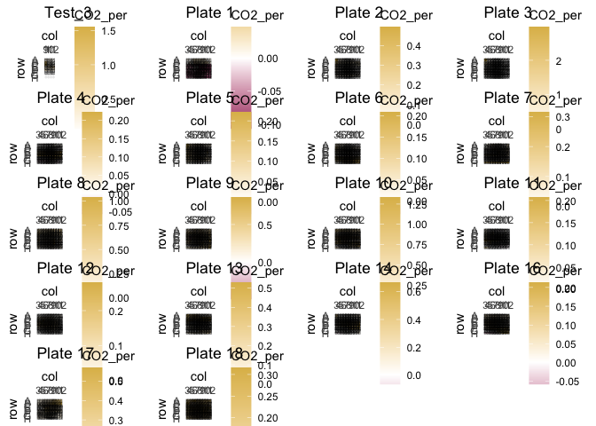<!-- -->

``` r
print(heatmaps_samples)
```

    ## [[1]]

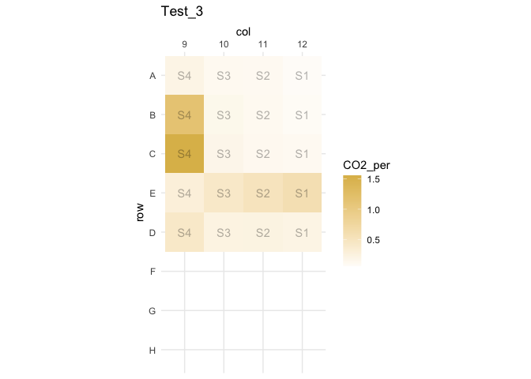<!-- -->

    ## 
    ## [[2]]

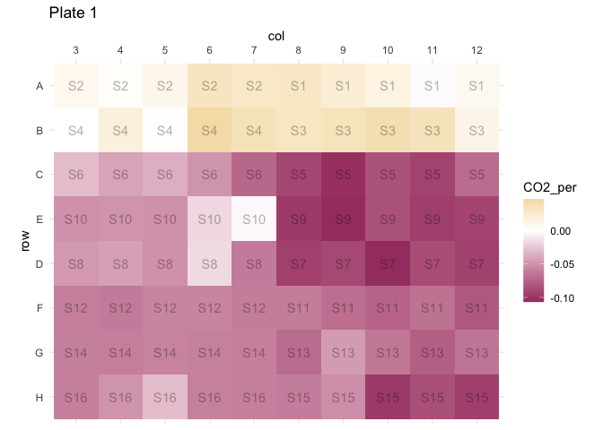<!-- -->

    ## 
    ## [[3]]

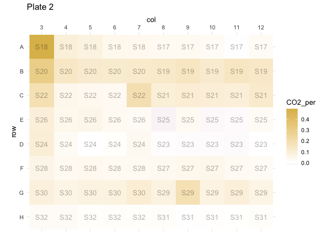<!-- -->

    ## 
    ## [[4]]

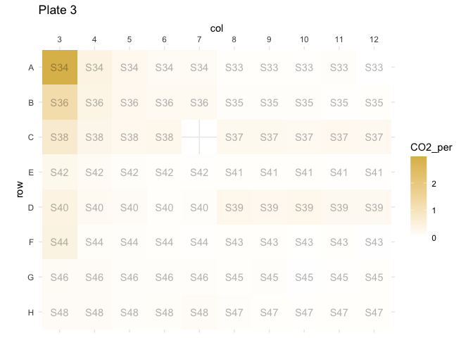<!-- -->

    ## 
    ## [[5]]

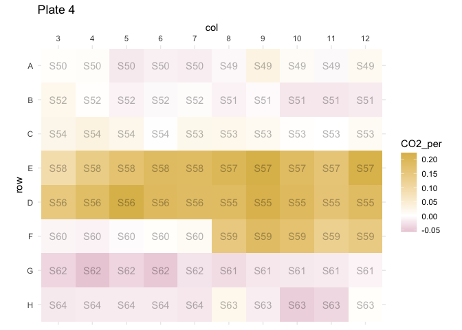<!-- -->

    ## 
    ## [[6]]

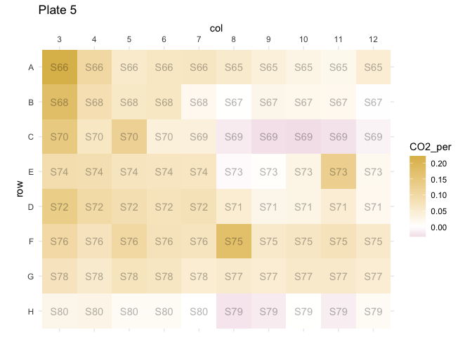<!-- -->

    ## 
    ## [[7]]

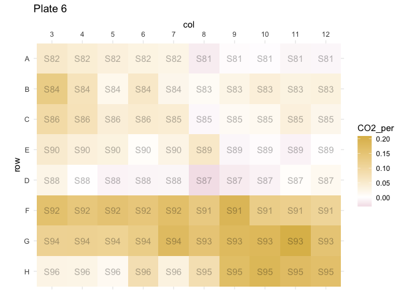<!-- -->

    ## 
    ## [[8]]

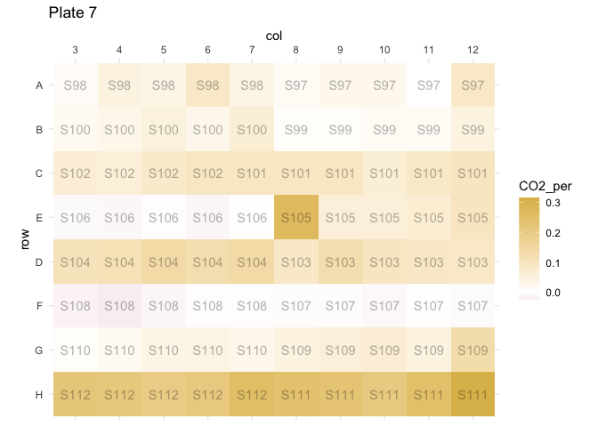<!-- -->

    ## 
    ## [[9]]

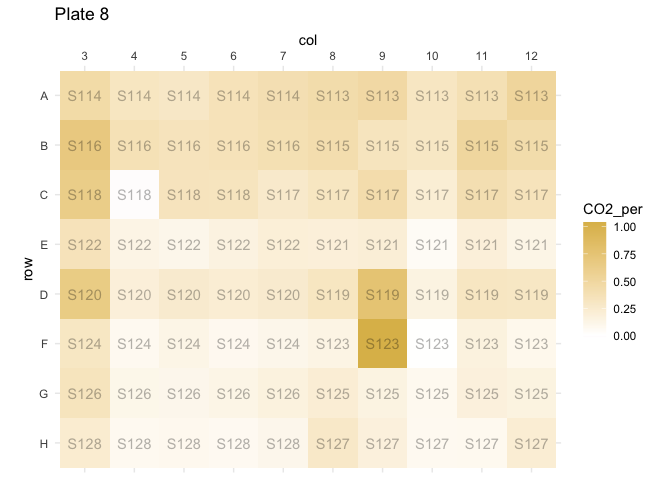<!-- -->

    ## 
    ## [[10]]

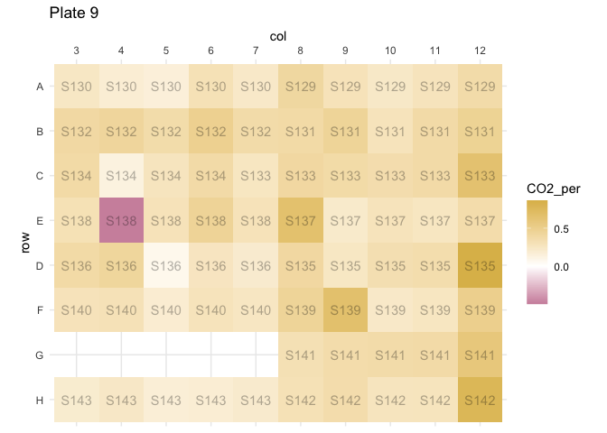<!-- -->

    ## 
    ## [[11]]

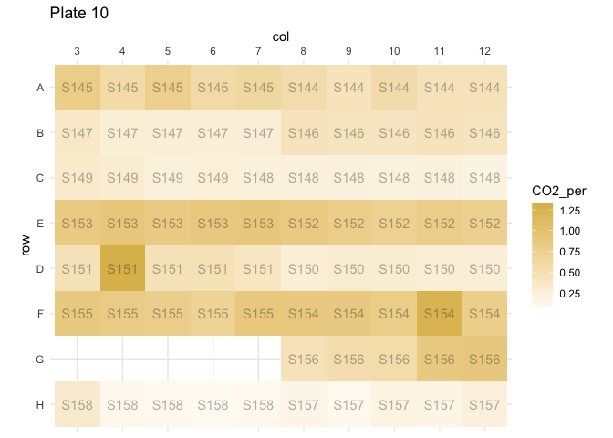<!-- -->

    ## 
    ## [[12]]

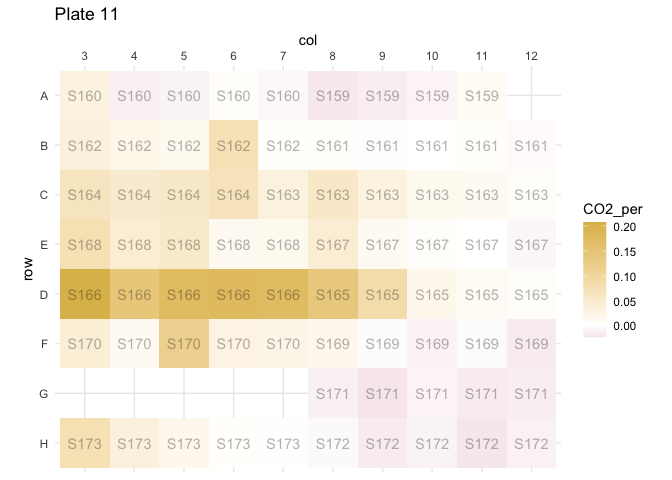<!-- -->

    ## 
    ## [[13]]

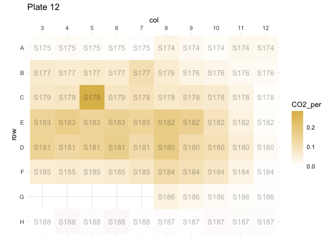<!-- -->

    ## 
    ## [[14]]

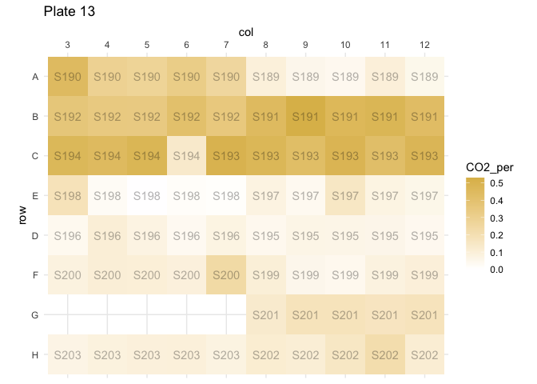<!-- -->

    ## 
    ## [[15]]

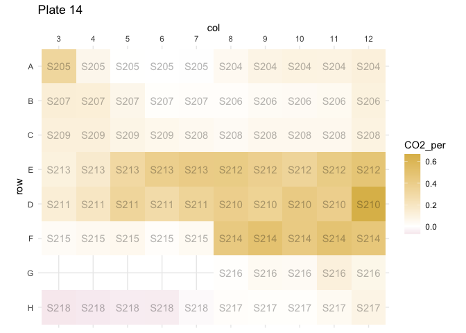<!-- -->

    ## 
    ## [[16]]

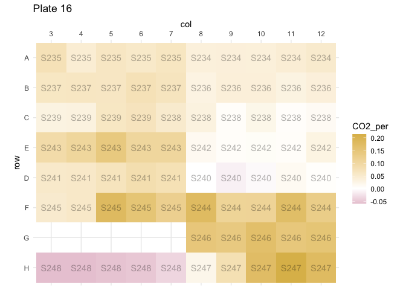<!-- -->

    ## 
    ## [[17]]

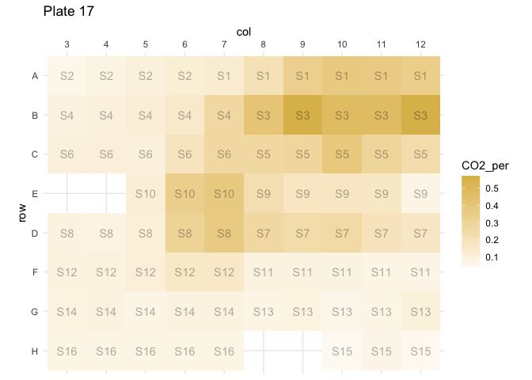<!-- -->

    ## 
    ## [[18]]

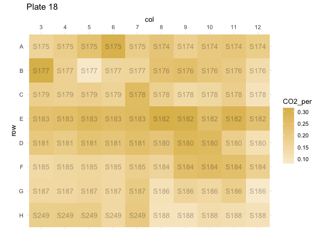<!-- -->

##### Position clustering

``` r
# Position dispersion plot
ggplot(merged_reads, aes(x = well, y = AAdjusted)) +
  geom_point(aes(color = plate)) +
  geom_text(aes(label = sample, alpha = 0.3), data = filter(merged_reads, AAdjusted>1.5 | AAdjusted<0.6 )) + 
  geom_point(data = mr1_c) + 
  labs(y = "Normalised A570")
```

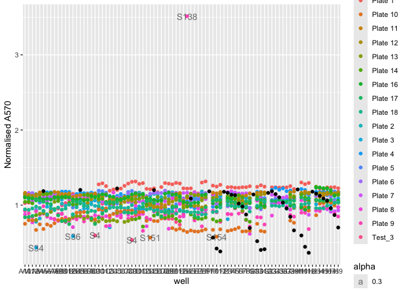<!-- -->

##### Position heatmap (all samples)

``` r
# Position heatmap

 ggplot(data = merged_reads, aes(x = col, y = row, fill = AAdjusted)) +
  geom_tile() +
  scale_fill_gradient(low = "#A64071", high = "#DEBB58") + 
  theme_minimal() +
  scale_y_discrete(limits = sort(unique(merged_reads$row), decreasing=T)) + # so the A row goes at the top, as in the actual plate
  scale_x_discrete(position = "top") + # so the col names go on the top, as in the actual plate
  coord_fixed() 
```

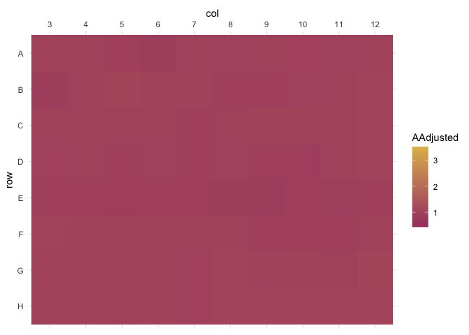<!-- -->

Later: test effect of the curve with lmer()

## 3) Data analysis

### 3.0) Import dataset

``` r
if (exists("merged_reads")){
  print("Dataset was already loaded")
  } else { merged_reads <- readRDS("microresp_processed.rds")
print("Dataset was loaded from microresp_processed.rds file")
}
```

    ## [1] "Dataset was already loaded"

### 3.1) Sub-setting like crazy: Relevant filters based on analyses performed in 2)

It is good practice to keep track of the amount of samples in the
dataset before filtering

``` r
sample_count <- data.frame(Step = c("unfiltered"))
sample_count$Reads[1] <- nrow(merged_reads)
sample_count$Samples[1] <- length(unique(merged_reads$sample))
sample_count$Reads_per_sample[1] <- sample_count$Reads[1]/sample_count$Samples[1]
for (i in plant_data$label) {
  sample_count[[i]][1] <- length(unique(filter(merged_reads, plant == i)$sample))
  rm(i)
}
sample_count
```

    ##         Step Reads Samples Reads_per_sample Faba bean Bare soil Mixed grass
    ## 1 unfiltered  1339     234         5.722222        92        99          44
    ##   Monoculture grass
    ## 1                 0

#### 3.1.1) Filter out unwanted reads and group data by relevant variables

``` r
working_reads <- merged_reads %>%
  filter(
           # col != "3" & # Column next to the calibration curve
           plate != "Plate 1" & # Calibration failed
           plate != "Plate 12" & # Calibration failed
           # plate != "Plate 16" & # Exact replicate of Plate 13 (?)
           plate != "Plate 17" & # Calibration failed
           plate != "Test_3" # Samples were only test
           ) %>% 
  group_by(soil, treatment, plant) # group by relevant variables

# Update tracker
sample_count <- add_row(sample_count, Step = "filtered") 
sample_count$Reads[2] <- nrow(working_reads)
sample_count$Samples[2] <- length(unique(working_reads$sample))
sample_count$Reads_per_sample[2] <- sample_count$Reads[2]/sample_count$Samples[2]
for (i in plant_data$label) {
  sample_count[[i]][2] <- length(unique(filter(working_reads, plant == i)$sample))
  rm(i)
}
sample_count
```

    ##         Step Reads Samples Reads_per_sample Faba bean Bare soil Mixed grass
    ## 1 unfiltered  1339     234         5.722222        92        99          44
    ## 2   filtered  1088     218         4.990826        76        98          44
    ##   Monoculture grass
    ## 1                 0
    ## 2                 0

#### 3.1.2) Average multiple Microresp reads from the same sample

``` r
# Average spectrophotometric readings and subsequent calculations.

working_samples <- working_reads %>%
    group_by(sample) %>%
    summarize(
      A570_0h = mean(A570_0h, na.rm = TRUE), # Absorbance before exposure
      A570_6h = mean(A570_6h, na.rm = TRUE), # Absorbance after exposure
      AAdjusted = mean(AAdjusted, na.rm = TRUE), # Normalised absorbance
      CO2_per = mean(CO2_per, na.rm = TRUE), # %CO2
      Respiration_rate = mean(Respiration_rate, na.rm = TRUE), # Respiration rate
    ) 

# Extract the data that comes from other sources (metadata), which is the same for all readings of the same sample.

working_meta <- working_reads %>%
  group_by(sample) %>%
  slice(1) %>% # Take the first row for each sample to get metadata
  select(-c(A570_0h, A570_6h, AAdjusted, CO2_per, Respiration_rate)) # Remove averaged columns

# Check back consistency and re-add grouping

if (identical(working_samples$sample,working_meta$sample)) { # First, check if the samples extracted from both processes match exactly
  working_data <- left_join(working_samples, working_meta, by = "sample")
  working_data <- group_by(working_data, soil, treatment, plant) # group by relevant variables)
} else { 
  print("The samples in the reads and metadata don't match! Check for NA values")
    }

head(working_data)
```

    ## # A tibble: 6 × 34
    ## # Groups:   soil, treatment, plant [6]
    ##   sample A570_0h A570_6h AAdjusted CO2_per Respiration_rate well  row   col  
    ##   <chr>    <dbl>   <dbl>     <dbl>   <dbl>            <dbl> <chr> <chr> <fct>
    ## 1 S100      1.43   1.13       1.10  0.0394           0.0771 B3    B     3    
    ## 2 S101      1.34   0.998      1.05  0.0884           0.173  C7    C     7    
    ## 3 S102      1.36   1.03       1.06  0.0742           0.145  C3    C     3    
    ## 4 S103      1.36   1.01       1.04  0.0972           0.190  D8    D     8    
    ## 5 S104      1.35   0.977      1.01  0.125            0.244  D3    D     3    
    ## 6 S105      1.44   1.06       1.03  0.111            0.217  E8    E     8    
    ## # ℹ 25 more variables: plant <chr>, soil <chr>, treatment <fct>,
    ## #   replicate <chr>, origin_location <chr>, soil_texture <chr>,
    ## #   CaCO3_perc <dbl>, NOM_perc <dbl>, pH <dbl>, `P-CaCl2_mgP/kg` <dbl>,
    ## #   `P-AL_mgP/kg` <dbl>, applied_product <fct>, target_function <chr>,
    ## #   active_principle_1 <chr>, active_principle_2 <chr>,
    ## #   active_principle_3 <chr>, active_principle_4 <chr>,
    ## #   active_principle_5 <chr>, active_principle_6 <chr>, …

Update the tracker

``` r
# Update tracker
sample_count <- add_row(sample_count, Step = "averaged reads") 
sample_count$Reads[3] <- nrow(working_data)
sample_count$Samples[3] <- length(unique(working_data$sample))
sample_count$Reads_per_sample[3] <- sample_count$Reads[3]/sample_count$Samples[3]
for (i in plant_data$label) {
  sample_count[[i]][3] <- length(unique(filter(working_data, plant == i)$sample))
  rm(i)
}
sample_count
```

    ##             Step Reads Samples Reads_per_sample Faba bean Bare soil Mixed grass
    ## 1     unfiltered  1339     234         5.722222        92        99          44
    ## 2       filtered  1088     218         4.990826        76        98          44
    ## 3 averaged reads   218     218         1.000000        76        98          44
    ##   Monoculture grass
    ## 1                 0
    ## 2                 0
    ## 3                 0

#### 3.1.3) Export biologically relevant dataset, with filtered noise and averaged technical replicates

``` r
write.csv(working_data, "microresp_biofiltered.csv", row.names = F) # Export as CSV file. The simplest but looses some structure, like factor columns.
saveRDS(working_data,"microresp_biofiltered.rds") # Export RDS file, which is an exact copy of the R object but is only readable by specialised software.
```

#### 3.1.4) Other relevant sub-settings

### 3.2) Further analysis

#### 3.2.1) Respiration rate for all samples

``` r
# 5 color palette 
palette_5col <- c("#EB8900", "#47D7AC", "#FAD847", "#2761C4", "#962C5D", "#CC4389")
# palette_5col <- c("#EB8900", "#2761C4", "#47D7AC", "#CC4389", "#FAD847")

# Treatment palettes based on the 5 color palette
palette_treatments <- palette_5col
names(palette_treatments) <- levels(treatment_data$label)

palette_products <- palette_5col
names(palette_products) <- levels(treatment_data$applied_product)

# Plot all samples, separated by plant system
plot_all_resp <- ggplot(working_data , aes(x = soil, y = Respiration_rate, color = treatment)) +
  # geom_point() + 
  geom_boxplot() +
  facet_wrap(~plant) + 
  # geom_col(stat = "identity", position = "dodge") +
  theme_prism() + 
  scale_color_manual(values = palette_treatments) +
  labs(x = "", y = expression(paste("Respiration rate (", mu, "gCO"[2], "-Cg"^"-1", "h"^"-1", ")"))) 
plot_all_resp_2 <- ggplot(merged_reads , aes(x = soil, y = Respiration_rate, color = treatment)) +
  # geom_point() + 
  geom_boxplot() +
  facet_wrap(~plant) + 
  # geom_col(stat = "identity", position = "dodge") +
  theme_prism() + 
  scale_color_manual(values = palette_treatments) +
  labs(x = "", y = expression(paste("Respiration rate (", mu, "gCO"[2], "-Cg"^"-1", "h"^"-1", ")"))) 
ggarrange(plot_all_resp+ylim(-0.5,2),plot_all_resp_2+ylim(-0.5,2))
```

    ## Warning: Removed 8 rows containing non-finite outside the scale range
    ## (`stat_boxplot()`).

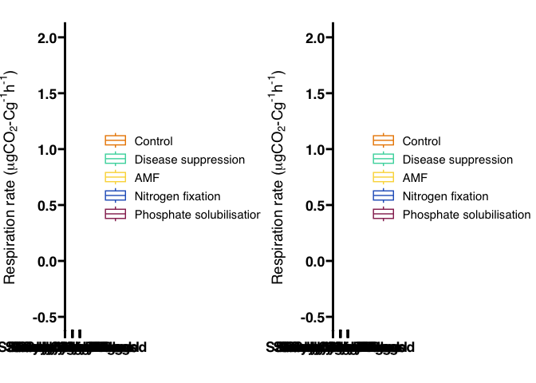<!-- -->

``` r
# Convert to plotly for interactivity
p_plotly <- ggplotly(plot_all_resp)

# Create a dropdown menu to switch between plants
plant_options <- unique(working_data$plant)

# Function to update the plot based on selected plant
update_plot <- function(plant_name) {
  p_updated <- ggplot(data = subset(working_data, plant == plant_name), aes(x = soil, y = Respiration_rate, color = treatment)) +
  geom_boxplot() +
  theme_prism() + 
  labs(x = "", y = expression(paste("Respiration rate (", mu, "gCO"[2], "-Cg"^"-1", "h"^"-1", ")"))) 
  
  return(ggplotly(p_updated))
}

# Create a list of buttons for the dropdown menu
buttons <- lapply(plant_options, function(plant_name) {
  list(
    method = "update",
    args = list(list(
      p_plotly$x$data <- update_plot(plant_name)$x$data,
      p_plotly$x$layout$title$text <- paste("Respiration Rate by Soil and Treatment (", plant_name, ")")
    )),
    label = plant_name
  )
})

# Add the dropdown menu to the plotly plot
p_plotly <- p_plotly %>% layout(
  updatemenus = list(
    list(
      active = 0,
      buttons = buttons
    )
  )
)

# Display the interactive plot
p_plotly
```

<div class="plotly html-widget html-fill-item" id="htmlwidget-d72bdac23a9c92dfd15b" style="width:672px;height:480px;"></div>
<script type="application/json" data-for="htmlwidget-d72bdac23a9c92dfd15b">{"x":{"data":[{"x":[3,3,3,3,3,4,4,4,4,4,1,1,1,1,1,2,2,2,2,2],"y":[0.051010729152267779,0.64126804213206146,0.41981226683494915,0.39272920821204982,0.14526431043856161,0.30542895145454008,0.081134017191239097,0.4293931134192962,-0.009092527544861919,0.32546995606233264,0.2996980796943825,1.7297581108899149,0.42772091142007612,-0.025471124339728181,0.80215039056589399,0.69537346260157729,0.42372757448655185,0.061429653989687832,0.28960991358354699,0.36614794140275164],"hoverinfo":"y","type":"box","fillcolor":"rgba(255,255,255,1)","marker":{"opacity":null,"outliercolor":"rgba(0,0,0,1)","line":{"width":1.8897637795275593,"color":"rgba(0,0,0,1)"},"size":5.6692913385826778},"line":{"color":"rgba(235,137,0,1)","width":1.8897637795275593},"name":"Control","legendgroup":"Control","showlegend":true,"xaxis":"x","yaxis":"y","frame":null},{"x":[2,2,2,3,3,3,3,4,4,4,4,1,1,1],"y":[-0.012565206583992381,0.087887985694055107,-0.040302532740400326,0.052614027939277053,0.071164407242476732,0.19920855614386013,0.19980187005145256,0.18043185676887541,0.026995696682796048,-0.015602237915428812,-0.030809907300202988,0.42910117283687876,0.16736414281380546,0.36163547993200967],"hoverinfo":"y","type":"box","fillcolor":"rgba(255,255,255,1)","marker":{"opacity":null,"outliercolor":"rgba(0,0,0,1)","line":{"width":1.8897637795275593,"color":"rgba(0,0,0,1)"},"size":5.6692913385826778},"line":{"color":"rgba(235,137,0,1)","width":1.8897637795275593},"name":"Control","legendgroup":"Control","showlegend":false,"xaxis":"x2","yaxis":"y","frame":null},{"x":[1,1,2,2,2,3,3,4,4],"y":[0.92456621800475702,0.50616129954638456,0.081192218343916683,0.069961482204147579,0.1263179046294011,0.32005692341639225,0.095602893748121698,0.27479122405368417,0.090650328081193415],"hoverinfo":"y","type":"box","fillcolor":"rgba(255,255,255,1)","marker":{"opacity":null,"outliercolor":"rgba(0,0,0,1)","line":{"width":1.8897637795275593,"color":"rgba(0,0,0,1)"},"size":5.6692913385826778},"line":{"color":"rgba(235,137,0,1)","width":1.8897637795275593},"name":"Control","legendgroup":"Control","showlegend":false,"xaxis":"x3","yaxis":"y","frame":null},{"x":[3,3,3,3,3,3,4,4,4,4,4,1,1,1,1,2,2,2,2,2],"y":[0.78860450643614544,0.84247516774973363,0.17301871477890826,0.11643805287451203,0.058523007046000587,0.34327058078845624,0.42807081045777806,-0.012457780862044602,0.55330278868418903,0.021755069389269924,0.32402473423253947,0.26712654515023448,0.4862902972400921,1.5437576726474238,0.76709298717892926,0.39914165071279473,0.53221790369614785,0.2955433953001797,0.06948694676523802,0.32929772955865894],"hoverinfo":"y","type":"box","fillcolor":"rgba(255,255,255,1)","marker":{"opacity":null,"outliercolor":"rgba(0,0,0,1)","line":{"width":1.8897637795275593,"color":"rgba(0,0,0,1)"},"size":5.6692913385826778},"line":{"color":"rgba(71,215,172,1)","width":1.8897637795275593},"name":"Disease suppression","legendgroup":"Disease suppression","showlegend":true,"xaxis":"x","yaxis":"y","frame":null},{"x":[1,1,1,1,1,1,2,2,2,2,3,3,3,3,4,4,4],"y":[0.2232845664633841,0.2666357109883794,0.14834939831451008,0.36655858125216695,0.86522054514663083,0.36125156196052999,0.32619270992403621,0.19349952400370693,-0.0033841738316679692,-0.017325586418116743,0.0940935741821948,0.073506854983526881,0.071539984093566614,0.09770882356513684,-0.025206239351517844,-0.015346312665238331,0.014395956053343914],"hoverinfo":"y","type":"box","fillcolor":"rgba(255,255,255,1)","marker":{"opacity":null,"outliercolor":"rgba(0,0,0,1)","line":{"width":1.8897637795275593,"color":"rgba(0,0,0,1)"},"size":5.6692913385826778},"line":{"color":"rgba(71,215,172,1)","width":1.8897637795275593},"name":"Disease suppression","legendgroup":"Disease suppression","showlegend":false,"xaxis":"x2","yaxis":"y","frame":null},{"x":[1,1,1,2,3,3,4,4],"y":[0.62614996115429533,0.87131627667220057,-0.099577977736637902,0.10312207313462071,0.042706891692911995,0.23986153910877486,0.15211384629661179,0.21386616404779796],"hoverinfo":"y","type":"box","fillcolor":"rgba(255,255,255,1)","marker":{"opacity":null,"outliercolor":"rgba(0,0,0,1)","line":{"width":1.8897637795275593,"color":"rgba(0,0,0,1)"},"size":5.6692913385826778},"line":{"color":"rgba(71,215,172,1)","width":1.8897637795275593},"name":"Disease suppression","legendgroup":"Disease suppression","showlegend":false,"xaxis":"x3","yaxis":"y","frame":null},{"x":[3,3,3,3,3,3,4,4,4,4,4,1,1,1,1,2,2,2,2,2],"y":[0.43403979524271491,0.77731785890030292,0.62655670436122668,0.342074737564043,0.96492621295985681,0.19012944432771692,-0.023673018496365137,0.269017001992581,-0.0069181514934324702,0.54387717407622105,0.21968135890502333,1.8030550136872601,0.82853816778702616,0.3418990590032906,0.5688343734341349,0.33993973371169955,0.39929524872795796,-0.015706769784775535,0.08687177135915157,0.5659616501011947],"hoverinfo":"y","type":"box","fillcolor":"rgba(255,255,255,1)","marker":{"opacity":null,"outliercolor":"rgba(0,0,0,1)","line":{"width":1.8897637795275593,"color":"rgba(0,0,0,1)"},"size":5.6692913385826778},"line":{"color":"rgba(250,216,71,1)","width":1.8897637795275593},"name":"AMF","legendgroup":"AMF","showlegend":true,"xaxis":"x","yaxis":"y","frame":null},{"x":[1,1,1,2,2,2,2,3,3,3,3,4,4,4,4],"y":[0.31378529295929081,0.38503715578176928,0.16382460521848466,0.064996710653078715,0.026916010732187107,0.23476260071473878,-0.081513942037761536,0.07598884254136655,0.11521741850632503,0.10536668953844353,0.025702471527736446,0.064485443686779803,2.7894679677728518e-05,-0.0014515421510315533,0.082883008438524475],"hoverinfo":"y","type":"box","fillcolor":"rgba(255,255,255,1)","marker":{"opacity":null,"outliercolor":"rgba(0,0,0,1)","line":{"width":1.8897637795275593,"color":"rgba(0,0,0,1)"},"size":5.6692913385826778},"line":{"color":"rgba(250,216,71,1)","width":1.8897637795275593},"name":"AMF","legendgroup":"AMF","showlegend":false,"xaxis":"x2","yaxis":"y","frame":null},{"x":[1,1,2,2,2,3,3,4,4],"y":[0.71363766446587962,0.79357056717402596,0.10368327077991424,0.11909341090620845,0.15290927158495365,0.27282391580607207,-0.00062680146612775929,0.2195061884391892,0.13577385247903226],"hoverinfo":"y","type":"box","fillcolor":"rgba(255,255,255,1)","marker":{"opacity":null,"outliercolor":"rgba(0,0,0,1)","line":{"width":1.8897637795275593,"color":"rgba(0,0,0,1)"},"size":5.6692913385826778},"line":{"color":"rgba(250,216,71,1)","width":1.8897637795275593},"name":"AMF","legendgroup":"AMF","showlegend":false,"xaxis":"x3","yaxis":"y","frame":null},{"x":[2,2,2,2,2,3,3,3,3,4,4,4,4,4,1,1,1,1],"y":[0.077092247746165632,0.52372509053598904,0.001144669931807338,0.33478748983896545,0.30115705856411773,0.21680511164439081,0.50094858067465708,0.61332723254209198,0.8286760469900365,0.12929922208203734,0.05488670548089418,1.2371426952785889,-0.029661884969498301,0.43920100583873911,0.86134576124381268,1.3057055403490059,0.30260882386269228,0.77508896360245039],"hoverinfo":"y","type":"box","fillcolor":"rgba(255,255,255,1)","marker":{"opacity":null,"outliercolor":"rgba(0,0,0,1)","line":{"width":1.8897637795275593,"color":"rgba(0,0,0,1)"},"size":5.6692913385826778},"line":{"color":"rgba(39,97,196,1)","width":1.8897637795275593},"name":"Nitrogen fixation","legendgroup":"Nitrogen fixation","showlegend":true,"xaxis":"x","yaxis":"y","frame":null},{"x":[4,4,4,4,4,1,1,1,1,3,3,3,3,2,2],"y":[0.12529228903338641,0.29330625914250946,0.067568929005679318,0.03798180682632081,0.057495666068519344,0.12126277586516297,0.2011212035068396,0.46231899028070411,0.30001188707603027,0.15620472164565713,0.01520035334536945,0.12308227774036315,0.15826384533387874,0.27960350779022608,-0.037570619848861911],"hoverinfo":"y","type":"box","fillcolor":"rgba(255,255,255,1)","marker":{"opacity":null,"outliercolor":"rgba(0,0,0,1)","line":{"width":1.8897637795275593,"color":"rgba(0,0,0,1)"},"size":5.6692913385826778},"line":{"color":"rgba(39,97,196,1)","width":1.8897637795275593},"name":"Nitrogen fixation","legendgroup":"Nitrogen fixation","showlegend":false,"xaxis":"x2","yaxis":"y","frame":null},{"x":[1,1,2,2,2,3,3,4,4],"y":[0.9021520279097629,0.75118401896319764,-0.095115063339704833,0.12960065454192637,0.14546997717900445,0.024562740556540855,0.16739901103777585,0.26064054692895611,0.17909764902923858],"hoverinfo":"y","type":"box","fillcolor":"rgba(255,255,255,1)","marker":{"opacity":null,"outliercolor":"rgba(0,0,0,1)","line":{"width":1.8897637795275593,"color":"rgba(0,0,0,1)"},"size":5.6692913385826778},"line":{"color":"rgba(39,97,196,1)","width":1.8897637795275593},"name":"Nitrogen fixation","legendgroup":"Nitrogen fixation","showlegend":false,"xaxis":"x3","yaxis":"y","frame":null},{"x":[3,3,3,3,3,4,4,4,4,4,1,1,1,1,1,2,2,2,2,2],"y":[0.54473566270703722,1.3312159130053127,0.24369885044238082,0.71557662154732482,0.10365413780149474,0.13811737202541574,0.3129761177258194,0.087905288507401438,0.5368277491797866,0.6270841639807081,0.052130720682122808,1.6007843430565474,0.71027709362169356,0.7909097963383912,0.25192629537353811,0.0036589677945355905,0.3480404040924403,0.037842158607296394,0.26650230766848837,0.82551816703503955],"hoverinfo":"y","type":"box","fillcolor":"rgba(255,255,255,1)","marker":{"opacity":null,"outliercolor":"rgba(0,0,0,1)","line":{"width":1.8897637795275593,"color":"rgba(0,0,0,1)"},"size":5.6692913385826778},"line":{"color":"rgba(150,44,93,1)","width":1.8897637795275593},"name":"Phosphate solubilisation","legendgroup":"Phosphate solubilisation","showlegend":true,"xaxis":"x","yaxis":"y","frame":null},{"x":[4,4,4,4,4,2,2,2,2,3,3,3,1,1,1],"y":[0.022441998768737363,0.040863521943284034,0.18381658870863454,1.5410962420895902,0.014430524597491407,0.074465267766185353,-0.014296064639561972,0.0016410153217579452,-0.02928059962350521,0.22671997641338254,0.038738724965599457,0.18967177527564344,0.10197214193251791,0.30121653174081897,0.73503606534461219],"hoverinfo":"y","type":"box","fillcolor":"rgba(255,255,255,1)","marker":{"opacity":null,"outliercolor":"rgba(0,0,0,1)","line":{"width":1.8897637795275593,"color":"rgba(0,0,0,1)"},"size":5.6692913385826778},"line":{"color":"rgba(150,44,93,1)","width":1.8897637795275593},"name":"Phosphate solubilisation","legendgroup":"Phosphate solubilisation","showlegend":false,"xaxis":"x2","yaxis":"y","frame":null},{"x":[1,1,2,2,2,3,3,4,4],"y":[0.53799380605526126,0.91090868986207507,0.06422997033413691,0.068920854314115057,0.090479786111085106,0.13330506534335224,0.15964867160379473,0.11300960890852846,0.2940358216227224],"hoverinfo":"y","type":"box","fillcolor":"rgba(255,255,255,1)","marker":{"opacity":null,"outliercolor":"rgba(0,0,0,1)","line":{"width":1.8897637795275593,"color":"rgba(0,0,0,1)"},"size":5.6692913385826778},"line":{"color":"rgba(150,44,93,1)","width":1.8897637795275593},"name":"Phosphate solubilisation","legendgroup":"Phosphate solubilisation","showlegend":false,"xaxis":"x3","yaxis":"y","frame":null}],"layout":{"margin":{"t":43.895392278953928,"r":9.2984640929846432,"b":38.123702781237029,"l":61.834786218347872},"plot_bgcolor":"transparent","paper_bgcolor":"rgba(255,255,255,1)","font":{"color":"rgba(0,0,0,1)","family":"sans","size":18.596928185969279},"xaxis":{"domain":[0,0.31949633319496329],"automargin":true,"type":"linear","autorange":false,"range":[0.40000000000000002,4.5999999999999996],"tickmode":"array","ticktext":["Clay","Sandy high Phos","Sandy low Phos","Sandy not managed"],"tickvals":[1,2,3,4],"categoryorder":"array","categoryarray":["Clay","Sandy high Phos","Sandy low Phos","Sandy not managed"],"nticks":null,"ticks":"outside","tickcolor":"rgba(0,0,0,1)","ticklen":7.4387712743877135,"tickwidth":1.32835201328352,"showticklabels":true,"tickfont":{"color":"rgba(0,0,0,1)","family":"sans","size":17.667081776670816},"tickangle":-0,"showline":true,"linecolor":"rgba(0,0,0,1)","linewidth":1.32835201328352,"showgrid":false,"gridcolor":null,"gridwidth":0,"zeroline":false,"anchor":"y","title":"","hoverformat":".2f"},"yaxis":{"domain":[0,1],"automargin":true,"type":"linear","autorange":false,"range":[-0.19470962730783281,1.898186663258455],"tickmode":"array","ticktext":["0.0","0.5","1.0","1.5"],"tickvals":[0,0.5,1.0000000000000002,1.5],"categoryorder":"array","categoryarray":["0.0","0.5","1.0","1.5"],"nticks":null,"ticks":"outside","tickcolor":"rgba(0,0,0,1)","ticklen":7.4387712743877135,"tickwidth":1.32835201328352,"showticklabels":true,"tickfont":{"color":"rgba(0,0,0,1)","family":"sans","size":17.667081776670816},"tickangle":-0,"showline":true,"linecolor":"rgba(0,0,0,1)","linewidth":1.32835201328352,"showgrid":false,"gridcolor":null,"gridwidth":0,"zeroline":false,"anchor":"x","title":"","hoverformat":".2f"},"annotations":[{"text":"<b> paste(\"Respiration rate (\", mu, \"gCO\"[2], \"-Cg\"^\"-1\", \"h\"^\"-1\", \")\") <\/b>","x":0,"y":0.5,"showarrow":false,"ax":0,"ay":0,"font":{"color":"rgba(0,0,0,1)","family":"sans","size":18.596928185969279},"xref":"paper","yref":"paper","textangle":-90,"xanchor":"right","yanchor":"center","annotationType":"axis","xshift":-47.422166874221666},{"text":"Bare soil","x":0.15974816659748164,"y":1,"showarrow":false,"ax":0,"ay":0,"font":{"color":"rgba(0,0,0,1)","family":"sans","size":14.877542548775427},"xref":"paper","yref":"paper","textangle":-0,"xanchor":"center","yanchor":"bottom"},{"text":"Faba bean","x":0.5,"y":1,"showarrow":false,"ax":0,"ay":0,"font":{"color":"rgba(0,0,0,1)","family":"sans","size":14.877542548775427},"xref":"paper","yref":"paper","textangle":-0,"xanchor":"center","yanchor":"bottom"},{"text":"Mixed grass","x":0.8402518334025183,"y":1,"showarrow":false,"ax":0,"ay":0,"font":{"color":"rgba(0,0,0,1)","family":"sans","size":14.877542548775427},"xref":"paper","yref":"paper","textangle":-0,"xanchor":"center","yanchor":"bottom"}],"shapes":[{"type":"rect","fillcolor":null,"line":{"color":null,"width":0,"linetype":[]},"yref":"paper","xref":"paper","x0":0,"x1":0.31949633319496329,"y0":0,"y1":1},{"type":"rect","fillcolor":null,"line":{"color":null,"width":0,"linetype":[]},"yref":"paper","xref":"paper","x0":0,"x1":0.31949633319496329,"y0":0,"y1":21.076518610765191,"yanchor":1,"ysizemode":"pixel"},{"type":"rect","fillcolor":null,"line":{"color":null,"width":0,"linetype":[]},"yref":"paper","xref":"paper","x0":0.34717033347170334,"x1":0.65282966652829666,"y0":0,"y1":1},{"type":"rect","fillcolor":null,"line":{"color":null,"width":0,"linetype":[]},"yref":"paper","xref":"paper","x0":0.34717033347170334,"x1":0.65282966652829666,"y0":0,"y1":21.076518610765191,"yanchor":1,"ysizemode":"pixel"},{"type":"rect","fillcolor":null,"line":{"color":null,"width":0,"linetype":[]},"yref":"paper","xref":"paper","x0":0.6805036668050366,"x1":1,"y0":0,"y1":1},{"type":"rect","fillcolor":null,"line":{"color":null,"width":0,"linetype":[]},"yref":"paper","xref":"paper","x0":0.6805036668050366,"x1":1,"y0":0,"y1":21.076518610765191,"yanchor":1,"ysizemode":"pixel"}],"xaxis2":{"type":"linear","autorange":false,"range":[0.40000000000000002,4.5999999999999996],"tickmode":"array","ticktext":["Clay","Sandy high Phos","Sandy low Phos","Sandy not managed"],"tickvals":[1,2,3,4],"categoryorder":"array","categoryarray":["Clay","Sandy high Phos","Sandy low Phos","Sandy not managed"],"nticks":null,"ticks":"outside","tickcolor":"rgba(0,0,0,1)","ticklen":7.4387712743877135,"tickwidth":1.32835201328352,"showticklabels":true,"tickfont":{"color":"rgba(0,0,0,1)","family":"sans","size":17.667081776670816},"tickangle":-0,"showline":true,"linecolor":"rgba(0,0,0,1)","linewidth":1.32835201328352,"showgrid":false,"domain":[0.34717033347170334,0.65282966652829666],"gridcolor":null,"gridwidth":0,"zeroline":false,"anchor":"y","title":"","hoverformat":".2f"},"xaxis3":{"type":"linear","autorange":false,"range":[0.40000000000000002,4.5999999999999996],"tickmode":"array","ticktext":["Clay","Sandy high Phos","Sandy low Phos","Sandy not managed"],"tickvals":[1,2,3,4],"categoryorder":"array","categoryarray":["Clay","Sandy high Phos","Sandy low Phos","Sandy not managed"],"nticks":null,"ticks":"outside","tickcolor":"rgba(0,0,0,1)","ticklen":7.4387712743877135,"tickwidth":1.32835201328352,"showticklabels":true,"tickfont":{"color":"rgba(0,0,0,1)","family":"sans","size":17.667081776670816},"tickangle":-0,"showline":true,"linecolor":"rgba(0,0,0,1)","linewidth":1.32835201328352,"showgrid":false,"domain":[0.6805036668050366,1],"gridcolor":null,"gridwidth":0,"zeroline":false,"anchor":"y","title":"","hoverformat":".2f"},"showlegend":true,"legend":{"bgcolor":null,"bordercolor":null,"borderwidth":0,"font":{"color":"rgba(0,0,0,1)","family":"sans","size":14.877542548775427},"title":{"text":"treatment","font":{"color":null,"family":null,"size":0}}},"hovermode":"closest","barmode":"relative","updatemenus":[{"active":0,"buttons":[{"method":"update","args":[[[{"x":[3,3,3,3,3,4,4,4,4,4,1,1,1,1,1,2,2,2,2,2],"y":[0.64126804213206146,0.051010729152267779,0.41981226683494915,0.14526431043856161,0.39272920821204982,0.4293931134192962,-0.009092527544861919,0.30542895145454008,0.081134017191239097,0.32546995606233264,0.42772091142007612,-0.025471124339728181,0.80215039056589399,0.2996980796943825,1.7297581108899149,0.69537346260157729,0.42372757448655185,0.28960991358354699,0.36614794140275164,0.061429653989687832],"hoverinfo":"y","type":"box","fillcolor":"rgba(255,255,255,1)","marker":{"opacity":null,"outliercolor":"rgba(0,0,0,1)","line":{"width":1.8897637795275593,"color":"rgba(0,0,0,1)"},"size":5.6692913385826778},"line":{"color":"rgba(248,118,109,1)","width":1.8897637795275593},"name":"Control","legendgroup":"Control","showlegend":true,"xaxis":"x","yaxis":"y"},{"x":[3,3,3,3,3,3,4,4,4,4,4,1,1,1,1,2,2,2,2,2],"y":[0.78860450643614544,0.84247516774973363,0.058523007046000587,0.34327058078845624,0.17301871477890826,0.11643805287451203,0.021755069389269924,0.55330278868418903,0.42807081045777806,0.32402473423253947,-0.012457780862044602,0.26712654515023448,1.5437576726474238,0.4862902972400921,0.76709298717892926,0.32929772955865894,0.53221790369614785,0.2955433953001797,0.39914165071279473,0.06948694676523802],"hoverinfo":"y","type":"box","fillcolor":"rgba(255,255,255,1)","marker":{"opacity":null,"outliercolor":"rgba(0,0,0,1)","line":{"width":1.8897637795275593,"color":"rgba(0,0,0,1)"},"size":5.6692913385826778},"line":{"color":"rgba(163,165,0,1)","width":1.8897637795275593},"name":"Disease suppression","legendgroup":"Disease suppression","showlegend":true,"xaxis":"x","yaxis":"y"},{"x":[3,3,3,3,3,3,4,4,4,4,4,1,1,1,1,2,2,2,2,2],"y":[0.96492621295985681,0.19012944432771692,0.43403979524271491,0.342074737564043,0.62655670436122668,0.77731785890030292,-0.0069181514934324702,0.269017001992581,0.54387717407622105,-0.023673018496365137,0.21968135890502333,0.5688343734341349,0.82853816778702616,1.8030550136872601,0.3418990590032906,0.33993973371169955,0.39929524872795796,-0.015706769784775535,0.5659616501011947,0.08687177135915157],"hoverinfo":"y","type":"box","fillcolor":"rgba(255,255,255,1)","marker":{"opacity":null,"outliercolor":"rgba(0,0,0,1)","line":{"width":1.8897637795275593,"color":"rgba(0,0,0,1)"},"size":5.6692913385826778},"line":{"color":"rgba(0,191,125,1)","width":1.8897637795275593},"name":"AMF","legendgroup":"AMF","showlegend":true,"xaxis":"x","yaxis":"y"},{"x":[2,2,2,2,2,3,3,3,3,4,4,4,4,4,1,1,1,1],"y":[0.077092247746165632,0.52372509053598904,0.30115705856411773,0.001144669931807338,0.33478748983896545,0.8286760469900365,0.61332723254209198,0.50094858067465708,0.21680511164439081,1.2371426952785889,0.12929922208203734,-0.029661884969498301,0.05488670548089418,0.43920100583873911,0.86134576124381268,1.3057055403490059,0.30260882386269228,0.77508896360245039],"hoverinfo":"y","type":"box","fillcolor":"rgba(255,255,255,1)","marker":{"opacity":null,"outliercolor":"rgba(0,0,0,1)","line":{"width":1.8897637795275593,"color":"rgba(0,0,0,1)"},"size":5.6692913385826778},"line":{"color":"rgba(0,176,246,1)","width":1.8897637795275593},"name":"Nitrogen fixation","legendgroup":"Nitrogen fixation","showlegend":true,"xaxis":"x","yaxis":"y"},{"x":[3,3,3,3,3,4,4,4,4,4,1,1,1,1,1,2,2,2,2,2],"y":[1.3312159130053127,0.71557662154732482,0.54473566270703722,0.10365413780149474,0.24369885044238082,0.5368277491797866,0.13811737202541574,0.3129761177258194,0.087905288507401438,0.6270841639807081,0.052130720682122808,1.6007843430565474,0.71027709362169356,0.7909097963383912,0.25192629537353811,0.0036589677945355905,0.26650230766848837,0.3480404040924403,0.82551816703503955,0.037842158607296394],"hoverinfo":"y","type":"box","fillcolor":"rgba(255,255,255,1)","marker":{"opacity":null,"outliercolor":"rgba(0,0,0,1)","line":{"width":1.8897637795275593,"color":"rgba(0,0,0,1)"},"size":5.6692913385826778},"line":{"color":"rgba(231,107,243,1)","width":1.8897637795275593},"name":"Phosphate solubilisation","legendgroup":"Phosphate solubilisation","showlegend":true,"xaxis":"x","yaxis":"y"}],"Respiration Rate by Soil and Treatment ( Bare soil )"]],"label":"Bare soil"},{"method":"update","args":[[[{"x":[2,2,2,3,3,3,3,4,4,4,4,1,1,1],"y":[-0.012565206583992381,0.087887985694055107,-0.040302532740400326,0.052614027939277053,0.071164407242476732,0.19920855614386013,0.19980187005145256,-0.030809907300202988,0.026995696682796048,-0.015602237915428812,0.18043185676887541,0.16736414281380546,0.42910117283687876,0.36163547993200967],"hoverinfo":"y","type":"box","fillcolor":"rgba(255,255,255,1)","marker":{"opacity":null,"outliercolor":"rgba(0,0,0,1)","line":{"width":1.8897637795275593,"color":"rgba(0,0,0,1)"},"size":5.6692913385826778},"line":{"color":"rgba(248,118,109,1)","width":1.8897637795275593},"name":"Control","legendgroup":"Control","showlegend":true,"xaxis":"x","yaxis":"y"},{"x":[1,1,1,1,1,1,2,2,2,2,3,3,3,3,4,4,4],"y":[0.86522054514663083,0.2232845664633841,0.2666357109883794,0.14834939831451008,0.36655858125216695,0.36125156196052999,0.32619270992403621,-0.0033841738316679692,-0.017325586418116743,0.19349952400370693,0.09770882356513684,0.0940935741821948,0.071539984093566614,0.073506854983526881,0.014395956053343914,-0.015346312665238331,-0.025206239351517844],"hoverinfo":"y","type":"box","fillcolor":"rgba(255,255,255,1)","marker":{"opacity":null,"outliercolor":"rgba(0,0,0,1)","line":{"width":1.8897637795275593,"color":"rgba(0,0,0,1)"},"size":5.6692913385826778},"line":{"color":"rgba(163,165,0,1)","width":1.8897637795275593},"name":"Disease suppression","legendgroup":"Disease suppression","showlegend":true,"xaxis":"x","yaxis":"y"},{"x":[1,1,1,2,2,2,2,3,3,3,3,4,4,4,4],"y":[0.16382460521848466,0.31378529295929081,0.38503715578176928,0.23476260071473878,0.064996710653078715,0.026916010732187107,-0.081513942037761536,0.025702471527736446,0.11521741850632503,0.10536668953844353,0.07598884254136655,0.064485443686779803,0.082883008438524475,2.7894679677728518e-05,-0.0014515421510315533],"hoverinfo":"y","type":"box","fillcolor":"rgba(255,255,255,1)","marker":{"opacity":null,"outliercolor":"rgba(0,0,0,1)","line":{"width":1.8897637795275593,"color":"rgba(0,0,0,1)"},"size":5.6692913385826778},"line":{"color":"rgba(0,191,125,1)","width":1.8897637795275593},"name":"AMF","legendgroup":"AMF","showlegend":true,"xaxis":"x","yaxis":"y"},{"x":[4,4,4,4,4,1,1,1,1,3,3,3,3,2,2],"y":[0.12529228903338641,0.057495666068519344,0.067568929005679318,0.29330625914250946,0.03798180682632081,0.46231899028070411,0.2011212035068396,0.30001188707603027,0.12126277586516297,0.01520035334536945,0.15826384533387874,0.12308227774036315,0.15620472164565713,0.27960350779022608,-0.037570619848861911],"hoverinfo":"y","type":"box","fillcolor":"rgba(255,255,255,1)","marker":{"opacity":null,"outliercolor":"rgba(0,0,0,1)","line":{"width":1.8897637795275593,"color":"rgba(0,0,0,1)"},"size":5.6692913385826778},"line":{"color":"rgba(0,176,246,1)","width":1.8897637795275593},"name":"Nitrogen fixation","legendgroup":"Nitrogen fixation","showlegend":true,"xaxis":"x","yaxis":"y"},{"x":[4,4,4,4,4,2,2,2,2,3,3,3,1,1,1],"y":[0.040863521943284034,0.18381658870863454,1.5410962420895902,0.022441998768737363,0.014430524597491407,-0.014296064639561972,0.074465267766185353,-0.02928059962350521,0.0016410153217579452,0.22671997641338254,0.18967177527564344,0.038738724965599457,0.73503606534461219,0.30121653174081897,0.10197214193251791],"hoverinfo":"y","type":"box","fillcolor":"rgba(255,255,255,1)","marker":{"opacity":null,"outliercolor":"rgba(0,0,0,1)","line":{"width":1.8897637795275593,"color":"rgba(0,0,0,1)"},"size":5.6692913385826778},"line":{"color":"rgba(231,107,243,1)","width":1.8897637795275593},"name":"Phosphate solubilisation","legendgroup":"Phosphate solubilisation","showlegend":true,"xaxis":"x","yaxis":"y"}],"Respiration Rate by Soil and Treatment ( Faba bean )"]],"label":"Faba bean"},{"method":"update","args":[[[{"x":[1,1,2,2,2,3,3,4,4],"y":[0.92456621800475702,0.50616129954638456,0.1263179046294011,0.069961482204147579,0.081192218343916683,0.32005692341639225,0.095602893748121698,0.27479122405368417,0.090650328081193415],"hoverinfo":"y","type":"box","fillcolor":"rgba(255,255,255,1)","marker":{"opacity":null,"outliercolor":"rgba(0,0,0,1)","line":{"width":1.8897637795275593,"color":"rgba(0,0,0,1)"},"size":5.6692913385826778},"line":{"color":"rgba(248,118,109,1)","width":1.8897637795275593},"name":"Control","legendgroup":"Control","showlegend":true,"xaxis":"x","yaxis":"y"},{"x":[1,1,1,2,3,3,4,4],"y":[0.62614996115429533,0.87131627667220057,-0.099577977736637902,0.10312207313462071,0.23986153910877486,0.042706891692911995,0.15211384629661179,0.21386616404779796],"hoverinfo":"y","type":"box","fillcolor":"rgba(255,255,255,1)","marker":{"opacity":null,"outliercolor":"rgba(0,0,0,1)","line":{"width":1.8897637795275593,"color":"rgba(0,0,0,1)"},"size":5.6692913385826778},"line":{"color":"rgba(163,165,0,1)","width":1.8897637795275593},"name":"Disease suppression","legendgroup":"Disease suppression","showlegend":true,"xaxis":"x","yaxis":"y"},{"x":[1,1,2,2,2,3,3,4,4],"y":[0.71363766446587962,0.79357056717402596,0.11909341090620845,0.10368327077991424,0.15290927158495365,-0.00062680146612775929,0.27282391580607207,0.2195061884391892,0.13577385247903226],"hoverinfo":"y","type":"box","fillcolor":"rgba(255,255,255,1)","marker":{"opacity":null,"outliercolor":"rgba(0,0,0,1)","line":{"width":1.8897637795275593,"color":"rgba(0,0,0,1)"},"size":5.6692913385826778},"line":{"color":"rgba(0,191,125,1)","width":1.8897637795275593},"name":"AMF","legendgroup":"AMF","showlegend":true,"xaxis":"x","yaxis":"y"},{"x":[1,1,2,2,2,3,3,4,4],"y":[0.75118401896319764,0.9021520279097629,-0.095115063339704833,0.12960065454192637,0.14546997717900445,0.16739901103777585,0.024562740556540855,0.17909764902923858,0.26064054692895611],"hoverinfo":"y","type":"box","fillcolor":"rgba(255,255,255,1)","marker":{"opacity":null,"outliercolor":"rgba(0,0,0,1)","line":{"width":1.8897637795275593,"color":"rgba(0,0,0,1)"},"size":5.6692913385826778},"line":{"color":"rgba(0,176,246,1)","width":1.8897637795275593},"name":"Nitrogen fixation","legendgroup":"Nitrogen fixation","showlegend":true,"xaxis":"x","yaxis":"y"},{"x":[1,1,2,2,2,3,3,4,4],"y":[0.53799380605526126,0.91090868986207507,0.06422997033413691,0.090479786111085106,0.068920854314115057,0.13330506534335224,0.15964867160379473,0.2940358216227224,0.11300960890852846],"hoverinfo":"y","type":"box","fillcolor":"rgba(255,255,255,1)","marker":{"opacity":null,"outliercolor":"rgba(0,0,0,1)","line":{"width":1.8897637795275593,"color":"rgba(0,0,0,1)"},"size":5.6692913385826778},"line":{"color":"rgba(231,107,243,1)","width":1.8897637795275593},"name":"Phosphate solubilisation","legendgroup":"Phosphate solubilisation","showlegend":true,"xaxis":"x","yaxis":"y"}],"Respiration Rate by Soil and Treatment ( Mixed grass )"]],"label":"Mixed grass"}]}]},"config":{"doubleClick":"reset","modeBarButtonsToAdd":["hoverclosest","hovercompare"],"showSendToCloud":false},"source":"A","attrs":{"11750502b5014":{"x":{},"y":{},"colour":{},"type":"box"}},"cur_data":"11750502b5014","visdat":{"11750502b5014":["function (y) ","x"]},"highlight":{"on":"plotly_click","persistent":false,"dynamic":false,"selectize":false,"opacityDim":0.20000000000000001,"selected":{"opacity":1},"debounce":0},"shinyEvents":["plotly_hover","plotly_click","plotly_selected","plotly_relayout","plotly_brushed","plotly_brushing","plotly_clickannotation","plotly_doubleclick","plotly_deselect","plotly_afterplot","plotly_sunburstclick"],"base_url":"https://plot.ly"},"evals":[],"jsHooks":[]}</script>

### 3.2.2) Respiration rate of a subset

``` r
# Plot only a subset
ggplot(filter(working_data, plant == plant_data$label[1]) , aes(x = origin_location, y = Respiration_rate, color = applied_product)) +
  # geom_point() +
  geom_boxplot() +
  # geom_col(stat = "identity", position = "dodge") +
  theme_prism() + 
  scale_y_continuous(limits = c(0,1)) + 
  scale_color_manual(values = palette_products) +
  labs(x = "", y = expression(paste("Respiration rate (", mu, "gCO"[2], "-Cg"^"-1", "h"^"-1", ")"))) 
```

    ## Warning: Removed 14 rows containing non-finite outside the scale range
    ## (`stat_boxplot()`).

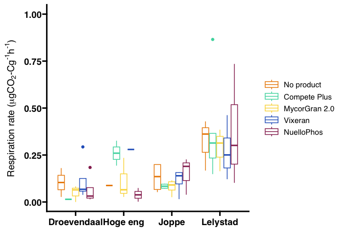<!-- -->

## 4) Statistics

``` r
library(tidyverse)
```

    ## ── Attaching core tidyverse packages ──────────────────────── tidyverse 2.0.0 ──
    ## ✔ forcats   1.0.0     ✔ readr     2.1.5
    ## ✔ lubridate 1.9.4     ✔ tibble    3.2.1
    ## ✔ purrr     1.0.4     
    ## ── Conflicts ────────────────────────────────────────── tidyverse_conflicts() ──
    ## ✖ gridExtra::combine() masks dplyr::combine()
    ## ✖ plotly::filter()     masks dplyr::filter(), stats::filter()
    ## ✖ dplyr::lag()         masks stats::lag()
    ## ℹ Use the conflicted package (<http://conflicted.r-lib.org/>) to force all conflicts to become errors

``` r
library(agricolae)

anova <- aov(Respiration_rate ~ plant * treatment * soil, data = working_data)
summary(anova)
```

    ##                       Df Sum Sq Mean Sq F value  Pr(>F)    
    ## plant                  2  3.535  1.7675  18.661 5.3e-08 ***
    ## treatment              4  0.124  0.0310   0.327   0.859    
    ## soil                   3  5.680  1.8934  19.991 4.9e-11 ***
    ## plant:treatment        8  0.158  0.0197   0.208   0.989    
    ## plant:soil             6  0.876  0.1460   1.541   0.168    
    ## treatment:soil        12  0.367  0.0306   0.323   0.984    
    ## plant:treatment:soil  24  0.583  0.0243   0.256   1.000    
    ## Residuals            158 14.965  0.0947                    
    ## ---
    ## Signif. codes:  0 '***' 0.001 '**' 0.01 '*' 0.05 '.' 0.1 ' ' 1

``` r
# Check assumptions (important!)
# a. Normality of residuals
plot(anova, 2) # Q-Q plot
```

    ## Warning: not plotting observations with leverage one:
    ##   99

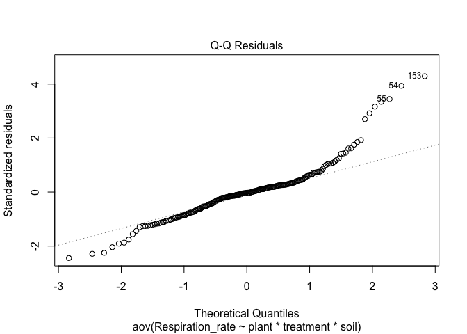<!-- -->

``` r
# b. Homogeneity of variance (Levene's test)
library(car)
```

    ## Loading required package: carData
    ## 
    ## Attaching package: 'car'
    ## 
    ## The following object is masked from 'package:purrr':
    ## 
    ##     some
    ## 
    ## The following object is masked from 'package:gtools':
    ## 
    ##     logit
    ## 
    ## The following object is masked from 'package:dplyr':
    ## 
    ##     recode

``` r
leveneTest(Respiration_rate ~ plant * treatment * soil, data = working_data)
```

    ## Levene's Test for Homogeneity of Variance (center = median)
    ##        Df F value Pr(>F)
    ## group  59  1.0849 0.3403
    ##       158

``` r
# Example: Tukey for treatment, assuming it was significant in the ANOVA
# HSD.test(working_data, "treatment", alpha=0.05)

# length(unique(working_samples$sample)) # How many unique samples are present in the final dataset?
unique(working_data$plant)
```

    ## [1] "Bare soil"   "Faba bean"   "Mixed grass"
